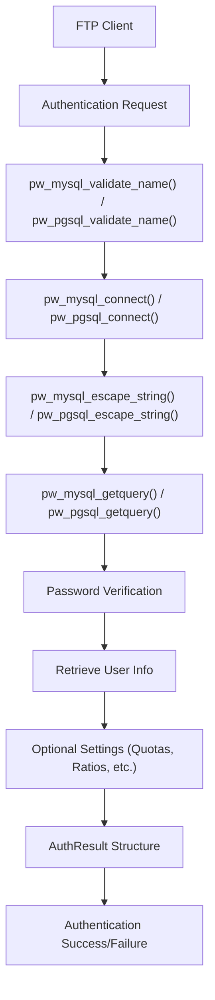
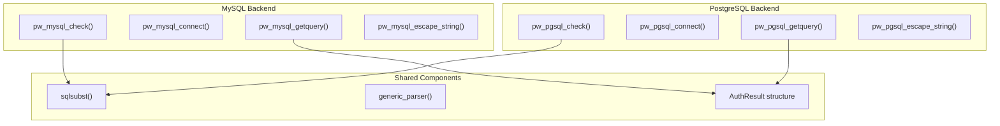
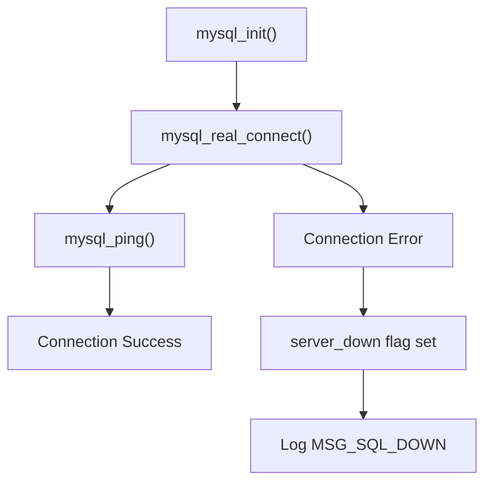
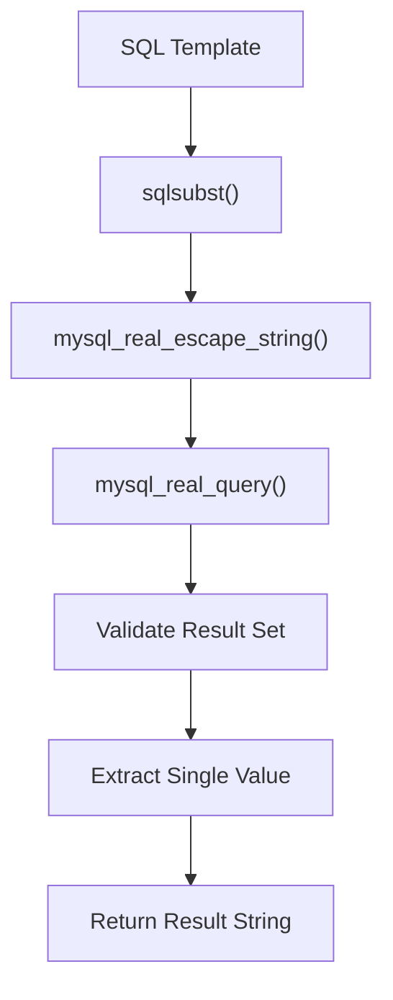
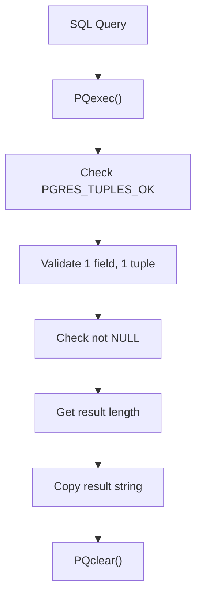
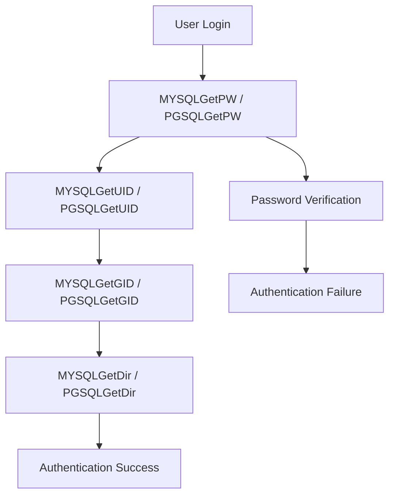
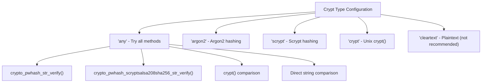
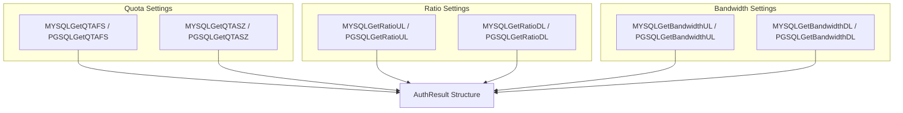

# Database Authentication

> **Relevant source files**
> * [README.LDAP](https://github.com/jedisct1/pure-ftpd/blob/3818577a/README.LDAP)
> * [README.MySQL](https://github.com/jedisct1/pure-ftpd/blob/3818577a/README.MySQL)
> * [README.PGSQL](https://github.com/jedisct1/pure-ftpd/blob/3818577a/README.PGSQL)
> * [src/log_mysql.c](https://github.com/jedisct1/pure-ftpd/blob/3818577a/src/log_mysql.c)
> * [src/log_pgsql.c](https://github.com/jedisct1/pure-ftpd/blob/3818577a/src/log_pgsql.c)

## Purpose and Scope

This document covers Pure-FTPd's SQL database authentication backends, specifically MySQL/MariaDB and PostgreSQL support. When database authentication is enabled, all user account information is retrieved from a central SQL database instead of system accounts or other authentication methods.

For information about Pure-FTPd's built-in virtual user database, see [Virtual Users with PureDB](/jedisct1/pure-ftpd/4.1-virtual-users-with-puredb). For LDAP directory authentication, see [LDAP Authentication](/jedisct1/pure-ftpd/4.3-ldap-authentication). For custom authentication scripts, see [External Authentication](/jedisct1/pure-ftpd/4.4-external-authentication).

## Authentication Architecture

Database authentication in Pure-FTPd uses a modular design where SQL queries are configured via template files and executed during the authentication process.

### Authentication Flow



Sources: [src/log_mysql.c L305-L599](https://github.com/jedisct1/pure-ftpd/blob/3818577a/src/log_mysql.c#L305-L599)

 [src/log_pgsql.c L384-L677](https://github.com/jedisct1/pure-ftpd/blob/3818577a/src/log_pgsql.c#L384-L677)

### Database Backend Architecture



Sources: [src/log_mysql.c L104-L196](https://github.com/jedisct1/pure-ftpd/blob/3818577a/src/log_mysql.c#L104-L196)

 [src/log_pgsql.c L103-L195](https://github.com/jedisct1/pure-ftpd/blob/3818577a/src/log_pgsql.c#L103-L195)

## MySQL/MariaDB Authentication

### Connection Management

The MySQL backend uses the `pw_mysql_connect()` function to establish database connections. It supports both TCP/IP connections and Unix domain sockets.



Key configuration parameters:

* `server` - MySQL server hostname or IP
* `port` - Connection port (default: 3306)
* `socket_path` - Unix socket path (alternative to TCP)
* `user` - Database username
* `pw` - Database password
* `db` - Database name

Sources: [src/log_mysql.c L199-L232](https://github.com/jedisct1/pure-ftpd/blob/3818577a/src/log_mysql.c#L199-L232)

### Query Execution and Security

The `pw_mysql_getquery()` function executes SQL queries with proper escaping to prevent SQL injection attacks.



Security measures implemented:

* Input validation via `pw_mysql_validate_name()` - only allows alphanumeric characters and common symbols
* SQL escaping using `mysql_real_escape_string()`
* Buffer overflow protection with canary values
* Single result validation (exactly 1 row, 1 column expected)

Sources: [src/log_mysql.c L22-L42](https://github.com/jedisct1/pure-ftpd/blob/3818577a/src/log_mysql.c#L22-L42)

 [src/log_mysql.c L44-L94](https://github.com/jedisct1/pure-ftpd/blob/3818577a/src/log_mysql.c#L44-L94)

 [src/log_mysql.c L243-L303](https://github.com/jedisct1/pure-ftpd/blob/3818577a/src/log_mysql.c#L243-L303)

## PostgreSQL Authentication

### Connection Management

PostgreSQL authentication uses `libpq` connection strings for database connectivity through `pw_pgsql_connect()`.

The connection string format includes:

* `host` - Server hostname
* `port` - Connection port (default: 5432)
* `dbname` - Database name
* `user` - Database username
* `password` - Database password

Connection string escaping is handled by `pw_pgsql_escape_conninfo()` to prevent injection in connection parameters.

Sources: [src/log_pgsql.c L267-L320](https://github.com/jedisct1/pure-ftpd/blob/3818577a/src/log_pgsql.c#L267-L320)

 [src/log_pgsql.c L241-L265](https://github.com/jedisct1/pure-ftpd/blob/3818577a/src/log_pgsql.c#L241-L265)

### Query Processing

PostgreSQL queries use `PQexec()` with result validation through `pw_pgsql_getquery()`.



Sources: [src/log_pgsql.c L339-L382](https://github.com/jedisct1/pure-ftpd/blob/3818577a/src/log_pgsql.c#L339-L382)

## Configuration File Format

Both MySQL and PostgreSQL use similar configuration file formats with backend-specific prefixes.

### MySQL Configuration Keywords

| Keyword | Purpose | Example |
| --- | --- | --- |
| `MYSQLServer` | Database server | `localhost` |
| `MYSQLPort` | Connection port | `3306` |
| `MYSQLSocket` | Unix socket path | `/tmp/mysql.sock` |
| `MYSQLUser` | Database username | `ftpuser` |
| `MYSQLPassword` | Database password | `secret` |
| `MYSQLDatabase` | Database name | `pureftpd` |
| `MYSQLCrypt` | Password encryption | `crypt`, `cleartext`, `any` |

### PostgreSQL Configuration Keywords

| Keyword | Purpose | Example |
| --- | --- | --- |
| `PGSQLServer` | Database server | `localhost` |
| `PGSQLPort` | Connection port | `5432` |
| `PGSQLUser` | Database username | `ftpuser` |
| `PGSQLPassword` | Database password | `secret` |
| `PGSQLDatabase` | Database name | `pureftpd` |
| `PGSQLCrypt` | Password encryption | `crypt`, `cleartext`, `any` |

Sources: [README.MySQL L52-L63](https://github.com/jedisct1/pure-ftpd/blob/3818577a/README.MySQL#L52-L63)

 [README.PGSQL L49-L58](https://github.com/jedisct1/pure-ftpd/blob/3818577a/README.PGSQL#L49-L58)

## SQL Query Templates and Substitution

### Template Variables

The `sqlsubst()` function processes template variables in SQL queries:

| Variable | Substitution | Description |
| --- | --- | --- |
| `\L` | Login name | User attempting authentication |
| `\I` | Server IP | IP address client connected to |
| `\P` | Server port | Port number client connected to |
| `\R` | Remote IP | IP address client connected from |
| `\D` | Decimal IP | IPv4 address as decimal number |

### Required Query Templates



Example query templates:

```sql
MYSQLGetPW      SELECT Password FROM users WHERE User="\L"
MYSQLGetUID     SELECT Uid FROM users WHERE User="\L"
MYSQLGetGID     SELECT Gid FROM users WHERE User="\L"
MYSQLGetDir     SELECT Dir FROM users WHERE User="\L"
```

Sources: [src/log_mysql.c L104-L196](https://github.com/jedisct1/pure-ftpd/blob/3818577a/src/log_mysql.c#L104-L196)

 [src/log_pgsql.c L103-L195](https://github.com/jedisct1/pure-ftpd/blob/3818577a/src/log_pgsql.c#L103-L195)

 [README.MySQL L123-L127](https://github.com/jedisct1/pure-ftpd/blob/3818577a/README.MySQL#L123-L127)

## Password Encryption Methods

### Supported Encryption Types

Both backends support multiple password encryption methods configured via the `Crypt` parameter:



### Password Verification Logic

The authentication process tries encryption methods in sequence:

1. **Argon2** (if libsodium available): `crypto_pwhash_str_verify()`
2. **Scrypt** (if libsodium available): `crypto_pwhash_scryptsalsa208sha256_str_verify()`
3. **Crypt**: Standard Unix `crypt()` function
4. **Plaintext**: Direct string comparison (discouraged)

Sources: [src/log_mysql.c L424-L466](https://github.com/jedisct1/pure-ftpd/blob/3818577a/src/log_mysql.c#L424-L466)

 [src/log_pgsql.c L501-L543](https://github.com/jedisct1/pure-ftpd/blob/3818577a/src/log_pgsql.c#L501-L543)

## Per-User Settings

### Optional Query Templates

Both backends support optional per-user settings retrieved via additional SQL queries:



### Setting Types

| Setting Type | Purpose | Units |
| --- | --- | --- |
| Quota Files | Maximum file count | Number of files |
| Quota Size | Maximum disk usage | Megabytes |
| Upload Ratio | Upload/download ratio | Ratio multiplier |
| Download Ratio | Download/upload ratio | Ratio multiplier |
| Upload Bandwidth | Upload speed limit | KB/second |
| Download Bandwidth | Download speed limit | KB/second |

Sources: [src/log_mysql.c L494-L564](https://github.com/jedisct1/pure-ftpd/blob/3818577a/src/log_mysql.c#L494-L564)

 [src/log_pgsql.c L571-L641](https://github.com/jedisct1/pure-ftpd/blob/3818577a/src/log_pgsql.c#L571-L641)

## Security Considerations

### Input Validation

Username validation via `pw_mysql_validate_name()` and `pw_pgsql_validate_name()` restricts allowed characters:

* Letters: A-Z, a-z
* Numbers: 0-9
* Special characters: space, -, _, ', ., :, @, +

### Root Account Protection

Both backends explicitly reject authentication for root users (UID/GID 0) to prevent privilege escalation if the database is compromised.

```
if (result->uid <= (uid_t) 0) {
    // Reject root accounts
    goto bye;
}
```

### SQL Injection Prevention

* All user input is escaped using database-specific functions
* Query templates use parameter substitution
* Buffer overflow protection with canary values
* Result set validation (single row, single column)

Sources: [src/log_mysql.c L469-L481](https://github.com/jedisct1/pure-ftpd/blob/3818577a/src/log_mysql.c#L469-L481)

 [src/log_pgsql.c L546-L558](https://github.com/jedisct1/pure-ftpd/blob/3818577a/src/log_pgsql.c#L546-L558)

 [README.MySQL L260-L265](https://github.com/jedisct1/pure-ftpd/blob/3818577a/README.MySQL#L260-L265)

 [README.PGSQL L215-L222](https://github.com/jedisct1/pure-ftpd/blob/3818577a/README.PGSQL#L215-L222)