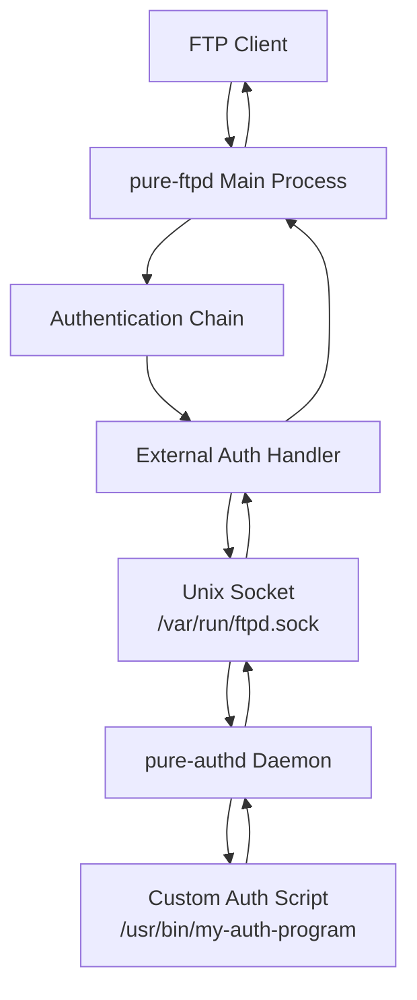
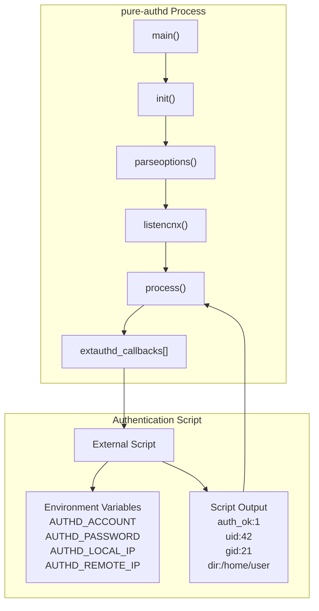
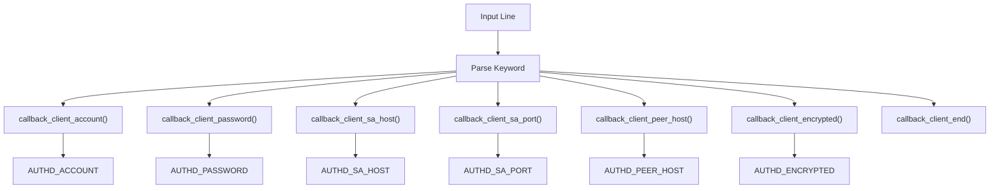
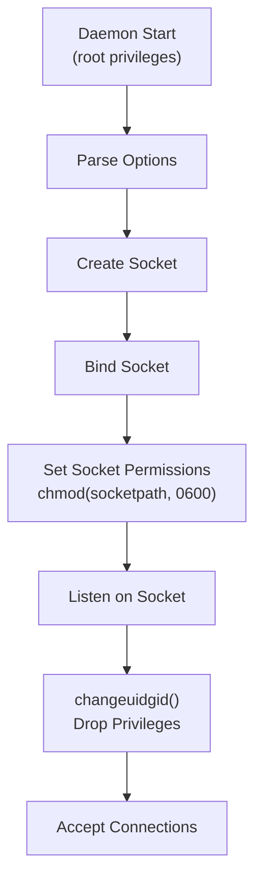
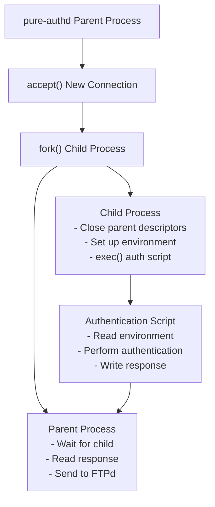
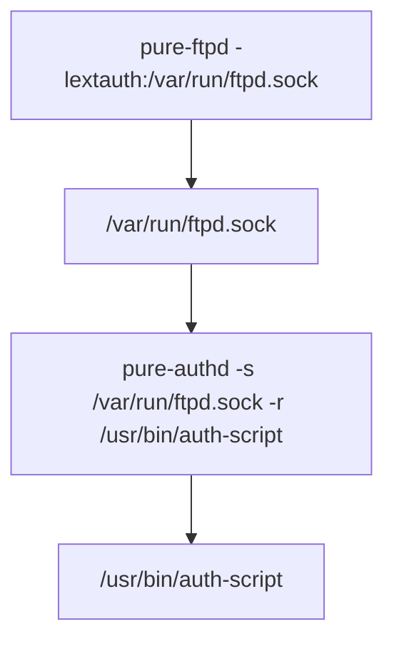

# External Authentication

> **Relevant source files**
> * [man/Makefile.am](https://github.com/jedisct1/pure-ftpd/blob/3818577a/man/Makefile.am)
> * [man/pure-authd.8.in](https://github.com/jedisct1/pure-ftpd/blob/3818577a/man/pure-authd.8.in)
> * [man/pure-ftpwho.8.in](https://github.com/jedisct1/pure-ftpd/blob/3818577a/man/pure-ftpwho.8.in)
> * [man/pure-pw.8.in](https://github.com/jedisct1/pure-ftpd/blob/3818577a/man/pure-pw.8.in)
> * [man/pure-pwconvert.8.in](https://github.com/jedisct1/pure-ftpd/blob/3818577a/man/pure-pwconvert.8.in)
> * [man/pure-quotacheck.8.in](https://github.com/jedisct1/pure-ftpd/blob/3818577a/man/pure-quotacheck.8.in)
> * [man/pure-statsdecode.8.in](https://github.com/jedisct1/pure-ftpd/blob/3818577a/man/pure-statsdecode.8.in)
> * [man/pure-uploadscript.8.in](https://github.com/jedisct1/pure-ftpd/blob/3818577a/man/pure-uploadscript.8.in)
> * [src/ftpwho-read.c](https://github.com/jedisct1/pure-ftpd/blob/3818577a/src/ftpwho-read.c)
> * [src/mysnprintf.c](https://github.com/jedisct1/pure-ftpd/blob/3818577a/src/mysnprintf.c)
> * [src/pure-authd.c](https://github.com/jedisct1/pure-ftpd/blob/3818577a/src/pure-authd.c)
> * [src/pure-certd.c](https://github.com/jedisct1/pure-ftpd/blob/3818577a/src/pure-certd.c)
> * [src/pure-ftpwho.c](https://github.com/jedisct1/pure-ftpd/blob/3818577a/src/pure-ftpwho.c)
> * [src/pure-uploadscript.c](https://github.com/jedisct1/pure-ftpd/blob/3818577a/src/pure-uploadscript.c)

This document covers Pure-FTPd's external authentication system, which allows custom authentication scripts to be integrated with the FTP server through the `pure-authd` daemon. For database-based authentication using SQL backends, see [Database Authentication](/jedisct1/pure-ftpd/4.2-database-authentication). For LDAP directory integration, see [LDAP Authentication](/jedisct1/pure-ftpd/4.3-ldap-authentication).

## Overview

Pure-FTPd's external authentication system provides a flexible framework for implementing custom authentication logic through external programs or scripts. This system operates through a dedicated daemon process (`pure-authd`) that acts as a bridge between the main FTP server and user-defined authentication scripts.



The external authentication system enables administrators to implement authentication against virtually any backend system by writing custom scripts that receive authentication parameters via environment variables and return user account information through a structured text protocol.

Sources: [src/pure-authd.c L1-L479](https://github.com/jedisct1/pure-ftpd/blob/3818577a/src/pure-authd.c#L1-L479)

 [man/pure-authd.8.in L1-L147](https://github.com/jedisct1/pure-ftpd/blob/3818577a/man/pure-authd.8.in#L1-L147)

## Architecture Components

### The pure-authd Daemon

The `pure-authd` daemon is the core component of the external authentication system. It runs as a separate process that listens on a Unix domain socket for authentication requests from the main FTP server.



The daemon operates with the following key functions:

* **Socket Management**: Creates and manages a Unix domain socket at a configurable path
* **Process Forking**: Forks child processes to execute authentication scripts
* **Protocol Parsing**: Parses incoming authentication requests and formats responses
* **Environment Setup**: Sets up environment variables for authentication scripts
* **Security**: Drops privileges and implements secure communication

Sources: [src/pure-authd.c L354-L414](https://github.com/jedisct1/pure-ftpd/blob/3818577a/src/pure-authd.c#L354-L414)

 [src/pure-authd.c L428-L477](https://github.com/jedisct1/pure-ftpd/blob/3818577a/src/pure-authd.c#L428-L477)

### Authentication Protocol

The external authentication system uses a text-based protocol over Unix sockets. The communication flow involves structured messages with specific keywords and values.

| Phase | Direction | Format | Description |
| --- | --- | --- | --- |
| Request | FTPd → pure-authd | `account:username\npassword:secret\nlocalhost:192.168.1.1\nlocalport:21\npeer:192.168.1.100\nend\n` | Authentication request |
| Processing | pure-authd → script | Environment variables | Script receives data via environment |
| Response | script → pure-authd | `auth_ok:1\nuid:1000\ngid:1000\ndir:/home/user\nend\n` | Script returns user information |
| Reply | pure-authd → FTPd | Structured response | Authentication result |

The protocol parsing is handled by callback functions that process each line of the incoming request:



Sources: [src/pure-authd.c L236-L278](https://github.com/jedisct1/pure-ftpd/blob/3818577a/src/pure-authd.c#L236-L278)

 [src/pure-authd.c L320-L351](https://github.com/jedisct1/pure-ftpd/blob/3818577a/src/pure-authd.c#L320-L351)

## Configuration and Setup

### Daemon Configuration

The `pure-authd` daemon accepts several command-line options for configuration:

| Option | Description | Example |
| --- | --- | --- |
| `-s` | Unix socket path | `-s /var/run/ftpd.sock` |
| `-r` | Authentication script path | `-r /usr/bin/my-auth-program` |
| `-u` | User ID to run as | `-u 99` |
| `-g` | Group ID to run as | `-g 99` |
| `-B` | Run in background (daemonize) | `-B` |
| `-p` | PID file path | `-p /var/run/pure-authd.pid` |

The daemon performs privilege separation by changing its UID/GID after initialization but before processing requests:



Sources: [src/pure-authd.c L102-L174](https://github.com/jedisct1/pure-ftpd/blob/3818577a/src/pure-authd.c#L102-L174)

 [src/pure-authd.c L176-L189](https://github.com/jedisct1/pure-ftpd/blob/3818577a/src/pure-authd.c#L176-L189)

 [src/pure-authd.c L354-L414](https://github.com/jedisct1/pure-ftpd/blob/3818577a/src/pure-authd.c#L354-L414)

### Authentication Script Interface

Authentication scripts receive input through environment variables and must output structured text to stdout. The script interface is designed to be language-agnostic:

**Environment Variables Available to Scripts:**

* `AUTHD_ACCOUNT`: The username attempting to authenticate
* `AUTHD_PASSWORD`: The provided password
* `AUTHD_SA_HOST`: Local server IP address
* `AUTHD_SA_PORT`: Local server port
* `AUTHD_PEER_HOST`: Remote client IP address
* `AUTHD_ENCRYPTED`: Whether the connection uses TLS (1 or 0)

**Required Script Output Format:**

```yaml
auth_ok:1
uid:1000
gid:1000
dir:/home/username
end
```

**Optional Script Output Fields:**

* `slow_tilde_expansion:1` - Controls `~user` expansion behavior
* `throttling_bandwidth_ul:102400` - Upload bandwidth limit (bytes/sec)
* `throttling_bandwidth_dl:204800` - Download bandwidth limit (bytes/sec)
* `user_quota_size:1073741824` - Total size quota (bytes)
* `user_quota_files:10000` - File count quota
* `ratio_upload:1` - Upload ratio numerator
* `ratio_download:3` - Download ratio denominator

Sources: [src/pure-authd.c L191-L210](https://github.com/jedisct1/pure-ftpd/blob/3818577a/src/pure-authd.c#L191-L210)

 [man/pure-authd.8.in L29-L87](https://github.com/jedisct1/pure-ftpd/blob/3818577a/man/pure-authd.8.in#L29-L87)

## Process Management and Security

### Process Forking and Isolation

The `pure-authd` daemon implements a secure process model where each authentication request is handled by a separate child process:



The child process setup involves several security measures:

1. **Descriptor Cleanup**: All unnecessary file descriptors are closed
2. **Environment Setup**: Only required environment variables are set
3. **Privilege Context**: Process runs with dropped privileges
4. **Timeout Protection**: Script execution is subject to timeout limits

Sources: [src/pure-authd.c L279-L352](https://github.com/jedisct1/pure-ftpd/blob/3818577a/src/pure-authd.c#L279-L352)

 [src/pure-authd.c L24-L52](https://github.com/jedisct1/pure-ftpd/blob/3818577a/src/pure-authd.c#L24-L52)

### Security Considerations

The external authentication system implements several security mechanisms:

**Socket Security:**

* Unix domain sockets with restrictive permissions (0600)
* Socket ownership verification
* Path validation to prevent symlink attacks

**Process Security:**

* Mandatory privilege dropping after initialization
* Process isolation through forking
* Resource limits and timeouts on authentication scripts
* Descriptor separation between parent and child processes

**Input Validation:**

* Protocol parsing with bounds checking
* Environment variable sanitization
* Path validation for script execution

Sources: [src/pure-authd.c L354-L414](https://github.com/jedisct1/pure-ftpd/blob/3818577a/src/pure-authd.c#L354-L414)

 [src/pure-authd.c L176-L189](https://github.com/jedisct1/pure-ftpd/blob/3818577a/src/pure-authd.c#L176-L189)

## Integration with Pure-FTPd

The external authentication system integrates with Pure-FTPd's authentication chain through the `-lextauth` command-line option. When configured, Pure-FTPd will attempt to authenticate users by connecting to the specified Unix socket and following the authentication protocol.



The authentication result affects the overall authentication chain behavior:

* `auth_ok:1` - User authenticated successfully, use provided account information
* `auth_ok:0` - User not found, try next authentication method in chain
* `auth_ok:-1` - Authentication failed, reject login (don't try other methods)

Sources: [man/pure-authd.8.in L56-L58](https://github.com/jedisct1/pure-ftpd/blob/3818577a/man/pure-authd.8.in#L56-L58)

 [src/pure-authd.c L1-L13](https://github.com/jedisct1/pure-ftpd/blob/3818577a/src/pure-authd.c#L1-L13)