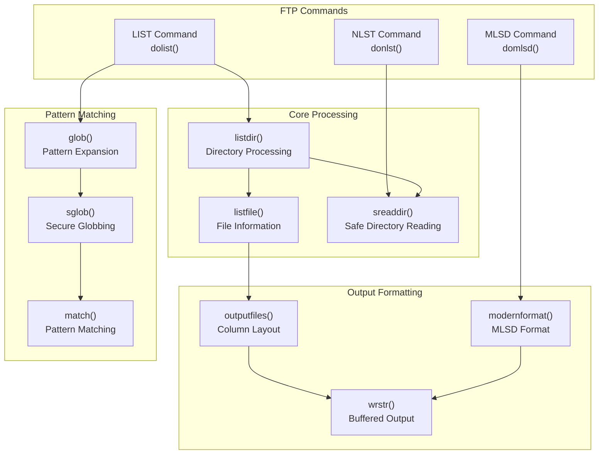
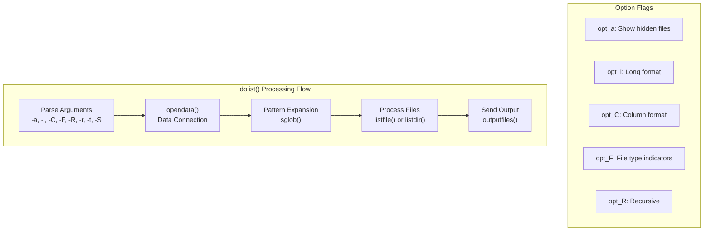
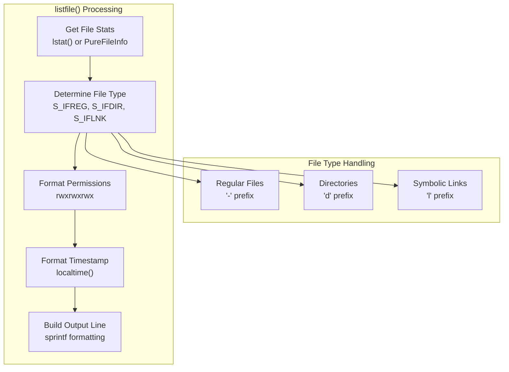
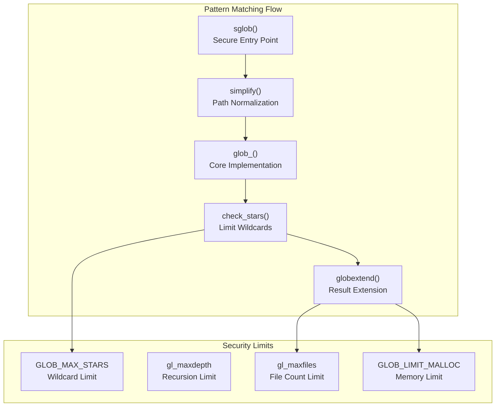
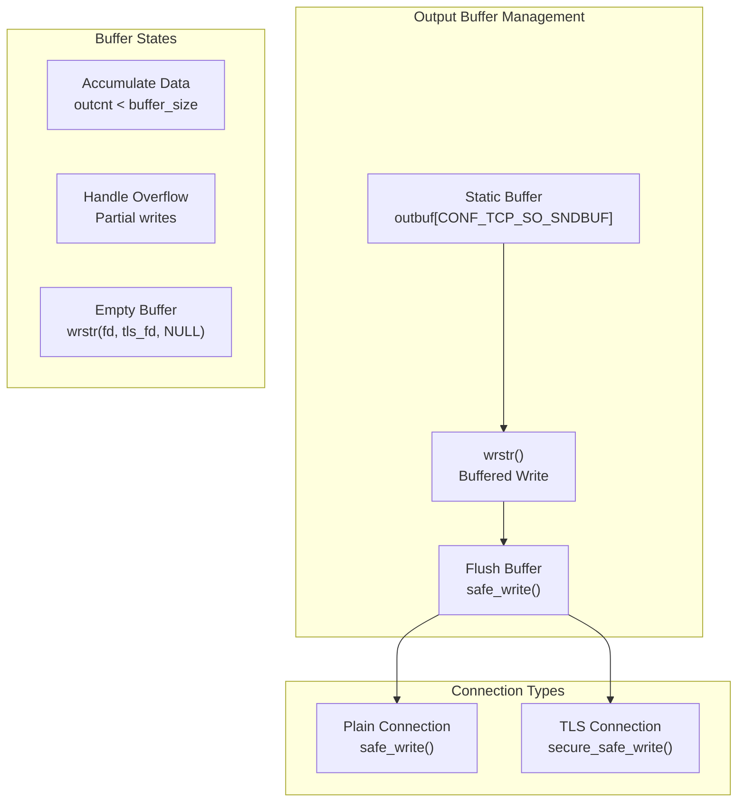

# File Operations and Directory Listings

> **Relevant source files**
> * [src/bsd-glob.c](https://github.com/jedisct1/pure-ftpd/blob/3818577a/src/bsd-glob.c)
> * [src/bsd-glob.h](https://github.com/jedisct1/pure-ftpd/blob/3818577a/src/bsd-glob.h)
> * [src/bsd-realpath.h](https://github.com/jedisct1/pure-ftpd/blob/3818577a/src/bsd-realpath.h)
> * [src/ls.c](https://github.com/jedisct1/pure-ftpd/blob/3818577a/src/ls.c)

This document covers Pure-FTPd's file and directory listing functionality, including the implementation of FTP commands like `LIST`, `NLST`, and `MLSD`. It details how the server processes directory contents, applies pattern matching, formats output, and handles security restrictions.

For authentication and user management, see [Authentication and User Management](/jedisct1/pure-ftpd/4-authentication-and-user-management). For the main server process and command handling, see [Main Server Process](/jedisct1/pure-ftpd/2.1-main-server-process).

## Overview

Pure-FTPd's file operations system provides comprehensive directory listing capabilities with support for various FTP listing commands, pattern matching through glob expressions, and security-conscious file enumeration. The system is designed to handle large directories efficiently while preventing resource exhaustion attacks.

**Sources:** [src/ls.c L755-L960](https://github.com/jedisct1/pure-ftpd/blob/3818577a/src/ls.c#L755-L960)

 [src/ls.c L962-L1040](https://github.com/jedisct1/pure-ftpd/blob/3818577a/src/ls.c#L962-L1040)

 [src/ls.c L1043-L1107](https://github.com/jedisct1/pure-ftpd/blob/3818577a/src/ls.c#L1043-L1107)

 [src/bsd-glob.c L225-L238](https://github.com/jedisct1/pure-ftpd/blob/3818577a/src/bsd-glob.c#L225-L238)

## Directory Listing Commands

### LIST Command Implementation

The `dolist()` function implements the FTP `LIST` command, providing detailed file information in Unix `ls -l` format. It supports various command-line options and handles both individual files and directory recursion.

The function processes command-line options stored in global variables:

* `opt_a`: Show hidden files (starting with '.')
* `opt_l`: Long format with detailed file information
* `opt_C`: Multi-column format
* `opt_F`: Add file type indicators (/, *, @)
* `opt_R`: Recursive directory listing
* `opt_r`: Reverse sorting order
* `opt_t`: Sort by modification time
* `opt_S`: Sort by file size

**Sources:** [src/ls.c L755-L960](https://github.com/jedisct1/pure-ftpd/blob/3818577a/src/ls.c#L755-L960)

 [src/ls.c L762-L814](https://github.com/jedisct1/pure-ftpd/blob/3818577a/src/ls.c#L762-L814)

### NLST and MLSD Commands

The `donlst()` function provides simple filename listings without detailed information, while `domlsd()` implements the modern MLSD format with structured file metadata.

| Command | Function | Output Format | Use Case |
| --- | --- | --- | --- |
| LIST | `dolist()` | Unix ls -l format | Human-readable listings |
| NLST | `donlst()` | Simple filenames only | Programmatic file lists |
| MLSD | `domlsd()` | Machine-readable format | Modern FTP clients |

**Sources:** [src/ls.c L962-L1040](https://github.com/jedisct1/pure-ftpd/blob/3818577a/src/ls.c#L962-L1040)

 [src/ls.c L1043-L1107](https://github.com/jedisct1/pure-ftpd/blob/3818577a/src/ls.c#L1043-L1107)

## File Information Processing

### File Metadata Collection

The `listfile()` function extracts and formats file information, handling various file types and permission displays. It builds detailed output strings for the LIST command format.

The function handles special cases like symbolic links and applies compatibility fixes for certain clients. It also manages user/group name resolution through caching mechanisms.

**Sources:** [src/ls.c L234-L421](https://github.com/jedisct1/pure-ftpd/blob/3818577a/src/ls.c#L234-L421)

 [src/ls.c L296-L413](https://github.com/jedisct1/pure-ftpd/blob/3818577a/src/ls.c#L296-L413)

### Directory Scanning

The `sreaddir()` function safely reads directory contents with built-in sorting and security limits. It allocates dynamic storage for file information and applies user-specified sorting criteria.

**Sources:** [src/ls.c L555-L654](https://github.com/jedisct1/pure-ftpd/blob/3818577a/src/ls.c#L555-L654)

 [src/ls.c L634-L651](https://github.com/jedisct1/pure-ftpd/blob/3818577a/src/ls.c#L634-L651)

## Pattern Matching and Globbing

### Glob Implementation

The globbing system provides secure pattern matching with built-in limits to prevent resource exhaustion. The `sglob()` function serves as a secure wrapper around the standard `glob()` functionality.

Key security features:

* `GLOB_MAX_STARS`: Limits consecutive asterisk wildcards to prevent exponential matching
* `gl_maxfiles`: Restricts total number of matching files
* `gl_maxdepth`: Prevents excessive recursion depth
* `GLOB_LIMIT_MALLOC`: Controls memory allocation limits

**Sources:** [src/bsd-glob.c L148-L159](https://github.com/jedisct1/pure-ftpd/blob/3818577a/src/bsd-glob.c#L148-L159)

 [src/bsd-glob.c L233-L238](https://github.com/jedisct1/pure-ftpd/blob/3818577a/src/bsd-glob.c#L233-L238)

 [src/bsd-glob.c L705-L804](https://github.com/jedisct1/pure-ftpd/blob/3818577a/src/bsd-glob.c#L705-L804)

### Pattern Matching Algorithm

The `match()` function implements recursive pattern matching with support for wildcards, character classes, and ranges. It uses controlled recursion to prevent stack overflow attacks.

**Sources:** [src/bsd-glob.c L810-L870](https://github.com/jedisct1/pure-ftpd/blob/3818577a/src/bsd-glob.c#L810-L870)

## Output Formatting and Buffering

### Buffered Output System

The `wrstr()` function provides efficient buffered output for directory listings, supporting both plain connections and TLS-encrypted data channels.

The buffering system optimizes network performance by reducing the number of system calls and handles both partial writes and buffer overflow conditions gracefully.

**Sources:** [src/ls.c L19-L100](https://github.com/jedisct1/pure-ftpd/blob/3818577a/src/ls.c#L19-L100)

### Column Layout

The `outputfiles()` function formats file listings in multi-column layout when appropriate, calculating optimal column widths and handling line wrapping.

**Sources:** [src/ls.c L423-L508](https://github.com/jedisct1/pure-ftpd/blob/3818577a/src/ls.c#L423-L508)

## Security Considerations

### Resource Limits

Pure-FTPd implements several security measures to prevent denial-of-service attacks through directory operations:

| Limit | Global Variable | Purpose |
| --- | --- | --- |
| Maximum files | `max_ls_files` | Prevents memory exhaustion |
| Maximum depth | `max_ls_depth` | Limits recursion depth |
| Glob timeout | `GLOB_TIMEOUT` | Prevents long-running patterns |
| Star limit | `GLOB_MAX_STARS` | Reduces pattern complexity |

**Sources:** [src/ls.c L668-L669](https://github.com/jedisct1/pure-ftpd/blob/3818577a/src/ls.c#L668-L669)

 [src/bsd-glob.c L113-L115](https://github.com/jedisct1/pure-ftpd/blob/3818577a/src/bsd-glob.c#L113-L115)

### Path Sanitization

The system includes path normalization through the `simplify()` function and printable character checking via `checkprintable()` to prevent path traversal attacks and ensure clean output.

**Sources:** [src/ls.c L585](https://github.com/jedisct1/pure-ftpd/blob/3818577a/src/ls.c#L585-L585)

 [src/ls.c L1005](https://github.com/jedisct1/pure-ftpd/blob/3818577a/src/ls.c#L1005-L1005)

 [src/ls.c L1081](https://github.com/jedisct1/pure-ftpd/blob/3818577a/src/ls.c#L1081-L1081)

## Integration with Core Server

The file operations system integrates with Pure-FTPd's core through the main command processing loop, data connection management, and TLS encryption support. It respects user permissions, chroot restrictions, and quota limitations established during authentication.

**Sources:** [src/ls.c L755-L960](https://github.com/jedisct1/pure-ftpd/blob/3818577a/src/ls.c#L755-L960)

 [src/ls.c L815-L840](https://github.com/jedisct1/pure-ftpd/blob/3818577a/src/ls.c#L815-L840)

 [src/ls.c L993-L1003](https://github.com/jedisct1/pure-ftpd/blob/3818577a/src/ls.c#L993-L1003)