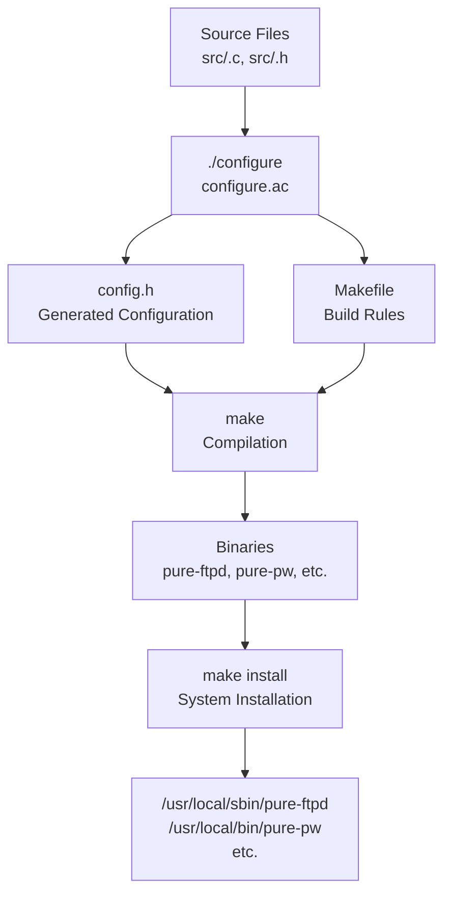
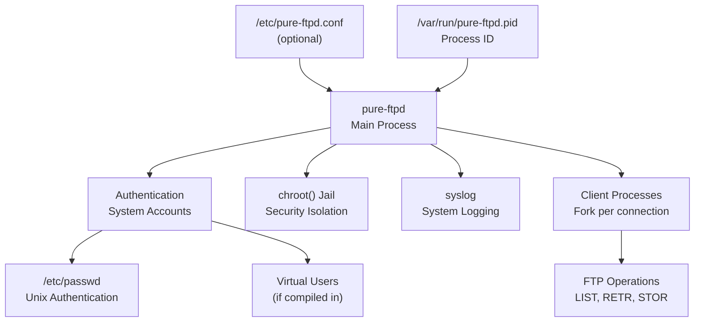

# Getting Started

> **Relevant source files**
> * [COPYING](https://github.com/jedisct1/pure-ftpd/blob/3818577a/COPYING)
> * [Makefile.am](https://github.com/jedisct1/pure-ftpd/blob/3818577a/Makefile.am)
> * [README](https://github.com/jedisct1/pure-ftpd/blob/3818577a/README)
> * [configure.ac](https://github.com/jedisct1/pure-ftpd/blob/3818577a/configure.ac)
> * [man/pure-ftpd.8.in](https://github.com/jedisct1/pure-ftpd/blob/3818577a/man/pure-ftpd.8.in)
> * [man/pure-mrtginfo.8.in](https://github.com/jedisct1/pure-ftpd/blob/3818577a/man/pure-mrtginfo.8.in)

This document covers the basic installation, compilation, and initial configuration of Pure-FTPd. It provides the essential steps to get a working FTP server running quickly with default settings.

For advanced configuration options and runtime behavior, see [Runtime Configuration](/jedisct1/pure-ftpd/5.2-runtime-configuration). For detailed build system information, see [Build System and Compilation](/jedisct1/pure-ftpd/5.1-build-system-and-compilation). For security features and hardening, see [Security Features](/jedisct1/pure-ftpd/3-security-features).

## Overview

Pure-FTPd is a secure, production-ready FTP server designed for simplicity and security. The basic installation process involves compiling from source using the autotools build system, then running the standalone server daemon.

## Prerequisites

Before compilation, ensure your system has:

* A C compiler (GCC recommended)
* Standard development tools (`make`, autotools)
* Optional: OpenSSL development libraries for TLS support
* Optional: Database client libraries (MySQL, PostgreSQL) for SQL authentication

## Quick Start Installation

### Step 1: Create System User (Recommended)

Create a dedicated unprivileged user for the FTP server:

```
groupadd _pure-ftpd
useradd -g _pure-ftpd -d /var/empty -s /etc _pure-ftpd
```

### Step 2: Basic Compilation

The simplest compilation uses default options:

```
./configure
make install-strip
```

This installs the server to `/usr/local/sbin/pure-ftpd` with basic functionality enabled.

**Sources:** [configure.ac L1-L15](https://github.com/jedisct1/pure-ftpd/blob/3818577a/configure.ac#L1-L15)

 [README L58-L91](https://github.com/jedisct1/pure-ftpd/blob/3818577a/README#L58-L91)

### Step 3: Launch Server

Start the server in standalone mode:

```
/usr/local/sbin/pure-ftpd &
```

The server will listen on port 21 for incoming FTP connections on all interfaces.

## Build Process Flow



**Sources:** [configure.ac L1-L50](https://github.com/jedisct1/pure-ftpd/blob/3818577a/configure.ac#L1-L50)

 [Makefile.am L40-L46](https://github.com/jedisct1/pure-ftpd/blob/3818577a/Makefile.am#L40-L46)

## Configuration Options Overview

The build system supports numerous compile-time options via `./configure` flags. Key categories include:

| Category | Examples | Purpose |
| --- | --- | --- |
| Authentication | `--with-mysql`, `--with-ldap`, `--with-pam` | Enable database/directory authentication |
| Security | `--with-tls`, `--with-privsep` | Enable encryption and privilege separation |
| Features | `--with-quotas`, `--with-throttling` | Enable advanced FTP features |
| Logging | `--with-altlog`, `--with-ftpwho` | Enable alternative logging formats |

**Sources:** [configure.ac L285-L891](https://github.com/jedisct1/pure-ftpd/blob/3818577a/configure.ac#L285-L891)

 [README L102-L436](https://github.com/jedisct1/pure-ftpd/blob/3818577a/README#L102-L436)

## Runtime Architecture



**Sources:** [README L454-L467](https://github.com/jedisct1/pure-ftpd/blob/3818577a/README#L454-L467)

 [man/pure-ftpd.8.in L133-L144](https://github.com/jedisct1/pure-ftpd/blob/3818577a/man/pure-ftpd.8.in#L133-L144)

## Basic Configuration

### Command Line Options

Pure-FTPd accepts numerous command-line options. Common ones include:

* `-c <num>`: Maximum number of simultaneous connections (default: 50)
* `-C <num>`: Maximum connections per IP address
* `-A`: chroot all users except root
* `-H`: Don't resolve hostnames (faster connections)
* `-B`: Run in background (daemon mode)

Example with restrictions:

```
/usr/local/sbin/pure-ftpd -c 30 -C 5 -A -H -B
```

### Configuration File

Alternatively, use a configuration file approach:

```
/usr/local/sbin/pure-ftpd /etc/pure-ftpd.conf
```

**Sources:** [man/pure-ftpd.8.in L145-L570](https://github.com/jedisct1/pure-ftpd/blob/3818577a/man/pure-ftpd.8.in#L145-L570)

 [README L615-L712](https://github.com/jedisct1/pure-ftpd/blob/3818577a/README#L615-L712)

## Testing the Installation

### Basic Connection Test

Test the server locally:

```
ftp localhost
```

You should see the Pure-FTPd login banner. Try logging in with a system account.

### Process Verification

Check that the server is running:

```
ps auxw | grep pure-ftpd
```

Expected output shows the main server process and any connected clients:

```
root  15211  0.1  0.3  1276  452 ?  S  13:53  0:00 pure-ftpd [SERVER]
```

### Port Verification

Confirm the server is listening on port 21:

```
netstat -tlnp | grep :21
```

**Sources:** [README L83-L91](https://github.com/jedisct1/pure-ftpd/blob/3818577a/README#L83-L91)

 [README L454-L467](https://github.com/jedisct1/pure-ftpd/blob/3818577a/README#L454-L467)

## Troubleshooting

### Permission Issues

If you encounter permission errors:

* Ensure the `_pure-ftpd` user exists
* Check that `/var/empty` directory exists
* Verify the binary has appropriate permissions

### Connection Refused

If clients cannot connect:

* Check firewall settings allow port 21
* Verify the server is bound to the correct interface
* Use `-S` option to specify bind address if needed

## Next Steps

After basic installation:

1. **Security Configuration**: Enable TLS encryption and configure authentication - see [TLS/SSL Encryption](/jedisct1/pure-ftpd/3.1-tlsssl-encryption)
2. **User Management**: Set up virtual users with PureDB - see [Virtual Users with PureDB](/jedisct1/pure-ftpd/4.1-virtual-users-with-puredb)
3. **Advanced Features**: Configure quotas, logging, and monitoring - see [Configuration and Administration](/jedisct1/pure-ftpd/5-configuration-and-administration)
4. **Production Deployment**: Review security hardening and performance tuning options

**Sources:** [README L74-L91](https://github.com/jedisct1/pure-ftpd/blob/3818577a/README#L74-L91)

 [configure.ac L4-L15](https://github.com/jedisct1/pure-ftpd/blob/3818577a/configure.ac#L4-L15)

 [man/pure-ftpd.8.in L8-L15](https://github.com/jedisct1/pure-ftpd/blob/3818577a/man/pure-ftpd.8.in#L8-L15)