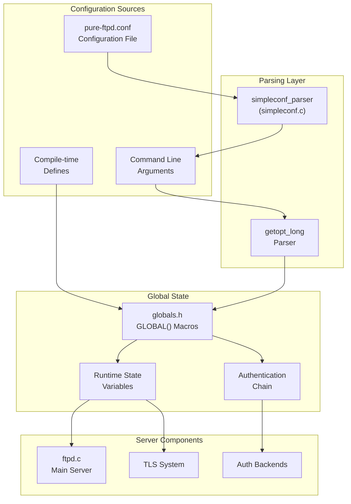
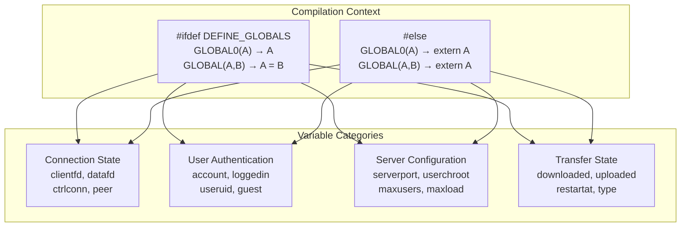
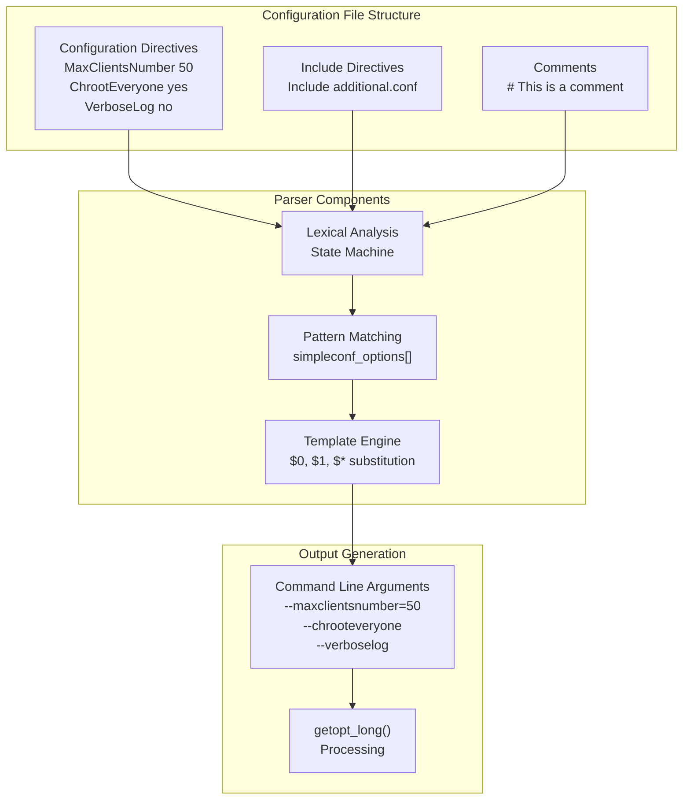
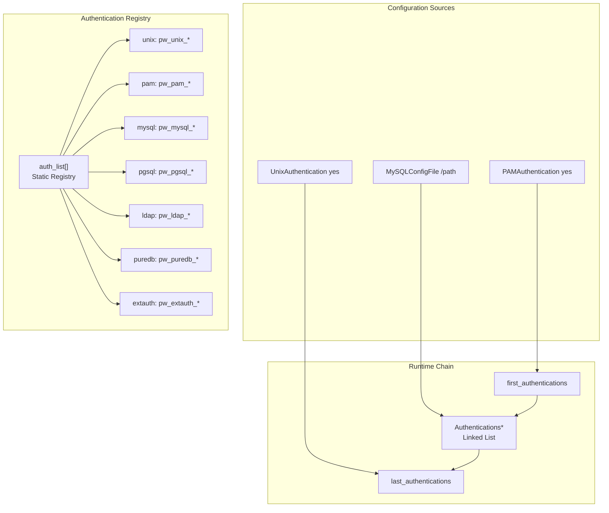
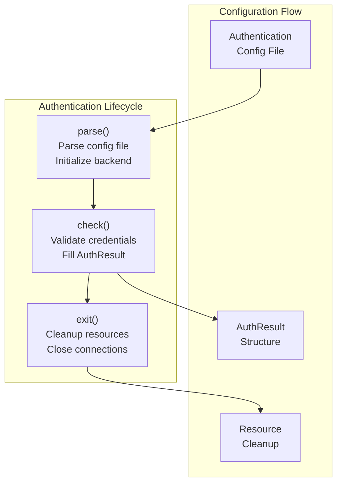
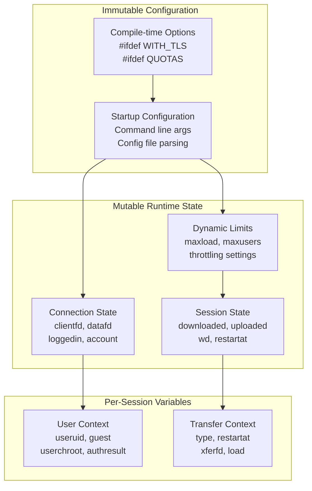
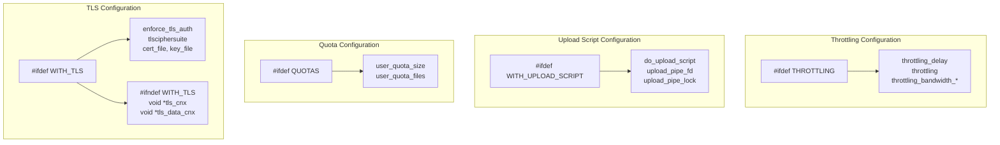

# Global Configuration System

> **Relevant source files**
> * [pure-ftpd.conf.in](https://github.com/jedisct1/pure-ftpd/blob/3818577a/pure-ftpd.conf.in)
> * [src/ftpd_p.h](https://github.com/jedisct1/pure-ftpd/blob/3818577a/src/ftpd_p.h)
> * [src/globals.h](https://github.com/jedisct1/pure-ftpd/blob/3818577a/src/globals.h)
> * [src/simpleconf.c](https://github.com/jedisct1/pure-ftpd/blob/3818577a/src/simpleconf.c)
> * [src/simpleconf.h](https://github.com/jedisct1/pure-ftpd/blob/3818577a/src/simpleconf.h)
> * [src/simpleconf_ftpd.h](https://github.com/jedisct1/pure-ftpd/blob/3818577a/src/simpleconf_ftpd.h)

This document covers Pure-FTPd's global configuration management system, including how configuration variables are defined, parsed, and managed throughout the server's lifecycle. The system handles both compile-time configuration options and runtime configuration from files and command-line arguments.

For information about build-time configuration and compilation options, see [Build System and Compilation](/jedisct1/pure-ftpd/5.1-build-system-and-compilation). For runtime configuration files and administrative setup, see [Runtime Configuration](/jedisct1/pure-ftpd/5.2-runtime-configuration).

## Overview

Pure-FTPd's global configuration system consists of several interconnected components:

* **Global Variables System**: Centralized variable definitions using preprocessor macros
* **SimpleConf Parser**: Configuration file parser that converts `.conf` files to command-line arguments
* **Authentication Chain Configuration**: Dynamic configuration of authentication methods
* **Runtime State Management**: Management of server state and configuration updates

Sources: [src/globals.h L1-L201](https://github.com/jedisct1/pure-ftpd/blob/3818577a/src/globals.h#L1-L201)

 [src/simpleconf.c L1-L743](https://github.com/jedisct1/pure-ftpd/blob/3818577a/src/simpleconf.c#L1-L743)

 [src/ftpd_p.h L1-L365](https://github.com/jedisct1/pure-ftpd/blob/3818577a/src/ftpd_p.h#L1-L365)

## Global Variables System

Pure-FTPd uses a centralized global variables system defined in `globals.h` that employs preprocessor macros to declare variables that can be shared across the entire codebase.

### GLOBAL Macro System

The system uses two primary macros to define global variables:

| Macro | Purpose | Usage |
| --- | --- | --- |
| `GLOBAL0(A)` | Declares uninitialized global variable | `GLOBAL0(signed char debug);` |
| `GLOBAL(A, B)` | Declares initialized global variable | `GLOBAL(int clientfd, 0);` |

The macros expand differently based on the `DEFINE_GLOBALS` preprocessor flag:

Sources: [src/globals.h L4-L10](https://github.com/jedisct1/pure-ftpd/blob/3818577a/src/globals.h#L4-L10)

 [src/globals.h L12-L200](https://github.com/jedisct1/pure-ftpd/blob/3818577a/src/globals.h#L12-L200)

### Key Configuration Categories

The global variables are organized into several functional categories:

**Connection Management:**

* `clientfd` - Command connection file descriptor [src/globals.h L28](https://github.com/jedisct1/pure-ftpd/blob/3818577a/src/globals.h#L28-L28)
* `datafd` - Data connection file descriptor [src/globals.h L29](https://github.com/jedisct1/pure-ftpd/blob/3818577a/src/globals.h#L29-L29)
* `ctrlconn` - Control connection socket address [src/globals.h L30-L31](https://github.com/jedisct1/pure-ftpd/blob/3818577a/src/globals.h#L30-L31)

**User Authentication and Authorization:**

* `account` - User login name [src/globals.h L39](https://github.com/jedisct1/pure-ftpd/blob/3818577a/src/globals.h#L39-L39)
* `loggedin` - Login status flag [src/globals.h L38](https://github.com/jedisct1/pure-ftpd/blob/3818577a/src/globals.h#L38-L38)
* `useruid` - Minimum allowed UID [src/globals.h L51](https://github.com/jedisct1/pure-ftpd/blob/3818577a/src/globals.h#L51-L51)
* `guest` - Guest user flag [src/globals.h L50](https://github.com/jedisct1/pure-ftpd/blob/3818577a/src/globals.h#L50-L50)

**Server Behavior Configuration:**

* `userchroot` - Chroot behavior settings [src/globals.h L42-L44](https://github.com/jedisct1/pure-ftpd/blob/3818577a/src/globals.h#L42-L44)
* `maxusers` - Maximum concurrent users [src/globals.h L90](https://github.com/jedisct1/pure-ftpd/blob/3818577a/src/globals.h#L90-L90)
* `maxload` - Maximum system load threshold [src/globals.h L89](https://github.com/jedisct1/pure-ftpd/blob/3818577a/src/globals.h#L89-L89)
* `throttling_bandwidth_dl/ul` - Bandwidth limits [src/globals.h L24-L25](https://github.com/jedisct1/pure-ftpd/blob/3818577a/src/globals.h#L24-L25)

Sources: [src/globals.h L28-L200](https://github.com/jedisct1/pure-ftpd/blob/3818577a/src/globals.h#L28-L200)

## Configuration File Parsing

Pure-FTPd uses the SimpleConf system to parse configuration files and convert them into command-line arguments that can be processed by the standard `getopt_long` parser.

### SimpleConf Parser Architecture

Sources: [src/simpleconf.c L115-L542](https://github.com/jedisct1/pure-ftpd/blob/3818577a/src/simpleconf.c#L115-L542)

 [src/simpleconf_ftpd.h L6-L122](https://github.com/jedisct1/pure-ftpd/blob/3818577a/src/simpleconf_ftpd.h#L6-L122)

### Pattern Matching System

The SimpleConf parser uses a sophisticated pattern matching system defined in `simpleconf_ftpd.h`. Each configuration directive is mapped to its corresponding command-line option:

**Pattern Syntax:**

* `<bool>` - Boolean values (yes/no, true/false, on/off, 1/0)
* `<digits>` - Numeric values
* `<nospace>` - Non-whitespace strings
* `<any>` - Any printable characters
* `<any*>` - Any characters including spaces
* `(<pattern>)` - Capture groups for template substitution

**Template Variables:**

* `$0`, `$1`, etc. - Captured groups
* `$*` - Entire matched portion
* Boolean directives with `?` suffix are only processed if enabled

Sources: [src/simpleconf.c L17-L43](https://github.com/jedisct1/pure-ftpd/blob/3818577a/src/simpleconf.c#L17-L43)

 [src/simpleconf_ftpd.h L6-L122](https://github.com/jedisct1/pure-ftpd/blob/3818577a/src/simpleconf_ftpd.h#L6-L122)

### Configuration Directive Examples

| Configuration Directive | Command Line Equivalent | Pattern |
| --- | --- | --- |
| `MaxClientsNumber 50` | `--maxclientsnumber=50` | `"MaxClientsNumber (<digits>)"` |
| `ChrootEveryone yes` | `--chrooteveryone` | `"ChrootEveryone? <bool>"` |
| `MySQLConfigFile /etc/mysql.conf` | `--login=mysql:/etc/mysql.conf` | `"MySQLConfigFile (<any*>)"` |
| `Umask 133:022` | `--umask=133:022` | `"Umask (<digits>):(<digits>)"` |

Sources: [src/simpleconf_ftpd.h L75-L109](https://github.com/jedisct1/pure-ftpd/blob/3818577a/src/simpleconf_ftpd.h#L75-L109)

 [pure-ftpd.conf.in L40-L383](https://github.com/jedisct1/pure-ftpd/blob/3818577a/pure-ftpd.conf.in#L40-L383)

## Authentication Chain Configuration

The global configuration system manages a dynamic authentication chain that allows multiple authentication methods to be configured and chained together.

### Authentication Structure

Sources: [src/ftpd_p.h L250-L296](https://github.com/jedisct1/pure-ftpd/blob/3818577a/src/ftpd_p.h#L250-L296)

 [src/ftpd_p.h L260-L281](https://github.com/jedisct1/pure-ftpd/blob/3818577a/src/ftpd_p.h#L260-L281)

### Authentication Handler Interface

Each authentication method implements a standardized interface with three functions:

**Authentication Structure Definition:**

* `name` - Authentication method identifier
* `parse` - Configuration file parser function pointer
* `check` - Credential validation function pointer
* `exit` - Cleanup function pointer

Sources: [src/ftpd_p.h L250-L258](https://github.com/jedisct1/pure-ftpd/blob/3818577a/src/ftpd_p.h#L250-L258)

 [src/ftpd_p.h L283-L287](https://github.com/jedisct1/pure-ftpd/blob/3818577a/src/ftpd_p.h#L283-L287)

## Runtime Configuration Management

The global configuration system maintains runtime state and handles configuration updates during server operation.

### Configuration State Categories

Sources: [src/globals.h L12-L200](https://github.com/jedisct1/pure-ftpd/blob/3818577a/src/globals.h#L12-L200)

 [src/ftpd_p.h L48-L55](https://github.com/jedisct1/pure-ftpd/blob/3818577a/src/ftpd_p.h#L48-L55)

### Configuration Update Mechanisms

The system includes several mechanisms for updating configuration during runtime:

**State Update Flag:**

* `state_needs_update` - Indicates when global state requires refresh [src/globals.h L112](https://github.com/jedisct1/pure-ftpd/blob/3818577a/src/globals.h#L112-L112)

**Session Management:**

* `session_start_time` - Session initialization timestamp [src/globals.h L166](https://github.com/jedisct1/pure-ftpd/blob/3818577a/src/globals.h#L166-L166)
* `deferred_quit` - Delayed session termination flag [src/globals.h L83](https://github.com/jedisct1/pure-ftpd/blob/3818577a/src/globals.h#L83-L83)

**Load-based Configuration:**

* `load` - Current system load for dynamic limits [src/globals.h L53](https://github.com/jedisct1/pure-ftpd/blob/3818577a/src/globals.h#L53-L53)
* `maxload` - Maximum allowed system load threshold [src/globals.h L89](https://github.com/jedisct1/pure-ftpd/blob/3818577a/src/globals.h#L89-L89)

Sources: [src/globals.h L53](https://github.com/jedisct1/pure-ftpd/blob/3818577a/src/globals.h#L53-L53)

 [src/globals.h L83](https://github.com/jedisct1/pure-ftpd/blob/3818577a/src/globals.h#L83-L83)

 [src/globals.h L112](https://github.com/jedisct1/pure-ftpd/blob/3818577a/src/globals.h#L112-L112)

 [src/globals.h L166](https://github.com/jedisct1/pure-ftpd/blob/3818577a/src/globals.h#L166-L166)

## Feature-Specific Configuration

The global configuration system supports conditional compilation and feature-specific configuration through preprocessor directives.

### Conditional Feature Configuration

**Key Feature Flags:**

* `WITH_TLS` - TLS/SSL encryption support [src/globals.h L174-L184](https://github.com/jedisct1/pure-ftpd/blob/3818577a/src/globals.h#L174-L184)
* `QUOTAS` - Disk quota management [src/globals.h L150-L153](https://github.com/jedisct1/pure-ftpd/blob/3818577a/src/globals.h#L150-L153)
* `WITH_UPLOAD_SCRIPT` - Post-upload script execution [src/globals.h L131-L135](https://github.com/jedisct1/pure-ftpd/blob/3818577a/src/globals.h#L131-L135)
* `THROTTLING` - Bandwidth throttling [src/globals.h L19-L22](https://github.com/jedisct1/pure-ftpd/blob/3818577a/src/globals.h#L19-L22)
* `FTPWHO` - Session monitoring [src/globals.h L124-L129](https://github.com/jedisct1/pure-ftpd/blob/3818577a/src/globals.h#L124-L129)

Sources: [src/globals.h L19-L200](https://github.com/jedisct1/pure-ftpd/blob/3818577a/src/globals.h#L19-L200)

 [src/ftpd_p.h L62-L110](https://github.com/jedisct1/pure-ftpd/blob/3818577a/src/ftpd_p.h#L62-L110)