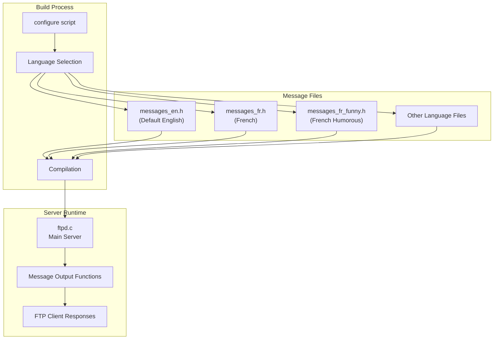
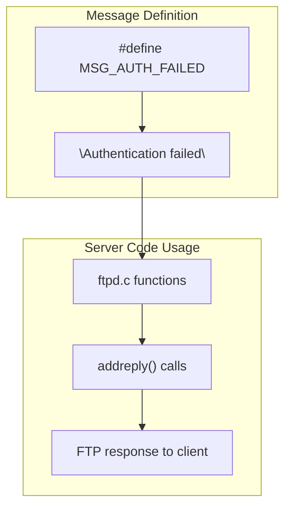
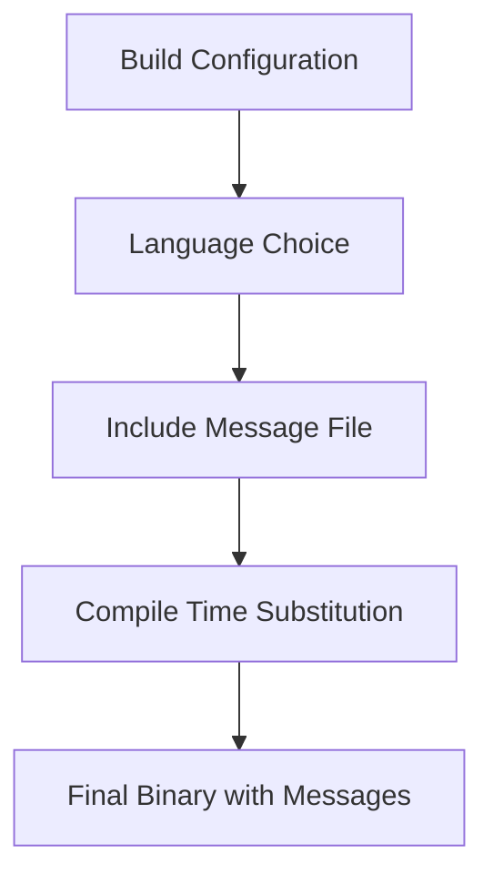

# Internationalization and Messages

> **Relevant source files**
> * [src/messages_fr.h](https://github.com/jedisct1/pure-ftpd/blob/3818577a/src/messages_fr.h)
> * [src/messages_fr_funny.h](https://github.com/jedisct1/pure-ftpd/blob/3818577a/src/messages_fr_funny.h)

This document covers Pure-FTPd's internationalization (i18n) system and message localization framework. Pure-FTPd provides multilingual support through compile-time message definitions that allow the server to communicate with users in their preferred language.

For information about runtime configuration and administrative settings, see [Runtime Configuration](/jedisct1/pure-ftpd/5.2-runtime-configuration). For details about user authentication and session management, see [Authentication and User Management](/jedisct1/pure-ftpd/4-authentication-and-user-management).

## Purpose and Scope

The internationalization system in Pure-FTPd enables:

* Localized FTP response messages and error notifications
* Multiple language variants including regional dialects
* Compile-time message customization
* Consistent message formatting across all server operations

## Message System Architecture

Pure-FTPd implements internationalization through preprocessor macros that define all user-facing messages. The system uses a simple but effective approach where each message is defined as a `#define` constant.



**Sources:** [src/messages_fr.h L1-L235](https://github.com/jedisct1/pure-ftpd/blob/3818577a/src/messages_fr.h#L1-L235)

 [src/messages_fr_funny.h L1-L235](https://github.com/jedisct1/pure-ftpd/blob/3818577a/src/messages_fr_funny.h#L1-L235)

## Supported Languages and Variants

Pure-FTPd currently includes the following language implementations:

| Language | File | Variant | Status |
| --- | --- | --- | --- |
| English | `messages_en.h` | Default | Built-in |
| French | `messages_fr.h` | Standard | Complete |
| French | `messages_fr_funny.h` | Humorous/Slang | Complete |

The French language support demonstrates two distinct approaches:

* **Standard French** (`messages_fr.h`): Professional, formal translations suitable for production environments
* **Humorous French** (`messages_fr_funny.h`): Informal, crude translations with local slang expressions

**Sources:** [src/messages_fr.h L1-L235](https://github.com/jedisct1/pure-ftpd/blob/3818577a/src/messages_fr.h#L1-L235)

 [src/messages_fr_funny.h L1-L235](https://github.com/jedisct1/pure-ftpd/blob/3818577a/src/messages_fr_funny.h#L1-L235)

## Message Categories and Organization

The message system organizes all server communications into logical categories. Each message is identified by a unique constant name following the pattern `MSG_*`.

```mermaid
flowchart TD

STATUS_MSG["MSG_SPACE_FREE_M<br>MSG_QUOTA_EXCEEDED<br>MSG_LOAD_TOO_HIGH<br>MSG_MAX_USERS"]
TLS_MSG["MSG_TLS_INFO<br>MSG_TLS_WEAK<br>MSG_TLS_NEEDED<br>MSG_PROT_OK"]
ERROR_MSG["MSG_SYNTAX_ERROR_IP<br>MSG_ILLEGAL_OPTION<br>MSG_CONF_ERR<br>MSG_SQL_DOWN"]
CONN_MSG["MSG_NEW_CONNECTION<br>MSG_CLIENT_CLOSED_CNX<br>MSG_TIMEOUT<br>MSG_GOODBYE"]
FILE_MSG["MSG_DELE_SUCCESS<br>MSG_UPLOAD_PARTIAL<br>MSG_TRANSFER_SUCCESSFUL<br>MSG_OPEN_FAILURE"]
AUTH_MSG["MSG_AUTH_FAILED<br>MSG_AUTH_TOOMANY<br>MSG_USER_OK<br>MSG_ANONYMOUS_LOGGED"]

subgraph subGraph5 ["System Status Messages"]
    STATUS_MSG
end

subgraph subGraph4 ["TLS/Security Messages"]
    TLS_MSG
end

subgraph subGraph3 ["Error Messages"]
    ERROR_MSG
end

subgraph subGraph2 ["Connection Messages"]
    CONN_MSG
end

subgraph subGraph1 ["File Operation Messages"]
    FILE_MSG
end

subgraph subGraph0 ["Authentication Messages"]
    AUTH_MSG
end
```



**Sources:** [src/messages_fr.h L48-L49](https://github.com/jedisct1/pure-ftpd/blob/3818577a/src/messages_fr.h#L48-L49)

 [src/messages_fr.h L90-L91](https://github.com/jedisct1/pure-ftpd/blob/3818577a/src/messages_fr.h#L90-L91)

 [src/messages_fr.h L173-L174](https://github.com/jedisct1/pure-ftpd/blob/3818577a/src/messages_fr.h#L173-L174)

 [src/messages_fr.h L157-L158](https://github.com/jedisct1/pure-ftpd/blob/3818577a/src/messages_fr.h#L157-L158)

 [src/messages_fr.h L218-L221](https://github.com/jedisct1/pure-ftpd/blob/3818577a/src/messages_fr.h#L218-L221)

 [src/messages_fr.h L122-L123](https://github.com/jedisct1/pure-ftpd/blob/3818577a/src/messages_fr.h#L122-L123)

### Core Message Categories

#### Authentication and User Management

```
#define MSG_AUTH_FAILED "l'authentification a echouee"
#define MSG_USER_OK "Utilisateur %s OK. Veuillez taper votre mot de passe"
#define MSG_ANONYMOUS_LOGGED "Utilisateur anonyme loggue"
```

#### File Transfer Operations

```
#define MSG_TRANSFER_SUCCESSFUL "Fichier transfere sans probleme"
#define MSG_UPLOAD_PARTIAL "Partiellement uploade"
#define MSG_DOWNLOADED "downloade"
```

#### Connection and Session Management

```
#define MSG_NEW_CONNECTION "Nouvelle connexion de %s"
#define MSG_GOODBYE "Au revoir. Vous avez uploade %llu et downloade %llu Ko."
#define MSG_TIMEOUT "Temps de reponse depasse"
```

**Sources:** [src/messages_fr.h L48](https://github.com/jedisct1/pure-ftpd/blob/3818577a/src/messages_fr.h#L48-L48)

 [src/messages_fr.h L41](https://github.com/jedisct1/pure-ftpd/blob/3818577a/src/messages_fr.h#L41-L41)

 [src/messages_fr.h L39](https://github.com/jedisct1/pure-ftpd/blob/3818577a/src/messages_fr.h#L39-L39)

 [src/messages_fr.h L195](https://github.com/jedisct1/pure-ftpd/blob/3818577a/src/messages_fr.h#L195-L195)

 [src/messages_fr.h L139](https://github.com/jedisct1/pure-ftpd/blob/3818577a/src/messages_fr.h#L139-L139)

 [src/messages_fr.h L124](https://github.com/jedisct1/pure-ftpd/blob/3818577a/src/messages_fr.h#L124-L124)

 [src/messages_fr.h L173](https://github.com/jedisct1/pure-ftpd/blob/3818577a/src/messages_fr.h#L173-L173)

 [src/messages_fr.h L16](https://github.com/jedisct1/pure-ftpd/blob/3818577a/src/messages_fr.h#L16-L16)

 [src/messages_fr.h L2](https://github.com/jedisct1/pure-ftpd/blob/3818577a/src/messages_fr.h#L2-L2)

## Technical Implementation

### Message Macro Structure

All messages follow a consistent macro definition pattern:

```
#define MSG_CONSTANT_NAME "Localized message text with %format specifiers"
```

The system supports standard C format specifiers for dynamic content:

* `%s` - String values (usernames, filenames, etc.)
* `%d`, `%u` - Integer values (counts, IDs, etc.)
* `%llu` - Long long unsigned (file sizes, transfer amounts)
* `%lu` - Long unsigned (time values, limits)
* `%.1f`, `%.2f` - Floating point (ratios, rates, sizes)

### Message Usage in Code

Messages are referenced throughout the codebase using the defined constants:



**Sources:** [src/messages_fr.h L48](https://github.com/jedisct1/pure-ftpd/blob/3818577a/src/messages_fr.h#L48-L48)

### Language Selection Process

Language selection occurs at compile time through the build configuration system. The selected message file is included during compilation, replacing all message constants with their localized versions.



**Sources:** [src/messages_fr.h L1-L235](https://github.com/jedisct1/pure-ftpd/blob/3818577a/src/messages_fr.h#L1-L235)

 [src/messages_fr_funny.h L1-L235](https://github.com/jedisct1/pure-ftpd/blob/3818577a/src/messages_fr_funny.h#L1-L235)

## Adding New Languages

To add support for a new language:

1. **Create Message File**: Create a new header file following the pattern `messages_[language].h`
2. **Define All Constants**: Implement all `MSG_*` constants with appropriate translations
3. **Maintain Format Specifiers**: Ensure format specifiers (`%s`, `%d`, etc.) match the original messages
4. **Update Build System**: Modify the configuration system to include the new language option
5. **Test Coverage**: Verify all message categories function correctly with the new translations

### Message File Template Structure

```sql
// Authentication messages
#define MSG_AUTH_FAILED "Translation for authentication failure"
#define MSG_USER_OK "Translation for user OK: %s"

// File operation messages  
#define MSG_TRANSFER_SUCCESSFUL "Translation for successful transfer"
#define MSG_DELE_SUCCESS "Translation for delete success: %s%s%s%s"

// Connection messages
#define MSG_NEW_CONNECTION "Translation for new connection: %s"
#define MSG_GOODBYE "Translation for goodbye: uploaded %llu downloaded %llu"
```

**Sources:** [src/messages_fr.h L48](https://github.com/jedisct1/pure-ftpd/blob/3818577a/src/messages_fr.h#L48-L48)

 [src/messages_fr.h L41](https://github.com/jedisct1/pure-ftpd/blob/3818577a/src/messages_fr.h#L41-L41)

 [src/messages_fr.h L195](https://github.com/jedisct1/pure-ftpd/blob/3818577a/src/messages_fr.h#L195-L195)

 [src/messages_fr.h L91](https://github.com/jedisct1/pure-ftpd/blob/3818577a/src/messages_fr.h#L91-L91)

 [src/messages_fr.h L173](https://github.com/jedisct1/pure-ftpd/blob/3818577a/src/messages_fr.h#L173-L173)

 [src/messages_fr.h L16](https://github.com/jedisct1/pure-ftpd/blob/3818577a/src/messages_fr.h#L16-L16)

## Message Consistency and Standards

The internationalization system maintains consistency through:

* **Uniform Macro Naming**: All messages use the `MSG_` prefix followed by descriptive names
* **Format Specifier Preservation**: Dynamic content placeholders remain consistent across languages
* **Complete Coverage**: Each language file must implement all message constants
* **Build-Time Validation**: Missing messages result in compilation errors

This approach ensures that all localized versions provide equivalent functionality while maintaining the server's operational integrity across different language environments.

**Sources:** [src/messages_fr.h L1-L235](https://github.com/jedisct1/pure-ftpd/blob/3818577a/src/messages_fr.h#L1-L235)

 [src/messages_fr_funny.h L1-L235](https://github.com/jedisct1/pure-ftpd/blob/3818577a/src/messages_fr_funny.h#L1-L235)