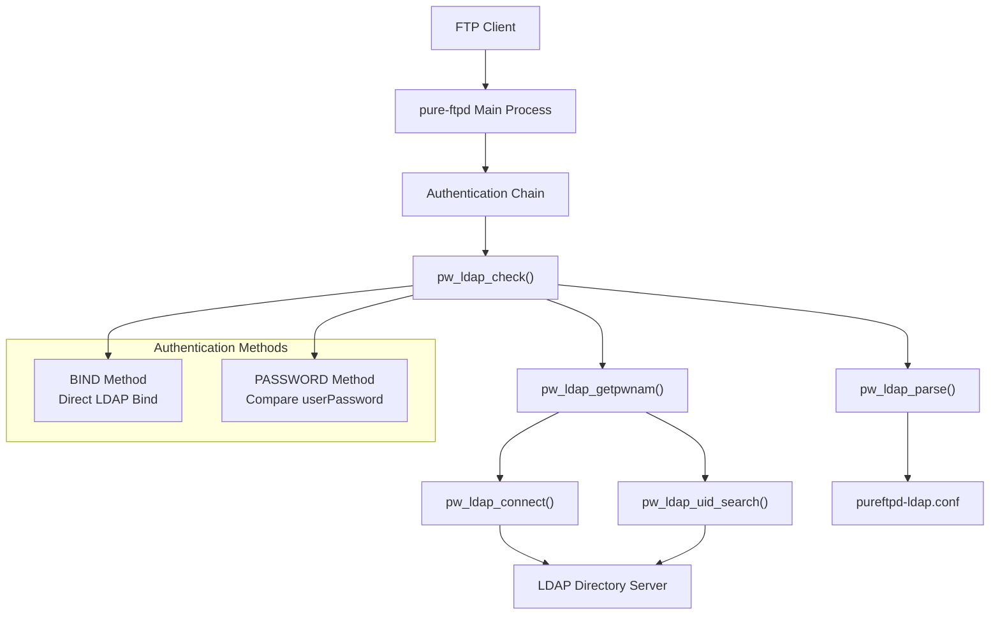
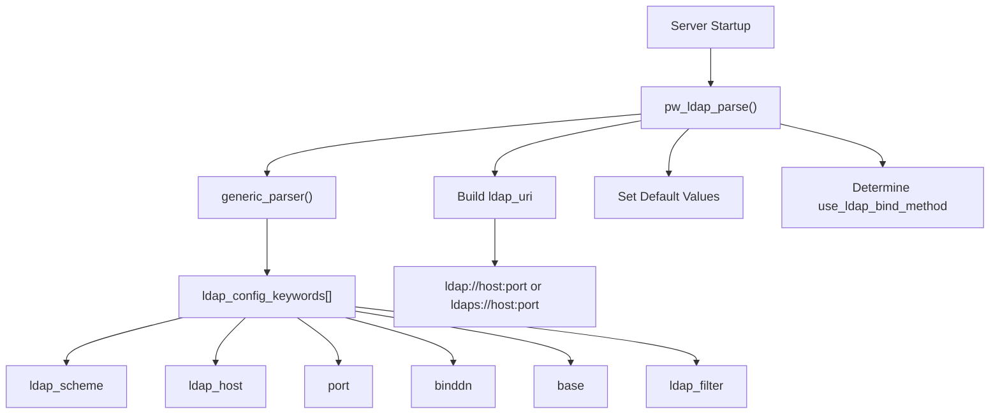
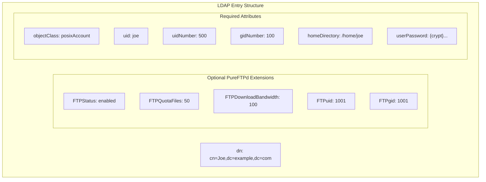
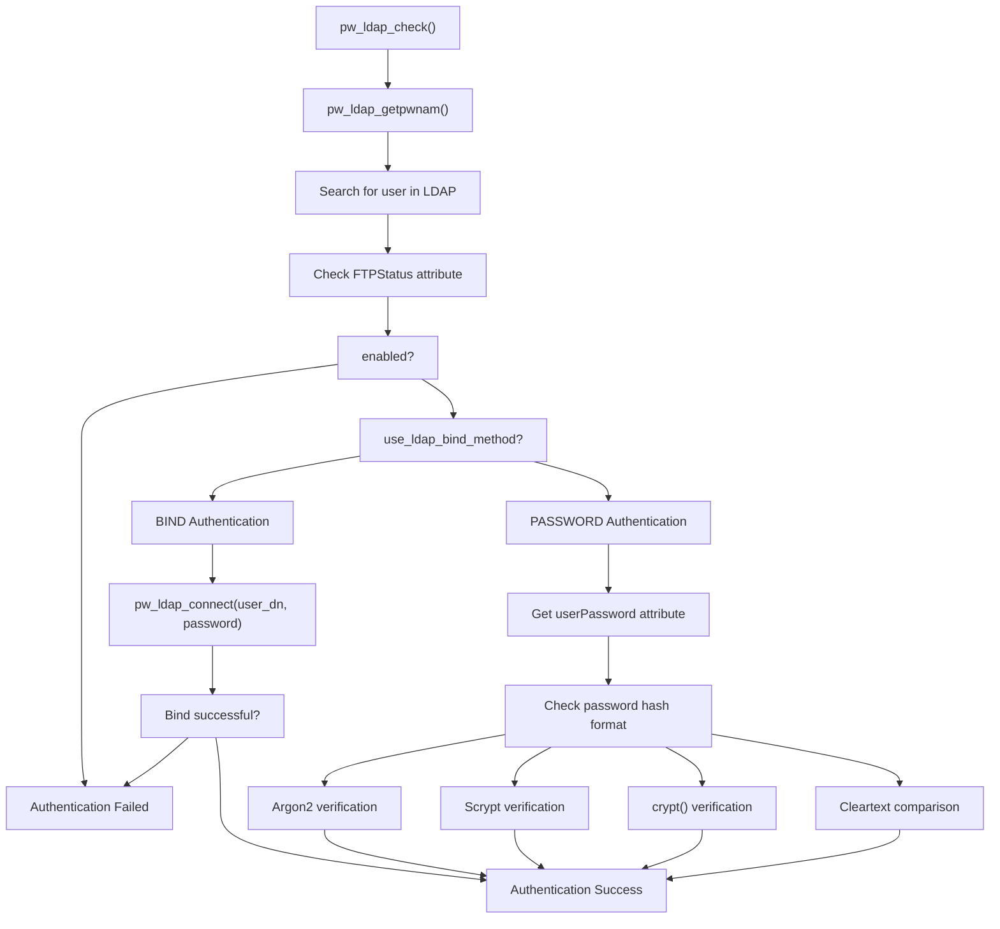
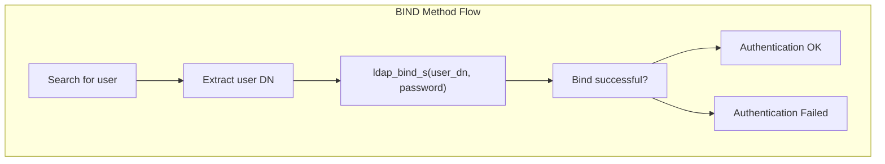
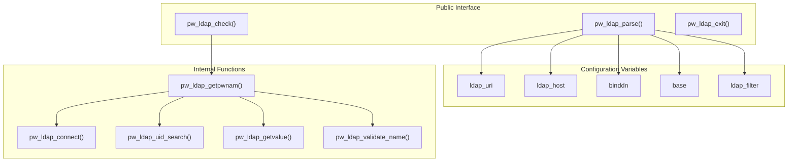

# LDAP Authentication

> **Relevant source files**
> * [README.LDAP](https://github.com/jedisct1/pure-ftpd/blob/3818577a/README.LDAP)
> * [README.MySQL](https://github.com/jedisct1/pure-ftpd/blob/3818577a/README.MySQL)
> * [README.PGSQL](https://github.com/jedisct1/pure-ftpd/blob/3818577a/README.PGSQL)
> * [pureftpd-ldap.conf](https://github.com/jedisct1/pure-ftpd/blob/3818577a/pureftpd-ldap.conf)
> * [src/log_ldap.c](https://github.com/jedisct1/pure-ftpd/blob/3818577a/src/log_ldap.c)
> * [src/log_ldap_p.h](https://github.com/jedisct1/pure-ftpd/blob/3818577a/src/log_ldap_p.h)

## Purpose and Scope

This document covers Pure-FTPd's LDAP (Lightweight Directory Access Protocol) authentication backend, which allows the FTP server to authenticate users against LDAP directory services like OpenLDAP or Active Directory. LDAP authentication is implemented through the [`src/log_ldap.c`](https://github.com/jedisct1/pure-ftpd/blob/3818577a/`src/log_ldap.c`)

 module and provides centralized user management for organizations with existing LDAP infrastructure.

For other authentication methods, see [Virtual Users with PureDB](/jedisct1/pure-ftpd/4.1-virtual-users-with-puredb), [Database Authentication](/jedisct1/pure-ftpd/4.2-database-authentication), and [External Authentication](/jedisct1/pure-ftpd/4.4-external-authentication). For general authentication architecture, see [Authentication and User Management](/jedisct1/pure-ftpd/4-authentication-and-user-management).

## LDAP Integration Overview

Pure-FTPd's LDAP support uses the standard `posixAccount` object class to locate user accounts in the directory. When enabled, the server queries the LDAP directory for user credentials, home directories, and optional per-user settings like quotas and bandwidth limits.

Sources: [log_ldap.c L539-L633](https://github.com/jedisct1/pure-ftpd/blob/3818577a/`src/log_ldap.c#L539-L633)

 [log_ldap.c L199-L227](https://github.com/jedisct1/pure-ftpd/blob/3818577a/`src/log_ldap.c#L199-L227)

 [log_ldap.c L317-L537](https://github.com/jedisct1/pure-ftpd/blob/3818577a/`src/log_ldap.c#L317-L537)

## Configuration System

LDAP authentication is configured through a dedicated configuration file parsed by the `pw_ldap_parse()` function. The configuration uses a keyword-based format defined in [`src/log_ldap_p.h`](https://github.com/jedisct1/pure-ftpd/blob/3818577a/`src/log_ldap_p.h`)

### Configuration Flow

Sources: [log_ldap.c L23-L166](https://github.com/jedisct1/pure-ftpd/blob/3818577a/`src/log_ldap.c#L23-L166)

 [log_ldap_p.h L38-L56](https://github.com/jedisct1/pure-ftpd/blob/3818577a/`src/log_ldap_p.h#L38-L56)

### Key Configuration Parameters

| Parameter | Purpose | Default |
| --- | --- | --- |
| `LDAPScheme` | Protocol (ldap/ldaps/ldapi) | "ldap" |
| `LDAPServer` | Directory server hostname | "localhost" |
| `LDAPPort` | Connection port | 389 |
| `LDAPBaseDN` | Search base for user accounts | (mandatory) |
| `LDAPBindDN` | DN for server authentication | (optional) |
| `LDAPFilter` | User search filter | `(&(objectClass=posixAccount)(uid=\L))` |
| `LDAPAuthMethod` | Authentication method (BIND/PASSWORD) | Auto-determined |

Sources: [`pureftpd-ldap.conf L1-L89](https://github.com/jedisct1/pure-ftpd/blob/3818577a/`pureftpd-ldap.conf#L1-L89)

 [log_ldap_p.h L38-L56](https://github.com/jedisct1/pure-ftpd/blob/3818577a/`src/log_ldap_p.h#L38-L56)

## LDAP Schema Requirements

Pure-FTPd expects users to be stored as `posixAccount` objects with specific attributes for FTP access.

### Standard posixAccount Schema

Sources: [`README.LDAP L147-L183](https://github.com/jedisct1/pure-ftpd/blob/3818577a/`README.LDAP#L147-L183)

 [`README.LDAP L185-L243](https://github.com/jedisct1/pure-ftpd/blob/3818577a/`README.LDAP#L185-L243)

### Attribute Mapping

| LDAP Attribute | Purpose | Code Reference |
| --- | --- | --- |
| `uid` | FTP login name | [`LDAP_FILTER`](https://github.com/jedisct1/pure-ftpd/blob/3818577a/`LDAP_FILTER`)    in search |
| `uidNumber` | System UID | [`LDAP_UIDNUMBER`](https://github.com/jedisct1/pure-ftpd/blob/3818577a/`LDAP_UIDNUMBER`) |
| `gidNumber` | System GID | [`LDAP_GIDNUMBER`](https://github.com/jedisct1/pure-ftpd/blob/3818577a/`LDAP_GIDNUMBER`) |
| `homeDirectory` | User's home directory | [`LDAP_HOMEDIRECTORY`](https://github.com/jedisct1/pure-ftpd/blob/3818577a/`LDAP_HOMEDIRECTORY`) |
| `userPassword` | Encrypted password | [`LDAP_USERPASSWORD`](https://github.com/jedisct1/pure-ftpd/blob/3818577a/`LDAP_USERPASSWORD`) |
| `FTPuid` | FTP-specific UID override | [`LDAP_FTPUID`](https://github.com/jedisct1/pure-ftpd/blob/3818577a/`LDAP_FTPUID`) |
| `FTPgid` | FTP-specific GID override | [`LDAP_FTPGID`](https://github.com/jedisct1/pure-ftpd/blob/3818577a/`LDAP_FTPGID`) |

Sources: [log_ldap.c L323-L337](https://github.com/jedisct1/pure-ftpd/blob/3818577a/`src/log_ldap.c#L323-L337)

 [log_ldap.c L460-L470](https://github.com/jedisct1/pure-ftpd/blob/3818577a/`src/log_ldap.c#L460-L470)

 [log_ldap.c L478-L488](https://github.com/jedisct1/pure-ftpd/blob/3818577a/`src/log_ldap.c#L478-L488)

## Authentication Methods

Pure-FTPd supports two LDAP authentication methods, controlled by the `use_ldap_bind_method` flag.

### Authentication Process Flow

Sources: [log_ldap.c L539-L633](https://github.com/jedisct1/pure-ftpd/blob/3818577a/`src/log_ldap.c#L539-L633)

 [log_ldap.c L559-L575](https://github.com/jedisct1/pure-ftpd/blob/3818577a/`src/log_ldap.c#L559-L575)

 [log_ldap.c L575-L621](https://github.com/jedisct1/pure-ftpd/blob/3818577a/`src/log_ldap.c#L575-L621)

### BIND Authentication Method

The BIND method authenticates users by attempting to bind to the LDAP server using the user's DN and provided password. This method requires minimal privileges for the server's LDAP connection.

Sources: [log_ldap.c L559-L575](https://github.com/jedisct1/pure-ftpd/blob/3818577a/`src/log_ldap.c#L559-L575)

 [log_ldap.c L565-L568](https://github.com/jedisct1/pure-ftpd/blob/3818577a/`src/log_ldap.c#L565-L568)

### PASSWORD Authentication Method

The PASSWORD method retrieves the `userPassword` attribute and compares it against the provided password using various hash formats.

| Hash Format | Prefix | Verification Function |
| --- | --- | --- |
| Argon2 | `{ARGON2}` | `crypto_pwhash_str_verify()` |
| Scrypt | `{SCRYPT}` | `crypto_pwhash_scryptsalsa208sha256_str_verify()` |
| Crypt | `{CRYPT}` | `crypt()` |
| Cleartext | (none) | `pure_strcmp()` |

Sources: [log_ldap.c L579-L620](https://github.com/jedisct1/pure-ftpd/blob/3818577a/`src/log_ldap.c#L579-L620)

 [log_ldap.c L580-L587](https://github.com/jedisct1/pure-ftpd/blob/3818577a/`src/log_ldap.c#L580-L587)

 [log_ldap.c L590-L598](https://github.com/jedisct1/pure-ftpd/blob/3818577a/`src/log_ldap.c#L590-L598)

## Code Architecture

The LDAP authentication module follows a layered architecture with clear separation of concerns.

### Core Functions

Sources: [log_ldap.c L23-L636](https://github.com/jedisct1/pure-ftpd/blob/3818577a/`src/log_ldap.c#L23-L636)

 [log_ldap_p.h L12-L36](https://github.com/jedisct1/pure-ftpd/blob/3818577a/`src/log_ldap_p.h#L12-L36)

### Memory Management

The module uses careful memory management with cleanup functions and error handling:

* [`pw_ldap_exit()`](https://github.com/jedisct1/pure-ftpd/blob/3818577a/`pw_ldap_exit()`)  frees all allocated configuration strings
* [`pw_ldap_getpwnam_freefields()`](https://github.com/jedisct1/pure-ftpd/blob/3818577a/`pw_ldap_getpwnam_freefields()`)  cleans up temporary passwd structure fields
* LDAP result sets are properly freed with `ldap_msgfree()`

Sources: [log_ldap.c L168-L197](https://github.com/jedisct1/pure-ftpd/blob/3818577a/`src/log_ldap.c#L168-L197)

 [log_ldap.c L288-L296](https://github.com/jedisct1/pure-ftpd/blob/3818577a/`src/log_ldap.c#L288-L296)

 [log_ldap.c L509-L510](https://github.com/jedisct1/pure-ftpd/blob/3818577a/`src/log_ldap.c#L509-L510)

## Extended Features and Per-User Settings

Beyond basic authentication, the LDAP backend supports advanced per-user settings when the extended PureFTPd schema is used.

### Supported Features

| Feature | LDAP Attribute | Code Integration |
| --- | --- | --- |
| File Quotas | `FTPQuotaFiles` | `result->user_quota_files` |
| Size Quotas | `FTPQuotaMBytes` | `result->user_quota_size` |
| Upload Bandwidth | `FTPUploadBandwidth` | `result->throttling_bandwidth_ul` |
| Download Bandwidth | `FTPDownloadBandwidth` | `result->throttling_bandwidth_dl` |
| Upload Ratio | `FTPUploadRatio` | `result->ratio_upload` |
| Download Ratio | `FTPDownloadRatio` | `result->ratio_download` |
| Account Status | `FTPStatus` | Account enable/disable |

Sources: [log_ldap.c L379-L435](https://github.com/jedisct1/pure-ftpd/blob/3818577a/`src/log_ldap.c#L379-L435)

 [log_ldap.c L372-L378](https://github.com/jedisct1/pure-ftpd/blob/3818577a/`src/log_ldap.c#L372-L378)

### TLS Support

The LDAP module supports encrypted connections through TLS:

* `LDAPUseTLS` configuration enables STARTTLS over standard LDAP connections
* `ldaps://` scheme provides native TLS connections
* TLS is initiated using `ldap_start_tls_s()` when `use_tls` is enabled

Sources: [log_ldap.c L105-L112](https://github.com/jedisct1/pure-ftpd/blob/3818577a/`src/log_ldap.c#L105-L112)

 [log_ldap.c L218-L220](https://github.com/jedisct1/pure-ftpd/blob/3818577a/`src/log_ldap.c#L218-L220)

 [`pureftpd-ldap.conf L73-L75](https://github.com/jedisct1/pure-ftpd/blob/3818577a/`pureftpd-ldap.conf#L73-L75)