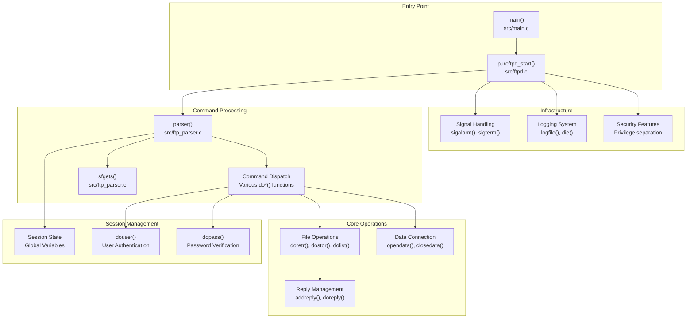
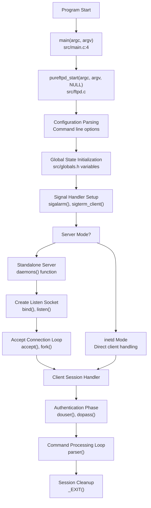
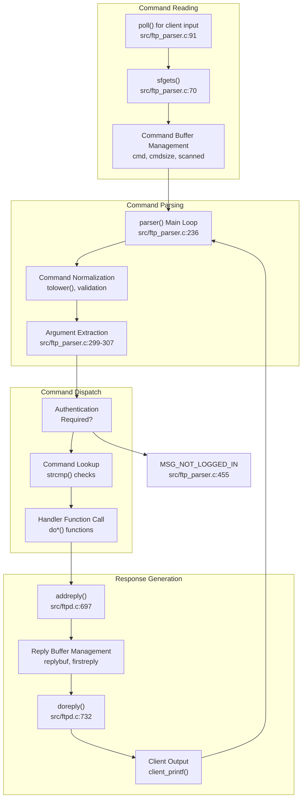
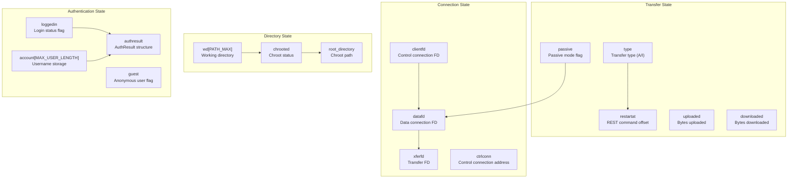
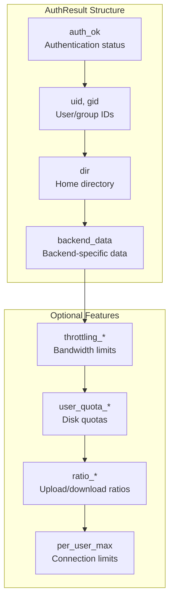
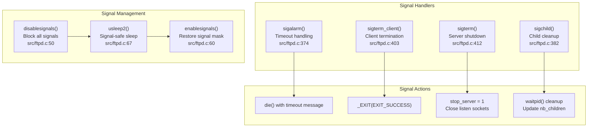
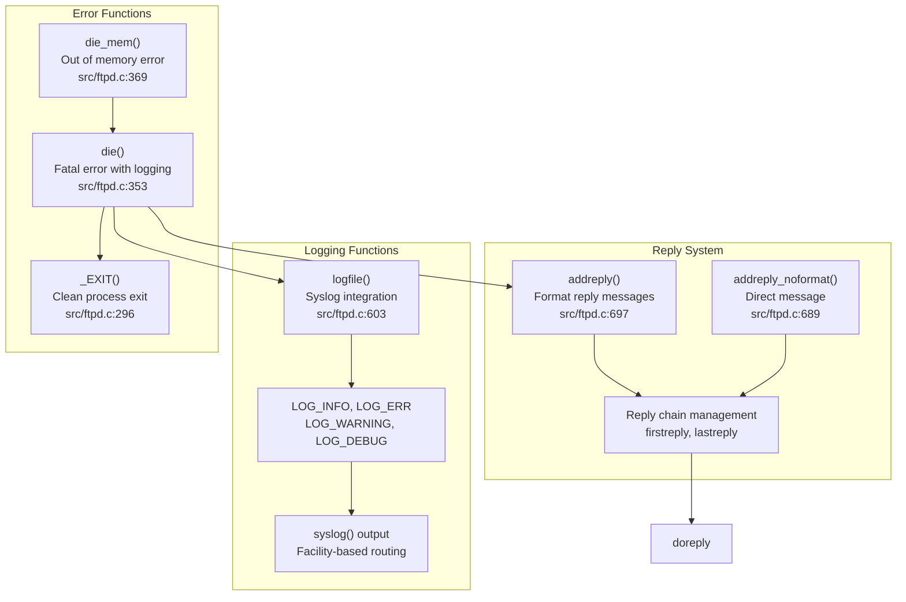
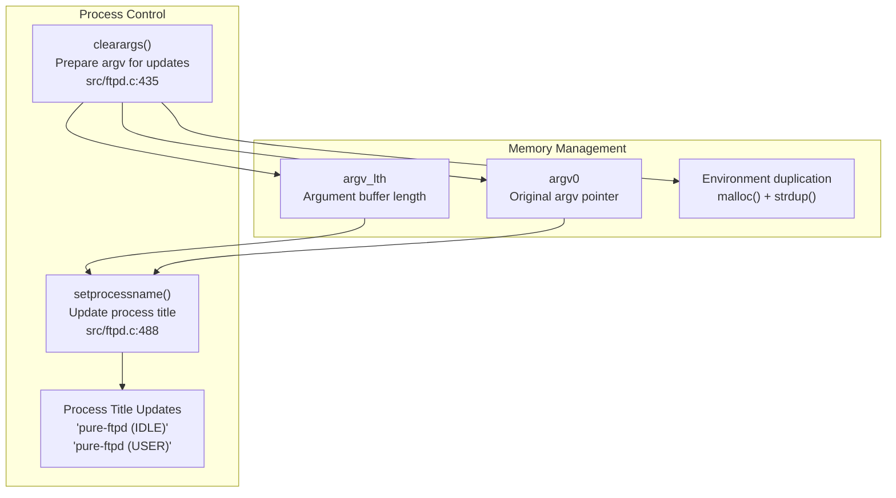

# Main Server Process

> **Relevant source files**
> * [src/ftp_parser.c](https://github.com/jedisct1/pure-ftpd/blob/3818577a/src/ftp_parser.c)
> * [src/ftpd.c](https://github.com/jedisct1/pure-ftpd/blob/3818577a/src/ftpd.c)
> * [src/ftpd.h](https://github.com/jedisct1/pure-ftpd/blob/3818577a/src/ftpd.h)
> * [src/main.c](https://github.com/jedisct1/pure-ftpd/blob/3818577a/src/main.c)

This document covers the central server process implementation in Pure-FTPd, focusing on the core FTP server daemon that handles client connections, processes FTP commands, and manages user sessions. The main server process encompasses the program entry point, session lifecycle management, command parsing, and the primary control flow that coordinates all server operations.

For information about specific authentication backends, see [Authentication and User Management](/jedisct1/pure-ftpd/4-authentication-and-user-management). For details about TLS/SSL implementation, see [TLS/SSL Encryption](/jedisct1/pure-ftpd/3.1-tlsssl-encryption). For configuration and build system details, see [Configuration and Administration](/jedisct1/pure-ftpd/5-configuration-and-administration).

## Architecture Overview

The main server process is implemented across several key source files, with `ftpd.c` serving as the primary coordinator. The architecture follows a single-threaded, event-driven model where each client connection is handled by a separate process (in standalone mode) or managed by inetd/xinetd.

### Core Server Architecture

Sources: [src/main.c L1-L8](https://github.com/jedisct1/pure-ftpd/blob/3818577a/src/main.c#L1-L8)

 [src/ftpd.c L1-L50](https://github.com/jedisct1/pure-ftpd/blob/3818577a/src/ftpd.c#L1-L50)

 [src/ftp_parser.c L224-L824](https://github.com/jedisct1/pure-ftpd/blob/3818577a/src/ftp_parser.c#L224-L824)

 [src/ftpd.h L313-L401](https://github.com/jedisct1/pure-ftpd/blob/3818577a/src/ftpd.h#L313-L401)

## Server Lifecycle and Initialization

The server follows a well-defined lifecycle from startup to client session handling. The process begins with command-line parsing, configuration loading, and network setup.

### Server Startup Flow

Sources: [src/main.c L4-L7](https://github.com/jedisct1/pure-ftpd/blob/3818577a/src/main.c#L4-L7)

 [src/ftpd.c L374-L409](https://github.com/jedisct1/pure-ftpd/blob/3818577a/src/ftpd.c#L374-L409)

 [src/ftpd.c L411-L433](https://github.com/jedisct1/pure-ftpd/blob/3818577a/src/ftpd.c#L411-L433)

## Command Processing Pipeline

The command processing system is built around a main parsing loop that reads FTP commands from clients, validates them, and dispatches to appropriate handler functions. This pipeline handles both control and data connections.

### FTP Command Processing Flow

Sources: [src/ftp_parser.c L70-L166](https://github.com/jedisct1/pure-ftpd/blob/3818577a/src/ftp_parser.c#L70-L166)

 [src/ftp_parser.c L224-L824](https://github.com/jedisct1/pure-ftpd/blob/3818577a/src/ftp_parser.c#L224-L824)

 [src/ftpd.c L689-L768](https://github.com/jedisct1/pure-ftpd/blob/3818577a/src/ftpd.c#L689-L768)

 [src/ftpd.c L315-L351](https://github.com/jedisct1/pure-ftpd/blob/3818577a/src/ftpd.c#L315-L351)

## Session Management

Session management handles the complete lifecycle of an FTP client connection, from initial greeting through authentication to command processing and session termination.

### Session State Management

The server maintains session state through global variables and structures defined in `globals.h`. Key state includes authentication status, current directory, transfer modes, and connection information.

Sources: [src/globals.h](https://github.com/jedisct1/pure-ftpd/blob/3818577a/src/globals.h)

 [src/ftpd.h L257-L285](https://github.com/jedisct1/pure-ftpd/blob/3818577a/src/ftpd.h#L257-L285)

 [src/ftpd.c L1269-L1480](https://github.com/jedisct1/pure-ftpd/blob/3818577a/src/ftpd.c#L1269-L1480)

## Key Data Structures

The server uses several important data structures to manage client sessions, authentication results, and file operations.

### Core Data Structures

| Structure | Purpose | Key Fields | Source Location |
| --- | --- | --- | --- |
| `AuthResult` | Authentication results and user info | `auth_ok`, `uid`, `gid`, `dir`, quotas, throttling | [src/ftpd.h L257-L285](https://github.com/jedisct1/pure-ftpd/blob/3818577a/src/ftpd.h#L257-L285) |
| `PureFileInfo` | File metadata for listings | `names_pnt`, `size`, `mtime`, `mode`, `uid`, `gid` | [src/ftpd.h L287-L296](https://github.com/jedisct1/pure-ftpd/blob/3818577a/src/ftpd.h#L287-L296) |
| `reply` | Reply chain for client responses | `next`, `line` | [src/ftpd.c L672-L687](https://github.com/jedisct1/pure-ftpd/blob/3818577a/src/ftpd.c#L672-L687) |
| Global variables | Session state management | `loggedin`, `clientfd`, `wd`, `account` | [src/globals.h](https://github.com/jedisct1/pure-ftpd/blob/3818577a/src/globals.h) |

### Authentication Result Structure

Sources: [src/ftpd.h L257-L285](https://github.com/jedisct1/pure-ftpd/blob/3818577a/src/ftpd.h#L257-L285)

 [src/ftpd.c L1482-L1562](https://github.com/jedisct1/pure-ftpd/blob/3818577a/src/ftpd.c#L1482-L1562)

## Signal Handling and Process Management

The server implements comprehensive signal handling for graceful shutdown, timeout management, and child process cleanup in standalone mode.

### Signal Handler Architecture

Sources: [src/ftpd.c L50-L72](https://github.com/jedisct1/pure-ftpd/blob/3818577a/src/ftpd.c#L50-L72)

 [src/ftpd.c L374-L433](https://github.com/jedisct1/pure-ftpd/blob/3818577a/src/ftpd.c#L374-L433)

## Error Handling and Logging

The server implements a centralized error handling and logging system that provides detailed information for debugging and security monitoring.

### Error and Logging System

Sources: [src/ftpd.c L296-L372](https://github.com/jedisct1/pure-ftpd/blob/3818577a/src/ftpd.c#L296-L372)

 [src/ftpd.c L603-L650](https://github.com/jedisct1/pure-ftpd/blob/3818577a/src/ftpd.c#L603-L650)

 [src/ftpd.c L689-L768](https://github.com/jedisct1/pure-ftpd/blob/3818577a/src/ftpd.c#L689-L768)

## Process Naming and Management

The server includes functionality for process naming and management, particularly useful for monitoring and debugging in production environments.

### Process Management Features

Sources: [src/ftpd.c L435-L507](https://github.com/jedisct1/pure-ftpd/blob/3818577a/src/ftpd.c#L435-L507)

 [src/ftp_parser.c L240-L248](https://github.com/jedisct1/pure-ftpd/blob/3818577a/src/ftp_parser.c#L240-L248)