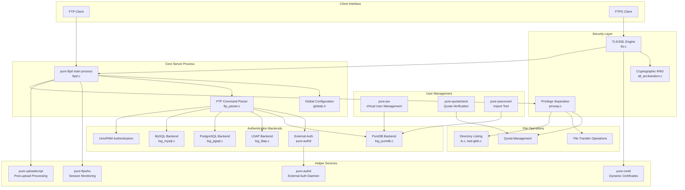
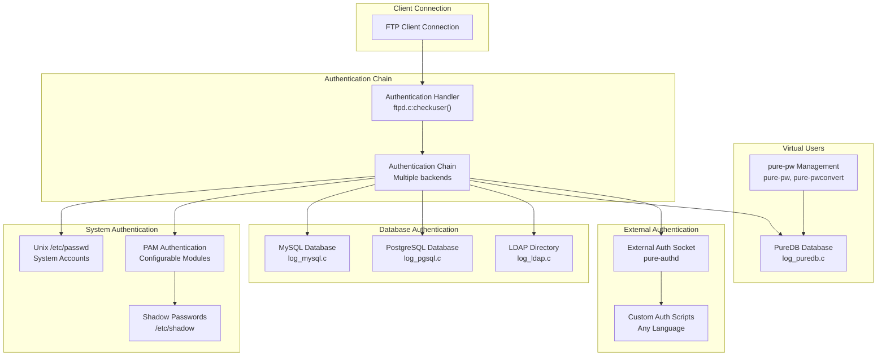

# Overview

> **Relevant source files**
> * [COPYING](https://github.com/jedisct1/pure-ftpd/blob/3818577a/COPYING)
> * [ChangeLog](https://github.com/jedisct1/pure-ftpd/blob/3818577a/ChangeLog)
> * [NEWS](https://github.com/jedisct1/pure-ftpd/blob/3818577a/NEWS)
> * [README](https://github.com/jedisct1/pure-ftpd/blob/3818577a/README)
> * [THANKS](https://github.com/jedisct1/pure-ftpd/blob/3818577a/THANKS)
> * [configure.ac](https://github.com/jedisct1/pure-ftpd/blob/3818577a/configure.ac)
> * [man/pure-ftpd.8.in](https://github.com/jedisct1/pure-ftpd/blob/3818577a/man/pure-ftpd.8.in)
> * [man/pure-mrtginfo.8.in](https://github.com/jedisct1/pure-ftpd/blob/3818577a/man/pure-mrtginfo.8.in)

This document provides an overview of Pure-FTPd, its architecture, core features, and how the major components work together. Pure-FTPd is a secure, production-quality FTP server designed for modern systems with emphasis on security and performance.

For detailed build and configuration information, see [Getting Started](/jedisct1/pure-ftpd/1.1-getting-started). For deep technical details about specific subsystems, see [Core Server Components](/jedisct1/pure-ftpd/2-core-server-components), [Security Features](/jedisct1/pure-ftpd/3-security-features), and [Authentication and User Management](/jedisct1/pure-ftpd/4-authentication-and-user-management).

## What is Pure-FTPd

Pure-FTPd is a fast, secure, and standards-compliant FTP server that emphasizes simplicity and security over feature bloat. Based on the original Troll-FTPd, it has been completely rewritten with modern security practices and designed to be safe in its default configuration.

**Core Design Philosophy:**

* Secure by default with no known vulnerabilities in default configuration
* Minimal resource usage and high performance
* Standards-compliant FTP protocol implementation
* Extensive authentication backend support
* Built-in security features like privilege separation and TLS encryption

Sources: [README L1-L25](https://github.com/jedisct1/pure-ftpd/blob/3818577a/README#L1-L25)

 [man/pure-ftpd.8.in L133-L143](https://github.com/jedisct1/pure-ftpd/blob/3818577a/man/pure-ftpd.8.in#L133-L143)

 [configure.ac L4-L6](https://github.com/jedisct1/pure-ftpd/blob/3818577a/configure.ac#L4-L6)

## System Architecture Overview

The architecture centers around the main `pure-ftpd` process defined in [src/ftpd.c](https://github.com/jedisct1/pure-ftpd/blob/3818577a/src/ftpd.c)

 which handles all client connections and FTP protocol operations. The system uses a modular design where different authentication backends, security layers, and helper services can be enabled or disabled at compile time.

Sources: [configure.ac L306-L891](https://github.com/jedisct1/pure-ftpd/blob/3818577a/configure.ac#L306-L891)

 [README L17-L23](https://github.com/jedisct1/pure-ftpd/blob/3818577a/README#L17-L23)

 [src/ftpd.c](https://github.com/jedisct1/pure-ftpd/blob/3818577a/src/ftpd.c)

## Core Features and Capabilities

Pure-FTPd provides a comprehensive set of FTP server features while maintaining security and performance:

### Protocol Support

* **Standard FTP Protocol**: Full RFC 959 compliance
* **Modern Extensions**: MLSD, MLST, SITE CHMOD, SITE UTIME
* **IPv6 Support**: Dual-stack IPv4/IPv6 operation
* **Passive/Active Modes**: Complete support with NAT traversal options

### Security Features

* **TLS/SSL Encryption**: Full FTPS support with configurable cipher suites
* **Privilege Separation**: Mandatory separation of privileged and unprivileged processes
* **Chroot Jails**: Per-user and anonymous chroot environments
* **Virtual Chroot**: Secure chroot with symlink following capability

### Performance Optimization

* **Zero-copy Transfers**: `sendfile()` system call support on compatible platforms
* **Bandwidth Throttling**: Per-user and global bandwidth controls
* **Connection Limits**: Configurable per-IP and global connection limits
* **Standalone Mode**: High-performance standalone server operation

### File Management

* **Virtual Quotas**: Per-user file count and size quotas via `.ftpquota` files
* **Atomic Uploads**: Safe upload handling with temporary file management
* **Auto-rename**: Automatic file renaming to prevent overwrites
* **Upload Scripts**: Post-upload processing via `pure-uploadscript`

Sources: [README L17-L23](https://github.com/jedisct1/pure-ftpd/blob/3818577a/README#L17-L23)

 [man/pure-ftpd.8.in L139-L143](https://github.com/jedisct1/pure-ftpd/blob/3818577a/man/pure-ftpd.8.in#L139-L143)

 [configure.ac L106-L891](https://github.com/jedisct1/pure-ftpd/blob/3818577a/configure.ac#L106-L891)

## Authentication Architecture

Pure-FTPd supports multiple authentication backends that can be chained together. Authentication is attempted in the order specified by `-l` command-line options, falling back through the chain until a match is found or all methods are exhausted.

**Authentication Backend Priority:**

1. **PureDB**: Fast virtual user database with hashed passwords
2. **SQL Databases**: MySQL/PostgreSQL with flexible schema support
3. **LDAP**: Directory service integration with TLS support
4. **External**: Custom authentication via `pure-authd` daemon
5. **System**: Traditional Unix passwd/shadow files
6. **PAM**: Pluggable Authentication Modules

Sources: [man/pure-ftpd.8.in L307-L338](https://github.com/jedisct1/pure-ftpd/blob/3818577a/man/pure-ftpd.8.in#L307-L338)

 [configure.ac L456-L506](https://github.com/jedisct1/pure-ftpd/blob/3818577a/configure.ac#L456-L506)

 [README L173-L243](https://github.com/jedisct1/pure-ftpd/blob/3818577a/README#L173-L243)

## Configuration and Deployment

Pure-FTPd offers flexible configuration through multiple methods:

### Configuration Methods

* **Command-line Options**: Direct server configuration via flags
* **Configuration Files**: Structured configuration via `pure-ftpd.conf`
* **Include Directives**: Modular configuration file inclusion
* **Runtime Detection**: Automatic feature detection and adaptation

### Deployment Modes

* **Standalone Server**: Recommended high-performance mode
* **Super-server**: Integration with inetd, xinetd, or tcpserver
* **Container/Virtualized**: Support for containers and virtual environments

### Build-time Configuration

The [configure.ac L97-L891](https://github.com/jedisct1/pure-ftpd/blob/3818577a/configure.ac#L97-L891)

 script provides extensive compile-time options:

| Feature Category | Configure Options | Purpose |
| --- | --- | --- |
| Authentication | `--with-ldap`, `--with-mysql`, `--with-pgsql`, `--with-puredb` | Database backend support |
| Security | `--with-tls`, `--with-privsep`, `--without-capabilities` | Security feature control |
| Features | `--with-quotas`, `--with-throttling`, `--with-ftpwho` | Optional feature enablement |
| Compatibility | `--with-rfc2640`, `--with-sendfile`, `--with-virtualchroot` | Platform and client compatibility |

### Runtime Configuration

Key runtime options from [man/pure-ftpd.8.in L145-L571](https://github.com/jedisct1/pure-ftpd/blob/3818577a/man/pure-ftpd.8.in#L145-L571):

* **Connection Control**: `-c` (max clients), `-C` (per-IP limits), `-p` (passive port range)
* **Security**: `-A` (chroot all), `-Y` (TLS mode), `-u` (min UID)
* **Performance**: `-H` (no DNS resolution), `-B` (daemonize)
* **Features**: `-O` (alt logging), `-n` (quotas), `-t/-T` (throttling)

Sources: [configure.ac L97-L891](https://github.com/jedisct1/pure-ftpd/blob/3818577a/configure.ac#L97-L891)

 [man/pure-ftpd.8.in L145-L571](https://github.com/jedisct1/pure-ftpd/blob/3818577a/man/pure-ftpd.8.in#L145-L571)

 [README L96-L385](https://github.com/jedisct1/pure-ftpd/blob/3818577a/README#L96-L385)

## Related Components and Tools

Pure-FTPd includes several helper utilities and daemons that extend core functionality:

### Administrative Tools

* **`pure-pw`**: Virtual user database management
* **`pure-quotacheck`**: Quota verification and reporting
* **`pure-pwconv`**: Import system users to virtual database
* **`pure-ftpwho`**: Real-time session monitoring

### Service Daemons

* **`pure-authd`**: External authentication daemon for custom auth modules
* **`pure-uploadscript`**: Post-upload script execution service
* **`pure-certd`**: Dynamic TLS certificate management for SNI

### Monitoring and Statistics

* **`pure-mrtginfo`**: MRTG-compatible statistics output
* **`pure-statsdecode`**: Log file analysis and statistics

These components work together to provide a complete FTP server solution that can scale from simple single-user setups to enterprise-grade installations with thousands of concurrent users.

Sources: [man/pure-ftpwho.8.in](https://github.com/jedisct1/pure-ftpd/blob/3818577a/man/pure-ftpwho.8.in)

 [man/pure-pw.8.in](https://github.com/jedisct1/pure-ftpd/blob/3818577a/man/pure-pw.8.in)

 [man/pure-authd.8.in](https://github.com/jedisct1/pure-ftpd/blob/3818577a/man/pure-authd.8.in)

 [README L254-L259](https://github.com/jedisct1/pure-ftpd/blob/3818577a/README#L254-L259)