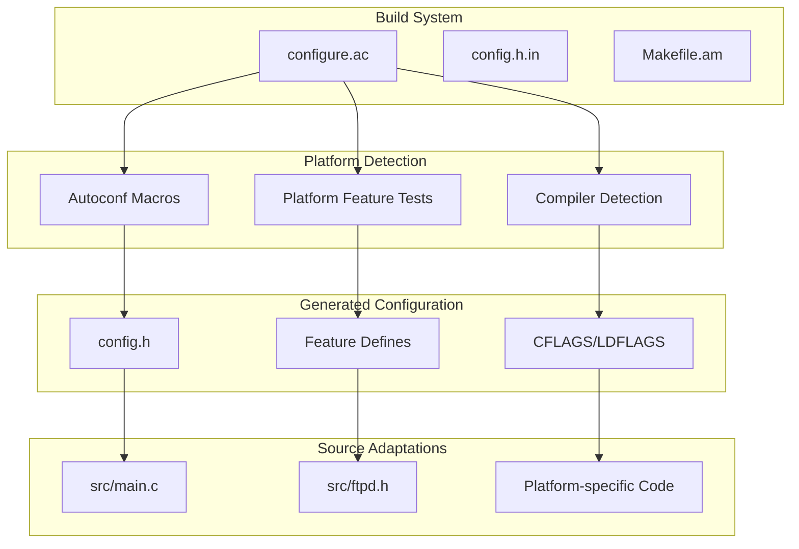
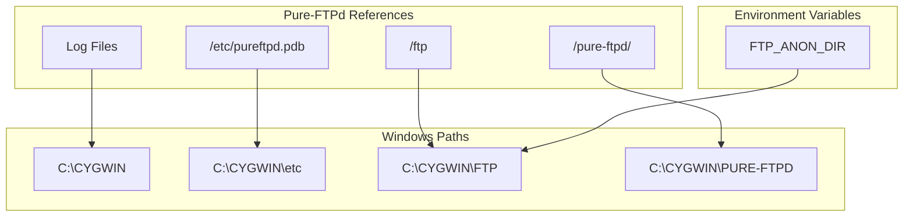
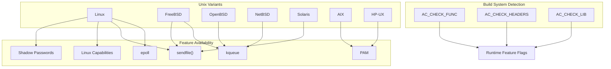
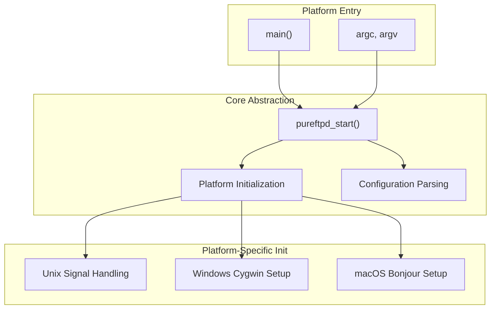

# Platform Support and Porting

> **Relevant source files**
> * [README.Donations](https://github.com/jedisct1/pure-ftpd/blob/3818577a/README.Donations)
> * [README.MacOS-X](https://github.com/jedisct1/pure-ftpd/blob/3818577a/README.MacOS-X)
> * [README.Windows](https://github.com/jedisct1/pure-ftpd/blob/3818577a/README.Windows)
> * [src/main.c](https://github.com/jedisct1/pure-ftpd/blob/3818577a/src/main.c)

This document covers Pure-FTPd's cross-platform compatibility, platform-specific build configurations, and considerations for running the server on different operating systems. It includes detailed information about supported platforms, compilation requirements, and platform-specific limitations.

For information about build system configuration and compilation options, see [Build System and Compilation](/jedisct1/pure-ftpd/5.1-build-system-and-compilation). For runtime configuration that may vary by platform, see [Runtime Configuration](/jedisct1/pure-ftpd/5.2-runtime-configuration).

## Supported Platforms Overview

Pure-FTPd is primarily designed for Unix-like systems but provides experimental support for Windows through Cygwin. The codebase includes platform-specific adaptations and build configurations to ensure compatibility across different operating systems.

### Platform Support Matrix

| Platform | Support Level | Key Components | Special Requirements |
| --- | --- | --- | --- |
| Linux | Full | All features | Standard build tools |
| FreeBSD/OpenBSD/NetBSD | Full | All features | BSD-specific adaptations |
| macOS | Full | All features + Bonjour | PAM integration, Homebrew |
| Solaris | Full | All features | Platform-specific configure |
| Windows (Cygwin) | Experimental | Limited features | Static linking, special paths |
| AIX/HP-UX | Basic | Core features | Legacy Unix adaptations |

**Platform Detection and Adaptation Architecture**



Sources: [configure.ac](https://github.com/jedisct1/pure-ftpd/blob/3818577a/configure.ac)

 [config.h.in](https://github.com/jedisct1/pure-ftpd/blob/3818577a/config.h.in)

 [src/main.c L1-L8](https://github.com/jedisct1/pure-ftpd/blob/3818577a/src/main.c#L1-L8)

## Windows Support (Cygwin)

Pure-FTPd provides experimental Windows support through the Cygwin compatibility layer. This implementation requires specific build configurations and has several platform-specific limitations.

### Build Configuration for Windows

The Windows build requires specific configure flags and static linking to create self-contained executables:

```
env LDFLAGS="-static -s" \
    ./configure --with-everything --with-brokenrealpath \
                --without-shadow  --with-nonroot --with-tls
```

### Required Build Options

| Option | Purpose | Reason |
| --- | --- | --- |
| `--with-brokenrealpath` | Handle path resolution issues | Cygwin realpath() limitations |
| `--without-shadow` | Disable shadow password support | Not available on Windows |
| `--with-nonroot` | Allow non-root execution | Windows security model differences |
| `-static` | Static linking | Reduce DLL dependencies |

### Windows-Specific File System Mapping



### Windows Installation Requirements

**Required Files:**

* `pure-ftpd.exe` - Main server executable
* `pure-pw.exe` - User management utility
* `cygwin1.dll` - Cygwin runtime library

**Directory Structure:**

```yaml
C:\CYGWIN\           (required base directory)
C:\CYGWIN\etc\       (configuration files)
C:\CYGWIN\FTP\       (anonymous FTP root)
C:\etc\              (alternative config location)
```

### Windows Limitations

* **User Management**: System users (`/etc/passwd`) not supported; must use PureDB virtual users
* **UID/GID**: All users share same UID/GID; chroot recommended for security
* **Service Integration**: Can run as Windows service using third-party tools like Firedaemon
* **File Permissions**: Limited Unix-style permission support

Sources: [README.Windows L1-L91](https://github.com/jedisct1/pure-ftpd/blob/3818577a/README.Windows#L1-L91)

## macOS Support

macOS support includes full feature compatibility with additional platform-specific integrations like Bonjour service discovery and native PAM authentication.

### Installation Methods

**Homebrew Installation:**

```
brew install pure-ftpd
```

**Available Homebrew Options:**

* `--with-mysql` - MySQL authentication support
* `--with-postgresql` - PostgreSQL authentication support
* `--with-virtualchroot` - Symbolic link following for chrooted accounts

### macOS Authentication Setup

Pure-FTPd integrates with macOS's OpenDirectory system through PAM configuration:

**Build Configuration:**

```
./configure --with-pam --with-everything
make install-strip
```

**PAM Configuration File (`/etc/pam.d/pure-ftpd`):**

```markdown
# pure-ftpd: auth account password session
auth       required       pam_opendirectory.so
account    required       pam_permit.so
password   required       pam_deny.so
session    required       pam_permit.so
```

### Bonjour Integration

macOS systems can advertise Pure-FTPd services through Bonjour:

**Build with Bonjour:**

```
./configure --with-bonjour
```

**Runtime Bonjour Service:**

```
/usr/local/sbin/pure-ftpd -lpam -B -v "My FTP Server"
```

Sources: [README.MacOS-X L1-L41](https://github.com/jedisct1/pure-ftpd/blob/3818577a/README.MacOS-X#L1-L41)

## Unix/Linux Platform Variations

### Platform-Specific Build Adaptations



### Common Unix Build Patterns

**Standard Unix Build:**

```
./configure --with-everything
make install-strip
```

**Security-Enhanced Build:**

```
./configure --with-everything --with-paranoidmsg --with-tls
```

**Minimal Build:**

```
./configure --with-minimal
```

Sources: [configure.ac](https://github.com/jedisct1/pure-ftpd/blob/3818577a/configure.ac)

 [README.MacOS-X L22-L24](https://github.com/jedisct1/pure-ftpd/blob/3818577a/README.MacOS-X#L22-L24)

## Entry Point and Platform Abstraction

The Pure-FTPd entry point maintains platform independence through a simple abstraction layer:

**Main Entry Point Architecture**



**Entry Point Implementation:**

```c
int main(int argc, char *argv[])
{
    return pureftpd_start(argc, argv, NULL);
}
```

The `pureftpd_start()` function handles all platform-specific initialization, allowing the main entry point to remain clean and portable.

Sources: [src/main.c L4-L7](https://github.com/jedisct1/pure-ftpd/blob/3818577a/src/main.c#L4-L7)

## Platform-Specific Limitations and Considerations

### Windows (Cygwin) Limitations

| Feature | Status | Limitation |
| --- | --- | --- |
| System Users | Not Supported | Must use PureDB virtual users |
| File Permissions | Limited | Unix permissions partially emulated |
| Process Security | Modified | No privilege separation |
| Anonymous FTP | Supported | Fixed path `C:\CYGWIN\FTP` |
| Virtual Hosting | Supported | Uses `C:\CYGWIN\PURE-FTPD\<ip>\` |

### macOS Considerations

| Feature | Implementation | Notes |
| --- | --- | --- |
| Authentication | PAM + OpenDirectory | Native system integration |
| Service Discovery | Bonjour | Optional compile-time feature |
| File Systems | HFS+/APFS | Full Unicode support |
| Package Management | Homebrew | Preferred installation method |

### Unix Variations

| Platform | Special Considerations | Build Notes |
| --- | --- | --- |
| Linux | Full feature support | Standard reference platform |
| FreeBSD | kqueue, jails support | Native BSD features |
| OpenBSD | Security focus | Enhanced privilege separation |
| Solaris | Legacy compatibility | Traditional Unix patterns |

## Porting Guidelines

### Adding New Platform Support

1. **Configure Detection**: Add platform detection to `configure.ac`
2. **Feature Testing**: Implement feature availability tests
3. **Header Adaptation**: Update platform-specific includes in `ftpd.h`
4. **Build Integration**: Add platform-specific build flags
5. **Documentation**: Create platform-specific README file

### Platform Testing Checklist

* Basic FTP operations (LIST, RETR, STOR)
* Authentication methods (system, virtual, database)
* TLS/SSL encryption
* File permission handling
* Process security features
* Service integration (init scripts, systemd, etc.)

Sources: [README.Windows L77-L91](https://github.com/jedisct1/pure-ftpd/blob/3818577a/README.Windows#L77-L91)

 [README.MacOS-X L5-L17](https://github.com/jedisct1/pure-ftpd/blob/3818577a/README.MacOS-X#L5-L17)