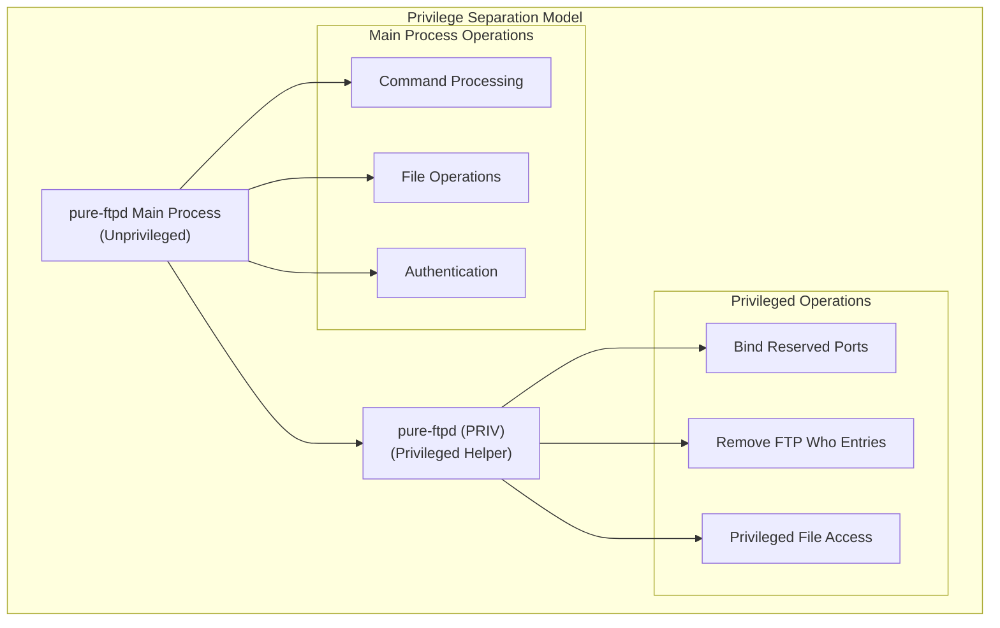
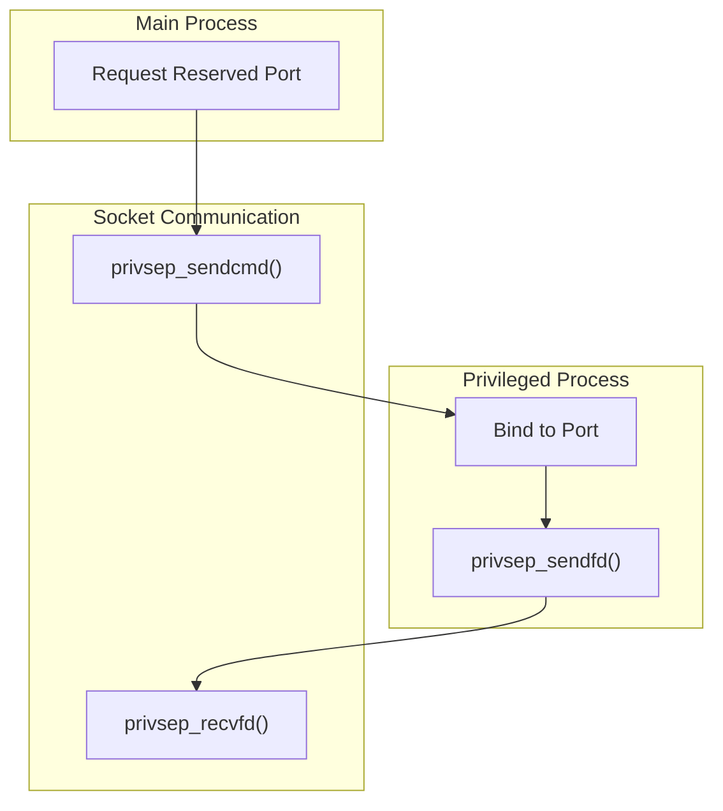
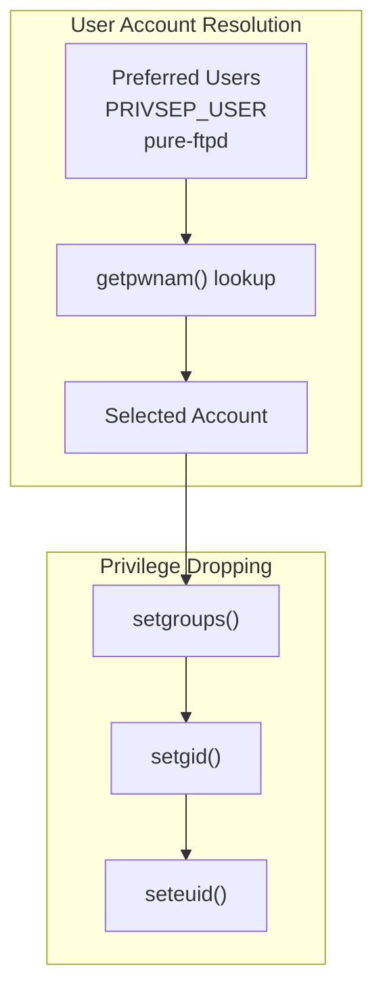
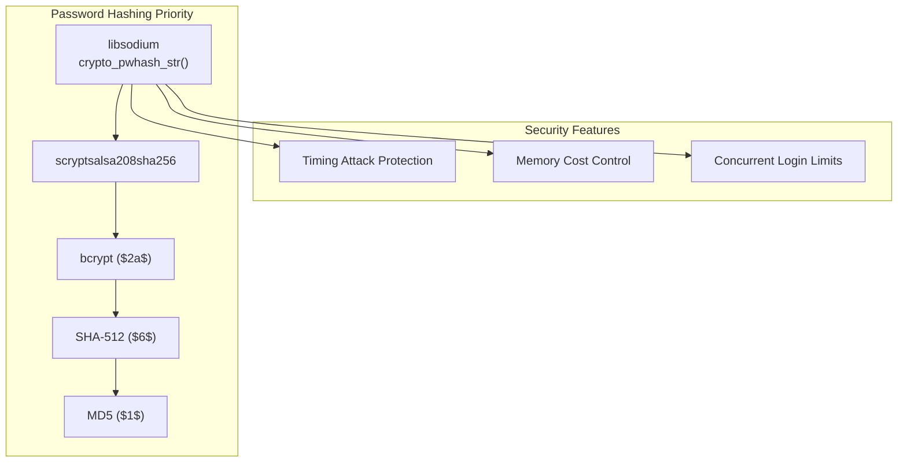
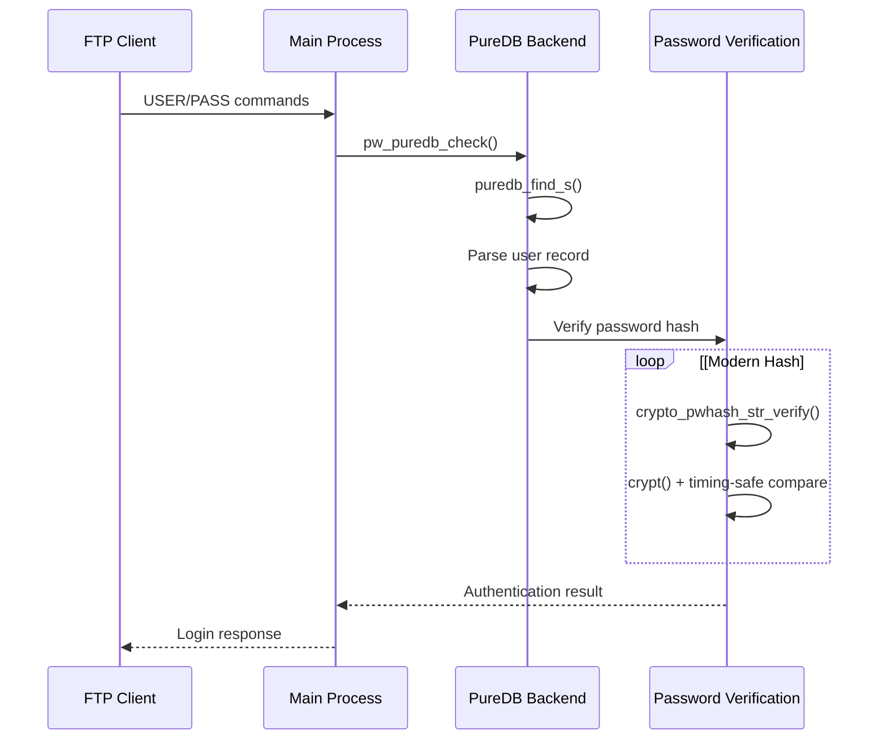
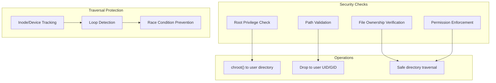
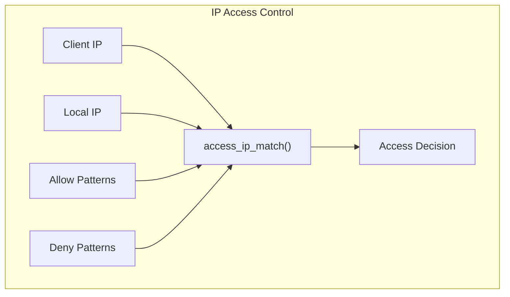
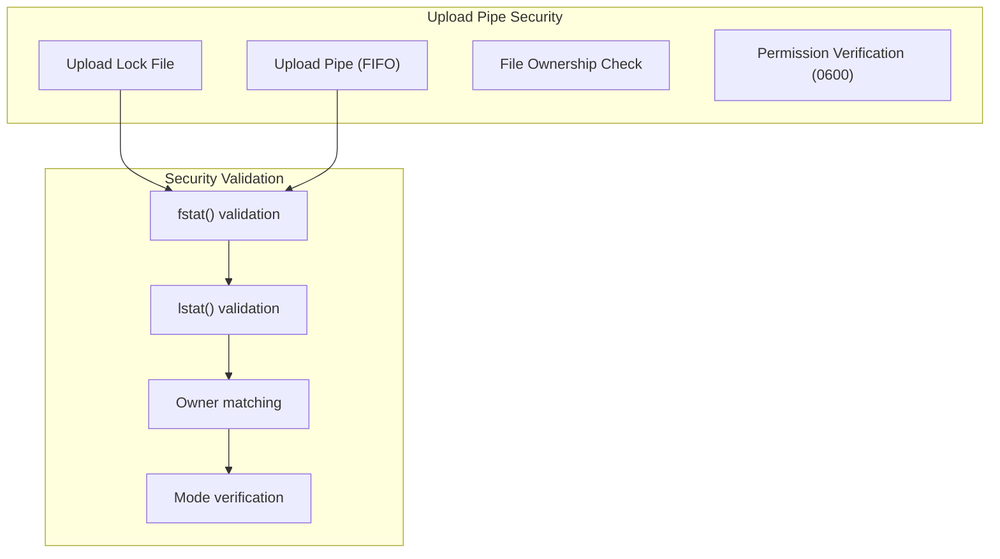
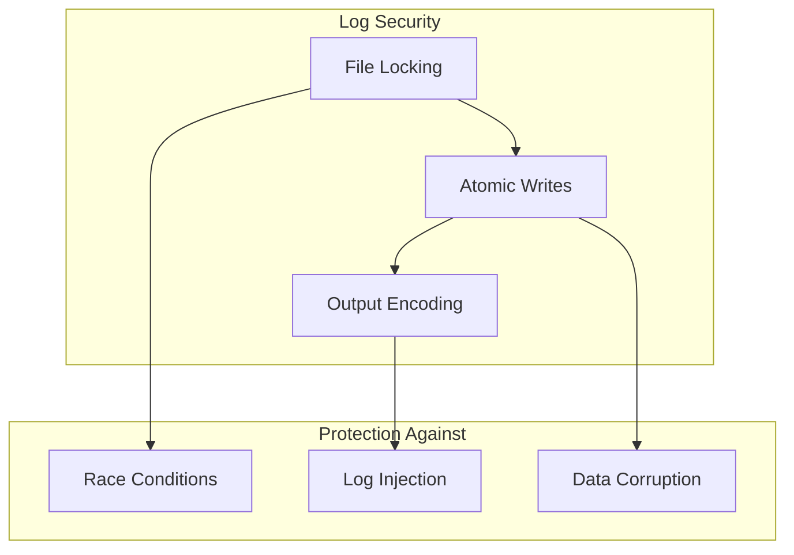

# Privilege Separation and Security

> **Relevant source files**
> * [src/altlog.c](https://github.com/jedisct1/pure-ftpd/blob/3818577a/src/altlog.c)
> * [src/log_puredb.c](https://github.com/jedisct1/pure-ftpd/blob/3818577a/src/log_puredb.c)
> * [src/privsep.c](https://github.com/jedisct1/pure-ftpd/blob/3818577a/src/privsep.c)
> * [src/privsep_p.h](https://github.com/jedisct1/pure-ftpd/blob/3818577a/src/privsep_p.h)
> * [src/pure-pw.c](https://github.com/jedisct1/pure-ftpd/blob/3818577a/src/pure-pw.c)
> * [src/pure-quotacheck.c](https://github.com/jedisct1/pure-ftpd/blob/3818577a/src/pure-quotacheck.c)
> * [src/upload-pipe.c](https://github.com/jedisct1/pure-ftpd/blob/3818577a/src/upload-pipe.c)

This document covers Pure-FTPd's privilege separation architecture and security mechanisms. It focuses on process isolation, privilege dropping, secure inter-process communication, and other security features that protect the FTP server from privilege escalation and unauthorized access.

For information about TLS/SSL encryption, see [TLS/SSL Encryption](/jedisct1/pure-ftpd/3.1-tlsssl-encryption). For authentication methods and user management, see [Authentication and User Management](/jedisct1/pure-ftpd/4-authentication-and-user-management).

## Privilege Separation Architecture

Pure-FTPd implements a privilege separation model where the main FTP server process runs with minimal privileges, while a separate privileged helper process handles operations that require elevated permissions.

### Process Structure



Sources: [src/privsep.c L335-L364](https://github.com/jedisct1/pure-ftpd/blob/3818577a/src/privsep.c#L335-L364)

The privilege separation is initialized through `privsep_init()`, which creates a Unix domain socket pair and forks into two processes:

* **Main Process**: Handles FTP protocol commands, file transfers, and user interactions
* **Privileged Helper**: Performs operations requiring root privileges like binding to reserved ports

### Initialization Sequence

```mermaid
sequenceDiagram
  participant Main Process
  participant privsep_init()
  participant Privileged Process

  Main Process->>privsep_init(): Initialize privilege separation
  privsep_init()->>privsep_init(): Create Unix socket pair
  privsep_init()->>privsep_init(): fork()
  loop [Child Process (Privileged)]
    privsep_init()->>Privileged Process: Set process name "pure-ftpd (PRIV)"
    Privileged Process->>Privileged Process: Close unnecessary descriptors
    Privileged Process->>Privileged Process: Initialize privsep user account
    Privileged Process->>Privileged Process: Drop to privsep_uid
    Privileged Process->>Privileged Process: Enter main loop
    privsep_init()-->>Main Process: Return success
    Main Process->>Main Process: Continue with normal operation
  end
```

Sources: [src/privsep.c L335-L364](https://github.com/jedisct1/pure-ftpd/blob/3818577a/src/privsep.c#L335-L364)

 [src/privsep.c L268-L278](https://github.com/jedisct1/pure-ftpd/blob/3818577a/src/privsep.c#L268-L278)

## Inter-Process Communication Protocol

The two processes communicate through a well-defined protocol using Unix domain sockets with support for file descriptor passing.

### Command Structure

The communication protocol uses structured messages defined in `PrivSepQuery` and `PrivSepAnswer` unions:

| Command | Purpose | Privilege Required |
| --- | --- | --- |
| `PRIVSEPCMD_BINDRESPORT` | Bind to reserved port | Root |
| `PRIVSEPCMD_REMOVEFTPWHOENTRY` | Remove FTP who entry | File system access |
| `PRIVSEPCMD_ANSWER_FD` | File descriptor response | - |

Sources: [src/privsep_p.h L22-L30](https://github.com/jedisct1/pure-ftpd/blob/3818577a/src/privsep_p.h#L22-L30)

 [src/privsep_p.h L48-L54](https://github.com/jedisct1/pure-ftpd/blob/3818577a/src/privsep_p.h#L48-L54)

### File Descriptor Passing



Sources: [src/privsep.c L41-L88](https://github.com/jedisct1/pure-ftpd/blob/3818577a/src/privsep.c#L41-L88)

 [src/privsep.c L90-L140](https://github.com/jedisct1/pure-ftpd/blob/3818577a/src/privsep.c#L90-L140)

The `privsep_sendfd()` and `privsep_recvfd()` functions use `SCM_RIGHTS` control messages to safely pass file descriptors between processes, enabling the privileged process to create sockets and pass them to the unprivileged main process.

## Security Mechanisms

### User Account Isolation

Pure-FTPd creates a dedicated system user account for privilege separation:



Sources: [src/privsep.c L308-L333](https://github.com/jedisct1/pure-ftpd/blob/3818577a/src/privsep.c#L308-L333)

 [src/privsep_p.h L18-L20](https://github.com/jedisct1/pure-ftpd/blob/3818577a/src/privsep_p.h#L18-L20)

### Process State Management

The privileged process alternates between privileged and unprivileged states:

* `privsep_priv_user()`: Elevates to root for privileged operations
* `privsep_unpriv_user()`: Drops back to `privsep_uid` for safety

Sources: [src/privsep.c L142-L154](https://github.com/jedisct1/pure-ftpd/blob/3818577a/src/privsep.c#L142-L154)

### Resource Cleanup

The privileged process closes unnecessary file descriptors to reduce attack surface:

```
// Closes upload pipes, log files, and standard streams
privsep_privpart_closejunk()
```

Sources: [src/privsep.c L280-L306](https://github.com/jedisct1/pure-ftpd/blob/3818577a/src/privsep.c#L280-L306)

## Authentication Security

### Password Hashing

Pure-FTPd supports modern password hashing algorithms through libsodium and fallback methods:



Sources: [src/pure-pw.c L269-L374](https://github.com/jedisct1/pure-ftpd/blob/3818577a/src/pure-pw.c#L269-L374)

The `best_crypt()` function implements adaptive password hashing with:

* Time-based calibration to maintain consistent authentication time
* Memory usage limits based on concurrent user limits
* Protection against timing attacks

### Authentication Flow Security



Sources: [src/log_puredb.c L369-L400](https://github.com/jedisct1/pure-ftpd/blob/3818577a/src/log_puredb.c#L369-L400)

 [src/log_puredb.c L215-L367](https://github.com/jedisct1/pure-ftpd/blob/3818577a/src/log_puredb.c#L215-L367)

## File System Security

### Quota Enforcement

The quota checking system implements multiple security measures:



Sources: [src/pure-quotacheck.c L68-L166](https://github.com/jedisct1/pure-ftpd/blob/3818577a/src/pure-quotacheck.c#L68-L166)

 [src/pure-quotacheck.c L212-L219](https://github.com/jedisct1/pure-ftpd/blob/3818577a/src/pure-quotacheck.c#L212-L219)

### Access Control

IP-based access control is implemented with CIDR support:



Sources: [src/log_puredb.c L74-L156](https://github.com/jedisct1/pure-ftpd/blob/3818577a/src/log_puredb.c#L74-L156)

 [src/log_puredb.c L160-L185](https://github.com/jedisct1/pure-ftpd/blob/3818577a/src/log_puredb.c#L160-L185)

## Upload Processing Security

The upload script system implements secure file handling:



Sources: [src/upload-pipe.c L14-L91](https://github.com/jedisct1/pure-ftpd/blob/3818577a/src/upload-pipe.c#L14-L91)

The upload pipe system prevents:

* Race conditions through file locking
* Unauthorized access through ownership verification
* Symlink attacks through `lstat()` validation
* Permission escalation through mode checking

## Logging Security

Alternative logging formats include security considerations:

### Secure Log Writing



Sources: [src/altlog.c L20-L50](https://github.com/jedisct1/pure-ftpd/blob/3818577a/src/altlog.c#L20-L50)

 [src/altlog.c L102-L152](https://github.com/jedisct1/pure-ftpd/blob/3818577a/src/altlog.c#L102-L152)

The logging system uses:

* File locking to prevent concurrent write issues
* URL encoding to prevent log injection attacks
* Atomic write operations for data integrity

This comprehensive security model ensures that Pure-FTPd operates with minimal privileges while maintaining the ability to perform necessary privileged operations through a controlled, auditable interface.