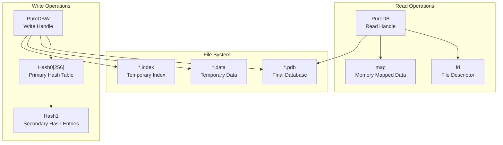
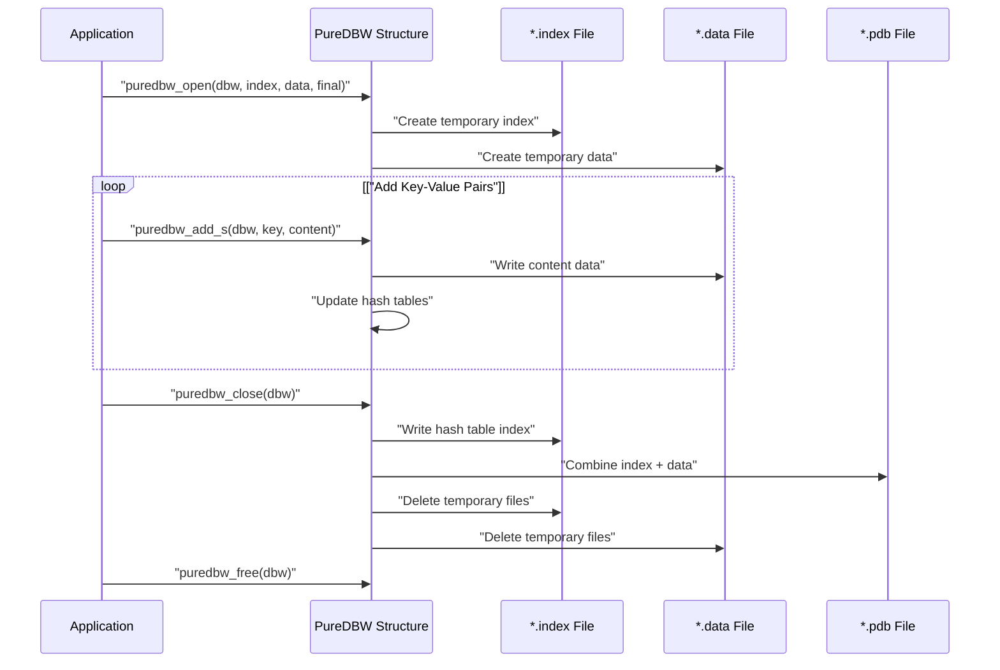
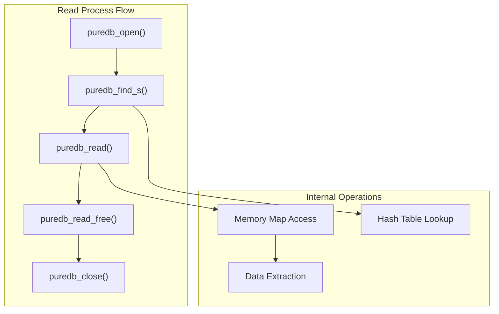

# PureDB API and Examples

> **Relevant source files**
> * [puredb/src/example_read.c](https://github.com/jedisct1/pure-ftpd/blob/3818577a/puredb/src/example_read.c)
> * [puredb/src/example_write.c](https://github.com/jedisct1/pure-ftpd/blob/3818577a/puredb/src/example_write.c)
> * [puredb/src/puredb_p.h](https://github.com/jedisct1/pure-ftpd/blob/3818577a/puredb/src/puredb_p.h)
> * [puredb/src/puredb_read.h](https://github.com/jedisct1/pure-ftpd/blob/3818577a/puredb/src/puredb_read.h)
> * [puredb/src/puredb_write.h](https://github.com/jedisct1/pure-ftpd/blob/3818577a/puredb/src/puredb_write.h)

This document provides comprehensive documentation of the PureDB programming interface, including data structures, functions, and practical usage examples. PureDB is Pure-FTPd's lightweight, embedded key-value database system designed for high-performance virtual user authentication and configuration storage.

For information about PureDB's role in virtual user management, see [Virtual Users with PureDB](/jedisct1/pure-ftpd/4.1-virtual-users-with-puredb). For administrative tools that use PureDB, see [Administrative Utilities](/jedisct1/pure-ftpd/5.3-administrative-utilities).

## API Overview

PureDB provides separate APIs for reading and writing operations, implemented through distinct data structures and function sets. The system uses a hash table-based indexing mechanism for fast key lookups.

### Core Data Structures



Sources: [puredb/src/puredb_write.h L23-L42](https://github.com/jedisct1/pure-ftpd/blob/3818577a/puredb/src/puredb_write.h#L23-L42)

 [puredb/src/puredb_read.h L23-L27](https://github.com/jedisct1/pure-ftpd/blob/3818577a/puredb/src/puredb_read.h#L23-L27)

### Function Categories

| Operation Category | Write API | Read API |
| --- | --- | --- |
| Database Management | `puredbw_open()`, `puredbw_close()`, `puredbw_free()` | `puredb_open()`, `puredb_close()` |
| Data Operations | `puredbw_add()`, `puredbw_add_s()` | `puredb_find()`, `puredb_find_s()`, `puredb_read()` |
| Memory Management | Automatic during close | `puredb_read_free()` |

Sources: [puredb/src/puredb_write.h L44-L58](https://github.com/jedisct1/pure-ftpd/blob/3818577a/puredb/src/puredb_write.h#L44-L58)

 [puredb/src/puredb_read.h L35-L46](https://github.com/jedisct1/pure-ftpd/blob/3818577a/puredb/src/puredb_read.h#L35-L46)

## Write Operations API

The write API centers around the `PureDBW` structure, which manages the creation of new PureDB databases through a two-phase process involving temporary index and data files.

### Database Creation Workflow



Sources: [puredb/src/example_write.c L8-L30](https://github.com/jedisct1/pure-ftpd/blob/3818577a/puredb/src/example_write.c#L8-L30)

### Write Function Reference

#### puredbw_open()

```javascript
int puredbw_open(PureDBW * const dbw,
                 const char * const file_index,
                 const char * const file_data,
                 const char * const file_final);
```

Initializes a new PureDB write session with three file paths: temporary index file, temporary data file, and final database file.

#### puredbw_add_s()

```javascript
int puredbw_add_s(PureDBW * const dbw,
                  const char * const key, 
                  const char * const content);
```

Adds a null-terminated string key-value pair to the database. For binary data, use `puredbw_add()` with explicit length parameters.

#### puredbw_close()

```javascript
int puredbw_close(PureDBW * const dbw);
```

Finalizes the database by writing the hash table index and combining temporary files into the final `.pdb` format.

Sources: [puredb/src/puredb_write.h L44-L58](https://github.com/jedisct1/pure-ftpd/blob/3818577a/puredb/src/puredb_write.h#L44-L58)

## Read Operations API

The read API provides memory-mapped access to existing PureDB databases, enabling fast key lookups and data retrieval.

### Database Access Pattern



Sources: [puredb/src/example_read.c L8-L34](https://github.com/jedisct1/pure-ftpd/blob/3818577a/puredb/src/example_read.c#L8-L34)

### Read Function Reference

#### puredb_open()

```javascript
int puredb_open(PureDB * const db, const char *dbfile);
```

Opens an existing PureDB database file for reading, establishing memory mapping when available.

#### puredb_find_s()

```javascript
int puredb_find_s(PureDB * const db, const char * const tofind,
                  off_t * const retpos, size_t * const retlen);
```

Locates a key in the database and returns the offset and length of associated data. Returns 0 on success, non-zero if key not found.

#### puredb_read()

```javascript
void *puredb_read(PureDB * const db, const off_t offset, const size_t len);
```

Retrieves data from the specified database offset. Returns allocated memory that must be freed with `puredb_read_free()`.

Sources: [puredb/src/puredb_read.h L35-L46](https://github.com/jedisct1/pure-ftpd/blob/3818577a/puredb/src/puredb_read.h#L35-L46)

## Complete Usage Examples

### Writing a Database

The following demonstrates creating a new PureDB database with multiple key-value pairs:

```sql
// From example_write.c
PureDBW dbw;

if (puredbw_open(&dbw, "puredb.index", "puredb.data", "puredb.pdb") != 0) {
    perror("Can't create the database");
    goto end;
}
if (puredbw_add_s(&dbw, "key", "content") != 0 ||
    puredbw_add_s(&dbw, "key2", "content2") != 0 ||
    puredbw_add_s(&dbw, "key42", "content42") != 0) {
    perror("Error while inserting key/data pairs");
    goto end;
}
if (puredbw_close(&dbw) != 0) {
    perror("Error while closing the database");
}
```

Sources: [puredb/src/example_write.c L10-L24](https://github.com/jedisct1/pure-ftpd/blob/3818577a/puredb/src/example_write.c#L10-L24)

### Reading from a Database

The following demonstrates reading data from an existing PureDB database:

```c
// From example_read.c
char *data;
PureDB db;
off_t retpos;
size_t retlen;
int err;

if (puredb_open(&db, "puredb.pdb") != 0) {
    perror("Can't open the database");
    goto end;
}
if ((err = puredb_find_s(&db, "key42", &retpos, &retlen)) != 0) {
    fprintf(stderr, "The key wasn't found [err=%d]\n", err);
    goto end;
}
if ((data = puredb_read(&db, retpos, retlen)) != NULL) {
    printf("Matching data: [%s]\n", data);
    puredb_read_free(data);
}
```

Sources: [puredb/src/example_read.c L16-L27](https://github.com/jedisct1/pure-ftpd/blob/3818577a/puredb/src/example_read.c#L16-L27)

## Data Types and Constants

### Type Definitions

The PureDB API uses portable 32-bit unsigned integers through conditional compilation:

```python
#ifndef PUREDB_U32_T
# if SHRT_MAX >= 2147483647
typedef unsigned short puredb_u32_t;
# elif INT_MAX >= 2147483647
typedef unsigned int puredb_u32_t;
# else
typedef unsigned long puredb_u32_t;
# endif
#endif
```

### Version Constants

| Constant | Value | Purpose |
| --- | --- | --- |
| `PUREDB_VERSION` | "PDB2" | Database format identifier |
| `PUREDB_LIB_VERSION` | 1 | API version number |

Sources: [puredb/src/puredb_read.h L9-L20](https://github.com/jedisct1/pure-ftpd/blob/3818577a/puredb/src/puredb_read.h#L9-L20)

 [puredb/src/puredb_write.h L9-L21](https://github.com/jedisct1/pure-ftpd/blob/3818577a/puredb/src/puredb_write.h#L9-L21)

## Error Handling and Best Practices

### Resource Management

Always follow this pattern for proper resource cleanup:

1. **Write Operations**: Call `puredbw_free()` after `puredbw_close()`, even on errors
2. **Read Operations**: Call `puredb_read_free()` for each successful `puredb_read()` call
3. **Database Handles**: Always call `puredb_close()` after successful `puredb_open()`

### Error Return Codes

* **Success**: Functions return `0` on successful completion
* **Failure**: Non-zero return values indicate errors; use `perror()` or check `errno` for details
* **Not Found**: `puredb_find_s()` returns non-zero when key doesn't exist

### Memory Considerations

The PureDB read API uses memory mapping when available (`USE_MAPPED_IO`), falling back to traditional file I/O on systems without `mmap()` support. The implementation automatically handles platform-specific optimizations.

Sources: [puredb/src/puredb_p.h L83-L85](https://github.com/jedisct1/pure-ftpd/blob/3818577a/puredb/src/puredb_p.h#L83-L85)

 [puredb/src/example_read.c L20-L22](https://github.com/jedisct1/pure-ftpd/blob/3818577a/puredb/src/example_read.c#L20-L22)

 [puredb/src/example_write.c L26-L27](https://github.com/jedisct1/pure-ftpd/blob/3818577a/puredb/src/example_write.c#L26-L27)