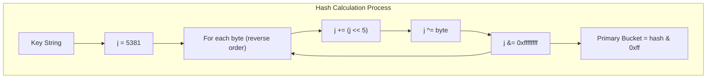
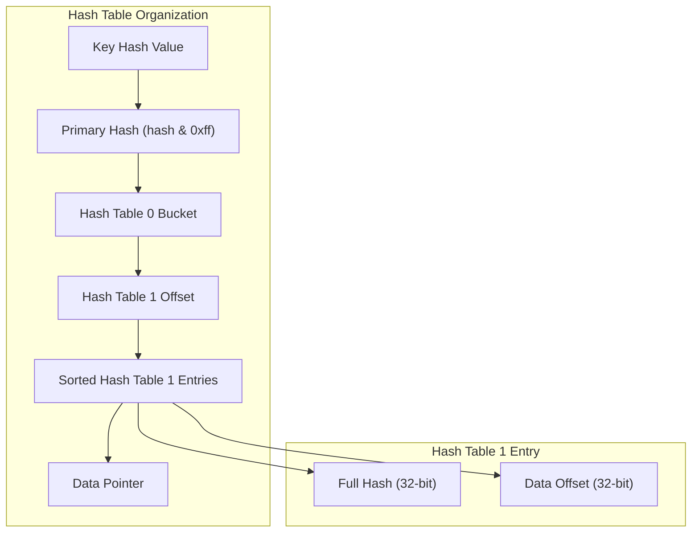
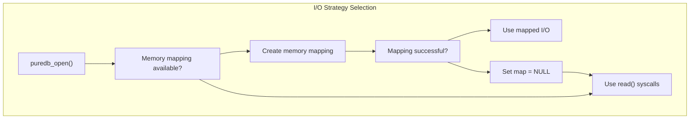
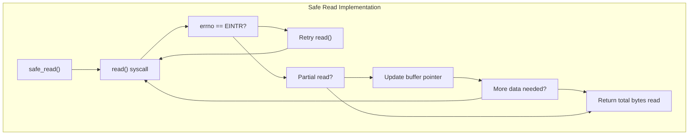
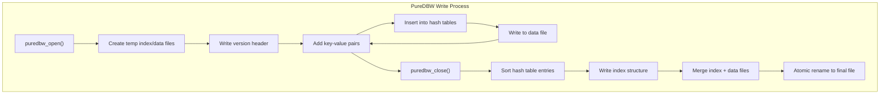
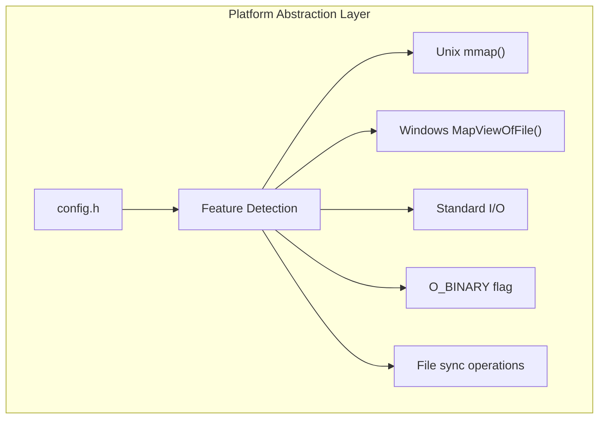

# PureDB Database System

> **Relevant source files**
> * [puredb/src/puredb_p.h](https://github.com/jedisct1/pure-ftpd/blob/3818577a/puredb/src/puredb_p.h)
> * [puredb/src/puredb_read.c](https://github.com/jedisct1/pure-ftpd/blob/3818577a/puredb/src/puredb_read.c)
> * [puredb/src/puredb_read.h](https://github.com/jedisct1/pure-ftpd/blob/3818577a/puredb/src/puredb_read.h)
> * [puredb/src/puredb_write.c](https://github.com/jedisct1/pure-ftpd/blob/3818577a/puredb/src/puredb_write.c)
> * [puredb/src/puredb_write.h](https://github.com/jedisct1/pure-ftpd/blob/3818577a/puredb/src/puredb_write.h)

This document covers the PureDB embedded key-value database system used by Pure-FTPd for storing virtual user information and configuration data. PureDB provides a lightweight, hash-indexed database with optimized read performance through memory mapping and binary search capabilities.

For information about virtual user management using PureDB, see [Virtual Users with PureDB](/jedisct1/pure-ftpd/4.1-virtual-users-with-puredb). For programming examples and API usage, see [PureDB API and Examples](/jedisct1/pure-ftpd/7.1-puredb-api-and-examples).

## Database Architecture

PureDB is a read-optimized, hash-indexed key-value database designed for fast lookups with minimal memory overhead. The system consists of separate read and write components that work together to create and query database files.

### Core Components

```

```

Sources: [puredb/src/puredb_read.h L23-L27](https://github.com/jedisct1/pure-ftpd/blob/3818577a/puredb/src/puredb_read.h#L23-L27)

 [puredb/src/puredb_write.h L33-L42](https://github.com/jedisct1/pure-ftpd/blob/3818577a/puredb/src/puredb_write.h#L33-L42)

The database uses a two-level hash table structure with 256 primary buckets, each containing sorted lists of hash collisions for efficient binary search operations.

## File Format and Structure

PureDB files use the "PDB2" format with a specific binary layout optimized for sequential access and memory mapping.

### Database File Layout

```

```

Sources: [puredb/src/puredb_read.c L142-L147](https://github.com/jedisct1/pure-ftpd/blob/3818577a/puredb/src/puredb_read.c#L142-L147)

 [puredb/src/puredb_write.c L68-L77](https://github.com/jedisct1/pure-ftpd/blob/3818577a/puredb/src/puredb_write.c#L68-L77)

| Component | Size | Description |
| --- | --- | --- |
| Version Header | 4 bytes | "PDB2" magic string |
| Hash Table 0 | 256 × 4 bytes | Offsets to Hash Table 1 entries |
| Hash Table 0 End | 4 bytes | End offset marker |
| Hash Table 1 | Variable | Sorted hash/offset pairs |
| Data Section | Variable | Key-value pairs with length prefixes |

## Hash-Based Indexing System

The indexing system uses a djb2-based hash function with a two-level lookup structure for optimal performance.

### Hash Function Implementation

The hash function is implemented in both read and write modules with identical logic:



Sources: [puredb/src/puredb_read.c L9-L21](https://github.com/jedisct1/pure-ftpd/blob/3818577a/puredb/src/puredb_read.c#L9-L21)

 [puredb/src/puredb_write.c L26-L38](https://github.com/jedisct1/pure-ftpd/blob/3818577a/puredb/src/puredb_write.c#L26-L38)

### Two-Level Hash Table Structure



Sources: [puredb/src/puredb_read.c L155-L194](https://github.com/jedisct1/pure-ftpd/blob/3818577a/puredb/src/puredb_read.c#L155-L194)

 [puredb/src/puredb_write.h L23-L31](https://github.com/jedisct1/pure-ftpd/blob/3818577a/puredb/src/puredb_write.h#L23-L31)

## Memory Management and I/O

PureDB supports multiple I/O strategies depending on platform capabilities and file size.

### Memory Mapping Support

| Platform | Implementation | Macro |
| --- | --- | --- |
| Unix/Linux | `mmap()` | `HAVE_MMAP` |
| Windows | `MapViewOfFile()` | `HAVE_MAPVIEWOFFILE` |
| Fallback | `read()` syscalls | None |



Sources: [puredb/src/puredb_read.c L119-L141](https://github.com/jedisct1/pure-ftpd/blob/3818577a/puredb/src/puredb_read.c#L119-L141)

 [puredb/src/puredb_p.h L83-L85](https://github.com/jedisct1/pure-ftpd/blob/3818577a/puredb/src/puredb_p.h#L83-L85)

### Safe I/O Operations

The `safe_read()` function handles interrupted system calls and partial reads:



Sources: [puredb/src/puredb_read.c L23-L42](https://github.com/jedisct1/pure-ftpd/blob/3818577a/puredb/src/puredb_read.c#L23-L42)

## Read Operations

The read system provides efficient key lookup through binary search within hash buckets.

### Key Lookup Process

```mermaid
flowchart TD

FIND_START["puredb_find()"]
CALC_HASH["Calculate key hash"]
GET_BUCKET["Get Hash Table 0 bucket"]
READ_OFFSETS["Read Hash Table 1 offsets"]
BINARY_SEARCH["Binary search on hash values"]
KEY_COMPARE["Compare actual key"]
DATA_LOCATION["Locate data section"]
READ_DATA["Read key-value pair"]
RETURN_RESULT["Return offset and length"]

subgraph subGraph0 ["puredb_find() Lookup Flow"]
    FIND_START
    CALC_HASH
    GET_BUCKET
    READ_OFFSETS
    BINARY_SEARCH
    KEY_COMPARE
    DATA_LOCATION
    READ_DATA
    RETURN_RESULT
    FIND_START --> CALC_HASH
    CALC_HASH --> GET_BUCKET
    GET_BUCKET --> READ_OFFSETS
    READ_OFFSETS --> BINARY_SEARCH
    BINARY_SEARCH --> KEY_COMPARE
    KEY_COMPARE --> DATA_LOCATION
    DATA_LOCATION --> READ_DATA
    READ_DATA --> RETURN_RESULT
end
```



Sources: [puredb/src/puredb_read.c L152-L284](https://github.com/jedisct1/pure-ftpd/blob/3818577a/puredb/src/puredb_read.c#L152-L284)

### Binary Search Optimization

When not compiled with `MINIMAL` or `NO_BINARY_LOOKUP`, PureDB uses binary search to quickly locate matching hash values:

| Search Phase | Description | Code Reference |
| --- | --- | --- |
| Initial Binary Search | Locate hash range in sorted list | [puredb/src/puredb_read.c L195-L234](https://github.com/jedisct1/pure-ftpd/blob/3818577a/puredb/src/puredb_read.c#L195-L234) |
| Backward Scan | Find first matching hash | [puredb/src/puredb_read.c L206-L217](https://github.com/jedisct1/pure-ftpd/blob/3818577a/puredb/src/puredb_read.c#L206-L217) |
| Key Verification | Compare actual key content | [puredb/src/puredb_read.c L258-L264](https://github.com/jedisct1/pure-ftpd/blob/3818577a/puredb/src/puredb_read.c#L258-L264) |

## Write Operations

The write system builds databases incrementally using temporary files and a two-phase commit process.

### Database Creation Process



Sources: [puredb/src/puredb_write.c L40-L77](https://github.com/jedisct1/pure-ftpd/blob/3818577a/puredb/src/puredb_write.c#L40-L77)

 [puredb/src/puredb_write.c L325-L337](https://github.com/jedisct1/pure-ftpd/blob/3818577a/puredb/src/puredb_write.c#L325-L337)

### Hash Table Management

The write system maintains in-memory hash tables during database construction:

| Data Structure | Purpose | Code Reference |
| --- | --- | --- |
| `Hash0[256]` | Primary hash buckets | [puredb/src/puredb_write.h L41](https://github.com/jedisct1/pure-ftpd/blob/3818577a/puredb/src/puredb_write.h#L41-L41) |
| `Hash1` lists | Secondary hash entries | [puredb/src/puredb_write.h L23-L26](https://github.com/jedisct1/pure-ftpd/blob/3818577a/puredb/src/puredb_write.h#L23-L26) |
| Dynamic allocation | Growing hash chains | [puredb/src/puredb_write.c L89-L103](https://github.com/jedisct1/pure-ftpd/blob/3818577a/puredb/src/puredb_write.c#L89-L103) |

## Platform Support

PureDB provides cross-platform compatibility through conditional compilation and feature detection.

### Platform-Specific Features

| Platform | Memory Mapping | Binary Mode | File Locking |
| --- | --- | --- | --- |
| Unix/Linux | `mmap()` | Not needed | `fsync()` |
| Windows | `MapViewOfFile()` | `O_BINARY` | `F_FULLFSYNC` |
| Generic | `malloc()`+`read()` | Handled automatically | Basic `fsync()` |



Sources: [puredb/src/puredb_p.h L35-L85](https://github.com/jedisct1/pure-ftpd/blob/3818577a/puredb/src/puredb_p.h#L35-L85)

 [puredb/src/puredb_write.c L279-L284](https://github.com/jedisct1/pure-ftpd/blob/3818577a/puredb/src/puredb_write.c#L279-L284)

The system automatically detects available platform features at compile time and selects the most efficient I/O strategy for each environment.