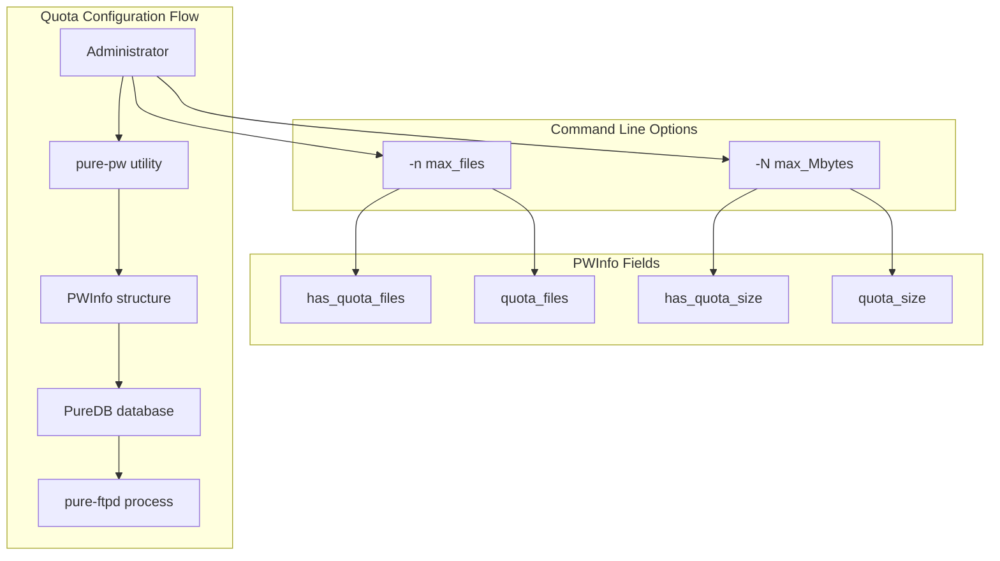
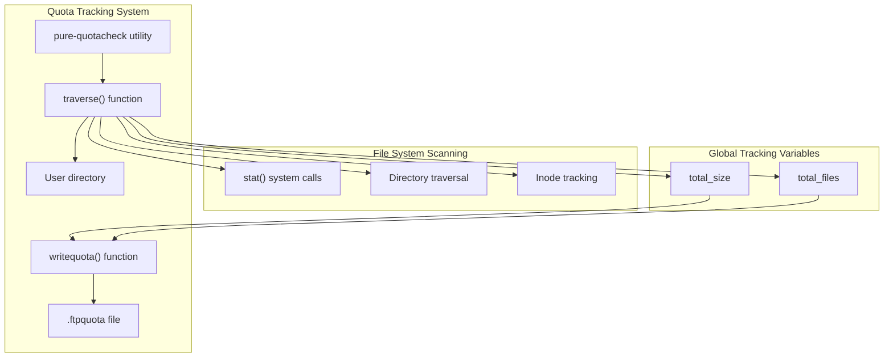
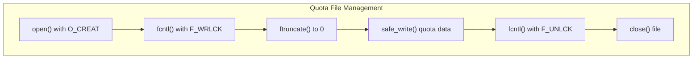
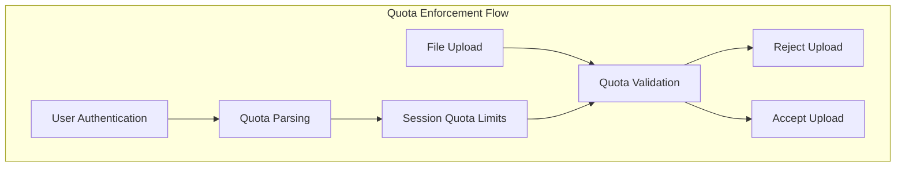

# Quota Management

> **Relevant source files**
> * [man/Makefile.am](https://github.com/jedisct1/pure-ftpd/blob/3818577a/man/Makefile.am)
> * [man/pure-authd.8.in](https://github.com/jedisct1/pure-ftpd/blob/3818577a/man/pure-authd.8.in)
> * [man/pure-ftpwho.8.in](https://github.com/jedisct1/pure-ftpd/blob/3818577a/man/pure-ftpwho.8.in)
> * [man/pure-pw.8.in](https://github.com/jedisct1/pure-ftpd/blob/3818577a/man/pure-pw.8.in)
> * [man/pure-pwconvert.8.in](https://github.com/jedisct1/pure-ftpd/blob/3818577a/man/pure-pwconvert.8.in)
> * [man/pure-quotacheck.8.in](https://github.com/jedisct1/pure-ftpd/blob/3818577a/man/pure-quotacheck.8.in)
> * [man/pure-statsdecode.8.in](https://github.com/jedisct1/pure-ftpd/blob/3818577a/man/pure-statsdecode.8.in)
> * [man/pure-uploadscript.8.in](https://github.com/jedisct1/pure-ftpd/blob/3818577a/man/pure-uploadscript.8.in)
> * [src/altlog.c](https://github.com/jedisct1/pure-ftpd/blob/3818577a/src/altlog.c)
> * [src/log_puredb.c](https://github.com/jedisct1/pure-ftpd/blob/3818577a/src/log_puredb.c)
> * [src/privsep.c](https://github.com/jedisct1/pure-ftpd/blob/3818577a/src/privsep.c)
> * [src/privsep_p.h](https://github.com/jedisct1/pure-ftpd/blob/3818577a/src/privsep_p.h)
> * [src/pure-pw.c](https://github.com/jedisct1/pure-ftpd/blob/3818577a/src/pure-pw.c)
> * [src/pure-quotacheck.c](https://github.com/jedisct1/pure-ftpd/blob/3818577a/src/pure-quotacheck.c)
> * [src/upload-pipe.c](https://github.com/jedisct1/pure-ftpd/blob/3818577a/src/upload-pipe.c)

This document covers Pure-FTPd's quota management system, which allows administrators to set and enforce disk usage limits for virtual users. The system provides both file count quotas and total size quotas, with automated tracking and enforcement mechanisms.

For information about virtual user management, see [Virtual Users with PureDB](/jedisct1/pure-ftpd/4.1-virtual-users-with-puredb). For administrative utilities, see [Administrative Utilities](/jedisct1/pure-ftpd/5.3-administrative-utilities).

## Overview

Pure-FTPd's quota system consists of two main components:

1. **Quota Configuration** - Setting quota limits for users through the `pure-pw` utility
2. **Quota Tracking** - Monitoring actual disk usage through the `pure-quotacheck` utility and `.ftpquota` files

The system supports two types of quotas:

* **File count quotas** - Maximum number of files a user can store
* **Size quotas** - Maximum total size in bytes a user can consume

## Quota Configuration Architecture



**Sources:** [src/pure-pw.c L415-L416](https://github.com/jedisct1/pure-ftpd/blob/3818577a/src/pure-pw.c#L415-L416)

 [src/pure-pw.c L501-L510](https://github.com/jedisct1/pure-ftpd/blob/3818577a/src/pure-pw.c#L501-L510)

 [src/pure-pw.c L706-L720](https://github.com/jedisct1/pure-ftpd/blob/3818577a/src/pure-pw.c#L706-L720)

## Quota Tracking Architecture



**Sources:** [src/pure-quotacheck.c L68-L166](https://github.com/jedisct1/pure-ftpd/blob/3818577a/src/pure-quotacheck.c#L68-L166)

 [src/pure-quotacheck.c L20-L21](https://github.com/jedisct1/pure-ftpd/blob/3818577a/src/pure-quotacheck.c#L20-L21)

 [src/pure-quotacheck.c L221-L270](https://github.com/jedisct1/pure-ftpd/blob/3818577a/src/pure-quotacheck.c#L221-L270)

## Quota Setting with pure-pw

The `pure-pw` utility allows administrators to set quotas when creating or modifying virtual users.

### Quota Command Line Options

| Option | Description | Data Type |
| --- | --- | --- |
| `-n <max_files>` | Maximum number of files | `unsigned long long` |
| `-N <max_Mbytes>` | Maximum size in megabytes | `unsigned long long` |

### PWInfo Structure Fields

The quota information is stored in the `PWInfo` structure:

| Field | Type | Purpose |
| --- | --- | --- |
| `has_quota_files` | `int` | Flag indicating if file quota is set |
| `quota_files` | `unsigned long long` | Maximum number of files |
| `has_quota_size` | `int` | Flag indicating if size quota is set |
| `quota_size` | `unsigned long long` | Maximum size in bytes |

**Sources:** [src/pure-pw.c L415-L416](https://github.com/jedisct1/pure-ftpd/blob/3818577a/src/pure-pw.c#L415-L416)

 [src/pure-pw.c L501-L510](https://github.com/jedisct1/pure-ftpd/blob/3818577a/src/pure-pw.c#L501-L510)

## Quota Storage in PureDB

Quotas are stored as part of the user record in the PureDB database. The `add_new_pw_line()` function writes quota information to the database:

```mermaid
flowchart TD

LOGIN["login"]
PWD["password"]
UID["uid"]
GID["gid"]
GECOS["gecos"]
HOME["home"]
BWUL["bw_ul"]
BWDL["bw_dl"]
RATIOS["ratios"]
MAXCNX["max_cnx"]
QFILES["quota_files"]
QSIZE["quota_size"]
IPS["ip_restrictions"]
TIME["time_restrictions"]

subgraph subGraph0 ["PureDB Record Format"]
    LOGIN
    PWD
    UID
    GID
    GECOS
    HOME
    BWUL
    BWDL
    RATIOS
    MAXCNX
    QFILES
    QSIZE
    IPS
    TIME
    LOGIN --> PWD
    PWD --> UID
    UID --> GID
    GID --> GECOS
    GECOS --> HOME
    HOME --> BWUL
    BWUL --> BWDL
    BWDL --> RATIOS
    RATIOS --> MAXCNX
    MAXCNX --> QFILES
    QFILES --> QSIZE
    QSIZE --> IPS
    IPS --> TIME
end
```



**Sources:** [src/pure-pw.c L706-L720](https://github.com/jedisct1/pure-ftpd/blob/3818577a/src/pure-pw.c#L706-L720)

## Quota Checking with pure-quotacheck

The `pure-quotacheck` utility scans user directories to calculate current disk usage and creates `.ftpquota` files.

### Directory Traversal Process

The `traverse()` function implements a recursive directory scanner with security features:

1. **Inode Tracking** - Prevents infinite loops by tracking visited inodes
2. **Permission Enforcement** - Ensures proper read access to directories
3. **File Type Filtering** - Only processes regular files and directories
4. **Quota File Exclusion** - Skips `.ftpquota` files during scanning

### Security Features

| Feature | Implementation | Purpose |
| --- | --- | --- |
| Root privilege dropping | `changeuidgid()` | Runs with target user privileges |
| Chroot jail | `chroot(startpath)` | Prevents directory traversal attacks |
| Inode deduplication | `Node` array tracking | Prevents symlink loops |
| Permission enforcement | `fchmod()` calls | Ensures readable directories |

**Sources:** [src/pure-quotacheck.c L68-L166](https://github.com/jedisct1/pure-ftpd/blob/3818577a/src/pure-quotacheck.c#L68-L166)

 [src/pure-quotacheck.c L212-L219](https://github.com/jedisct1/pure-ftpd/blob/3818577a/src/pure-quotacheck.c#L212-L219)

## Quota File Format

The `.ftpquota` file contains current usage statistics in a simple text format:

```
<file_count> <total_size_bytes>
```

### Quota File Operations



**Sources:** [src/pure-quotacheck.c L221-L270](https://github.com/jedisct1/pure-ftpd/blob/3818577a/src/pure-quotacheck.c#L221-L270)

## Quota Parsing in Authentication

When users authenticate, the `pw_puredb_parseline()` function extracts quota information from their PureDB record:

### AuthResult Structure Fields

| Field | Type | Purpose |
| --- | --- | --- |
| `quota_files_changed` | `int` | Flag indicating file quota is active |
| `user_quota_files` | `unsigned long long` | File count limit |
| `quota_size_changed` | `int` | Flag indicating size quota is active |
| `user_quota_size` | `unsigned long long` | Size limit in bytes |

### Quota Parsing Logic

The parsing occurs during user authentication and sets the quota limits for the session:

1. Extract quota fields from PureDB record
2. Convert string values to numeric limits
3. Set appropriate flags in `AuthResult` structure
4. Make limits available to main FTPd process

**Sources:** [src/log_puredb.c L320-L337](https://github.com/jedisct1/pure-ftpd/blob/3818577a/src/log_puredb.c#L320-L337)

## Integration with Main Server



**Sources:** [src/log_puredb.c L320-L337](https://github.com/jedisct1/pure-ftpd/blob/3818577a/src/log_puredb.c#L320-L337)

## Command Line Usage

### Setting Quotas

```markdown
# Set file count quota of 1000 files
pure-pw useradd john -u 1001 -g 1001 -d /home/john -n 1000

# Set size quota of 100 MB
pure-pw useradd john -u 1001 -g 1001 -d /home/john -N 100

# Set both quotas
pure-pw useradd john -u 1001 -g 1001 -d /home/john -n 1000 -N 100
```

### Checking Quotas

```sql
# Update quota file for user john
pure-quotacheck -u john -d /home/john

# Update quota with specific group
pure-quotacheck -u john -g users -d /home/john
```

**Sources:** [man/pure-pw.8.in L7-L15](https://github.com/jedisct1/pure-ftpd/blob/3818577a/man/pure-pw.8.in#L7-L15)

 [man/pure-quotacheck.8.in L7](https://github.com/jedisct1/pure-ftpd/blob/3818577a/man/pure-quotacheck.8.in#L7-L7)