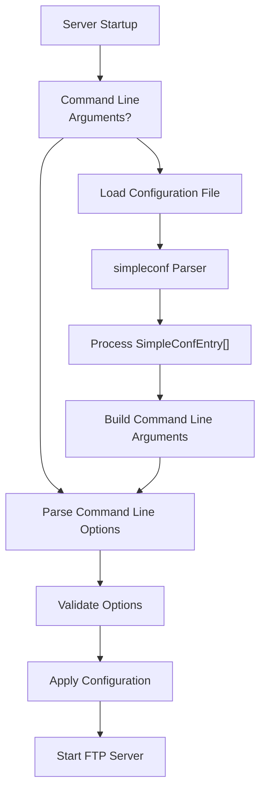
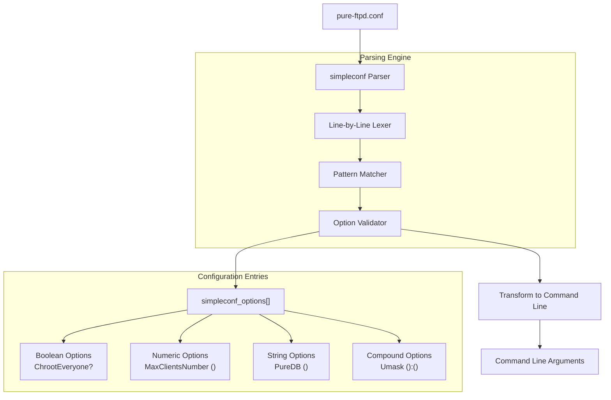
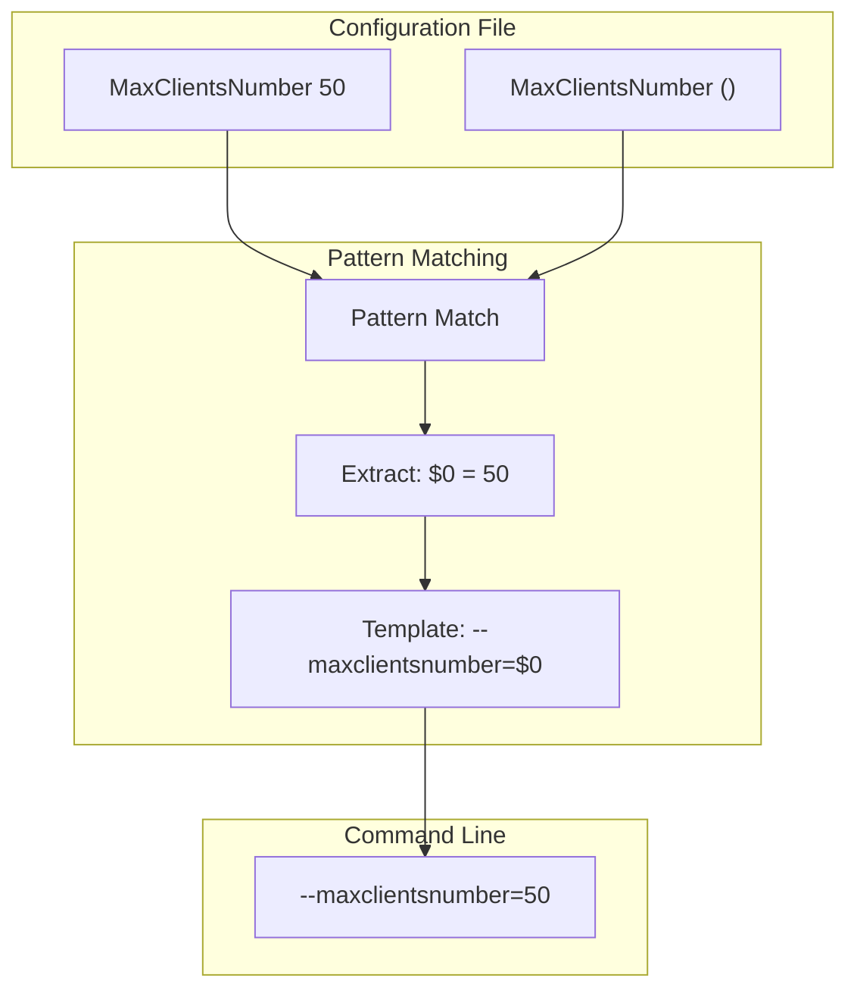
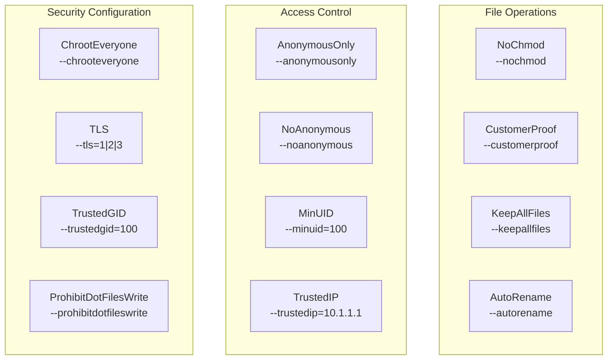
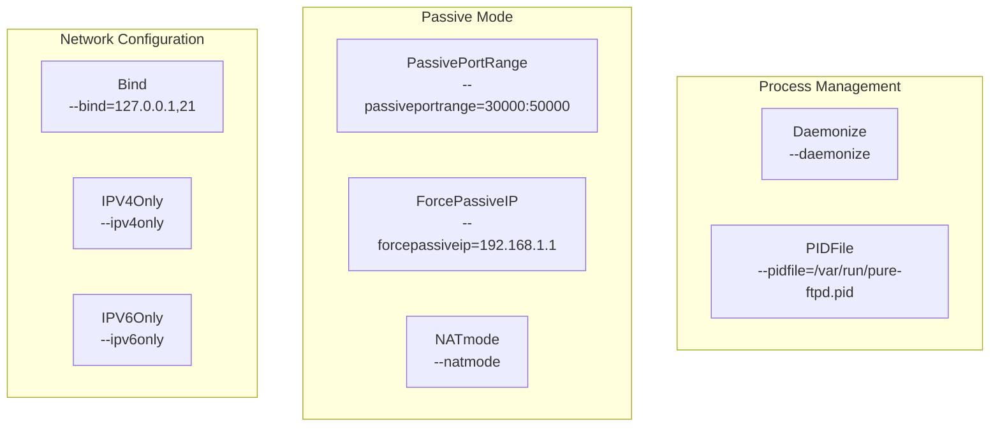

# Runtime Configuration

> **Relevant source files**
> * [COPYING](https://github.com/jedisct1/pure-ftpd/blob/3818577a/COPYING)
> * [man/pure-ftpd.8.in](https://github.com/jedisct1/pure-ftpd/blob/3818577a/man/pure-ftpd.8.in)
> * [man/pure-mrtginfo.8.in](https://github.com/jedisct1/pure-ftpd/blob/3818577a/man/pure-mrtginfo.8.in)
> * [pure-ftpd.conf.in](https://github.com/jedisct1/pure-ftpd/blob/3818577a/pure-ftpd.conf.in)
> * [src/simpleconf.c](https://github.com/jedisct1/pure-ftpd/blob/3818577a/src/simpleconf.c)
> * [src/simpleconf.h](https://github.com/jedisct1/pure-ftpd/blob/3818577a/src/simpleconf.h)
> * [src/simpleconf_ftpd.h](https://github.com/jedisct1/pure-ftpd/blob/3818577a/src/simpleconf_ftpd.h)

This page covers Pure-FTPd's runtime configuration system, including configuration file format, command-line option processing, and the relationship between different configuration methods. For information about build-time configuration and compilation options, see [Build System and Compilation](/jedisct1/pure-ftpd/5.1-build-system-and-compilation).

## Configuration Methods

Pure-FTPd supports two primary methods for runtime configuration:

1. **Command-line options** - Direct specification of parameters when starting the server
2. **Configuration file** - Text-based configuration using the `pure-ftpd.conf` format

The server can be started with a configuration file using:

```
pure-ftpd /path/to/pure-ftpd.conf
```

Or with direct command-line options:

```
pure-ftpd -B -c 50 -C 8 -D -H
```

Both methods can achieve identical server behavior, with the configuration file providing a more maintainable approach for complex setups.

**Configuration Processing Flow**



Sources: [src/simpleconf.c L714-L742](https://github.com/jedisct1/pure-ftpd/blob/3818577a/src/simpleconf.c#L714-L742)

 [src/simpleconf_ftpd.h L6-L122](https://github.com/jedisct1/pure-ftpd/blob/3818577a/src/simpleconf_ftpd.h#L6-L122)

 [man/pure-ftpd.8.in L11-L132](https://github.com/jedisct1/pure-ftpd/blob/3818577a/man/pure-ftpd.8.in#L11-L132)

## Configuration File Format

Pure-FTPd uses a simple key-value configuration file format parsed by the `simpleconf` system. The configuration file supports:

* **Boolean options** with values: `yes/no`, `on/off`, `true/false`, `1/0`
* **Numeric parameters** for limits, ports, and thresholds
* **String values** for paths, hostnames, and authentication backends
* **Comments** starting with `#`
* **Include directives** to load additional configuration files

### Configuration File Structure

| Configuration Category | Example Options | Purpose |
| --- | --- | --- |
| **Authentication** | `UnixAuthentication`, `PureDB`, `MySQLConfigFile` | User authentication methods |
| **Security** | `ChrootEveryone`, `TLS`, `ProhibitDotFilesWrite` | Security restrictions |
| **Connection Limits** | `MaxClientsNumber`, `MaxClientsPerIP` | Connection management |
| **File Operations** | `AnonymousCantUpload`, `AutoRename`, `Quota` | File transfer behavior |
| **Logging** | `VerboseLog`, `AltLog`, `SyslogFacility` | Logging configuration |

**Configuration File Parser Architecture**



Sources: [src/simpleconf.c L115-L542](https://github.com/jedisct1/pure-ftpd/blob/3818577a/src/simpleconf.c#L115-L542)

 [src/simpleconf_ftpd.h L6-L122](https://github.com/jedisct1/pure-ftpd/blob/3818577a/src/simpleconf_ftpd.h#L6-L122)

 [pure-ftpd.conf.in L1-L468](https://github.com/jedisct1/pure-ftpd/blob/3818577a/pure-ftpd.conf.in#L1-L468)

## Configuration Option Mapping

The `simpleconf_ftpd.h` file defines how configuration file options map to command-line arguments through the `SimpleConfEntry` structure:

### Key Configuration Mappings

| Config File Option | Command Line Equivalent | Pattern | Purpose |
| --- | --- | --- | --- |
| `ChrootEveryone yes` | `--chrooteveryone` | `ChrootEveryone? <bool>` | Chroot all users |
| `MaxClientsNumber 50` | `--maxclientsnumber=50` | `MaxClientsNumber (<digits>)` | Connection limit |
| `PureDB /etc/pureftpd.pdb` | `--login=puredb:/etc/pureftpd.pdb` | `PureDB (<any*>)` | Database authentication |
| `Umask 133:022` | `--umask=133:022` | `Umask (<digits>):(<digits>)` | File creation mask |
| `TLS 1` | `--tls=1` | `TLS (<digits>)` | TLS security level |

### Pattern Matching System

The configuration parser uses sophisticated pattern matching to validate and transform options:

* `<bool>` - Boolean values (yes/no, true/false, on/off, 1/0)
* `<digits>` - Numeric values
* `<any*>` - Any printable characters (for paths, strings)
* `<nospace>` - Non-whitespace strings (for hostnames, IPs)
* `<alnum>` - Alphanumeric strings
* `()` - Capture groups for parameter extraction

**Configuration Transformation Process**



Sources: [src/simpleconf_ftpd.h L75](https://github.com/jedisct1/pure-ftpd/blob/3818577a/src/simpleconf_ftpd.h#L75-L75)

 [src/simpleconf.c L508-L521](https://github.com/jedisct1/pure-ftpd/blob/3818577a/src/simpleconf.c#L508-L521)

 [src/simpleconf.c L132-L542](https://github.com/jedisct1/pure-ftpd/blob/3818577a/src/simpleconf.c#L132-L542)

## Authentication Configuration

Pure-FTPd supports multiple authentication backends that can be chained together. Configuration file options automatically map to the appropriate `--login` command-line parameters:

### Authentication Backend Configuration

| Backend | Config Option | Generated Command Line | Notes |
| --- | --- | --- | --- |
| **Unix** | `UnixAuthentication yes` | `--login=unix` | System accounts |
| **PAM** | `PAMAuthentication yes` | `--login=pam` | PAM modules |
| **PureDB** | `PureDB /path/to/db` | `--login=puredb:/path/to/db` | Virtual users |
| **MySQL** | `MySQLConfigFile /path/to/config` | `--login=mysql:/path/to/config` | MySQL database |
| **PostgreSQL** | `PGSQLConfigFile /path/to/config` | `--login=pgsql:/path/to/config` | PostgreSQL database |
| **LDAP** | `LDAPConfigFile /path/to/config` | `--login=ldap:/path/to/config` | LDAP directory |
| **External** | `ExtAuth /path/to/socket` | `--login=extauth:/path/to/socket` | External handler |

Authentication methods are tried in the order specified, allowing fallback authentication chains.

Sources: [src/simpleconf_ftpd.h L55-L73](https://github.com/jedisct1/pure-ftpd/blob/3818577a/src/simpleconf_ftpd.h#L55-L73)

 [pure-ftpd.conf.in L134-L153](https://github.com/jedisct1/pure-ftpd/blob/3818577a/pure-ftpd.conf.in#L134-L153)

 [man/pure-ftpd.8.in L307-L332](https://github.com/jedisct1/pure-ftpd/blob/3818577a/man/pure-ftpd.8.in#L307-L332)

## Security and Access Control Configuration

### Security-Related Options



Sources: [src/simpleconf_ftpd.h L36-L108](https://github.com/jedisct1/pure-ftpd/blob/3818577a/src/simpleconf_ftpd.h#L36-L108)

 [pure-ftpd.conf.in L18-L383](https://github.com/jedisct1/pure-ftpd/blob/3818577a/pure-ftpd.conf.in#L18-L383)

## Connection and Resource Management

### Connection Limits and Performance

| Configuration | Default | Purpose |
| --- | --- | --- |
| `MaxClientsNumber` | 50 | Total concurrent connections |
| `MaxClientsPerIP` | 8 | Per-IP connection limit |
| `MaxIdleTime` | 15 | Idle timeout in minutes |
| `MaxLoad` | 4 | System load threshold |
| `MaxDiskUsage` | 99 | Disk usage percentage limit |

### Port and Network Configuration



Sources: [src/simpleconf_ftpd.h L25-L94](https://github.com/jedisct1/pure-ftpd/blob/3818577a/src/simpleconf_ftpd.h#L25-L94)

 [pure-ftpd.conf.in L177-L214](https://github.com/jedisct1/pure-ftpd/blob/3818577a/pure-ftpd.conf.in#L177-L214)

 [man/pure-ftpd.8.in L419-L437](https://github.com/jedisct1/pure-ftpd/blob/3818577a/man/pure-ftpd.8.in#L419-L437)

## Special Configuration Features

### Include Directive Processing

The configuration system supports recursive file inclusion through the special `Include` directive:

```
Include additional_configuration.conf
```

This is processed by the `SC_SPECIAL_HANDLER_RESULT_INCLUDE` mechanism in the `simpleconf` parser, allowing modular configuration files.

### Configuration Validation

The parser performs comprehensive validation:

* **Syntax checking** with line number reporting
* **Type validation** for numeric, boolean, and string parameters
* **Range checking** for numeric values
* **Path validation** for file and socket paths
* **Recursion depth limiting** to prevent infinite includes

Sources: [src/simpleconf.c L594-L712](https://github.com/jedisct1/pure-ftpd/blob/3818577a/src/simpleconf.c#L594-L712)

 [src/simpleconf_ftpd.h L121](https://github.com/jedisct1/pure-ftpd/blob/3818577a/src/simpleconf_ftpd.h#L121-L121)

 [pure-ftpd.conf.in L463-L467](https://github.com/jedisct1/pure-ftpd/blob/3818577a/pure-ftpd.conf.in#L463-L467)

This runtime configuration system provides Pure-FTPd with flexible, maintainable configuration management while ensuring type safety and proper validation of all configuration parameters.