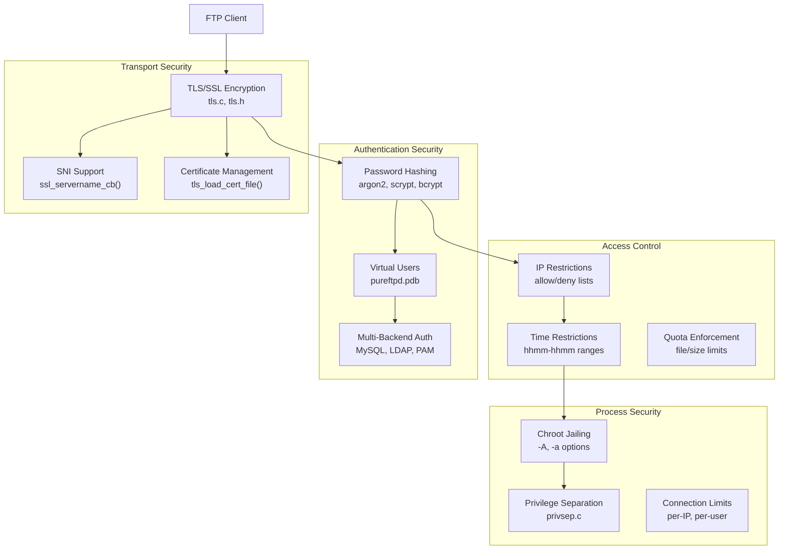
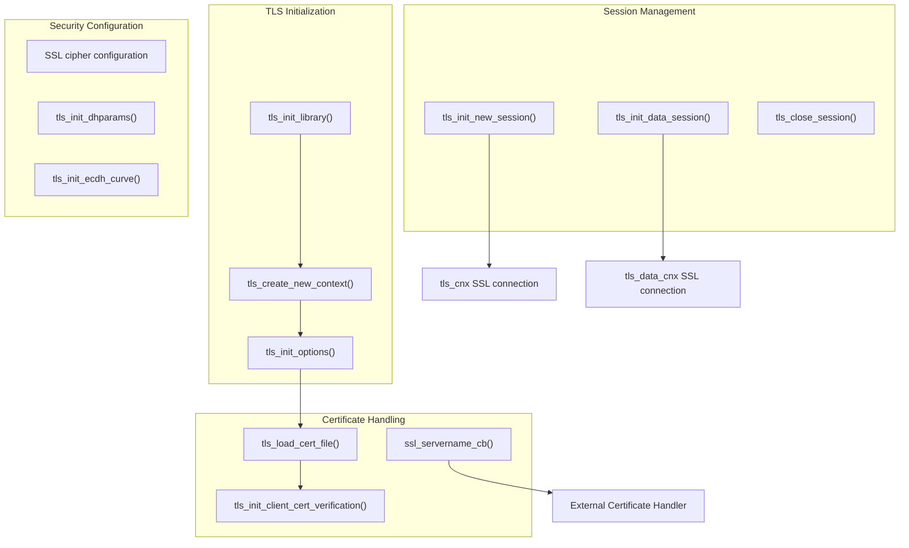
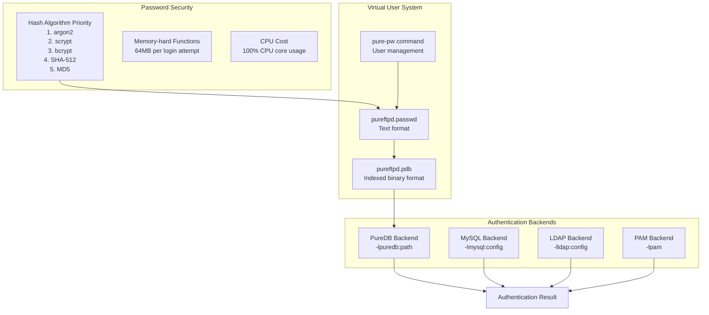
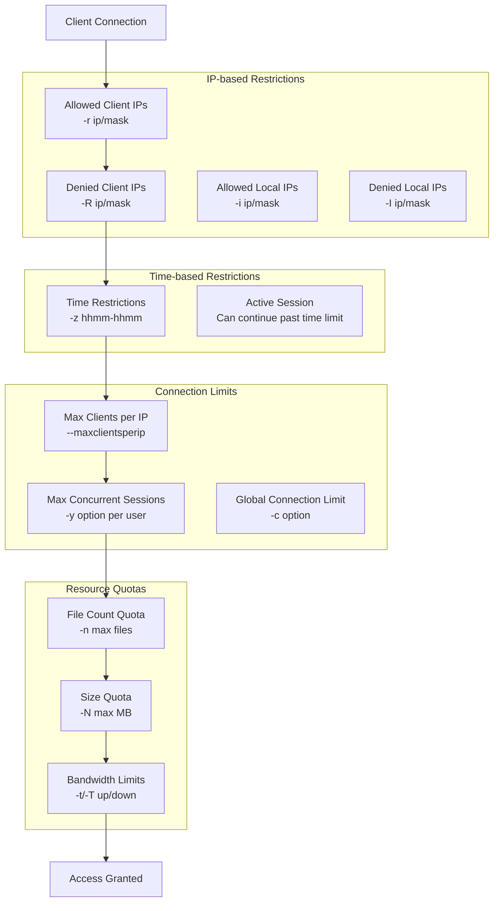
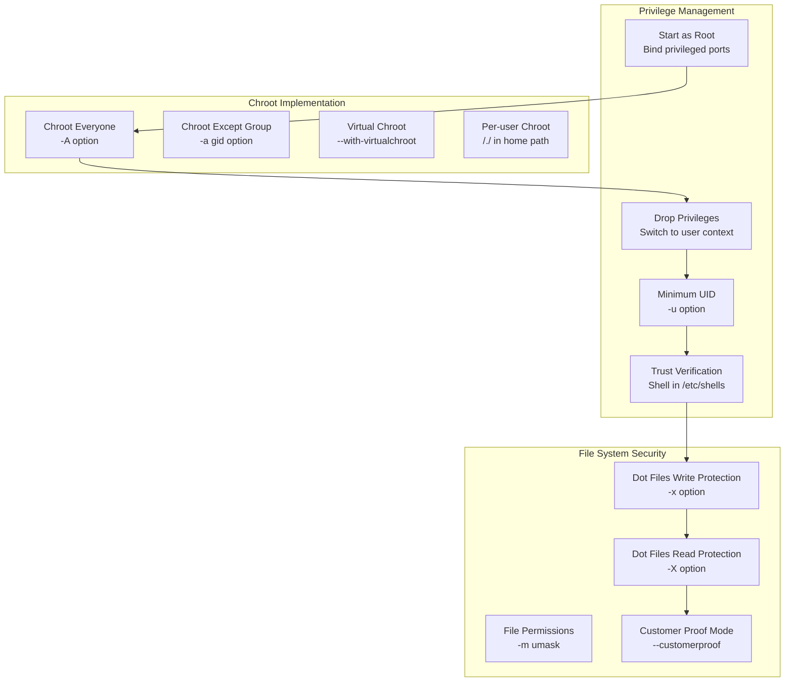
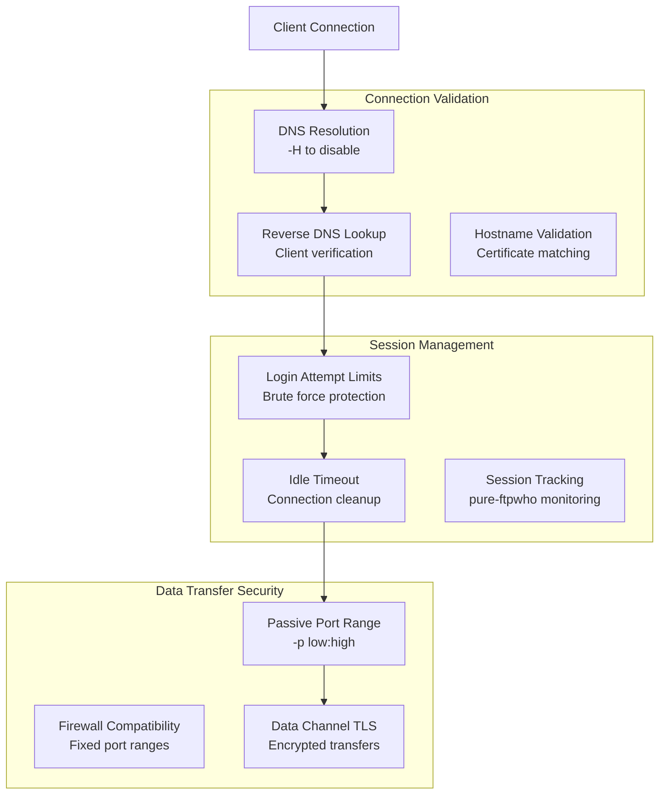

# Security Features

> **Relevant source files**
> * [FAQ](https://github.com/jedisct1/pure-ftpd/blob/3818577a/FAQ)
> * [README.TLS](https://github.com/jedisct1/pure-ftpd/blob/3818577a/README.TLS)
> * [README.Virtual-Users](https://github.com/jedisct1/pure-ftpd/blob/3818577a/README.Virtual-Users)
> * [src/tls.c](https://github.com/jedisct1/pure-ftpd/blob/3818577a/src/tls.c)
> * [src/tls.h](https://github.com/jedisct1/pure-ftpd/blob/3818577a/src/tls.h)

This document covers Pure-FTPd's comprehensive security architecture, including encryption, authentication mechanisms, access controls, and process isolation features. Pure-FTPd implements multiple layers of security to protect FTP communications and prevent unauthorized access.

For information about specific authentication backends, see [Authentication and User Management](/jedisct1/pure-ftpd/4-authentication-and-user-management). For TLS configuration details, see [TLS/SSL Encryption](/jedisct1/pure-ftpd/3.1-tlsssl-encryption).

## Overview of Security Architecture

Pure-FTPd employs a multi-layered security approach combining transport encryption, authentication verification, access control, and process isolation:

Sources: [src/tls.c L1-L608](https://github.com/jedisct1/pure-ftpd/blob/3818577a/src/tls.c#L1-L608)

 [src/tls.h L1-L53](https://github.com/jedisct1/pure-ftpd/blob/3818577a/src/tls.h#L1-L53)

 [README.TLS L1-L313](https://github.com/jedisct1/pure-ftpd/blob/3818577a/README.TLS#L1-L313)

 [README.Virtual-Users L1-L318](https://github.com/jedisct1/pure-ftpd/blob/3818577a/README.Virtual-Users#L1-L318)

## TLS/SSL Encryption System

Pure-FTPd provides comprehensive TLS support for encrypting both control and data connections:

### TLS Security Features

| Feature | Implementation | Configuration |
| --- | --- | --- |
| **Protocol Support** | TLS 1.2, TLS 1.3 | `--tls=0/1/2/3` |
| **Cipher Selection** | Server preference enforced | `--tlsciphersuite` |
| **Certificate Verification** | Client cert validation | `-C` prefix in cipher suite |
| **SNI Support** | Dynamic certificate selection | `ssl_servername_cb()` |
| **Session Caching** | SSL session reuse | `tls_init_cache()` |
| **Perfect Forward Secrecy** | ECDHE/DHE key exchange | `tls_init_ecdh_curve()` |

### TLS Security Configuration

The TLS implementation enforces strong security defaults:

* **Disabled Protocols**: SSLv2, SSLv3, TLS 1.0, TLS 1.1 are disabled by default
* **Minimum Cipher Strength**: 128-bit encryption minimum (`MINIMAL_CIPHER_STRENGTH_BITS`)
* **Certificate Depth**: Maximum 6 certificates in chain (`MAX_CERTIFICATE_DEPTH`)
* **Session Security**: No session resumption on renegotiation

Sources: [src/tls.c L328-L370](https://github.com/jedisct1/pure-ftpd/blob/3818577a/src/tls.c#L328-L370)

 [src/tls.c L437-L460](https://github.com/jedisct1/pure-ftpd/blob/3818577a/src/tls.c#L437-L460)

 [src/tls.h L47-L49](https://github.com/jedisct1/pure-ftpd/blob/3818577a/src/tls.h#L47-L49)

 [README.TLS L28-L131](https://github.com/jedisct1/pure-ftpd/blob/3818577a/README.TLS#L28-L131)

## Authentication Security Framework

Pure-FTPd implements secure authentication with multiple backend support and strong password protection:

### Password Security Implementation

Virtual users employ state-of-the-art password hashing:

| Hash Function | Security Level | Memory Usage | CPU Cost |
| --- | --- | --- | --- |
| **Argon2** | Highest (recommended) | Up to 64MB | High |
| **scrypt** | High (recommended) | Up to 64MB | High |
| **bcrypt** | Good | Low | Medium |
| **SHA-512** | Legacy (deprecated) | Low | Low |
| **MD5** | Weak (deprecated) | Low | Low |

The password hashing priority ensures the strongest available algorithm is used based on system capabilities and libsodium availability.

Sources: [README.Virtual-Users L113-L124](https://github.com/jedisct1/pure-ftpd/blob/3818577a/README.Virtual-Users#L113-L124)

 [README.Virtual-Users L59-L126](https://github.com/jedisct1/pure-ftpd/blob/3818577a/README.Virtual-Users#L59-L126)

## Access Control and Restrictions

Pure-FTPd provides granular access control mechanisms:

### Access Control Configuration

| Control Type | Virtual User Field | Command Line Option | Description |
| --- | --- | --- | --- |
| **Client IP Allow** | Field 15 | `-r ip/mask` | Allowed source IPs |
| **Client IP Deny** | Field 16 | `-R ip/mask` | Denied source IPs |
| **Local IP Allow** | Field 13 | `-i ip/mask` | Allowed local IPs |
| **Local IP Deny** | Field 14 | `-I ip/mask` | Denied local IPs |
| **Time Restrictions** | Field 17 | `-z hhmm-hhmm` | Allowed time range |
| **Session Limit** | Field 10 | `-y count` | Max concurrent sessions |

Sources: [README.Virtual-Users L44-L50](https://github.com/jedisct1/pure-ftpd/blob/3818577a/README.Virtual-Users#L44-L50)

 [README.Virtual-Users L90-L103](https://github.com/jedisct1/pure-ftpd/blob/3818577a/README.Virtual-Users#L90-L103)

## Process Security and Isolation

Pure-FTPd implements multiple process security mechanisms:

### Chroot Security Models

Pure-FTPd offers two chroot implementations:

| Model | Symlink Behavior | Use Case | Compilation Flag |
| --- | --- | --- | --- |
| **Traditional Chroot** | Restricted to jail | High security | Default |
| **Virtual Chroot** | Can follow outside links | Shared directories | `--with-virtualchroot` |

### Security Enforcement Options

| Security Feature | Option | Description |
| --- | --- | --- |
| **Dot File Write Protection** | `-x` | Prevent modification of hidden files |
| **Dot File Read Protection** | `-X` | Prevent access to hidden files |
| **Customer Proof Mode** | `--customerproof` | Enhanced security for hosting |
| **Minimum UID** | `-u uid` | Reject logins below UID threshold |
| **Broken Client Support** | `-b` | Compatibility with security implications |

Sources: [FAQ L40-L51](https://github.com/jedisct1/pure-ftpd/blob/3818577a/FAQ#L40-L51)

 [FAQ L99-L113](https://github.com/jedisct1/pure-ftpd/blob/3818577a/FAQ#L99-L113)

 [FAQ L644-L669](https://github.com/jedisct1/pure-ftpd/blob/3818577a/FAQ#L644-L669)

 [README.Virtual-Users L82-L84](https://github.com/jedisct1/pure-ftpd/blob/3818577a/README.Virtual-Users#L82-L84)

## Connection Security Features

Pure-FTPd implements comprehensive connection security:

### Security Monitoring and Logging

| Feature | Implementation | Security Benefit |
| --- | --- | --- |
| **Session Monitoring** | `pure-ftpwho` | Real-time connection tracking |
| **Alternative Logging** | `altlog.c` | Comprehensive audit trails |
| **Syslog Integration** | Facility-based logging | Centralized security monitoring |
| **Upload Notifications** | `pure-uploadscript` | File transfer alerting |

Sources: [FAQ L164-L195](https://github.com/jedisct1/pure-ftpd/blob/3818577a/FAQ#L164-L195)

 [FAQ L630-L641](https://github.com/jedisct1/pure-ftpd/blob/3818577a/FAQ#L630-L641)

 [FAQ L832-L847](https://github.com/jedisct1/pure-ftpd/blob/3818577a/FAQ#L832-L847)

 [src/tls.c L518-L561](https://github.com/jedisct1/pure-ftpd/blob/3818577a/src/tls.c#L518-L561)