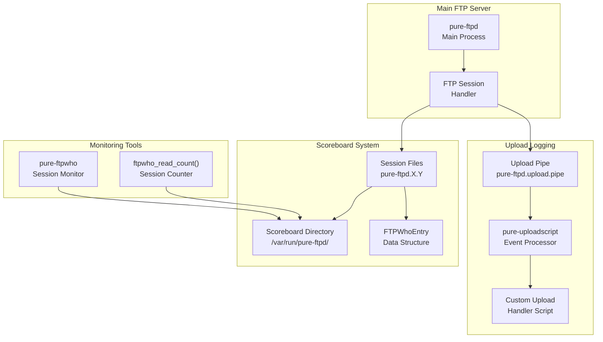
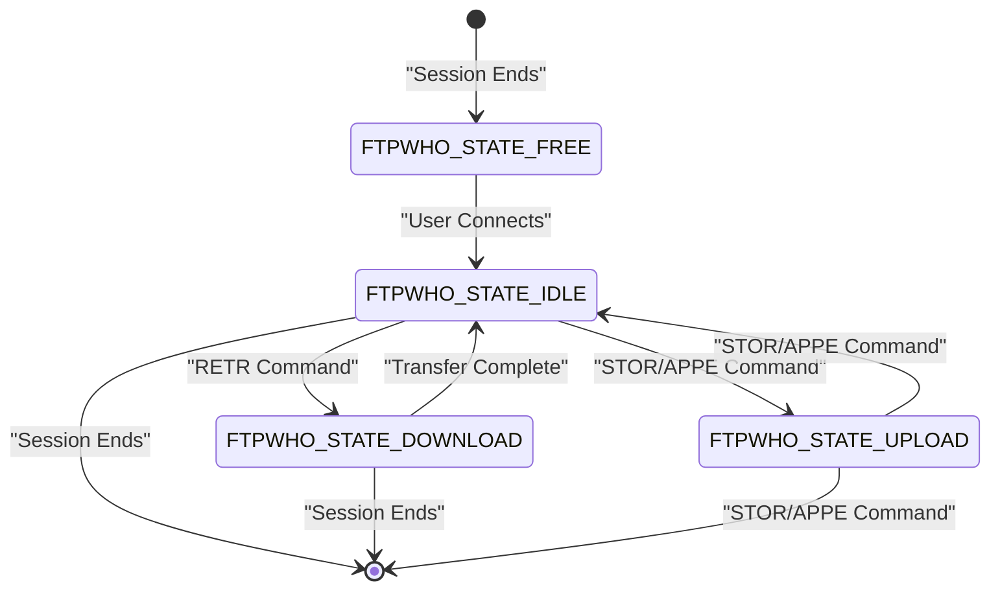
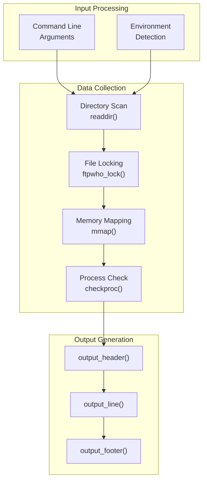
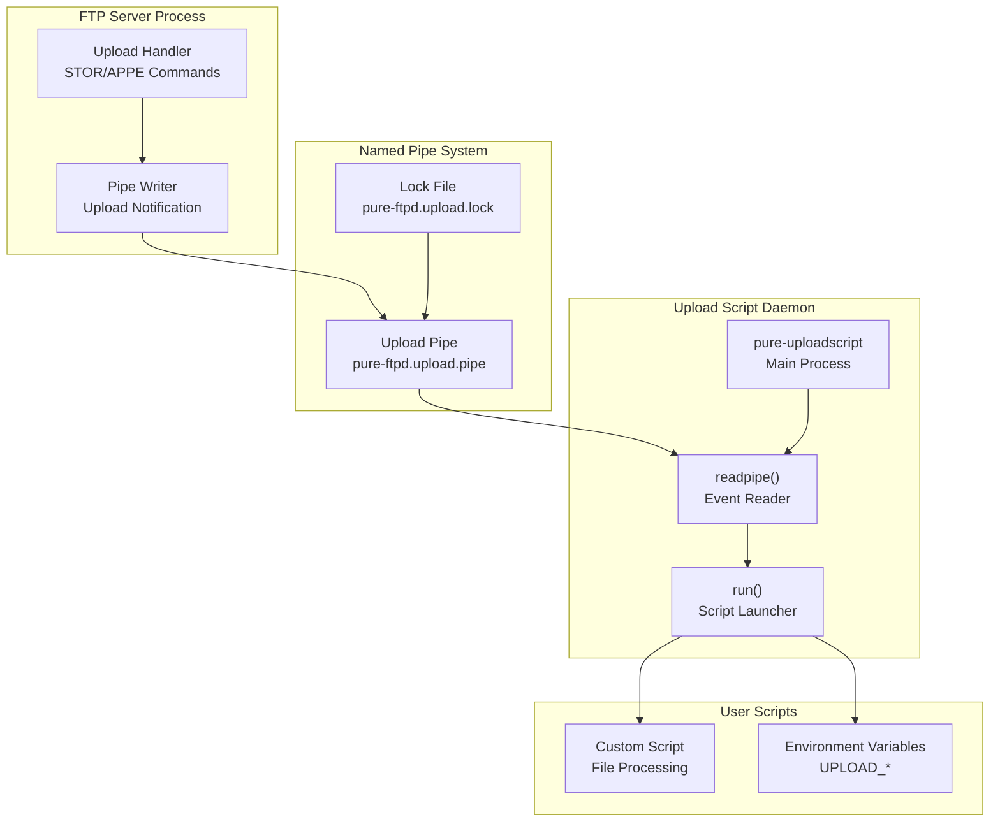
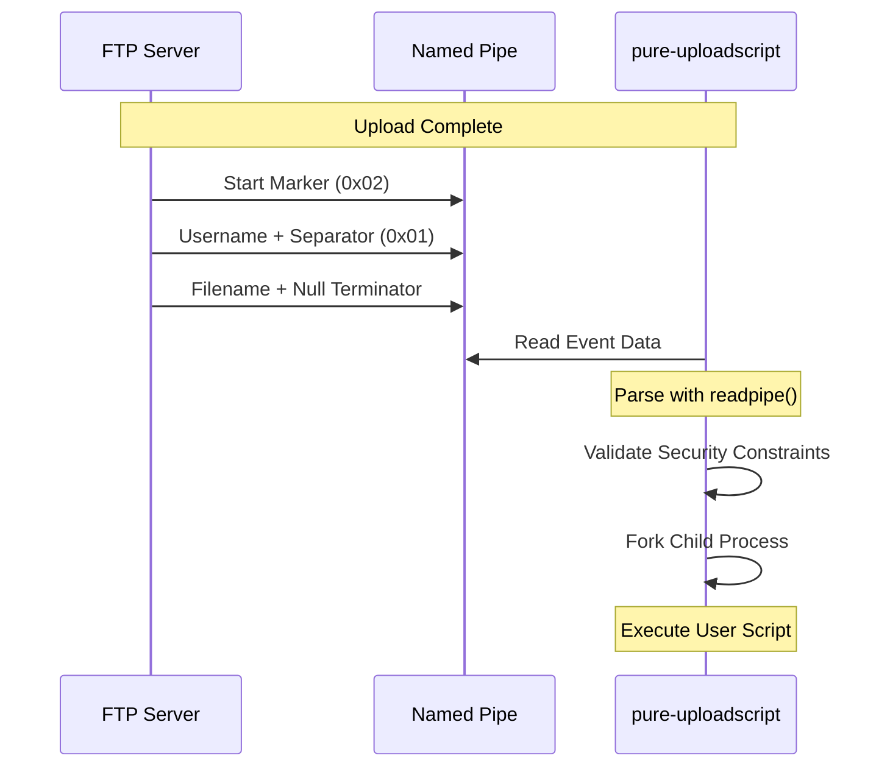
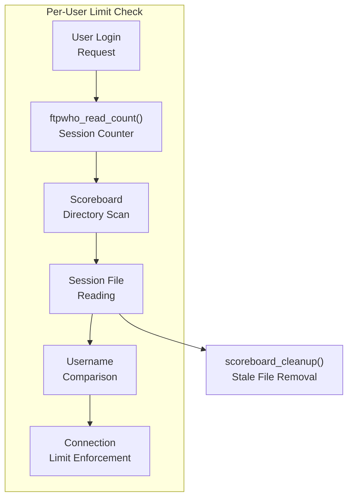

# Session Monitoring and Logging

> **Relevant source files**
> * [man/Makefile.am](https://github.com/jedisct1/pure-ftpd/blob/3818577a/man/Makefile.am)
> * [man/pure-authd.8.in](https://github.com/jedisct1/pure-ftpd/blob/3818577a/man/pure-authd.8.in)
> * [man/pure-ftpwho.8.in](https://github.com/jedisct1/pure-ftpd/blob/3818577a/man/pure-ftpwho.8.in)
> * [man/pure-pw.8.in](https://github.com/jedisct1/pure-ftpd/blob/3818577a/man/pure-pw.8.in)
> * [man/pure-pwconvert.8.in](https://github.com/jedisct1/pure-ftpd/blob/3818577a/man/pure-pwconvert.8.in)
> * [man/pure-quotacheck.8.in](https://github.com/jedisct1/pure-ftpd/blob/3818577a/man/pure-quotacheck.8.in)
> * [man/pure-statsdecode.8.in](https://github.com/jedisct1/pure-ftpd/blob/3818577a/man/pure-statsdecode.8.in)
> * [man/pure-uploadscript.8.in](https://github.com/jedisct1/pure-ftpd/blob/3818577a/man/pure-uploadscript.8.in)
> * [src/ftpwho-read.c](https://github.com/jedisct1/pure-ftpd/blob/3818577a/src/ftpwho-read.c)
> * [src/mysnprintf.c](https://github.com/jedisct1/pure-ftpd/blob/3818577a/src/mysnprintf.c)
> * [src/pure-authd.c](https://github.com/jedisct1/pure-ftpd/blob/3818577a/src/pure-authd.c)
> * [src/pure-certd.c](https://github.com/jedisct1/pure-ftpd/blob/3818577a/src/pure-certd.c)
> * [src/pure-ftpwho.c](https://github.com/jedisct1/pure-ftpd/blob/3818577a/src/pure-ftpwho.c)
> * [src/pure-uploadscript.c](https://github.com/jedisct1/pure-ftpd/blob/3818577a/src/pure-uploadscript.c)

This document covers Pure-FTPd's real-time session monitoring and logging capabilities, including the scoreboard system for tracking active sessions, upload event processing, and various output formats for administrative tools.

For authentication-related logging, see [External Authentication](/jedisct1/pure-ftpd/4.4-external-authentication). For quota management and tracking, see [Quota Management](/jedisct1/pure-ftpd/6.2-quota-management).

## Session Monitoring Architecture

Pure-FTPd implements a comprehensive session monitoring system based on a shared scoreboard that tracks all active FTP sessions in real-time. The system provides both live monitoring capabilities and event-driven logging for specific operations like file uploads.

Sources: [src/pure-ftpwho.c L1-L950](https://github.com/jedisct1/pure-ftpd/blob/3818577a/src/pure-ftpwho.c#L1-L950)

 [src/ftpwho-read.c L1-L91](https://github.com/jedisct1/pure-ftpd/blob/3818577a/src/ftpwho-read.c#L1-L91)

 [src/pure-uploadscript.c L1-L505](https://github.com/jedisct1/pure-ftpd/blob/3818577a/src/pure-uploadscript.c#L1-L505)

## Scoreboard System

The scoreboard is a file-based shared memory system that maintains real-time information about all active FTP sessions. Each session creates a file in the scoreboard directory containing structured session data.

### Scoreboard Data Structure

The core session information is stored in the `FTPWhoEntry` structure, which tracks:

| Field | Description | Usage |
| --- | --- | --- |
| `pid` | Process ID of session | Process identification |
| `account` | Username (up to `MAX_USER_LENGTH`) | User tracking |
| `addr` | Client IP address | Connection source |
| `state` | Current session state | Activity monitoring |
| `date` | Session start time | Duration calculation |
| `xfer_date` | Transfer start time | Bandwidth calculation |
| `restartat` | Resume position | Transfer progress |
| `current_size` | Bytes transferred | Progress tracking |
| `total_size` | Total file size | Completion percentage |

### Session States

Sources: [src/pure-ftpwho.c L866-L878](https://github.com/jedisct1/pure-ftpd/blob/3818577a/src/pure-ftpwho.c#L866-L878)

 [src/ftpwho-read.c L33-L86](https://github.com/jedisct1/pure-ftpd/blob/3818577a/src/ftpwho-read.c#L33-L86)

### File Management

Scoreboard files are stored in `SCOREBOARD_PATH` with the naming pattern `SCOREBOARD_PREFIX` followed by identifiers. The system includes automatic cleanup of stale session files through the `scoreboard_cleanup()` function, which verifies that the associated process is still running using `checkproc()`.

Sources: [src/ftpwho-read.c L13-L31](https://github.com/jedisct1/pure-ftpd/blob/3818577a/src/ftpwho-read.c#L13-L31)

 [src/pure-ftpwho.c L102-L105](https://github.com/jedisct1/pure-ftpd/blob/3818577a/src/pure-ftpwho.c#L102-L105)

 [src/pure-ftpwho.c L827-L844](https://github.com/jedisct1/pure-ftpd/blob/3818577a/src/pure-ftpwho.c#L827-L844)

## pure-ftpwho Utility

The `pure-ftpwho` utility provides real-time monitoring of active FTP sessions by reading the scoreboard data and presenting it in various formats.

### Core Functionality

Sources: [src/pure-ftpwho.c L715-L950](https://github.com/jedisct1/pure-ftpd/blob/3818577a/src/pure-ftpwho.c#L715-L950)

 [src/pure-ftpwho.c L36-L54](https://github.com/jedisct1/pure-ftpd/blob/3818577a/src/pure-ftpwho.c#L36-L54)

 [src/pure-ftpwho.c L847-L853](https://github.com/jedisct1/pure-ftpd/blob/3818577a/src/pure-ftpwho.c#L847-L853)

### Output Formats

The utility supports multiple output formats through function pointers:

| Format | Functions | Use Case |
| --- | --- | --- |
| Text | `text_output_*` | Command line viewing |
| HTML | `html_output_*` | Web interfaces |
| XML | `xml_output_*` | Programmatic processing |
| Plist | `plist_output_*` | Apple/GNUStep integration |
| Shell | `shell_output_*` | Script parsing |

Each format implements three functions: `*_output_header()`, `*_output_line()`, and `*_output_footer()` to generate structured output.

Sources: [src/pure-ftpwho.c L109-L207](https://github.com/jedisct1/pure-ftpd/blob/3818577a/src/pure-ftpwho.c#L109-L207)

 [src/pure-ftpwho.c L269-L404](https://github.com/jedisct1/pure-ftpd/blob/3818577a/src/pure-ftpwho.c#L269-L404)

 [src/pure-ftpwho.c L408-L468](https://github.com/jedisct1/pure-ftpd/blob/3818577a/src/pure-ftpwho.c#L408-L468)

 [src/pure-ftpwho.c L472-L563](https://github.com/jedisct1/pure-ftpd/blob/3818577a/src/pure-ftpwho.c#L472-L563)

 [src/pure-ftpwho.c L601-L650](https://github.com/jedisct1/pure-ftpd/blob/3818577a/src/pure-ftpwho.c#L601-L650)

## Upload Event Logging

Pure-FTPd provides an event-driven logging system for file uploads using named pipes and the `pure-uploadscript` daemon.

### Upload Pipe Architecture

Sources: [src/pure-uploadscript.c L29-L60](https://github.com/jedisct1/pure-ftpd/blob/3818577a/src/pure-uploadscript.c#L29-L60)

 [src/pure-uploadscript.c L75-L121](https://github.com/jedisct1/pure-ftpd/blob/3818577a/src/pure-uploadscript.c#L75-L121)

 [src/pure-uploadscript.c L381-L411](https://github.com/jedisct1/pure-ftpd/blob/3818577a/src/pure-uploadscript.c#L381-L411)

### Upload Event Data

When processing upload events, `pure-uploadscript` provides detailed information through environment variables:

| Variable | Description | Source Function |
| --- | --- | --- |
| `UPLOAD_SIZE` | File size in bytes | `newenv_ull()` |
| `UPLOAD_PERMS` | File permissions (octal) | `newenv_uo()` |
| `UPLOAD_UID` | Owner user ID | `newenv_ull()` |
| `UPLOAD_GID` | Owner group ID | `newenv_ull()` |
| `UPLOAD_USER` | Owner username | `newenv_str()` |
| `UPLOAD_GROUP` | Owner group name | `newenv_str()` |
| `UPLOAD_VUSER` | Virtual username | `newenv_str()` |

The `fillenv()` function populates these variables by examining the uploaded file with `lstat()` and looking up user/group information.

Sources: [src/pure-uploadscript.c L355-L379](https://github.com/jedisct1/pure-ftpd/blob/3818577a/src/pure-uploadscript.c#L355-L379)

 [src/pure-uploadscript.c L303-L353](https://github.com/jedisct1/pure-ftpd/blob/3818577a/src/pure-uploadscript.c#L303-L353)

### Pipe Security and Protocol

The upload pipe uses a binary protocol for secure data transmission:

The `readpipe()` function implements careful parsing with control character filtering and length limits to prevent security issues.

Sources: [src/pure-uploadscript.c L75-L121](https://github.com/jedisct1/pure-ftpd/blob/3818577a/src/pure-uploadscript.c#L75-L121)

 [src/pure-uploadscript.c L128-L145](https://github.com/jedisct1/pure-ftpd/blob/3818577a/src/pure-uploadscript.c#L128-L145)

## Session Counting and Limits

The system provides per-user session counting capabilities through the `ftpwho_read_count()` function, which is used to enforce connection limits.

### Connection Counting Process

The function uses either `pread()` or `lseek()`+`read()` to efficiently read just the account name from each session file, comparing it against the target user for counting active sessions.

Sources: [src/ftpwho-read.c L33-L86](https://github.com/jedisct1/pure-ftpd/blob/3818577a/src/ftpwho-read.c#L33-L86)

 [src/ftpwho-read.c L56-L72](https://github.com/jedisct1/pure-ftpd/blob/3818577a/src/ftpwho-read.c#L56-L72)