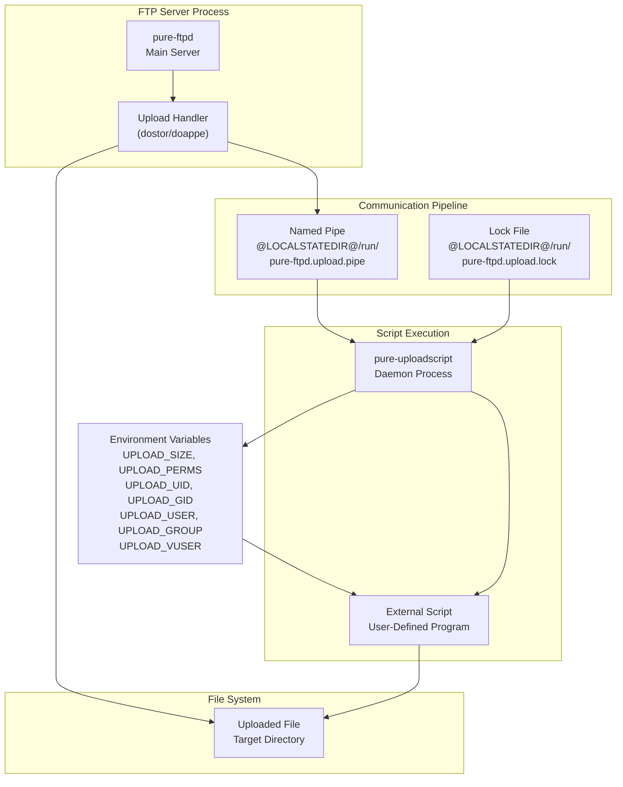
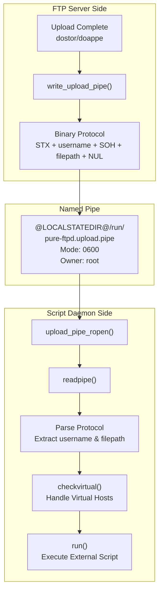
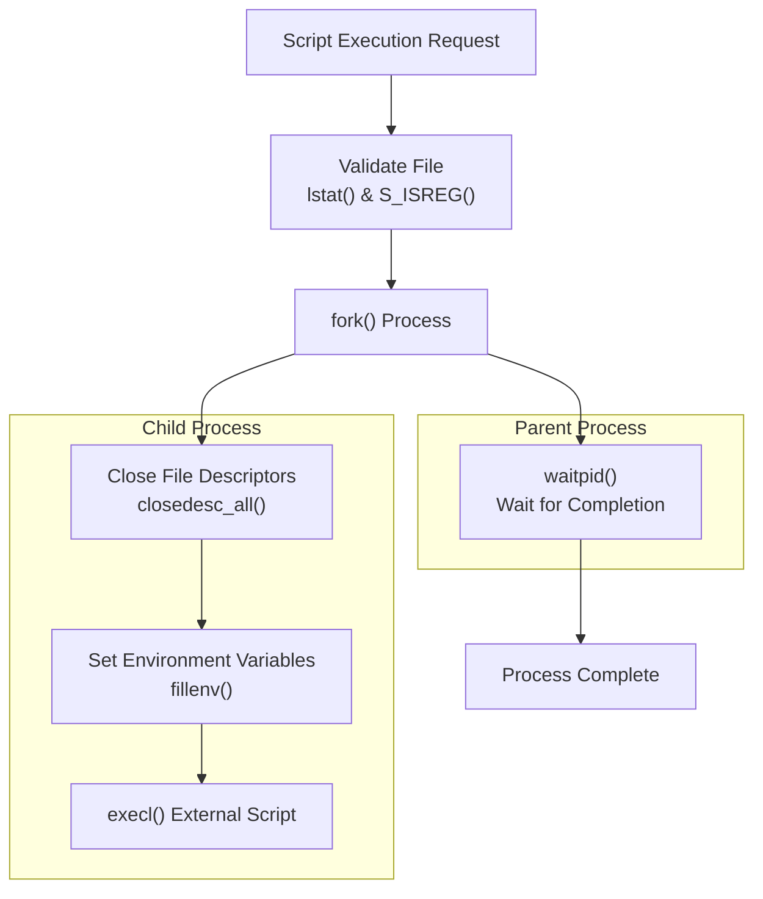
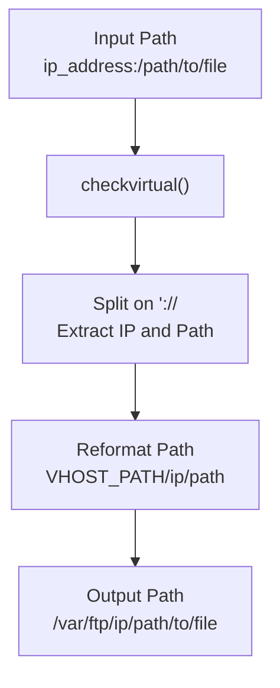

# Upload Processing and Scripts

> **Relevant source files**
> * [man/Makefile.am](https://github.com/jedisct1/pure-ftpd/blob/3818577a/man/Makefile.am)
> * [man/pure-authd.8.in](https://github.com/jedisct1/pure-ftpd/blob/3818577a/man/pure-authd.8.in)
> * [man/pure-ftpwho.8.in](https://github.com/jedisct1/pure-ftpd/blob/3818577a/man/pure-ftpwho.8.in)
> * [man/pure-pw.8.in](https://github.com/jedisct1/pure-ftpd/blob/3818577a/man/pure-pw.8.in)
> * [man/pure-pwconvert.8.in](https://github.com/jedisct1/pure-ftpd/blob/3818577a/man/pure-pwconvert.8.in)
> * [man/pure-quotacheck.8.in](https://github.com/jedisct1/pure-ftpd/blob/3818577a/man/pure-quotacheck.8.in)
> * [man/pure-statsdecode.8.in](https://github.com/jedisct1/pure-ftpd/blob/3818577a/man/pure-statsdecode.8.in)
> * [man/pure-uploadscript.8.in](https://github.com/jedisct1/pure-ftpd/blob/3818577a/man/pure-uploadscript.8.in)
> * [src/ftpwho-read.c](https://github.com/jedisct1/pure-ftpd/blob/3818577a/src/ftpwho-read.c)
> * [src/mysnprintf.c](https://github.com/jedisct1/pure-ftpd/blob/3818577a/src/mysnprintf.c)
> * [src/pure-authd.c](https://github.com/jedisct1/pure-ftpd/blob/3818577a/src/pure-authd.c)
> * [src/pure-certd.c](https://github.com/jedisct1/pure-ftpd/blob/3818577a/src/pure-certd.c)
> * [src/pure-ftpwho.c](https://github.com/jedisct1/pure-ftpd/blob/3818577a/src/pure-ftpwho.c)
> * [src/pure-uploadscript.c](https://github.com/jedisct1/pure-ftpd/blob/3818577a/src/pure-uploadscript.c)

This document covers Pure-FTPd's upload script system, which enables automatic execution of external programs or scripts after successful file uploads. This system provides a flexible mechanism for post-upload processing, notification, and automation tasks.

For information about user authentication scripts, see [External Authentication](/jedisct1/pure-ftpd/4.4-external-authentication). For certificate processing scripts, see [TLS/SSL Encryption](/jedisct1/pure-ftpd/3.1-tlsssl-encryption).

## Architecture Overview

Pure-FTPd's upload script system uses a daemon-based architecture with named pipes for inter-process communication. The system consists of three main components: the FTP server process that handles uploads, a communication pipeline using named pipes, and the `pure-uploadscript` daemon that executes external scripts.

**Sources:** [src/pure-uploadscript.c L1-L502](https://github.com/jedisct1/pure-ftpd/blob/3818577a/src/pure-uploadscript.c#L1-L502)

 [man/pure-uploadscript.8.in L1-L103](https://github.com/jedisct1/pure-ftpd/blob/3818577a/man/pure-uploadscript.8.in#L1-L103)

## Upload Notification Pipeline

The upload notification system uses a binary protocol over named pipes to communicate upload events from the FTP server to the script daemon. The pipeline ensures sequential processing and includes security measures to prevent unauthorized access.

**Sources:** [src/pure-uploadscript.c L29-L121](https://github.com/jedisct1/pure-ftpd/blob/3818577a/src/pure-uploadscript.c#L29-L121)

 [src/pure-uploadscript.c L128-L145](https://github.com/jedisct1/pure-ftpd/blob/3818577a/src/pure-uploadscript.c#L128-L145)

 [src/pure-uploadscript.c L75-L121](https://github.com/jedisct1/pure-ftpd/blob/3818577a/src/pure-uploadscript.c#L75-L121)

## Script Execution Environment

When `pure-uploadscript` executes an external script, it provides comprehensive information about the uploaded file through environment variables and command-line arguments. The execution environment is carefully controlled for security.

### Environment Variables

| Variable | Description | Source |
| --- | --- | --- |
| `UPLOAD_SIZE` | File size in bytes | [src/pure-uploadscript.c L363](https://github.com/jedisct1/pure-ftpd/blob/3818577a/src/pure-uploadscript.c#L363-L363) |
| `UPLOAD_PERMS` | File permissions (octal) | [src/pure-uploadscript.c L364](https://github.com/jedisct1/pure-ftpd/blob/3818577a/src/pure-uploadscript.c#L364-L364) |
| `UPLOAD_UID` | Numeric user ID of file owner | [src/pure-uploadscript.c L365](https://github.com/jedisct1/pure-ftpd/blob/3818577a/src/pure-uploadscript.c#L365-L365) |
| `UPLOAD_GID` | Numeric group ID of file owner | [src/pure-uploadscript.c L366](https://github.com/jedisct1/pure-ftpd/blob/3818577a/src/pure-uploadscript.c#L366-L366) |
| `UPLOAD_USER` | Username of file owner | [src/pure-uploadscript.c L368](https://github.com/jedisct1/pure-ftpd/blob/3818577a/src/pure-uploadscript.c#L368-L368) |
| `UPLOAD_GROUP` | Group name of file owner | [src/pure-uploadscript.c L371](https://github.com/jedisct1/pure-ftpd/blob/3818577a/src/pure-uploadscript.c#L371-L371) |
| `UPLOAD_VUSER` | FTP virtual username | [src/pure-uploadscript.c L374](https://github.com/jedisct1/pure-ftpd/blob/3818577a/src/pure-uploadscript.c#L374-L374) |

### Script Execution Process

**Sources:** [src/pure-uploadscript.c L381-L411](https://github.com/jedisct1/pure-ftpd/blob/3818577a/src/pure-uploadscript.c#L381-L411)

 [src/pure-uploadscript.c L355-L379](https://github.com/jedisct1/pure-ftpd/blob/3818577a/src/pure-uploadscript.c#L355-L379)

## Virtual Host Support

The upload script system includes support for virtual hosts, where uploaded file paths may include virtual host prefixes. The `checkvirtual()` function processes these paths appropriately.

### Virtual Host Path Processing

**Sources:** [src/pure-uploadscript.c L128-L145](https://github.com/jedisct1/pure-ftpd/blob/3818577a/src/pure-uploadscript.c#L128-L145)

## Security Considerations

The upload script system implements multiple security layers to prevent unauthorized access and execution:

### Pipe Security

* Named pipe must have mode 0600 and be owned by root
* Only the root process can create and access the pipe
* File descriptor security checks prevent unauthorized access

### Process Security

* UID/GID switching occurs immediately after option parsing
* No privilege escalation back to root
* File descriptors are closed in child processes
* Sequential processing prevents fork bomb attacks

### Path Security

* Absolute path names are always used
* chroot() environments are handled correctly
* Control characters in filenames are rejected
* Virtual host paths are properly validated

**Sources:** [src/pure-uploadscript.c L29-L60](https://github.com/jedisct1/pure-ftpd/blob/3818577a/src/pure-uploadscript.c#L29-L60)

 [src/pure-uploadscript.c L287-L300](https://github.com/jedisct1/pure-ftpd/blob/3818577a/src/pure-uploadscript.c#L287-L300)

 [src/pure-uploadscript.c L393-L403](https://github.com/jedisct1/pure-ftpd/blob/3818577a/src/pure-uploadscript.c#L393-L403)

 [man/pure-uploadscript.8.in L57-L71](https://github.com/jedisct1/pure-ftpd/blob/3818577a/man/pure-uploadscript.8.in#L57-L71)

## Configuration and Setup

### Daemon Options

The `pure-uploadscript` daemon supports several command-line options for configuration:

| Option | Description | Default |
| --- | --- | --- |
| `-r <program>` | External script/program to execute | Required |
| `-u <uid>` | User ID to run as | Current UID |
| `-g <gid>` | Group ID to run as | Current GID |
| `-B` | Daemonize (run in background) | Foreground |
| `-p <pidfile>` | PID file location | No PID file |

### Integration with Pure-FTPd

To enable upload script processing in Pure-FTPd, use the `-o` or `--uploadscript` option when starting the server. This creates the necessary named pipe and enables upload notifications.

**Sources:** [src/pure-uploadscript.c L220-L285](https://github.com/jedisct1/pure-ftpd/blob/3818577a/src/pure-uploadscript.c#L220-L285)

 [man/pure-uploadscript.8.in L15-L32](https://github.com/jedisct1/pure-ftpd/blob/3818577a/man/pure-uploadscript.8.in#L15-L32)