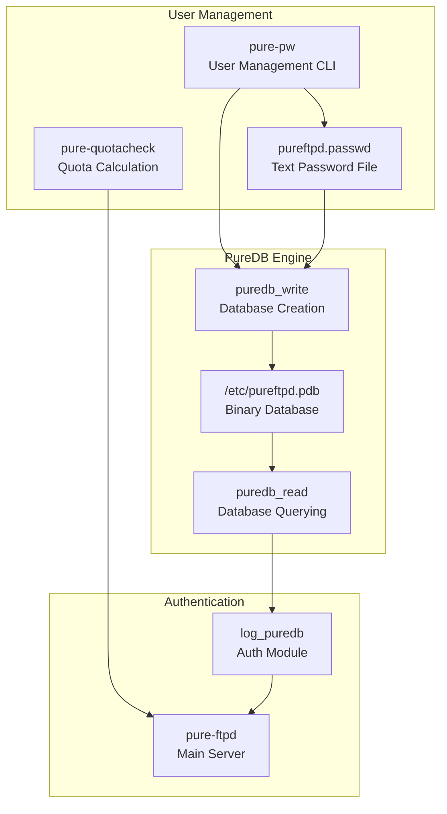
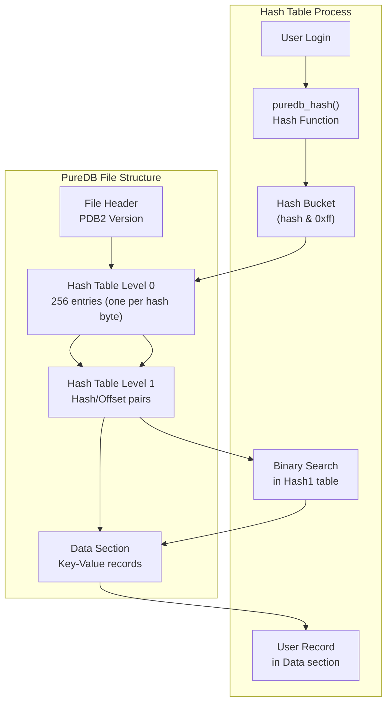
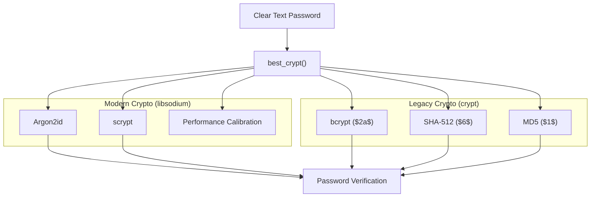
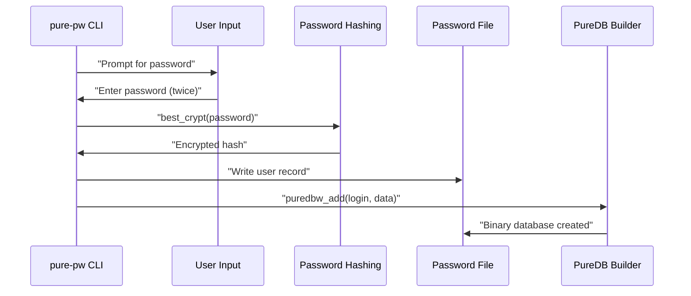
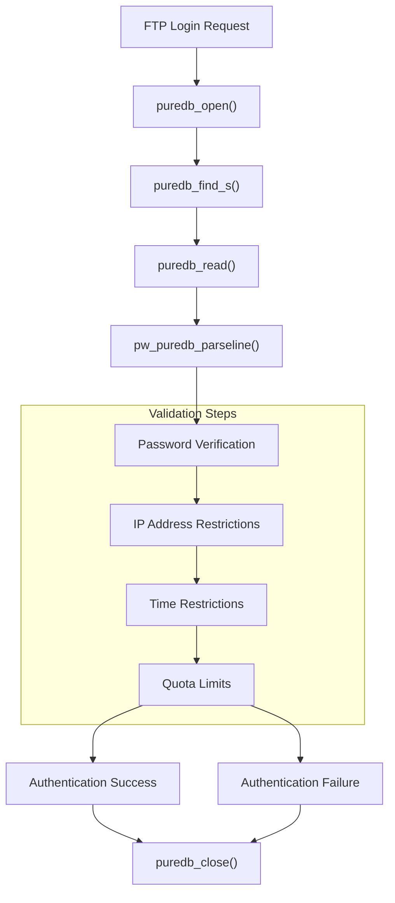
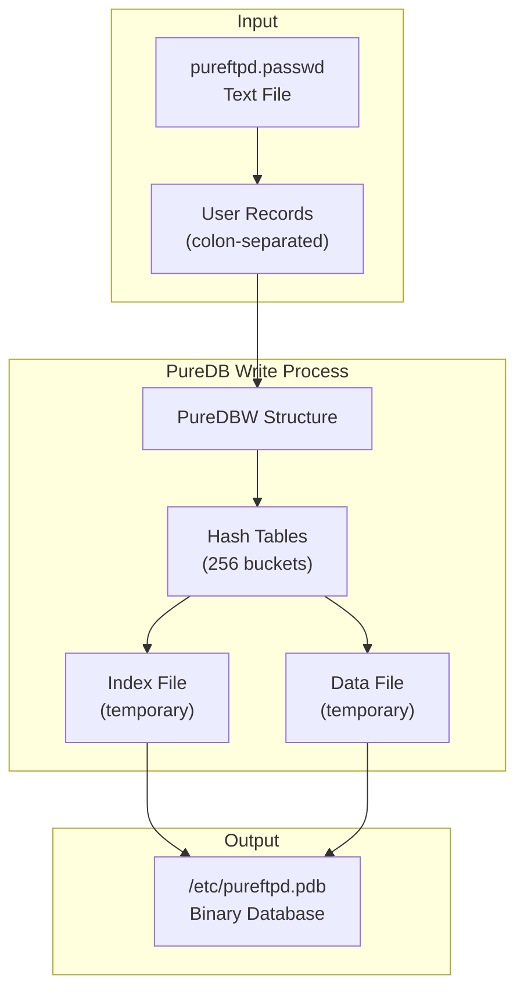
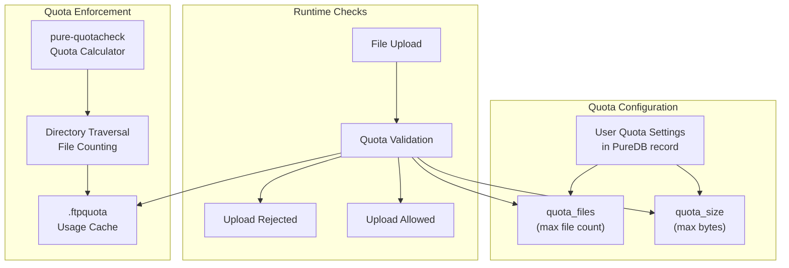
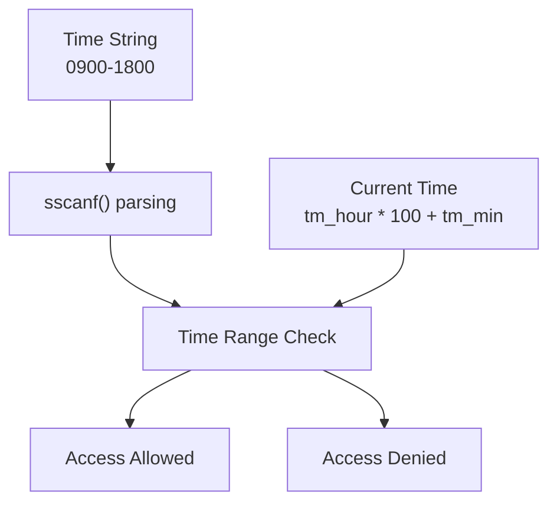

```mermaid
flowchart TD

LOGIN["login"]
PWD["encrypted_password"]
UID["uid"]
GID["gid"]
GECOS["gecos"]
HOME["home_directory"]
BWUL["bandwidth_ul"]
BWDL["bandwidth_dl"]
RATIOUL["ratio_upload"]
RATIODL["ratio_download"]
MAXCNX["max_connections"]
QUOTAFILES["quota_files"]
QUOTASIZE["quota_size"]
ALLOWIP["allow_local_ip"]
DENYIP["deny_local_ip"]
ALLOWCIP["allow_client_ip"]
DENYCIP["deny_client_ip"]
TIME["time_restrictions"]

subgraph subGraph0 ["User Record Fields"]
    LOGIN
    PWD
    UID
    GID
    GECOS
    HOME
    BWUL
    BWDL
    RATIOUL
    RATIODL
    MAXCNX
    QUOTAFILES
    QUOTASIZE
    ALLOWIP
    DENYIP
    ALLOWCIP
    DENYCIP
    TIME
    LOGIN --> PWD
    PWD --> UID
    UID --> GID
    GID --> GECOS
    GECOS --> HOME
    HOME --> BWUL
    BWUL --> BWDL
    BWDL --> RATIOUL
    RATIOUL --> RATIODL
    RATIODL --> MAXCNX
    MAXCNX --> QUOTAFILES
    QUOTAFILES --> QUOTASIZE
    QUOTASIZE --> ALLOWIP
    ALLOWIP --> DENYIP
    DENYIP --> ALLOWCIP
    ALLOWCIP --> DENYCIP
    DENYCIP --> TIME
end
```

# Virtual Users with PureDB

> **Relevant source files**
> * [puredb/src/puredb_p.h](https://github.com/jedisct1/pure-ftpd/blob/3818577a/puredb/src/puredb_p.h)
> * [puredb/src/puredb_read.c](https://github.com/jedisct1/pure-ftpd/blob/3818577a/puredb/src/puredb_read.c)
> * [puredb/src/puredb_read.h](https://github.com/jedisct1/pure-ftpd/blob/3818577a/puredb/src/puredb_read.h)
> * [puredb/src/puredb_write.c](https://github.com/jedisct1/pure-ftpd/blob/3818577a/puredb/src/puredb_write.c)
> * [puredb/src/puredb_write.h](https://github.com/jedisct1/pure-ftpd/blob/3818577a/puredb/src/puredb_write.h)
> * [src/altlog.c](https://github.com/jedisct1/pure-ftpd/blob/3818577a/src/altlog.c)
> * [src/log_puredb.c](https://github.com/jedisct1/pure-ftpd/blob/3818577a/src/log_puredb.c)
> * [src/privsep.c](https://github.com/jedisct1/pure-ftpd/blob/3818577a/src/privsep.c)
> * [src/privsep_p.h](https://github.com/jedisct1/pure-ftpd/blob/3818577a/src/privsep_p.h)
> * [src/pure-pw.c](https://github.com/jedisct1/pure-ftpd/blob/3818577a/src/pure-pw.c)
> * [src/pure-quotacheck.c](https://github.com/jedisct1/pure-ftpd/blob/3818577a/src/pure-quotacheck.c)
> * [src/upload-pipe.c](https://github.com/jedisct1/pure-ftpd/blob/3818577a/src/upload-pipe.c)

This page covers Pure-FTPd's built-in virtual user system using the PureDB database format. PureDB provides a fast, lightweight method for managing FTP users independently of the system's user accounts, with support for per-user quotas, bandwidth limits, IP restrictions, and other advanced features.

For information about other authentication methods, see [Database Authentication](/jedisct1/pure-ftpd/4.2-database-authentication), [LDAP Authentication](/jedisct1/pure-ftpd/4.3-ldap-authentication), and [External Authentication](/jedisct1/pure-ftpd/4.4-external-authentication).

## Overview

The PureDB virtual user system consists of three main components:

1. **PureDB Database Engine** - A custom hash-based database format optimized for fast user lookups
2. **User Management Tools** - Command-line utilities for managing virtual user accounts
3. **Authentication Integration** - Runtime authentication against the PureDB database



**Sources:** [src/pure-pw.c L1-L1330](https://github.com/jedisct1/pure-ftpd/blob/3818577a/src/pure-pw.c#L1-L1330)

 [puredb/src/puredb_write.c L1-L340](https://github.com/jedisct1/pure-ftpd/blob/3818577a/puredb/src/puredb_write.c#L1-L340)

 [puredb/src/puredb_read.c L1-L342](https://github.com/jedisct1/pure-ftpd/blob/3818577a/puredb/src/puredb_read.c#L1-L342)

 [src/log_puredb.c L1-L403](https://github.com/jedisct1/pure-ftpd/blob/3818577a/src/log_puredb.c#L1-L403)

## PureDB Database Format

PureDB uses a custom binary format designed for fast hash-based lookups with optional memory mapping support. The database structure consists of a two-level hash table system.



**Sources:** [puredb/src/puredb_read.c L9-L21](https://github.com/jedisct1/pure-ftpd/blob/3818577a/puredb/src/puredb_read.c#L9-L21)

 [puredb/src/puredb_write.c L26-L38](https://github.com/jedisct1/pure-ftpd/blob/3818577a/puredb/src/puredb_write.c#L26-L38)

 [puredb/src/puredb_read.h L9-L48](https://github.com/jedisct1/pure-ftpd/blob/3818577a/puredb/src/puredb_read.h#L9-L48)

### Database Operations

| Operation | Function | Description |
| --- | --- | --- |
| Open | `puredb_open()` | Opens database file, sets up memory mapping if available |
| Find | `puredb_find()` / `puredb_find_s()` | Locates user record by login name |
| Read | `puredb_read()` | Reads data from database at specified offset |
| Close | `puredb_close()` | Closes database and unmaps memory |

**Sources:** [puredb/src/puredb_read.c L103-L150](https://github.com/jedisct1/pure-ftpd/blob/3818577a/puredb/src/puredb_read.c#L103-L150)

 [puredb/src/puredb_read.c L152-L284](https://github.com/jedisct1/pure-ftpd/blob/3818577a/puredb/src/puredb_read.c#L152-L284)

 [puredb/src/puredb_read.c L292-L314](https://github.com/jedisct1/pure-ftpd/blob/3818577a/puredb/src/puredb_read.c#L292-L314)

 [puredb/src/puredb_read.c L316-L339](https://github.com/jedisct1/pure-ftpd/blob/3818577a/puredb/src/puredb_read.c#L316-L339)

## User Record Format

Each virtual user record contains multiple fields separated by the `PW_LINE_SEP` delimiter (typically colon `:` character).



**Sources:** [src/pure-pw.c L405-L537](https://github.com/jedisct1/pure-ftpd/blob/3818577a/src/pure-pw.c#L405-L537)

 [src/log_puredb.c L215-L367](https://github.com/jedisct1/pure-ftpd/blob/3818577a/src/log_puredb.c#L215-L367)

## Password Hashing

The system supports multiple password hashing algorithms with automatic detection and modern cryptographic standards.



**Sources:** [src/pure-pw.c L269-L374](https://github.com/jedisct1/pure-ftpd/blob/3818577a/src/pure-pw.c#L269-L374)

 [src/log_puredb.c L231-L248](https://github.com/jedisct1/pure-ftpd/blob/3818577a/src/log_puredb.c#L231-L248)

## Command Line Interface

The `pure-pw` utility provides comprehensive user management functionality:

### User Management Operations

| Command | Syntax | Purpose |
| --- | --- | --- |
| `useradd` | `pure-pw useradd <login> [options]` | Create new virtual user |
| `usermod` | `pure-pw usermod <login> [options]` | Modify existing user |
| `userdel` | `pure-pw userdel <login> [options]` | Delete virtual user |
| `passwd` | `pure-pw passwd <login> [options]` | Change user password |
| `show` | `pure-pw show <login> [options]` | Display user information |
| `list` | `pure-pw list [options]` | List all users |
| `mkdb` | `pure-pw mkdb [options]` | Build binary database |

**Sources:** [src/pure-pw.c L212-L261](https://github.com/jedisct1/pure-ftpd/blob/3818577a/src/pure-pw.c#L212-L261)

 [src/pure-pw.c L845-L927](https://github.com/jedisct1/pure-ftpd/blob/3818577a/src/pure-pw.c#L845-L927)

 [src/pure-pw.c L929-L1087](https://github.com/jedisct1/pure-ftpd/blob/3818577a/src/pure-pw.c#L929-L1087)

### User Creation Process



**Sources:** [src/pure-pw.c L761-L809](https://github.com/jedisct1/pure-ftpd/blob/3818577a/src/pure-pw.c#L761-L809)

 [src/pure-pw.c L845-L927](https://github.com/jedisct1/pure-ftpd/blob/3818577a/src/pure-pw.c#L845-L927)

 [puredb/src/puredb_write.c L80-L135](https://github.com/jedisct1/pure-ftpd/blob/3818577a/puredb/src/puredb_write.c#L80-L135)

## Authentication Process

During FTP login, the server performs authentication against the PureDB database through a multi-step validation process.



**Sources:** [src/log_puredb.c L369-L401](https://github.com/jedisct1/pure-ftpd/blob/3818577a/src/log_puredb.c#L369-L401)

 [src/log_puredb.c L215-L367](https://github.com/jedisct1/pure-ftpd/blob/3818577a/src/log_puredb.c#L215-L367)

### Authentication Validation Details

The authentication process validates multiple security and policy constraints:

| Validation | Function | Purpose |
| --- | --- | --- |
| Password | `crypto_pwhash_str_verify()` or `crypt()` | Verify password hash |
| Local IP | `access_ip_check()` | Check server IP restrictions |
| Client IP | `access_ip_check()` | Check client IP restrictions |
| Time | `time_restrictions_check()` | Validate access time windows |
| UID/GID | Range validation | Ensure non-root virtual users |

**Sources:** [src/log_puredb.c L158-L185](https://github.com/jedisct1/pure-ftpd/blob/3818577a/src/log_puredb.c#L158-L185)

 [src/log_puredb.c L187-L213](https://github.com/jedisct1/pure-ftpd/blob/3818577a/src/log_puredb.c#L187-L213)

 [src/log_puredb.c L74-L156](https://github.com/jedisct1/pure-ftpd/blob/3818577a/src/log_puredb.c#L74-L156)

## Database Building Process

The binary database is created from a text password file using the PureDB write engine.



**Sources:** [puredb/src/puredb_write.c L40-L78](https://github.com/jedisct1/pure-ftpd/blob/3818577a/puredb/src/puredb_write.c#L40-L78)

 [puredb/src/puredb_write.c L163-L245](https://github.com/jedisct1/pure-ftpd/blob/3818577a/puredb/src/puredb_write.c#L163-L245)

 [puredb/src/puredb_write.c L262-L299](https://github.com/jedisct1/pure-ftpd/blob/3818577a/puredb/src/puredb_write.c#L262-L299)

## Quota Management

Virtual users can have disk quotas enforced through the quota system integration.



**Sources:** [src/pure-quotacheck.c L68-L166](https://github.com/jedisct1/pure-ftpd/blob/3818577a/src/pure-quotacheck.c#L68-L166)

 [src/pure-quotacheck.c L221-L270](https://github.com/jedisct1/pure-ftpd/blob/3818577a/src/pure-quotacheck.c#L221-L270)

 [src/log_puredb.c L323-L337](https://github.com/jedisct1/pure-ftpd/blob/3818577a/src/log_puredb.c#L323-L337)

## Security Features

PureDB virtual users support comprehensive security controls:

### IP Address Restrictions

Virtual users can be restricted to specific IP addresses or networks using CIDR notation.

| Field | Purpose | Format |
| --- | --- | --- |
| `allow_local_ip` | Permitted server IPs | `192.168.1.0/24,10.0.0.1` |
| `deny_local_ip` | Forbidden server IPs | `172.16.0.0/16` |
| `allow_client_ip` | Permitted client IPs | `203.0.113.0/24` |
| `deny_client_ip` | Forbidden client IPs | `198.51.100.0/24` |

**Sources:** [src/log_puredb.c L74-L156](https://github.com/jedisct1/pure-ftpd/blob/3818577a/src/log_puredb.c#L74-L156)

 [src/log_puredb.c L338-L357](https://github.com/jedisct1/pure-ftpd/blob/3818577a/src/log_puredb.c#L338-L357)

### Time-Based Access Control

Access can be restricted to specific time windows using HHMM-HHMM format:



**Sources:** [src/log_puredb.c L187-L213](https://github.com/jedisct1/pure-ftpd/blob/3818577a/src/log_puredb.c#L187-L213)

 [src/log_puredb.c L358-L365](https://github.com/jedisct1/pure-ftpd/blob/3818577a/src/log_puredb.c#L358-L365)

## Performance Optimizations

PureDB includes several performance optimizations for high-throughput FTP servers:

### Memory Mapping

The database supports memory mapping for faster access on systems with sufficient RAM:

```python
// Memory mapping detection and fallback
#ifdef USE_MAPPED_IO
if (db->map != NULL) {
    return memcmp(db->map + offset, str, (size_t) len) != 0;
}
#endif
```

**Sources:** [puredb/src/puredb_read.c L51-L57](https://github.com/jedisct1/pure-ftpd/blob/3818577a/puredb/src/puredb_read.c#L51-L57)

 [puredb/src/puredb_read.c L81-L85](https://github.com/jedisct1/pure-ftpd/blob/3818577a/puredb/src/puredb_read.c#L81-L85)

 [puredb/src/puredb_read.c L119-L141](https://github.com/jedisct1/pure-ftpd/blob/3818577a/puredb/src/puredb_read.c#L119-L141)

### Binary Search Optimization

Hash collisions are resolved using binary search within hash buckets for O(log n) lookup performance.

**Sources:** [puredb/src/puredb_read.c L195-L235](https://github.com/jedisct1/pure-ftpd/blob/3818577a/puredb/src/puredb_read.c#L195-L235)

### Password Hashing Calibration

Modern password hashing algorithms are calibrated based on system performance and concurrency requirements:

```
// Performance calibration for password hashing
unsigned long long auth_memory = max_auth_memory / max_concurrent_logins;
if (max_concurrent_logins > AUTH_CORES) {
    auth_time_ms /= max_concurrent_logins / AUTH_CORES;
}
```

**Sources:** [src/pure-pw.c L283-L296](https://github.com/jedisct1/pure-ftpd/blob/3818577a/src/pure-pw.c#L283-L296)

 [src/pure-pw.c L297-L318](https://github.com/jedisct1/pure-ftpd/blob/3818577a/src/pure-pw.c#L297-L318)

# Virtual Users with PureDB

This page covers Pure-FTPd's built-in virtual user system using the PureDB database format. PureDB provides a fast, lightweight method for managing FTP users independently of the system's user accounts, with support for per-user quotas, bandwidth limits, IP restrictions, and other advanced features.

For information about other authentication methods, see [Database Authentication](/jedisct1/pure-ftpd/4.2-database-authentication), [LDAP Authentication](/jedisct1/pure-ftpd/4.3-ldap-authentication), and [External Authentication](/jedisct1/pure-ftpd/4.4-external-authentication).

## Overview

The PureDB virtual user system consists of three main components:

1. **PureDB Database Engine** - A custom hash-based database format optimized for fast user lookups
2. **User Management Tools** - Command-line utilities for managing virtual user accounts
3. **Authentication Integration** - Runtime authentication against the PureDB database


**Sources:** [src/pure-pw.c L1-L1330](https://github.com/jedisct1/pure-ftpd/blob/3818577a/src/pure-pw.c#L1-L1330)

 [puredb/src/puredb_write.c L1-L340](https://github.com/jedisct1/pure-ftpd/blob/3818577a/puredb/src/puredb_write.c#L1-L340)

 [puredb/src/puredb_read.c L1-L342](https://github.com/jedisct1/pure-ftpd/blob/3818577a/puredb/src/puredb_read.c#L1-L342)

 [src/log_puredb.c L1-L403](https://github.com/jedisct1/pure-ftpd/blob/3818577a/src/log_puredb.c#L1-L403)

## PureDB Database Format

PureDB uses a custom binary format designed for fast hash-based lookups with optional memory mapping support. The database structure consists of a two-level hash table system.


**Sources:** [puredb/src/puredb_read.c L9-L21](https://github.com/jedisct1/pure-ftpd/blob/3818577a/puredb/src/puredb_read.c#L9-L21)

 [puredb/src/puredb_write.c L26-L38](https://github.com/jedisct1/pure-ftpd/blob/3818577a/puredb/src/puredb_write.c#L26-L38)

 [puredb/src/puredb_read.h L9-L48](https://github.com/jedisct1/pure-ftpd/blob/3818577a/puredb/src/puredb_read.h#L9-L48)

### Database Operations

| Operation | Function | Description |
| --- | --- | --- |
| Open | `puredb_open()` | Opens database file, sets up memory mapping if available |
| Find | `puredb_find()` / `puredb_find_s()` | Locates user record by login name |
| Read | `puredb_read()` | Reads data from database at specified offset |
| Close | `puredb_close()` | Closes database and unmaps memory |

**Sources:** [puredb/src/puredb_read.c L103-L150](https://github.com/jedisct1/pure-ftpd/blob/3818577a/puredb/src/puredb_read.c#L103-L150)

 [puredb/src/puredb_read.c L152-L284](https://github.com/jedisct1/pure-ftpd/blob/3818577a/puredb/src/puredb_read.c#L152-L284)

 [puredb/src/puredb_read.c L292-L314](https://github.com/jedisct1/pure-ftpd/blob/3818577a/puredb/src/puredb_read.c#L292-L314)

 [puredb/src/puredb_read.c L316-L339](https://github.com/jedisct1/pure-ftpd/blob/3818577a/puredb/src/puredb_read.c#L316-L339)

## User Record Format

Each virtual user record contains multiple fields separated by the `PW_LINE_SEP` delimiter (typically colon `:` character).


**Sources:** [src/pure-pw.c L405-L537](https://github.com/jedisct1/pure-ftpd/blob/3818577a/src/pure-pw.c#L405-L537)

 [src/log_puredb.c L215-L367](https://github.com/jedisct1/pure-ftpd/blob/3818577a/src/log_puredb.c#L215-L367)

## Password Hashing

The system supports multiple password hashing algorithms with automatic detection and modern cryptographic standards.


**Sources:** [src/pure-pw.c L269-L374](https://github.com/jedisct1/pure-ftpd/blob/3818577a/src/pure-pw.c#L269-L374)

 [src/log_puredb.c L231-L248](https://github.com/jedisct1/pure-ftpd/blob/3818577a/src/log_puredb.c#L231-L248)

## Command Line Interface

The `pure-pw` utility provides comprehensive user management functionality:

### User Management Operations

| Command | Syntax | Purpose |
| --- | --- | --- |
| `useradd` | `pure-pw useradd <login> [options]` | Create new virtual user |
| `usermod` | `pure-pw usermod <login> [options]` | Modify existing user |
| `userdel` | `pure-pw userdel <login> [options]` | Delete virtual user |
| `passwd` | `pure-pw passwd <login> [options]` | Change user password |
| `show` | `pure-pw show <login> [options]` | Display user information |
| `list` | `pure-pw list [options]` | List all users |
| `mkdb` | `pure-pw mkdb [options]` | Build binary database |

**Sources:** [src/pure-pw.c L212-L261](https://github.com/jedisct1/pure-ftpd/blob/3818577a/src/pure-pw.c#L212-L261)

 [src/pure-pw.c L845-L927](https://github.com/jedisct1/pure-ftpd/blob/3818577a/src/pure-pw.c#L845-L927)

 [src/pure-pw.c L929-L1087](https://github.com/jedisct1/pure-ftpd/blob/3818577a/src/pure-pw.c#L929-L1087)

### User Creation Process


**Sources:** [src/pure-pw.c L761-L809](https://github.com/jedisct1/pure-ftpd/blob/3818577a/src/pure-pw.c#L761-L809)

 [src/pure-pw.c L845-L927](https://github.com/jedisct1/pure-ftpd/blob/3818577a/src/pure-pw.c#L845-L927)

 [puredb/src/puredb_write.c L80-L135](https://github.com/jedisct1/pure-ftpd/blob/3818577a/puredb/src/puredb_write.c#L80-L135)

## Authentication Process

During FTP login, the server performs authentication against the PureDB database through a multi-step validation process.


**Sources:** [src/log_puredb.c L369-L401](https://github.com/jedisct1/pure-ftpd/blob/3818577a/src/log_puredb.c#L369-L401)

 [src/log_puredb.c L215-L367](https://github.com/jedisct1/pure-ftpd/blob/3818577a/src/log_puredb.c#L215-L367)

### Authentication Validation Details

The authentication process validates multiple security and policy constraints:

| Validation | Function | Purpose |
| --- | --- | --- |
| Password | `crypto_pwhash_str_verify()` or `crypt()` | Verify password hash |
| Local IP | `access_ip_check()` | Check server IP restrictions |
| Client IP | `access_ip_check()` | Check client IP restrictions |
| Time | `time_restrictions_check()` | Validate access time windows |
| UID/GID | Range validation | Ensure non-root virtual users |

**Sources:** [src/log_puredb.c L158-L185](https://github.com/jedisct1/pure-ftpd/blob/3818577a/src/log_puredb.c#L158-L185)

 [src/log_puredb.c L187-L213](https://github.com/jedisct1/pure-ftpd/blob/3818577a/src/log_puredb.c#L187-L213)

 [src/log_puredb.c L74-L156](https://github.com/jedisct1/pure-ftpd/blob/3818577a/src/log_puredb.c#L74-L156)

## Database Building Process

The binary database is created from a text password file using the PureDB write engine.


**Sources:** [puredb/src/puredb_write.c L40-L78](https://github.com/jedisct1/pure-ftpd/blob/3818577a/puredb/src/puredb_write.c#L40-L78)

 [puredb/src/puredb_write.c L163-L245](https://github.com/jedisct1/pure-ftpd/blob/3818577a/puredb/src/puredb_write.c#L163-L245)

 [puredb/src/puredb_write.c L262-L299](https://github.com/jedisct1/pure-ftpd/blob/3818577a/puredb/src/puredb_write.c#L262-L299)

## Quota Management

Virtual users can have disk quotas enforced through the quota system integration.


**Sources:** [src/pure-quotacheck.c L68-L166](https://github.com/jedisct1/pure-ftpd/blob/3818577a/src/pure-quotacheck.c#L68-L166)

 [src/pure-quotacheck.c L221-L270](https://github.com/jedisct1/pure-ftpd/blob/3818577a/src/pure-quotacheck.c#L221-L270)

 [src/log_puredb.c L323-L337](https://github.com/jedisct1/pure-ftpd/blob/3818577a/src/log_puredb.c#L323-L337)

## Security Features

PureDB virtual users support comprehensive security controls:

### IP Address Restrictions

Virtual users can be restricted to specific IP addresses or networks using CIDR notation.

| Field | Purpose | Format |
| --- | --- | --- |
| `allow_local_ip` | Permitted server IPs | `192.168.1.0/24,10.0.0.1` |
| `deny_local_ip` | Forbidden server IPs | `172.16.0.0/16` |
| `allow_client_ip` | Permitted client IPs | `203.0.113.0/24` |
| `deny_client_ip` | Forbidden client IPs | `198.51.100.0/24` |

**Sources:** [src/log_puredb.c L74-L156](https://github.com/jedisct1/pure-ftpd/blob/3818577a/src/log_puredb.c#L74-L156)

 [src/log_puredb.c L338-L357](https://github.com/jedisct1/pure-ftpd/blob/3818577a/src/log_puredb.c#L338-L357)

### Time-Based Access Control

Access can be restricted to specific time windows using HHMM-HHMM format:


**Sources:** [src/log_puredb.c L187-L213](https://github.com/jedisct1/pure-ftpd/blob/3818577a/src/log_puredb.c#L187-L213)

 [src/log_puredb.c L358-L365](https://github.com/jedisct1/pure-ftpd/blob/3818577a/src/log_puredb.c#L358-L365)

## Performance Optimizations

PureDB includes several performance optimizations for high-throughput FTP servers:

### Memory Mapping

The database supports memory mapping for faster access on systems with sufficient RAM:

```python
// Memory mapping detection and fallback
#ifdef USE_MAPPED_IO
if (db->map != NULL) {
    return memcmp(db->map + offset, str, (size_t) len) != 0;
}
#endif
```

**Sources:** [puredb/src/puredb_read.c L51-L57](https://github.com/jedisct1/pure-ftpd/blob/3818577a/puredb/src/puredb_read.c#L51-L57)

 [puredb/src/puredb_read.c L81-L85](https://github.com/jedisct1/pure-ftpd/blob/3818577a/puredb/src/puredb_read.c#L81-L85)

 [puredb/src/puredb_read.c L119-L141](https://github.com/jedisct1/pure-ftpd/blob/3818577a/puredb/src/puredb_read.c#L119-L141)

### Binary Search Optimization

Hash collisions are resolved using binary search within hash buckets for O(log n) lookup performance.

**Sources:** [puredb/src/puredb_read.c L195-L235](https://github.com/jedisct1/pure-ftpd/blob/3818577a/puredb/src/puredb_read.c#L195-L235)

### Password Hashing Calibration

Modern password hashing algorithms are calibrated based on system performance and concurrency requirements:

```
// Performance calibration for password hashing
unsigned long long auth_memory = max_auth_memory / max_concurrent_logins;
if (max_concurrent_logins > AUTH_CORES) {
    auth_time_ms /= max_concurrent_logins / AUTH_CORES;
}
```

**Sources:** [src/pure-pw.c L283-L296](https://github.com/jedisct1/pure-ftpd/blob/3818577a/src/pure-pw.c#L283-L296)

 [src/pure-pw.c L297-L318](https://github.com/jedisct1/pure-ftpd/blob/3818577a/src/pure-pw.c#L297-L318)