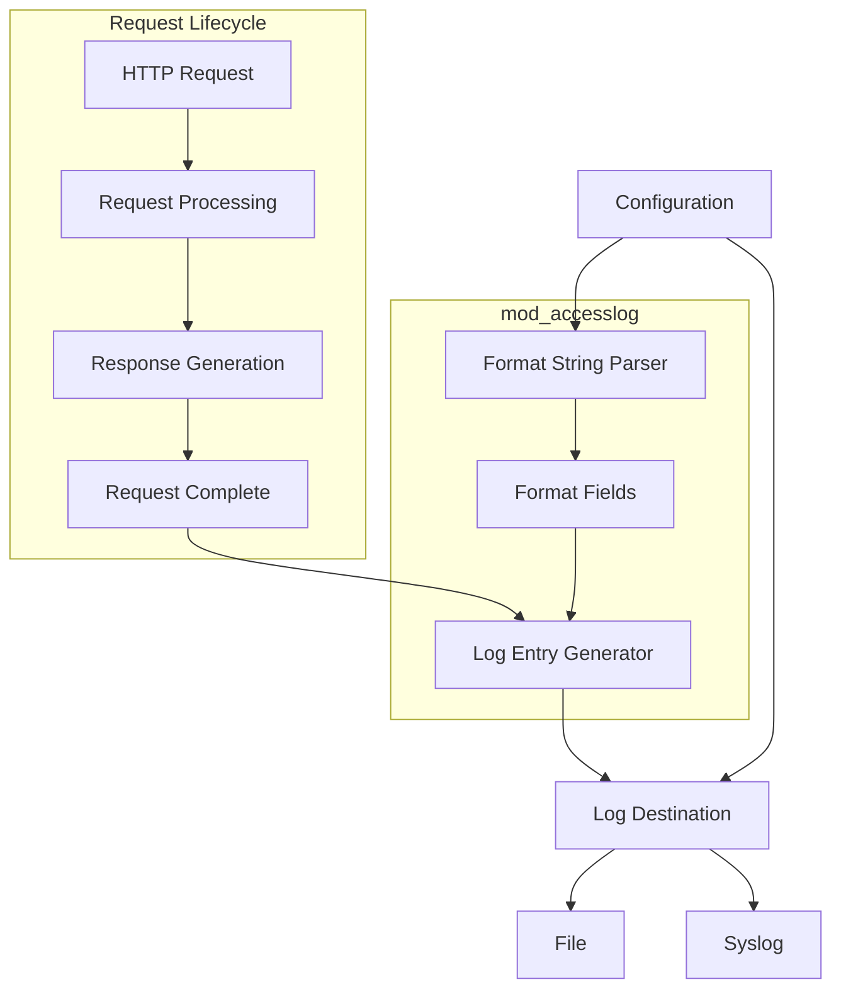
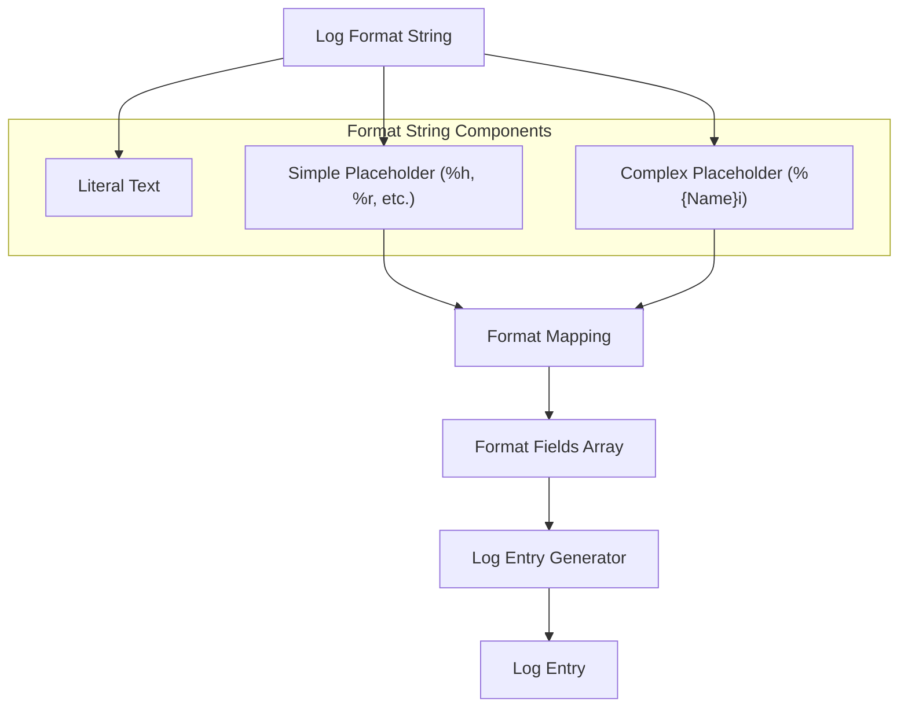
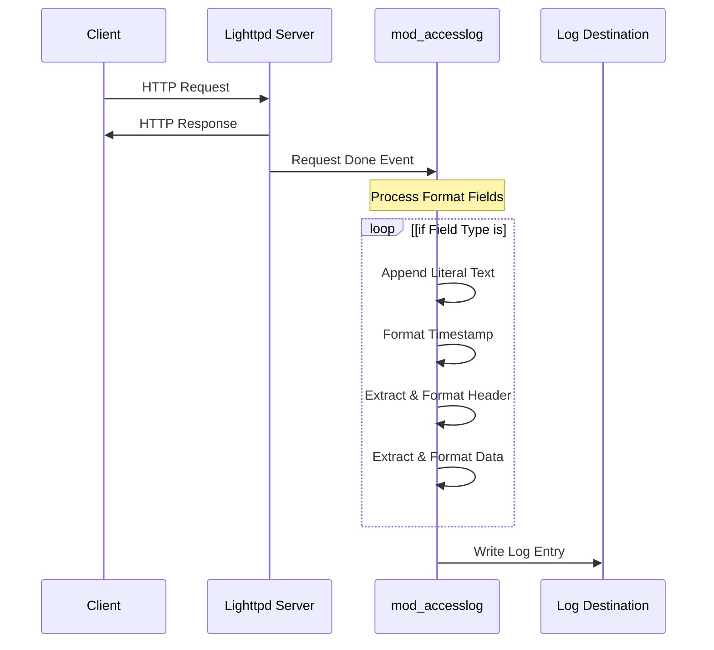
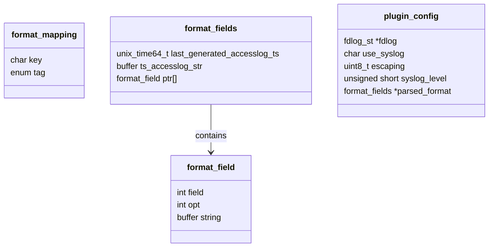

# Access Logging

> **Relevant source files**
> * [src/buffer.c](https://github.com/lighttpd/lighttpd1.4/blob/3d550097/src/buffer.c)
> * [src/buffer.h](https://github.com/lighttpd/lighttpd1.4/blob/3d550097/src/buffer.h)
> * [src/log.c](https://github.com/lighttpd/lighttpd1.4/blob/3d550097/src/log.c)
> * [src/log.h](https://github.com/lighttpd/lighttpd1.4/blob/3d550097/src/log.h)
> * [src/mod_accesslog.c](https://github.com/lighttpd/lighttpd1.4/blob/3d550097/src/mod_accesslog.c)
> * [src/mod_rrdtool.c](https://github.com/lighttpd/lighttpd1.4/blob/3d550097/src/mod_rrdtool.c)
> * [src/mod_status.c](https://github.com/lighttpd/lighttpd1.4/blob/3d550097/src/mod_status.c)

The access logging system in Lighttpd provides a flexible way to record information about client requests. It allows server administrators to track who is accessing the web server, what resources they're requesting, and how the server is responding. This page documents the access logging system implemented by the `mod_accesslog` module.

For information about server status monitoring, see [Server Status Monitoring](/lighttpd/lighttpd1.4/5.2-server-status-monitoring).

## Overview of Access Logging

Access logging records details about each HTTP request processed by the server. The `mod_accesslog` module handles this functionality, allowing for customizable log formats and various output destinations including files and syslog.



Sources: [src/mod_accesslog.c L172-L188](https://github.com/lighttpd/lighttpd1.4/blob/3d550097/src/mod_accesslog.c#L172-L188)

 [src/mod_accesslog.c L793-L901](https://github.com/lighttpd/lighttpd1.4/blob/3d550097/src/mod_accesslog.c#L793-L901)

## Configuration

Access logging is configured in the Lighttpd configuration file. The primary configuration directives include:

| Directive | Description |
| --- | --- |
| `accesslog.filename` | Path to the log file where access logs will be written |
| `accesslog.format` | String defining the format of log entries |
| `accesslog.use-syslog` | Boolean indicating whether to use syslog instead of a file |
| `accesslog.syslog-level` | Syslog level to use when logging (if use-syslog is enabled) |
| `accesslog.escaping` | Control character escaping in log entries (`default` or `json`) |

### Example Configuration

```
accesslog.filename = "/var/log/lighttpd/access.log"
accesslog.format = "%h %l %u %t \"%r\" %>s %b \"%{Referer}i\" \"%{User-Agent}i\""
```

Sources: [src/mod_accesslog.c L353-L457](https://github.com/lighttpd/lighttpd1.4/blob/3d550097/src/mod_accesslog.c#L353-L457)

## Log Format Syntax

The access log format is specified using a syntax similar to Apache's log format string. It consists of literal text and format placeholders that start with `%`.



Sources: [src/mod_accesslog.c L67-L111](https://github.com/lighttpd/lighttpd1.4/blob/3d550097/src/mod_accesslog.c#L67-L111)

 [src/mod_accesslog.c L191-L275](https://github.com/lighttpd/lighttpd1.4/blob/3d550097/src/mod_accesslog.c#L191-L275)

### Format Placeholders

Here are the common format placeholders supported by `mod_accesslog`:

| Placeholder | Description |
| --- | --- |
| `%h` | Remote host (IP address) |
| `%l` | Remote ident (always shown as "-") |
| `%u` | Remote user (from authentication) |
| `%t` | Time the request was received |
| `%r` | First line of request (method, path, protocol) |
| `%>s` | Status code sent to the client |
| `%b` | Bytes sent, excluding HTTP headers (or "-" if zero) |
| `%B` | Bytes sent, excluding HTTP headers |
| `%i` | Request header field (usage: `%{User-Agent}i`) |
| `%o` | Response header field (usage: `%{Content-Type}o`) |
| `%T` | Time taken to serve the request (seconds) |
| `%D` | Time taken to serve the request (microseconds) |
| `%U` | URL path requested, without query string |
| `%q` | Query string (without '?' if present, otherwise empty) |
| `%V` | Server name according to the `Host` header |
| `%v` | Server name |
| `%I` | Bytes received, including request and headers |
| `%O` | Bytes sent, including headers |
| `%{VARNAME}e` | Environment variable content |
| `%X` | Connection status when response is completed |

Sources: [src/mod_accesslog.c L76-L110](https://github.com/lighttpd/lighttpd1.4/blob/3d550097/src/mod_accesslog.c#L76-L110)

 [src/mod_accesslog.c L613-L791](https://github.com/lighttpd/lighttpd1.4/blob/3d550097/src/mod_accesslog.c#L613-L791)

### Special Format Options

The time format (`%t`) can be customized with additional options:

| Format | Description |
| --- | --- |
| `%{format}t` | Custom time format using strftime syntax |
| `%{begin:format}t` | Use request start time with custom format |
| `%{end:format}t` | Use request end time with custom format |
| `%{sec}t` | Timestamp in seconds since epoch |
| `%{msec}t` | Timestamp in milliseconds since epoch |
| `%{usec}t` | Timestamp in microseconds since epoch |

Time measurement for request duration (`%T`) can be modified:

| Format | Description |
| --- | --- |
| `%{s}T` or `%{sec}T` | Time in seconds (default) |
| `%{ms}T` or `%{msec}T` | Time in milliseconds |
| `%{us}T` or `%{usec}T` | Time in microseconds |
| `%{ns}T` or `%{nsec}T` | Time in nanoseconds |

Sources: [src/mod_accesslog.c L114-L126](https://github.com/lighttpd/lighttpd1.4/blob/3d550097/src/mod_accesslog.c#L114-L126)

 [src/mod_accesslog.c L499-L560](https://github.com/lighttpd/lighttpd1.4/blob/3d550097/src/mod_accesslog.c#L499-L560)

## Processing Flow

When a request is completed, the access logging module generates a log entry based on the configured format. The process involves:



Sources: [src/mod_accesslog.c L793-L901](https://github.com/lighttpd/lighttpd1.4/blob/3d550097/src/mod_accesslog.c#L793-L901)

 [src/log.c L613-L791](https://github.com/lighttpd/lighttpd1.4/blob/3d550097/src/log.c#L613-L791)

## Internal Data Structures

The access logging module uses several key data structures to manage log formats and entries:

### Format Field Types

The module defines an enumeration of field types that correspond to different kinds of information that can be included in a log entry:



Sources: [src/mod_accesslog.c L28-L67](https://github.com/lighttpd/lighttpd1.4/blob/3d550097/src/mod_accesslog.c#L28-L67)

 [src/mod_accesslog.c L134-L165](https://github.com/lighttpd/lighttpd1.4/blob/3d550097/src/mod_accesslog.c#L134-L165)

## Format Parsing

The format string is parsed during server initialization and converted into an array of format fields that can be efficiently processed for each request:

1. The format string is scanned for literal text and format placeholders
2. Each format placeholder is mapped to a corresponding field type
3. Special format options (like time format modifiers) are parsed
4. The resulting format fields are stored for use during request processing

Sources: [src/mod_accesslog.c L191-L275](https://github.com/lighttpd/lighttpd1.4/blob/3d550097/src/mod_accesslog.c#L191-L275)

 [src/mod_accesslog.c L486-L607](https://github.com/lighttpd/lighttpd1.4/blob/3d550097/src/mod_accesslog.c#L486-L607)

## Log Entry Generation

For each completed request, the module generates a log entry by:

1. Creating a buffer to hold the log entry
2. For each format field: * If it's a literal field, append the literal text * If it's a dynamic field (e.g., timestamp, request field), extract the information from the request and format it
3. Write the completed log entry to the configured destination

The module handles various data types and formats, including:

* IP addresses and hostnames
* HTTP request and response headers
* Timestamps in various formats
* Byte counts and timing information
* URL components

Sources: [src/mod_accesslog.c L613-L791](https://github.com/lighttpd/lighttpd1.4/blob/3d550097/src/mod_accesslog.c#L613-L791)

 [src/mod_accesslog.c L793-L901](https://github.com/lighttpd/lighttpd1.4/blob/3d550097/src/mod_accesslog.c#L793-L901)

## Log Destinations

The access logging module supports two primary log destinations:

### File Logging

File logging writes log entries to a specified file. The module uses the `fdlog` subsystem to handle file operations, including:

* Opening and closing log files
* Writing log entries to files
* Handling errors during writing
* Periodic flushing of log buffers

### Syslog Logging

Syslog logging sends log entries to the system's syslog facility. This allows integration with system-wide logging infrastructure and tools.

Sources: [src/mod_accesslog.c L609-L614](https://github.com/lighttpd/lighttpd1.4/blob/3d550097/src/mod_accesslog.c#L609-L614)

 [src/log.c L284-L303](https://github.com/lighttpd/lighttpd1.4/blob/3d550097/src/log.c#L284-L303)

## Performance Considerations

The access logging module includes several optimizations to minimize performance impact:

1. **Format String Parsing**: The format string is parsed only once during initialization, creating a reusable structure of format fields.
2. **Timestamp Caching**: Frequently used timestamps are cached to avoid repeated formatting.
3. **Buffer Reuse**: Buffers are reused to minimize memory allocations.
4. **Periodic Flushing**: Log files are flushed periodically rather than after each request to reduce I/O operations.

Sources: [src/mod_accesslog.c L352-L400](https://github.com/lighttpd/lighttpd1.4/blob/3d550097/src/mod_accesslog.c#L352-L400)

 [src/mod_accesslog.c L609-L614](https://github.com/lighttpd/lighttpd1.4/blob/3d550097/src/mod_accesslog.c#L609-L614)

## Common Log Formats

Several standard log formats are commonly used:

### Common Log Format (CLF)

```
%h %l %u %t "%r" %>s %b
```

### Combined Log Format

```
%h %l %u %t "%r" %>s %b "%{Referer}i" "%{User-Agent}i"
```

### Example Log Entry (Combined Format)

```
192.168.1.1 - - [10/Oct/2023:13:55:36 -0700] "GET /index.html HTTP/1.1" 200 2326 "http://example.com/" "Mozilla/5.0 (Windows NT 10.0; Win64; x64)"
```

Sources: [src/mod_accesslog.c L476-L481](https://github.com/lighttpd/lighttpd1.4/blob/3d550097/src/mod_accesslog.c#L476-L481)

## Integration with Other Modules

The access logging module integrates with other parts of the Lighttpd server:

1. **Server Core**: Hooks into the request processing pipeline at the "request done" stage
2. **Buffer Module**: Uses buffer functions for string manipulation and formatting
3. **Request Structure**: Extracts information from the request and response structures
4. **Logging Subsystem**: Uses common logging functions for error handling and output

Sources: [src/mod_accesslog.c L793-L901](https://github.com/lighttpd/lighttpd1.4/blob/3d550097/src/mod_accesslog.c#L793-L901)

 [src/buffer.c L1-L972](https://github.com/lighttpd/lighttpd1.4/blob/3d550097/src/buffer.c#L1-L972)

## Conclusion

The access logging system in Lighttpd provides a flexible and efficient way to record information about client requests. It supports customizable log formats, various output destinations, and includes optimizations to minimize performance impact.