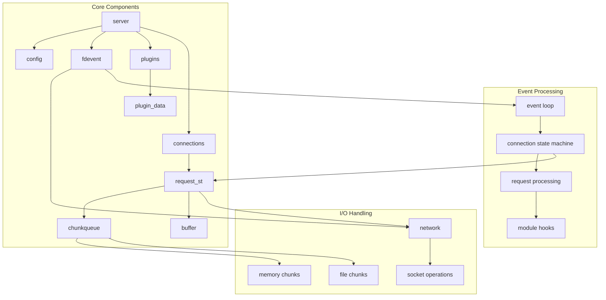

# Architecture and Core Components

> **Relevant source files**
> * [NEWS](https://github.com/lighttpd/lighttpd1.4/blob/3d550097/NEWS)
> * [src/base.h](https://github.com/lighttpd/lighttpd1.4/blob/3d550097/src/base.h)
> * [src/configfile.c](https://github.com/lighttpd/lighttpd1.4/blob/3d550097/src/configfile.c)
> * [src/connections.c](https://github.com/lighttpd/lighttpd1.4/blob/3d550097/src/connections.c)
> * [src/network.c](https://github.com/lighttpd/lighttpd1.4/blob/3d550097/src/network.c)
> * [src/plugin.c](https://github.com/lighttpd/lighttpd1.4/blob/3d550097/src/plugin.c)
> * [src/plugin.h](https://github.com/lighttpd/lighttpd1.4/blob/3d550097/src/plugin.h)
> * [src/server.c](https://github.com/lighttpd/lighttpd1.4/blob/3d550097/src/server.c)

This document describes the core architecture of lighttpd, explaining the main components and their relationships within the web server system. We'll cover the fundamental structures, their interactions, and the flow of control through the system. For details about HTTP request processing specifically, see [HTTP Request Processing](/lighttpd/lighttpd1.4/1.2-http-request-processing).

## High-Level Architecture Overview

Sources: [src/base.h L1-L209](https://github.com/lighttpd/lighttpd1.4/blob/3d550097/src/base.h#L1-L209)

 [src/server.c L1-L99](https://github.com/lighttpd/lighttpd1.4/blob/3d550097/src/server.c#L1-L99)

 [src/connections.c L1-L50](https://github.com/lighttpd/lighttpd1.4/blob/3d550097/src/connections.c#L1-L50)

## Core Components

### Server Structure

The `server` structure is the central component of lighttpd, containing all global state and configurations. It manages connections, plugins, event handling, and configuration data.

Sources: [src/base.h L155-L206](https://github.com/lighttpd/lighttpd1.4/blob/3d550097/src/base.h#L155-L206)

 [src/server.c L494-L545](https://github.com/lighttpd/lighttpd1.4/blob/3d550097/src/server.c#L494-L545)

The `server` structure is initialized in the `server_init()` function in [src/server.c L494-L545](https://github.com/lighttpd/lighttpd1.4/blob/3d550097/src/server.c#L494-L545)

 which:

1. Initializes core buffers and data structures
2. Sets up error handling
3. Initializes configuration
4. Sets up connection management

### Connection Management

Connections are managed through the `connection` structure which represents a client connection to the server.

Sources: [src/base.h L30-L77](https://github.com/lighttpd/lighttpd1.4/blob/3d550097/src/base.h#L30-L77)

 [src/connections.c L372-L390](https://github.com/lighttpd/lighttpd1.4/blob/3d550097/src/connections.c#L372-L390)

 [src/connections.c L74-L100](https://github.com/lighttpd/lighttpd1.4/blob/3d550097/src/connections.c#L74-L100)

Key connection management functions:

* `connection_accepted()` - Creates a new connection after accepting a socket
* `connection_state_machine()` - Drives the state transitions of a connection
* `connection_close()` - Cleans up and closes a connection

### Connection State Machine

The connection state machine drives the request handling process through various states:

Sources: [src/connections.c L632-L704](https://github.com/lighttpd/lighttpd1.4/blob/3d550097/src/connections.c#L632-L704)

 [src/connections.c L174-L217](https://github.com/lighttpd/lighttpd1.4/blob/3d550097/src/connections.c#L174-L217)

The connection state machine is implemented in `connection_state_machine_loop()` which processes the state transitions based on the current state and the result of the handling functions for each state.

### Event Handling System

The event handling system is based on the `fdevent` subsystem which provides abstraction over different event notification mechanisms (select, poll, epoll, etc).

Sources: [src/server.c L474-L493](https://github.com/lighttpd/lighttpd1.4/blob/3d550097/src/server.c#L474-L493)

 [src/connections.c L473-L494](https://github.com/lighttpd/lighttpd1.4/blob/3d550097/src/connections.c#L473-L494)

Key aspects:

* `fdevent` registers file descriptors for event notification
* Events trigger callbacks like `connection_handle_fdevent()`
* The event loop in the server main function processes these events
* `joblist_append()` is used to queue connections for processing

### Plugin System

The plugin system provides extensibility to lighttpd. Plugins can register handlers for various hooks in the request processing cycle.

Sources: [src/plugin.h L40-L75](https://github.com/lighttpd/lighttpd1.4/blob/3d550097/src/plugin.h#L40-L75)

 [src/plugin.c L57-L59](https://github.com/lighttpd/lighttpd1.4/blob/3d550097/src/plugin.c#L57-L59)

 [src/plugin.c L447-L579](https://github.com/lighttpd/lighttpd1.4/blob/3d550097/src/plugin.c#L447-L579)

The plugin system works as follows:

1. Plugins are loaded at server startup (`plugins_load()`)
2. Each plugin registers callbacks for various hooks (`plugins_call_init()`)
3. During request processing, the server calls these hooks at appropriate times
4. The plugin API provides different hook types for various phases of processing

## Request Processing Flow

The following diagram illustrates how HTTP requests flow through the system:

Sources: [src/connections.c L632-L704](https://github.com/lighttpd/lighttpd1.4/blob/3d550097/src/connections.c#L632-L704)

 [src/plugin.c L287-L352](https://github.com/lighttpd/lighttpd1.4/blob/3d550097/src/plugin.c#L287-L352)

## Memory Management

lighttpd uses specialized memory management components to efficiently handle data:

### Buffer System

Buffers (`buffer`) are used for string manipulation and storage.

Sources: [src/base.h L9](https://github.com/lighttpd/lighttpd1.4/blob/3d550097/src/base.h#L9-L9)

 (imported from buffer.h)

### Chunk System

The `chunkqueue` system is used for efficient I/O operations and data handling:

Sources: [src/base.h L10](https://github.com/lighttpd/lighttpd1.4/blob/3d550097/src/base.h#L10-L10)

 (imported from chunk.h)

Chunkqueues can contain different types of chunks:

* Memory chunks (`MEM_CHUNK`) for in-memory data
* File chunks (`FILE_CHUNK`) for file-based data
* This design allows efficient handling of both small in-memory data and large files

## Initialization Process

The server initialization process follows these steps:

Sources: [src/server.c L494-L545](https://github.com/lighttpd/lighttpd1.4/blob/3d550097/src/server.c#L494-L545)

 [src/plugin.c L447-L579](https://github.com/lighttpd/lighttpd1.4/blob/3d550097/src/plugin.c#L447-L579)

## Event Loop

The main event loop is the heart of the server's operation:

Sources: [src/server.c L474-L493](https://github.com/lighttpd/lighttpd1.4/blob/3d550097/src/server.c#L474-L493)

 [src/connections.c L826-L835](https://github.com/lighttpd/lighttpd1.4/blob/3d550097/src/connections.c#L826-L835)

The event loop:

1. Waits for network events using the configured event mechanism
2. Processes triggered events, generally related to socket activity
3. Runs the state machine for connections that have pending work
4. Checks for timeouts and other periodic tasks
5. Repeats until server shutdown is requested

This design allows lighttpd to efficiently handle many concurrent connections with minimal resource usage.