# Authentication and Authorization

> **Relevant source files**
> * [src/mod_auth.c](https://github.com/lighttpd/lighttpd1.4/blob/3d550097/src/mod_auth.c)
> * [src/mod_authn_dbi.c](https://github.com/lighttpd/lighttpd1.4/blob/3d550097/src/mod_authn_dbi.c)
> * [src/mod_authn_file.c](https://github.com/lighttpd/lighttpd1.4/blob/3d550097/src/mod_authn_file.c)
> * [src/mod_authn_gssapi.c](https://github.com/lighttpd/lighttpd1.4/blob/3d550097/src/mod_authn_gssapi.c)
> * [src/mod_authn_ldap.c](https://github.com/lighttpd/lighttpd1.4/blob/3d550097/src/mod_authn_ldap.c)
> * [src/mod_authn_pam.c](https://github.com/lighttpd/lighttpd1.4/blob/3d550097/src/mod_authn_pam.c)
> * [src/mod_authn_sasl.c](https://github.com/lighttpd/lighttpd1.4/blob/3d550097/src/mod_authn_sasl.c)
> * [src/mod_vhostdb_dbi.c](https://github.com/lighttpd/lighttpd1.4/blob/3d550097/src/mod_vhostdb_dbi.c)
> * [src/mod_vhostdb_ldap.c](https://github.com/lighttpd/lighttpd1.4/blob/3d550097/src/mod_vhostdb_ldap.c)
> * [src/mod_vhostdb_mysql.c](https://github.com/lighttpd/lighttpd1.4/blob/3d550097/src/mod_vhostdb_mysql.c)
> * [src/mod_vhostdb_pgsql.c](https://github.com/lighttpd/lighttpd1.4/blob/3d550097/src/mod_vhostdb_pgsql.c)

This page documents the authentication and authorization subsystem in lighttpd, which allows the web server to verify user identities and control access to resources based on credentials and rules.

## Overview

The authentication and authorization system in lighttpd provides a flexible framework for controlling access to web resources. The system consists of:

1. A core authentication framework that handles HTTP auth protocols
2. Multiple authentication backends for credential storage and verification
3. Authorization rules for controlling access based on authenticated identities

The system is primarily implemented through `mod_auth.c` along with several backend-specific modules that support different credential storage mechanisms.

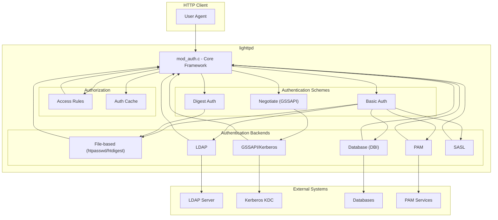

Sources:

* [src/mod_auth.c](https://github.com/lighttpd/lighttpd1.4/blob/3d550097/src/mod_auth.c)
* [src/mod_authn_file.c](https://github.com/lighttpd/lighttpd1.4/blob/3d550097/src/mod_authn_file.c)
* [src/mod_authn_ldap.c](https://github.com/lighttpd/lighttpd1.4/blob/3d550097/src/mod_authn_ldap.c)
* [src/mod_authn_gssapi.c](https://github.com/lighttpd/lighttpd1.4/blob/3d550097/src/mod_authn_gssapi.c)
* [src/mod_authn_dbi.c](https://github.com/lighttpd/lighttpd1.4/blob/3d550097/src/mod_authn_dbi.c)
* [src/mod_authn_pam.c](https://github.com/lighttpd/lighttpd1.4/blob/3d550097/src/mod_authn_pam.c)
* [src/mod_authn_sasl.c](https://github.com/lighttpd/lighttpd1.4/blob/3d550097/src/mod_authn_sasl.c)

## Authentication Framework Architecture

The authentication framework in lighttpd is designed with a modular architecture that separates different aspects of the authentication process:

1. **Authentication Schemes**: Define how credentials are transmitted and processed (Basic, Digest, Negotiate)
2. **Authentication Backends**: Define where and how credentials are stored and verified
3. **Authorization Rules**: Define access control based on authenticated identity

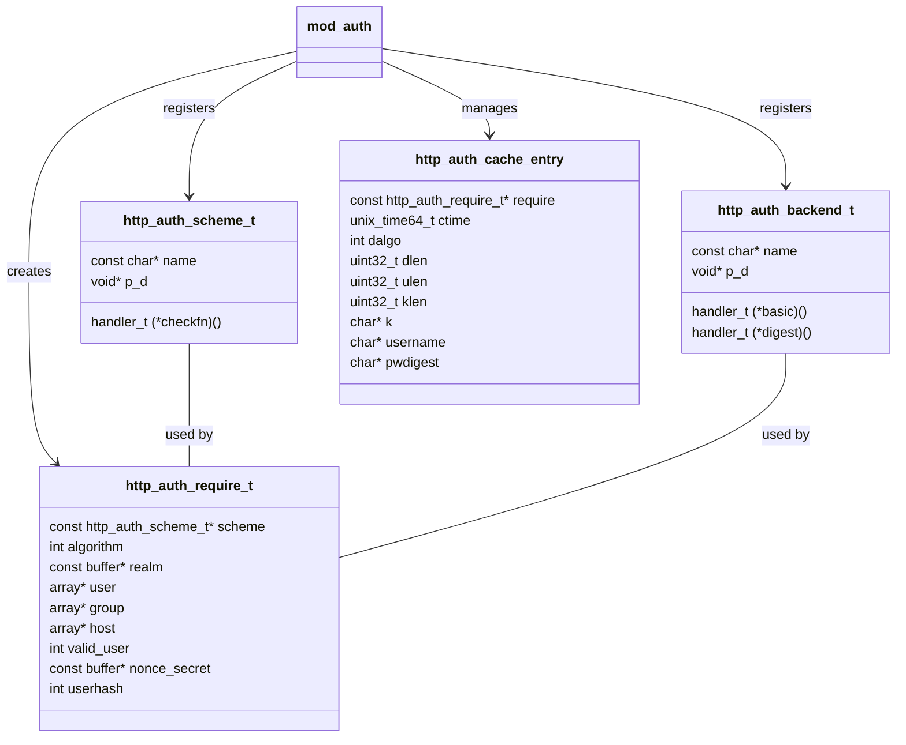

Sources:

* [src/mod_auth.c L28-L56](https://github.com/lighttpd/lighttpd1.4/blob/3d550097/src/mod_auth.c#L28-L56)
* [src/mod_auth.c L215-L230](https://github.com/lighttpd/lighttpd1.4/blob/3d550097/src/mod_auth.c#L215-L230)
* [src/mod_auth.c L259-L289](https://github.com/lighttpd/lighttpd1.4/blob/3d550097/src/mod_auth.c#L259-L289)

### Core Authentication Process

Lighttpd's authentication process follows a defined flow when a request requires authentication:

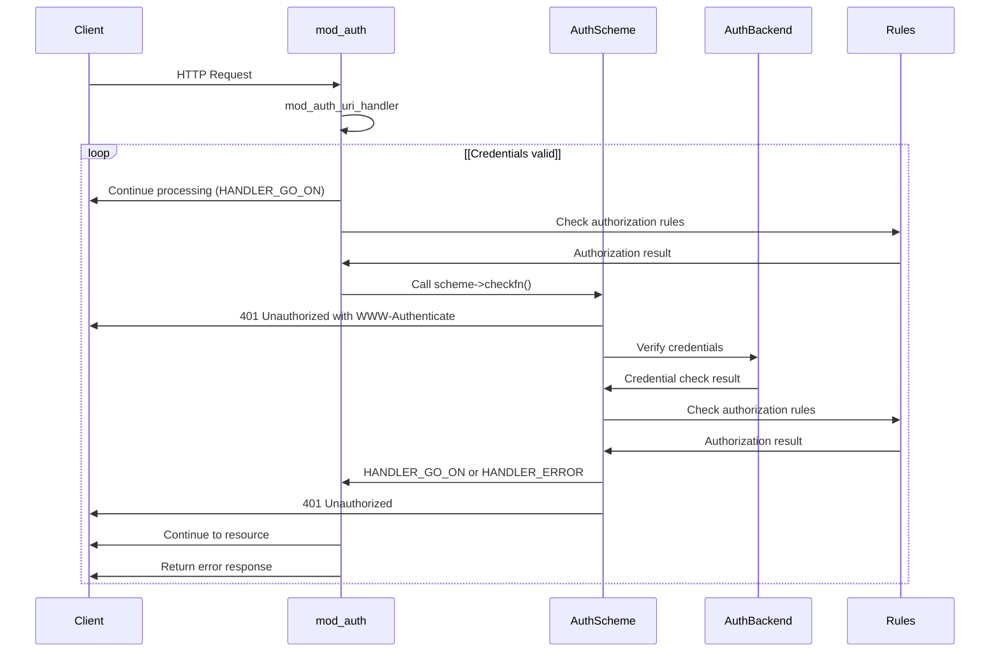

Sources:

* [src/mod_auth.c L677-L702](https://github.com/lighttpd/lighttpd1.4/blob/3d550097/src/mod_auth.c#L677-L702)
* [src/mod_auth.c L215-L218](https://github.com/lighttpd/lighttpd1.4/blob/3d550097/src/mod_auth.c#L215-L218)

## Authentication Schemes

Lighttpd supports multiple authentication schemes, each providing a different method for the client to authenticate:

### Basic Authentication

Basic authentication involves sending username:password in a Base64-encoded format. While simple, it's not secure over unencrypted connections as credentials are easily decoded.

The implementation in `mod_auth.c` handles Basic authentication through:

* `mod_auth_check_basic()`: Main handler for Basic auth
* `mod_auth_send_401_unauthorized_basic()`: Generates 401 responses for Basic auth

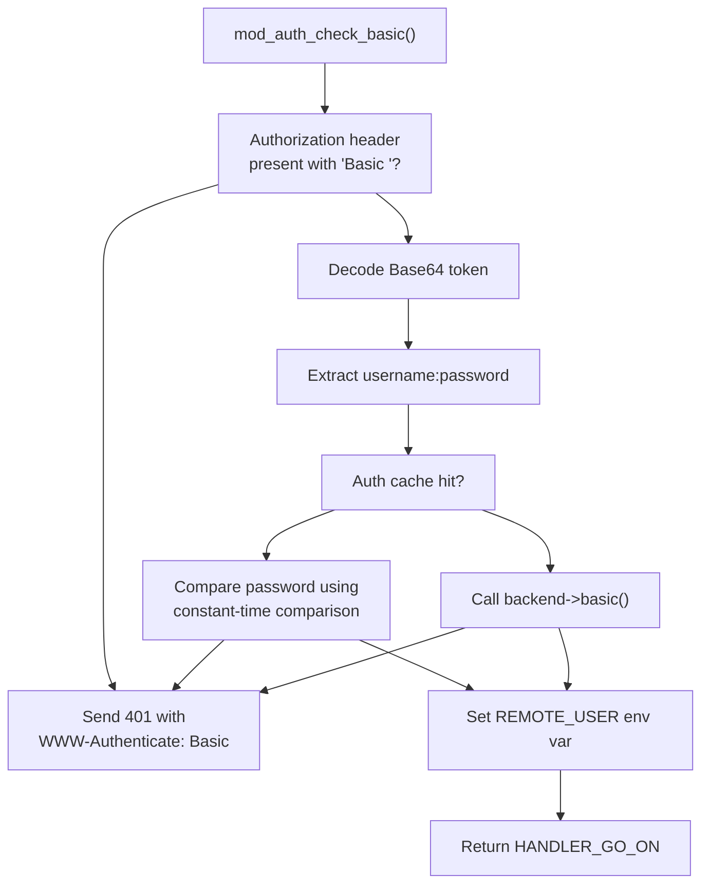

Sources:

* [src/mod_auth.c L745-L871](https://github.com/lighttpd/lighttpd1.4/blob/3d550097/src/mod_auth.c#L745-L871)

### Digest Authentication

Digest authentication is more secure than Basic auth, as it doesn't send the password directly. Instead, it uses a hashing mechanism to prove knowledge of the password.

The implementation in `mod_auth.c` includes:

* `mod_auth_check_digest()`: Handles Digest auth
* `mod_auth_digest_mutate()`: Generates the proper digest for verification
* `mod_auth_digest_www_authenticate()`: Generates challenge responses

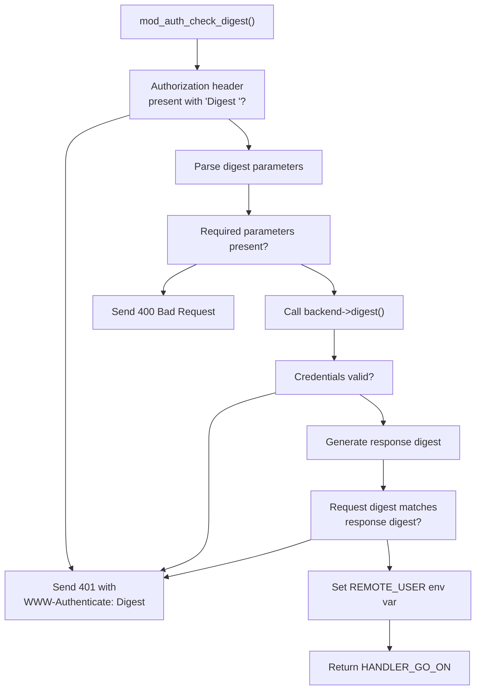

Sources:

* [src/mod_auth.c L874-L1152](https://github.com/lighttpd/lighttpd1.4/blob/3d550097/src/mod_auth.c#L874-L1152)

### Negotiate Authentication (GSSAPI/Kerberos)

Negotiate authentication is primarily used for Kerberos/GSSAPI authentication and is implemented in `mod_authn_gssapi.c`. This scheme provides single sign-on capabilities in environments like Active Directory.

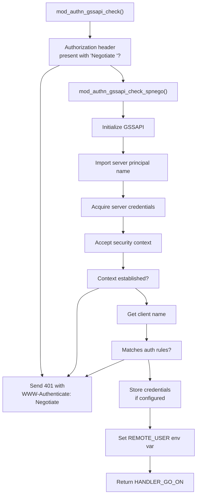

Sources:

* [src/mod_authn_gssapi.c L254-L461](https://github.com/lighttpd/lighttpd1.4/blob/3d550097/src/mod_authn_gssapi.c#L254-L461)

## Authentication Backends

Lighttpd supports multiple authentication backends that store and verify credentials. Each backend implements at least one of the auth scheme verification functions.

### File-based Authentication (mod_authn_file)

This backend supports reading credentials from local files in htpasswd, htdigest, or plain text formats.

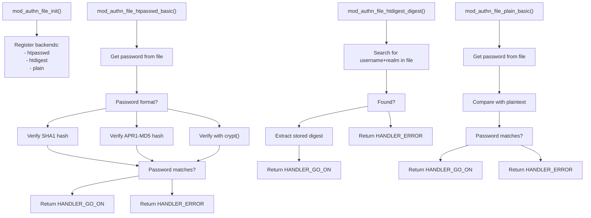

Sources:

* [src/mod_authn_file.c L54-L59](https://github.com/lighttpd/lighttpd1.4/blob/3d550097/src/mod_authn_file.c#L54-L59)
* [src/mod_authn_file.c L60-L81](https://github.com/lighttpd/lighttpd1.4/blob/3d550097/src/mod_authn_file.c#L60-L81)
* [src/mod_authn_file.c L306-L335](https://github.com/lighttpd/lighttpd1.4/blob/3d550097/src/mod_authn_file.c#L306-L335)
* [src/mod_authn_file.c L397-L432](https://github.com/lighttpd/lighttpd1.4/blob/3d550097/src/mod_authn_file.c#L397-L432)
* [src/mod_authn_file.c L697-L740](https://github.com/lighttpd/lighttpd1.4/blob/3d550097/src/mod_authn_file.c#L697-L740)

### LDAP Authentication (mod_authn_ldap)

This backend queries an LDAP directory for user authentication, supporting both Basic and Digest authentication methods. It's particularly useful in enterprise environments with centralized user directories.

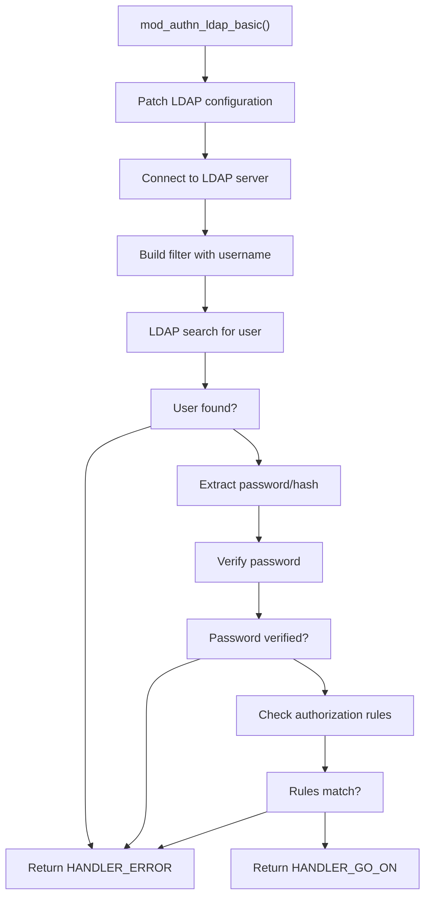

Sources:

* [src/mod_authn_ldap.c L572-L664](https://github.com/lighttpd/lighttpd1.4/blob/3d550097/src/mod_authn_ldap.c#L572-L664)

### GSSAPI/Kerberos Authentication (mod_authn_gssapi)

This backend provides Kerberos authentication, supporting both the Negotiate scheme and Basic authentication with Kerberos backend verification.

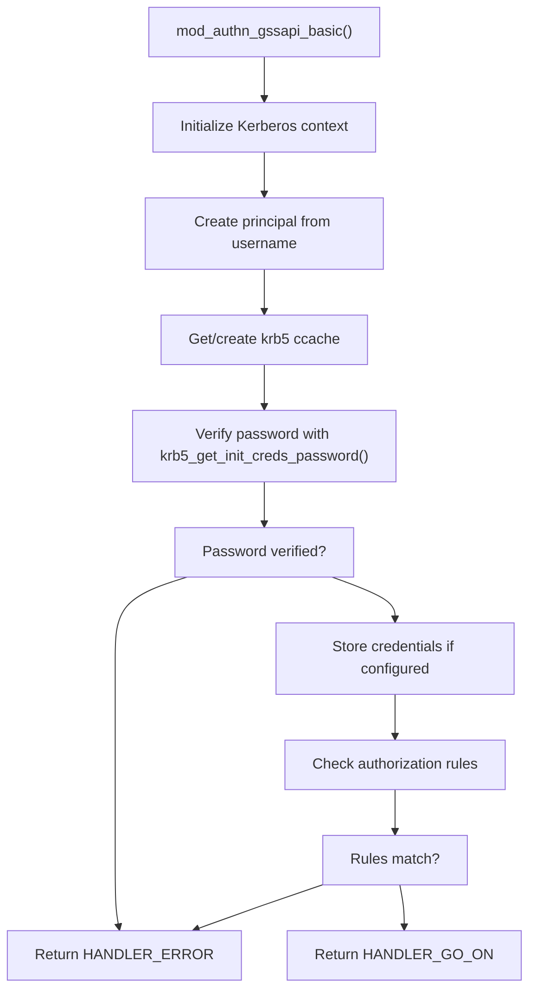

Sources:

* [src/mod_authn_gssapi.c L626-L764](https://github.com/lighttpd/lighttpd1.4/blob/3d550097/src/mod_authn_gssapi.c#L626-L764)

### Database Authentication (mod_authn_dbi)

This backend uses libdbi to connect to various database systems for credential storage and verification, supporting both Basic and Digest authentication.

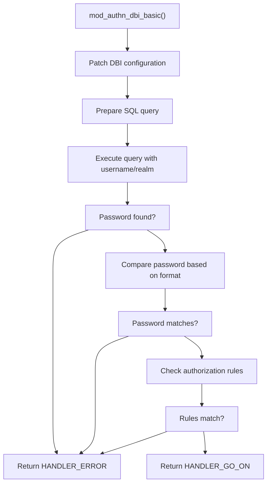

Sources:

* [src/mod_authn_dbi.c L398-L476](https://github.com/lighttpd/lighttpd1.4/blob/3d550097/src/mod_authn_dbi.c#L398-L476)

### Other Authentication Backends

Lighttpd also supports additional authentication backends:

* **PAM Authentication** (mod_authn_pam): Uses the Pluggable Authentication Modules system
* **SASL Authentication** (mod_authn_sasl): Implements the Simple Authentication and Security Layer framework

## Authorization Process

After a user is authenticated, the authorization process determines if the authenticated user has permission to access the requested resource based on configured rules.

### Rule-based Authorization

Authorization rules in lighttpd are specified in the `auth.require` configuration directive and can include:

* **user**: Specific usernames that are allowed access
* **group**: Group names that are allowed access
* **valid-user**: Any successfully authenticated user is allowed access

The authorization logic is implemented in `http_auth_match_rules()`:

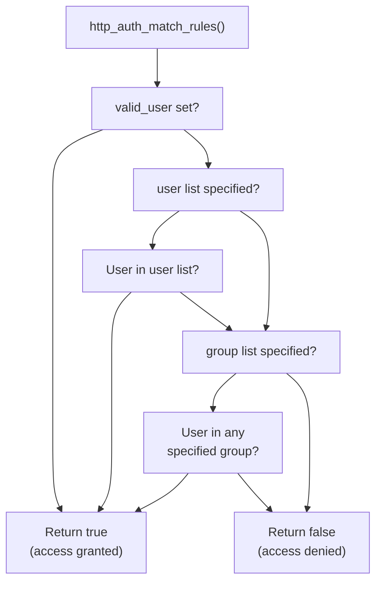

Sources:

* [src/mod_auth.c L352-L439](https://github.com/lighttpd/lighttpd1.4/blob/3d550097/src/mod_auth.c#L352-L439)
* [src/mod_auth.c L690-L701](https://github.com/lighttpd/lighttpd1.4/blob/3d550097/src/mod_auth.c#L690-L701)

## Authentication Cache

To improve performance, lighttpd can cache authentication results, reducing the need to repeatedly query backends for the same credentials. The cache is implemented in `http_auth_cache_*` functions:

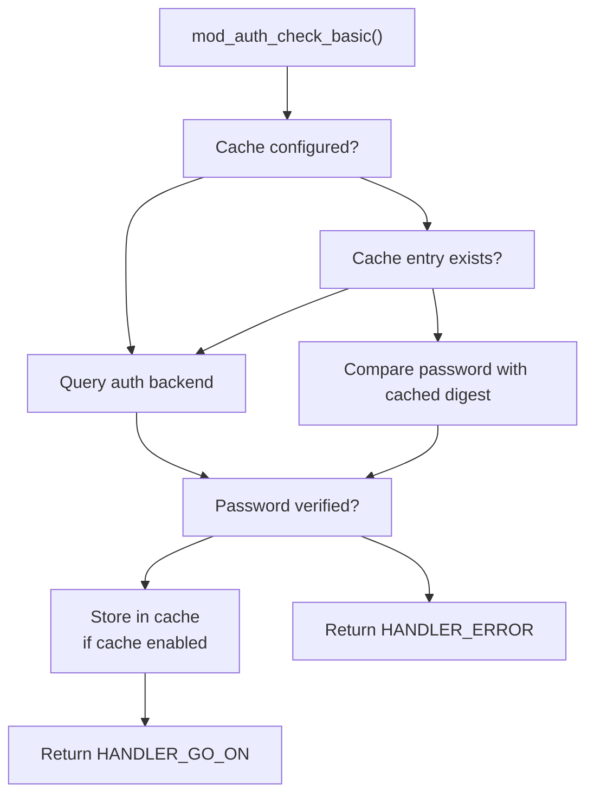

The cache is periodically cleaned to remove expired entries through the `mod_auth_periodic` trigger function.

Sources:

* [src/mod_auth.c L59-L102](https://github.com/lighttpd/lighttpd1.4/blob/3d550097/src/mod_auth.c#L59-L102)
* [src/mod_auth.c L103-L210](https://github.com/lighttpd/lighttpd1.4/blob/3d550097/src/mod_auth.c#L103-L210)
* [src/mod_auth.c L788-L840](https://github.com/lighttpd/lighttpd1.4/blob/3d550097/src/mod_auth.c#L788-L840)

## Configuration Examples

### Basic Authentication with File Backend

```javascript
# Enable mod_auth
server.modules += ( "mod_auth" )

# Set up basic authentication for a directory
$HTTP["url"] =~ "^/protected/" {
    auth.backend = "htpasswd"
    auth.backend.htpasswd.userfile = "/path/to/.htpasswd"
    auth.require = (
        "" => (
            "method" => "basic",
            "realm" => "Protected Area",
            "require" => "valid-user"
        )
    )
}
```

### Digest Authentication with File Backend

```javascript
# Enable mod_auth
server.modules += ( "mod_auth" )

# Set up digest authentication for a directory
$HTTP["url"] =~ "^/protected/" {
    auth.backend = "htdigest"
    auth.backend.htdigest.userfile = "/path/to/.htdigest"
    auth.require = (
        "" => (
            "method" => "digest",
            "realm" => "Protected Area",
            "require" => "valid-user"
        )
    )
}
```

### LDAP Authentication

```javascript
# Enable mod_auth
server.modules += ( "mod_auth" )

# Set up LDAP authentication
$HTTP["url"] =~ "^/protected/" {
    auth.backend = "ldap"
    auth.backend.ldap.hostname = "ldap.example.com"
    auth.backend.ldap.base-dn = "ou=people,dc=example,dc=com"
    auth.backend.ldap.filter = "(&(uid=?)(objectClass=posixAccount))"
    auth.backend.ldap.ca-file = "/path/to/ca.pem"
    auth.backend.ldap.starttls = "enable"
    
    auth.require = (
        "" => (
            "method" => "basic",
            "realm" => "LDAP Protected Area",
            "require" => "valid-user"
        )
    )
}
```

### Kerberos Authentication (Negotiate)

```javascript
# Enable mod_auth
server.modules += ( "mod_auth" )

# Set up Kerberos/GSSAPI authentication
$HTTP["url"] =~ "^/protected/" {
    auth.backend = "gssapi"
    auth.backend.gssapi.keytab = "/path/to/keytab"
    auth.backend.gssapi.principal = "HTTP/server.example.com@EXAMPLE.COM"
    
    auth.require = (
        "" => (
            "method" => "gssapi",
            "realm" => "EXAMPLE.COM",
            "require" => "valid-user"
        )
    )
}
```

## Conclusion

The authentication and authorization subsystem in lighttpd provides a flexible and extensible framework for securing web resources. With support for multiple authentication schemes and backends, it can be adapted to various environments from simple file-based authentication to enterprise directory services.

The modular design allows for easy extension with additional backends while maintaining a consistent interface for the core authentication process. The caching mechanism enhances performance by reducing the need for repeated authentication requests.