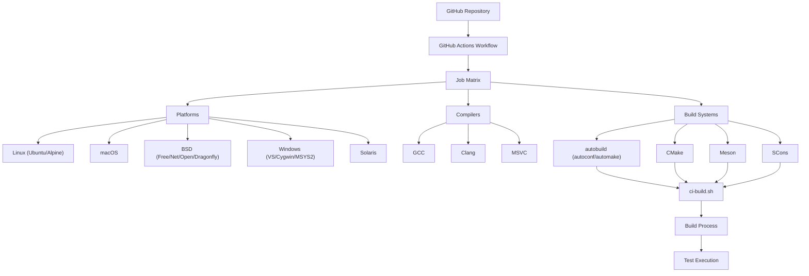
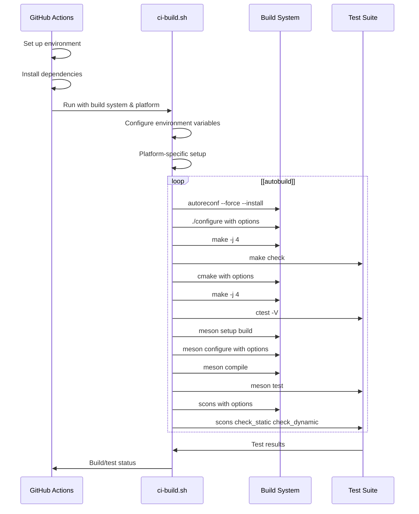
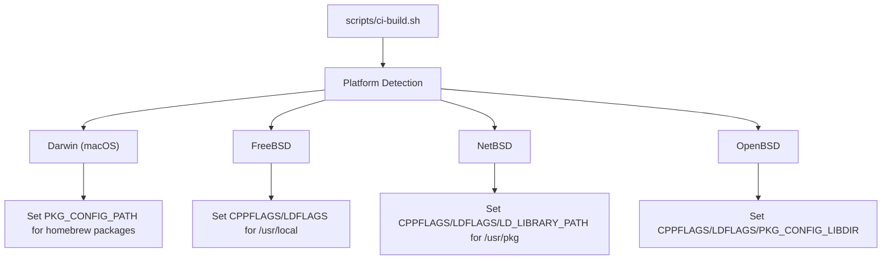
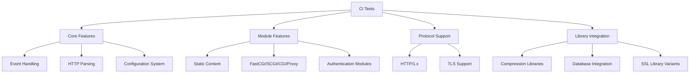

# Continuous Integration

> **Relevant source files**
> * [.github/dependabot.yml](https://github.com/lighttpd/lighttpd1.4/blob/3d550097/.github/dependabot.yml)
> * [.github/workflows/ci.yml](https://github.com/lighttpd/lighttpd1.4/blob/3d550097/.github/workflows/ci.yml)
> * [autogen.sh](https://github.com/lighttpd/lighttpd1.4/blob/3d550097/autogen.sh)
> * [doc/outdated/fastcgi.txt](https://github.com/lighttpd/lighttpd1.4/blob/3d550097/doc/outdated/fastcgi.txt)
> * [doc/scripts/Makefile.am](https://github.com/lighttpd/lighttpd1.4/blob/3d550097/doc/scripts/Makefile.am)
> * [doc/scripts/cert-staple.sh](https://github.com/lighttpd/lighttpd1.4/blob/3d550097/doc/scripts/cert-staple.sh)
> * [scripts/ci-build.sh](https://github.com/lighttpd/lighttpd1.4/blob/3d550097/scripts/ci-build.sh)
> * [scripts/cmake/LighttpdMacros.cmake](https://github.com/lighttpd/lighttpd1.4/blob/3d550097/scripts/cmake/LighttpdMacros.cmake)

## Purpose and Scope

This document describes the Continuous Integration (CI) system used in the lighttpd project. The CI system automatically builds and tests the codebase on multiple platforms, with different compilers, and using different build systems. This helps identify issues early, ensures cross-platform compatibility, and maintains code quality throughout development.

For information about the testing framework itself, see [Testing Framework](/lighttpd/lighttpd1.4/6.1-testing-framework). For debugging help, see [Debugging and Troubleshooting](/lighttpd/lighttpd1.4/6.3-debugging-and-troubleshooting).

Sources: [.github/workflows/ci.yml](https://github.com/lighttpd/lighttpd1.4/blob/3d550097/.github/workflows/ci.yml)

 [scripts/ci-build.sh](https://github.com/lighttpd/lighttpd1.4/blob/3d550097/scripts/ci-build.sh)

## CI Architecture Overview

The CI system is built around GitHub Actions and a central build script. GitHub Actions orchestrates the testing across multiple platforms, while a central build script handles the actual building and testing for each combination.

### CI Architecture Diagram



Sources: [.github/workflows/ci.yml L1-L390](https://github.com/lighttpd/lighttpd1.4/blob/3d550097/.github/workflows/ci.yml#L1-L390)

 [scripts/ci-build.sh L1-L188](https://github.com/lighttpd/lighttpd1.4/blob/3d550097/scripts/ci-build.sh#L1-L188)

The CI workflow is triggered on:

* Pull requests to the master branch
* Pushes to the ci branch
* Pushes of tags starting with "lighttpd-"

## Build Script

The central component of the CI system is the `scripts/ci-build.sh` script, which handles:

* Setting up the build environment
* Configuring platform-specific settings
* Running the build with specified options
* Executing tests

### Build Process Flow



Sources: [scripts/ci-build.sh L68-L187](https://github.com/lighttpd/lighttpd1.4/blob/3d550097/scripts/ci-build.sh#L68-L187)

 [autogen.sh L19-L20](https://github.com/lighttpd/lighttpd1.4/blob/3d550097/autogen.sh#L19-L20)

The script accepts three arguments:

1. `build` - The build system to use (autobuild, cmake, scons, meson, coverity)
2. `label` - The platform label (e.g., debian-stable-amd64)
3. `compiler` - The compiler to use (defaults to gcc)

## Build System Options

The CI script supports enabling/disabling features via environment variables:

| Variable | Purpose |
| --- | --- |
| WITH_WOLFSSL | Enable/disable wolfSSL support |
| WITH_DBI | Enable/disable libdbi support |
| WITH_GNUTLS | Enable/disable GnuTLS support |
| WITH_KRB5 | Enable/disable Kerberos support |
| WITH_MYSQL | Enable/disable MySQL support |
| WITH_PAM | Enable/disable PAM support |
| WITH_PGSQL | Enable/disable PostgreSQL support |
| WITH_SASL | Enable/disable SASL support |
| WITH_UNWIND | Enable/disable libunwind support |

Sources: [scripts/ci-build.sh L13-L41](https://github.com/lighttpd/lighttpd1.4/blob/3d550097/scripts/ci-build.sh#L13-L41)

## GitHub Actions Workflow

The workflow tests a comprehensive matrix of platforms, compilers, and build systems:

### Testing Matrix

| Platform | Compiler | Build Systems |
| --- | --- | --- |
| Linux (Ubuntu) | GCC | Meson, CMake-ASAN, SCons, Autobuild |
| Linux (Ubuntu) | Clang | CMake |
| macOS | Clang | Meson |
| FreeBSD | Clang | Meson, CMake, SCons, Autobuild |
| NetBSD | Clang | CMake |
| OpenBSD | Clang | Meson |
| DragonflyBSD | Clang | Meson |
| Solaris | GCC | CMake |
| Windows (Cygwin) | GCC | Autobuild |
| Windows (Visual Studio) | MSVC | CMake |
| Windows (MSYS2) | GCC/Clang | Autobuild |
| Alpine Linux (x86_64) | GCC | Meson, CMake, SCons, Autobuild |
| Alpine Linux (various) | GCC | Meson |

Sources: [.github/workflows/ci.yml L19-L389](https://github.com/lighttpd/lighttpd1.4/blob/3d550097/.github/workflows/ci.yml#L19-L389)

## Supported Build Systems

### Autobuild (Autoconf/Automake)

The traditional GNU build system using autotools:

1. `autoreconf --force --install` - Generates configure script
2. `./configure` - Configures build with various options
3. `make -j 4` - Builds with 4 parallel jobs
4. `make check` - Runs test suite

Sources: [scripts/ci-build.sh L69-L93](https://github.com/lighttpd/lighttpd1.4/blob/3d550097/scripts/ci-build.sh#L69-L93)

 [autogen.sh L1-L22](https://github.com/lighttpd/lighttpd1.4/blob/3d550097/autogen.sh#L1-L22)

### CMake

Uses the cross-platform CMake build system:

1. `cmake` - Configures build with specified options
2. `make -j 4` - Builds the project
3. `ctest -V` - Runs tests with verbose output

A variant of this, `cmake-asan`, enables Address Sanitizer for memory error detection.

Sources: [scripts/ci-build.sh L95-L132](https://github.com/lighttpd/lighttpd1.4/blob/3d550097/scripts/ci-build.sh#L95-L132)

 [scripts/cmake/LighttpdMacros.cmake L1-L52](https://github.com/lighttpd/lighttpd1.4/blob/3d550097/scripts/cmake/LighttpdMacros.cmake#L1-L52)

### Meson

Modern, high-performance build system:

1. `meson setup build` - Creates build directory
2. `meson configure` - Sets build options
3. `meson compile` - Builds the project
4. `meson test` - Runs test suite

Sources: [scripts/ci-build.sh L133-L170](https://github.com/lighttpd/lighttpd1.4/blob/3d550097/scripts/ci-build.sh#L133-L170)

### SCons

Python-based build system:

1. `scons -j 4` - Builds using 4 parallel jobs
2. `scons check_static check_dynamic` - Tests with static and dynamic linking
3. `scons check_fullstatic` - Tests with full static linking

Sources: [scripts/ci-build.sh L172-L182](https://github.com/lighttpd/lighttpd1.4/blob/3d550097/scripts/ci-build.sh#L172-L182)

## Platform Specific Configurations

The build script includes platform-specific configurations:



Sources: [scripts/ci-build.sh L43-L66](https://github.com/lighttpd/lighttpd1.4/blob/3d550097/scripts/ci-build.sh#L43-L66)

## Feature Testing in CI

The CI system comprehensively tests various lighttpd features:

### Feature Testing Coverage



Sources: [scripts/ci-build.sh L72-L90](https://github.com/lighttpd/lighttpd1.4/blob/3d550097/scripts/ci-build.sh#L72-L90)

 [scripts/ci-build.sh L104-L128](https://github.com/lighttpd/lighttpd1.4/blob/3d550097/scripts/ci-build.sh#L104-L128)

 [scripts/ci-build.sh L135-L158](https://github.com/lighttpd/lighttpd1.4/blob/3d550097/scripts/ci-build.sh#L135-L158)

## Adding New Platforms

To add a new platform to CI:

1. Add a new job in `.github/workflows/ci.yml`
2. Configure the appropriate environment and dependencies
3. Call `scripts/ci-build.sh` with the desired build system

Example for a new platform:

```css
NewPlatform:
  runs-on: ubuntu-latest
  steps:
    - uses: actions/checkout@v4
    - uses: some-platform-action@v1
      with:
        # Platform-specific settings
    - name: Install packages
      run: |
        # Install necessary dependencies
    - name: Compile and Test
      run: |
        cd "${{github.workspace}}" && scripts/ci-build.sh meson
```

Sources: [.github/workflows/ci.yml L102-L116](https://github.com/lighttpd/lighttpd1.4/blob/3d550097/.github/workflows/ci.yml#L102-L116)

 [.github/workflows/ci.yml L235-L293](https://github.com/lighttpd/lighttpd1.4/blob/3d550097/.github/workflows/ci.yml#L235-L293)

## Handling Feature Dependencies

The CI system intelligently handles feature dependencies for each platform:

1. Platform detection in the build script
2. Setting environment variables to disable unsupported features
3. Conditional feature enabling based on available libraries

For example, on Alpine Linux the script disables wolfSSL since the package lacks required features:

```javascript
# Alpine Linux wolfssl package built w/o features required by lighttpd
export NO_WOLFSSL=1
```

Sources: [.github/workflows/ci.yml L358-L360](https://github.com/lighttpd/lighttpd1.4/blob/3d550097/.github/workflows/ci.yml#L358-L360)

 [.github/workflows/ci.yml L263-L266](https://github.com/lighttpd/lighttpd1.4/blob/3d550097/.github/workflows/ci.yml#L263-L266)

 [.github/workflows/ci.yml L184-L185](https://github.com/lighttpd/lighttpd1.4/blob/3d550097/.github/workflows/ci.yml#L184-L185)

## Troubleshooting CI Issues

When CI tests fail:

1. Check GitHub Actions logs for specific errors
2. Note which platform/compiler/build system failed
3. Try to reproduce locally with the same build system and options
4. Examine recent changes that might have introduced the issue
5. Verify dependencies are correctly installed in the CI environment

## Integration with GitHub

The CI workflow integrates with GitHub through:

1. Automatic triggering on pull requests and specific branches
2. Status reporting for each build configuration
3. Early termination of redundant builds through concurrency settings

Sources: [.github/workflows/ci.yml L3-L15](https://github.com/lighttpd/lighttpd1.4/blob/3d550097/.github/workflows/ci.yml#L3-L15)

 [.github/dependabot.yml L1-L7](https://github.com/lighttpd/lighttpd1.4/blob/3d550097/.github/dependabot.yml#L1-L7)

## Certify Integration

The system also supports Coverity Scan for static analysis, configured through the build script with:

```
cov-build --dir "../cov-int" -- meson compile -j 4 --verbose
```

This creates a Coverity analysis directory for upload to the Coverity Scan service.

Sources: [scripts/ci-build.sh L166-L169](https://github.com/lighttpd/lighttpd1.4/blob/3d550097/scripts/ci-build.sh#L166-L169)