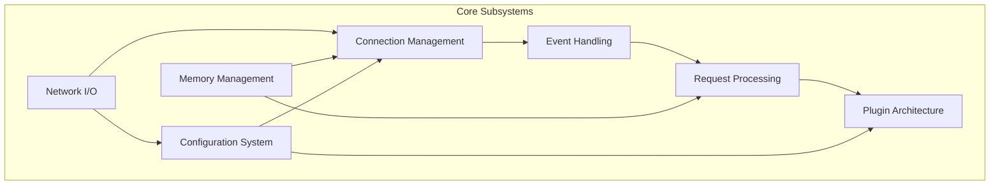
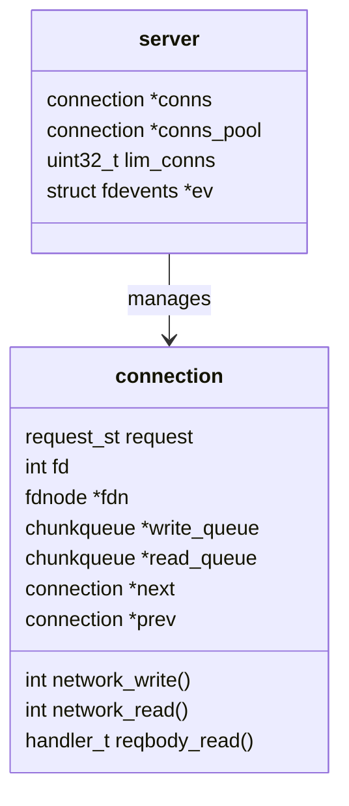
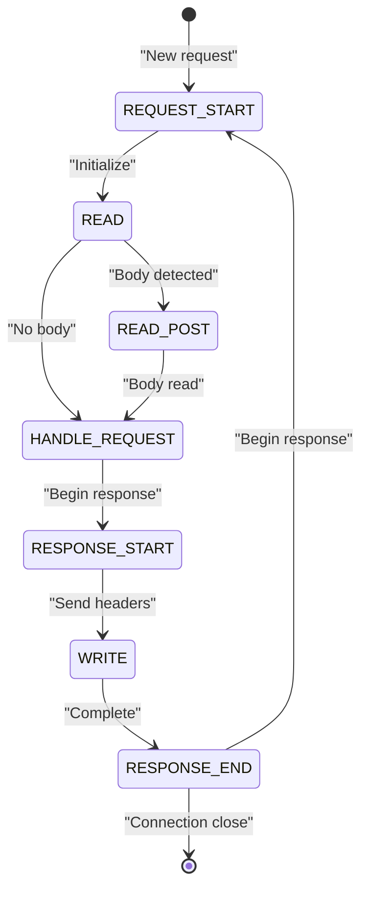
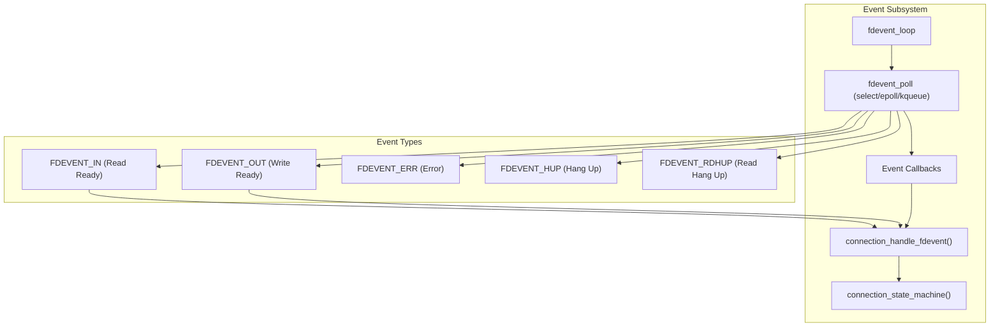
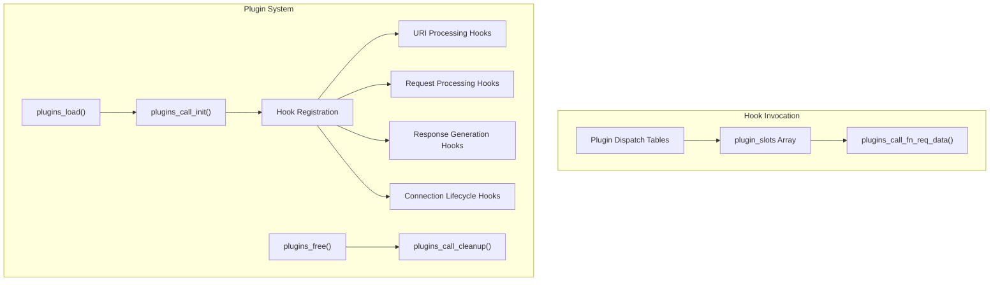
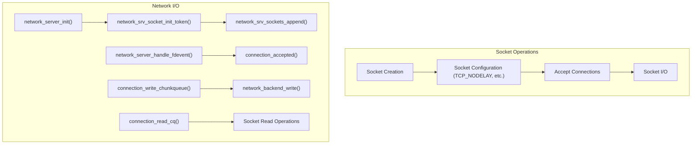
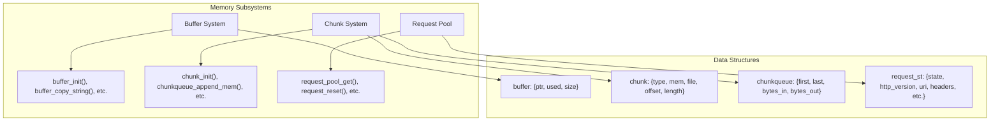
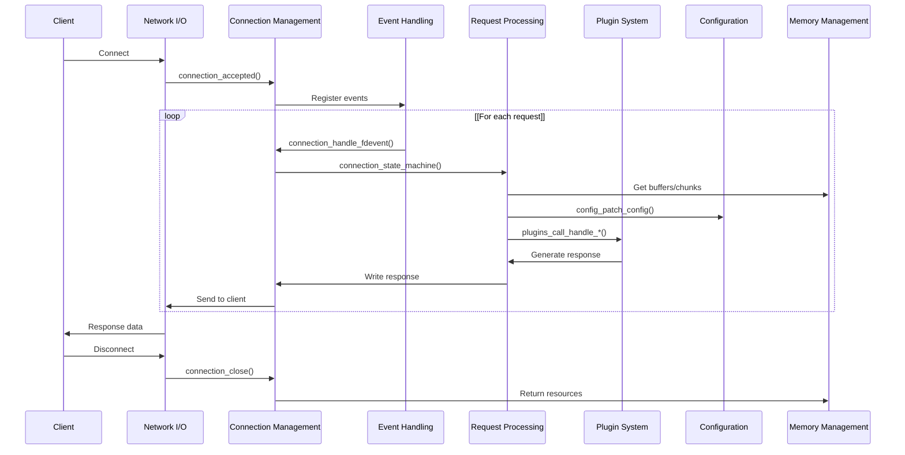

# Core Subsystems

> **Relevant source files**
> * [NEWS](https://github.com/lighttpd/lighttpd1.4/blob/3d550097/NEWS)
> * [src/base.h](https://github.com/lighttpd/lighttpd1.4/blob/3d550097/src/base.h)
> * [src/configfile.c](https://github.com/lighttpd/lighttpd1.4/blob/3d550097/src/configfile.c)
> * [src/connections.c](https://github.com/lighttpd/lighttpd1.4/blob/3d550097/src/connections.c)
> * [src/network.c](https://github.com/lighttpd/lighttpd1.4/blob/3d550097/src/network.c)
> * [src/plugin.c](https://github.com/lighttpd/lighttpd1.4/blob/3d550097/src/plugin.c)
> * [src/plugin.h](https://github.com/lighttpd/lighttpd1.4/blob/3d550097/src/plugin.h)
> * [src/server.c](https://github.com/lighttpd/lighttpd1.4/blob/3d550097/src/server.c)

This page describes the foundational subsystems that power the lighttpd web server. These core components work together to provide a lightweight, high-performance HTTP server with an event-driven architecture. For information about individual modules and extensions, see [Module System](/lighttpd/lighttpd1.4/4-module-system).

## Overview

Lighttpd's architecture is built around several key subsystems that handle different aspects of web server functionality:

These subsystems work together to enable lighttpd's efficient handling of thousands of concurrent connections with minimal resource usage.

Sources: [src/server.c L494-L544](https://github.com/lighttpd/lighttpd1.4/blob/3d550097/src/server.c#L494-L544)

 [src/base.h L30-L77](https://github.com/lighttpd/lighttpd1.4/blob/3d550097/src/base.h#L30-L77)

 [src/base.h L154-L206](https://github.com/lighttpd/lighttpd1.4/blob/3d550097/src/base.h#L154-L206)

## Connection Management

The connection management subsystem handles the lifecycle of client connections from acceptance to closure.

The `connection` structure is the central data structure for client connections. Each connection contains:

* File descriptor (`fd`) for the socket
* Buffers for reading and writing data (`read_queue`, `write_queue`)
* Request state (`request`)
* Function pointers for I/O operations (`network_read`, `network_write`)

Key functions:

* `connection_accepted()`: Sets up a new client connection
* `connection_state_machine()`: Drives connection processing
* `connection_state_machine_loop()`: Handles state transitions
* `connection_close()`: Cleans up and releases connections

For efficiency, lighttpd uses a connection pool to reuse connection structures:

* `connections_get_new_connection()`: Gets a connection from the pool
* `connection_del()`: Returns a connection to the pool
* `connections_pool_clear()`: Frees all pooled connections

Sources: [src/connections.c L37-L103](https://github.com/lighttpd/lighttpd1.4/blob/3d550097/src/connections.c#L37-L103)

 [src/connections.c L372-L406](https://github.com/lighttpd/lighttpd1.4/blob/3d550097/src/connections.c#L372-L406)

 [src/connections.c L589-L628](https://github.com/lighttpd/lighttpd1.4/blob/3d550097/src/connections.c#L589-L628)

## Request Processing

The request processing subsystem manages HTTP request parsing, routing, and response generation.

The request processing flow:

1. Initialize a new request (`CON_STATE_REQUEST_START`)
2. Read and parse headers (`CON_STATE_READ`)
3. Read request body if present (`CON_STATE_READ_POST`)
4. Process the request through plugins (`CON_STATE_HANDLE_REQUEST`)
5. Generate response headers (`CON_STATE_RESPONSE_START`)
6. Send response body (`CON_STATE_WRITE`)
7. Finalize the request (`CON_STATE_RESPONSE_END`)
8. Either close the connection or prepare for another request

Key functions:

* `connection_handle_request_start_state()`: Initializes request processing
* `h1_recv_headers()`: Parses HTTP headers
* `http_response_handler()`: Routes request to appropriate handler
* `connection_handle_write_state()`: Manages response transmission
* `connection_handle_response_end_state()`: Finalizes requests

Sources: [src/connections.c L162-L217](https://github.com/lighttpd/lighttpd1.4/blob/3d550097/src/connections.c#L162-L217)

 [src/connections.c L631-L704](https://github.com/lighttpd/lighttpd1.4/blob/3d550097/src/connections.c#L631-L704)

 [src/connections.c L315-L369](https://github.com/lighttpd/lighttpd1.4/blob/3d550097/src/connections.c#L315-L369)

## Event Handling

The event handling subsystem provides an event-driven architecture that efficiently manages I/O operations.

The event system:

* Uses various backend implementations (epoll, kqueue, poll) depending on platform
* Manages interest in different types of events (read, write, error)
* Associates file descriptors with callback functions
* Efficiently handles thousands of concurrent connections

Key functions:

* `fdevent_register()`: Registers file descriptors with the event system
* `fdevent_fdnode_event_set()`: Sets interest in specific events
* `connection_handle_fdevent()`: Processes events for connections
* `connection_set_fdevent_interest()`: Updates event interests based on connection state

Sources: [src/connections.c L473-L494](https://github.com/lighttpd/lighttpd1.4/blob/3d550097/src/connections.c#L473-L494)

 [src/connections.c L764-L823](https://github.com/lighttpd/lighttpd1.4/blob/3d550097/src/connections.c#L764-L823)

## Plugin Architecture

The plugin architecture provides an extensible framework for adding functionality to the server.

The plugin system features:

* Dynamic loading of modules (with `dlopen()`) or static compilation
* Extensive hook points throughout the request lifecycle
* Plugin-specific configuration data
* Efficient hook dispatch through function tables

Key structures:

* `plugin`: Defines module operations with function pointers for various hooks
* `plugin_data_base`: Base structure for plugin-specific data

Key functions:

* `plugins_load()`: Loads and initializes modules
* `plugins_call_init()`: Sets up plugin hook dispatch tables
* `plugins_call_handle_*()`: Invokes plugin hooks at specific points

Sources: [src/plugin.c L31-L53](https://github.com/lighttpd/lighttpd1.4/blob/3d550097/src/plugin.c#L31-L53)

 [src/plugin.c L446-L579](https://github.com/lighttpd/lighttpd1.4/blob/3d550097/src/plugin.c#L446-L579)

 [src/plugin.h L8-L75](https://github.com/lighttpd/lighttpd1.4/blob/3d550097/src/plugin.h#L8-L75)

## Network I/O

The network I/O subsystem handles socket operations and data transfer.

The network system includes:

* Socket creation and configuration
* Support for IPv4, IPv6, and Unix domain sockets
* Efficient data transfer mechanisms
* Throttling and rate limiting
* SSL/TLS integration
* Abstract network backend implementation

Key functions:

* `network_server_init()`: Sets up server sockets
* `network_server_handle_fdevent()`: Handles connection acceptance
* `connection_write_chunkqueue()`: Writes data to clients
* `connection_read_cq()`: Reads data from clients
* `network_write_throttle()`: Implements rate limiting for outgoing data

Sources: [src/network.c L57-L133](https://github.com/lighttpd/lighttpd1.4/blob/3d550097/src/network.c#L57-L133)

 [src/network.c L388-L580](https://github.com/lighttpd/lighttpd1.4/blob/3d550097/src/network.c#L388-L580)

 [src/connections.c L248-L313](https://github.com/lighttpd/lighttpd1.4/blob/3d550097/src/connections.c#L248-L313)

 [src/connections.c L544-L580](https://github.com/lighttpd/lighttpd1.4/blob/3d550097/src/connections.c#L544-L580)

## Configuration System

The configuration system parses server configuration files and applies settings to requests.

```mermaid
flowchart TD

server_config["server_config"]
request_config["request_config"]
config_plugin_value_t["config_plugin_value_t"]
config_patch_config["config_patch_config()"]
config_check_cond["config_check_cond()"]
config_merge_config["config_merge_config()"]
config_merge_config_cpv["config_merge_config_cpv()"]
config_parse_file["config_parse_file()"]
config_setup_connection["config_setup_connection()"]
config_check["config_check()"]
config_plugins_setup["config_plugins_setup()"]

subgraph subGraph2 ["Configuration Data Structures"]
    server_config
    request_config
    config_plugin_value_t
    server_config --> request_config
    config_plugin_value_t --> request_config
end

subgraph subGraph1 ["Configuration Application"]
    config_patch_config
    config_check_cond
    config_merge_config
    config_merge_config_cpv
    config_patch_config --> config_check_cond
    config_check_cond --> config_merge_config
    config_merge_config --> config_merge_config_cpv
end

subgraph subGraph0 ["Configuration Processing"]
    config_parse_file
    config_setup_connection
    config_check
    config_plugins_setup
    config_parse_file --> config_setup_connection
    config_setup_connection --> config_check
    config_check --> config_plugins_setup
end
```

The configuration system features:

* Hierarchical configuration structure
* Conditional configurations based on request attributes
* Plugin-specific configuration
* Configuration inheritance and overrides

Key structures:

* `server_config`: Global server configuration
* `request_config`: Per-request configuration
* `config_plugin_value_t`: Configuration values for plugins

Key functions:

* `config_patch_config()`: Applies configuration to a request
* `config_merge_config()`: Merges configuration values
* `config_check_cond()`: Evaluates configuration conditions

Sources: [src/configfile.c L207-L223](https://github.com/lighttpd/lighttpd1.4/blob/3d550097/src/configfile.c#L207-L223)

 [src/configfile.c L91-L205](https://github.com/lighttpd/lighttpd1.4/blob/3d550097/src/configfile.c#L91-L205)

## Memory Management

The memory management subsystem provides efficient memory operations for strings, data chunks, and request structures.

Key memory management components:

1. **Buffer System** * Dynamically resizable string buffers * Optimized string operations * Memory reuse for efficiency
2. **Chunk System** * Represents data as memory blocks or file references * `chunkqueue` for efficient I/O operations * Minimizes memory copying during file transfers
3. **Request Pool** * Reuses request structures to reduce allocations * Resets request state between uses * Improves memory locality and cache efficiency

Key functions:

* `buffer_init()`, `buffer_free()`: Manage string buffers
* `chunkqueue_append_mem()`, `chunkqueue_append_file()`: Add data to chunk queues
* `request_reset()`, `request_config_reset()`: Reset request state for reuse

Sources: [src/connections.c L393-L406](https://github.com/lighttpd/lighttpd1.4/blob/3d550097/src/connections.c#L393-L406)

 [src/connections.c L407-L424](https://github.com/lighttpd/lighttpd1.4/blob/3d550097/src/connections.c#L407-L424)

 [src/connections.c L427-L433](https://github.com/lighttpd/lighttpd1.4/blob/3d550097/src/connections.c#L427-L433)

## Subsystem Integration

The integration between subsystems creates a complete request processing pipeline:

This integrated pipeline demonstrates how the subsystems work together to:

1. Accept client connections (Network I/O)
2. Manage connection states (Connection Management)
3. Handle I/O events efficiently (Event Handling)
4. Process HTTP requests (Request Processing)
5. Apply plugin hooks (Plugin Architecture)
6. Configure behavior (Configuration System)
7. Manage memory resources (Memory Management)

The coordination between these subsystems enables lighttpd to efficiently handle high-concurrency workloads while maintaining a small memory footprint.

Sources: [src/server.c L494-L544](https://github.com/lighttpd/lighttpd1.4/blob/3d550097/src/server.c#L494-L544)

 [src/connections.c L589-L628](https://github.com/lighttpd/lighttpd1.4/blob/3d550097/src/connections.c#L589-L628)

 [src/connections.c L826-L835](https://github.com/lighttpd/lighttpd1.4/blob/3d550097/src/connections.c#L826-L835)

## Summary

Lighttpd's core subsystems form a tightly integrated foundation that enables:

| Subsystem | Main Responsibility | Key Components |
| --- | --- | --- |
| Connection Management | Client connection lifecycle | `connection` structure, state machine |
| Request Processing | HTTP protocol handling | Request states, HTTP parsing |
| Event Handling | I/O multiplexing | Event loop, callbacks |
| Plugin Architecture | Extensibility | Hook system, plugin interface |
| Network I/O | Socket operations | Socket handling, data transfer |
| Configuration | Server behavior | Config parsing, conditions |
| Memory Management | Efficient resource use | Buffer, chunk, request pools |

These core subsystems provide the foundational capabilities upon which the entire web server is built, enabling lighttpd's reputation for efficiency, performance, and scalability.