# Dynamic Content and Backend Communication

> **Relevant source files**
> * [src/fdevent.c](https://github.com/lighttpd/lighttpd1.4/blob/3d550097/src/fdevent.c)
> * [src/fdevent.h](https://github.com/lighttpd/lighttpd1.4/blob/3d550097/src/fdevent.h)
> * [src/gw_backend.c](https://github.com/lighttpd/lighttpd1.4/blob/3d550097/src/gw_backend.c)
> * [src/gw_backend.h](https://github.com/lighttpd/lighttpd1.4/blob/3d550097/src/gw_backend.h)
> * [src/mod_cgi.c](https://github.com/lighttpd/lighttpd1.4/blob/3d550097/src/mod_cgi.c)
> * [src/mod_fastcgi.c](https://github.com/lighttpd/lighttpd1.4/blob/3d550097/src/mod_fastcgi.c)
> * [src/mod_proxy.c](https://github.com/lighttpd/lighttpd1.4/blob/3d550097/src/mod_proxy.c)
> * [src/mod_scgi.c](https://github.com/lighttpd/lighttpd1.4/blob/3d550097/src/mod_scgi.c)

This document explains how lighttpd handles dynamic content generation and communicates with backend application servers. It covers the gateway architecture, supported protocols (FastCGI, CGI, SCGI, and HTTP proxy), and the request/response flow between lighttpd and backend application servers.

For information about static content serving, see [Static Content Serving](/lighttpd/lighttpd1.4/4.1-static-content-serving).

## 1. Gateway Architecture Overview

Lighttpd uses a unified gateway architecture for backend communication across different protocols. This architecture provides common functionality for process management, connection handling, and load balancing while allowing protocol-specific implementations.

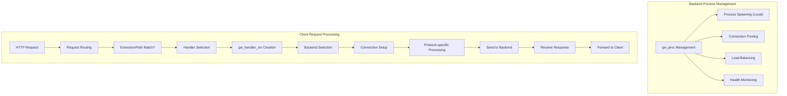

Sources: [src/gw_backend.h L242-L343](https://github.com/lighttpd/lighttpd1.4/blob/3d550097/src/gw_backend.h#L242-L343)

 [src/gw_backend.c L46-L131](https://github.com/lighttpd/lighttpd1.4/blob/3d550097/src/gw_backend.c#L46-L131)

### 1.1 Common Gateway Components

The gateway system is built around several key data structures that work together to manage backend connections:

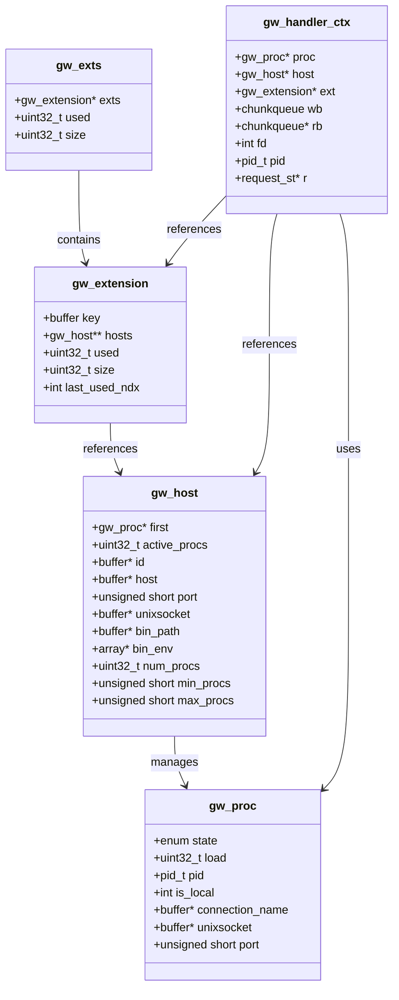

Sources: [src/gw_backend.h L12-L343](https://github.com/lighttpd/lighttpd1.4/blob/3d550097/src/gw_backend.h#L12-L343)

Each module (FastCGI, CGI, SCGI, Proxy) builds on this shared framework by:

1. Implementing protocol-specific environment creation
2. Defining communication formats
3. Providing custom response parsing

## 2. Supported Backend Protocols

Lighttpd supports multiple protocols for communicating with backend application servers:

| Protocol | Module | Description | Key Features |
| --- | --- | --- | --- |
| FastCGI | mod_fastcgi | Binary protocol for persistent app servers | Multiplexing, connection pooling, local spawning |
| CGI | mod_cgi | Traditional CGI for executing scripts | Process per request, simple integration |
| SCGI | mod_scgi | Simple CGI - streamlined FastCGI alternative | Simpler than FastCGI, persistent connections |
| HTTP Proxy | mod_proxy | Forward requests to HTTP servers | Header manipulation, URL rewriting, SSL |

### 2.1 FastCGI

FastCGI is a binary protocol that allows persistent application servers to handle multiple requests over a single connection. It's significantly more efficient than traditional CGI.

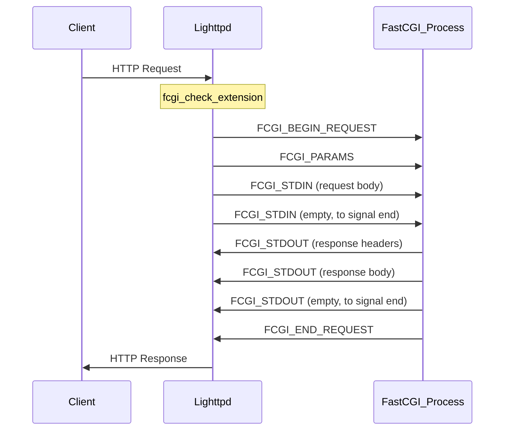

Key implementation details:

* FastCGI protocol constants defined in [src/mod_fastcgi.c L19-L29](https://github.com/lighttpd/lighttpd1.4/blob/3d550097/src/mod_fastcgi.c#L19-L29)
* Environment setup in [src/mod_fastcgi.c L227-L296](https://github.com/lighttpd/lighttpd1.4/blob/3d550097/src/mod_fastcgi.c#L227-L296)
* Response parsing in [src/mod_fastcgi.c L363-L468](https://github.com/lighttpd/lighttpd1.4/blob/3d550097/src/mod_fastcgi.c#L363-L468)

Sources: [src/mod_fastcgi.c L1-L558](https://github.com/lighttpd/lighttpd1.4/blob/3d550097/src/mod_fastcgi.c#L1-L558)

### 2.2 CGI

The Common Gateway Interface (CGI) is the traditional method for executing server-side scripts. It spawns a new process for each request.

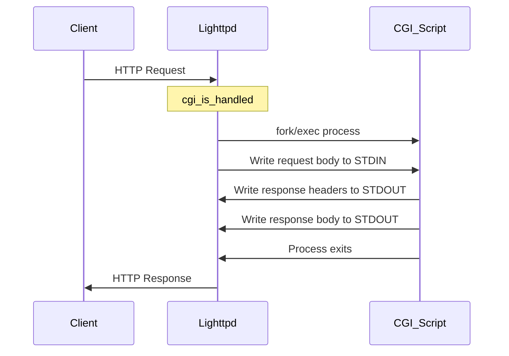

Key implementation details:

* Process creation in [src/mod_cgi.c L808-L1037](https://github.com/lighttpd/lighttpd1.4/blob/3d550097/src/mod_cgi.c#L808-L1037)
* Environment setup in [src/mod_cgi.c L664-L680](https://github.com/lighttpd/lighttpd1.4/blob/3d550097/src/mod_cgi.c#L664-L680)
* Response parsing in [src/mod_cgi.c L584-L602](https://github.com/lighttpd/lighttpd1.4/blob/3d550097/src/mod_cgi.c#L584-L602)

Sources: [src/mod_cgi.c L1-L1072](https://github.com/lighttpd/lighttpd1.4/blob/3d550097/src/mod_cgi.c#L1-L1072)

### 2.3 SCGI

The Simple Common Gateway Interface (SCGI) is a simpler alternative to FastCGI that's easier to implement in application servers.

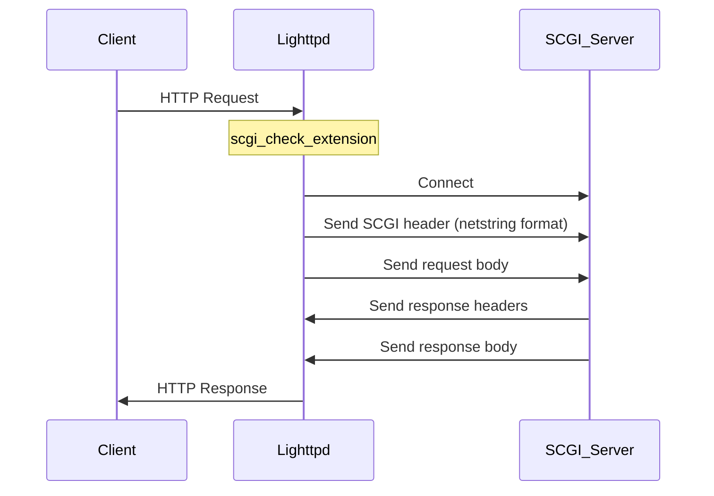

Key implementation details:

* SCGI environment creation in [src/mod_scgi.c L144-L248](https://github.com/lighttpd/lighttpd1.4/blob/3d550097/src/mod_scgi.c#L144-L248)
* Protocol selection (SCGI or UWSGI) in [src/mod_scgi.c L112-L123](https://github.com/lighttpd/lighttpd1.4/blob/3d550097/src/mod_scgi.c#L112-L123)

Sources: [src/mod_scgi.c L1-L303](https://github.com/lighttpd/lighttpd1.4/blob/3d550097/src/mod_scgi.c#L1-L303)

### 2.4 HTTP Proxy

The HTTP proxy module forwards requests to other HTTP servers and returns their responses to the client.

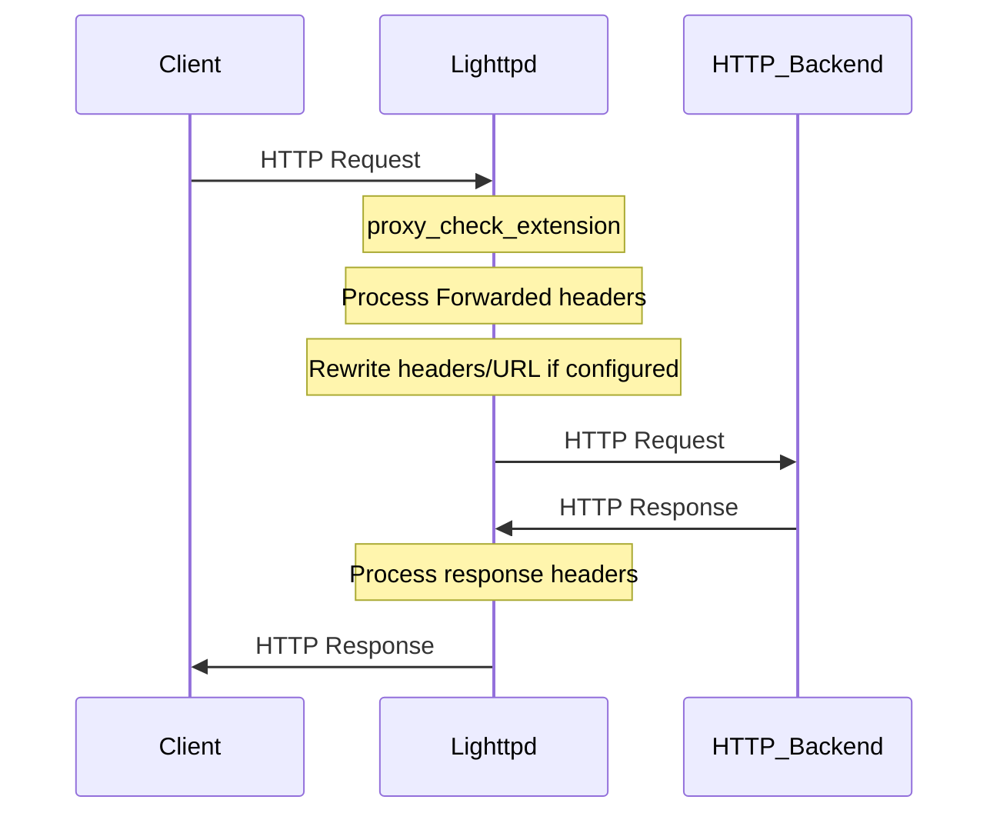

Key implementation details:

* Header forwarding in [src/mod_proxy.c L612-L709](https://github.com/lighttpd/lighttpd1.4/blob/3d550097/src/mod_proxy.c#L612-L709)
* URL path remapping in [src/mod_proxy.c L443-L481](https://github.com/lighttpd/lighttpd1.4/blob/3d550097/src/mod_proxy.c#L443-L481)
* Host header manipulation in [src/mod_proxy.c L430-L439](https://github.com/lighttpd/lighttpd1.4/blob/3d550097/src/mod_proxy.c#L430-L439)

Sources: [src/mod_proxy.c L1-L2824](https://github.com/lighttpd/lighttpd1.4/blob/3d550097/src/mod_proxy.c#L1-L2824)

## 3. Request Processing Flow

The following diagram illustrates how a request flows through lighttpd and to a backend application server:

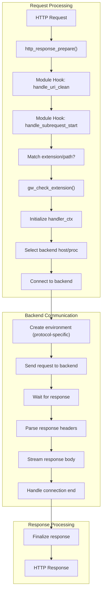

Sources: [src/mod_fastcgi.c L496-L526](https://github.com/lighttpd/lighttpd1.4/blob/3d550097/src/mod_fastcgi.c#L496-L526)

 [src/mod_cgi.c L1039-L1072](https://github.com/lighttpd/lighttpd1.4/blob/3d550097/src/mod_cgi.c#L1039-L1072)

 [src/gw_backend.c L267-L346](https://github.com/lighttpd/lighttpd1.4/blob/3d550097/src/gw_backend.c#L267-L346)

### 3.1 Extension Matching and Handler Selection

All gateway modules use a similar approach to determine if they should handle a request:

1. Check if the request URI or physical path matches configured extensions
2. If matched, create a handler context
3. Set protocol-specific handlers
4. Register for the appropriate request hooks

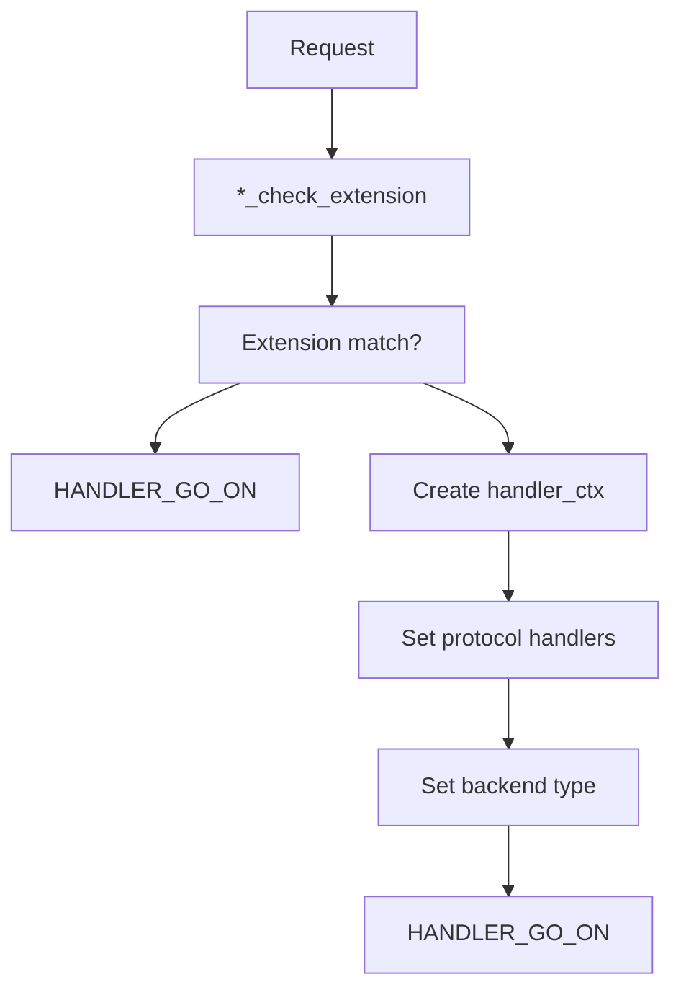

Sources: [src/mod_fastcgi.c L496-L526](https://github.com/lighttpd/lighttpd1.4/blob/3d550097/src/mod_fastcgi.c#L496-L526)

 [src/mod_cgi.c L1039-L1072](https://github.com/lighttpd/lighttpd1.4/blob/3d550097/src/mod_cgi.c#L1039-L1072)

 [src/mod_scgi.c L251-L271](https://github.com/lighttpd/lighttpd1.4/blob/3d550097/src/mod_scgi.c#L251-L271)

 [src/mod_proxy.c L1788-L1830](https://github.com/lighttpd/lighttpd1.4/blob/3d550097/src/mod_proxy.c#L1788-L1830)

### 3.2 Backend Process Management

For local backends (FastCGI, CGI, SCGI), lighttpd can spawn and manage the backend processes:

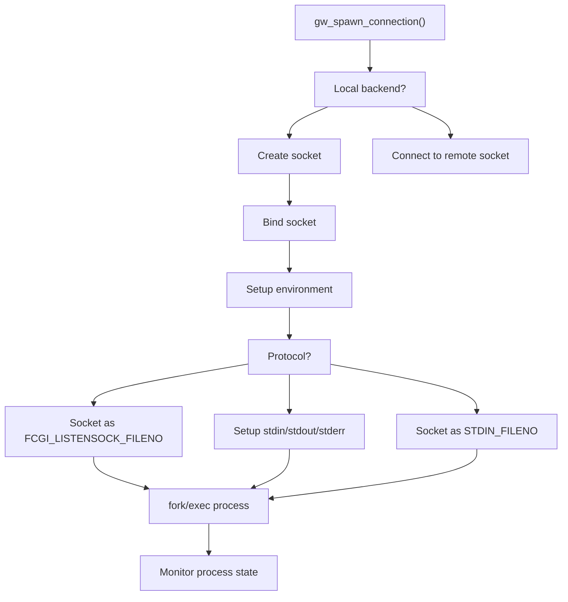

Sources: [src/gw_backend.c L504-L710](https://github.com/lighttpd/lighttpd1.4/blob/3d550097/src/gw_backend.c#L504-L710)

 [src/mod_cgi.c L808-L1037](https://github.com/lighttpd/lighttpd1.4/blob/3d550097/src/mod_cgi.c#L808-L1037)

### 3.3 Load Balancing

The gateway architecture includes load balancing capabilities across multiple backend processes:

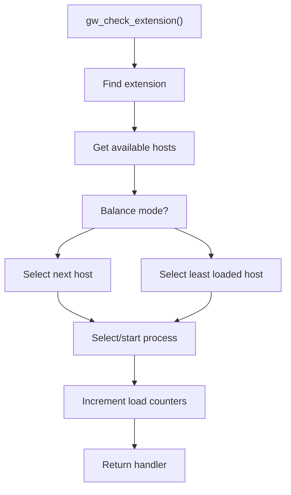

Load balancing modes:

* Round Robin: Distribute requests evenly across backends
* Least Connection: Send to the backend with the fewest active connections

Sources: [src/gw_backend.c L267-L346](https://github.com/lighttpd/lighttpd1.4/blob/3d550097/src/gw_backend.c#L267-L346)

 [src/gw_backend.c L97-L108](https://github.com/lighttpd/lighttpd1.4/blob/3d550097/src/gw_backend.c#L97-L108)

## 4. Protocol-Specific Details

### 4.1 FastCGI Protocol

FastCGI uses a binary protocol with different record types:

| Record Type | Value | Purpose |
| --- | --- | --- |
| FCGI_BEGIN_REQUEST | 1 | Start a new request |
| FCGI_PARAMS | 4 | Send environment variables |
| FCGI_STDIN | 5 | Send request body |
| FCGI_STDOUT | 6 | Receive response data |
| FCGI_STDERR | 7 | Receive error messages |
| FCGI_END_REQUEST | 3 | End the request |

Each record has a header with:

* Version (1 byte)
* Type (1 byte)
* Request ID (2 bytes)
* Content Length (2 bytes)
* Padding Length (1 byte)
* Reserved (1 byte)

Sources: [src/mod_fastcgi.c L170-L181](https://github.com/lighttpd/lighttpd1.4/blob/3d550097/src/mod_fastcgi.c#L170-L181)

 [src/mod_fastcgi.c L305-L338](https://github.com/lighttpd/lighttpd1.4/blob/3d550097/src/mod_fastcgi.c#L305-L338)

### 4.2 SCGI Protocol

SCGI uses a simpler protocol than FastCGI:

1. A length prefix, followed by a colon (netstring format)
2. Key-value pairs as null-terminated strings
3. A comma terminator
4. Request body

For example: `"72:CONTENT_LENGTH\0" + "27\0" + "SCGI\0" + "1\0" + "REQUEST_METHOD\0" + "GET\0" + ","`

Sources: [src/mod_scgi.c L144-L177](https://github.com/lighttpd/lighttpd1.4/blob/3d550097/src/mod_scgi.c#L144-L177)

### 4.3 HTTP Proxy Header Handling

The proxy module has several options for handling HTTP headers:

* Forwarded headers (RFC 7239) [src/mod_proxy.c L612-L709](https://github.com/lighttpd/lighttpd1.4/blob/3d550097/src/mod_proxy.c#L612-L709)
* X-Forwarded-* compatibility [src/mod_proxy.c L624-L655](https://github.com/lighttpd/lighttpd1.4/blob/3d550097/src/mod_proxy.c#L624-L655)
* Host header rewriting [src/mod_proxy.c L430-L439](https://github.com/lighttpd/lighttpd1.4/blob/3d550097/src/mod_proxy.c#L430-L439)
* URL path remapping [src/mod_proxy.c L443-L481](https://github.com/lighttpd/lighttpd1.4/blob/3d550097/src/mod_proxy.c#L443-L481)

## 5. Configuration Examples

Each protocol has its own configuration directives. Here are examples for each:

### 5.1 FastCGI Configuration

```javascript
fastcgi.server = (
  ".php" => (
    "localhost" => (
      "socket" => "/tmp/php-fastcgi.sock",
      "bin-path" => "/usr/bin/php-cgi",
      "min-procs" => 2,
      "max-procs" => 4,
      "max-load-per-proc" => 50,
      "idle-timeout" => 60
    )
  )
)
```

### 5.2 CGI Configuration

```javascript
cgi.assign = (
  ".cgi" => "",
  ".pl" => "/usr/bin/perl",
  ".py" => "/usr/bin/python"
)
```

### 5.3 SCGI Configuration

```javascript
scgi.server = (
  ".php" => (
    "localhost" => (
      "host" => "127.0.0.1",
      "port" => 4000,
      "check-local" => "disable"
    )
  )
)
```

### 5.4 HTTP Proxy Configuration

```javascript
proxy.server = (
  "/api/" => (
    "backend" => (
      "host" => "127.0.0.1",
      "port" => 8080
    )
  )
)
```

## 6. Advanced Features

### 6.1 Protocol Upgrades

Lighttpd supports WebSocket and other protocol upgrades through specific gateway configurations:

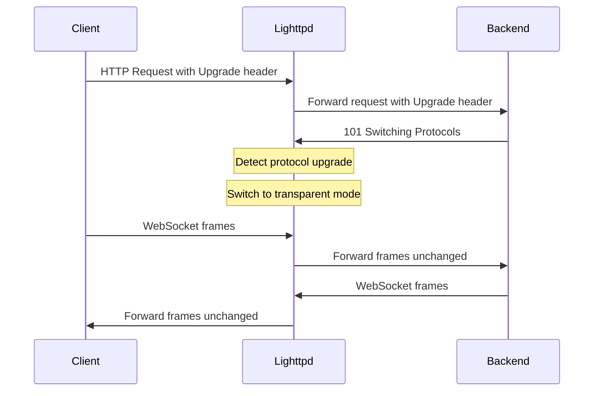

Upgrade support is implemented in:

* FastCGI: [src/mod_fastcgi.c L470-L494](https://github.com/lighttpd/lighttpd1.4/blob/3d550097/src/mod_fastcgi.c#L470-L494)
* CGI: [src/mod_cgi.c L555-L570](https://github.com/lighttpd/lighttpd1.4/blob/3d550097/src/mod_cgi.c#L555-L570)
* HTTP Proxy: [src/mod_proxy.c L222-L241](https://github.com/lighttpd/lighttpd1.4/blob/3d550097/src/mod_proxy.c#L222-L241)

Sources: [src/gw_backend.h L211-L212](https://github.com/lighttpd/lighttpd1.4/blob/3d550097/src/gw_backend.h#L211-L212)

### 6.2 Error Handling and Recovery

The gateway architecture includes error handling to manage backend failures:

1. Connection failures trigger backend marking as overloaded
2. Overloaded backends get a timeout before retry
3. Dead processes are detected and can be restarted
4. Health monitoring tracks backend status

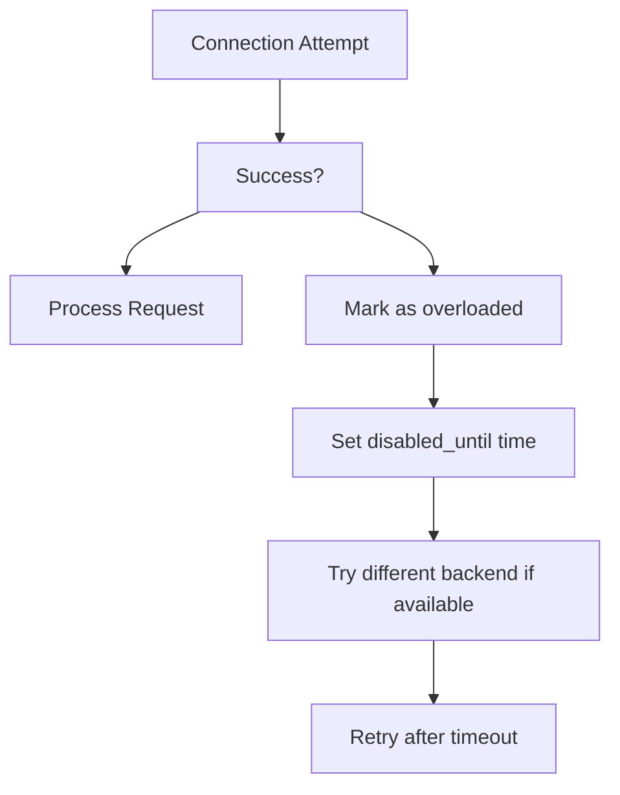

Sources: [src/gw_backend.c L279-L346](https://github.com/lighttpd/lighttpd1.4/blob/3d550097/src/gw_backend.c#L279-L346)

 [src/gw_backend.c L358-L370](https://github.com/lighttpd/lighttpd1.4/blob/3d550097/src/gw_backend.c#L358-L370)

## 7. Internal Communication Mechanisms

Lighttpd uses file descriptors and event-based I/O to communicate with backend processes:

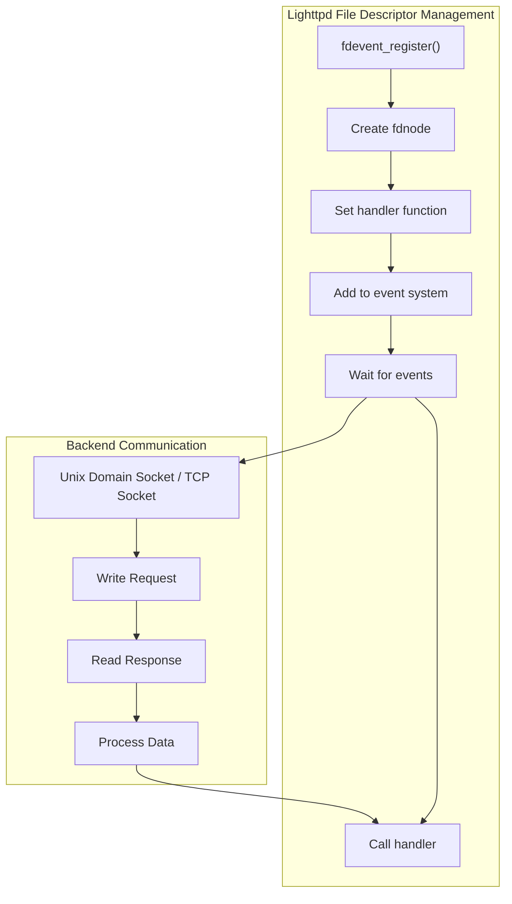

Key file descriptor functions:

* Socket creation: [src/fdevent.c L93-L132](https://github.com/lighttpd/lighttpd1.4/blob/3d550097/src/fdevent.c#L93-L132)
* Event registration: [src/fdevent.h L92-L96](https://github.com/lighttpd/lighttpd1.4/blob/3d550097/src/fdevent.h#L92-L96)
* Pipe creation for CGI: [src/fdevent.c L252-L272](https://github.com/lighttpd/lighttpd1.4/blob/3d550097/src/fdevent.c#L252-L272)

Sources: [src/fdevent.c L1-L796](https://github.com/lighttpd/lighttpd1.4/blob/3d550097/src/fdevent.c#L1-L796)

 [src/fdevent.h L1-L179](https://github.com/lighttpd/lighttpd1.4/blob/3d550097/src/fdevent.h#L1-L179)

### 7.1 Process Spawning (For Local Backends)

For local backends like FastCGI and CGI, lighttpd spawns processes using:

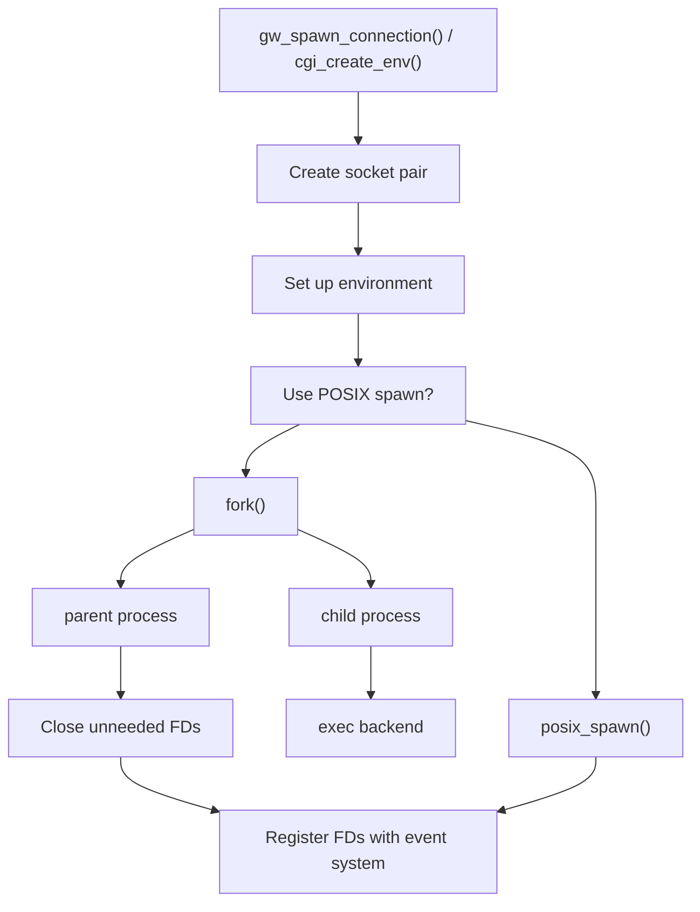

Sources: [src/fdevent.c L475-L678](https://github.com/lighttpd/lighttpd1.4/blob/3d550097/src/fdevent.c#L475-L678)

 [src/gw_backend.c L504-L710](https://github.com/lighttpd/lighttpd1.4/blob/3d550097/src/gw_backend.c#L504-L710)

 [src/mod_cgi.c L808-L1037](https://github.com/lighttpd/lighttpd1.4/blob/3d550097/src/mod_cgi.c#L808-L1037)

## Summary

Lighttpd's dynamic content handling framework provides a flexible and efficient way to connect with various backend application servers. The shared gateway architecture handles the common functionality of process management, connection handling, and load balancing, while protocol-specific modules implement the details of each communication protocol.

This design allows for consistent behavior across different backend types while enabling optimizations specific to each protocol. The event-driven I/O system ensures efficient resource usage, and the process management capabilities simplify deployment of application servers.