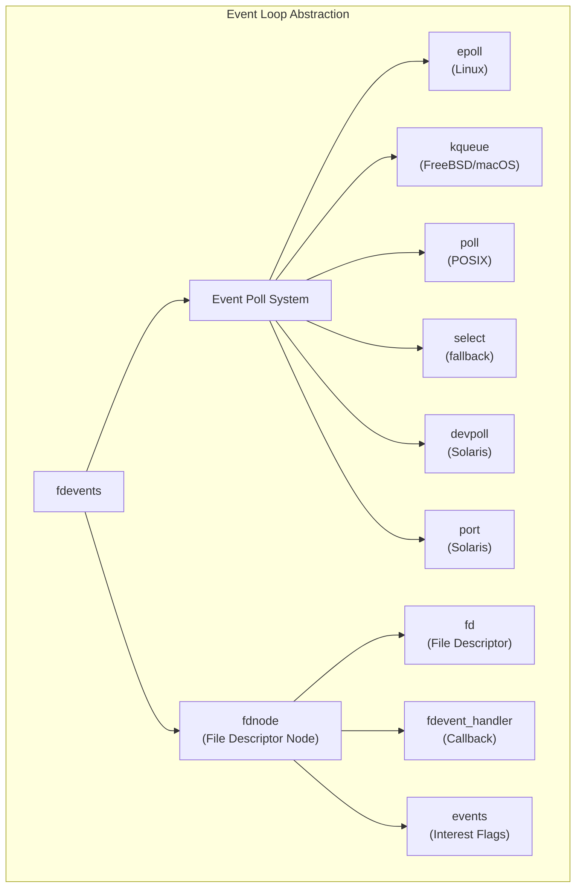
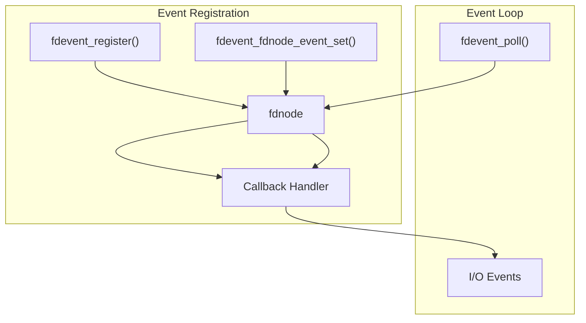
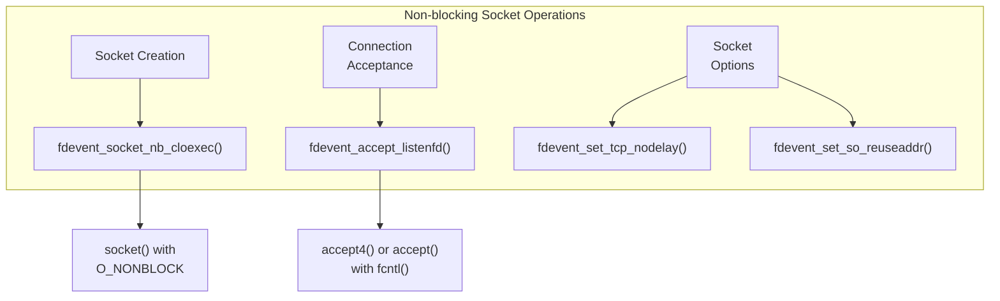
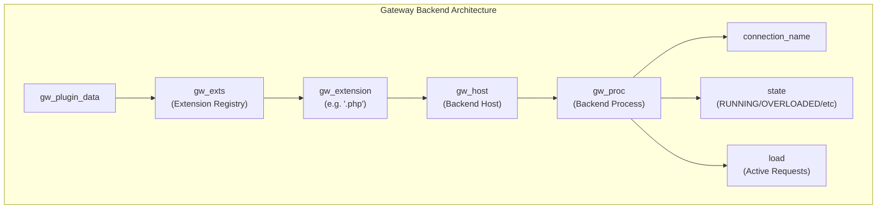
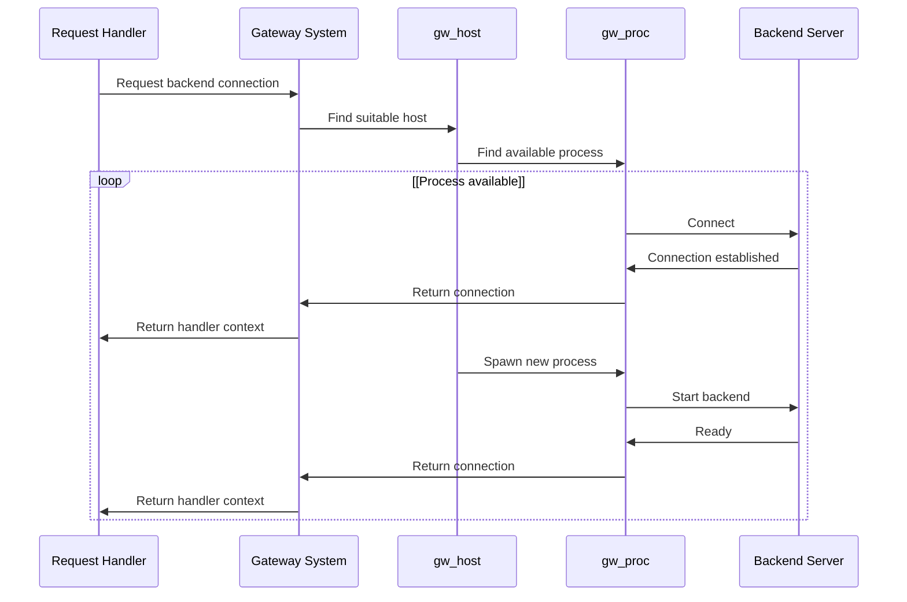
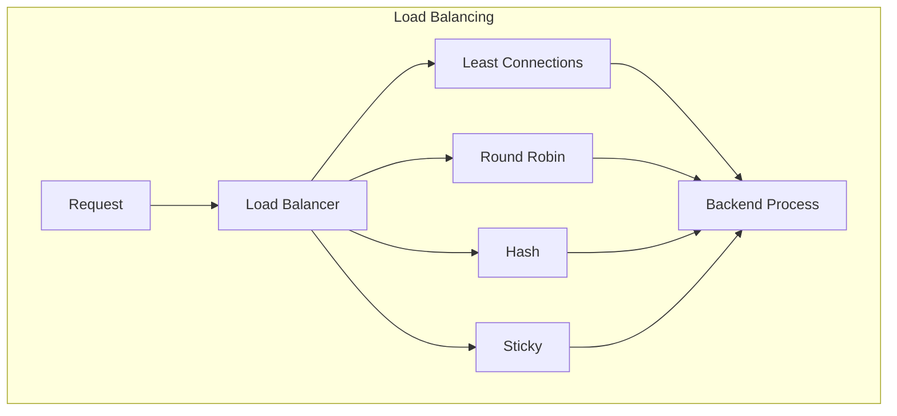
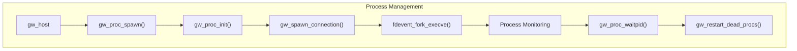
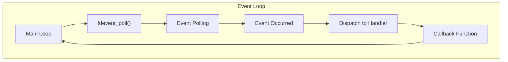
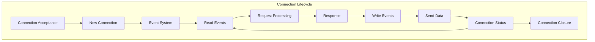

# Event Handling and Networking

> **Relevant source files**
> * [src/fdevent.c](https://github.com/lighttpd/lighttpd1.4/blob/3d550097/src/fdevent.c)
> * [src/fdevent.h](https://github.com/lighttpd/lighttpd1.4/blob/3d550097/src/fdevent.h)
> * [src/fdevent_impl.h](https://github.com/lighttpd/lighttpd1.4/blob/3d550097/src/fdevent_impl.h)
> * [src/gw_backend.c](https://github.com/lighttpd/lighttpd1.4/blob/3d550097/src/gw_backend.c)
> * [src/gw_backend.h](https://github.com/lighttpd/lighttpd1.4/blob/3d550097/src/gw_backend.h)

## Overview

This page documents the event handling and networking subsystems of lighttpd, which form the core of the server's non-blocking I/O architecture. These subsystems allow lighttpd to efficiently handle thousands of concurrent connections with minimal resource usage, making it particularly suitable for high-load environments.

For information about the memory management system that works closely with these subsystems, see [Memory Management](/lighttpd/lighttpd1.4/3.1-memory-management). For details on file system operations which interact with the networking layer, see [File System Operations](/lighttpd/lighttpd1.4/3.2-file-system-operations).

## Event Handling System

The event handling system in lighttpd provides an abstraction over various platform-specific event notification mechanisms (epoll, kqueue, poll, select, etc.), allowing the server to efficiently monitor and respond to I/O events on file descriptors.



Sources: [src/fdevent.h L1-L177](https://github.com/lighttpd/lighttpd1.4/blob/3d550097/src/fdevent.h#L1-L177)

 [src/fdevent_impl.h L1-L139](https://github.com/lighttpd/lighttpd1.4/blob/3d550097/src/fdevent_impl.h#L1-L139)

### Event System Initialization

The server initializes the event system during startup, selecting the most efficient event mechanism available on the platform. The initialization process allocates the necessary resources for event handling and sets up the event loop.

```mermaid
sequenceDiagram
  participant Server Startup
  participant Configuration
  participant fdevent_init()
  participant Event Backend

  Server Startup->>Configuration: Parse configuration
  Configuration->>fdevent_init(): Configure event system
  fdevent_init()->>fdevent_init(): Detect available backends
  fdevent_init()->>Event Backend: Select and initialize backend
  Event Backend->>fdevent_init(): Return initialized handler
  fdevent_init()->>Server Startup: Return fdevents structure
  Server Startup->>Server Startup: Enter event loop
```

Sources: [src/fdevent.h L80-L86](https://github.com/lighttpd/lighttpd1.4/blob/3d550097/src/fdevent.h#L80-L86)

 [src/fdevent.c L72-L95](https://github.com/lighttpd/lighttpd1.4/blob/3d550097/src/fdevent.c#L72-L95)

### Event Registration and Monitoring

The event system allows subsystems to register interest in specific events (read, write, error) on file descriptors. When these events occur, associated callbacks are executed.

1. **Event Interest Flags**: * `FDEVENT_IN`: Data available to read * `FDEVENT_OUT`: Ready for writing * `FDEVENT_ERR`: Error condition * `FDEVENT_HUP`: Connection closed * `FDEVENT_RDHUP`: Peer closed connection
2. **Registration Process**: * Register a file descriptor with `fdevent_register()` * Set event interests with `fdevent_fdnode_event_set()` * The system monitors the descriptor for specified events
3. **Event Handling**: * The server calls `fdevent_poll()` in its main loop * When events occur, registered callbacks are executed * Event handlers perform appropriate actions based on event type



Sources: [src/fdevent.h L92-L102](https://github.com/lighttpd/lighttpd1.4/blob/3d550097/src/fdevent.h#L92-L102)

 [src/fdevent.c L280-L321](https://github.com/lighttpd/lighttpd1.4/blob/3d550097/src/fdevent.c#L280-L321)

## Network I/O Abstraction

The networking subsystem provides platform-independent abstractions for socket operations, ensuring consistent behavior across different operating systems.

### Socket Management Functions

```sql
Function                         Purpose
------------------------------- --------------------------------------------------
fdevent_socket_cloexec()        Create socket with close-on-exec flag
fdevent_socket_nb_cloexec()     Create non-blocking socket with close-on-exec flag
fdevent_accept_listenfd()       Accept connection with proper flags
fdevent_connect_status()        Check connection status for non-blocking connects
fdevent_set_tcp_nodelay()       Configure TCP_NODELAY option
fdevent_is_tcp_half_closed()    Detect TCP half-closed connections
```

Sources: [src/fdevent.h L105-L115](https://github.com/lighttpd/lighttpd1.4/blob/3d550097/src/fdevent.h#L105-L115)

 [src/fdevent.h L160-L170](https://github.com/lighttpd/lighttpd1.4/blob/3d550097/src/fdevent.h#L160-L170)

### Non-blocking I/O Operations

The system uses non-blocking I/O to efficiently handle multiple connections without dedicated threads. Key functions for non-blocking operations include:

1. **Socket Creation**: * `fdevent_socket_nb_cloexec()` creates non-blocking sockets with close-on-exec flag
2. **Connection Acceptance**: * `fdevent_accept_listenfd()` accepts connections without blocking
3. **Socket Options**: * `fdevent_fcntl_set_nb()` sets non-blocking flag on existing sockets * `fdevent_set_tcp_nodelay()` improves latency for small packet transmission



Sources: [src/fdevent.c L107-L132](https://github.com/lighttpd/lighttpd1.4/blob/3d550097/src/fdevent.c#L107-L132)

 [src/fdevent.c L320-L370](https://github.com/lighttpd/lighttpd1.4/blob/3d550097/src/fdevent.c#L320-L370)

 [src/fdevent.c L842-L851](https://github.com/lighttpd/lighttpd1.4/blob/3d550097/src/fdevent.c#L842-L851)

## Gateway Backend System

The Gateway Backend system manages communication between lighttpd and backend application servers (like FastCGI, SCGI, proxied servers). It handles connection pooling, process spawning, and load balancing.



Sources: [src/gw_backend.h L12-L258](https://github.com/lighttpd/lighttpd1.4/blob/3d550097/src/gw_backend.h#L12-L258)

### Backend Connection Management

The system maintains pools of connections to backend servers, tracking their state and load. For local backends, lighttpd can spawn and manage the backend processes.



Sources: [src/gw_backend.c L866-L978](https://github.com/lighttpd/lighttpd1.4/blob/3d550097/src/gw_backend.c#L866-L978)

 [src/gw_backend.c L980-L1017](https://github.com/lighttpd/lighttpd1.4/blob/3d550097/src/gw_backend.c#L980-L1017)

### Load Balancing Strategies

The gateway system supports multiple load balancing strategies for distributing requests among backend processes:

1. **Least Connections** (default): Routes to the backend with fewest active connections
2. **Round Robin**: Cycles through available backends in sequence
3. **Hash**: Routes based on a hash of the request URI
4. **Sticky**: Routes based on client IP address for session persistence



Sources: [src/gw_backend.c L851-L856](https://github.com/lighttpd/lighttpd1.4/blob/3d550097/src/gw_backend.c#L851-L856)

 [src/gw_backend.c L866-L976](https://github.com/lighttpd/lighttpd1.4/blob/3d550097/src/gw_backend.c#L866-L976)

## Process Management

For local backends, lighttpd can spawn and manage backend processes. This includes starting processes, monitoring their health, and restarting them if they fail.



Sources: [src/gw_backend.c L392-L418](https://github.com/lighttpd/lighttpd1.4/blob/3d550097/src/gw_backend.c#L392-L418)

 [src/gw_backend.c L454-L698](https://github.com/lighttpd/lighttpd1.4/blob/3d550097/src/gw_backend.c#L454-L698)

 [src/gw_backend.c L700-L748](https://github.com/lighttpd/lighttpd1.4/blob/3d550097/src/gw_backend.c#L700-L748)

 [src/gw_backend.c L1078-L1088](https://github.com/lighttpd/lighttpd1.4/blob/3d550097/src/gw_backend.c#L1078-L1088)

### Process Spawning

When a new backend process is needed, the following steps occur:

1. Initialize a new `gw_proc` structure
2. Configure socket address information
3. Create listening socket for backend communication
4. Fork and execute the backend application
5. Monitor the process status

```mermaid
sequenceDiagram
  participant gw_host
  participant gw_proc_spawn()
  participant gw_proc_init()
  participant gw_proc_sockaddr_init()
  participant gw_spawn_connection()
  participant fdevent_fork_execve()

  gw_host->>gw_proc_spawn(): Request new process
  gw_proc_spawn()->>gw_proc_init(): Create process structure
  gw_proc_init()->>gw_proc_sockaddr_init(): Configure socket info
  gw_proc_sockaddr_init()->>gw_spawn_connection(): Prepare connection
  gw_spawn_connection()->>fdevent_fork_execve(): Fork and execute
  fdevent_fork_execve()->>gw_spawn_connection(): Return pid
  gw_spawn_connection()->>gw_proc_spawn(): Process started
  gw_proc_spawn()->>gw_host: Add to active processes
```

Sources: [src/gw_backend.c L166-L184](https://github.com/lighttpd/lighttpd1.4/blob/3d550097/src/gw_backend.c#L166-L184)

 [src/gw_backend.c L420-L473](https://github.com/lighttpd/lighttpd1.4/blob/3d550097/src/gw_backend.c#L420-L473)

 [src/gw_backend.c L700-L748](https://github.com/lighttpd/lighttpd1.4/blob/3d550097/src/gw_backend.c#L700-L748)

### Process State Management

Backend processes can be in several states:

```
State                      Description
-------------------------- ----------------------------------------------
PROC_STATE_RUNNING         Process is active and accepting connections
PROC_STATE_OVERLOADED      Process is temporarily unavailable (high load)
PROC_STATE_DIED            Process has terminated, should be restarted
PROC_STATE_KILLED          Process was intentionally terminated
PROC_STATE_DIED_WAIT_PID   Process is terminating, waiting for exit status
```

The system monitors these states and takes appropriate actions, such as restarting died processes or temporarily avoiding overloaded ones.

Sources: [src/gw_backend.h L19-L25](https://github.com/lighttpd/lighttpd1.4/blob/3d550097/src/gw_backend.h#L19-L25)

 [src/gw_backend.c L133-L142](https://github.com/lighttpd/lighttpd1.4/blob/3d550097/src/gw_backend.c#L133-L142)

 [src/gw_backend.c L1013-L1076](https://github.com/lighttpd/lighttpd1.4/blob/3d550097/src/gw_backend.c#L1013-L1076)

## Event Loop Implementation

The heart of lighttpd is its main event loop, which monitors file descriptors for activity and dispatches events to appropriate handlers.



Sources: [src/fdevent.h L97](https://github.com/lighttpd/lighttpd1.4/blob/3d550097/src/fdevent.h#L97-L97)

### Platform-specific Implementations

The event system adapts to various platforms by selecting the most efficient event notification mechanism available:

1. **Linux**: Uses `epoll` for efficient event notification
2. **FreeBSD/macOS**: Uses `kqueue` for high-performance event handling
3. **Solaris**: Uses `port` or `devpoll` for event monitoring
4. **Windows**: Uses `poll` implementation
5. **Fallback**: Uses `select` for maximum compatibility

Each implementation provides the same interface to the rest of the system, making the differences transparent to other components.

Sources: [src/fdevent_impl.h L5-L54](https://github.com/lighttpd/lighttpd1.4/blob/3d550097/src/fdevent_impl.h#L5-L54)

 [src/fdevent_impl.h L58-L66](https://github.com/lighttpd/lighttpd1.4/blob/3d550097/src/fdevent_impl.h#L58-L66)

## Connection Handling

The connection handling system manages the lifecycle of client connections, from acceptance to closure. It interacts closely with the event system to efficiently process multiple connections.



### Socket Options and Tuning

The networking subsystem applies various socket options to optimize performance:

1. **TCP_NODELAY**: Disables Nagle's algorithm to reduce latency
2. **SO_REUSEADDR**: Allows socket reuse to prevent "address already in use" errors
3. **O_NONBLOCK**: Sets non-blocking mode for asynchronous I/O
4. **FD_CLOEXEC**: Prevents file descriptor leakage to child processes

These options are applied through helper functions like `fdevent_set_tcp_nodelay()` and `fdevent_set_so_reuseaddr()`.

Sources: [src/fdevent.c L842-L851](https://github.com/lighttpd/lighttpd1.4/blob/3d550097/src/fdevent.c#L842-L851)

### Connection Status Tracking

The system tracks connection status to handle half-closed connections and connection errors:

1. **Half-closed connections**: Detected with `fdevent_is_tcp_half_closed()`
2. **Connect status**: For non-blocking connects, checked with `fdevent_connect_status()`

This tracking helps maintain connection reliability and ensures proper cleanup of resources.

Sources: [src/fdevent.c L787-L793](https://github.com/lighttpd/lighttpd1.4/blob/3d550097/src/fdevent.c#L787-L793)

 [src/fdevent.c L815-L839](https://github.com/lighttpd/lighttpd1.4/blob/3d550097/src/fdevent.c#L815-L839)

## Conclusion

The event handling and networking subsystems in lighttpd form a robust, efficient foundation for handling thousands of concurrent connections with minimal resource usage. By abstracting platform-specific details and providing a unified API, these subsystems allow the rest of the server to operate efficiently without concern for the underlying implementation details.

The combination of non-blocking I/O, event-based architecture, and efficient process management enables lighttpd to maintain high performance even under heavy load, making it particularly suitable for high-traffic websites and applications that require connection scaling.