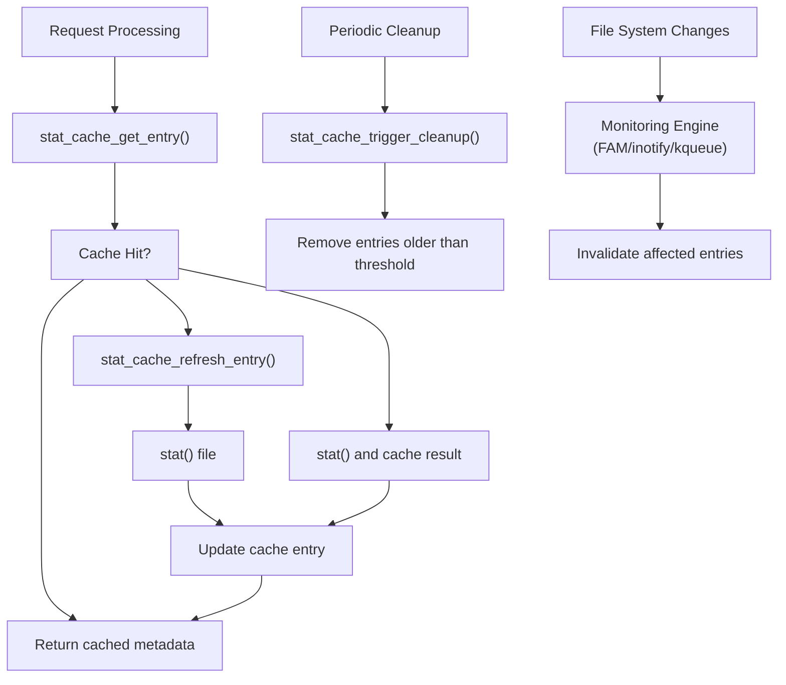
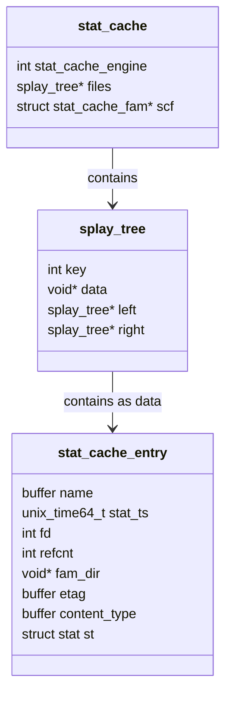
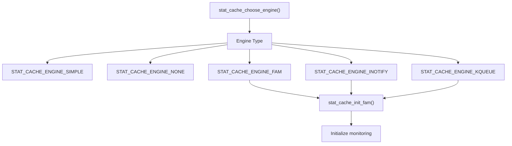
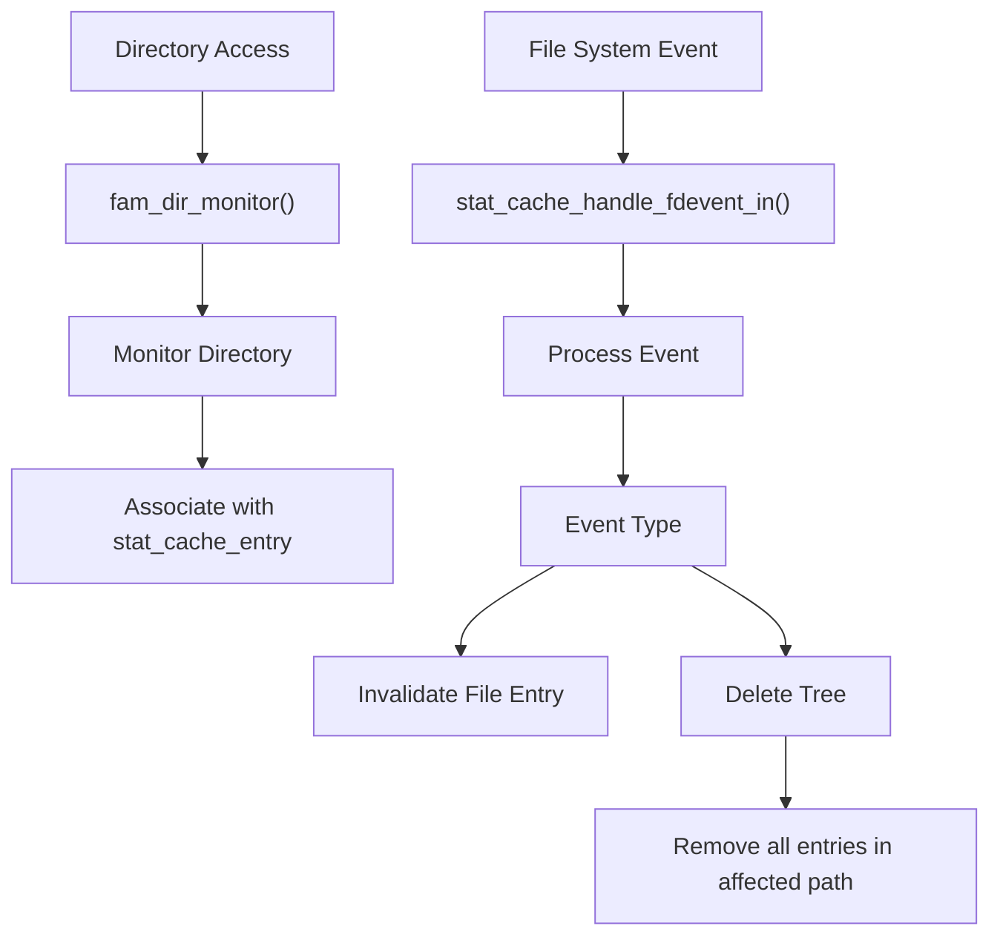
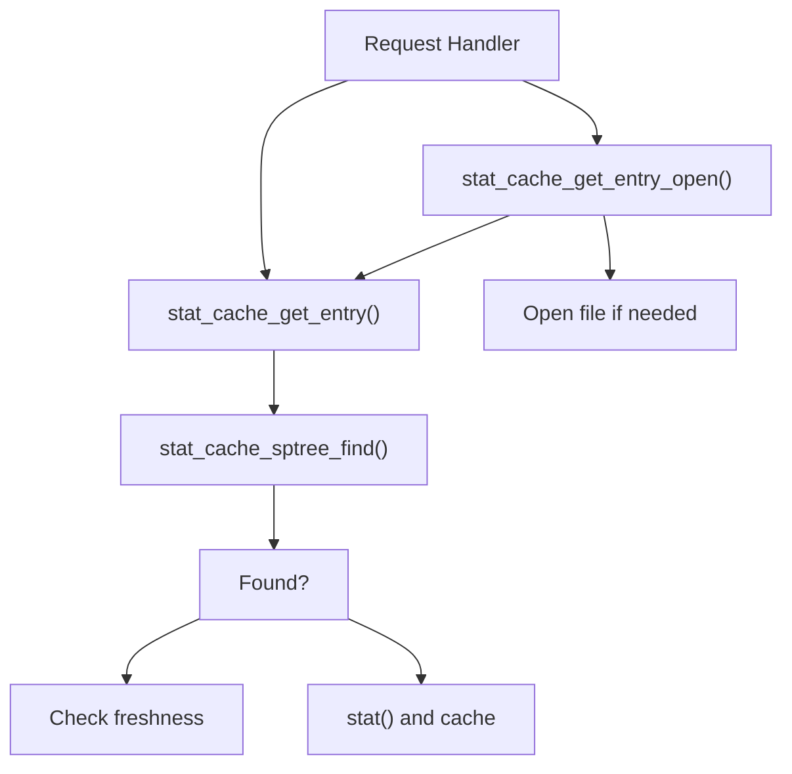
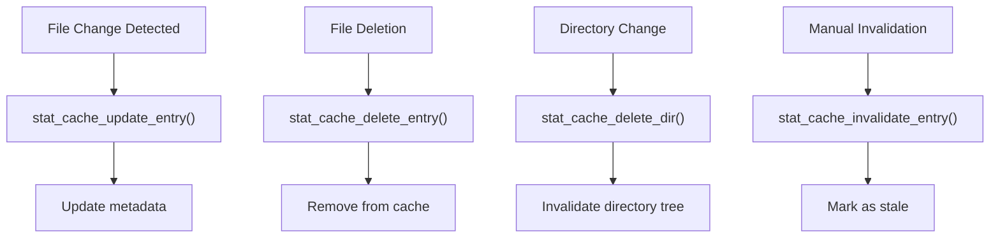
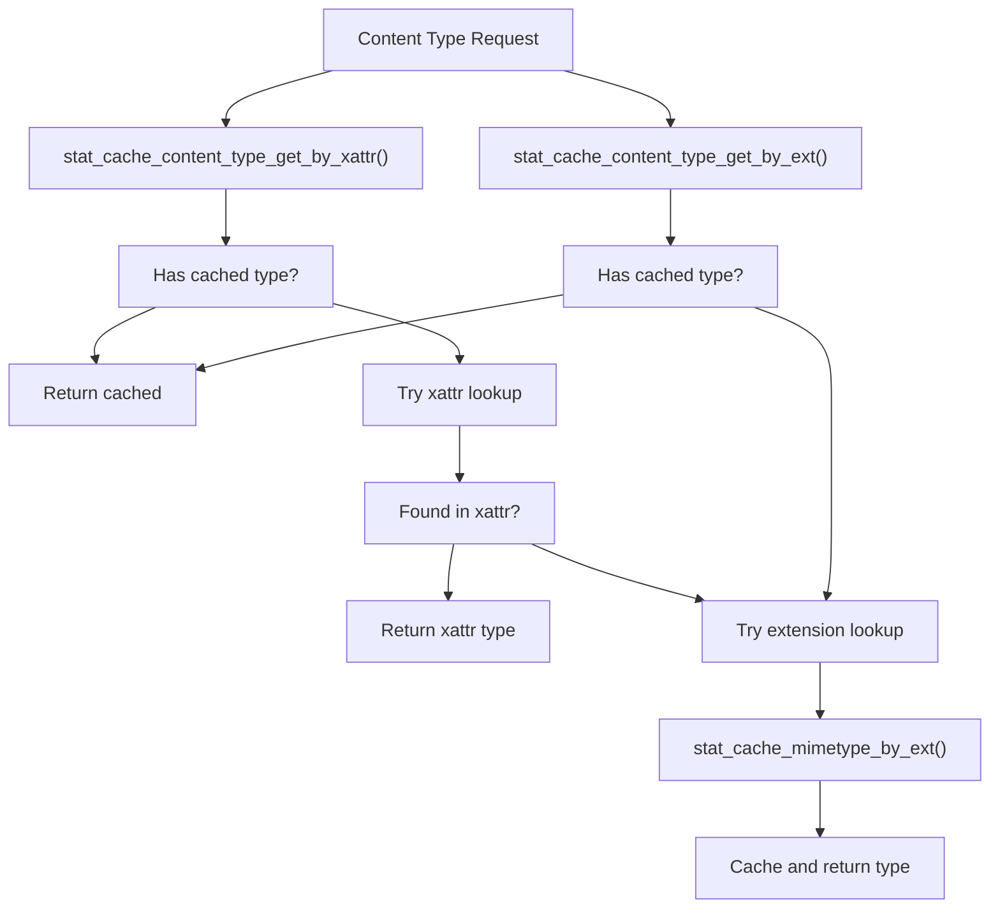
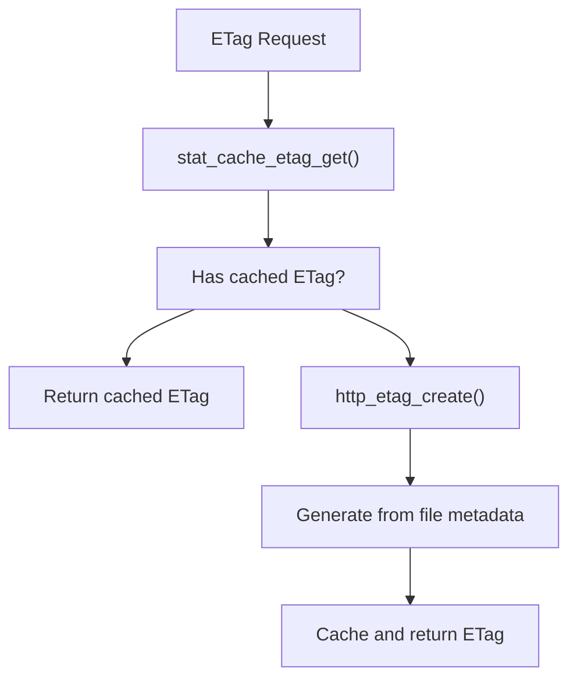
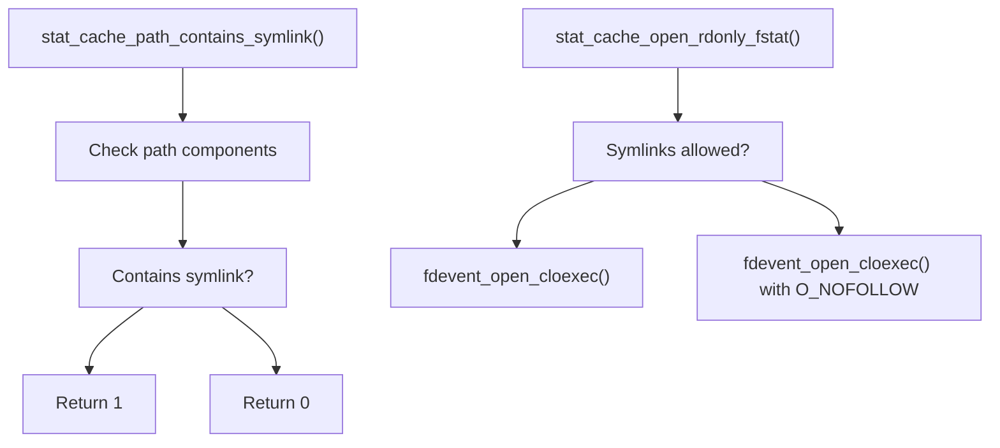
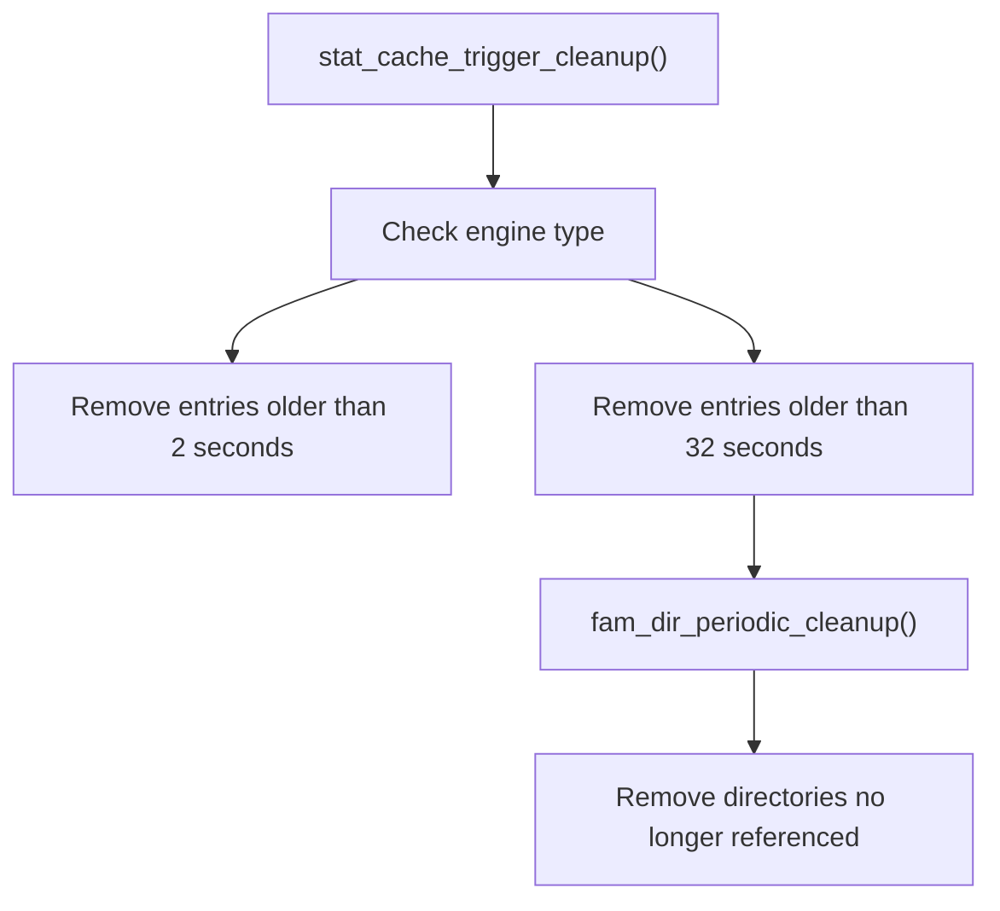

# File System Operations

> **Relevant source files**
> * [src/stat_cache.c](https://github.com/lighttpd/lighttpd1.4/blob/3d550097/src/stat_cache.c)
> * [src/stat_cache.h](https://github.com/lighttpd/lighttpd1.4/blob/3d550097/src/stat_cache.h)

This document details how lighttpd interacts with the file system, covering the stat cache system, file metadata handling, directory monitoring, and related file operations. The stat cache is a critical performance optimization that minimizes expensive file system calls by caching file metadata.

For information about buffer and memory management used by file operations, see [Memory Management](/lighttpd/lighttpd1.4/3.1-memory-management). For details on event-driven network I/O used alongside file operations, see [Event Handling and Networking](/lighttpd/lighttpd1.4/3.3-event-handling-and-networking).

## 1. Stat Cache System Overview

The stat cache system caches the results of `stat()` calls to reduce disk I/O and improve server performance. It maintains metadata about files and directories, provides file descriptors for open files, and monitors the file system for changes to invalidate stale cache entries.

Sources: [src/stat_cache.c L42-L51](https://github.com/lighttpd/lighttpd1.4/blob/3d550097/src/stat_cache.c#L42-L51)

 [src/stat_cache.c L798-L828](https://github.com/lighttpd/lighttpd1.4/blob/3d550097/src/stat_cache.c#L798-L828)

 [src/stat_cache.c L1259-L1328](https://github.com/lighttpd/lighttpd1.4/blob/3d550097/src/stat_cache.c#L1259-L1328)

 [src/stat_cache.c L1330-L1381](https://github.com/lighttpd/lighttpd1.4/blob/3d550097/src/stat_cache.c#L1330-L1381)

 [src/stat_cache.c L1477-L1523](https://github.com/lighttpd/lighttpd1.4/blob/3d550097/src/stat_cache.c#L1477-L1523)

## 2. Stat Cache Entry Structure

The stat cache stores file metadata in `stat_cache_entry` structures organized in a splay tree for efficient lookups.

Sources: [src/stat_cache.h L14-L25](https://github.com/lighttpd/lighttpd1.4/blob/3d550097/src/stat_cache.h#L14-L25)

 [src/stat_cache.c L44-L50](https://github.com/lighttpd/lighttpd1.4/blob/3d550097/src/stat_cache.c#L44-L50)

## 3. Cache Engines

The stat cache system supports multiple engines with different caching strategies:

| Engine | Description | Use Case |
| --- | --- | --- |
| Simple (default) | Caches entries for 2 seconds | Good balance of performance and freshness |
| None/Disable | No caching, always stat() | When absolute freshness is required |
| FAM/inotify/kqueue | Uses filesystem monitoring | For better performance with automatic invalidation |

The engine is selected during server configuration using the `server.stat-cache-engine` directive.

Sources: [src/stat_cache.c L33-L40](https://github.com/lighttpd/lighttpd1.4/blob/3d550097/src/stat_cache.c#L33-L40)

 [src/stat_cache.c L881-L893](https://github.com/lighttpd/lighttpd1.4/blob/3d550097/src/stat_cache.c#L881-L893)

 [src/stat_cache.c L922-L959](https://github.com/lighttpd/lighttpd1.4/blob/3d550097/src/stat_cache.c#L922-L959)

 [src/stat_cache.c L575-L634](https://github.com/lighttpd/lighttpd1.4/blob/3d550097/src/stat_cache.c#L575-L634)

## 4. File System Monitoring

When using the FAM/inotify/kqueue engines, the stat cache monitors directories for changes to automatically invalidate affected cache entries.

The monitoring system handles several types of file system events:

* File/directory changes (content or attributes modified)
* File/directory deletion
* File/directory renaming/moving

Sources: [src/stat_cache.c L663-L795](https://github.com/lighttpd/lighttpd1.4/blob/3d550097/src/stat_cache.c#L663-L795)

 [src/stat_cache.c L362-L547](https://github.com/lighttpd/lighttpd1.4/blob/3d550097/src/stat_cache.c#L362-L547)

 [src/stat_cache.c L549-L573](https://github.com/lighttpd/lighttpd1.4/blob/3d550097/src/stat_cache.c#L549-L573)

## 5. Cache Entry Operations

The stat cache provides several operations for working with cached entries:

### 5.1. Retrieving Entries

Sources: [src/stat_cache.c L1330-L1381](https://github.com/lighttpd/lighttpd1.4/blob/3d550097/src/stat_cache.c#L1330-L1381)

 [src/stat_cache.c L1383-L1392](https://github.com/lighttpd/lighttpd1.4/blob/3d550097/src/stat_cache.c#L1383-L1392)

### 5.2. Updating and Invalidating Entries

Sources: [src/stat_cache.c L1109-L1142](https://github.com/lighttpd/lighttpd1.4/blob/3d550097/src/stat_cache.c#L1109-L1142)

 [src/stat_cache.c L1144-L1154](https://github.com/lighttpd/lighttpd1.4/blob/3d550097/src/stat_cache.c#L1144-L1154)

 [src/stat_cache.c L1156-L1169](https://github.com/lighttpd/lighttpd1.4/blob/3d550097/src/stat_cache.c#L1156-L1169)

 [src/stat_cache.c L1242-L1257](https://github.com/lighttpd/lighttpd1.4/blob/3d550097/src/stat_cache.c#L1242-L1257)

## 6. Content Type Detection

The stat cache helps determine file MIME types through:

1. Extended attributes (if supported and enabled)
2. File extension mapping from configuration

Sources: [src/stat_cache.c L961-L1007](https://github.com/lighttpd/lighttpd1.4/blob/3d550097/src/stat_cache.c#L961-L1007)

 [src/stat_cache.c L1016-L1073](https://github.com/lighttpd/lighttpd1.4/blob/3d550097/src/stat_cache.c#L1016-L1073)

 [src/stat_cache.c L845-L879](https://github.com/lighttpd/lighttpd1.4/blob/3d550097/src/stat_cache.c#L845-L879)

## 7. ETag Generation

ETags are generated based on file metadata to support HTTP caching mechanisms:

The ETag generation uses various file attributes depending on configuration flags:

* File size
* Inode number
* Modification time
* Device ID

Sources: [src/stat_cache.c L1077-L1089](https://github.com/lighttpd/lighttpd1.4/blob/3d550097/src/stat_cache.c#L1077-L1089)

## 8. Symlink Handling

Lighttpd provides functions to safely handle symbolic links:

This provides security against symlink-based attacks when configured to restrict symlinks.

Sources: [src/stat_cache.c L1404-L1450](https://github.com/lighttpd/lighttpd1.4/blob/3d550097/src/stat_cache.c#L1404-L1450)

 [src/stat_cache.c L1452-L1466](https://github.com/lighttpd/lighttpd1.4/blob/3d550097/src/stat_cache.c#L1452-L1466)

## 9. Periodic Cleanup

To prevent the cache from growing too large, the stat cache periodically removes old entries:

Sources: [src/stat_cache.c L1477-L1523](https://github.com/lighttpd/lighttpd1.4/blob/3d550097/src/stat_cache.c#L1477-L1523)

 [src/stat_cache.c L285-L335](https://github.com/lighttpd/lighttpd1.4/blob/3d550097/src/stat_cache.c#L285-L335)

## 10. Implementation Considerations

### 10.1. Engine Selection Trade-offs

| Engine | Pros | Cons |
| --- | --- | --- |
| Simple | Low overhead, works everywhere | May serve stale data (up to 2s) |
| None | Always fresh data | Higher I/O load, potential performance impact |
| FAM/inotify/kqueue | Longer cache times with change detection | Platform-specific, more complex |

### 10.2. File System Monitoring Limitations

When using the FAM/inotify/kqueue engines:

1. Symlinks to files outside monitored directories may not trigger proper invalidation
2. Directory renames may cause stale cache entries in some cases
3. Very volatile directories (like /tmp) may cause excessive monitoring overhead

Sources: [src/stat_cache.c L80-L136](https://github.com/lighttpd/lighttpd1.4/blob/3d550097/src/stat_cache.c#L80-L136)

## 11. Performance Implications

The stat cache significantly improves performance by reducing file system calls. For static file serving, it can reduce disk operations by orders of magnitude. Key performance factors include:

1. Cache hit rate
2. File system characteristics
3. Selected cache engine
4. Monitoring overhead (for FAM/inotify/kqueue)

For optimal performance with frequently changing content, consider using the FAM/inotify/kqueue engines where supported.