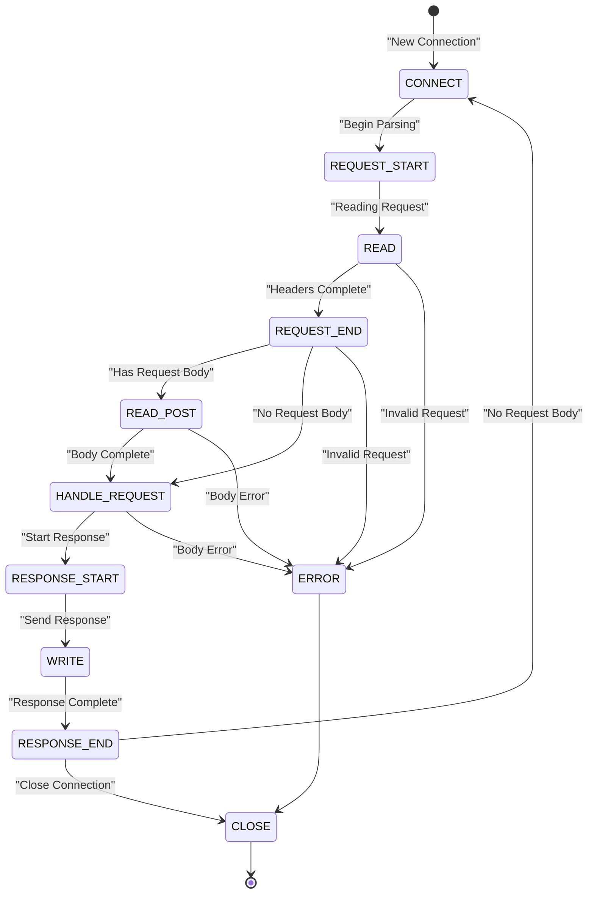
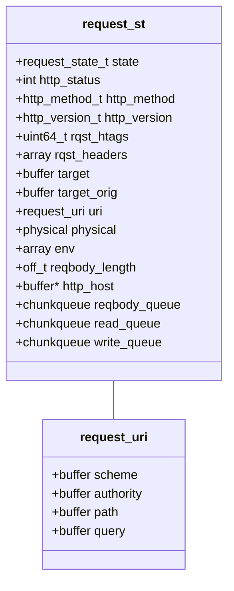
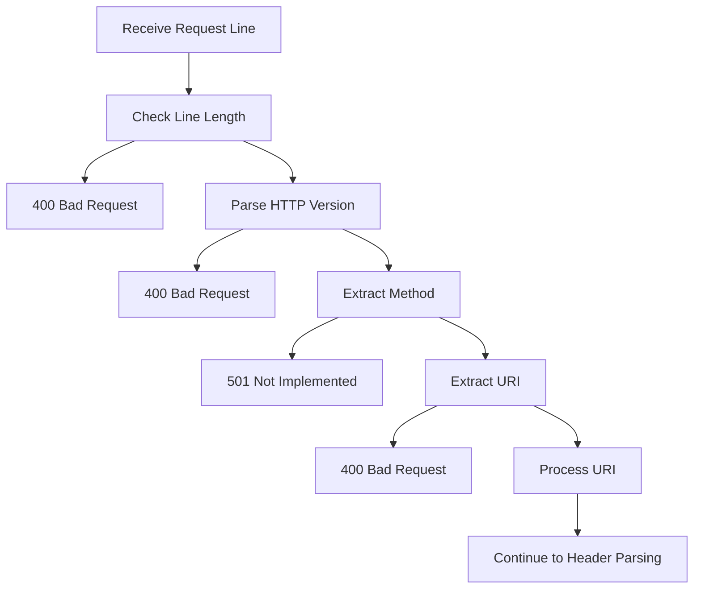
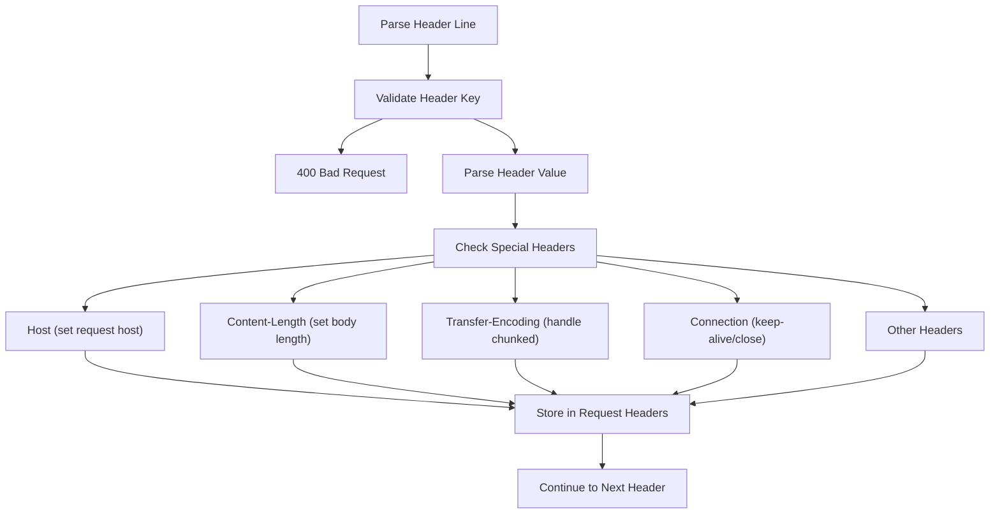
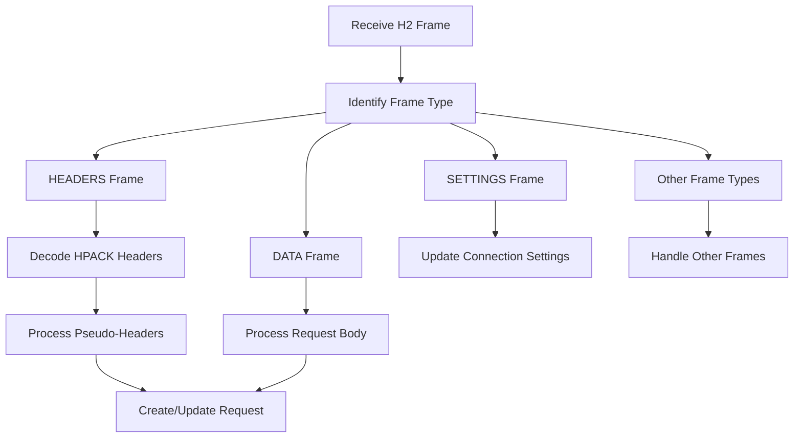
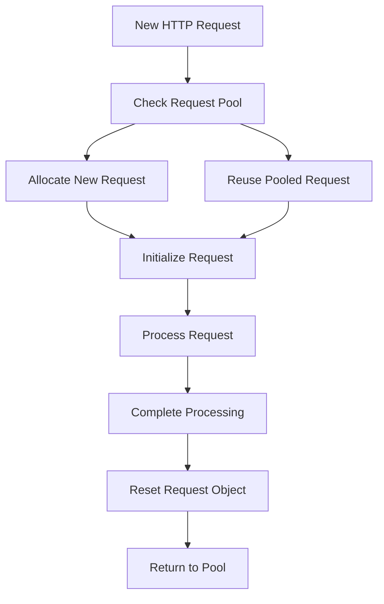

# HTTP Request Processing

> **Relevant source files**
> * [src/h2.c](https://github.com/lighttpd/lighttpd1.4/blob/3d550097/src/h2.c)
> * [src/h2.h](https://github.com/lighttpd/lighttpd1.4/blob/3d550097/src/h2.h)
> * [src/http_header.c](https://github.com/lighttpd/lighttpd1.4/blob/3d550097/src/http_header.c)
> * [src/http_header.h](https://github.com/lighttpd/lighttpd1.4/blob/3d550097/src/http_header.h)
> * [src/mod_extforward.c](https://github.com/lighttpd/lighttpd1.4/blob/3d550097/src/mod_extforward.c)
> * [src/reqpool.c](https://github.com/lighttpd/lighttpd1.4/blob/3d550097/src/reqpool.c)
> * [src/reqpool.h](https://github.com/lighttpd/lighttpd1.4/blob/3d550097/src/reqpool.h)
> * [src/request.c](https://github.com/lighttpd/lighttpd1.4/blob/3d550097/src/request.c)
> * [src/request.h](https://github.com/lighttpd/lighttpd1.4/blob/3d550097/src/request.h)
> * [src/t/test_configfile.c](https://github.com/lighttpd/lighttpd1.4/blob/3d550097/src/t/test_configfile.c)
> * [src/t/test_request.c](https://github.com/lighttpd/lighttpd1.4/blob/3d550097/src/t/test_request.c)

This document details how lighttpd processes HTTP requests, from receiving raw network data to parsing request lines and headers to preparing structured request objects for handler modules. For information about how lighttpd generates responses to those requests, see [HTTP Response Generation](/lighttpd/lighttpd1.4/1.3-http-response-generation).

## Overview

The HTTP request processing subsystem in lighttpd is responsible for:

1. Parsing incoming HTTP request data
2. Validating HTTP methods, headers, and URIs
3. Creating and managing request objects
4. Supporting different HTTP versions (1.0, 1.1, and 2)
5. Handling special cases like forwarded requests and connection upgrades

The process works through a state machine that tracks each request's progress from connection establishment through request parsing and handling.

## Request States and Lifecycle

HTTP request processing in lighttpd follows a well-defined state machine implemented in the request subsystem.

### Request State Machine



The state transitions are managed by the core server code, updating the `request_st.state` field based on the current processing stage.

Sources: [src/request.h L110-L122](https://github.com/lighttpd/lighttpd1.4/blob/3d550097/src/request.h#L110-L122)

 [src/request.h L216-L217](https://github.com/lighttpd/lighttpd1.4/blob/3d550097/src/request.h#L216-L217)

### Request Structure

The central data structure for HTTP request processing is the `request_st` struct, which contains all information about an HTTP request:



Sources: [src/request.h L124-L212](https://github.com/lighttpd/lighttpd1.4/blob/3d550097/src/request.h#L124-L212)

## HTTP Request Parsing

### HTTP/1.x Request Line Parsing

When data arrives on a connection, the first step is parsing the HTTP request line, which is handled by the `http_request_parse_reqline` function.

```
METHOD URI HTTP/VERSION\r\n
```

The parsing process:

1. Validates the request line format and length
2. Extracts and validates the HTTP method (GET, POST, etc.)
3. Extracts the URI and processes it
4. Validates the HTTP version (1.0, 1.1)



Sources: [src/request.c L841-L938](https://github.com/lighttpd/lighttpd1.4/blob/3d550097/src/request.c#L841-L938)

### HTTP Header Parsing

After the request line, headers are parsed by `http_request_parse_header`. This function:

1. Validates header line format
2. Processes each header key-value pair
3. Handles special headers like Host, Content-Length, and others
4. Performs header validation based on configuration options



The parser also handles multi-line headers, header continuations, and other special cases per the HTTP spec.

Sources: [src/request.c L618-L838](https://github.com/lighttpd/lighttpd1.4/blob/3d550097/src/request.c#L618-L838)

 [src/http_header.c L294-L358](https://github.com/lighttpd/lighttpd1.4/blob/3d550097/src/http_header.c#L294-L358)

### URI Processing and Validation

URIs undergo multiple validation and processing steps:

1. Checking for invalid characters based on the HTTP specification
2. Normalizing absolute URIs ([http://host/path](http://host/path)) to path component for internal handling
3. Extracting query parameters
4. Handling path normalization (processing ".." segments, etc.)

For HTTP/1.x, the `http_request_parse_reqline_uri` function is used, while HTTP/2 uses the values from the `:path` and `:authority` pseudo-headers.

The Host header processing is particularly important, as it:

1. Validates hostname format
2. Normalizes IPv4/IPv6 addresses
3. Extracts port information if present

Sources: [src/request.c L173-L313](https://github.com/lighttpd/lighttpd1.4/blob/3d550097/src/request.c#L173-L313)

 [src/request.c L513-L540](https://github.com/lighttpd/lighttpd1.4/blob/3d550097/src/request.c#L513-L540)

## HTTP/2 Request Processing

HTTP/2 request handling differs substantially from HTTP/1.x due to its binary framing protocol. The key differences in processing are:

### HTTP/2 Frame Processing



### HTTP/2 Pseudo-Headers

HTTP/2 uses pseudo-headers prefixed with ':' instead of a request line:

* `:method` - HTTP method (GET, POST, etc.)
* `:path` - Request path
* `:scheme` - URL scheme (http, https)
* `:authority` - Host/authority information
* `:protocol` - Used for protocol upgrades (e.g., WebSocket)

These are processed in `http_request_validate_pseudohdrs` and transformed into the equivalent request_st fields.

Sources: [src/request.c L549-L614](https://github.com/lighttpd/lighttpd1.4/blob/3d550097/src/request.c#L549-L614)

 [src/h2.c L169-L686](https://github.com/lighttpd/lighttpd1.4/blob/3d550097/src/h2.c#L169-L686)

## Request Object Lifecycle Management

Lighttpd optimizes memory usage by pooling request objects rather than allocating and freeing them for each connection.

### Request Pooling



Key functions involved in this process:

* `request_acquire` - Gets a request object from the pool or creates a new one
* `request_release` - Returns a request to the pool after use
* `request_reset` - Clears a request object for reuse
* `request_reset_ex` - Performs additional reset steps

Sources: [src/reqpool.c L102-L342](https://github.com/lighttpd/lighttpd1.4/blob/3d550097/src/reqpool.c#L102-L342)

## Special Cases in Request Processing

### Content-Length and Transfer-Encoding

The handling of request bodies depends on headers:

* `Content-Length` - Sets a fixed length for the request body
* `Transfer-Encoding: chunked` - Indicates chunked encoding for the request body

Lighttpd carefully handles these to ensure proper request body reading.

Sources: [src/request.c L463-L506](https://github.com/lighttpd/lighttpd1.4/blob/3d550097/src/request.c#L463-L506)

### Host Header and Protocol Detection

The `Host` header is crucial for virtual hosting and is handled specially:

* During parsing, the header is extracted and validated
* Host validation includes checking for valid domain names or IP addresses
* For HTTP/1.1, the Host header is mandatory
* For HTTP/2, the `:authority` pseudo-header fulfills this role

Sources: [src/request.c L96-L171](https://github.com/lighttpd/lighttpd1.4/blob/3d550097/src/request.c#L96-L171)

 [src/request.c L337-L344](https://github.com/lighttpd/lighttpd1.4/blob/3d550097/src/request.c#L337-L344)

### Forwarded Requests

Lighttpd can handle requests that come through proxies using modules like `mod_extforward` which:

* Recognizes trusted proxies
* Processes headers like `X-Forwarded-For` and `Forwarded`
* Updates request properties to reflect original client information

Sources: [src/mod_extforward.c L60-L105](https://github.com/lighttpd/lighttpd1.4/blob/3d550097/src/mod_extforward.c#L60-L105)

 [src/mod_extforward.c L634-L653](https://github.com/lighttpd/lighttpd1.4/blob/3d550097/src/mod_extforward.c#L634-L653)

## Error Handling

The request processing system includes robust error handling:

1. Syntactic errors in request line or headers generate 400 Bad Request
2. Unknown methods generate 501 Not Implemented
3. Unsupported protocol versions generate 400 Bad Request (or 505 HTTP Version Not Supported)
4. Missing mandatory headers (like Host for HTTP/1.1) generate 400 Bad Request
5. Invalid URI syntax generates 400 Bad Request

When errors occur, the request state transitions to CON_STATE_ERROR and an appropriate HTTP error response is generated.

Sources: [src/request.c L323-L334](https://github.com/lighttpd/lighttpd1.4/blob/3d550097/src/request.c#L323-L334)

 [src/request.c L398-L400](https://github.com/lighttpd/lighttpd1.4/blob/3d550097/src/request.c#L398-L400)

## Performance Considerations

Several optimizations enhance the request processing performance:

1. Request object pooling reduces memory allocation overhead
2. Header lookups are optimized using enumerated types and bitfields
3. String operations minimize copies where possible
4. HTTP/2 uses HPACK header compression to reduce bandwidth

Sources: [src/http_header.c L98-L136](https://github.com/lighttpd/lighttpd1.4/blob/3d550097/src/http_header.c#L98-L136)

 [src/reqpool.c L278-L342](https://github.com/lighttpd/lighttpd1.4/blob/3d550097/src/reqpool.c#L278-L342)

## Integration with Other Systems

Request processing is the first major step in handling an HTTP request. Once a request is successfully parsed:

1. URI is mapped to a physical file or handler
2. Request is passed to appropriate handler modules
3. Response is generated and sent back to the client

For details on how responses are generated, see [HTTP Response Generation](/lighttpd/lighttpd1.4/1.3-http-response-generation).

Sources: [src/request.h L124-L212](https://github.com/lighttpd/lighttpd1.4/blob/3d550097/src/request.h#L124-L212)