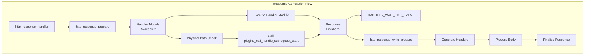
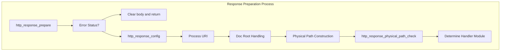
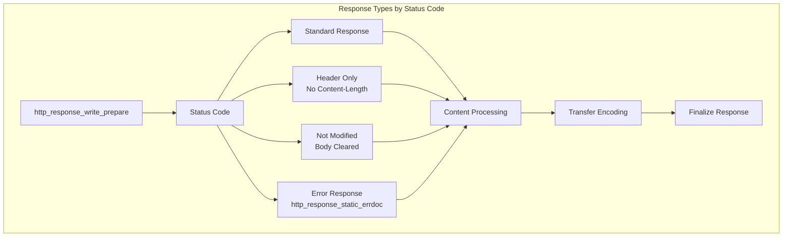
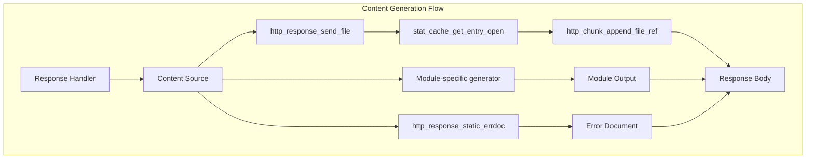
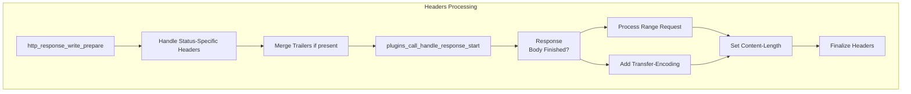
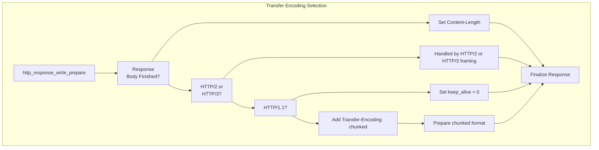
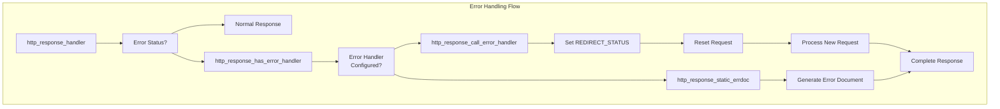

# HTTP Response Generation

> **Relevant source files**
> * [src/http-header-glue.c](https://github.com/lighttpd/lighttpd1.4/blob/3d550097/src/http-header-glue.c)
> * [src/http_range.c](https://github.com/lighttpd/lighttpd1.4/blob/3d550097/src/http_range.c)
> * [src/http_range.h](https://github.com/lighttpd/lighttpd1.4/blob/3d550097/src/http_range.h)
> * [src/response.c](https://github.com/lighttpd/lighttpd1.4/blob/3d550097/src/response.c)
> * [src/response.h](https://github.com/lighttpd/lighttpd1.4/blob/3d550097/src/response.h)

## Purpose and Scope

This document details how lighttpd generates HTTP responses. It covers the process from initial response preparation through header generation, content creation, and final response transmission. This page focuses specifically on the core response generation mechanisms, not the request handling that precedes it (covered in [HTTP Request Processing](/lighttpd/lighttpd1.4/1.2-http-request-processing)) or the network-level mechanisms that deliver it (covered in [Event Handling and Networking](/lighttpd/lighttpd1.4/3.3-event-handling-and-networking)).

## Response Generation Overview

The HTTP response generation in lighttpd follows a structured process that transforms a request into an appropriate response. The system uses several key components to handle different response types, status codes, and content formats.

Sources: [src/response.c L842-L885](https://github.com/lighttpd/lighttpd1.4/blob/3d550097/src/response.c#L842-L885)

The response generation process begins with `http_response_handler`, which is the main entry point for handling HTTP responses. If a handler module is available (such as for dynamic content), it's executed. Otherwise, lighttpd checks the physical path and calls plugins to handle the subrequest. Once the response is ready, `http_response_write_prepare` is called to prepare the response for writing.

## Response Preparation

Response preparation transforms the incoming request into the appropriate response format. This process involves mapping URIs to physical paths, checking access permissions, and determining the appropriate handler.

Sources: [src/response.c L258-L440](https://github.com/lighttpd/lighttpd1.4/blob/3d550097/src/response.c#L258-L440)

 [src/response.c L128-L197](https://github.com/lighttpd/lighttpd1.4/blob/3d550097/src/response.c#L128-L197)

The key components of response preparation include:

1. **Configuration Setup**: `http_response_config` applies configuration settings to the response
2. **URI Processing**: The URI is processed and transformed into a physical path
3. **Physical Path Check**: `http_response_physical_path_check` verifies the existence of the resource
4. **Handler Determination**: The appropriate handler module is selected based on the request

### Physical Path Processing

Physical path processing is an important part of response preparation that maps the URI to a file in the filesystem:

| Step | Function | Purpose |
| --- | --- | --- |
| 1 | `buffer_copy_buffer` | Copies URI path to physical path |
| 2 | `buffer_path_simplify` | Removes redundant path components |
| 3 | `stat_cache_get_entry` | Checks if file exists in cache |
| 4 | `http_response_physical_pathinfo` | Processes PATH_INFO if file not found |
| 5 | `http_response_physical_path_error` | Handles errors in physical path processing |

Sources: [src/response.c L128-L197](https://github.com/lighttpd/lighttpd1.4/blob/3d550097/src/response.c#L128-L197)

## Response Types and Status Codes

lighttpd handles various response types based on the HTTP status code. The response type determines how headers and content are generated.

Sources: [src/response.c L603-L752](https://github.com/lighttpd/lighttpd1.4/blob/3d550097/src/response.c#L603-L752)

The system handles different response types differently:

1. **Success Responses (2xx)**: Standard responses with content
2. **No Content (204, 205)**: Headers only, no content length
3. **Not Modified (304)**: No body, preserved headers
4. **Error Responses (4xx, 5xx)**: Static error documents or custom error handlers

### Error Document Generation

For error responses (4xx and 5xx), lighttpd can generate static error documents if no custom error handler is configured:

1. First attempts to use configured error file from `errorfile_prefix`
2. If not available, generates a basic HTML error page
3. Sets appropriate Content-Type header

Sources: [src/response.c L507-L561](https://github.com/lighttpd/lighttpd1.4/blob/3d550097/src/response.c#L507-L561)

## Content Generation

Content generation involves creating the response body from various sources:

Sources: [src/http-header-glue.c L399-L501](https://github.com/lighttpd/lighttpd1.4/blob/3d550097/src/http-header-glue.c#L399-L501)

 [src/response.c L507-L561](https://github.com/lighttpd/lighttpd1.4/blob/3d550097/src/response.c#L507-L561)

The content generation process varies depending on the source:

1. **Static Files**: Uses `http_response_send_file` to read file content
2. **Dynamic Content**: Generated by handler modules (plugins)
3. **Error Documents**: Created by `http_response_static_errdoc`

### Range Support

lighttpd supports HTTP Range requests (RFC 7233) to deliver partial content:

1. `http_range_rfc7233` processes range requests
2. For single ranges, `http_range_single` modifies the response
3. For multiple ranges, `http_range_multi` creates a multipart response
4. Sets appropriate Content-Range headers

Sources: [src/http_range.c L356-L493](https://github.com/lighttpd/lighttpd1.4/blob/3d550097/src/http_range.c#L356-L493)

## Headers Processing

Headers are a crucial part of HTTP responses. lighttpd provides several mechanisms to manage response headers:

Sources: [src/response.c L603-L752](https://github.com/lighttpd/lighttpd1.4/blob/3d550097/src/response.c#L603-L752)

Key header processing functions:

| Function | Purpose |
| --- | --- |
| `http_header_response_set` | Sets a response header |
| `http_header_response_append` | Appends to a response header |
| `http_header_response_insert` | Inserts a response header |
| `http_header_response_unset` | Removes a response header |
| `http_response_set_last_modified` | Sets Last-Modified header with cache |

Sources: [src/http-header-glue.c L228-L234](https://github.com/lighttpd/lighttpd1.4/blob/3d550097/src/http-header-glue.c#L228-L234)

### Content Negotiation and Caching Headers

lighttpd handles content negotiation and caching headers:

1. **ETag**: Generated based on file attributes
2. **Last-Modified**: Generated from file modification time
3. **Cache-Control**: Can be configured or set by modules
4. **Conditional Requests**: Processes If-None-Match and If-Modified-Since

Sources: [src/http-header-glue.c L277-L318](https://github.com/lighttpd/lighttpd1.4/blob/3d550097/src/http-header-glue.c#L277-L318)

## Transfer Encoding

lighttpd supports different transfer encoding methods:

Sources: [src/response.c L644-L742](https://github.com/lighttpd/lighttpd1.4/blob/3d550097/src/response.c#L644-L742)

Transfer encoding is selected based on:

1. **HTTP Version**: HTTP/1.1 supports chunked encoding, HTTP/1.0 does not
2. **Response Completion**: Finished responses use Content-Length
3. **Protocol**: HTTP/2 and HTTP/3 handle framing differently

### Chunked Encoding

For HTTP/1.1 with incomplete responses, chunked encoding is applied:

1. Sets `r->resp_send_chunked = 1`
2. Adds "Transfer-Encoding: chunked" header
3. Prepends initial chunk size and CR+LF to content
4. Content is sent in chunks as it becomes available

Sources: [src/response.c L702-L738](https://github.com/lighttpd/lighttpd1.4/blob/3d550097/src/response.c#L702-L738)

## Error Handling and Custom Error Pages

lighttpd provides mechanisms for custom error handling:

Sources: [src/response.c L480-L839](https://github.com/lighttpd/lighttpd1.4/blob/3d550097/src/response.c#L480-L839)

Error handling process:

1. **Error Detection**: Identifies response with error status (4xx, 5xx)
2. **Handler Check**: Checks if custom error handler is configured
3. **Custom Handler**: If available, processes request with error handler
4. **Static Document**: Otherwise, generates static error document

### Custom Error Handler

When a custom error handler is configured:

1. Sets `REDIRECT_STATUS` environment variable with original status
2. Saves original status in `r->error_handler_saved_status`
3. Resets request and changes target to error handler URI
4. Processes request as a new request

Sources: [src/response.c L756-L799](https://github.com/lighttpd/lighttpd1.4/blob/3d550097/src/response.c#L756-L799)

## Response Finalization

Response finalization ensures the response is properly formatted before sending:

1. **Headers Completion**: Ensures all required headers are present
2. **Content-Length**: Sets Content-Length header if response is complete
3. **Transfer-Encoding**: Adds chunked encoding if response is not complete
4. **HEAD Requests**: Removes body but keeps headers for HEAD requests

Sources: [src/response.c L603-L752](https://github.com/lighttpd/lighttpd1.4/blob/3d550097/src/response.c#L603-L752)

## Conclusion

HTTP Response Generation in lighttpd follows a structured process from initial preparation through content generation and header processing to final response formatting. The system supports various response types, status codes, and content sources, with special handling for error documents, range requests, and chunked transfer encoding.

The architecture balances efficiency with flexibility, allowing for custom error handlers, various content sources, and optimized delivery methods while maintaining compliance with HTTP standards.