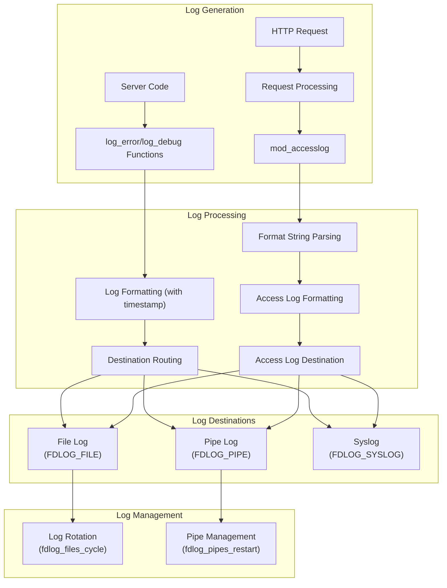
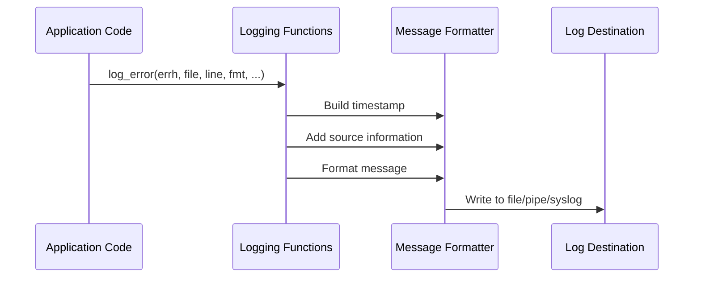
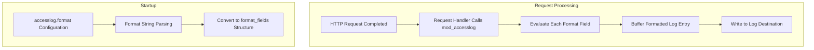
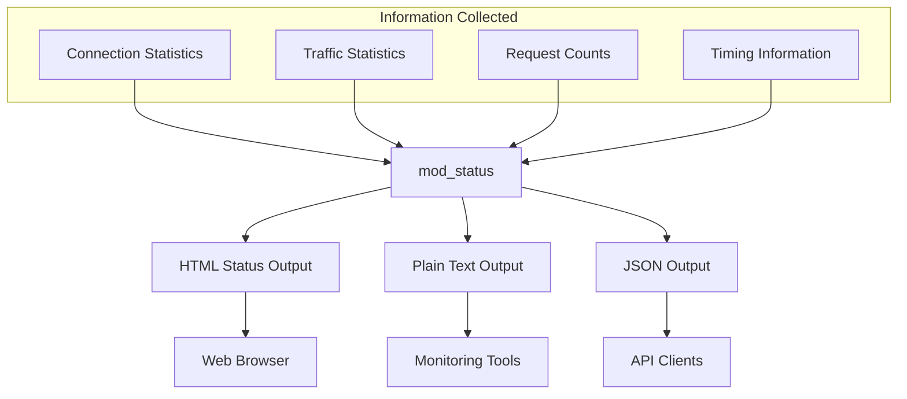
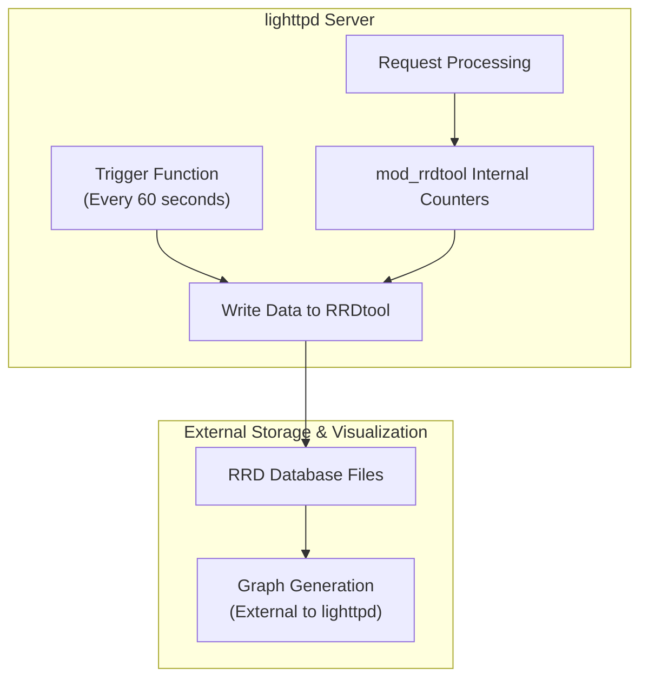

# Logging and Monitoring

> **Relevant source files**
> * [src/buffer.c](https://github.com/lighttpd/lighttpd1.4/blob/3d550097/src/buffer.c)
> * [src/buffer.h](https://github.com/lighttpd/lighttpd1.4/blob/3d550097/src/buffer.h)
> * [src/fdlog.c](https://github.com/lighttpd/lighttpd1.4/blob/3d550097/src/fdlog.c)
> * [src/fdlog.h](https://github.com/lighttpd/lighttpd1.4/blob/3d550097/src/fdlog.h)
> * [src/fdlog_maint.c](https://github.com/lighttpd/lighttpd1.4/blob/3d550097/src/fdlog_maint.c)
> * [src/log.c](https://github.com/lighttpd/lighttpd1.4/blob/3d550097/src/log.c)
> * [src/log.h](https://github.com/lighttpd/lighttpd1.4/blob/3d550097/src/log.h)
> * [src/mod_accesslog.c](https://github.com/lighttpd/lighttpd1.4/blob/3d550097/src/mod_accesslog.c)
> * [src/mod_rrdtool.c](https://github.com/lighttpd/lighttpd1.4/blob/3d550097/src/mod_rrdtool.c)
> * [src/mod_status.c](https://github.com/lighttpd/lighttpd1.4/blob/3d550097/src/mod_status.c)

This page documents lighttpd's comprehensive logging and monitoring systems, including the error logging framework, access logging functionality, server status reporting, and integration with external monitoring tools. For specific information about debugging techniques, see [Debugging and Troubleshooting](/lighttpd/lighttpd1.4/6.3-debugging-and-troubleshooting).

## Logging Architecture

Lighttpd provides a flexible logging architecture designed for both performance and versatility, with support for different log destinations and formats.



The logging system uses several key components:

1. **Log Abstractions** (`fdlog_st`): Represents a log destination whether file, pipe, or syslog
2. **Buffer Management**: Uses the `buffer` type for efficient log message construction
3. **Log Levels**: Various severity levels from debug to emergency
4. **Timestamp Handling**: Both standard and high-precision timestamps

Sources: [src/log.c L40-L83](https://github.com/lighttpd/lighttpd1.4/blob/3d550097/src/log.c#L40-L83)

 [src/fdlog.h L8-L13](https://github.com/lighttpd/lighttpd1.4/blob/3d550097/src/fdlog.h#L8-L13)

 [src/log.h L22-L43](https://github.com/lighttpd/lighttpd1.4/blob/3d550097/src/log.h#L22-L43)

## Error Logging

Error logging is implemented as the core logging facility in lighttpd, recording system errors, warnings, and debug information.

### Log Level Functions

| Function | Purpose | Severity |
| --- | --- | --- |
| `log_error()` | General errors | 3 (ERROR) |
| `log_perror()` | System errors with errno | 3 (ERROR) |
| `log_debug()` | Debug messages | 7 (DEBUG) |
| `log_info()` | Information messages | 6 (INFO) |
| `log_warn()` | Warning messages | 4 (WARNING) |
| `log_notice()` | Normal but significant | 5 (NOTICE) |

Each log message includes:

* Timestamp (configurable precision)
* Source file and line number
* Formatted message
* Optional system error message (for `perror` variants)



### Error Log Message Structure

A typical error log entry follows this format:

```
2023-06-15 12:34:56: (server.c.145) server started
```

Sources: [src/log.c L122-L166](https://github.com/lighttpd/lighttpd1.4/blob/3d550097/src/log.c#L122-L166)

 [src/log.c L382-L415](https://github.com/lighttpd/lighttpd1.4/blob/3d550097/src/log.c#L382-L415)

 [src/log.h L22-L43](https://github.com/lighttpd/lighttpd1.4/blob/3d550097/src/log.h#L22-L43)

## Access Logging

Access logging (implemented in `mod_accesslog.c`) records HTTP request and response details in a customizable format.

### Format String Syntax

The access log format uses Apache-compatible syntax with `%` directives:

| Directive | Description | Example Output |
| --- | --- | --- |
| `%h` | Remote host IP address | 192.168.1.10 |
| `%V` | Server name according to UseCanonicalName | [www.example.com](http://www.example.com) |
| `%u` | Remote user from auth | john |
| `%t` | Time the request was received | [10/Oct/2023:13:55:36 -0700] |
| `%r` | First line of request | GET /index.html HTTP/1.1 |
| `%>s` | Status sent to the client | 200 |
| `%b` | Response size in bytes, excluding HTTP headers | 2326 |
| `%{Referer}i` | Contents of Referer header | [https://www.google.com/](https://www.google.com/) |
| `%{User-Agent}i` | Contents of User-Agent header | Mozilla/5.0... |
| `%T` | Time taken to serve the request (seconds) | 0.002 |
| `%D` | Time taken to serve the request (microseconds) | 2038 |

### Access Log Processing Flow



Sources: [src/mod_accesslog.c L74-L111](https://github.com/lighttpd/lighttpd1.4/blob/3d550097/src/mod_accesslog.c#L74-L111)

 [src/mod_accesslog.c L190-L230](https://github.com/lighttpd/lighttpd1.4/blob/3d550097/src/mod_accesslog.c#L190-L230)

 [src/mod_accesslog.c L606-L607](https://github.com/lighttpd/lighttpd1.4/blob/3d550097/src/mod_accesslog.c#L606-L607)

## Server Status Monitoring

The `mod_status` module provides real-time server statistics and monitoring capabilities.

### Available Status Information

* Current connections and their states
* Server uptime and traffic statistics
* Request counts (total and per time period)
* Memory usage statistics
* Connection distribution by state

### Status Output Formats

1. **HTML**: Rich interface with sortable tables
2. **Plain Text**: Simple text output for machine processing
3. **JSON**: Structured data for application integration



Sources: [src/mod_status.c L172-L234](https://github.com/lighttpd/lighttpd1.4/blob/3d550097/src/mod_status.c#L172-L234)

 [src/mod_status.c L265-L548](https://github.com/lighttpd/lighttpd1.4/blob/3d550097/src/mod_status.c#L265-L548)

## RRDtool Integration

The `mod_rrdtool` module integrates with RRDtool to store and visualize performance metrics over time.

### Metrics Tracked

* Request counts
* Bytes written (traffic out)
* Bytes read (traffic in)

### RRDtool Operation



The module creates a pipe to a spawned RRDtool process and sends updates through this pipe. RRDtool databases are automatically created if they don't exist with appropriate Round Robin Archives (RRAs) for different time periods.

Sources: [src/mod_rrdtool.c L257-L316](https://github.com/lighttpd/lighttpd1.4/blob/3d550097/src/mod_rrdtool.c#L257-L316)

 [src/mod_rrdtool.c L325-L367](https://github.com/lighttpd/lighttpd1.4/blob/3d550097/src/mod_rrdtool.c#L325-L367)

 [src/mod_rrdtool.c L388-L404](https://github.com/lighttpd/lighttpd1.4/blob/3d550097/src/mod_rrdtool.c#L388-L404)

## Log Management

Lighttpd includes facilities for managing log files and connections to external logging processes.

### Log File Rotation

Log files can be cycled (rotated) in-place using the `fdlog_files_cycle()` function, which:

1. Flushes pending log data
2. Opens a new file descriptor to the same path
3. Replaces the old file descriptor with the new one

### Pipe-based Logging

For pipe-based logging:

1. A pipe is created with `fdevent_pipe_cloexec()`
2. An external process is spawned with `fdevent_sh_exec()`
3. Log data is written to the write end of the pipe
4. If the external process dies, it can be automatically restarted

### Syslog Integration

The logging system can send log messages to syslog using the standard syslog facilities.

Sources: [src/fdlog_maint.c L264-L292](https://github.com/lighttpd/lighttpd1.4/blob/3d550097/src/fdlog_maint.c#L264-L292)

 [src/fdlog_maint.c L59-L90](https://github.com/lighttpd/lighttpd1.4/blob/3d550097/src/fdlog_maint.c#L59-L90)

 [src/fdlog_maint.c L334-L417](https://github.com/lighttpd/lighttpd1.4/blob/3d550097/src/fdlog_maint.c#L334-L417)

## Configuring Logging

### Error Log Configuration

The error log is configured in the main server section:

```markdown
# Error log path
server.errorlog = "/var/log/lighttpd/error.log"

# Log only messages of level info or higher
server.errorlog-use-syslog = "enable"
server.syslog-facility = "daemon"
```

### Access Log Configuration

Access logging is configured through the `mod_accesslog` module:

```markdown
# Load the module
server.modules += ( "mod_accesslog" )

# Define the log file path
accesslog.filename = "/var/log/lighttpd/access.log"

# Define the log format (Common Log Format)
accesslog.format = "%h %l %u %t \"%r\" %>s %b"
```

### Status Module Configuration

The status module is configured through `mod_status`:

```
server.modules += ( "mod_status" )
status.status-url = "/server-status"
status.config-url = "/server-config"
status.statistics-url = "/server-statistics"
```

### RRDtool Module Configuration

RRDtool integration is configured through `mod_rrdtool`:

```
server.modules += ( "mod_rrdtool" )
rrdtool.binary = "/usr/bin/rrdtool"
rrdtool.db-name = "/var/lib/lighttpd/lighttpd.rrd"
```

Sources: [src/mod_accesslog.c L353-L370](https://github.com/lighttpd/lighttpd1.4/blob/3d550097/src/mod_accesslog.c#L353-L370)

 [src/mod_status.c L81-L97](https://github.com/lighttpd/lighttpd1.4/blob/3d550097/src/mod_status.c#L81-L97)

 [src/mod_rrdtool.c L162-L172](https://github.com/lighttpd/lighttpd1.4/blob/3d550097/src/mod_rrdtool.c#L162-L172)

## Log Buffer Management

Lighttpd uses a sophisticated buffer management system for efficient log message construction.

### Buffer Operations

The `buffer` type provides efficient string building operations:

* `buffer_append_string()`: Append a string
* `buffer_append_int()`: Append an integer
* `buffer_append_strftime()`: Append a formatted timestamp
* `buffer_append_string_encoded()`: Append a string with character encoding

These operations minimize memory allocations and copying while building log messages.

Sources: [src/buffer.c L166-L200](https://github.com/lighttpd/lighttpd1.4/blob/3d550097/src/buffer.c#L166-L200)

 [src/buffer.c L331-L335](https://github.com/lighttpd/lighttpd1.4/blob/3d550097/src/buffer.c#L331-L335)

 [src/buffer.c L337-L356](https://github.com/lighttpd/lighttpd1.4/blob/3d550097/src/buffer.c#L337-L356)

## Performance Considerations

### Log Buffering

Log writes are buffered for improved performance:

* Error logs can be buffered and flushed periodically
* Access logs are flushed every 4 seconds by default
* Pipe logs use non-blocking writes to avoid stalling the server

### High-precision Timestamps

High-precision timestamps can be enabled but increase CPU usage slightly:

* Normal timestamps: Second precision
* High-precision: Nanosecond precision
* Used by request timing fields and timestamps

Sources: [src/fdlog_maint.c L246-L257](https://github.com/lighttpd/lighttpd1.4/blob/3d550097/src/fdlog_maint.c#L246-L257)

 [src/log.c L609-L615](https://github.com/lighttpd/lighttpd1.4/blob/3d550097/src/log.c#L609-L615)

 [src/mod_accesslog.c L136-L143](https://github.com/lighttpd/lighttpd1.4/blob/3d550097/src/mod_accesslog.c#L136-L143)