# Memory Management

> **Relevant source files**
> * [src/array.c](https://github.com/lighttpd/lighttpd1.4/blob/3d550097/src/array.c)
> * [src/array.h](https://github.com/lighttpd/lighttpd1.4/blob/3d550097/src/array.h)
> * [src/buffer.c](https://github.com/lighttpd/lighttpd1.4/blob/3d550097/src/buffer.c)
> * [src/buffer.h](https://github.com/lighttpd/lighttpd1.4/blob/3d550097/src/buffer.h)
> * [src/chunk.c](https://github.com/lighttpd/lighttpd1.4/blob/3d550097/src/chunk.c)
> * [src/chunk.h](https://github.com/lighttpd/lighttpd1.4/blob/3d550097/src/chunk.h)
> * [src/data_config.c](https://github.com/lighttpd/lighttpd1.4/blob/3d550097/src/data_config.c)
> * [src/http_chunk.c](https://github.com/lighttpd/lighttpd1.4/blob/3d550097/src/http_chunk.c)
> * [src/http_chunk.h](https://github.com/lighttpd/lighttpd1.4/blob/3d550097/src/http_chunk.h)
> * [src/log.c](https://github.com/lighttpd/lighttpd1.4/blob/3d550097/src/log.c)
> * [src/log.h](https://github.com/lighttpd/lighttpd1.4/blob/3d550097/src/log.h)
> * [src/mod_accesslog.c](https://github.com/lighttpd/lighttpd1.4/blob/3d550097/src/mod_accesslog.c)
> * [src/mod_deflate.c](https://github.com/lighttpd/lighttpd1.4/blob/3d550097/src/mod_deflate.c)
> * [src/mod_rrdtool.c](https://github.com/lighttpd/lighttpd1.4/blob/3d550097/src/mod_rrdtool.c)
> * [src/mod_status.c](https://github.com/lighttpd/lighttpd1.4/blob/3d550097/src/mod_status.c)
> * [src/network_write.c](https://github.com/lighttpd/lighttpd1.4/blob/3d550097/src/network_write.c)

This document describes the memory management subsystems in lighttpd, which are designed to efficiently handle data processing while minimizing memory allocations and deallocations. These subsystems provide building blocks for other parts of the web server to efficiently handle HTTP requests and responses.

## Overview

Lighttpd's memory management consists of several core components:

1. **Buffer System**: A lightweight abstraction for managing strings and binary data
2. **Chunk System**: Data containers for memory blocks or file references
3. **Chunkqueue System**: Ordered sequences of chunks for data streaming
4. **Memory Pooling**: Efficient reuse of memory structures

These components work together to provide efficient memory use throughout the server's operation, significantly reducing the overhead of frequent allocations and deallocations.

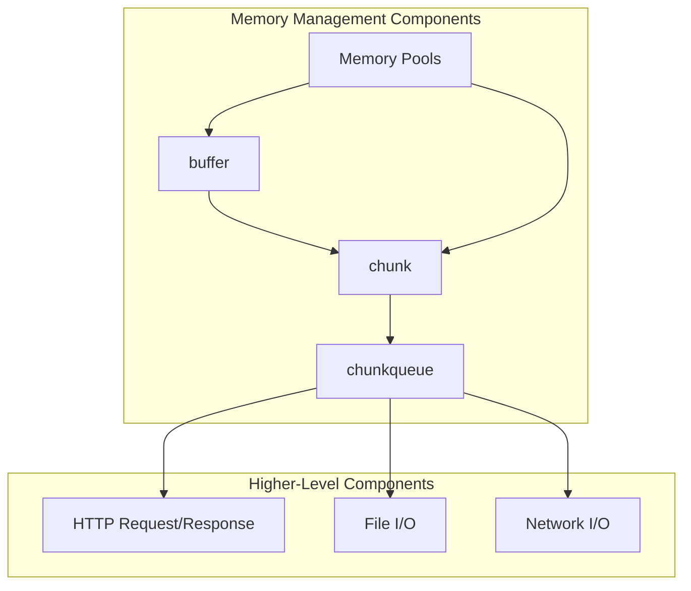

Sources: [src/buffer.h](https://github.com/lighttpd/lighttpd1.4/blob/3d550097/src/buffer.h)

 [src/chunk.h](https://github.com/lighttpd/lighttpd1.4/blob/3d550097/src/chunk.h)

 [src/buffer.c](https://github.com/lighttpd/lighttpd1.4/blob/3d550097/src/buffer.c)

 [src/chunk.c](https://github.com/lighttpd/lighttpd1.4/blob/3d550097/src/chunk.c)

## Buffer System

The buffer is the most fundamental memory management structure in lighttpd. It's a generic container for both text strings and binary data, with automatic memory management.

### Buffer Structure

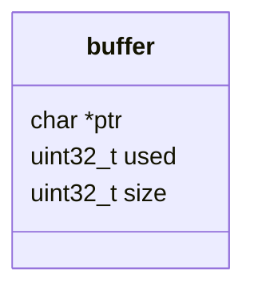

Fields explanation:

* `ptr`: The actual memory pointer
* `used`: Number of bytes used including a terminating NUL (0 for empty state)
* `size`: Size of allocated buffer at *ptr

Sources: [src/buffer.h L22-L29](https://github.com/lighttpd/lighttpd1.4/blob/3d550097/src/buffer.h#L22-L29)

### Buffer Lifecycle

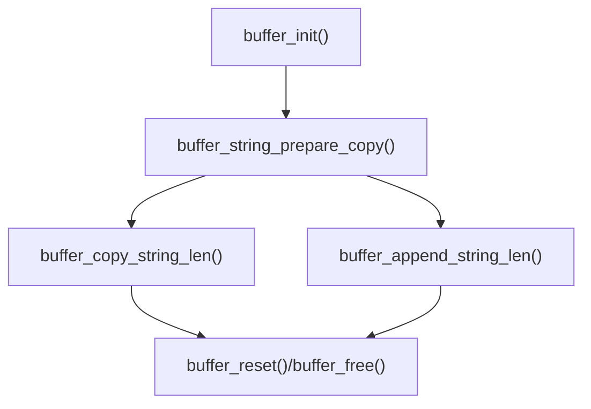

The buffer system uses power-of-2 sizing for efficiency and includes optimizations to minimize reallocations.

Key buffer operations:

* Creation: `buffer_init()`
* Preparation: `buffer_string_prepare_copy()`, `buffer_string_prepare_append()`
* Modification: `buffer_copy_string_len()`, `buffer_append_string_len()`, etc.
* Cleanup: `buffer_reset()`, `buffer_free()`

Sources: [src/buffer.c L14-L23](https://github.com/lighttpd/lighttpd1.4/blob/3d550097/src/buffer.c#L14-L23)

 [src/buffer.c L49-L65](https://github.com/lighttpd/lighttpd1.4/blob/3d550097/src/buffer.c#L49-L65)

 [src/buffer.c L96-L121](https://github.com/lighttpd/lighttpd1.4/blob/3d550097/src/buffer.c#L96-L121)

 [src/buffer.c L172-L179](https://github.com/lighttpd/lighttpd1.4/blob/3d550097/src/buffer.c#L172-L179)

 [src/buffer.c L198-L200](https://github.com/lighttpd/lighttpd1.4/blob/3d550097/src/buffer.c#L198-L200)

## Chunk System

Chunks are data containers that can hold either memory blocks (MEM_CHUNK) or file references (FILE_CHUNK). They form the building blocks for data processing in lighttpd.

### Chunk Structure

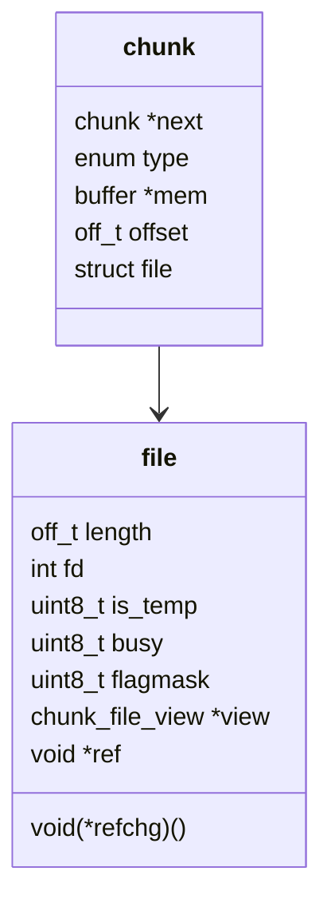

The chunk can represent two types of data:

* **MEM_CHUNK**: In-memory data stored in `mem` buffer
* **FILE_CHUNK**: File data referenced by `fd` with `length` and `offset`

Sources: [src/chunk.h L20-L46](https://github.com/lighttpd/lighttpd1.4/blob/3d550097/src/chunk.h#L20-L46)

### Chunk Management

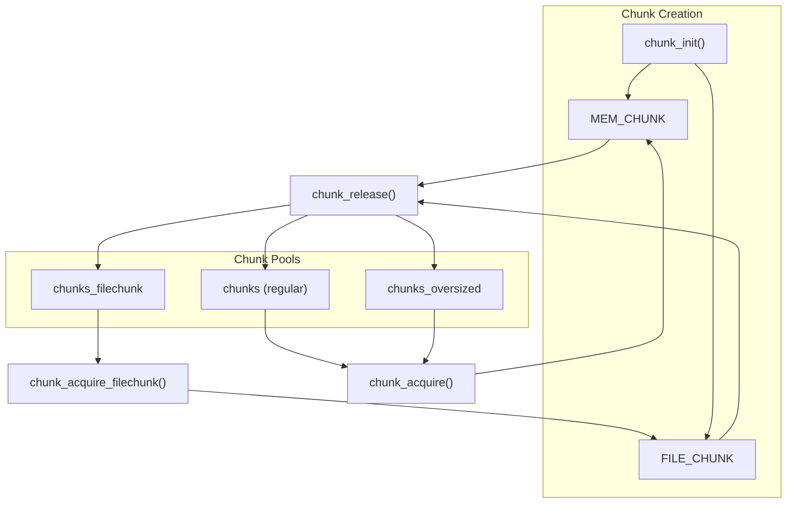

The chunk system reuses chunks through several pools:

* `chunks`: Regular-sized memory chunks (default 8K)
* `chunks_oversized`: Larger memory chunks
* `chunks_filechunk`: Chunks for file references

Sources: [src/chunk.c L110-L127](https://github.com/lighttpd/lighttpd1.4/blob/3d550097/src/chunk.c#L110-L127)

 [src/chunk.c L432-L451](https://github.com/lighttpd/lighttpd1.4/blob/3d550097/src/chunk.c#L432-L451)

 [src/chunk.c L453-L472](https://github.com/lighttpd/lighttpd1.4/blob/3d550097/src/chunk.c#L453-L472)

 [src/chunk.c L474-L482](https://github.com/lighttpd/lighttpd1.4/blob/3d550097/src/chunk.c#L474-L482)

## Chunkqueue System

Chunkqueues are ordered sequences of chunks, used extensively for buffering and streaming data between different parts of the server.

### Chunkqueue Structure

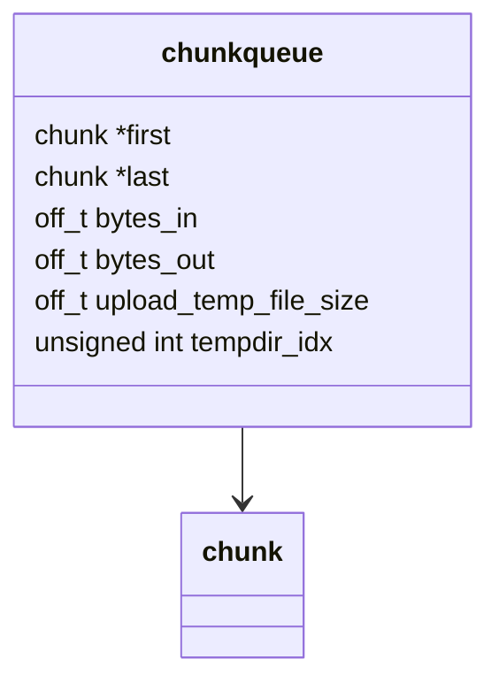

Chunkqueues maintain pointers to the first and last chunks in the queue, along with accounting information about bytes transferred.

Sources: [src/chunk.h L48-L56](https://github.com/lighttpd/lighttpd1.4/blob/3d550097/src/chunk.h#L48-L56)

### Chunkqueue Operations

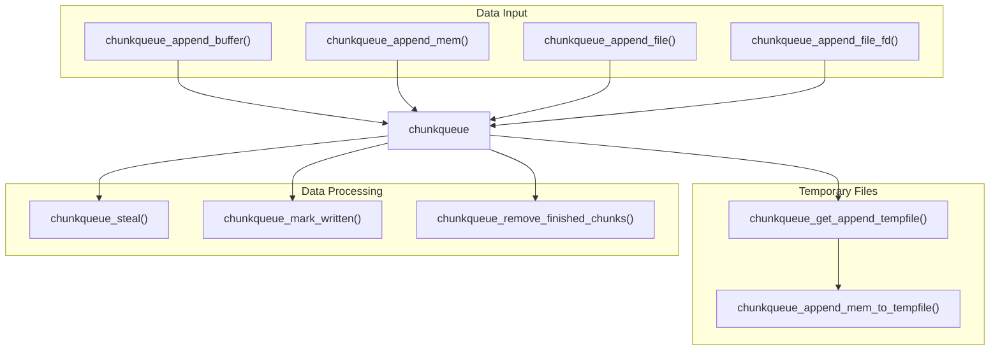

Key operations:

* Adding data: `chunkqueue_append_mem()`, `chunkqueue_append_buffer()`, `chunkqueue_append_file()`
* Processing: `chunkqueue_mark_written()`, `chunkqueue_remove_finished_chunks()`
* Temporary file handling: `chunkqueue_append_mem_to_tempfile()`

Sources: [src/chunk.c L94-L107](https://github.com/lighttpd/lighttpd1.4/blob/3d550097/src/chunk.c#L94-L107)

 [src/chunk.c L616-L638](https://github.com/lighttpd/lighttpd1.4/blob/3d550097/src/chunk.c#L616-L638)

 [src/chunk.c L979-L1031](https://github.com/lighttpd/lighttpd1.4/blob/3d550097/src/chunk.c#L979-L1031)

## Memory Pooling

Lighttpd uses memory pooling extensively to reduce the overhead of frequent allocations and deallocations.

### Memory Pool Types

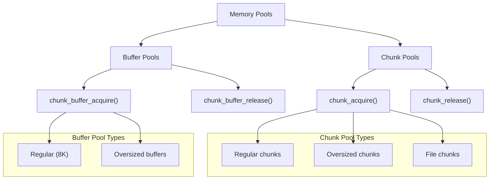

The memory pooling system maintains several different pools:

* Buffer pools for string/memory operations
* Chunk pools for data handling
* Specialized pools for different sizes and types

Sources: [src/chunk.c L350-L379](https://github.com/lighttpd/lighttpd1.4/blob/3d550097/src/chunk.c#L350-L379)

 [src/chunk.c L381-L414](https://github.com/lighttpd/lighttpd1.4/blob/3d550097/src/chunk.c#L381-L414)

 [src/chunk.c L432-L472](https://github.com/lighttpd/lighttpd1.4/blob/3d550097/src/chunk.c#L432-L472)

### Buffer Pooling Details

The buffer pooling system maintains a pool of fixed-size buffers (default 8KB) and a separate pool for oversized buffers:

```
buffer_string_prepare_copy() -> check existing buffer size -> reuse or allocate new
buffer release -> add to appropriate pool if size matches conditions
```

Key functions:

* `chunk_buffer_acquire()`: Get a buffer from the pool (or allocate new)
* `chunk_buffer_release()`: Return a buffer to the pool (or free if too large)
* `chunk_buffer_yield()`: Replace oversized buffer with regular-sized one

Sources: [src/chunk.c L381-L383](https://github.com/lighttpd/lighttpd1.4/blob/3d550097/src/chunk.c#L381-L383)

 [src/chunk.c L385-L404](https://github.com/lighttpd/lighttpd1.4/blob/3d550097/src/chunk.c#L385-L404)

 [src/chunk.c L406-L414](https://github.com/lighttpd/lighttpd1.4/blob/3d550097/src/chunk.c#L406-L414)

## Temporary File Management

For handling large amounts of data efficiently, the chunkqueue system can offload data to temporary files.

### Temporary File Process

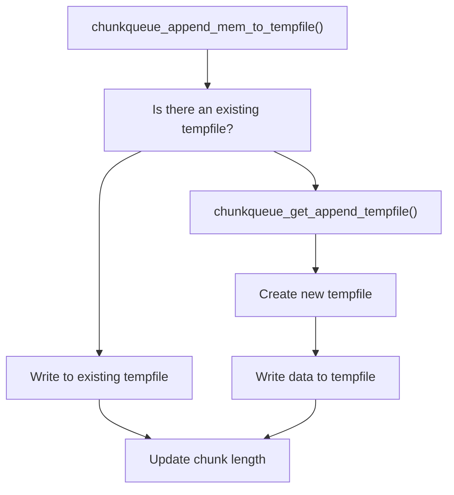

When memory usage would be excessive, data is written to temporary files:

* Uses configured temporary directories
* Creates unique temporary files
* Switches to file-based processing for large data

Sources: [src/chunk.c L979-L1031](https://github.com/lighttpd/lighttpd1.4/blob/3d550097/src/chunk.c#L979-L1031)

 [src/chunk.c L910-L895](https://github.com/lighttpd/lighttpd1.4/blob/3d550097/src/chunk.c#L910-L895)

 [src/chunk.c L845-L895](https://github.com/lighttpd/lighttpd1.4/blob/3d550097/src/chunk.c#L845-L895)

## Memory Usage in HTTP Processing

The memory management systems are used extensively throughout HTTP request and response processing.

### HTTP Response Generation

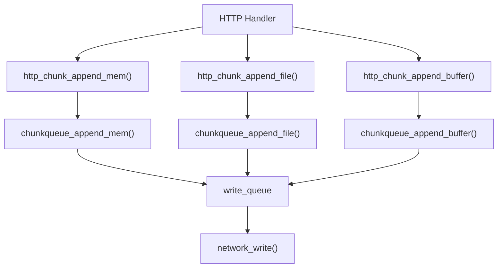

When generating HTTP responses:

1. Handlers use `http_chunk_*` functions to add data to the response
2. These functions append to the response's write_queue (a chunkqueue)
3. The network system efficiently writes the data to the client

Sources: [src/http_chunk.c L38-L52](https://github.com/lighttpd/lighttpd1.4/blob/3d550097/src/http_chunk.c#L38-L52)

 [src/http_chunk.c L111-L121](https://github.com/lighttpd/lighttpd1.4/blob/3d550097/src/http_chunk.c#L111-L121)

 [src/http_chunk.c L123-L133](https://github.com/lighttpd/lighttpd1.4/blob/3d550097/src/http_chunk.c#L123-L133)

## Performance Considerations

The memory management system is optimized for web server workloads with several key considerations:

| Feature | Purpose | Performance Impact |
| --- | --- | --- |
| Memory Pools | Reduce allocation/deallocation | Fewer syscalls, less fragmentation |
| Power-of-2 Sizing | Efficient memory use | Better alignment, less waste |
| Chunk Reuse | Avoid frequent allocation | Lower CPU usage under load |
| Temporary Files | Handle large data efficiently | Reduced memory pressure |
| Buffer Yield | Replace oversized buffers | Memory optimization |

Key performance optimizations:

* Fixed-size pools for common operations
* Specialized pools for different data sizes and types
* Automatic spillover to disk for large data sets
* Intelligent buffer sizing to reduce reallocations

Sources: [src/chunk.c L66-L72](https://github.com/lighttpd/lighttpd1.4/blob/3d550097/src/chunk.c#L66-L72)

 [src/buffer.c L49-L65](https://github.com/lighttpd/lighttpd1.4/blob/3d550097/src/buffer.c#L49-L65)

 [src/chunk.c L910-L895](https://github.com/lighttpd/lighttpd1.4/blob/3d550097/src/chunk.c#L910-L895)

## Relationship with Other Systems

The memory management system interacts with several other lighttpd subsystems:

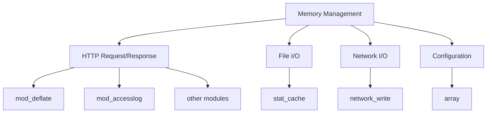

The buffer and chunk systems are foundational components used throughout the codebase:

* HTTP processing uses chunkqueues for request and response data
* Modules like mod_deflate use the chunk system for data transformations
* The network subsystem uses chunkqueues for efficient I/O
* File access is optimized through the chunk system

Sources: [src/mod_deflate.c L244-L264](https://github.com/lighttpd/lighttpd1.4/blob/3d550097/src/mod_deflate.c#L244-L264)

 [src/mod_accesslog.c L617-L643](https://github.com/lighttpd/lighttpd1.4/blob/3d550097/src/mod_accesslog.c#L617-L643)

 [src/network_write.c L141-L170](https://github.com/lighttpd/lighttpd1.4/blob/3d550097/src/network_write.c#L141-L170)

## Conclusion

Lighttpd's memory management system provides an efficient foundation for the web server's operation. Through careful design and optimization, it minimizes memory allocations, reduces fragmentation, and handles large data sets efficiently. The combination of buffers, chunks, chunkqueues, and memory pools creates a flexible yet high-performance system suited to web server workloads.