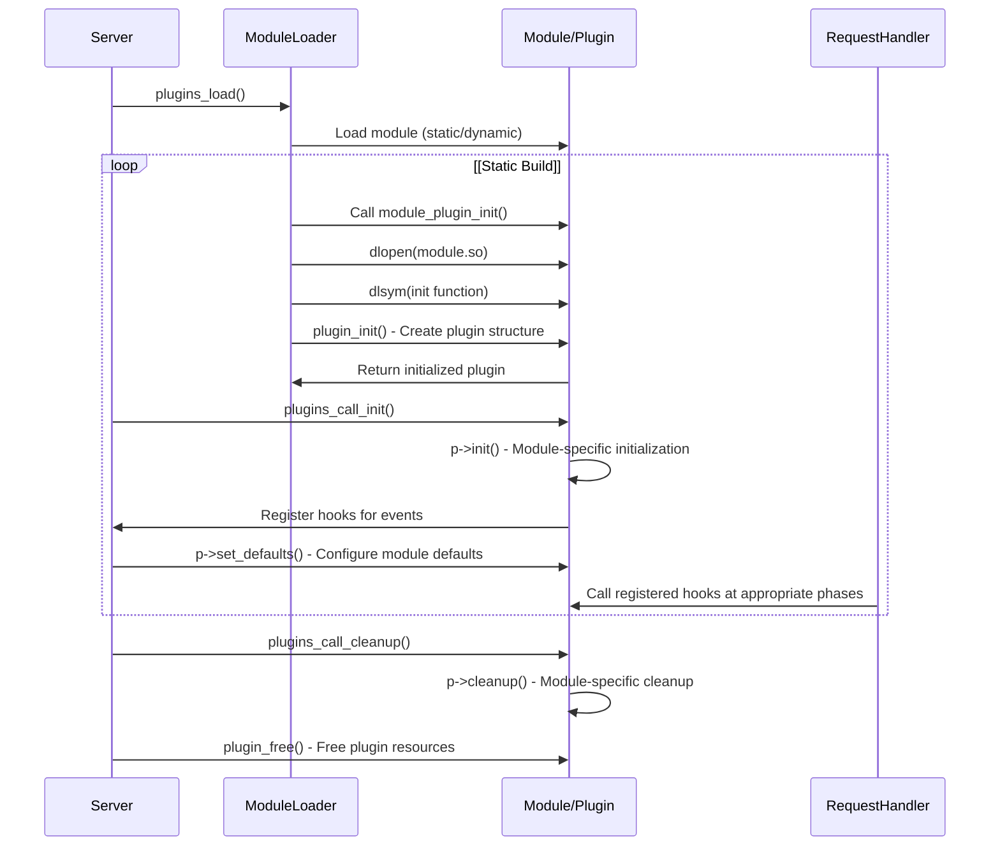
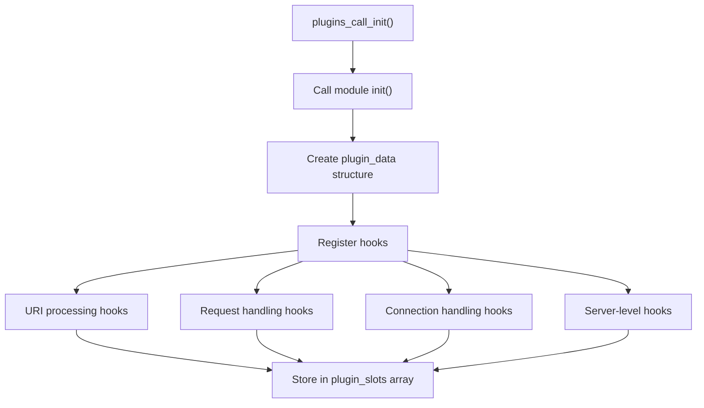
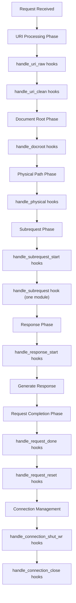
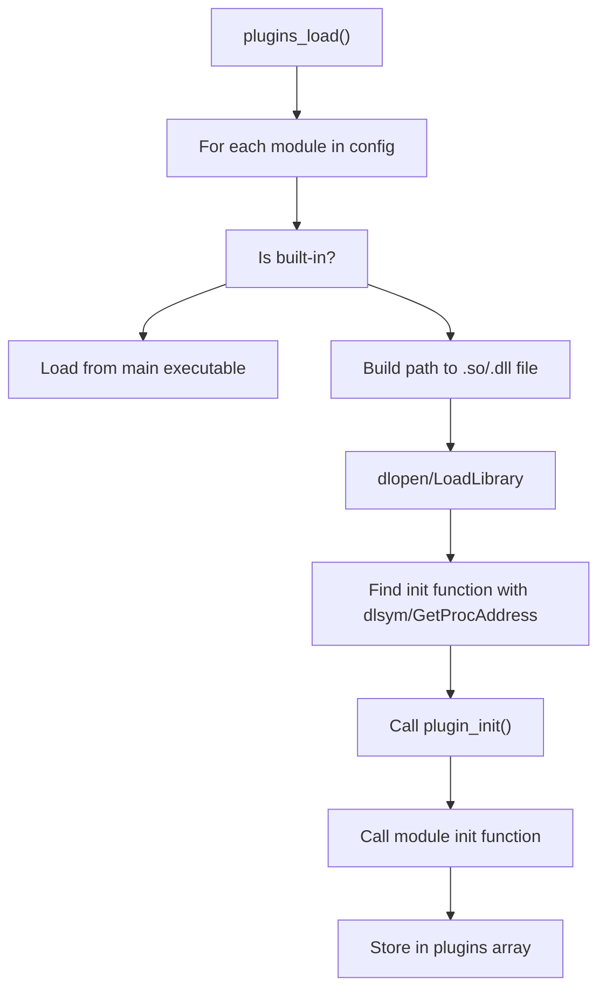
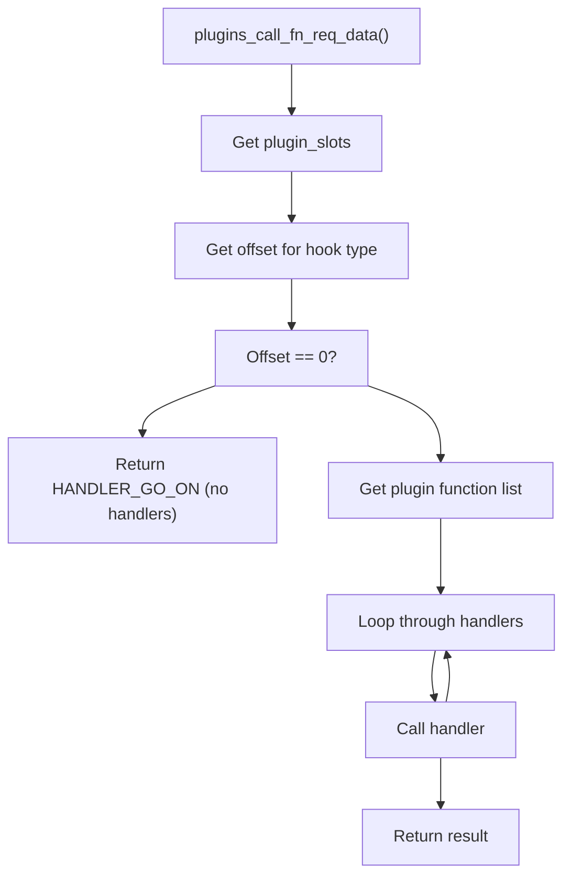

# Module System

> **Relevant source files**
> * [NEWS](https://github.com/lighttpd/lighttpd1.4/blob/3d550097/NEWS)
> * [src/base.h](https://github.com/lighttpd/lighttpd1.4/blob/3d550097/src/base.h)
> * [src/configfile.c](https://github.com/lighttpd/lighttpd1.4/blob/3d550097/src/configfile.c)
> * [src/connections.c](https://github.com/lighttpd/lighttpd1.4/blob/3d550097/src/connections.c)
> * [src/network.c](https://github.com/lighttpd/lighttpd1.4/blob/3d550097/src/network.c)
> * [src/plugin.c](https://github.com/lighttpd/lighttpd1.4/blob/3d550097/src/plugin.c)
> * [src/plugin.h](https://github.com/lighttpd/lighttpd1.4/blob/3d550097/src/plugin.h)
> * [src/server.c](https://github.com/lighttpd/lighttpd1.4/blob/3d550097/src/server.c)

The lighttpd module system provides an extensible framework for adding functionality to the web server through plugins. This document explains the architecture of lighttpd's module system, how modules are loaded and initialized, the hook points available for modules, and how these modules interact with the request processing pipeline.

For information about specific modules and their capabilities, see [Static Content Serving](/lighttpd/lighttpd1.4/4.1-static-content-serving), [Dynamic Content and Backend Communication](/lighttpd/lighttpd1.4/4.2-dynamic-content-and-backend-communication), [URL Rewriting and Manipulation](/lighttpd/lighttpd1.4/4.3-url-rewriting-and-manipulation), [Authentication and Authorization](/lighttpd/lighttpd1.4/4.4-authentication-and-authorization), and [SSL/TLS Support](/lighttpd/lighttpd1.4/4.5-ssltls-support).

## Module Architecture

Lighttpd uses a flexible plugin architecture where server functionality is organized into modules that can hook into various stages of request processing. Each module is structured as a plugin that registers handlers for specific events in the server lifecycle and request processing pipeline.

```

```

Sources: [src/plugin.h L40-L76](https://github.com/lighttpd/lighttpd1.4/blob/3d550097/src/plugin.h#L40-L76)

## Module Types and Categories

Lighttpd modules can be categorized based on their functionality:

```mermaid
flowchart TD

A["Lighttpd Modules"]
B["Core Modules"]
C["Gateway Modules"]
D["SSL/TLS Modules"]
E["Content Processing"]
F["Authentication Modules"]
B1["mod_access"]
B2["mod_accesslog"]
B3["mod_rewrite"]
B4["mod_redirect"]
B5["mod_staticfile"]
B6["mod_dirlisting"]
B7["mod_indexfile"]
C1["mod_fastcgi"]
C2["mod_cgi"]
C3["mod_proxy"]
C4["mod_scgi"]
D1["mod_openssl"]
D2["mod_mbedtls"]
D3["mod_wolfssl"]
D4["mod_gnutls"]
D5["mod_nss"]
E1["mod_deflate"]
E2["mod_webdav"]
E3["mod_magnet"]
E4["mod_ssi"]
F1["mod_auth"]
F2["mod_authn_file"]
F3["mod_authn_ldap"]
F4["mod_authn_mysql"]

A --> B
A --> C
A --> D
A --> E
A --> F
B --> B1
B --> B2
B --> B3
B --> B4
B --> B5
B --> B6
B --> B7
C --> C1
C --> C2
C --> C3
C --> C4
D --> D1
D --> D2
D --> D3
D --> D4
D --> D5
E --> E1
E --> E2
E --> E3
E --> E4
F --> F1
F --> F2
F --> F3
F --> F4
```



Sources: [src/configfile.c L395-L472](https://github.com/lighttpd/lighttpd1.4/blob/3d550097/src/configfile.c#L395-L472)

## Module Lifecycle

The module lifecycle in lighttpd consists of several phases: loading, initialization, hook registration, execution, and cleanup.



Sources: [src/plugin.c L52-L593](https://github.com/lighttpd/lighttpd1.4/blob/3d550097/src/plugin.c#L52-L593)

### Module Loading

Modules can be loaded statically (compiled directly into the server) or dynamically (loaded at runtime from shared libraries).

#### Static Loading

Modules are compiled directly into the server and loaded through a table of initialization functions.

#### Dynamic Loading

Modules are loaded from shared libraries (.so files on Unix, .dll files on Windows) using dlopen/LoadLibrary.

Sources: [src/plugin.c L85-L254](https://github.com/lighttpd/lighttpd1.4/blob/3d550097/src/plugin.c#L85-L254)

### Initialization and Hook Registration

After loading, each module is initialized and registers handlers for various hook points in the request processing pipeline.



Sources: [src/plugin.c L447-L579](https://github.com/lighttpd/lighttpd1.4/blob/3d550097/src/plugin.c#L447-L579)

## Hook Points

Modules can register handlers for various stages of request processing, connection handling, and server-level events.

### Request Processing Hooks

* `handle_uri_raw`: Called after the raw URI is set
* `handle_uri_clean`: Called after the URI is cleaned/normalized
* `handle_docroot`: Called when determining the document root
* `handle_physical`: Called when mapping URL to physical path
* `handle_subrequest_start`: Called when handling a subrequest start
* `handle_subrequest`: Main handler for a request (one per request)
* `handle_response_start`: Called before response headers are written
* `handle_request_done`: Called at the end of a request
* `handle_request_reset`: Called after request done or request abort
* `handle_request_env`: Called for deferred environment population

### Connection Handling Hooks

* `handle_connection_accept`: Called after accepting a socket
* `handle_connection_shut_wr`: Called when done writing to socket
* `handle_connection_close`: Called before closing a socket

### Server-Level Hooks

* `handle_trigger`: Called periodically (once a second)
* `handle_sighup`: Called when the server receives SIGHUP signal
* `handle_waitpid`: Called upon a child process exit
* `set_defaults`: Called to set module configuration defaults
* `worker_init`: Called at server startup for each worker

Sources: [src/plugin.h L46-L70](https://github.com/lighttpd/lighttpd1.4/blob/3d550097/src/plugin.h#L46-L70)

 [src/plugin.c L31-L53](https://github.com/lighttpd/lighttpd1.4/blob/3d550097/src/plugin.c#L31-L53)

## Module Hook Execution Flow

When a request is processed, lighttpd calls the registered module hooks at appropriate phases.



Sources: [src/connections.c L637-L704](https://github.com/lighttpd/lighttpd1.4/blob/3d550097/src/connections.c#L637-L704)

## Module Registration in Configuration

Modules are registered in the lighttpd configuration file using the `server.modules` directive:

```markdown
server.modules = (
    "mod_access",
    "mod_accesslog",
    "mod_auth",
    "mod_rewrite",
    # Additional modules...
    "mod_staticfile"  # Should generally be last
)
```

The order of modules in this list is important, as it determines the order in which hooks are called.

Sources: [src/configfile.c L294-L471](https://github.com/lighttpd/lighttpd1.4/blob/3d550097/src/configfile.c#L294-L471)

## Inside the Plugin Structure

When writing a module or understanding how existing modules work, it's important to know the structure of a plugin and how it interacts with the server.

Each module implements a subset of the hook functions defined in the `plugin` structure. The module's data is stored in a module-specific structure that extends `plugin_data_base`.

```python
typedef struct {
	PLUGIN_DATA;  // Expands to: int id; int nconfig; config_plugin_value_t *cvlist; struct plugin *self
	
	// Module-specific configuration and state
	specific_config defaults;
	// Other fields...
} plugin_data;
```

Sources: [src/plugin.h L35-L42](https://github.com/lighttpd/lighttpd1.4/blob/3d550097/src/plugin.h#L35-L42)

## Module Loading Implementation

Let's look at how modules are loaded in practice:

### Dynamic Loading



The dynamic loading process includes:

1. Looking for the module in the main executable first
2. If not found, constructing the path to the shared library
3. Loading the shared library with dlopen/LoadLibrary
4. Finding the initialization function with dlsym/GetProcAddress
5. Calling the module's initialization function

Sources: [src/plugin.c L152-L253](https://github.com/lighttpd/lighttpd1.4/blob/3d550097/src/plugin.c#L152-L253)

### Static Loading

In a static build, modules are compiled into the server and loaded directly from a table of initialization functions:

```javascript
static const plugin_load_functions load_functions[] = {
    { "mod_access", &mod_access_plugin_init },
    { "mod_accesslog", &mod_accesslog_plugin_init },
    // Other modules...
    { NULL, NULL }
};
```

Sources: [src/plugin.c L102-L110](https://github.com/lighttpd/lighttpd1.4/blob/3d550097/src/plugin.c#L102-L110)

## Hook Dispatching

When a hook needs to be called, lighttpd dispatches to all registered handlers for that hook:



This dispatcher calls each registered handler in sequence until one returns a value other than `HANDLER_GO_ON` or until all handlers have been called.

Sources: [src/plugin.c L286-L297](https://github.com/lighttpd/lighttpd1.4/blob/3d550097/src/plugin.c#L286-L297)

 [src/plugin.c L342-L351](https://github.com/lighttpd/lighttpd1.4/blob/3d550097/src/plugin.c#L342-L351)

## Module Configuration

Modules obtain their configuration from the server configuration system. This typically happens in the `set_defaults` hook:

```python
SETDEFAULTS_FUNC(mod_example_set_defaults) {
    plugin_data *p = p_d;
    
    if (!p) return HANDLER_GO_ON;
    
    // Set default values
    memset(&p->defaults, 0, sizeof(plugin_config));
    p->defaults.enabled = 0;
    
    // Parse configuration values from the server config
    return config_plugin_values_init(srv, p, cpk, "mod_example");
}
```

Configuration values are accessed in request handlers using the module's context data.

Sources: [src/plugin_config.h L20-L52](https://github.com/lighttpd/lighttpd1.4/blob/3d550097/src/plugin_config.h#L20-L52)

## Conclusion

The lighttpd module system provides a flexible and extensible architecture for adding functionality to the web server. Modules can hook into various stages of request processing, connection handling, and server-level events, allowing for a wide range of extensions while maintaining a clean separation of concerns.

The system supports both static and dynamic loading of modules, making it adaptable to different deployment scenarios. The hook-based architecture ensures that modules can interact with the request processing pipeline in a controlled and efficient manner.

Understanding the module system is key to both using lighttpd effectively and developing custom extensions for specific requirements.

Sources: [src/plugin.h L1-L77](https://github.com/lighttpd/lighttpd1.4/blob/3d550097/src/plugin.h#L1-L77)

 [src/plugin.c L1-L595](https://github.com/lighttpd/lighttpd1.4/blob/3d550097/src/plugin.c#L1-L595)