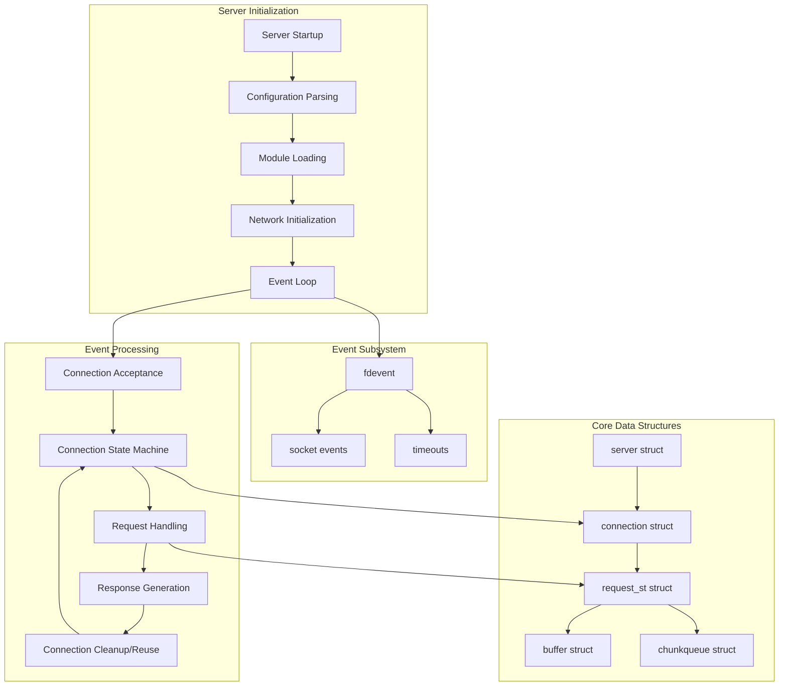
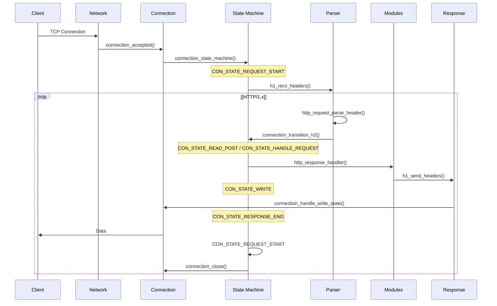
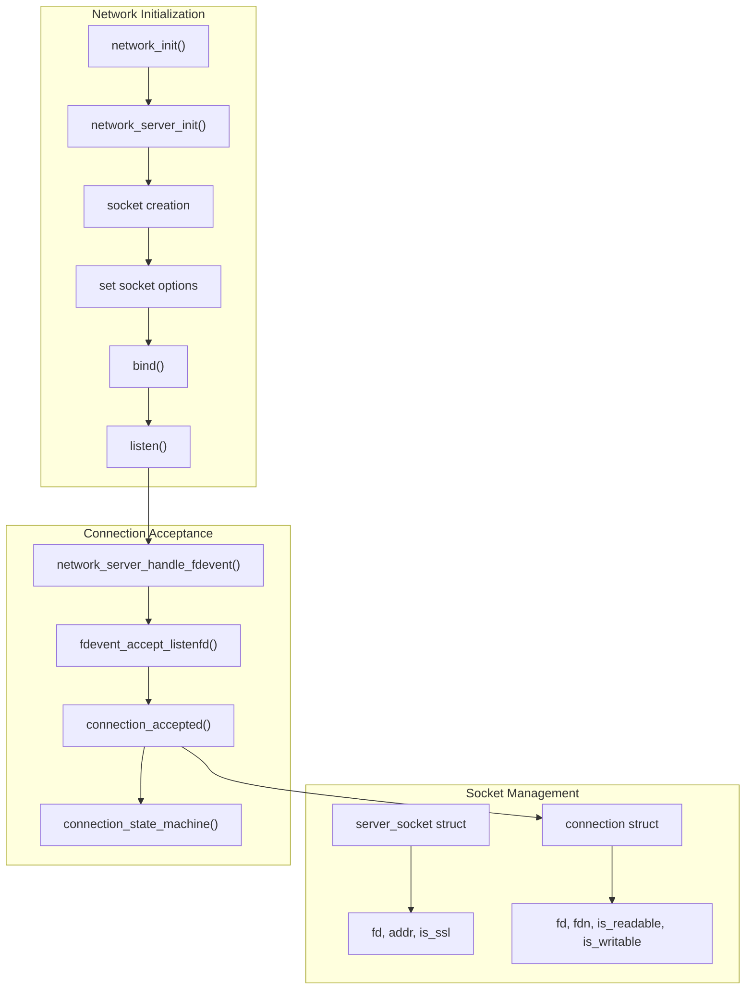
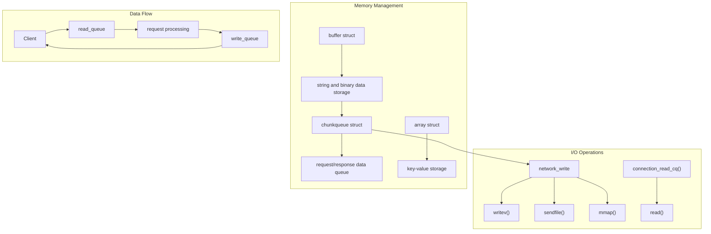
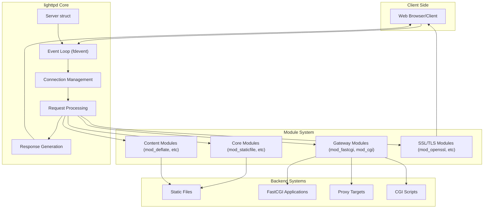

# Overview of lighttpd

> **Relevant source files**
> * [NEWS](https://github.com/lighttpd/lighttpd1.4/blob/3d550097/NEWS)
> * [src/base.h](https://github.com/lighttpd/lighttpd1.4/blob/3d550097/src/base.h)
> * [src/configfile.c](https://github.com/lighttpd/lighttpd1.4/blob/3d550097/src/configfile.c)
> * [src/connections.c](https://github.com/lighttpd/lighttpd1.4/blob/3d550097/src/connections.c)
> * [src/network.c](https://github.com/lighttpd/lighttpd1.4/blob/3d550097/src/network.c)
> * [src/server.c](https://github.com/lighttpd/lighttpd1.4/blob/3d550097/src/server.c)

This document provides a comprehensive introduction to the lighttpd web server architecture, its core components, and how they work together. lighttpd (pronounced "lighty") is a lightweight, high-performance HTTP server designed with a focus on speed, efficiency, security, and flexibility. This page covers the fundamental architecture and concepts that form the foundation of the server.

For detailed information about specific subsystems, please refer to the corresponding pages in this wiki:

* For HTTP request processing details, see [HTTP Request Processing](/lighttpd/lighttpd1.4/1.2-http-request-processing)
* For configuration system details, see [Configuration System](/lighttpd/lighttpd1.4/2-configuration-system)
* For module system architecture, see [Module System](/lighttpd/lighttpd1.4/4-module-system)

## Purpose and Design Philosophy

lighttpd is built around these core principles:

* **Lightweight**: Small memory footprint and efficient CPU usage
* **High Performance**: Optimized for speed and concurrency
* **Security**: Focus on secure defaults and proper web standards implementation
* **Flexibility**: Modular architecture allowing extension through plugins
* **Scalability**: Designed to handle thousands of concurrent connections

The server follows an event-driven architecture with non-blocking I/O operations to efficiently manage connections without the overhead of creating a thread per connection.

## Core Architecture



Sources: [src/server.c L495-L544](https://github.com/lighttpd/lighttpd1.4/blob/3d550097/src/server.c#L495-L544)

 [src/server.c L548-L581](https://github.com/lighttpd/lighttpd1.4/blob/3d550097/src/server.c#L548-L581)

 [src/base.h L155-L206](https://github.com/lighttpd/lighttpd1.4/blob/3d550097/src/base.h#L155-L206)

 [src/connections.c L374-L390](https://github.com/lighttpd/lighttpd1.4/blob/3d550097/src/connections.c#L374-L390)

### Key Components

1. **Server**: The central structure (`struct server`) holding global state, configuration, and references to connections. It manages the event system and server sockets.
2. **Connections**: Represented by `struct connection`, each instance manages a client connection, including the socket, buffers, request data, and state.
3. **Request**: The `request_st` structure contains the HTTP request data, headers, processing state, and response information.
4. **Event System**: The `fdevent` subsystem manages socket readiness events (read/write) and timeouts through various backend implementations (epoll, kqueue, poll, etc.).
5. **Module System**: Provides extensibility through plugin hooks at various stages of request processing.

## Request Processing Flow

lighttpd processes requests through a state machine that transitions through different states from connection acceptance to response delivery:



Sources: [src/connections.c L632-L704](https://github.com/lighttpd/lighttpd1.4/blob/3d550097/src/connections.c#L632-L704)

 [src/connections.c L472-L494](https://github.com/lighttpd/lighttpd1.4/blob/3d550097/src/connections.c#L472-L494)

 [src/connections.c L317-L369](https://github.com/lighttpd/lighttpd1.4/blob/3d550097/src/connections.c#L317-L369)

### State Machine

The connection state machine (`connection_state_machine_loop()`) transitions between these main states:

1. **CON_STATE_REQUEST_START**: Initializes request processing.
2. **CON_STATE_READ**: Reads and parses HTTP headers from the client.
3. **CON_STATE_READ_POST**: Reads request body if present.
4. **CON_STATE_HANDLE_REQUEST**: Processes the request through modules.
5. **CON_STATE_WRITE**: Sends the response to the client.
6. **CON_STATE_RESPONSE_END**: Finalizes the response and either closes the connection or prepares for the next request.
7. **CON_STATE_CLOSE**: Performs connection cleanup before closing.

## Module System

lighttpd's functionality is extended through a flexible plugin architecture. Modules can register handlers for various stages of request processing:

```mermaid
flowchart TD

A["Plugin Registration"]
B["Hook Registration"]
C1["URI Handler Hooks"]
C2["Physical Path Hooks"]
C3["Request Handler Hooks"]
C4["Response Start Hooks"]
C5["Connection Close Hooks"]
D1["mod_rewrite"]
D2["mod_access"]
D3["mod_auth"]
D4["mod_staticfile"]
D5["mod_dirlisting"]
E1["mod_fastcgi"]
E2["mod_cgi"]
E3["mod_proxy"]
E4["mod_scgi"]
F1["mod_openssl"]
F2["mod_mbedtls"]
F3["mod_wolfssl"]
F4["mod_gnutls"]
F5["mod_nss"]

A --> D1
A --> D2
A --> D3
A --> D4
A --> D5
A --> E1
A --> E2
A --> E3
A --> F1
A --> F2
A --> F3

subgraph subGraph3 ["SSL/TLS Modules"]
    F1
    F2
    F3
    F4
    F5
end

subgraph subGraph2 ["Gateway Modules"]
    E1
    E2
    E3
    E4
end

subgraph subGraph1 ["Core Modules"]
    D1
    D2
    D3
    D4
    D5
end

subgraph subGraph0 ["Plugin Infrastructure"]
    A
    B
    C1
    C2
    C3
    C4
    C5
    A --> B
    B --> C1
    B --> C2
    B --> C3
    B --> C4
    B --> C5
end
```



Sources: [src/configfile.c L395-L543](https://github.com/lighttpd/lighttpd1.4/blob/3d550097/src/configfile.c#L395-L543)

Modules are loaded at server startup and can register handlers for different hooks in the request processing chain. The server provides several categories of modules:

1. **Core Modules**: Essential functionality like static file serving (`mod_staticfile`), directory listings (`mod_dirlisting`), URL rewriting (`mod_rewrite`), and access control (`mod_access`).
2. **Gateway Modules**: Handle communication with backend applications through various protocols like FastCGI (`mod_fastcgi`), CGI (`mod_cgi`), SCGI (`mod_scgi`), and general proxying (`mod_proxy`).
3. **SSL/TLS Modules**: Provide encryption capabilities through different libraries (`mod_openssl`, `mod_mbedtls`, `mod_wolfssl`, `mod_gnutls`).
4. **Content Processing Modules**: Handle specific content types or transformations, like compression (`mod_deflate`) or WebDAV (`mod_webdav`).

## Network and Connection Management

lighttpd's network subsystem handles socket creation, binding, and connection management:



Sources: [src/network.c L388-L697](https://github.com/lighttpd/lighttpd1.4/blob/3d550097/src/network.c#L388-L697)

 [src/network.c L57-L133](https://github.com/lighttpd/lighttpd1.4/blob/3d550097/src/network.c#L57-L133)

 [src/connections.c L589-L628](https://github.com/lighttpd/lighttpd1.4/blob/3d550097/src/connections.c#L589-L628)

lighttpd's network subsystem:

1. **Socket Creation**: Creates and configures sockets for listening based on server configuration.
2. **Connection Acceptance**: Accepts new connections from clients and initializes connection structures.
3. **I/O Operations**: Uses optimized read/write operations, including `writev()` and `sendfile()` where available.
4. **Event Notification**: Integrates with the event system to handle socket readiness events efficiently.

## Data Structures and Memory Management

lighttpd uses efficient data structures for memory management and I/O operations:



Sources: [src/connections.c L544-L586](https://github.com/lighttpd/lighttpd1.4/blob/3d550097/src/connections.c#L544-L586)

 [src/connections.c L583-L586](https://github.com/lighttpd/lighttpd1.4/blob/3d550097/src/connections.c#L583-L586)

 [src/connections.c L247-L313](https://github.com/lighttpd/lighttpd1.4/blob/3d550097/src/connections.c#L247-L313)

### Key Data Structures

1. **buffer**: A flexible buffer for string and binary data with automatic memory management.
2. **chunkqueue**: A queue of memory chunks and file references for efficient I/O without unnecessary copying.
3. **array**: Key-value storage used for configuration and request properties.

### I/O Operations

1. **network_write**: Efficient writing to sockets using `writev()` for memory chunks and `sendfile()` for files.
2. **connection_read_cq**: Reads data from sockets into memory buffers.
3. **stat_cache**: Caches file metadata to avoid repeated file system calls.

## Configuration System

lighttpd uses a flexible configuration system that supports conditional blocks based on various criteria:

```

```

Sources: [src/configfile.c L233-L234](https://github.com/lighttpd/lighttpd1.4/blob/3d550097/src/configfile.c#L233-L234)

 [src/configfile.c L91-L211](https://github.com/lighttpd/lighttpd1.4/blob/3d550097/src/configfile.c#L91-L211)

 [src/configfile.c L662-L763](https://github.com/lighttpd/lighttpd1.4/blob/3d550097/src/configfile.c#L662-L763)

The configuration system features:

1. **Configuration File Parsing**: Reads the configuration file and builds a hierarchical structure.
2. **Conditional Blocks**: Allows different configurations based on criteria like host, URL, or socket.
3. **Module Configuration**: Each module can register its configuration variables and handlers.
4. **Runtime Configuration Application**: The correct configuration is applied to each request based on its properties through the `config_patch_config()` function.

## Integration Overview

This diagram shows how the various components work together to handle client requests:



Sources: [src/server.c L472-L494](https://github.com/lighttpd/lighttpd1.4/blob/3d550097/src/server.c#L472-L494)

 [src/connections.c L826-L835](https://github.com/lighttpd/lighttpd1.4/blob/3d550097/src/connections.c#L826-L835)

 [src/configfile.c L395-L543](https://github.com/lighttpd/lighttpd1.4/blob/3d550097/src/configfile.c#L395-L543)

## Summary

lighttpd's architecture is built around efficiency and modularity. Key strengths include:

1. **Event-driven architecture**: Using non-blocking I/O and an event loop for handling many connections with minimal resources.
2. **Modular design**: A plugin system that allows functionality to be extended cleanly.
3. **Efficient memory management**: Buffer and chunkqueue systems minimize memory usage and copying.
4. **Scalable connection handling**: Connection pooling and state machine design enable handling thousands of concurrent connections.
5. **Flexible configuration**: Support for conditional configurations based on various request properties.

These features make lighttpd particularly suitable for high-traffic websites, serving static content efficiently, and as a front-end proxy for dynamic applications.