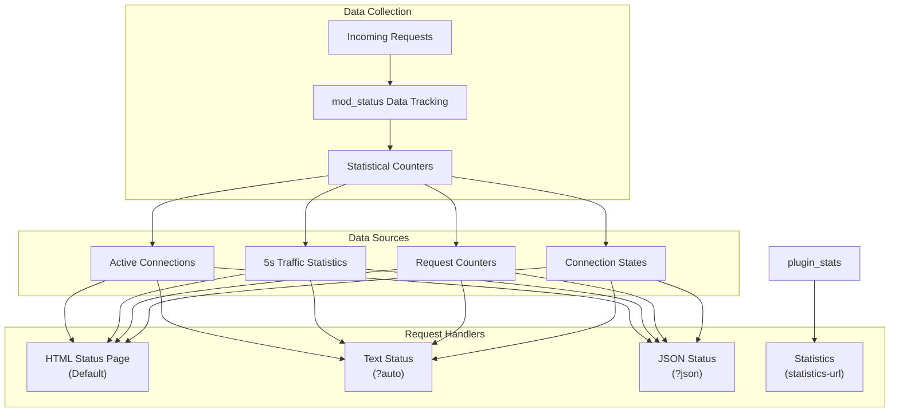
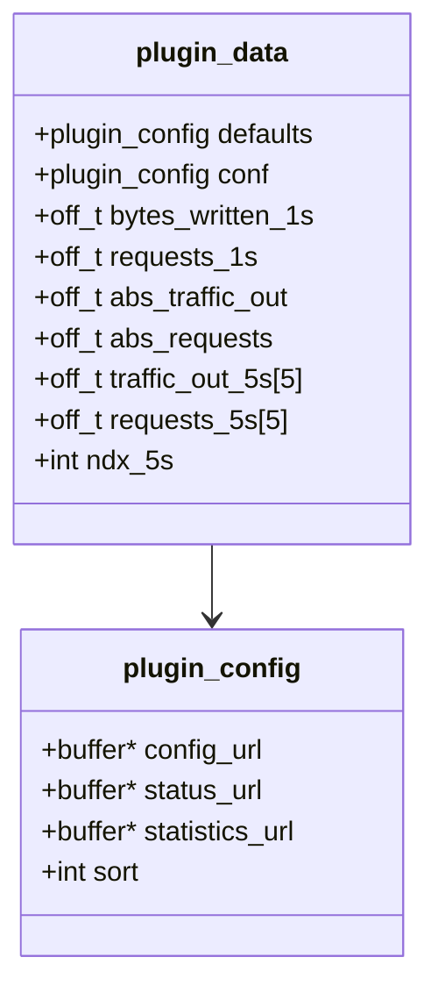
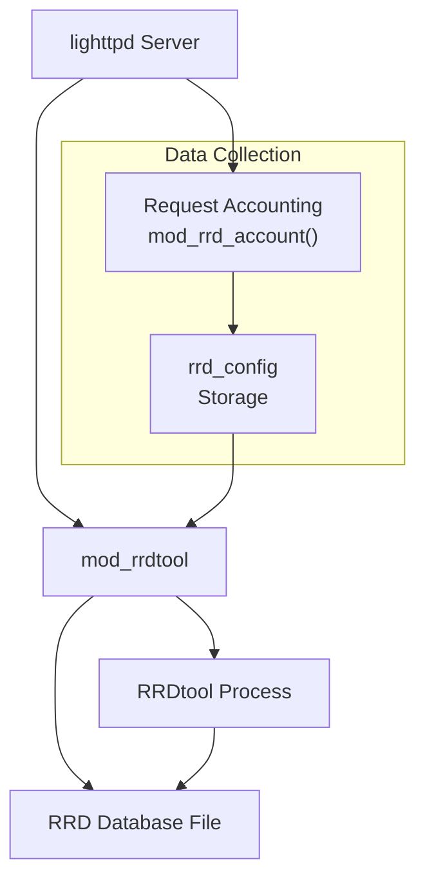
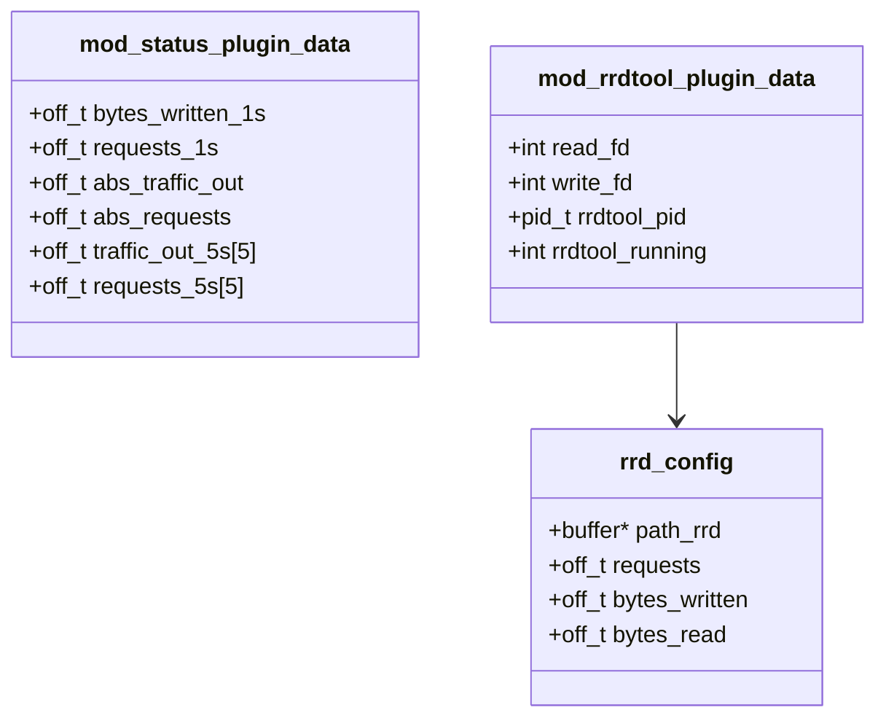

# Server Status Monitoring

> **Relevant source files**
> * [src/buffer.c](https://github.com/lighttpd/lighttpd1.4/blob/3d550097/src/buffer.c)
> * [src/buffer.h](https://github.com/lighttpd/lighttpd1.4/blob/3d550097/src/buffer.h)
> * [src/log.c](https://github.com/lighttpd/lighttpd1.4/blob/3d550097/src/log.c)
> * [src/log.h](https://github.com/lighttpd/lighttpd1.4/blob/3d550097/src/log.h)
> * [src/mod_accesslog.c](https://github.com/lighttpd/lighttpd1.4/blob/3d550097/src/mod_accesslog.c)
> * [src/mod_rrdtool.c](https://github.com/lighttpd/lighttpd1.4/blob/3d550097/src/mod_rrdtool.c)
> * [src/mod_status.c](https://github.com/lighttpd/lighttpd1.4/blob/3d550097/src/mod_status.c)

This document describes how lighttpd provides real-time server status monitoring and statistics collection. It covers the built-in status module (`mod_status`) that provides a web interface for server metrics and the optional RRDtool integration (`mod_rrdtool`) for persistent statistics storage and graphing. For information about request logging, see [Access Logging](/lighttpd/lighttpd1.4/5.1-access-logging).

## Overview

Lighttpd provides monitoring capabilities through two primary modules:

1. **mod_status** - Delivers real-time server status information via HTTP including connections, traffic statistics, and request information
2. **mod_rrdtool** - Enables long-term statistics collection using RRDtool for graphical analysis

These modules allow administrators to:

* Monitor server performance in real-time
* Track historical trends in server usage
* Troubleshoot performance issues
* Generate reports on server usage patterns

## Server Status Module Architecture

The status module (`mod_status`) collects and presents server statistics through configurable HTTP endpoints. It tracks metrics like connection counts, request rates, and traffic volumes.

### Architectural Overview



Sources: [src/mod_status.c L1-L42](https://github.com/lighttpd/lighttpd1.4/blob/3d550097/src/mod_status.c#L1-L42)

 [src/mod_status.c L135-L147](https://github.com/lighttpd/lighttpd1.4/blob/3d550097/src/mod_status.c#L135-L147)

### Data Collection

The status module collects several key metrics:

* **Traffic statistics**: Bytes in/out over 5-second intervals and absolute totals
* **Request statistics**: Request counts (per second, 5-second average, total)
* **Connection states**: Number of connections in different states (read, write, close, etc.)
* **Connection details**: Client IPs, bytes transferred, request URIs, etc.

Data structures used for metrics collection:



Sources: [src/mod_status.c L19-L40](https://github.com/lighttpd/lighttpd1.4/blob/3d550097/src/mod_status.c#L19-L40)

## Configuration Options

The status module can be customized with the following configuration options:

| Option | Description | Default |
| --- | --- | --- |
| `status.status-url` | URL where the server status is available | Not set (disabled) |
| `status.config-url` | URL for configuration information | Not set (disabled) |
| `status.statistics-url` | URL for server statistics | Not set (disabled) |
| `status.enable-sort` | Enable sorting in the HTML output | 1 (enabled) |

Example configuration:

```markdown
# Enable status module
status.status-url = "/server-status"
status.statistics-url = "/server-statistics"
status.enable-sort = 1
```

Sources: [src/mod_status.c L80-L133](https://github.com/lighttpd/lighttpd1.4/blob/3d550097/src/mod_status.c#L80-L133)

## Status Output Formats

The status module provides multiple output formats to support different use cases:

### HTML Format (Default)

When accessing the status URL without special query parameters, a human-readable HTML page is displayed with:

* Server hostname and uptime
* Absolute and relative traffic statistics
* 5-second average statistics
* Visual representation of active connections
* Detailed connection table (clients, request details, states)

The HTML view supports client-side sorting (when `status.enable-sort` is enabled).

Sources: [src/mod_status.c L265-L549](https://github.com/lighttpd/lighttpd1.4/blob/3d550097/src/mod_status.c#L265-L549)

 [src/mod_status.c L136-L147](https://github.com/lighttpd/lighttpd1.4/blob/3d550097/src/mod_status.c#L136-L147)

### Plain Text Format (?auto)

Adding `?auto` to the status URL produces a plain text output suitable for automated processing:

```yaml
Total Accesses: 1234
Total kBytes: 5678
Uptime: 3600
BusyServers: 5
IdleServers: 45
Scoreboard: kWRKWRRK...
```

This format is compatible with monitoring tools that parse Apache-style status output.

Sources: [src/mod_status.c L552-L585](https://github.com/lighttpd/lighttpd1.4/blob/3d550097/src/mod_status.c#L552-L585)

### JSON Format (?json or ?jsonp)

Adding `?json` to the status URL returns the data in JSON format for programmatic access:

```json
{
  "RequestsTotal": 1234,
  "TrafficTotal": 5678,
  "Uptime": 3600,
  "BusyServers": 5,
  "IdleServers": 45,
  "RequestAverage5s": 12,
  "TrafficAverage5s": 240
}
```

For JSONP support, use `?jsonp=callback_function_name`.

Sources: [src/mod_status.c L588-L652](https://github.com/lighttpd/lighttpd1.4/blob/3d550097/src/mod_status.c#L588-L652)

## Status Page Information

The status page provides these key metrics:

### Server Information

* Hostname and server version
* Server uptime (days, hours, minutes, seconds)
* Start time

### Traffic Statistics

* Total requests since server start
* Total traffic since server start
* Average requests per second
* Average traffic per second
* 5-second sliding averages for requests and traffic

### Connection Information

* Current number of connections
* Visual representation of connection states
* Table showing connection states count

### Connection Details Table

The detailed connection table shows:

* Client IP address
* Bytes read/written
* Connection state
* Connection time
* Hostname
* Request URI
* Physical file path

## RRDtool Integration

The `mod_rrdtool` module provides persistent statistics storage and graphing capabilities by integrating with the RRDtool database.



Sources: [src/mod_rrdtool.c L19-L449](https://github.com/lighttpd/lighttpd1.4/blob/3d550097/src/mod_rrdtool.c#L19-L449)

### RRDtool Configuration

| Option | Description | Default |
| --- | --- | --- |
| `rrdtool.db-name` | Path to the RRD database file | Not set (disabled) |
| `rrdtool.binary` | Path to the RRDtool executable | `/usr/bin/rrdtool` |

Example configuration:

```markdown
# Enable RRDtool statistics
rrdtool.binary = "/usr/bin/rrdtool"
rrdtool.db-name = "/var/lib/lighttpd/lighttpd.rrd"
```

Sources: [src/mod_rrdtool.c L161-L217](https://github.com/lighttpd/lighttpd1.4/blob/3d550097/src/mod_rrdtool.c#L161-L217)

### RRD Database Structure

The module creates an RRD database with the following data sources:

* **InOctets**: Bytes read (input traffic)
* **OutOctets**: Bytes written (output traffic)
* **Requests**: Number of requests

The database includes several Round Robin Archives (RRAs) for different time periods:

* 1-minute averages for the last 600 minutes
* 6-minute averages for the last 2.9 days
* 24-minute averages for the last 12.9 days
* 288-minute averages for the last 159.4 days

This structure allows for detailed recent data and long-term trends with data aggregation.

Sources: [src/mod_rrdtool.c L257-L316](https://github.com/lighttpd/lighttpd1.4/blob/3d550097/src/mod_rrdtool.c#L257-L316)

### Data Collection Process

1. For each request, `mod_rrd_account()` tracks bytes read, bytes written, and request count
2. Every minute, `mod_rrd_trigger()` calls `mod_rrd_write_data()` to update the RRD database
3. Communication with RRDtool happens through pipes, with the module spawning the RRDtool process
4. The module handles RRDtool process monitoring and automatic restarts if needed

Sources: [src/mod_rrdtool.c L318-L431](https://github.com/lighttpd/lighttpd1.4/blob/3d550097/src/mod_rrdtool.c#L318-L431)

## Implementation Details

### Server Status Data Structures

Both modules use specialized data structures to track metrics:



Sources: [src/mod_status.c L19-L40](https://github.com/lighttpd/lighttpd1.4/blob/3d550097/src/mod_status.c#L19-L40)

 [src/mod_rrdtool.c L19-L44](https://github.com/lighttpd/lighttpd1.4/blob/3d550097/src/mod_rrdtool.c#L19-L44)

### Data Collection Timing

The system uses different time intervals for data collection:

* **Real-time statistics**: Updated with each request
* **5-second averages**: For traffic and request rate smoothing
* **RRD updates**: Every 60 seconds

The time tracking is managed through the global `log_epoch_secs` variable which is updated by the server's event loop.

Sources: [src/log.h L7-L11](https://github.com/lighttpd/lighttpd1.4/blob/3d550097/src/log.h#L7-L11)

 [src/mod_status.c L452-L478](https://github.com/lighttpd/lighttpd1.4/blob/3d550097/src/mod_status.c#L452-L478)

 [src/mod_rrdtool.c L394-L404](https://github.com/lighttpd/lighttpd1.4/blob/3d550097/src/mod_rrdtool.c#L394-L404)

## Best Practices

### Security Considerations

The status module provides detailed information about your server that could be valuable to attackers. Consider these security measures:

1. Restrict access to status URLs using IP-based restrictions or authentication
2. Place status URLs on a non-public virtual host
3. Use non-obvious URLs for status pages

Example configuration with access restrictions:

```markdown
# Enable status page with access control
$HTTP["url"] =~ "^/server-status" {
    $HTTP["remoteip"] !~ "^(127\.0\.0\.1|10\.|192\.168\.|172\.16\.)" {
        url.access-deny = ("")
    }
}
status.status-url = "/server-status"
```

### Performance Impact

Both monitoring modules add minimal overhead:

* `mod_status` maintains in-memory counters with negligible impact
* `mod_rrdtool` updates statistics only once per minute to minimize disk I/O

For very high-traffic servers, consider:

* Using the RRDtool monitoring on only a subset of virtual hosts
* Monitoring during specific time periods rather than continuously

## Practical Usage Examples

### Monitoring Server Load Patterns

By regularly checking the status page, you can identify:

* Peak traffic times
* Potential DoS attacks (sudden traffic spikes)
* Slow connections that might be consuming resources
* Connection pool exhaustion

### Integration with External Monitoring

The text and JSON outputs allow for easy integration with external monitoring systems:

1. **Nagios/Icinga**: Use the `?auto` output for plugin development
2. **Grafana**: Use the JSON output to build custom dashboards
3. **Custom scripts**: Parse text or JSON output for email alerts or custom reports

### Troubleshooting with Status Information

During performance issues, the status page provides valuable information:

* Connection states may indicate blocked handlers or resource exhaustion
* High bytes_read vs. bytes_written ratios might indicate upload-heavy operations
* Large numbers of connections in specific states may indicate bottlenecks