# Static Content Serving

> **Relevant source files**
> * [src/mod_access.c](https://github.com/lighttpd/lighttpd1.4/blob/3d550097/src/mod_access.c)
> * [src/mod_alias.c](https://github.com/lighttpd/lighttpd1.4/blob/3d550097/src/mod_alias.c)
> * [src/mod_dirlisting.c](https://github.com/lighttpd/lighttpd1.4/blob/3d550097/src/mod_dirlisting.c)
> * [src/mod_indexfile.c](https://github.com/lighttpd/lighttpd1.4/blob/3d550097/src/mod_indexfile.c)
> * [src/mod_ssi.c](https://github.com/lighttpd/lighttpd1.4/blob/3d550097/src/mod_ssi.c)
> * [src/mod_staticfile.c](https://github.com/lighttpd/lighttpd1.4/blob/3d550097/src/mod_staticfile.c)
> * [src/mod_userdir.c](https://github.com/lighttpd/lighttpd1.4/blob/3d550097/src/mod_userdir.c)
> * [src/mod_webdav.c](https://github.com/lighttpd/lighttpd1.4/blob/3d550097/src/mod_webdav.c)

This page documents the static content serving capabilities of lighttpd, which is one of its primary functions as a web server. Static content serving refers to delivering files directly from the filesystem to clients without any processing. For dynamic content generation, see [Dynamic Content and Backend Communication](/lighttpd/lighttpd1.4/4.2-dynamic-content-and-backend-communication).

## Overview

Lighttpd provides a robust system for serving static files with various configuration options and enhancements. The core module for static file serving is `mod_staticfile`, but several other modules work together to provide a complete static content serving system:

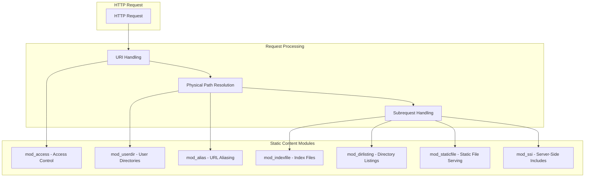

Sources: [src/mod_staticfile.c L1-L154](https://github.com/lighttpd/lighttpd1.4/blob/3d550097/src/mod_staticfile.c#L1-L154)

 [src/mod_dirlisting.c L1-L70](https://github.com/lighttpd/lighttpd1.4/blob/3d550097/src/mod_dirlisting.c#L1-L70)

 [src/mod_indexfile.c L1-L174](https://github.com/lighttpd/lighttpd1.4/blob/3d550097/src/mod_indexfile.c#L1-L174)

 [src/mod_alias.c L1-L152](https://github.com/lighttpd/lighttpd1.4/blob/3d550097/src/mod_alias.c#L1-L152)

 [src/mod_userdir.c L1-L110](https://github.com/lighttpd/lighttpd1.4/blob/3d550097/src/mod_userdir.c#L1-L110)

 [src/mod_access.c L1-L152](https://github.com/lighttpd/lighttpd1.4/blob/3d550097/src/mod_access.c#L1-L152)

 [src/mod_ssi.c L1-L140](https://github.com/lighttpd/lighttpd1.4/blob/3d550097/src/mod_ssi.c#L1-L140)

## Static File Serving (mod_staticfile)

The core functionality for serving static files is provided by `mod_staticfile`. This module handles HTTP GET, HEAD, and POST requests for static files.

### Configuration Options

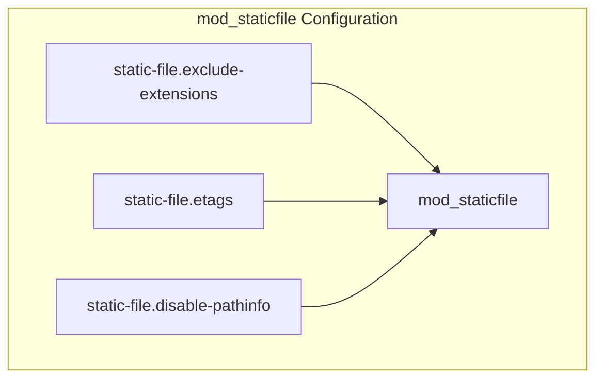

| Option | Description | Default |
| --- | --- | --- |
| static-file.exclude-extensions | List of file extensions that should not be served as static files | None |
| static-file.etags | Enable/disable ETag generation for static files | Enabled |
| static-file.disable-pathinfo | Disable PATH_INFO processing for static files | Disabled |

Sources: [src/mod_staticfile.c L62-L75](https://github.com/lighttpd/lighttpd1.4/blob/3d550097/src/mod_staticfile.c#L62-L75)

 [src/mod_staticfile.c L25-L90](https://github.com/lighttpd/lighttpd1.4/blob/3d550097/src/mod_staticfile.c#L25-L90)

### Static File Processing Flow

When a request for a static file is received, the following flow occurs:

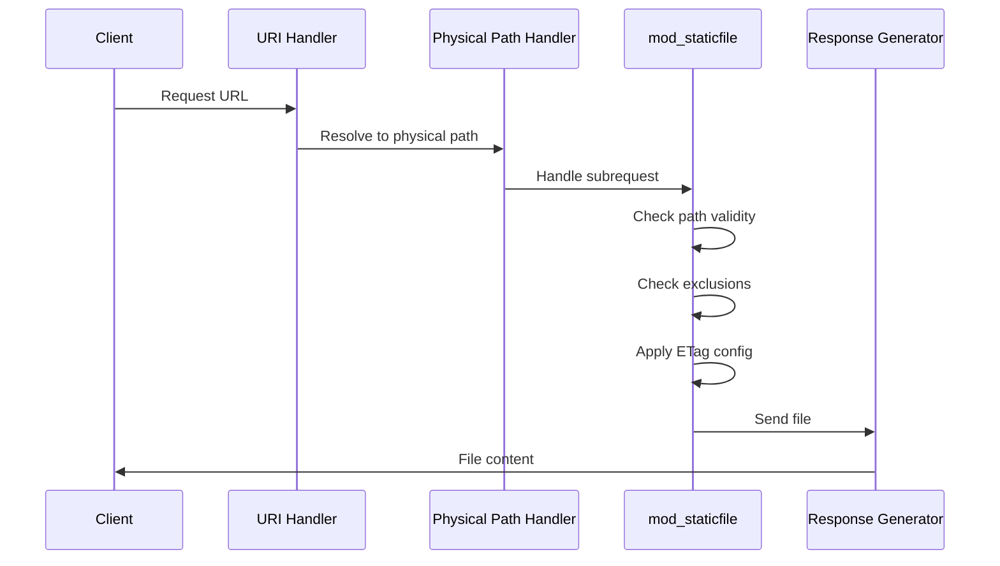

The core processing happens in `mod_staticfile_process`:

1. It checks whether the request has PATH_INFO and rejects it if `static-file.disable-pathinfo` is enabled
2. It checks if the file extension is in the exclusion list and rejects it if it is
3. It applies the ETag configuration
4. It calls `http_response_send_file` to send the file content to the client

Sources: [src/mod_staticfile.c L103-L126](https://github.com/lighttpd/lighttpd1.4/blob/3d550097/src/mod_staticfile.c#L103-L126)

 [src/mod_staticfile.c L128-L138](https://github.com/lighttpd/lighttpd1.4/blob/3d550097/src/mod_staticfile.c#L128-L138)

## Directory Listings (mod_dirlisting)

When a directory is requested and no index file is found, `mod_dirlisting` can generate a listing of the directory contents.

### Configuration Options

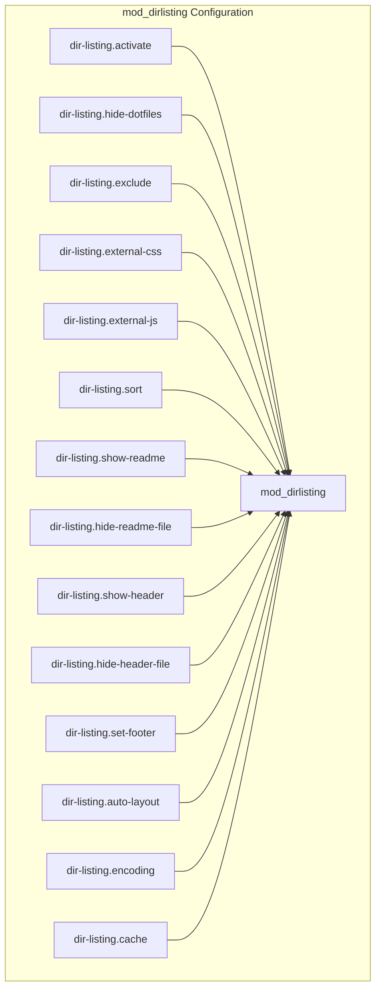

Key configuration options include:

| Option | Description | Default |
| --- | --- | --- |
| dir-listing.activate | Enable/disable directory listings | Disabled |
| dir-listing.hide-dotfiles | Hide files starting with a dot | Enabled |
| dir-listing.exclude | List of patterns to exclude from listings | None |
| dir-listing.external-css | URL to an external CSS file | None |
| dir-listing.external-js | URL to an external JavaScript file | None |
| dir-listing.sort | Enable/disable server-side sorting | Enabled |
| dir-listing.show-readme | Show README file content in listing | None |
| dir-listing.show-header | Show HEADER file content in listing | None |

Sources: [src/mod_dirlisting.c L386-L441](https://github.com/lighttpd/lighttpd1.4/blob/3d550097/src/mod_dirlisting.c#L386-L441)

 [src/mod_dirlisting.c L313-L383](https://github.com/lighttpd/lighttpd1.4/blob/3d550097/src/mod_dirlisting.c#L313-L383)

### Directory Listing Process

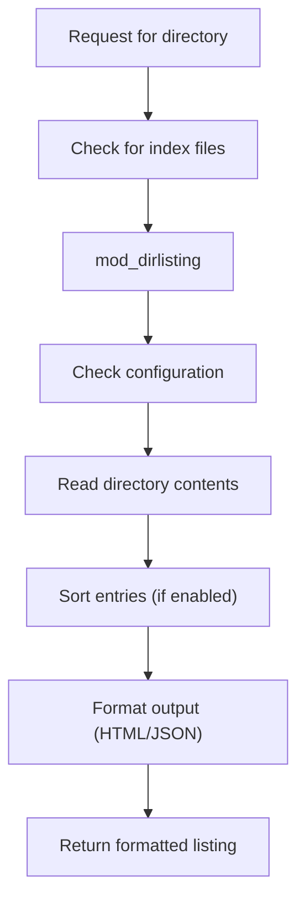

The directory listing feature:

1. Reads directory contents and separates files from directories
2. Applies sorting based on name, size, or modification time
3. Generates HTML or JSON output
4. Can include README and HEADER file contents
5. Supports client-side sorting with JavaScript
6. Has caching capabilities to improve performance

Sources: [src/mod_dirlisting.c L145-L195](https://github.com/lighttpd/lighttpd1.4/blob/3d550097/src/mod_dirlisting.c#L145-L195)

 [src/mod_dirlisting.c L545-L571](https://github.com/lighttpd/lighttpd1.4/blob/3d550097/src/mod_dirlisting.c#L545-L571)

 [src/mod_dirlisting.c L889-L995](https://github.com/lighttpd/lighttpd1.4/blob/3d550097/src/mod_dirlisting.c#L889-L995)

## Index Files (mod_indexfile)

When a directory is requested, `mod_indexfile` tries to serve a configured index file if it exists.

### Configuration Options

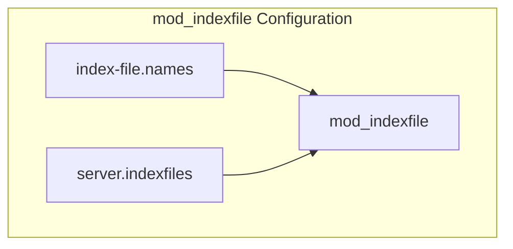

You can configure a list of files to try as index files when a directory is requested:

```
index-file.names = ( "index.html", "index.htm", "default.htm" )
```

Sources: [src/mod_indexfile.c L55-L65](https://github.com/lighttpd/lighttpd1.4/blob/3d550097/src/mod_indexfile.c#L55-L65)

 [src/mod_indexfile.c L25-L78](https://github.com/lighttpd/lighttpd1.4/blob/3d550097/src/mod_indexfile.c#L25-L78)

### Index File Resolution

When a request is made for a directory (path ending with `/`), `mod_indexfile` tries each configured index file in order:

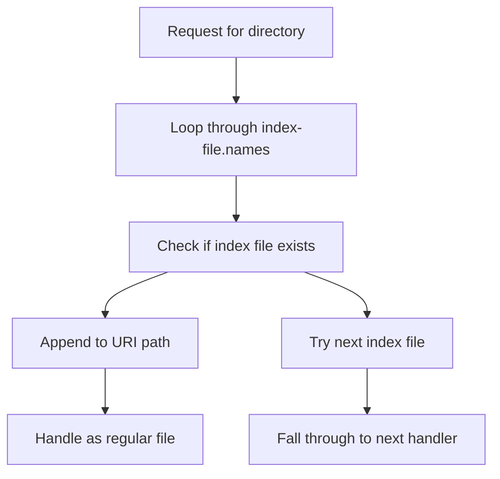

The module:

1. Loops through each configured index file name
2. Checks if the file exists in the requested directory
3. If found, modifies the request to point to that file
4. If not found, continues to the next handler (often `mod_dirlisting`)

Sources: [src/mod_indexfile.c L82-L140](https://github.com/lighttpd/lighttpd1.4/blob/3d550097/src/mod_indexfile.c#L82-L140)

 [src/mod_indexfile.c L142-L158](https://github.com/lighttpd/lighttpd1.4/blob/3d550097/src/mod_indexfile.c#L142-L158)

## URL Aliasing (mod_alias)

`mod_alias` allows mapping URLs to different physical paths on the server.

### Configuration Example

```javascript
alias.url = ( "/download/" => "/var/www/downloads/", 
              "/images/" => "/var/www/images/" )
```

Sources: [src/mod_alias.c L80-L88](https://github.com/lighttpd/lighttpd1.4/blob/3d550097/src/mod_alias.c#L80-L88)

 [src/mod_alias.c L52-L78](https://github.com/lighttpd/lighttpd1.4/blob/3d550097/src/mod_alias.c#L52-L78)

### Alias Processing

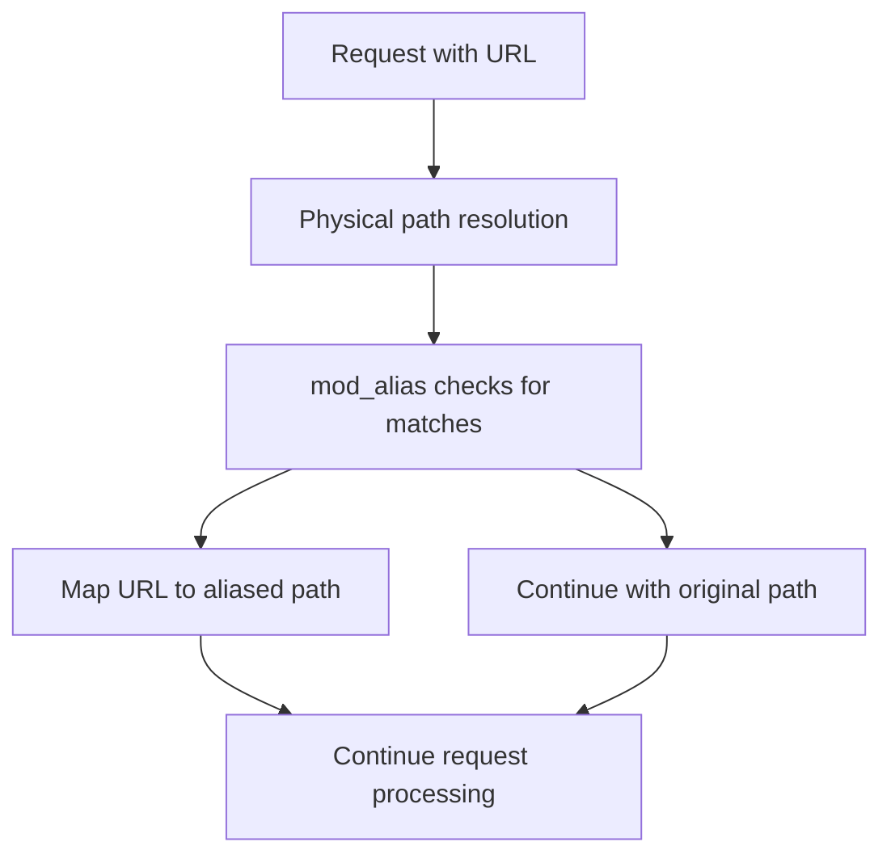

The module:

1. Compares the requested URL path against configured aliases
2. If a match is found, replaces the physical path with the aliased path
3. Takes care to handle path traversal security concerns
4. Processes aliases in configuration order (first match wins)

Sources: [src/mod_alias.c L120-L175](https://github.com/lighttpd/lighttpd1.4/blob/3d550097/src/mod_alias.c#L120-L175)

 [src/mod_alias.c L180-L181](https://github.com/lighttpd/lighttpd1.4/blob/3d550097/src/mod_alias.c#L180-L181)

## User Directories (mod_userdir)

`mod_userdir` enables serving content from user home directories using URLs like `/~username/`.

### Configuration Options

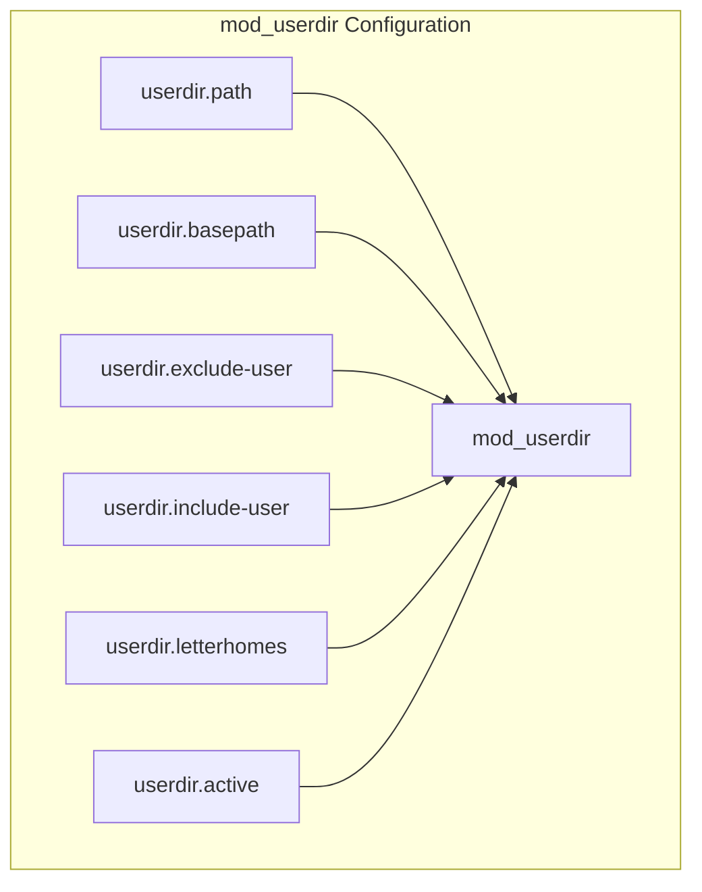

| Option | Description | Default |
| --- | --- | --- |
| userdir.path | Path relative to user home directory | None |
| userdir.basepath | Base path for user directories (alternative to home dirs) | None |
| userdir.exclude-user | List of users to exclude | None |
| userdir.include-user | List of users to include (if set, others are excluded) | None |
| userdir.letterhomes | Use first letter of username as subdirectory | Disabled |
| userdir.active | Enable/disable user directories | Enabled |

Sources: [src/mod_userdir.c L91-L113](https://github.com/lighttpd/lighttpd1.4/blob/3d550097/src/mod_userdir.c#L91-L113)

 [src/mod_userdir.c L83-L88](https://github.com/lighttpd/lighttpd1.4/blob/3d550097/src/mod_userdir.c#L83-L88)

### User Directory Resolution

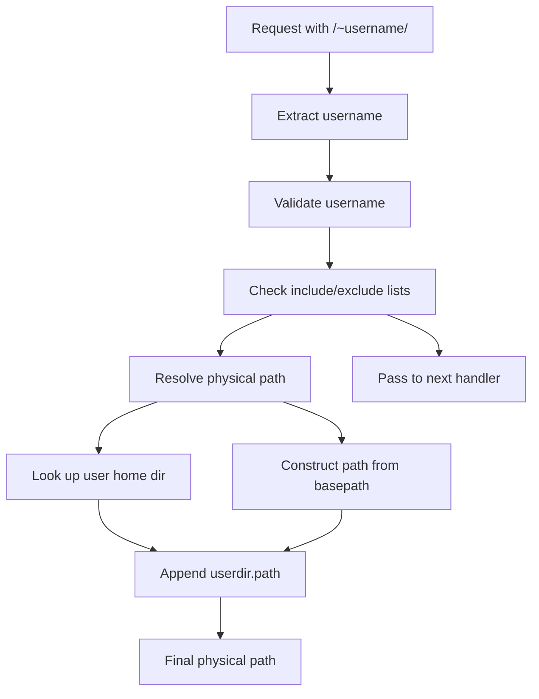

The module:

1. Extracts the username from the URL (after `~`)
2. Validates the username (against inclusion/exclusion lists and character validity)
3. Resolves the physical path (either from system user's home directory or configured basepath)
4. Appends the configured path to the user directory
5. Sets the physical path for the request

Sources: [src/mod_userdir.c L174-L278](https://github.com/lighttpd/lighttpd1.4/blob/3d550097/src/mod_userdir.c#L174-L278)

 [src/mod_userdir.c L280-L330](https://github.com/lighttpd/lighttpd1.4/blob/3d550097/src/mod_userdir.c#L280-L330)

## Access Control (mod_access)

`mod_access` provides URL-based access control for static content.

### Configuration Options

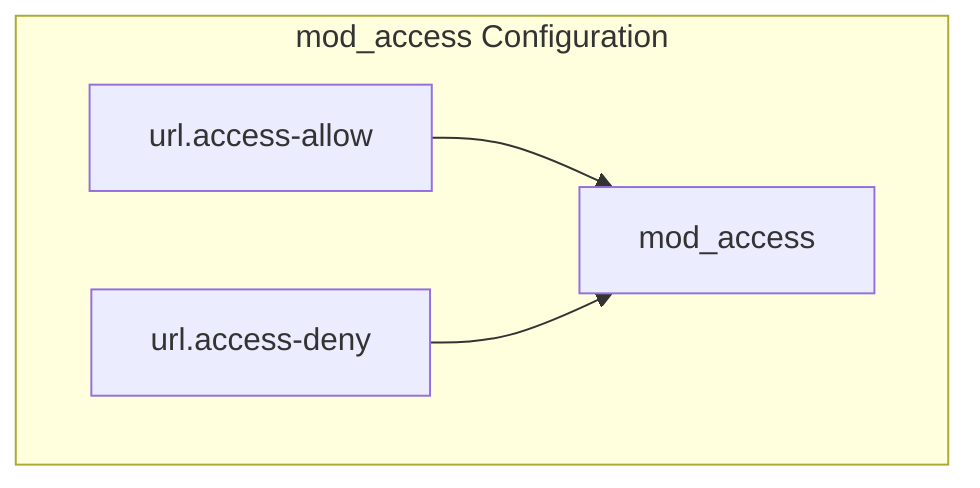

Configuration examples:

```markdown
# Deny access to .git directories
url.access-deny = ( ".git" )

# Only allow access to specific file types
url.access-allow = ( ".html", ".htm", ".txt", ".jpg", ".png" )
```

Sources: [src/mod_access.c L53-L64](https://github.com/lighttpd/lighttpd1.4/blob/3d550097/src/mod_access.c#L53-L64)

 [src/mod_access.c L25-L77](https://github.com/lighttpd/lighttpd1.4/blob/3d550097/src/mod_access.c#L25-L77)

### Access Control Process

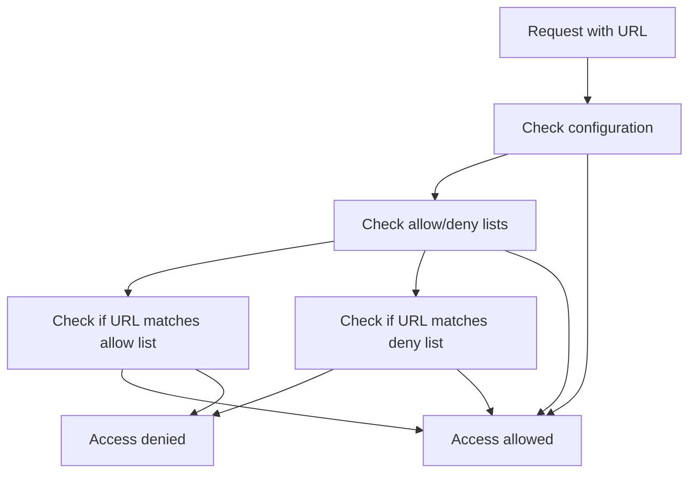

The module:

1. Checks if the URL matches patterns in allow/deny lists
2. If an allow list exists, only URLs matching the allow list are permitted
3. If only a deny list exists, URLs matching the deny list are rejected
4. Can operate case-sensitive or case-insensitive based on server configuration

Sources: [src/mod_access.c L99-L116](https://github.com/lighttpd/lighttpd1.4/blob/3d550097/src/mod_access.c#L99-L116)

 [src/mod_access.c L125-L135](https://github.com/lighttpd/lighttpd1.4/blob/3d550097/src/mod_access.c#L125-L135)

## Server-Side Includes (mod_ssi)

Server-Side Includes (SSI) allows embedding dynamic content in static files.

### Configuration Options

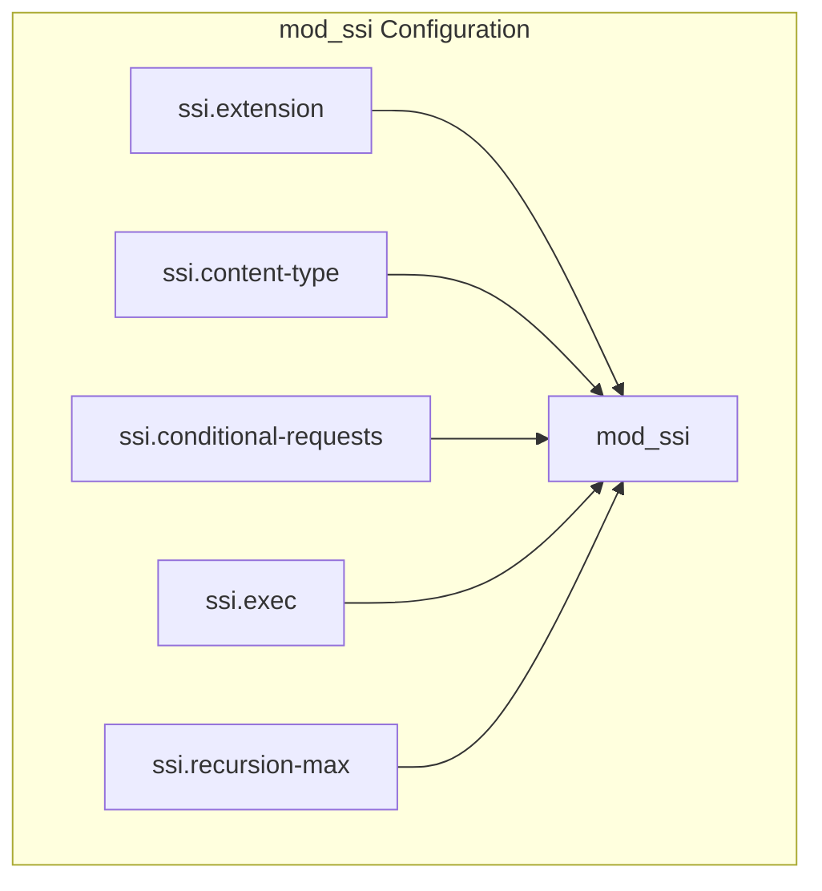

| Option | Description | Default |
| --- | --- | --- |
| ssi.extension | File extensions that should be processed for SSI directives | None |
| ssi.content-type | Content-Type header for SSI files | None |
| ssi.conditional-requests | Enable/disable conditional requests | Disabled |
| ssi.exec | Enable/disable the `exec` directive | Enabled |
| ssi.recursion-max | Maximum recursion depth for SSI includes | None |

Sources: [src/mod_ssi.c L144-L163](https://github.com/lighttpd/lighttpd1.4/blob/3d550097/src/mod_ssi.c#L144-L163)

 [src/mod_ssi.c L107-L142](https://github.com/lighttpd/lighttpd1.4/blob/3d550097/src/mod_ssi.c#L107-L142)

### SSI Processing

SSI allows various directives in HTML files, including:

* `<!--#include file="file.html" -->` - Include another file
* `<!--#echo var="VARIABLE" -->` - Output a variable
* `<!--#config timefmt="%Y-%m-%d" -->` - Configure formatting
* `<!--#flastmod file="file.html" -->` - Show file modification time
* `<!--#if expr="condition" -->` - Conditional processing
* `<!--#exec cmd="command" -->` - Execute shell commands (if enabled)

The module processes these directives and replaces them with the resulting content before sending the file to the client.

Sources: [src/mod_ssi.c L590-L697](https://github.com/lighttpd/lighttpd1.4/blob/3d550097/src/mod_ssi.c#L590-L697)

 [src/mod_ssi.c L407-L517](https://github.com/lighttpd/lighttpd1.4/blob/3d550097/src/mod_ssi.c#L407-L517)

## Request Processing Flow for Static Content

The following diagram shows how a request flows through the various modules for static content serving:

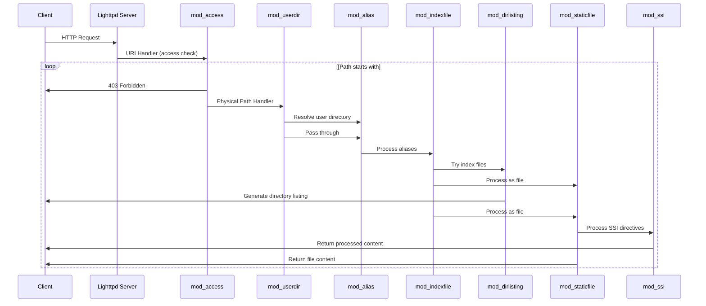

This diagram illustrates the typical request processing flow:

1. `mod_access` checks if the requested URL is allowed
2. `mod_userdir` handles `~username` URLs if present
3. `mod_alias` maps URLs to different physical paths if configured
4. `mod_indexfile` looks for index files if the URL ends with a slash
5. `mod_dirlisting` generates directory listings if needed
6. `mod_staticfile` handles serving the actual file content
7. `mod_ssi` processes SSI directives if the file extension matches

Sources: [src/mod_staticfile.c L128-L138](https://github.com/lighttpd/lighttpd1.4/blob/3d550097/src/mod_staticfile.c#L128-L138)

 [src/mod_dirlisting.c L889-L995](https://github.com/lighttpd/lighttpd1.4/blob/3d550097/src/mod_dirlisting.c#L889-L995)

 [src/mod_indexfile.c L142-L158](https://github.com/lighttpd/lighttpd1.4/blob/3d550097/src/mod_indexfile.c#L142-L158)

 [src/mod_alias.c L180-L181](https://github.com/lighttpd/lighttpd1.4/blob/3d550097/src/mod_alias.c#L180-L181)

 [src/mod_userdir.c L280-L330](https://github.com/lighttpd/lighttpd1.4/blob/3d550097/src/mod_userdir.c#L280-L330)

 [src/mod_access.c L125-L135](https://github.com/lighttpd/lighttpd1.4/blob/3d550097/src/mod_access.c#L125-L135)

 [src/mod_ssi.c L590-L697](https://github.com/lighttpd/lighttpd1.4/blob/3d550097/src/mod_ssi.c#L590-L697)

## Performance Considerations

When serving static content, lighttpd employs several techniques to maximize performance:

1. **ETags**: Configurable via `static-file.etags` for efficient caching
2. **Directory Listing Caching**: Configurable via `dir-listing.cache` to cache directory listings
3. **Efficient File Transfer**: Uses sendfile() where available for zero-copy file transmission
4. **URL Mapping Optimization**: Processes URL mappings in order of specificity to minimize overhead

These optimizations help lighttpd maintain its reputation as a high-performance web server, especially for static content serving.

Sources: [src/mod_staticfile.c L62-L75](https://github.com/lighttpd/lighttpd1.4/blob/3d550097/src/mod_staticfile.c#L62-L75)

 [src/mod_dirlisting.c L196-L241](https://github.com/lighttpd/lighttpd1.4/blob/3d550097/src/mod_dirlisting.c#L196-L241)