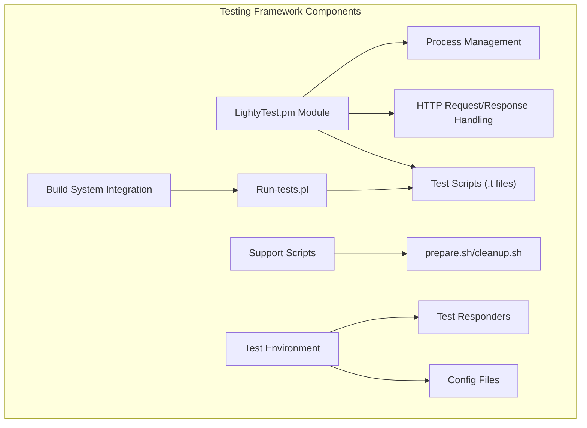
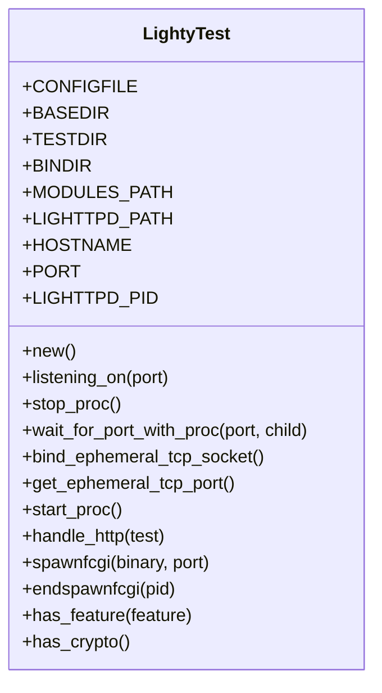
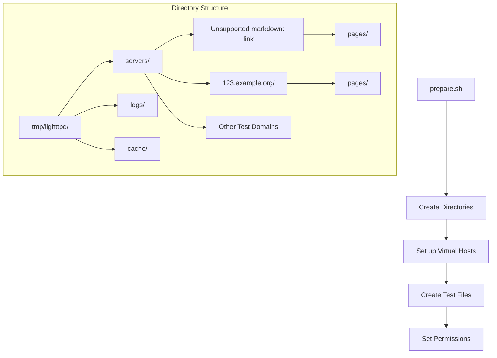
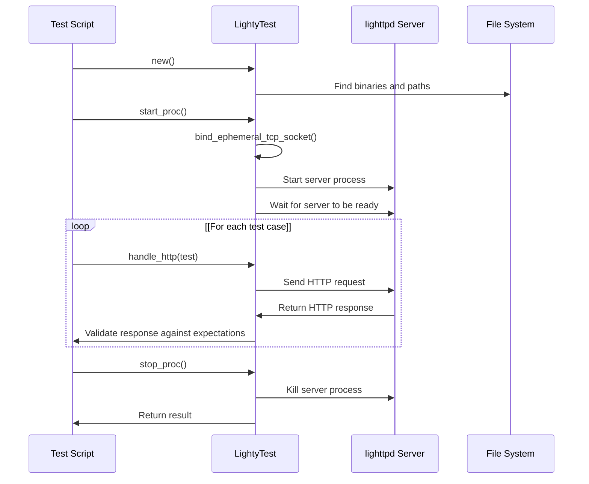
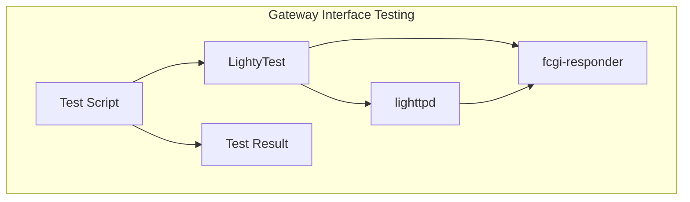

# Testing Framework

> **Relevant source files**
> * [.gitignore](https://github.com/lighttpd/lighttpd1.4/blob/3d550097/.gitignore)
> * [tests/CMakeLists.txt](https://github.com/lighttpd/lighttpd1.4/blob/3d550097/tests/CMakeLists.txt)
> * [tests/LightyTest.pm](https://github.com/lighttpd/lighttpd1.4/blob/3d550097/tests/LightyTest.pm)
> * [tests/Makefile.am](https://github.com/lighttpd/lighttpd1.4/blob/3d550097/tests/Makefile.am)
> * [tests/SConscript](https://github.com/lighttpd/lighttpd1.4/blob/3d550097/tests/SConscript)
> * [tests/docroot/cgi.pl](https://github.com/lighttpd/lighttpd1.4/blob/3d550097/tests/docroot/cgi.pl)
> * [tests/lighttpd.conf](https://github.com/lighttpd/lighttpd1.4/blob/3d550097/tests/lighttpd.conf)
> * [tests/lighttpd.htpasswd](https://github.com/lighttpd/lighttpd1.4/blob/3d550097/tests/lighttpd.htpasswd)
> * [tests/meson.build](https://github.com/lighttpd/lighttpd1.4/blob/3d550097/tests/meson.build)
> * [tests/mod-fastcgi.t](https://github.com/lighttpd/lighttpd1.4/blob/3d550097/tests/mod-fastcgi.t)
> * [tests/mod-scgi.t](https://github.com/lighttpd/lighttpd1.4/blob/3d550097/tests/mod-scgi.t)
> * [tests/prepare.sh](https://github.com/lighttpd/lighttpd1.4/blob/3d550097/tests/prepare.sh)
> * [tests/request.t](https://github.com/lighttpd/lighttpd1.4/blob/3d550097/tests/request.t)

This page describes the lighttpd testing framework - a system for creating and running automated tests that verify the web server's functionality. The testing framework allows developers to ensure that changes to the codebase maintain compatibility and don't introduce regressions, while providing a way to test new features.

For information about the Continuous Integration system that runs these tests automatically, see [Continuous Integration](/lighttpd/lighttpd1.4/6.2-continuous-integration).

## Overview

The lighttpd testing framework is built around Perl test scripts that utilize a custom test harness to start, interact with, and stop lighttpd instances. The primary components of the framework are:

1. A Perl module (`LightyTest.pm`) that manages test environments and interactions
2. A collection of test scripts (`.t` files) that define test cases
3. Support scripts for setting up and tearing down the test environment
4. Configuration files for specific test scenarios
5. Test responders for protocols like FastCGI and SCGI



Sources: [tests/LightyTest.pm](https://github.com/lighttpd/lighttpd1.4/blob/3d550097/tests/LightyTest.pm)

 [tests/request.t](https://github.com/lighttpd/lighttpd1.4/blob/3d550097/tests/request.t)

 [tests/Makefile.am](https://github.com/lighttpd/lighttpd1.4/blob/3d550097/tests/Makefile.am)

 [tests/prepare.sh](https://github.com/lighttpd/lighttpd1.4/blob/3d550097/tests/prepare.sh)

## Core Testing Components

### LightyTest Module

The `LightyTest.pm` Perl module is the foundation of the testing framework. It provides functionality to:

* Create and manage test instances
* Start and stop lighttpd processes
* Send HTTP requests and validate responses
* Spawn and manage FastCGI/SCGI responder processes
* Detect server features



Sources: [tests/LightyTest.pm L1-L69](https://github.com/lighttpd/lighttpd1.4/blob/3d550097/tests/LightyTest.pm#L1-L69)

 [tests/LightyTest.pm L70-L90](https://github.com/lighttpd/lighttpd1.4/blob/3d550097/tests/LightyTest.pm#L70-L90)

 [tests/LightyTest.pm L91-L143](https://github.com/lighttpd/lighttpd1.4/blob/3d550097/tests/LightyTest.pm#L91-L143)

 [tests/LightyTest.pm L144-L168](https://github.com/lighttpd/lighttpd1.4/blob/3d550097/tests/LightyTest.pm#L144-L168)

 [tests/LightyTest.pm L169-L186](https://github.com/lighttpd/lighttpd1.4/blob/3d550097/tests/LightyTest.pm#L169-L186)

 [tests/LightyTest.pm L197-L295](https://github.com/lighttpd/lighttpd1.4/blob/3d550097/tests/LightyTest.pm#L197-L295)

 [tests/LightyTest.pm L297-L505](https://github.com/lighttpd/lighttpd1.4/blob/3d550097/tests/LightyTest.pm#L297-L505)

 [tests/LightyTest.pm L507-L539](https://github.com/lighttpd/lighttpd1.4/blob/3d550097/tests/LightyTest.pm#L507-L539)

 [tests/LightyTest.pm L541-L568](https://github.com/lighttpd/lighttpd1.4/blob/3d550097/tests/LightyTest.pm#L541-L568)

### Test Scripts

The test scripts are Perl files (with `.t` extension) that define specific test cases. Each test script:

1. Creates a LightyTest instance
2. Starts a lighttpd process with appropriate configuration
3. Defines test cases as request/expected-response pairs
4. Uses the `handle_http()` method to execute tests
5. Stops the lighttpd process

Example test structure (from request.t):

```javascript
my $tf = LightyTest->new();
my $t;

ok($tf->start_proc == 0, "Starting lighttpd") or die();

$t->{REQUEST}  = ( <<EOF
GET / HTTP/1.0
EOF
 );
$t->{RESPONSE} = [ { 'HTTP-Protocol' => 'HTTP/1.0', 'HTTP-Status' => 200 } ];
ok($tf->handle_http($t) == 0, 'Valid HTTP/1.0 Request');

ok($tf->stop_proc == 0, "Stopping lighttpd");
```

Sources: [tests/request.t L9-L28](https://github.com/lighttpd/lighttpd1.4/blob/3d550097/tests/request.t#L9-L28)

 [tests/mod-fastcgi.t L9-L28](https://github.com/lighttpd/lighttpd1.4/blob/3d550097/tests/mod-fastcgi.t#L9-L28)

 [tests/mod-scgi.t L9-L27](https://github.com/lighttpd/lighttpd1.4/blob/3d550097/tests/mod-scgi.t#L9-L27)

## Test Environment Setup

Before running tests, the environment is prepared by `prepare.sh`, which:

1. Creates directory structure for test servers
2. Sets up virtual hosts for testing
3. Creates test files with specific content
4. Sets permissions and creates symlinks (where applicable)



Sources: [tests/prepare.sh L16-L72](https://github.com/lighttpd/lighttpd1.4/blob/3d550097/tests/prepare.sh#L16-L72)

## Test Execution Flow

The test execution process involves several steps from initialization to verification:



Sources: [tests/LightyTest.pm L197-L295](https://github.com/lighttpd/lighttpd1.4/blob/3d550097/tests/LightyTest.pm#L197-L295)

 [tests/LightyTest.pm L297-L505](https://github.com/lighttpd/lighttpd1.4/blob/3d550097/tests/LightyTest.pm#L297-L505)

 [tests/LightyTest.pm L91-L143](https://github.com/lighttpd/lighttpd1.4/blob/3d550097/tests/LightyTest.pm#L91-L143)

### Request Handling

The `handle_http()` method in LightyTest is responsible for:

1. Sending HTTP requests to the server
2. Reading the response
3. Parsing response headers and body
4. Comparing against expected values
5. Reporting success or failure

The method supports testing various aspects like:

* Status codes
* HTTP protocol versions
* Response headers
* Response content
* Regular expression matching for responses

Sources: [tests/LightyTest.pm L297-L505](https://github.com/lighttpd/lighttpd1.4/blob/3d550097/tests/LightyTest.pm#L297-L505)

## Process Management

The testing framework includes capabilities for managing server processes:

1. The `start_proc()` method: * Finds an available port * Sets up environment variables * Launches lighttpd with specific configuration * Waits for the server to be ready
2. The `stop_proc()` method: * Sends appropriate signal to terminate the server * Handles platform-specific termination (Windows vs. Unix) * Waits for the process to exit

Sources: [tests/LightyTest.pm L197-L295](https://github.com/lighttpd/lighttpd1.4/blob/3d550097/tests/LightyTest.pm#L197-L295)

 [tests/LightyTest.pm L91-L143](https://github.com/lighttpd/lighttpd1.4/blob/3d550097/tests/LightyTest.pm#L91-L143)

## FastCGI and SCGI Testing

For testing gateway interfaces, the framework includes:

1. Test responders (`fcgi-responder` and `scgi-responder`)
2. Methods to spawn and manage responder processes
3. Test scripts specific to these protocols



Sources: [tests/mod-fastcgi.t](https://github.com/lighttpd/lighttpd1.4/blob/3d550097/tests/mod-fastcgi.t)

 [tests/mod-scgi.t](https://github.com/lighttpd/lighttpd1.4/blob/3d550097/tests/mod-scgi.t)

 [tests/LightyTest.pm L507-L539](https://github.com/lighttpd/lighttpd1.4/blob/3d550097/tests/LightyTest.pm#L507-L539)

## Build System Integration

The testing framework is integrated with multiple build systems:

| Build System | Integration File | Test Invocation |
| --- | --- | --- |
| Autotools | Makefile.am | `make check` |
| CMake | CMakeLists.txt | `ctest` |
| Meson | meson.build | `meson test` |
| SCons | SConscript | `scons check` |

The build system integration ensures that:

1. Tests are run with the correct paths for binaries
2. Test responders are built before running tests
3. Tests are run in the proper sequence (prepare → test → cleanup)
4. Test failures are properly reported

Sources: [tests/Makefile.am](https://github.com/lighttpd/lighttpd1.4/blob/3d550097/tests/Makefile.am)

 [tests/CMakeLists.txt](https://github.com/lighttpd/lighttpd1.4/blob/3d550097/tests/CMakeLists.txt)

 [tests/meson.build](https://github.com/lighttpd/lighttpd1.4/blob/3d550097/tests/meson.build)

 [tests/SConscript](https://github.com/lighttpd/lighttpd1.4/blob/3d550097/tests/SConscript)

## Cross-Platform Considerations

The testing framework accommodates different platforms:

1. Path handling for Windows vs. Unix
2. Socket handling differences
3. Process management variations
4. System-specific socket libraries

The `LightyTest` module detects the platform and adapts its behavior accordingly:

```
$self->{"win32native"} = $^O eq "cygwin"
                     && 0 != system("ldd '$$self{LIGHTTPD_PATH}' | grep -q cygwin");
```

Sources: [tests/LightyTest.pm L48-L59](https://github.com/lighttpd/lighttpd1.4/blob/3d550097/tests/LightyTest.pm#L48-L59)

 [tests/CMakeLists.txt L3-L14](https://github.com/lighttpd/lighttpd1.4/blob/3d550097/tests/CMakeLists.txt#L3-L14)

 [tests/meson.build L2-L12](https://github.com/lighttpd/lighttpd1.4/blob/3d550097/tests/meson.build#L2-L12)

## Creating New Tests

To create a new test for lighttpd:

1. Create a new `.t` file using existing tests as templates
2. Define test cases with REQUEST/RESPONSE pairs
3. Add the test to the build system files: * Add to `TESTS` in Makefile.am * Add to the tests list in CMakeLists.txt, meson.build, or SConscript
4. Run the test to verify it works correctly

The framework provides a flexible way to test different aspects of the server, from basic HTTP protocol compliance to advanced features like FastCGI support, authorization, and URL rewriting.

Sources: [tests/Makefile.am L11-L14](https://github.com/lighttpd/lighttpd1.4/blob/3d550097/tests/Makefile.am#L11-L14)

 [tests/CMakeLists.txt L19-L32](https://github.com/lighttpd/lighttpd1.4/blob/3d550097/tests/CMakeLists.txt#L19-L32)

 [tests/meson.build L31-L43](https://github.com/lighttpd/lighttpd1.4/blob/3d550097/tests/meson.build#L31-L43)