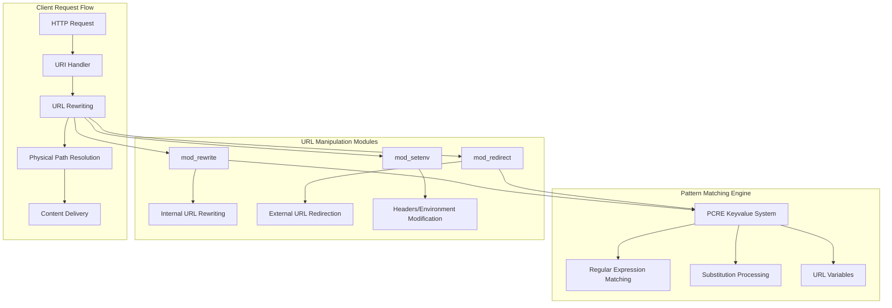
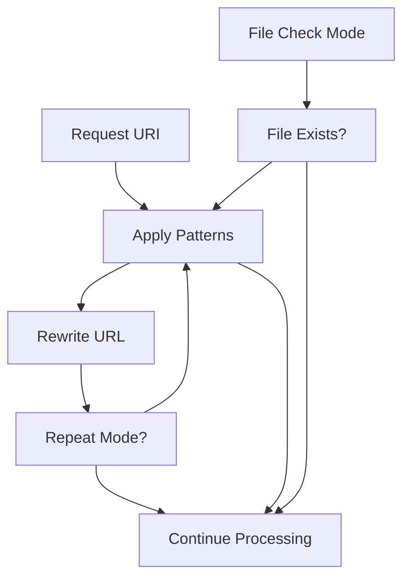
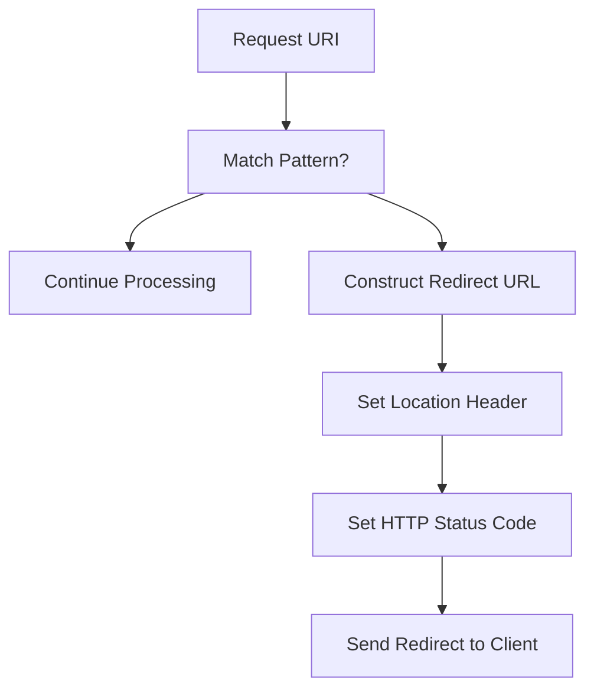
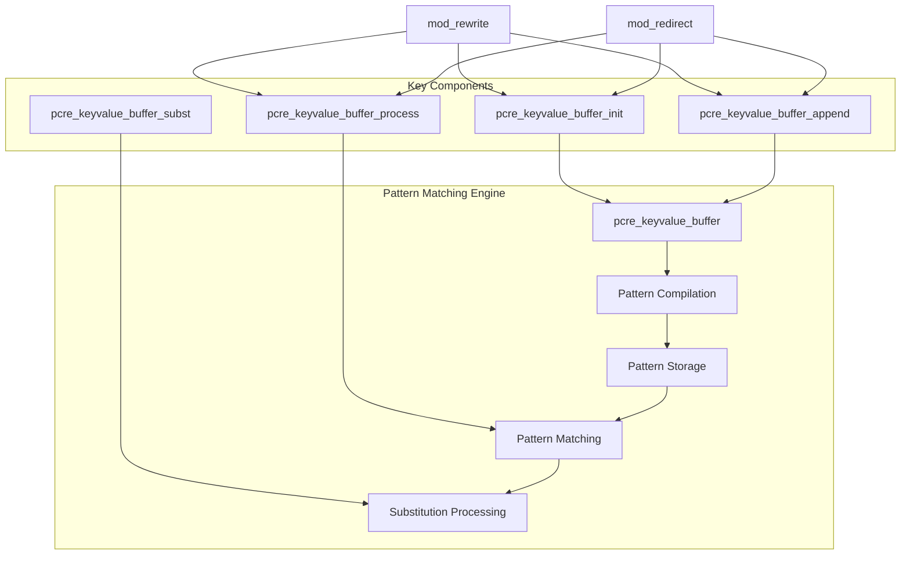
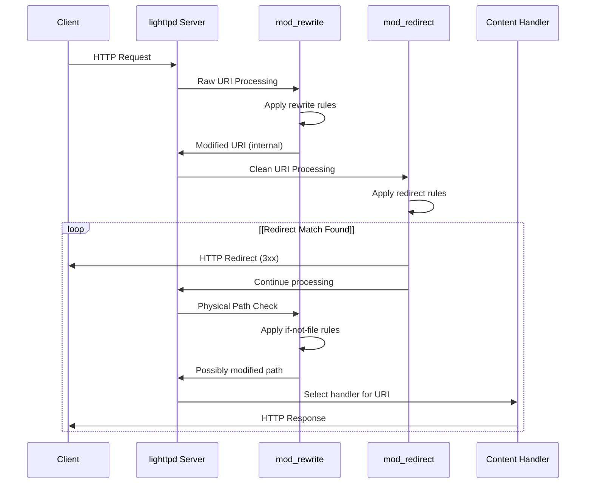

# URL Rewriting and Manipulation

> **Relevant source files**
> * [src/keyvalue.c](https://github.com/lighttpd/lighttpd1.4/blob/3d550097/src/keyvalue.c)
> * [src/keyvalue.h](https://github.com/lighttpd/lighttpd1.4/blob/3d550097/src/keyvalue.h)
> * [src/mod_redirect.c](https://github.com/lighttpd/lighttpd1.4/blob/3d550097/src/mod_redirect.c)
> * [src/mod_rewrite.c](https://github.com/lighttpd/lighttpd1.4/blob/3d550097/src/mod_rewrite.c)
> * [src/mod_setenv.c](https://github.com/lighttpd/lighttpd1.4/blob/3d550097/src/mod_setenv.c)
> * [src/mod_skeleton.c](https://github.com/lighttpd/lighttpd1.4/blob/3d550097/src/mod_skeleton.c)
> * [src/t/test_keyvalue.c](https://github.com/lighttpd/lighttpd1.4/blob/3d550097/src/t/test_keyvalue.c)

This page documents the URL rewriting and manipulation capabilities in lighttpd. These features allow you to modify URLs internally (rewriting) or send redirects to clients (redirection) based on pattern matching rules. For authentication and authorization, see [Authentication and Authorization](/lighttpd/lighttpd1.4/4.4-authentication-and-authorization).

## Overview of URL Manipulation in lighttpd

lighttpd provides three primary modules for URL manipulation:

1. **mod_rewrite**: Internally rewrites URLs without redirecting the client
2. **mod_redirect**: Sends HTTP redirects when URLs match configured patterns
3. **mod_setenv**: Manipulates HTTP headers and environment variables

All these modules rely on a common pattern matching engine implemented in the keyvalue system, which leverages PCRE (Perl Compatible Regular Expressions).



Sources: [src/mod_rewrite.c](https://github.com/lighttpd/lighttpd1.4/blob/3d550097/src/mod_rewrite.c)

 [src/mod_redirect.c](https://github.com/lighttpd/lighttpd1.4/blob/3d550097/src/mod_redirect.c)

 [src/keyvalue.c](https://github.com/lighttpd/lighttpd1.4/blob/3d550097/src/keyvalue.c)

## URL Rewriting with mod_rewrite

The `mod_rewrite` module enables internal URL rewriting within the server without sending redirects to clients. It intercepts requests at the URI handling phase and can modify the request's target URL before further processing occurs.

### Configuration Options

mod_rewrite offers multiple configuration directives:

| Directive | Description |
| --- | --- |
| `url.rewrite-once` | Rewrites a URL once if it matches a pattern |
| `url.rewrite-final` | Alias for `url.rewrite-once` (legacy name) |
| `url.rewrite` | Alias for `url.rewrite-once` (legacy name) |
| `url.rewrite-repeat` | Rewrites a URL repeatedly until no more matches are found |
| `url.rewrite-if-not-file` | Rewrites a URL only if the target doesn't exist as a file |
| `url.rewrite-repeat-if-not-file` | Rewrites repeatedly until no more matches or a file is found |

Each directive takes an array of key-value pairs, where the key is a regular expression pattern and the value is the replacement string.

Example configuration:

```javascript
url.rewrite-once = (
  "^/old/path(.*)$" => "/new/path$1",
  "^/legacy/api/v1(.*)$" => "/api/v2$1"
)

url.rewrite-if-not-file = (
  "^/docs/(.+)$" => "/documentation.php?page=$1",
  "^/blog/([0-9]+)/([^/]+)$" => "/blog.php?id=$1&slug=$2"
)
```

Sources: [src/mod_rewrite.c L135-L157](https://github.com/lighttpd/lighttpd1.4/blob/3d550097/src/mod_rewrite.c#L135-L157)

### How mod_rewrite Works

The module operates by applying PCRE patterns to the request URL and replacing them according to the defined rules. The processing flow is:



Sources: [src/mod_rewrite.c L279-L328](https://github.com/lighttpd/lighttpd1.4/blob/3d550097/src/mod_rewrite.c#L279-L328)

The implementation includes safeguards against infinite rewrite loops, which can occur when using `url.rewrite-repeat` if patterns continually match. After 100 iterations, the server will abort the request with an error.

Sources: [src/mod_rewrite.c L257-L272](https://github.com/lighttpd/lighttpd1.4/blob/3d550097/src/mod_rewrite.c#L257-L272)

## URL Redirection with mod_redirect

The `mod_redirect` module sends HTTP redirects to clients when a URL matches a configured pattern. Unlike mod_rewrite, which changes URLs internally, mod_redirect instructs the client browser to request a different URL.

### Configuration Options

mod_redirect provides two primary configuration directives:

| Directive | Description |
| --- | --- |
| `url.redirect` | Array of URL patterns and their replacements |
| `url.redirect-code` | HTTP status code to use for the redirect |

The default redirect code is 301 (Permanent Redirect) for GET/HEAD requests or HTTP/1.0, and 308 (Permanent Redirect) for other methods in HTTP/1.1+.

Example configuration:

```javascript
url.redirect = (
  "^/old-site/(.*)$" => "https://new-site.example.com/$1",
  "^/temporary/(.*)$" => "/temp/$1"
)

url.redirect-code = 302  # Use temporary redirect
```

Sources: [src/mod_redirect.c L113-L123](https://github.com/lighttpd/lighttpd1.4/blob/3d550097/src/mod_redirect.c#L113-L123)

### How mod_redirect Works

The redirect module follows these steps when processing a request:

1. Match the request URL against configured patterns
2. If a match is found, construct the redirect target URL
3. Set the Location header with the new URL
4. Set the HTTP status code (from configuration or default)
5. Finish the request, sending the redirect to the client



Sources: [src/mod_redirect.c L160-L205](https://github.com/lighttpd/lighttpd1.4/blob/3d550097/src/mod_redirect.c#L160-L205)

## The Pattern Matching Engine (keyvalue System)

Both mod_rewrite and mod_redirect rely on a common pattern matching engine implemented in the keyvalue system. This component provides powerful regex-based pattern matching and substitution capabilities.



Sources: [src/keyvalue.c L44-L452](https://github.com/lighttpd/lighttpd1.4/blob/3d550097/src/keyvalue.c#L44-L452)

 [src/keyvalue.h L22-L48](https://github.com/lighttpd/lighttpd1.4/blob/3d550097/src/keyvalue.h#L22-L48)

### Regular Expression Support

The system uses PCRE for powerful pattern matching, supporting:

* Standard regex patterns (^, $, *, +, etc.)
* Capturing groups with parentheses
* Non-capturing groups with (?:...)
* Character classes and Unicode support
* PCRE JIT optimization for better performance

All patterns are compiled during server initialization, ensuring efficient matching during request processing.

Sources: [src/keyvalue.c L47-L160](https://github.com/lighttpd/lighttpd1.4/blob/3d550097/src/keyvalue.c#L47-L160)

### Substitution Patterns

The substitution system offers several special patterns and features:

| Pattern | Description |
| --- | --- |
| `$n` | Insert nth capturing group from the match (e.g., `$1`, `$2`) |
| `%n` | Insert nth capturing group from enclosing condition match |
| `${url.scheme}` | Insert URL scheme (http, https) |
| `${url.authority}` | Insert URL authority (hostname) |
| `${url.port}` | Insert URL port |
| `${url.path}` | Insert URL path (without query string) |
| `${url.query}` | Insert URL query string |
| `${qsa}` | Append query string if present |
| `${esc:...}` | URL encode the contents |
| `${noesc:...}` | Don't URL encode the contents |
| `${tolower:...}` | Convert to lowercase |
| `${encb64u:...}` | Base64url encode |
| `${decb64u:...}` | Base64url decode |

Sources: [src/keyvalue.c L190-L400](https://github.com/lighttpd/lighttpd1.4/blob/3d550097/src/keyvalue.c#L190-L400)

## Advanced Usage and Examples

### Conditional Rewriting

Lighttpd config allows combining rewrites with conditions:

```javascript
# Only rewrite for a specific host
$HTTP["host"] =~ "example\.org$" {
    url.rewrite-once = (
        "^/foo/(.+)" => "/bar/$1"
    )
}

# Only redirect mobile devices
$HTTP["useragent"] =~ "Mobile" {
    url.redirect = (
        "^/$" => "/mobile/"
    )
}
```

### Chaining Rewrite Rules

Complex URL transformations can be achieved by chaining multiple rewrite rules:

```javascript
url.rewrite-repeat = (
    "^/category/([^/]+)/page/([0-9]+)$" => "/category.php?name=$1&page=$2",
    "^/category/([^/]+)$" => "/category.php?name=$1&page=1",
    "^/search/([^/]+)$" => "/search.php?q=$1"
)
```

### Performance Considerations

1. **Use `url.rewrite-once` when possible** - The repeat variants are more expensive as they may process the same URL multiple times.
2. **Order patterns from most specific to least specific** - This prevents less specific patterns from capturing requests that should be handled by more specific ones.
3. **Use non-capturing groups** - When you don't need to reference a group in the replacement, use `(?:...)` instead of `(...)` for slightly better performance.
4. **Leverage file-existence checks** - `url.rewrite-if-not-file` can save processing by only rewriting when needed.

Sources: [src/mod_rewrite.c L257-L272](https://github.com/lighttpd/lighttpd1.4/blob/3d550097/src/mod_rewrite.c#L257-L272)

 [src/mod_rewrite.c L338-L344](https://github.com/lighttpd/lighttpd1.4/blob/3d550097/src/mod_rewrite.c#L338-L344)

 [src/keyvalue.c L402-L452](https://github.com/lighttpd/lighttpd1.4/blob/3d550097/src/keyvalue.c#L402-L452)

## Header and Environment Manipulation with mod_setenv

In addition to URL rewriting and redirecting, lighttpd allows manipulation of HTTP headers and environment variables through `mod_setenv`, which can be useful in URL manipulation contexts.

### Key Configuration Directives

| Directive | Description |
| --- | --- |
| `setenv.add-request-header` | Add a header to the request sent to backend |
| `setenv.set-request-header` | Set (replace) a header in the request |
| `setenv.add-response-header` | Add a header to the response sent to client |
| `setenv.set-response-header` | Set (replace) a header in the response |
| `setenv.add-environment` | Add an environment variable |
| `setenv.set-environment` | Set (replace) an environment variable |

Example for URL-related manipulation:

```javascript
# Add original URL as a header to the backend
$HTTP["url"] =~ "^/rewritten/" {
    url.rewrite-once = ("^/rewritten/(.*)$" => "/script.php")
    setenv.add-request-header = (
        "X-Original-URL" => "/rewritten/$1"
    )
}
```

Sources: [src/mod_setenv.c L124-L182](https://github.com/lighttpd/lighttpd1.4/blob/3d550097/src/mod_setenv.c#L124-L182)

 [src/mod_setenv.c L198-L216](https://github.com/lighttpd/lighttpd1.4/blob/3d550097/src/mod_setenv.c#L198-L216)

 [src/mod_setenv.c L249-L275](https://github.com/lighttpd/lighttpd1.4/blob/3d550097/src/mod_setenv.c#L249-L275)

## Integration Between URL Manipulation Modules

The URL manipulation system in lighttpd is designed to work in a specific order, creating a processing pipeline:



Sources: [src/mod_rewrite.c L345-L352](https://github.com/lighttpd/lighttpd1.4/blob/3d550097/src/mod_rewrite.c#L345-L352)

 [src/mod_rewrite.c L366-L371](https://github.com/lighttpd/lighttpd1.4/blob/3d550097/src/mod_rewrite.c#L366-L371)

 [src/mod_redirect.c L216-L219](https://github.com/lighttpd/lighttpd1.4/blob/3d550097/src/mod_redirect.c#L216-L219)

This pipeline ensures that URL rewriting happens before redirection, and allows for rewriting based on physical path checks after the initial URI processing but before the final handler selection.