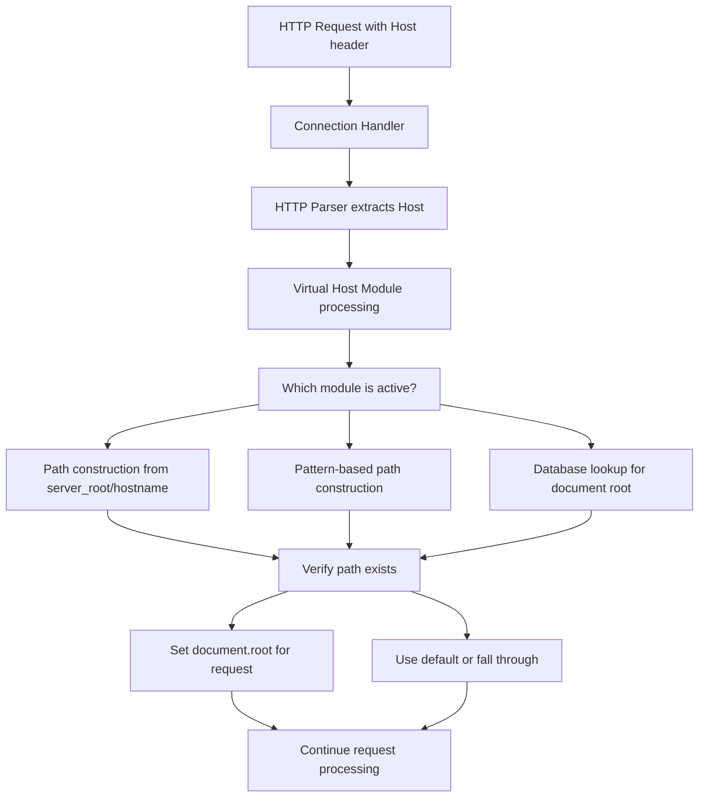
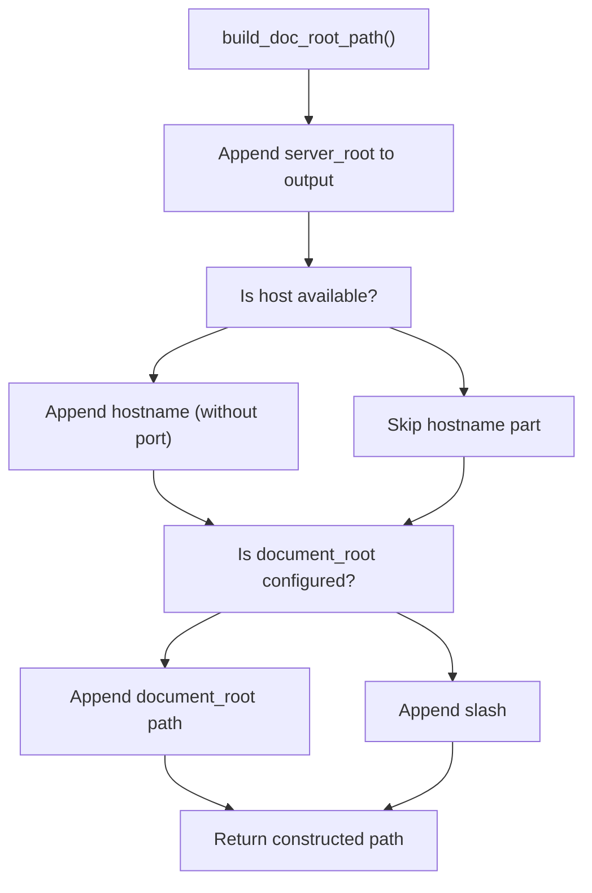
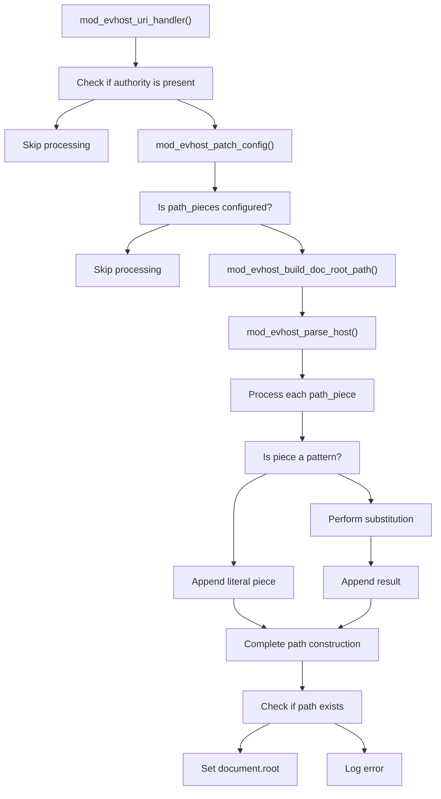
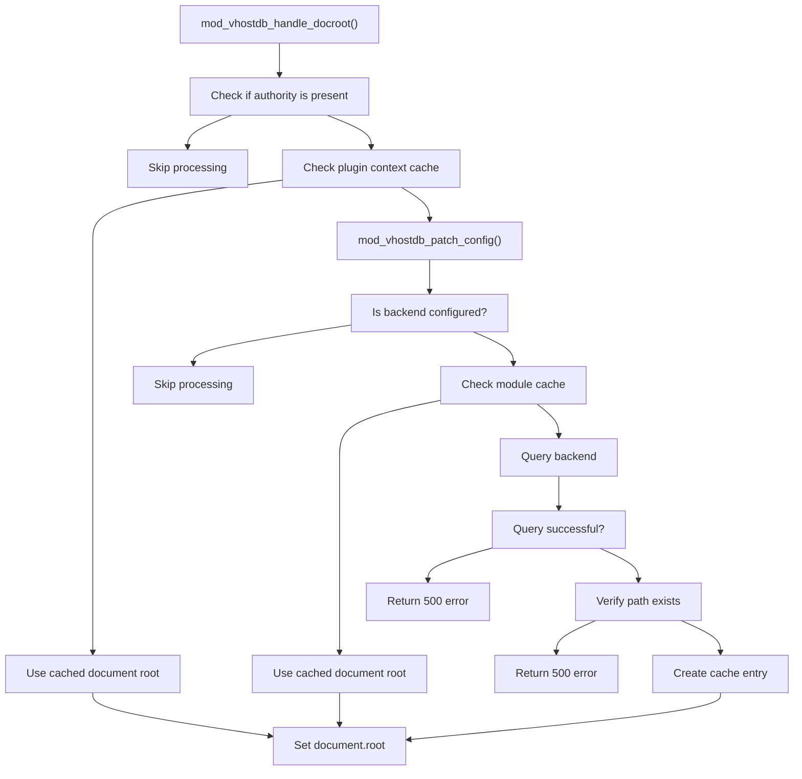
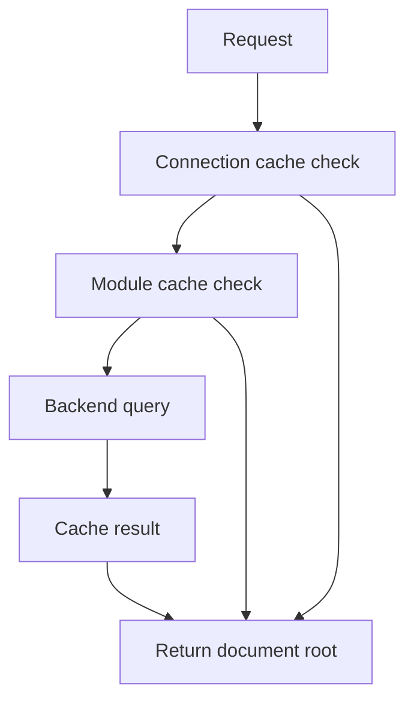

# Virtual Hosting and Domain Mapping

> **Relevant source files**
> * [src/mod_evhost.c](https://github.com/lighttpd/lighttpd1.4/blob/3d550097/src/mod_evhost.c)
> * [src/mod_simple_vhost.c](https://github.com/lighttpd/lighttpd1.4/blob/3d550097/src/mod_simple_vhost.c)
> * [src/mod_vhostdb.c](https://github.com/lighttpd/lighttpd1.4/blob/3d550097/src/mod_vhostdb.c)

## Overview

This document explains the virtual hosting capabilities in lighttpd, which enable a single server to host multiple websites with different domain names. Lighttpd provides three distinct modules for virtual hosting, each offering different approaches to mapping domain names to document roots:

1. `mod_simple_vhost` - A straightforward filesystem-based approach
2. `mod_evhost` - A flexible pattern-based system
3. `mod_vhostdb` - A database-backed solution for dynamic configurations

These modules address different use cases, from simple development environments to complex hosting setups with thousands of domains.

## Virtual Hosting Concepts

In virtual hosting, the web server uses the `Host` header from HTTP requests to determine which website content to serve. Lighttpd maps this hostname to a specific document root directory where the website's files are located.

### Request Flow for Virtual Hosting



Sources: [src/mod_simple_vhost.c L167-L194](https://github.com/lighttpd/lighttpd1.4/blob/3d550097/src/mod_simple_vhost.c#L167-L194)

 [src/mod_evhost.c L322-L346](https://github.com/lighttpd/lighttpd1.4/blob/3d550097/src/mod_evhost.c#L322-L346)

 [src/mod_vhostdb.c L269-L317](https://github.com/lighttpd/lighttpd1.4/blob/3d550097/src/mod_vhostdb.c#L269-L317)

## mod_simple_vhost

The simplest approach to virtual hosting in lighttpd, providing a filesystem-based mapping system.

### Configuration Options

| Option | Description |
| --- | --- |
| `simple-vhost.server-root` | Base directory containing subdirectories for each virtual host |
| `simple-vhost.default-host` | Default hostname to use when the requested host is not found |
| `simple-vhost.document-root` | Optional path to append to the constructed document root |
| `simple-vhost.debug` | Enable debug logging for virtual host resolution |

### Document Root Construction

The document root is constructed as:

```
[server-root]/[hostname]/[document-root]
```

For example, with:

* `simple-vhost.server-root = "/var/www/"`
* Request for "example.com"
* `simple-vhost.document-root = "htdocs"`

The resulting document root would be `/var/www/example.com/htdocs/`.



Sources: [src/mod_simple_vhost.c L132-L147](https://github.com/lighttpd/lighttpd1.4/blob/3d550097/src/mod_simple_vhost.c#L132-L147)

 [src/mod_simple_vhost.c L149-L165](https://github.com/lighttpd/lighttpd1.4/blob/3d550097/src/mod_simple_vhost.c#L149-L165)

### Implementation Details

The module handles document root resolution in the `mod_simple_vhost_docroot` function, which is registered to the `handle_docroot` hook. It checks if the constructed document root exists as a directory before setting it for the request.

The module also includes a one-element cache to avoid redundant filesystem checks when multiple requests use the same hostname.

Sources: [src/mod_simple_vhost.c L167-L194](https://github.com/lighttpd/lighttpd1.4/blob/3d550097/src/mod_simple_vhost.c#L167-L194)

## mod_evhost

A more flexible solution that constructs document roots based on pattern substitution. This is useful for complex hosting environments where more control over path construction is needed.

### Pattern Variables

| Pattern | Description |
| --- | --- |
| `%%` | Literal % character |
| `%0` | Domain name + TLD (e.g., "example.com") |
| `%1` | TLD (e.g., "com") |
| `%2` | Domain without TLD (e.g., "example") |
| `%3` | First subdomain (e.g., "www" in "[www.example.com](http://www.example.com)") |
| `%4` | Second subdomain (e.g., "blog" in "blog.[www.example.com](http://www.example.com)") |
| `%_` | Full hostname without port |
| `%{n}` | n-th component of hostname |
| `%{n.m}` | m-th character of n-th component |

### Hostname Parsing and Pattern Application



Sources: [src/mod_evhost.c L207-L316](https://github.com/lighttpd/lighttpd1.4/blob/3d550097/src/mod_evhost.c#L207-L316)

 [src/mod_evhost.c L322-L346](https://github.com/lighttpd/lighttpd1.4/blob/3d550097/src/mod_evhost.c#L322-L346)

### Pattern Processing

The pattern is parsed during server initialization and stored as an array of buffer pieces. When processing a request, the hostname is parsed into components, and each pattern piece is processed to build the final document root path.

Complex patterns can be created, such as:

```
evhost.path-pattern = "/var/www/%3/%2/%1/htdocs/"
```

For "blog.example.com", this would yield: "/var/www/blog/example/com/htdocs/"

Sources: [src/mod_evhost.c L78-L131](https://github.com/lighttpd/lighttpd1.4/blob/3d550097/src/mod_evhost.c#L78-L131)

 [src/mod_evhost.c L277-L320](https://github.com/lighttpd/lighttpd1.4/blob/3d550097/src/mod_evhost.c#L277-L320)

## mod_vhostdb

The most dynamic virtual hosting module, allowing document roots to be retrieved from external data sources like databases or other backends.

### Architecture



Sources: [src/mod_vhostdb.c L269-L317](https://github.com/lighttpd/lighttpd1.4/blob/3d550097/src/mod_vhostdb.c#L269-L317)

### Configuration Options

| Option | Description |
| --- | --- |
| `vhostdb.backend` | Specifies the backend to use (e.g., "mysql", "pgsql", "ldap", "dbi") |
| `vhostdb.cache` | Configuration for the caching mechanism |

### Caching System

The module implements a sophisticated caching system to avoid repeated database queries:

1. **Connection-Level Cache**: Results cached for the duration of a connection
2. **Module-Level Cache**: Results cached across connections with configurable TTL
3. **Periodic Cleanup**: Expired cache entries are removed periodically



Sources: [src/mod_vhostdb.c L24-L46](https://github.com/lighttpd/lighttpd1.4/blob/3d550097/src/mod_vhostdb.c#L24-L46)

 [src/mod_vhostdb.c L97-L126](https://github.com/lighttpd/lighttpd1.4/blob/3d550097/src/mod_vhostdb.c#L97-L126)

 [src/mod_vhostdb.c L318-L377](https://github.com/lighttpd/lighttpd1.4/blob/3d550097/src/mod_vhostdb.c#L318-L377)

## Comparison of Virtual Hosting Approaches

| Feature | mod_simple_vhost | mod_evhost | mod_vhostdb |
| --- | --- | --- | --- |
| **Complexity** | Low | Medium | High |
| **Flexibility** | Limited | Highly flexible | Most flexible |
| **Performance** | Excellent | Very good | Good (with caching) |
| **Use case** | Small-medium sites | Complex hosting | Dynamic environments |
| **Configuration** | Simple | Pattern-based | Backend-dependent |
| **Maintenance** | Filesystem only | Filesystem only | Requires database |

## Configuration Examples

### mod_simple_vhost Example

```
server.modules += ( "mod_simple_vhost" )
simple-vhost.server-root = "/var/www/"
simple-vhost.default-host = "default.example.com"
simple-vhost.document-root = "htdocs"
```

### mod_evhost Example

```
server.modules += ( "mod_evhost" )
evhost.path-pattern = "/var/www/%3/%2/%1/htdocs/"
```

### mod_vhostdb Example

```javascript
server.modules += ( "mod_vhostdb" )
vhostdb.backend = "mysql"
vhostdb.cache = ( "max-age" => "600" )  # Cache for 10 minutes
```

## Integration with Other Modules

Virtual hosting works alongside other lighttpd modules to provide a complete solution:

* **SSL/TLS modules**: For handling HTTPS for multiple domains
* **Authentication modules**: For domain-specific access control
* **URL rewriting modules**: For manipulating URLs before virtual host processing
* **Logging modules**: For domain-specific log files

For more information on these complementary features, see:

* SSL/TLS Support [SSL/TLS Support](/lighttpd/lighttpd1.4/4.5-ssltls-support)
* Authentication and Authorization [Authentication and Authorization](/lighttpd/lighttpd1.4/4.4-authentication-and-authorization)
* URL Rewriting and Manipulation [URL Rewriting and Manipulation](/lighttpd/lighttpd1.4/4.3-url-rewriting-and-manipulation)

Sources: [src/mod_simple_vhost.c](https://github.com/lighttpd/lighttpd1.4/blob/3d550097/src/mod_simple_vhost.c)

 [src/mod_evhost.c](https://github.com/lighttpd/lighttpd1.4/blob/3d550097/src/mod_evhost.c)

 [src/mod_vhostdb.c](https://github.com/lighttpd/lighttpd1.4/blob/3d550097/src/mod_vhostdb.c)