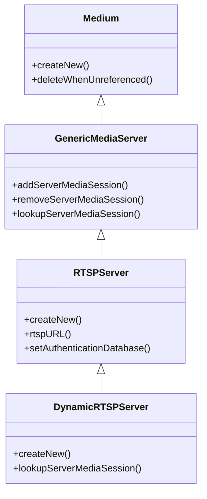
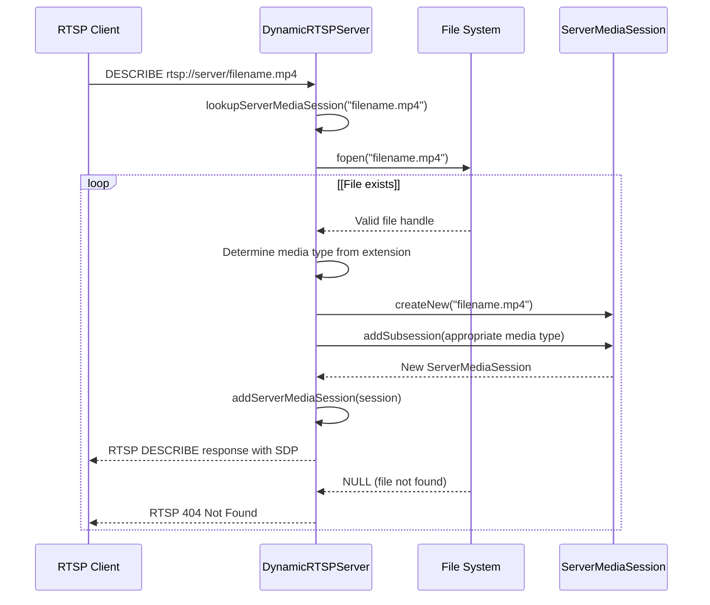
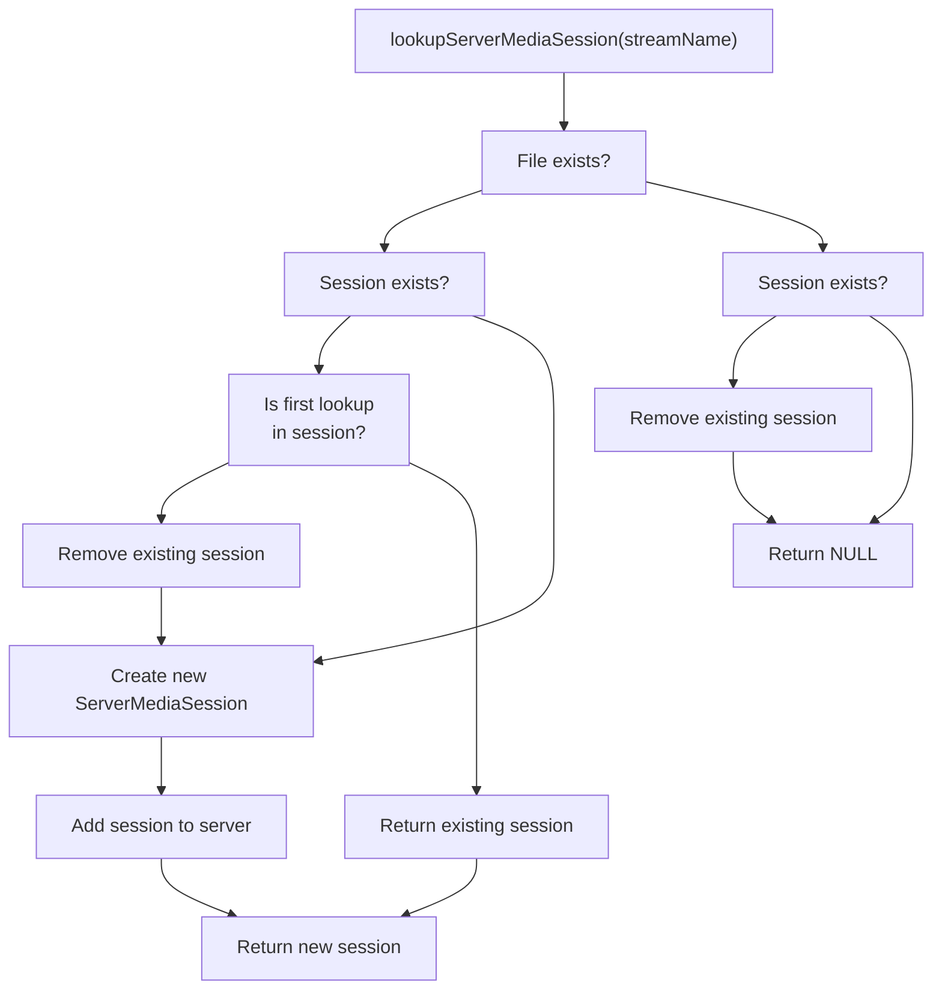
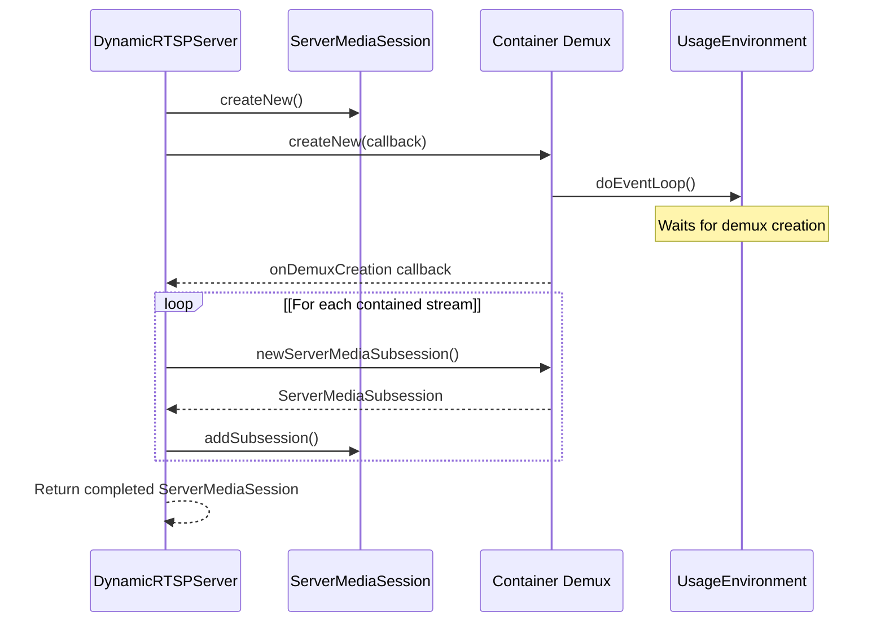
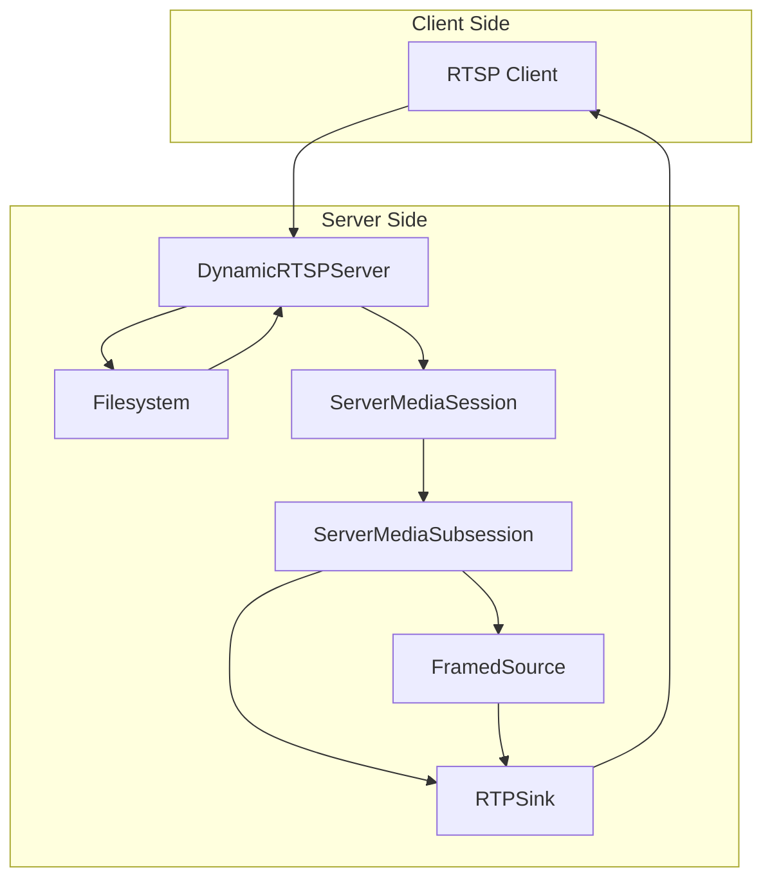
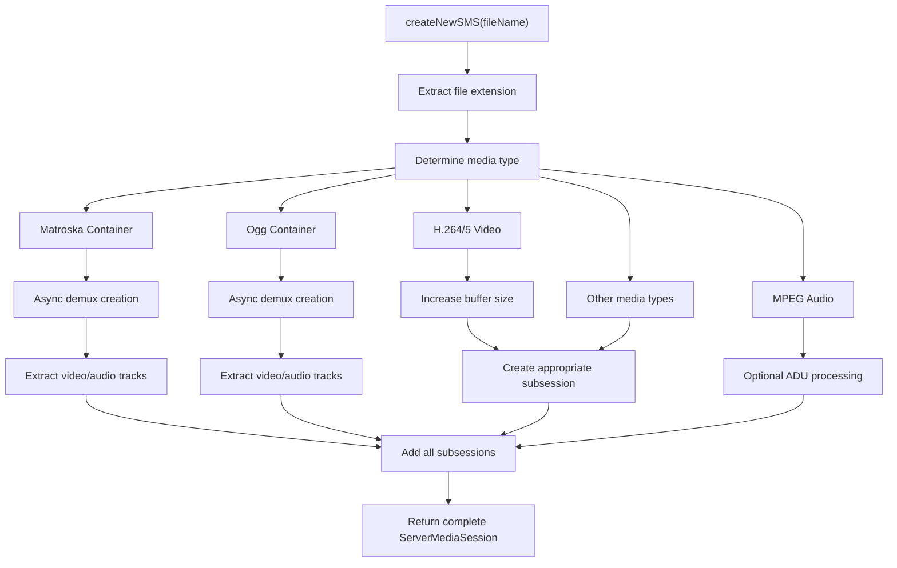

# DynamicRTSPServer

> **Relevant source files**
> * [liveMedia/GenericMediaServer.cpp](https://github.com/rgaufman/live555/blob/a0eb8f91/liveMedia/GenericMediaServer.cpp)
> * [liveMedia/RTSPServer.cpp](https://github.com/rgaufman/live555/blob/a0eb8f91/liveMedia/RTSPServer.cpp)
> * [liveMedia/include/RTSPServer.hh](https://github.com/rgaufman/live555/blob/a0eb8f91/liveMedia/include/RTSPServer.hh)
> * [mediaServer/DynamicRTSPServer.cpp](https://github.com/rgaufman/live555/blob/a0eb8f91/mediaServer/DynamicRTSPServer.cpp)

The `DynamicRTSPServer` is a subclass of `RTSPServer` that dynamically creates `ServerMediaSession` objects on demand based on whether the requested stream name exists as a file in the filesystem. This component is the core of the Live555 Media Server application and handles automatic media file discovery and delivery.

For information about the base `RTSPServer` implementation, see [RTSPServer and GenericMediaServer](/rgaufman/live555/3.1-rtspserver-and-genericmediaserver).

## Class Hierarchy



Sources: [liveMedia/RTSPServer.hh L31-L345](https://github.com/rgaufman/live555/blob/a0eb8f91/liveMedia/RTSPServer.hh#L31-L345)

 [mediaServer/DynamicRTSPServer.cpp L25-L44](https://github.com/rgaufman/live555/blob/a0eb8f91/mediaServer/DynamicRTSPServer.cpp#L25-L44)

## Architecture and Operation

`DynamicRTSPServer` operates by intercepting stream requests and dynamically creating appropriate media sessions based on the files available in the filesystem. This allows the server to serve any supported media file without requiring explicit configuration for each stream.



Sources: [mediaServer/DynamicRTSPServer.cpp L49-L89](https://github.com/rgaufman/live555/blob/a0eb8f91/mediaServer/DynamicRTSPServer.cpp#L49-L89)

## Dynamic Session Creation Process

The core functionality of `DynamicRTSPServer` is implemented in its `lookupServerMediaSession` method. This method overrides the base class implementation and adds the following behavior:

1. Checks if the requested stream name exists as a file in the filesystem
2. If the file exists but no session exists, creates a new `ServerMediaSession`
3. If the file exists and a session already exists, optionally recreates it
4. If the file doesn't exist but a session exists, removes the session
5. Returns the created/found session or NULL if not available



Sources: [mediaServer/DynamicRTSPServer.cpp L49-L89](https://github.com/rgaufman/live555/blob/a0eb8f91/mediaServer/DynamicRTSPServer.cpp#L49-L89)

## Media Type Detection and Session Creation

The `createNewSMS` helper function creates a new `ServerMediaSession` for a given file. It inspects the file extension to determine the media type and creates appropriate subsessions:

| File Extension | Media Type | Subsession Class |
| --- | --- | --- |
| .aac | AAC Audio | ADTSAudioFileServerMediaSubsession |
| .amr | AMR Audio | AMRAudioFileServerMediaSubsession |
| .ac3 | AC-3 Audio | AC3AudioFileServerMediaSubsession |
| .m4e | MPEG-4 Video | MPEG4VideoFileServerMediaSubsession |
| .264 | H.264 Video | H264VideoFileServerMediaSubsession |
| .265 | H.265 Video | H265VideoFileServerMediaSubsession |
| .mp3 | MPEG Audio | MP3AudioFileServerMediaSubsession |
| .mpg | MPEG Program Stream | MPEG1or2FileServerDemux |
| .vob | VOB (MPEG-2/AC-3) | MPEG1or2FileServerDemux |
| .ts | MPEG Transport Stream | MPEG2TransportFileServerMediaSubsession |
| .wav | WAV Audio | WAVAudioFileServerMediaSubsession |
| .dv | DV Video | DVVideoFileServerMediaSubsession |
| .mkv, .webm | Matroska/WebM | MatroskaFileServerDemux |
| .ogg, .ogv, .opus | Ogg | OggFileServerDemux |

For container formats like Matroska/WebM and Ogg, the server uses specialized demultiplexers that create appropriate subsessions for the contained audio, video, and subtitle tracks.

Sources: [mediaServer/DynamicRTSPServer.cpp L115-L247](https://github.com/rgaufman/live555/blob/a0eb8f91/mediaServer/DynamicRTSPServer.cpp#L115-L247)

## Specialized Demultiplexers

For container formats that may contain multiple streams (like Matroska/WebM or Ogg), `DynamicRTSPServer` uses special asynchronous creation processes:



These demultiplexers require a special callback-based approach because they need to analyze the container file structure, which can be time-consuming.

Sources: [mediaServer/DynamicRTSPServer.cpp L91-L113](https://github.com/rgaufman/live555/blob/a0eb8f91/mediaServer/DynamicRTSPServer.cpp#L91-L113)

 [mediaServer/DynamicRTSPServer.cpp L213-L244](https://github.com/rgaufman/live555/blob/a0eb8f91/mediaServer/DynamicRTSPServer.cpp#L213-L244)

## Implementation Details

### Class Constructor and Destructor

The `DynamicRTSPServer` constructor takes the same parameters as its parent class `RTSPServer`:

```yaml
DynamicRTSPServer::DynamicRTSPServer(UsageEnvironment& env, int ourSocketIPv4, int ourSocketIPv6,
                                     Port ourPort,
                                     UserAuthenticationDatabase* authDatabase, 
                                     unsigned reclamationTestSeconds)
  : RTSPServer(env, ourSocketIPv4, ourSocketIPv6, ourPort, authDatabase, reclamationTestSeconds) {
}
```

The class has a very simple destructor as it inherits most of its behavior from the parent class.

Sources: [mediaServer/DynamicRTSPServer.cpp L37-L44](https://github.com/rgaufman/live555/blob/a0eb8f91/mediaServer/DynamicRTSPServer.cpp#L37-L44)

### The Server Creation Process

The static `createNew` method handles socket setup and object creation:

```
DynamicRTSPServer* DynamicRTSPServer::createNew(UsageEnvironment& env, Port ourPort,
                                               UserAuthenticationDatabase* authDatabase,
                                               unsigned reclamationTestSeconds) {
  int ourSocketIPv4 = setUpOurSocket(env, ourPort, AF_INET);
  int ourSocketIPv6 = setUpOurSocket(env, ourPort, AF_INET6);
  if (ourSocketIPv4 < 0 && ourSocketIPv6 < 0) return NULL;

  return new DynamicRTSPServer(env, ourSocketIPv4, ourSocketIPv6, ourPort,
                              authDatabase, reclamationTestSeconds);
}
```

The server attempts to create both IPv4 and IPv6 sockets to support either protocol.

Sources: [mediaServer/DynamicRTSPServer.cpp L25-L35](https://github.com/rgaufman/live555/blob/a0eb8f91/mediaServer/DynamicRTSPServer.cpp#L25-L35)

## Integration with Live555 Media Server

The `DynamicRTSPServer` is a key component of the Live555 Media Server application. The server is designed to:

1. Run as a standalone RTSP server application
2. Automatically serve any supported media file in its working directory
3. Require no configuration for adding new media
4. Allow clients to connect using standard RTSP URL format: `rtsp://server:port/filename`

### Client Request Process



Sources: [mediaServer/DynamicRTSPServer.cpp L49-L89](https://github.com/rgaufman/live555/blob/a0eb8f91/mediaServer/DynamicRTSPServer.cpp#L49-L89)

 [liveMedia/RTSPServer.cpp L862-L866](https://github.com/rgaufman/live555/blob/a0eb8f91/liveMedia/RTSPServer.cpp#L862-L866)

## Supported Media Format Handling

For each supported media format, `DynamicRTSPServer` creates the appropriate type of `ServerMediaSubsession` that knows how to read and stream that format. In some cases, special configuration is applied:

* For H.264/H.265 video: Increases the `OutPacketBuffer::maxSize` to 2,000,000 bytes to handle large frames
* For Matroska/WebM: Uses an asynchronous creation process with callbacks
* For Ogg files: Similarly uses an asynchronous creation process
* For MP3 files: Supports optional streaming using ADUs and interleaving

When streaming certain formats, special considerations are handled:



Sources: [mediaServer/DynamicRTSPServer.cpp L121-L247](https://github.com/rgaufman/live555/blob/a0eb8f91/mediaServer/DynamicRTSPServer.cpp#L121-L247)

## Automatic Session Management

The `DynamicRTSPServer` also handles session management automatically:

1. If a file is deleted while its session exists, the session will be removed on the next lookup
2. If a file is modified, its session can be rebuilt on new requests (if `isFirstLookupInSession` is true)
3. Sessions are automatically reclaimed if unused for a specified timeout period (inherited from `RTSPServer`)

This dynamic approach makes the server very flexible for changing media libraries without requiring restart or reconfiguration.

Sources: [mediaServer/DynamicRTSPServer.cpp L62-L76](https://github.com/rgaufman/live555/blob/a0eb8f91/mediaServer/DynamicRTSPServer.cpp#L62-L76)