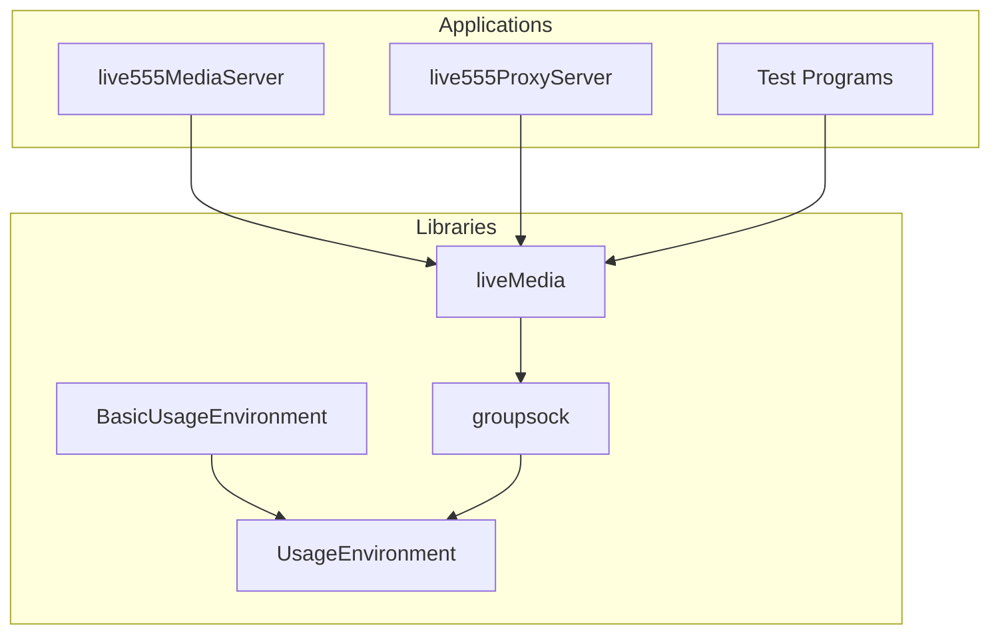
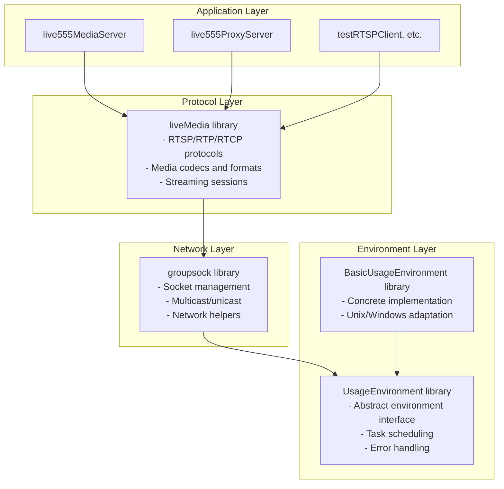
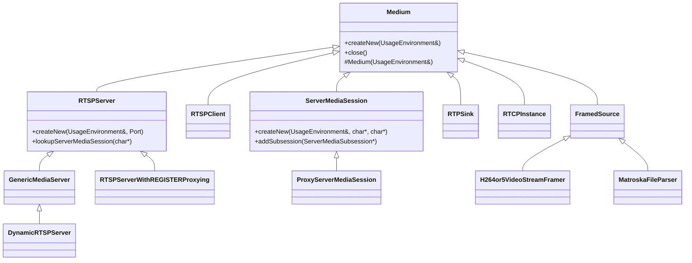
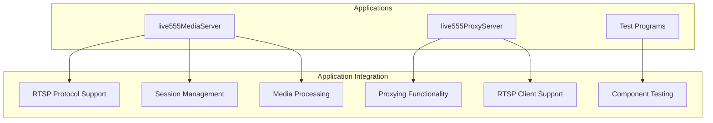

# Library Structure

> **Relevant source files**
> * [README.md](https://github.com/rgaufman/live555/blob/a0eb8f91/README.md)
> * [config.linux](https://github.com/rgaufman/live555/blob/a0eb8f91/config.linux)
> * [config.linux-with-shared-libraries](https://github.com/rgaufman/live555/blob/a0eb8f91/config.linux-with-shared-libraries)

## Purpose

This document provides an overview of the core libraries that compose the LIVE555 Streaming Media framework, detailing their hierarchical relationships, responsibilities, and dependencies. This page focuses on the structural organization of the codebase rather than its runtime behavior. For information about specific components like the RTSP Server or Media Session Management, see [RTSP Media Server](/rgaufman/live555/3-rtsp-media-server) and [Media Session Management](/rgaufman/live555/4-media-session-management).

## Library Overview

The LIVE555 framework consists of four primary libraries that provide progressively higher levels of functionality for streaming media applications:

Sources: [README.md L10-L14](https://github.com/rgaufman/live555/blob/a0eb8f91/README.md#L10-L14)

 [config.linux-with-shared-libraries L6-L24](https://github.com/rgaufman/live555/blob/a0eb8f91/config.linux-with-shared-libraries#L6-L24)

## Library Dependency Structure

The LIVE555 framework follows a layered architecture where each library builds upon the functionality of lower-level libraries:

Sources: [config.linux-with-shared-libraries L6-L24](https://github.com/rgaufman/live555/blob/a0eb8f91/config.linux-with-shared-libraries#L6-L24)

 [config.linux L14-L17](https://github.com/rgaufman/live555/blob/a0eb8f91/config.linux#L14-L17)

## Library Descriptions

### 1. BasicUsageEnvironment Library

The most foundational library, providing concrete implementations of the abstract interfaces defined in UsageEnvironment. It handles platform-specific functionality.

**Key responsibilities:**

* Platform-specific implementation of the TaskScheduler
* Input/output handling for different operating systems
* Error logging and handling mechanisms
* Event loop implementation

**Current version:** 3.1.0 (as of config.linux-with-shared-libraries)

Sources: [config.linux-with-shared-libraries L11-L14](https://github.com/rgaufman/live555/blob/a0eb8f91/config.linux-with-shared-libraries#L11-L14)

### 2. UsageEnvironment Library

An abstract interface layer defining core functionality that the higher-level libraries depend on.

**Key responsibilities:**

* Abstract TaskScheduler interface for event-driven programming
* Error handling interfaces
* Logging and notification mechanisms
* System time utilities

**Current version:** 5.2.0 (as of config.linux-with-shared-libraries)

Sources: [config.linux-with-shared-libraries L16-L19](https://github.com/rgaufman/live555/blob/a0eb8f91/config.linux-with-shared-libraries#L16-L19)

### 3. groupsock Library

Provides network socket management and handling, particularly for multicast and unicast communication required for RTP/RTCP.

**Key responsibilities:**

* Socket management for UDP and TCP
* IP multicast group management
* Network address handling
* Packet buffer handling

**Current version:** 32.2.0 (as of config.linux-with-shared-libraries)

**Key components:**

* Groupsock class for multicast/unicast socket management
* GroupsockHelper for network utility functions
* NetInterface for network interface management

Sources: [config.linux-with-shared-libraries L21-L24](https://github.com/rgaufman/live555/blob/a0eb8f91/config.linux-with-shared-libraries#L21-L24)

 [config.linux L15](https://github.com/rgaufman/live555/blob/a0eb8f91/config.linux#L15-L15)

### 4. liveMedia Library

The primary library implementing streaming protocols, codecs, and media formats. This is the highest-level library that applications directly interact with.

**Key responsibilities:**

* RTSP server and client implementations
* RTP/RTCP protocol implementation
* Media format framing and parsing
* Streaming session management
* Codec-specific handling (H.264, AAC, MP3, etc.)

**Current version:** 115.0.4 (as of config.linux-with-shared-libraries)

**Key components:**

* RTSPServer and variants for media serving
* MediaSession classes for managing streaming sessions
* Various media format-specific classes (H264VideoStreamFramer, etc.)
* RTPSink variants for different media types

Sources: [config.linux-with-shared-libraries L6-L9](https://github.com/rgaufman/live555/blob/a0eb8f91/config.linux-with-shared-libraries#L6-L9)

 [config.linux L14](https://github.com/rgaufman/live555/blob/a0eb8f91/config.linux#L14-L14)

 [README.md L13-L14](https://github.com/rgaufman/live555/blob/a0eb8f91/README.md#L13-L14)

## Class Inheritance Structure

The LIVE555 codebase follows a well-defined inheritance hierarchy with `Medium` as the base class for most components:

Sources: [README.md L12-L14](https://github.com/rgaufman/live555/blob/a0eb8f91/README.md#L12-L14)

## Library Compilation and Building

The LIVE555 libraries are built using a configuration-based system where platform-specific settings are defined in config.* files.

**Build process:**

1. Select platform-specific configuration using `./genMakefiles [platform]`
2. Build the libraries and applications using `make`

**Configuration options:**

* Compiler flags and options
* Library linking settings
* Platform-specific adaptations

**Shared vs. Static Libraries:**
LIVE555 can be built with either static libraries (`.a` files) or shared libraries (`.so` files) depending on the configuration used.

Sources: [README.md L1-L8](https://github.com/rgaufman/live555/blob/a0eb8f91/README.md#L1-L8)

 [config.linux L1-L18](https://github.com/rgaufman/live555/blob/a0eb8f91/config.linux#L1-L18)

 [config.linux-with-shared-libraries L1-L47](https://github.com/rgaufman/live555/blob/a0eb8f91/config.linux-with-shared-libraries#L1-L47)

## Integration with Applications

The libraries are used by the following main applications:

1. **live555MediaServer** - An RTSP media server for serving static files via RTSP/RTP
2. **live555ProxyServer** - An RTSP proxy server for relaying streams from other sources
3. **Test Programs** - Various test applications like testRTSPClient for testing and demonstration

Sources: [README.md L10-L14](https://github.com/rgaufman/live555/blob/a0eb8f91/README.md#L10-L14)

## Build Configuration and Versioning

The LIVE555 libraries follow a versioning scheme based on "CURRENT:REVISION:AGE" that follows standard shared library versioning practices:

| Library | Current Version | Library Suffix |
| --- | --- | --- |
| liveMedia | 115.0.4 | .so.115.0.4 |
| BasicUsageEnvironment | 3.1.0 | .so.2.1.0 |
| UsageEnvironment | 5.2.0 | .so.3.2.0 |
| groupsock | 32.2.0 | .so.30.2.0 |

Version updates follow these rules:

* API unchanged, implementation changed: increment REVISION
* Interface changed or removed: CURRENT += 1, REVISION = 0, AGE = 0
* Interface added without changes to existing ones: CURRENT += 1, REVISION = 0, AGE += 1

Sources: [config.linux-with-shared-libraries L1-L24](https://github.com/rgaufman/live555/blob/a0eb8f91/config.linux-with-shared-libraries#L1-L24)

## Platform Support

The library structure is designed to support cross-platform compilation through configuration files for different platforms:

* Linux (32/64-bit)
* macOS
* Windows (via Cygwin)
* FreeBSD, OpenBSD
* Embedded platforms (e.g., AVR32)
* iOS
* Solaris

Each platform has its own configuration file (config.PLATFORM) that defines compiler settings, flags, and linking options.

Sources: [README.md L8](https://github.com/rgaufman/live555/blob/a0eb8f91/README.md#L8-L8)

 [config.linux L1-L18](https://github.com/rgaufman/live555/blob/a0eb8f91/config.linux#L1-L18)

 [config.linux-with-shared-libraries L27-L47](https://github.com/rgaufman/live555/blob/a0eb8f91/config.linux-with-shared-libraries#L27-L47)