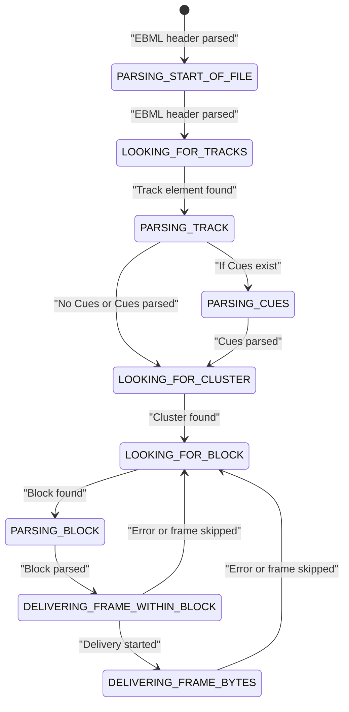
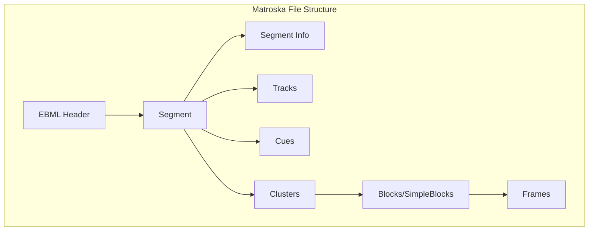
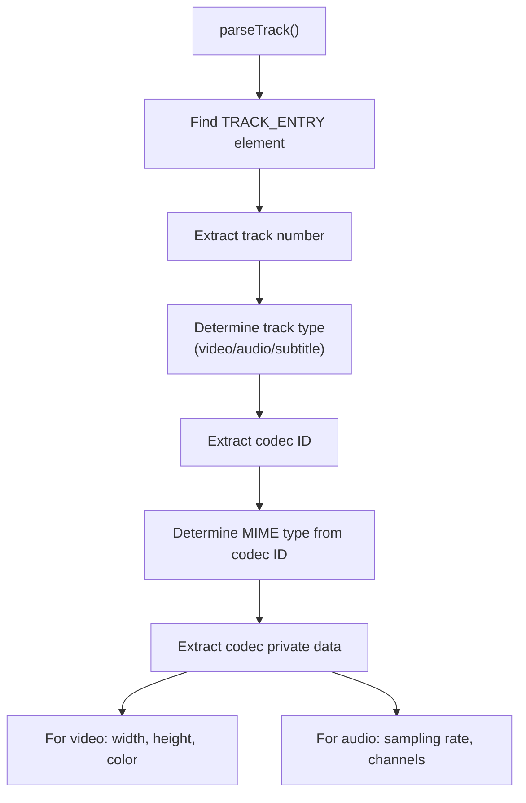
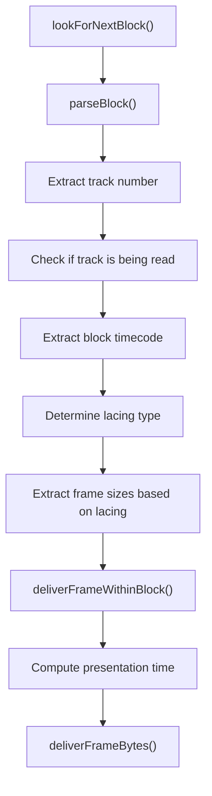
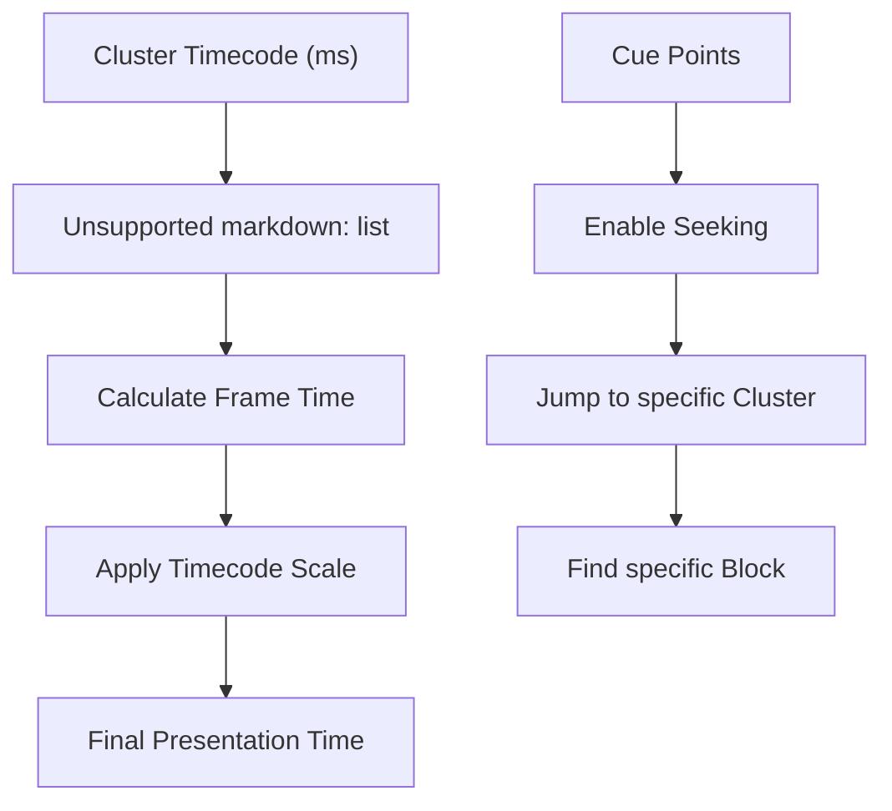
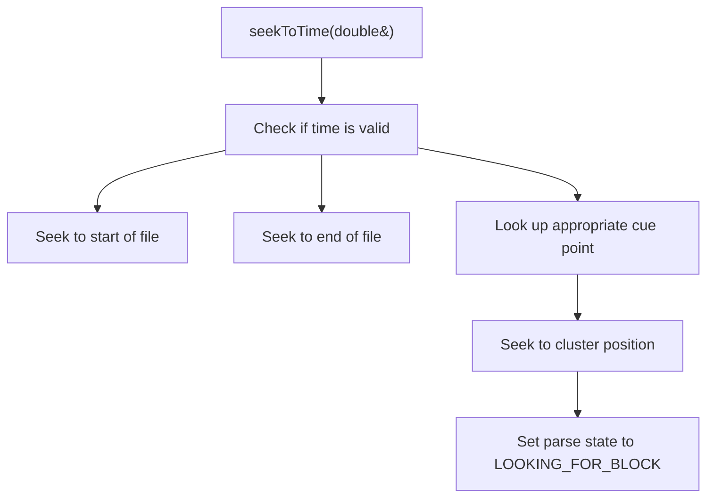
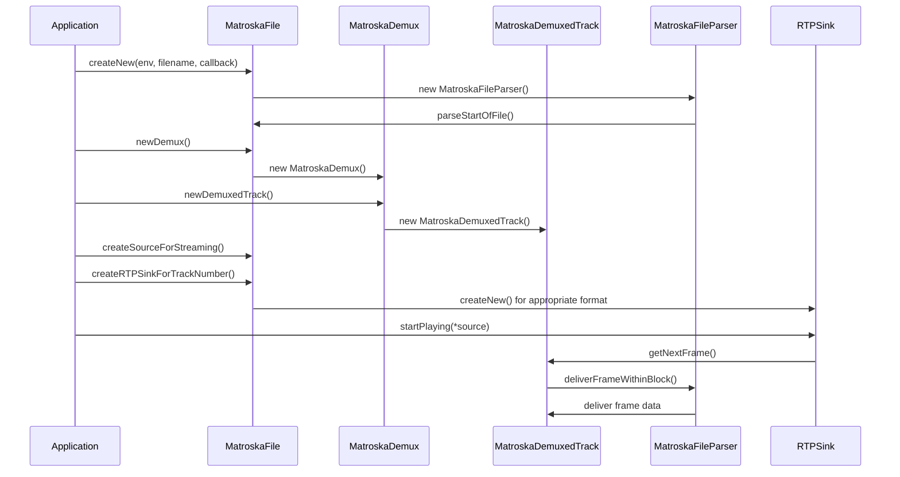

# Matroska File Parsing

> **Relevant source files**
> * [liveMedia/H263plusVideoStreamParser.cpp](https://github.com/rgaufman/live555/blob/a0eb8f91/liveMedia/H263plusVideoStreamParser.cpp)
> * [liveMedia/MPEG2IndexFromTransportStream.cpp](https://github.com/rgaufman/live555/blob/a0eb8f91/liveMedia/MPEG2IndexFromTransportStream.cpp)
> * [liveMedia/MatroskaFileParser.cpp](https://github.com/rgaufman/live555/blob/a0eb8f91/liveMedia/MatroskaFileParser.cpp)
> * [testProgs/testMKVStreamer.cpp](https://github.com/rgaufman/live555/blob/a0eb8f91/testProgs/testMKVStreamer.cpp)

## Purpose and Scope

This document describes the Matroska file parsing component of the LIVE555 Streaming Media library. This component enables the library to parse, demultiplex, and stream media content from Matroska (.mkv) and WebM (.webm) container format files. It provides functionality for extracting track information, parsing individual frames, handling timing information, and delivering media data to the appropriate streaming components.

For information about streaming the extracted data over RTP/RTSP, see [Media Session Management](/rgaufman/live555/4-media-session-management) and [Network Protocol Implementation](/rgaufman/live555/5-network-protocol-implementation).

## Class Structure

The Matroska file parsing system consists of several interconnected classes that handle different aspects of the parsing and demultiplexing process.

```

```

Sources: [liveMedia/MatroskaFileParser.cpp L26-L46](https://github.com/rgaufman/live555/blob/a0eb8f91/liveMedia/MatroskaFileParser.cpp#L26-L46)

 [liveMedia/MatroskaFileParser.cpp L96-L116](https://github.com/rgaufman/live555/blob/a0eb8f91/liveMedia/MatroskaFileParser.cpp#L96-L116)

## Matroska File Format Parsing Process

The parser processes Matroska files according to the EBML (Extensible Binary Meta Language) format specification. EBML is a hierarchical binary format with ID and size information preceding each element.

### Parser State Machine

The parser operates as a state machine that transitions through various states as it processes the file:



Sources: [liveMedia/MatroskaFileParser.cpp L118-L194](https://github.com/rgaufman/live555/blob/a0eb8f91/liveMedia/MatroskaFileParser.cpp#L118-L194)

### File Structure Parsing

The parser processes these key Matroska file elements:

1. **EBML Header**: Contains information about the document type and version
2. **Segment**: The main container for all other top-level elements
3. **Segment Info**: Contains general information about the segment
4. **Tracks**: Contains information about each track
5. **Cues**: Index points for seeking
6. **Clusters**: Contains the actual media data blocks
7. **Blocks/SimpleBlocks**: Contains actual frame data



Sources: [liveMedia/MatroskaFileParser.cpp L196-L216](https://github.com/rgaufman/live555/blob/a0eb8f91/liveMedia/MatroskaFileParser.cpp#L196-L216)

 [liveMedia/MatroskaFileParser.cpp L316-L754](https://github.com/rgaufman/live555/blob/a0eb8f91/liveMedia/MatroskaFileParser.cpp#L316-L754)

## Track Information Parsing

The parser extracts detailed information about each track in the Matroska file, including:

* Track number and type (video, audio, subtitle)
* Codec ID and MIME type
* Video attributes (width, height, color space)
* Audio attributes (sampling frequency, channels, bit depth)
* Codec private data

The parser supports a wide range of codecs including:

| Media Type | Supported Codecs |
| --- | --- |
| Video | H.264, H.265, VP8, VP9, THEORA, MJPEG |
| Audio | PCM, MP3, AAC, AC3, VORBIS, OPUS |
| Subtitles | Text subtitles |

The codec identification happens in the track parsing process:



Sources: [liveMedia/MatroskaFileParser.cpp L316-L754](https://github.com/rgaufman/live555/blob/a0eb8f91/liveMedia/MatroskaFileParser.cpp#L316-L754)

 [liveMedia/MatroskaFileParser.cpp L443-L487](https://github.com/rgaufman/live555/blob/a0eb8f91/liveMedia/MatroskaFileParser.cpp#L443-L487)

## Block Parsing and Frame Delivery

The parser extracts frames from Blocks or SimpleBlocks within Clusters:

1. Locates a Block or SimpleBlock element
2. Extracts the track number and timecode
3. Determines the lacing type (None, EBML, Xiph, Fixed-size)
4. Extracts individual frames according to lacing
5. Delivers frames with correct timing information



Sources: [liveMedia/MatroskaFileParser.cpp L756-L858](https://github.com/rgaufman/live555/blob/a0eb8f91/liveMedia/MatroskaFileParser.cpp#L756-L858)

 [liveMedia/MatroskaFileParser.cpp L951-L1390](https://github.com/rgaufman/live555/blob/a0eb8f91/liveMedia/MatroskaFileParser.cpp#L951-L1390)

### Lacing Types

The parser supports various lacing methods that allow multiple frames to be stored in a single block:

| Lacing Type | Description |
| --- | --- |
| No Lacing | Block contains a single frame |
| EBML Lacing | Frame sizes encoded using EBML coding |
| Xiph Lacing | Frame sizes encoded using Xiph method |
| Fixed-Size | All frames in block have the same size |

Sources: [liveMedia/MatroskaFileParser.cpp L984-L1054](https://github.com/rgaufman/live555/blob/a0eb8f91/liveMedia/MatroskaFileParser.cpp#L984-L1054)

## Timing Model

The Matroska parser handles timing information for accurate media playback:

1. Extracts the timecode scale from the file (default is 1,000,000 nanoseconds)
2. Uses cluster timecode as a base time reference
3. Adds block timecode for relative timing within the cluster
4. Calculates presentation timestamps for each frame
5. Supports seeking within the file via cue points



Sources: [liveMedia/MatroskaFileParser.cpp L271-L290](https://github.com/rgaufman/live555/blob/a0eb8f91/liveMedia/MatroskaFileParser.cpp#L271-L290)

 [liveMedia/MatroskaFileParser.cpp L1143-L1157](https://github.com/rgaufman/live555/blob/a0eb8f91/liveMedia/MatroskaFileParser.cpp#L1143-L1157)

 [liveMedia/MatroskaFileParser.cpp L53-L86](https://github.com/rgaufman/live555/blob/a0eb8f91/liveMedia/MatroskaFileParser.cpp#L53-L86)

## Seeking Support

The parser supports efficient seeking within the Matroska file using cue points:



Sources: [liveMedia/MatroskaFileParser.cpp L53-L86](https://github.com/rgaufman/live555/blob/a0eb8f91/liveMedia/MatroskaFileParser.cpp#L53-L86)

 [liveMedia/MatroskaFileParser.cpp L860-L947](https://github.com/rgaufman/live555/blob/a0eb8f91/liveMedia/MatroskaFileParser.cpp#L860-L947)

## Usage Example

The Matroska file parser is typically used for streaming Matroska/WebM files via RTSP, as shown in the test program:



Sources: [testProgs/testMKVStreamer.cpp L77-L138](https://github.com/rgaufman/live555/blob/a0eb8f91/testProgs/testMKVStreamer.cpp#L77-L138)

 [testProgs/testMKVStreamer.cpp L169-L177](https://github.com/rgaufman/live555/blob/a0eb8f91/testProgs/testMKVStreamer.cpp#L169-L177)

## Codec Support Details

The parser identifies codecs from the track's codec ID and sets the appropriate MIME type:

| Codec ID | MIME Type | Description |
| --- | --- | --- |
| A_PCM/INT/BIG | audio/L16 | PCM audio |
| A_MPEG | audio/MPEG | MPEG audio |
| A_AAC | audio/AAC | AAC audio |
| A_AC3 | audio/AC3 | AC3 audio |
| A_VORBIS | audio/VORBIS | Vorbis audio |
| A_OPUS | audio/OPUS | Opus audio |
| V_MPEG4/ISO/AVC | video/H264 | H.264 video |
| V_MPEGH/ISO/HEVC | video/H265 | H.265 video |
| V_VP8 | video/VP8 | VP8 video |
| V_VP9 | video/VP9 | VP9 video |
| V_THEORA | video/THEORA | Theora video |
| S_TEXT | text/T140 | Text subtitles |
| V_MJPEG | video/JPEG | Motion JPEG |
| V_UNCOMPRESSED | video/RAW | Raw video |

Sources: [liveMedia/MatroskaFileParser.cpp L443-L487](https://github.com/rgaufman/live555/blob/a0eb8f91/liveMedia/MatroskaFileParser.cpp#L443-L487)

## Special Handling for H.264 and H.265

The parser includes special handling for H.264 and H.265 video, extracting NAL unit length size information from the codec private data:

* For H.264, it reads the `lengthSizeMinusOne` parameter from byte 4 of the codec private data
* For H.265, it checks if the codec private data uses standard format or H.264-compatible format, then extracts the length size

Sources: [liveMedia/MatroskaFileParser.cpp L504-L533](https://github.com/rgaufman/live555/blob/a0eb8f91/liveMedia/MatroskaFileParser.cpp#L504-L533)