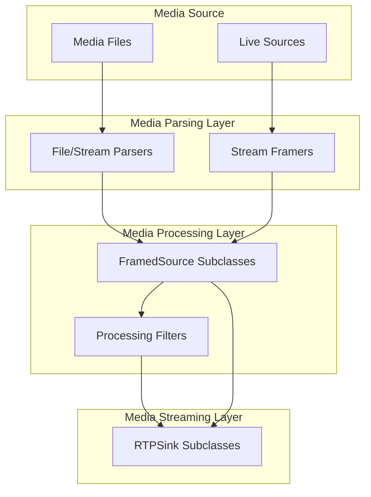
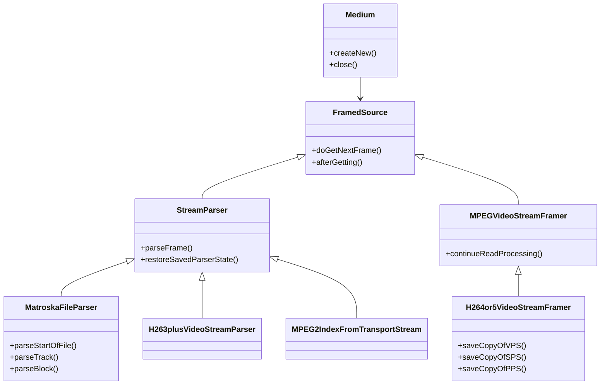
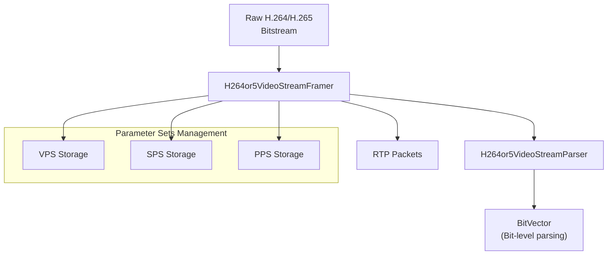
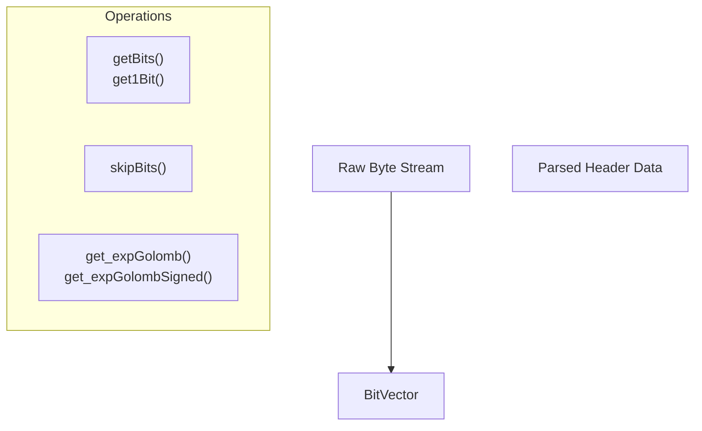
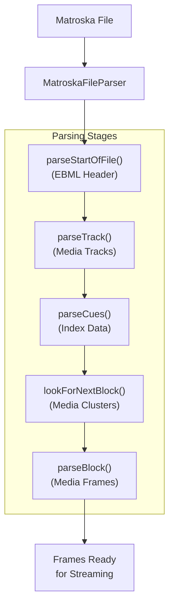
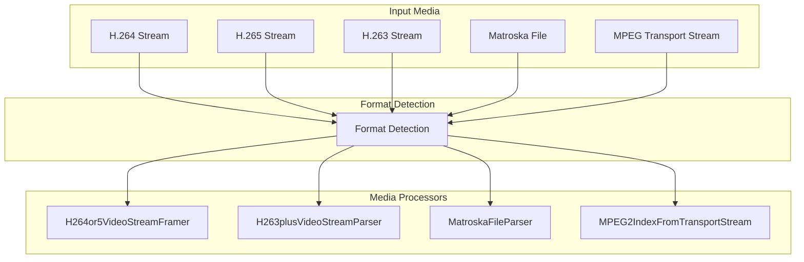
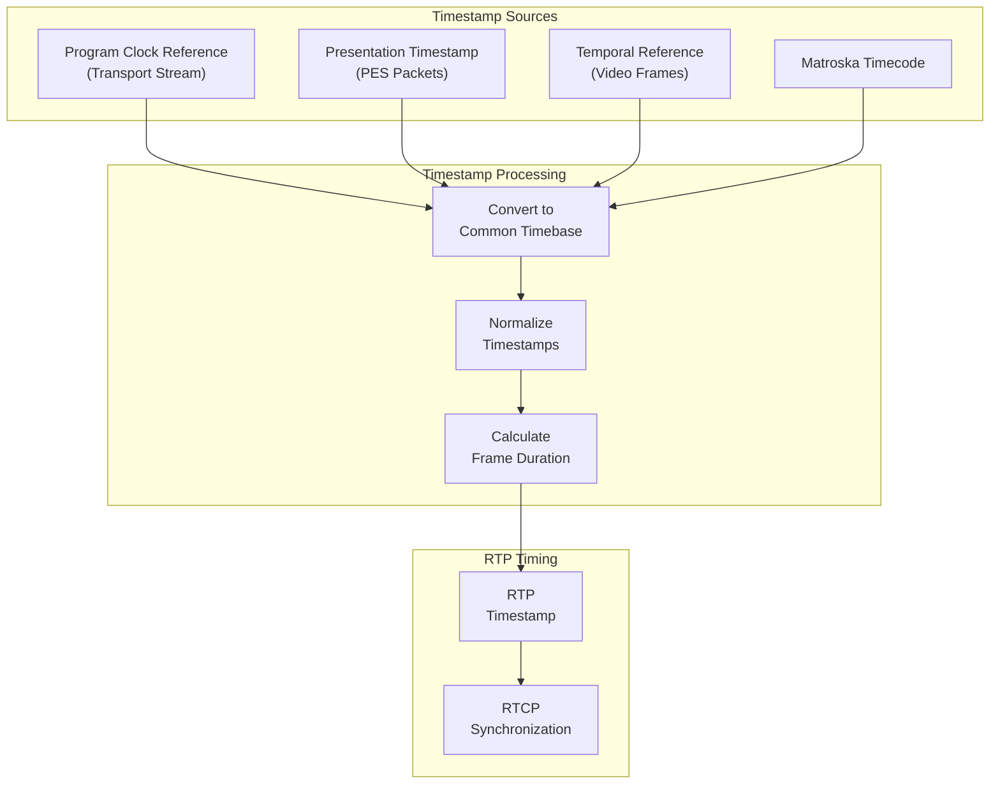
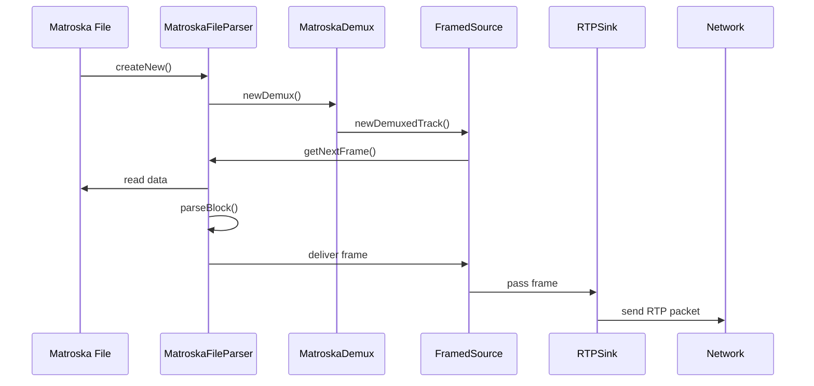
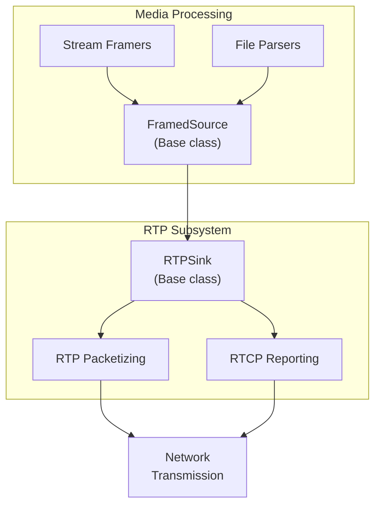

# Media Processing

> **Relevant source files**
> * [liveMedia/BitVector.cpp](https://github.com/rgaufman/live555/blob/a0eb8f91/liveMedia/BitVector.cpp)
> * [liveMedia/H263plusVideoStreamParser.cpp](https://github.com/rgaufman/live555/blob/a0eb8f91/liveMedia/H263plusVideoStreamParser.cpp)
> * [liveMedia/H264or5VideoStreamFramer.cpp](https://github.com/rgaufman/live555/blob/a0eb8f91/liveMedia/H264or5VideoStreamFramer.cpp)
> * [liveMedia/MPEG2IndexFromTransportStream.cpp](https://github.com/rgaufman/live555/blob/a0eb8f91/liveMedia/MPEG2IndexFromTransportStream.cpp)
> * [liveMedia/MatroskaFileParser.cpp](https://github.com/rgaufman/live555/blob/a0eb8f91/liveMedia/MatroskaFileParser.cpp)
> * [liveMedia/include/BitVector.hh](https://github.com/rgaufman/live555/blob/a0eb8f91/liveMedia/include/BitVector.hh)
> * [testProgs/testMKVStreamer.cpp](https://github.com/rgaufman/live555/blob/a0eb8f91/testProgs/testMKVStreamer.cpp)

This document covers the media processing components in the LIVE555 Streaming Media library that handle parsing, framing, and transforming various media formats for network streaming. These components serve as the crucial bridge between raw media data and network-ready RTP packets. For information about the network protocol implementation used to transmit processed media, see [Network Protocol Implementation](/rgaufman/live555/5-network-protocol-implementation).

## Overview of Media Processing Architecture

The LIVE555 library implements a modular approach to media processing, with specialized components for different media formats. The architecture is designed to efficiently parse media files or streams, extract frames, and prepare them for transmission over networks using RTP.

Sources: [liveMedia/H264or5VideoStreamFramer.cpp L1-L190](https://github.com/rgaufman/live555/blob/a0eb8f91/liveMedia/H264or5VideoStreamFramer.cpp#L1-L190)

 [liveMedia/MatroskaFileParser.cpp L20-L99](https://github.com/rgaufman/live555/blob/a0eb8f91/liveMedia/MatroskaFileParser.cpp#L20-L99)

## Media Source Processing Hierarchy

The LIVE555 library implements a class hierarchy for processing different media sources, with `FramedSource` as the base class. Specialized subclasses handle specific media formats and protocols.

Sources: [liveMedia/H264or5VideoStreamFramer.cpp L74-L189](https://github.com/rgaufman/live555/blob/a0eb8f91/liveMedia/H264or5VideoStreamFramer.cpp#L74-L189)

 [liveMedia/MatroskaFileParser.cpp L26-L115](https://github.com/rgaufman/live555/blob/a0eb8f91/liveMedia/MatroskaFileParser.cpp#L26-L115)

## Video Parsing and Framing

### H.264/H.265 Video Processing

The `H264or5VideoStreamFramer` class is a specialized framer for H.264 and H.265 video streams. It handles the complexities of these video formats, including:

1. NAL unit parsing
2. Parameter sets management (VPS, SPS, PPS)
3. Frame boundary detection
4. Timestamp calculation

Sources: [liveMedia/H264or5VideoStreamFramer.cpp L27-L189](https://github.com/rgaufman/live555/blob/a0eb8f91/liveMedia/H264or5VideoStreamFramer.cpp#L27-L189)

 [liveMedia/BitVector.cpp L20-L55](https://github.com/rgaufman/live555/blob/a0eb8f91/liveMedia/BitVector.cpp#L20-L55)

The `H264or5VideoStreamFramer` implements methods to save and manage parameter sets which are essential for video decoding:

* `saveCopyOfVPS()`: Stores the Video Parameter Set (H.265 only)
* `saveCopyOfSPS()`: Stores the Sequence Parameter Set
* `saveCopyOfPPS()`: Stores the Picture Parameter Set

These parameter sets are then made available to the decoder through the RTP stream.

### Bit-Level Parsing

Media formats require bit-level precision for parsing headers and other metadata. The `BitVector` class provides utilities for manipulating bits within byte streams:

Sources: [liveMedia/include/BitVector.hh L29-L60](https://github.com/rgaufman/live555/blob/a0eb8f91/liveMedia/include/BitVector.hh#L29-L60)

 [liveMedia/BitVector.cpp L23-L150](https://github.com/rgaufman/live555/blob/a0eb8f91/liveMedia/BitVector.cpp#L23-L150)

The `BitVector` class supports various operations:

| Operation | Description | Use Case |
| --- | --- | --- |
| `getBits()` | Extract multiple bits | Reading multi-bit fields in headers |
| `get1Bit()` | Extract a single bit | Reading flags |
| `skipBits()` | Skip over bits | Navigating through the bitstream |
| `get_expGolomb()` | Parse exponential-Golomb codes | H.264/H.265 parameter decoding |

## Container Format Processing

### Matroska (MKV) File Parsing

The `MatroskaFileParser` class handles the parsing of Matroska (MKV) files, which can contain various types of media including video, audio, and subtitles.

Sources: [liveMedia/MatroskaFileParser.cpp L95-L290](https://github.com/rgaufman/live555/blob/a0eb8f91/liveMedia/MatroskaFileParser.cpp#L95-L290)

 [liveMedia/MatroskaFileParser.cpp L315-L754](https://github.com/rgaufman/live555/blob/a0eb8f91/liveMedia/MatroskaFileParser.cpp#L315-L754)

The Matroska parser processes the file in stages:

1. **EBML Header Parsing**: The first stage parses the EBML header that identifies the file as a Matroska container.
2. **Track Parsing**: Identifies and extracts information about media tracks in the file.
3. **Cue Parsing**: Processes indexing information for seeking.
4. **Cluster and Block Parsing**: Extracts actual media data from clusters and blocks.

The parser identifies track types and their appropriate MIME types:

| Track Type | MIME Type | Codec ID Prefix |
| --- | --- | --- |
| H.264 Video | video/H264 | V_MPEG4/ISO/AVC |
| H.265 Video | video/H265 | V_MPEGH/ISO/HEVC |
| AAC Audio | audio/AAC | A_AAC |
| Opus Audio | audio/OPUS | A_OPUS |
| VP9 Video | video/VP9 | V_VP9 |

Sources: [liveMedia/MatroskaFileParser.cpp L445-L483](https://github.com/rgaufman/live555/blob/a0eb8f91/liveMedia/MatroskaFileParser.cpp#L445-L483)

## Media Format Detection and Adaptation

LIVE555 implements automatic format detection and provides appropriate adapters for various media types. The library identifies formats based on signatures or header information, and then creates appropriate parser/framer objects.

Sources: [liveMedia/H264or5VideoStreamFramer.cpp L138-L189](https://github.com/rgaufman/live555/blob/a0eb8f91/liveMedia/H264or5VideoStreamFramer.cpp#L138-L189)

 [liveMedia/H263plusVideoStreamParser.cpp L28-L45](https://github.com/rgaufman/live555/blob/a0eb8f91/liveMedia/H263plusVideoStreamParser.cpp#L28-L45)

 [liveMedia/MPEG2IndexFromTransportStream.cpp L109-L143](https://github.com/rgaufman/live555/blob/a0eb8f91/liveMedia/MPEG2IndexFromTransportStream.cpp#L109-L143)

## Timestamp Management

The LIVE555 library implements careful tracking of media timestamps for proper synchronization during streaming:

Sources: [liveMedia/H264or5VideoStreamFramer.cpp L129-L136](https://github.com/rgaufman/live555/blob/a0eb8f91/liveMedia/H264or5VideoStreamFramer.cpp#L129-L136)

 [liveMedia/H263plusVideoStreamParser.cpp L329-L343](https://github.com/rgaufman/live555/blob/a0eb8f91/liveMedia/H263plusVideoStreamParser.cpp#L329-L343)

The library handles various timing mechanisms:

* For H.264/H.265: Extracts timing information from NAL units
* For H.263: Calculates timing based on temporal reference values
* For Matroska: Uses the container's internal timecode system
* For MPEG Transport Streams: Utilizes PCR (Program Clock Reference) values

## Example: MKV Streaming Pipeline

The following is an example of the processing pipeline for streaming a Matroska file:

Sources: [testProgs/testMKVStreamer.cpp L68-L115](https://github.com/rgaufman/live555/blob/a0eb8f91/testProgs/testMKVStreamer.cpp#L68-L115)

## Integration with RTP Streaming

The media processing components integrate with the RTP subsystem to enable network streaming:

Sources: [testProgs/testMKVStreamer.cpp L94-L123](https://github.com/rgaufman/live555/blob/a0eb8f91/testProgs/testMKVStreamer.cpp#L94-L123)

## Summary

The Media Processing subsystem in LIVE555 provides a comprehensive framework for handling various media formats and preparing them for network streaming. The key components include:

1. **Stream Framers**: Parse and frame raw media streams (H.264/H.265, H.263, etc.)
2. **File Parsers**: Extract media data from container formats (Matroska, MPEG-TS)
3. **Bit-Level Utilities**: Support precise parsing of media headers and metadata
4. **Timestamp Management**: Ensure proper synchronization during streaming

These components work together to transform raw media data into properly formatted packets suitable for RTP streaming over networks.