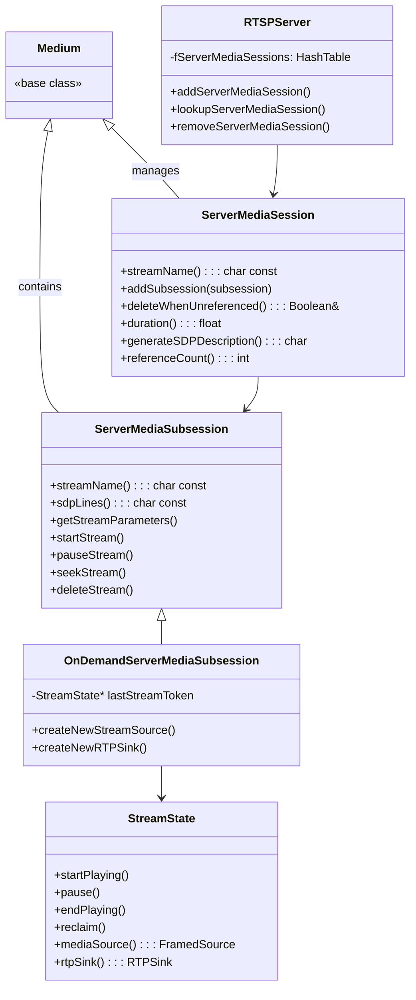
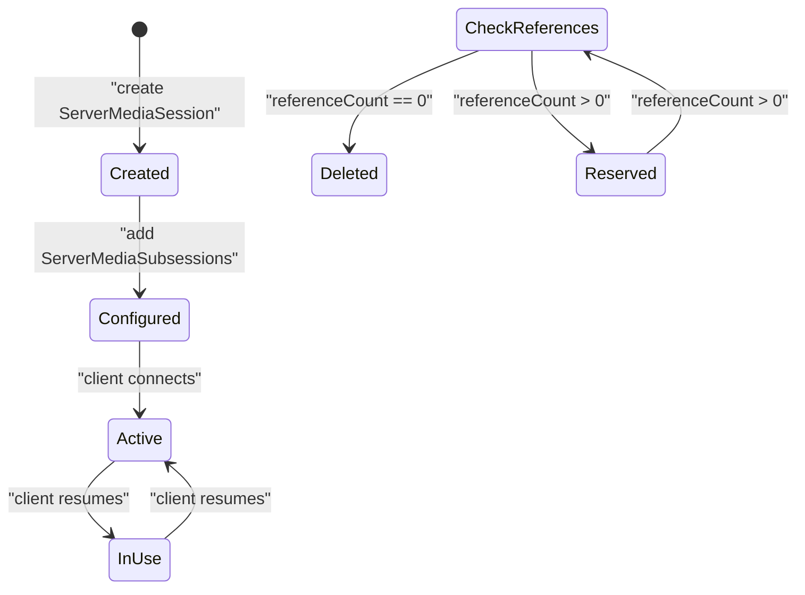
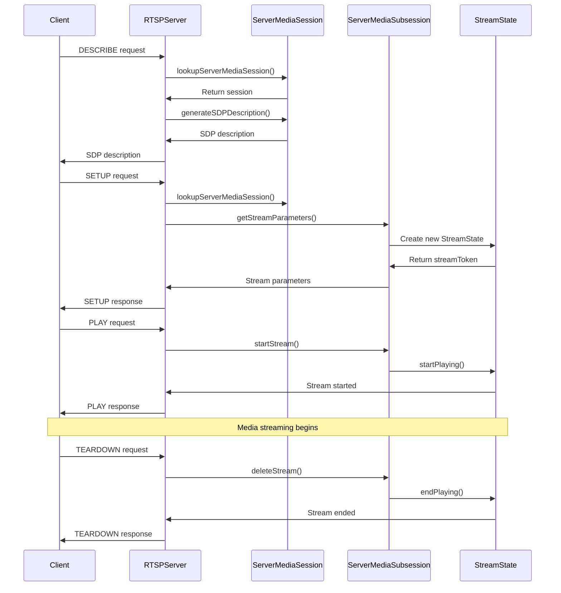

# Media Session Management

> **Relevant source files**
> * [liveMedia/GenericMediaServer.cpp](https://github.com/rgaufman/live555/blob/a0eb8f91/liveMedia/GenericMediaServer.cpp)
> * [liveMedia/Makefile.tail](https://github.com/rgaufman/live555/blob/a0eb8f91/liveMedia/Makefile.tail)
> * [liveMedia/MediaSession.cpp](https://github.com/rgaufman/live555/blob/a0eb8f91/liveMedia/MediaSession.cpp)
> * [liveMedia/OnDemandServerMediaSubsession.cpp](https://github.com/rgaufman/live555/blob/a0eb8f91/liveMedia/OnDemandServerMediaSubsession.cpp)
> * [liveMedia/RTSPServer.cpp](https://github.com/rgaufman/live555/blob/a0eb8f91/liveMedia/RTSPServer.cpp)
> * [liveMedia/include/OnDemandServerMediaSubsession.hh](https://github.com/rgaufman/live555/blob/a0eb8f91/liveMedia/include/OnDemandServerMediaSubsession.hh)
> * [liveMedia/include/RTCP.hh](https://github.com/rgaufman/live555/blob/a0eb8f91/liveMedia/include/RTCP.hh)
> * [liveMedia/include/RTSPServer.hh](https://github.com/rgaufman/live555/blob/a0eb8f91/liveMedia/include/RTSPServer.hh)

## Purpose and Scope

This document describes the media session management system in the live555 streaming media library. Media session management is responsible for creating, managing, and terminating streaming sessions between media sources and clients. It provides the infrastructure for handling various media streams and delivering them to clients through different protocols, primarily RTSP.

This document focuses on the server-side management of media sessions, particularly the `ServerMediaSession` and `ServerMediaSubsession` classes and their interactions. For information about client-side media sessions, see [Media Session](/rgaufman/live555/3-rtsp-media-server). For details about specific media subsession implementations like `OnDemandServerMediaSubsession`, see [OnDemandServerMediaSubsession](/rgaufman/live555/4.1-ondemandservermediasubsession).

Sources: [liveMedia/RTSPServer.cpp L29-L247](https://github.com/rgaufman/live555/blob/a0eb8f91/liveMedia/RTSPServer.cpp#L29-L247)

 [liveMedia/GenericMediaServer.cpp L30-L132](https://github.com/rgaufman/live555/blob/a0eb8f91/liveMedia/GenericMediaServer.cpp#L30-L132)

## Core Components

The media session management system consists of several key components that work together to create and manage streaming sessions.



Sources: [liveMedia/MediaSession.cpp L60-L93](https://github.com/rgaufman/live555/blob/a0eb8f91/liveMedia/MediaSession.cpp#L60-L93)

 [liveMedia/OnDemandServerMediaSubsession.cpp L25-L45](https://github.com/rgaufman/live555/blob/a0eb8f91/liveMedia/OnDemandServerMediaSubsession.cpp#L25-L45)

 [liveMedia/RTSPServer.cpp L183-L194](https://github.com/rgaufman/live555/blob/a0eb8f91/liveMedia/RTSPServer.cpp#L183-L194)

### ServerMediaSession

`ServerMediaSession` is a fundamental class that represents a named media stream that can be requested by clients. Each `ServerMediaSession` has a unique name (stream name) that clients use to identify and access the stream. A `ServerMediaSession` can contain multiple `ServerMediaSubsession` objects, each handling a specific media track (like audio or video).

Key responsibilities:

* Maintain a collection of media subsessions
* Generate SDP (Session Description Protocol) descriptions for client negotiation
* Track reference count to manage session lifecycle
* Provide metadata about the stream (name, information, duration)

Sources: [liveMedia/MediaSession.cpp L60-L93](https://github.com/rgaufman/live555/blob/a0eb8f91/liveMedia/MediaSession.cpp#L60-L93)

 [liveMedia/RTSPServer.cpp L241-L247](https://github.com/rgaufman/live555/blob/a0eb8f91/liveMedia/RTSPServer.cpp#L241-L247)

### ServerMediaSubsession

`ServerMediaSubsession` represents a specific media track within a `ServerMediaSession`. It provides the interface for controlling a single media track, such as audio or video. This is an abstract base class that defines the interface for specific media subsession implementations.

Key responsibilities:

* Generate SDP lines for its specific media track
* Handle stream setup (getting stream parameters)
* Control the stream (start, pause, seek)
* Create and manage the actual media source and sink objects

Sources: [liveMedia/MediaSession.cpp L629-L675](https://github.com/rgaufman/live555/blob/a0eb8f91/liveMedia/MediaSession.cpp#L629-L675)

 [liveMedia/OnDemandServerMediaSubsession.cpp L25-L45](https://github.com/rgaufman/live555/blob/a0eb8f91/liveMedia/OnDemandServerMediaSubsession.cpp#L25-L45)

### StreamState

`StreamState` is a helper class used by `OnDemandServerMediaSubsession` to maintain the state of an active stream. It manages the lifecycle of a stream's resources, including the media source, RTP sink, and RTCP instance.

Key responsibilities:

* Maintain references to media source and sink objects
* Handle playback control (start, pause, end)
* Track the stream's normal play time (NPT)
* Manage the RTP/RTCP resources

Sources: [liveMedia/OnDemandServerMediaSubsession.cpp L508-L668](https://github.com/rgaufman/live555/blob/a0eb8f91/liveMedia/OnDemandServerMediaSubsession.cpp#L508-L668)

## Media Session Lifecycle

Media sessions follow a specific lifecycle from creation to termination, managed by the server.



Sources: [liveMedia/RTSPServer.cpp L241-L247](https://github.com/rgaufman/live555/blob/a0eb8f91/liveMedia/RTSPServer.cpp#L241-L247)

 [liveMedia/GenericMediaServer.cpp L75-L114](https://github.com/rgaufman/live555/blob/a0eb8f91/liveMedia/GenericMediaServer.cpp#L75-L114)

### Session Creation

Sessions are created using `RTSPServer::addServerMediaSession()`, which takes a `ServerMediaSession` object and adds it to the server's hash table of sessions. The `ServerMediaSession` must be created beforehand, typically with a specific stream name.

```
// Example of creating and adding a ServerMediaSession
ServerMediaSession* session = 
    ServerMediaSession::createNew(env, streamName, streamName, description);
rtspServer->addServerMediaSession(session);
```

Once a `ServerMediaSession` is created, specific media subsessions are added to it to represent different media tracks:

```
// Adding a subsession to the ServerMediaSession
ServerMediaSubsession* subsession = createSubsession();
session->addSubsession(subsession);
```

Sources: [liveMedia/RTSPServer.cpp L241-L247](https://github.com/rgaufman/live555/blob/a0eb8f91/liveMedia/RTSPServer.cpp#L241-L247)

 [liveMedia/GenericMediaServer.cpp L30-L39](https://github.com/rgaufman/live555/blob/a0eb8f91/liveMedia/GenericMediaServer.cpp#L30-L39)

### Session Management

Media sessions are managed through reference counting. When a client requests a session, the reference count is incremented. The server can look up sessions by name using `lookupServerMediaSession()`:

```
ServerMediaSession* session = server->lookupServerMediaSession(streamName);
```

The server maintains sessions in a hash table, indexed by stream name. This allows for efficient lookup when clients request a specific stream.

Sources: [liveMedia/GenericMediaServer.cpp L42-L73](https://github.com/rgaufman/live555/blob/a0eb8f91/liveMedia/GenericMediaServer.cpp#L42-L73)

 [liveMedia/RTSPServer.cpp L399-L456](https://github.com/rgaufman/live555/blob/a0eb8f91/liveMedia/RTSPServer.cpp#L399-L456)

### Session Termination

Sessions are terminated in several ways:

* Explicitly through `removeServerMediaSession()`
* Automatically when the reference count reaches zero and `deleteWhenUnreferenced()` is true
* Through `closeAllClientSessionsForServerMediaSession()` followed by removal

When a session is terminated, all associated resources are cleaned up, including media sources, sinks, and network resources.

Sources: [liveMedia/GenericMediaServer.cpp L75-L118](https://github.com/rgaufman/live555/blob/a0eb8f91/liveMedia/GenericMediaServer.cpp#L75-L118)

 [liveMedia/RTSPServer.cpp L452-L457](https://github.com/rgaufman/live555/blob/a0eb8f91/liveMedia/RTSPServer.cpp#L452-L457)

## Media Sources and Sinks

Media sessions manage the connection between media sources and sinks. The source provides the media data, and the sink delivers it to clients.

```

```

Sources: [liveMedia/OnDemandServerMediaSubsession.cpp L138-L216](https://github.com/rgaufman/live555/blob/a0eb8f91/liveMedia/OnDemandServerMediaSubsession.cpp#L138-L216)

 [liveMedia/OnDemandServerMediaSubsession.cpp L508-L668](https://github.com/rgaufman/live555/blob/a0eb8f91/liveMedia/OnDemandServerMediaSubsession.cpp#L508-L668)

### Media Source Creation

Media sources are created by the `OnDemandServerMediaSubsession::createNewStreamSource()` method, which is implemented by specific subclasses for different media types. This method creates the appropriate source object based on the media type and content.

When a client requests a stream, the server creates the necessary media source if it doesn't already exist. If `reuseFirstSource` is true, the same source is used for multiple clients.

Sources: [liveMedia/OnDemandServerMediaSubsession.cpp L77-L103](https://github.com/rgaufman/live555/blob/a0eb8f91/liveMedia/OnDemandServerMediaSubsession.cpp#L77-L103)

 [liveMedia/OnDemandServerMediaSubsession.cpp L138-L142](https://github.com/rgaufman/live555/blob/a0eb8f91/liveMedia/OnDemandServerMediaSubsession.cpp#L138-L142)

### Media Sink Creation

Media sinks are created by the `OnDemandServerMediaSubsession::createNewRTPSink()` method, which is also implemented by specific subclasses. The sink is responsible for packaging media data into RTP packets and sending them to clients.

Sinks are associated with specific network parameters, such as the destination address and port, which are determined during the RTSP setup process.

Sources: [liveMedia/OnDemandServerMediaSubsession.cpp L144-L202](https://github.com/rgaufman/live555/blob/a0eb8f91/liveMedia/OnDemandServerMediaSubsession.cpp#L144-L202)

 [liveMedia/OnDemandServerMediaSubsession.cpp L508-L668](https://github.com/rgaufman/live555/blob/a0eb8f91/liveMedia/OnDemandServerMediaSubsession.cpp#L508-L668)

## Client Connection Flow

When a client connects to a media session, several steps occur to establish and manage the connection.



Sources: [liveMedia/RTSPServer.cpp L384-L456](https://github.com/rgaufman/live555/blob/a0eb8f91/liveMedia/RTSPServer.cpp#L384-L456)

 [liveMedia/OnDemandServerMediaSubsession.cpp L109-L223](https://github.com/rgaufman/live555/blob/a0eb8f91/liveMedia/OnDemandServerMediaSubsession.cpp#L109-L223)

 [liveMedia/OnDemandServerMediaSubsession.cpp L235-L315](https://github.com/rgaufman/live555/blob/a0eb8f91/liveMedia/OnDemandServerMediaSubsession.cpp#L235-L315)

### Session Setup Process

1. Client sends a DESCRIBE request to the server
2. Server looks up the requested ServerMediaSession
3. ServerMediaSession generates an SDP description
4. Server sends the SDP description to the client
5. Client sends a SETUP request for each media track
6. Server creates the necessary resources for each track
7. Server returns transport parameters to the client

Sources: [liveMedia/RTSPServer.cpp L384-L456](https://github.com/rgaufman/live555/blob/a0eb8f91/liveMedia/RTSPServer.cpp#L384-L456)

 [liveMedia/OnDemandServerMediaSubsession.cpp L109-L232](https://github.com/rgaufman/live555/blob/a0eb8f91/liveMedia/OnDemandServerMediaSubsession.cpp#L109-L232)

### Session Play Process

1. Client sends a PLAY request to start the stream
2. Server starts the stream for each media subsession
3. Media data flows from source to sink to client
4. Client can send PAUSE requests to temporarily halt the stream
5. Client can send additional PLAY requests to resume or seek within the stream

Sources: [liveMedia/RTSPServer.cpp L890-L905](https://github.com/rgaufman/live555/blob/a0eb8f91/liveMedia/RTSPServer.cpp#L890-L905)

 [liveMedia/OnDemandServerMediaSubsession.cpp L235-L266](https://github.com/rgaufman/live555/blob/a0eb8f91/liveMedia/OnDemandServerMediaSubsession.cpp#L235-L266)

### Session Termination Process

1. Client sends a TEARDOWN request or disconnects
2. Server stops the stream for each media subsession
3. Server cleans up resources associated with the stream
4. If no more references to the session exist, it may be deleted

Sources: [liveMedia/RTSPServer.cpp L899-L900](https://github.com/rgaufman/live555/blob/a0eb8f91/liveMedia/RTSPServer.cpp#L899-L900)

 [liveMedia/OnDemandServerMediaSubsession.cpp L364-L388](https://github.com/rgaufman/live555/blob/a0eb8f91/liveMedia/OnDemandServerMediaSubsession.cpp#L364-L388)

## Resource Management

Media session management includes careful resource management to ensure efficient use of system resources.

### Reference Counting

Sessions and subsessions use reference counting to manage their lifecycle. When a client uses a session, its reference count is incremented. When the client is done, the reference count is decremented.

A session is deleted when:

* Its reference count reaches zero
* `deleteWhenUnreferenced()` is true

This allows sessions to be shared among multiple clients while ensuring they're cleaned up when no longer needed.

Sources: [liveMedia/GenericMediaServer.cpp L75-L83](https://github.com/rgaufman/live555/blob/a0eb8f91/liveMedia/GenericMediaServer.cpp#L75-L83)

 [liveMedia/OnDemandServerMediaSubsession.cpp L377-L384](https://github.com/rgaufman/live555/blob/a0eb8f91/liveMedia/OnDemandServerMediaSubsession.cpp#L377-L384)

### Stream Reuse

The `OnDemandServerMediaSubsession` class supports stream reuse through the `reuseFirstSource` parameter. When true, the same media source is used for multiple clients, which can be more efficient for certain types of media.

When a client requests a stream:

* If `reuseFirstSource` is true and a source already exists, it's reused
* Otherwise, a new source is created specifically for this client

Sources: [liveMedia/OnDemandServerMediaSubsession.cpp L130-L136](https://github.com/rgaufman/live555/blob/a0eb8f91/liveMedia/OnDemandServerMediaSubsession.cpp#L130-L136)

 [liveMedia/OnDemandServerMediaSubsession.cpp L138-L142](https://github.com/rgaufman/live555/blob/a0eb8f91/liveMedia/OnDemandServerMediaSubsession.cpp#L138-L142)

### Network Resource Management

Media sessions manage network resources such as RTP and RTCP sockets. These are created during session setup and cleaned up during termination.

For each client:

* RTP and RTCP sockets are created with appropriate port numbers
* Destinations are tracked in a hash table, indexed by client session ID
* When a client disconnects, the corresponding destinations are removed

Sources: [liveMedia/OnDemandServerMediaSubsession.cpp L144-L215](https://github.com/rgaufman/live555/blob/a0eb8f91/liveMedia/OnDemandServerMediaSubsession.cpp#L144-L215)

 [liveMedia/OnDemandServerMediaSubsession.cpp L225-L232](https://github.com/rgaufman/live555/blob/a0eb8f91/liveMedia/OnDemandServerMediaSubsession.cpp#L225-L232)

## Customization Points

The media session management system provides several customization points for implementing specific media types or behaviors.

### Custom Media Subsessions

To create a custom media subsession, you need to subclass `OnDemandServerMediaSubsession` and implement at least these two pure virtual methods:

```
virtual FramedSource* createNewStreamSource(unsigned clientSessionId,
                                          unsigned& estBitrate) = 0;

virtual RTPSink* createNewRTPSink(Groupsock* rtpGroupsock,
                                unsigned char rtpPayloadTypeIfDynamic,
                                FramedSource* inputSource) = 0;
```

These methods create the appropriate source and sink objects for your specific media type.

Sources: [liveMedia/include/OnDemandServerMediaSubsession.hh L96-L102](https://github.com/rgaufman/live555/blob/a0eb8f91/liveMedia/include/OnDemandServerMediaSubsession.hh#L96-L102)

### Overridable Methods

Several methods can be overridden to customize behavior:

* `getAuxSDPLine()`: Provide additional SDP attributes
* `seekStreamSource()`: Implement seeking behavior
* `setStreamSourceScale()`: Implement playback rate changes
* `createGroupsock()`: Customize socket creation
* `createRTCP()`: Customize RTCP instance creation

Sources: [liveMedia/include/OnDemandServerMediaSubsession.hh L80-L106](https://github.com/rgaufman/live555/blob/a0eb8f91/liveMedia/include/OnDemandServerMediaSubsession.hh#L80-L106)

## Conclusion

The media session management system provides a flexible and efficient way to manage streaming media sessions. It handles the complex details of session setup, management, and termination, while providing customization points for specific media types and behaviors.

Key takeaways:

* `ServerMediaSession` represents a named media stream that clients can access
* `ServerMediaSubsession` handles individual media tracks within a session
* `OnDemandServerMediaSubsession` creates sources and sinks on demand
* `StreamState` manages the state of an active stream
* Reference counting ensures proper resource management
* The system supports both shared and per-client media sources

With this infrastructure, the live555 library enables sophisticated streaming applications with minimal application code.

Sources: [liveMedia/RTSPServer.cpp L29-L247](https://github.com/rgaufman/live555/blob/a0eb8f91/liveMedia/RTSPServer.cpp#L29-L247)

 [liveMedia/OnDemandServerMediaSubsession.cpp L25-L45](https://github.com/rgaufman/live555/blob/a0eb8f91/liveMedia/OnDemandServerMediaSubsession.cpp#L25-L45)

 [liveMedia/GenericMediaServer.cpp L30-L132](https://github.com/rgaufman/live555/blob/a0eb8f91/liveMedia/GenericMediaServer.cpp#L30-L132)