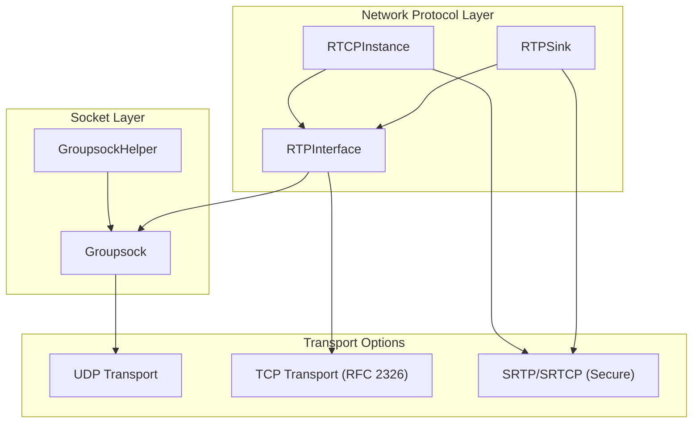
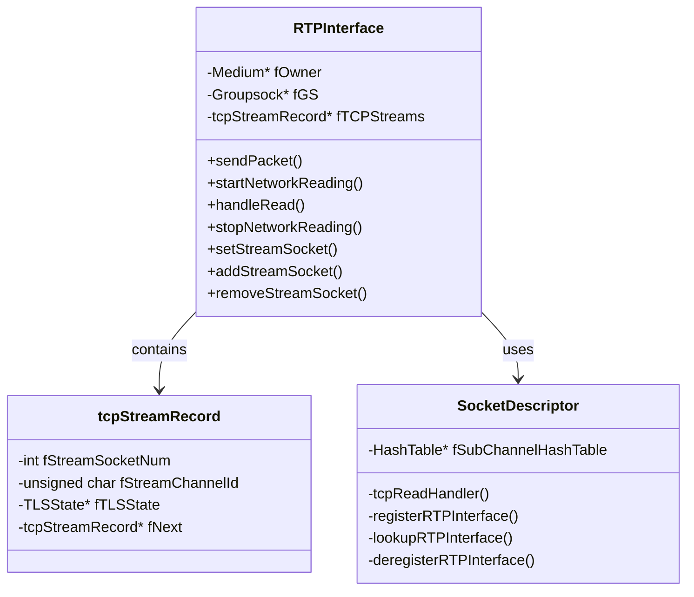
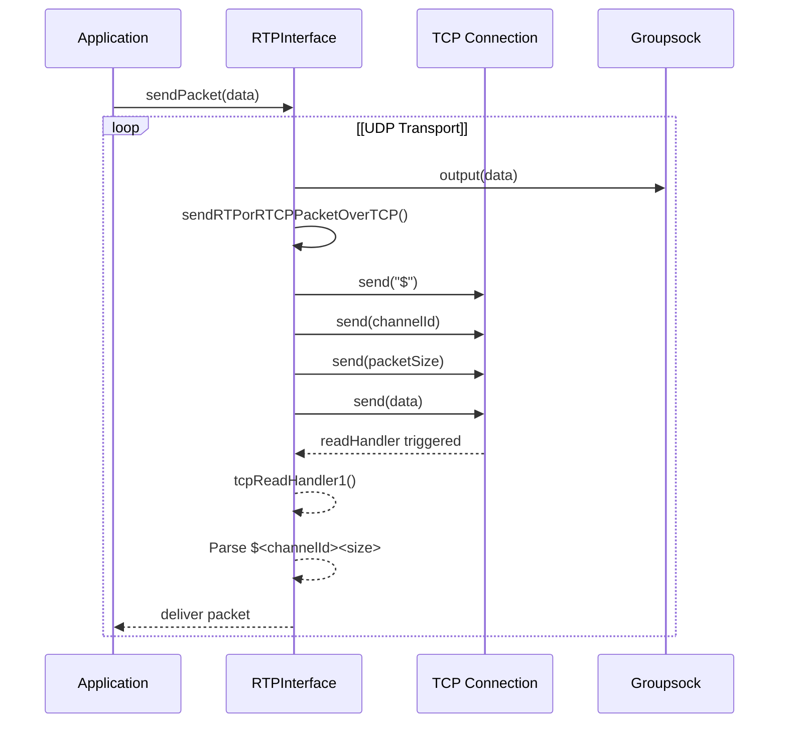
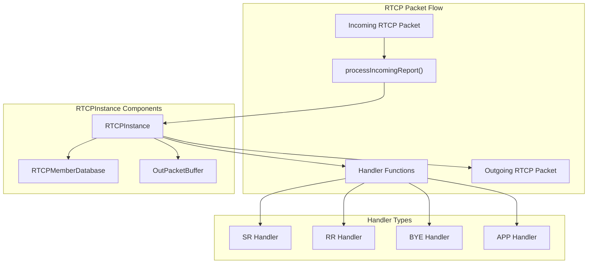
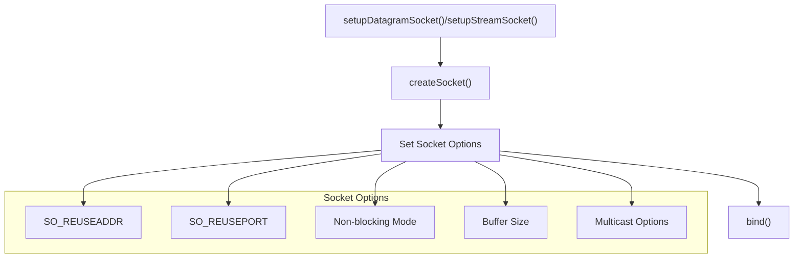
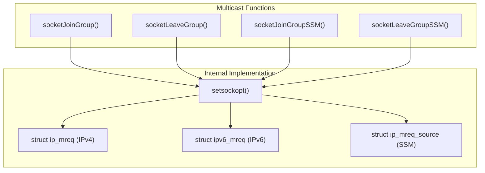
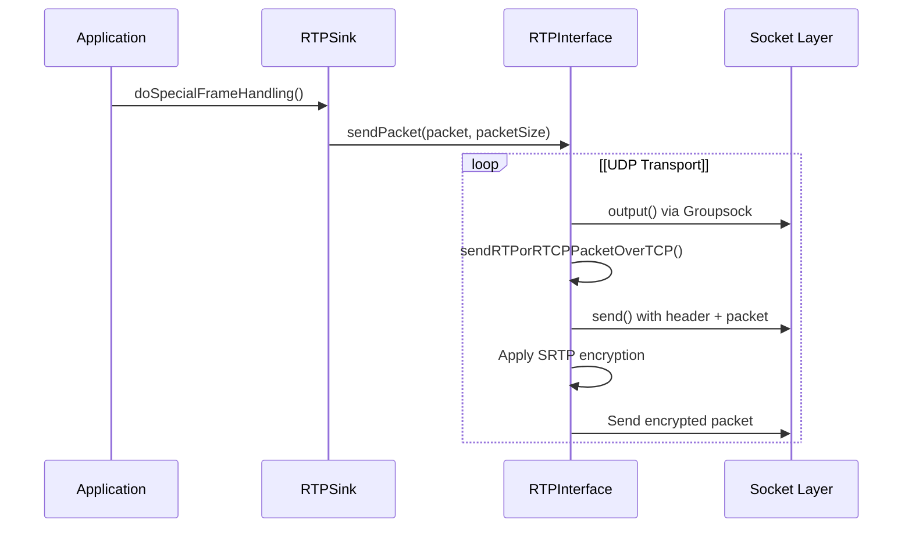
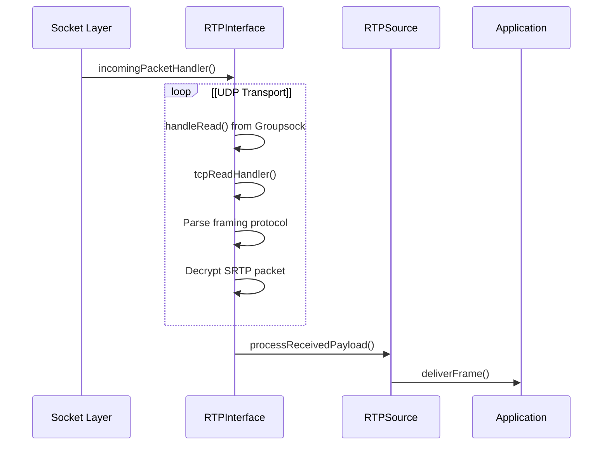
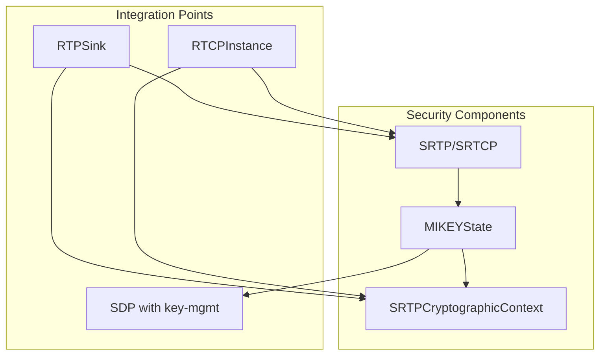
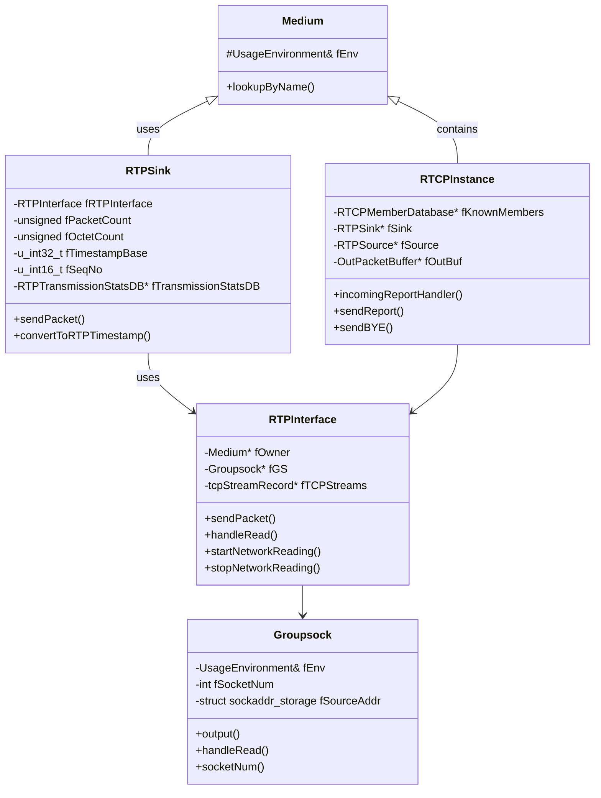

# Network Protocol Implementation

> **Relevant source files**
> * [groupsock/GroupsockHelper.cpp](https://github.com/rgaufman/live555/blob/a0eb8f91/groupsock/GroupsockHelper.cpp)
> * [groupsock/include/GroupsockHelper.hh](https://github.com/rgaufman/live555/blob/a0eb8f91/groupsock/include/GroupsockHelper.hh)
> * [liveMedia/RTCP.cpp](https://github.com/rgaufman/live555/blob/a0eb8f91/liveMedia/RTCP.cpp)
> * [liveMedia/RTPInterface.cpp](https://github.com/rgaufman/live555/blob/a0eb8f91/liveMedia/RTPInterface.cpp)
> * [liveMedia/RTPSink.cpp](https://github.com/rgaufman/live555/blob/a0eb8f91/liveMedia/RTPSink.cpp)
> * [liveMedia/include/RTPInterface.hh](https://github.com/rgaufman/live555/blob/a0eb8f91/liveMedia/include/RTPInterface.hh)

This page documents the network protocol implementation in the live555 streaming media library, focusing on how the system implements and manages RTP (Real-time Transport Protocol) and RTCP (RTP Control Protocol) networking. This covers the transport layer of the library, which is responsible for sending and receiving media packets over networks. For information about higher-level media session management, see [Media Session Management](/rgaufman/live555/4-media-session-management).

## Network Protocol Architecture Overview

The live555 library implements the RTP/RTCP protocols as defined in RFC 3550, with several extensions for flexibility and robustness. The implementation is centered around a few key classes that manage the network transport:



Sources:

* [liveMedia/include/RTPInterface.hh L45-L85](https://github.com/rgaufman/live555/blob/a0eb8f91/liveMedia/include/RTPInterface.hh#L45-L85)
* [liveMedia/RTPInterface.cpp L132-L193](https://github.com/rgaufman/live555/blob/a0eb8f91/liveMedia/RTPInterface.cpp#L132-L193)
* [liveMedia/RTCP.cpp L112-L178](https://github.com/rgaufman/live555/blob/a0eb8f91/liveMedia/RTCP.cpp#L112-L178)
* [liveMedia/RTPSink.cpp L25-L71](https://github.com/rgaufman/live555/blob/a0eb8f91/liveMedia/RTPSink.cpp#L25-L71)

## RTP Interface

The `RTPInterface` class provides an abstraction layer for sending and receiving RTP/RTCP packets over network connections. It's designed to hide the complexity of supporting both UDP and TCP transports.

### Key Capabilities

* Sending RTP/RTCP packets over UDP (via `Groupsock`)
* Supporting RTP-over-TCP (interleaved mode as defined in RFC 2326, section 10.12)
* Handling multiple concurrent TCP connections
* Supporting IPv4 and IPv6 networking
* Providing auxiliary handlers for custom packet processing



Sources:

* [liveMedia/include/RTPInterface.hh L45-L113](https://github.com/rgaufman/live555/blob/a0eb8f91/liveMedia/include/RTPInterface.hh#L45-L113)
* [liveMedia/RTPInterface.cpp L133-L193](https://github.com/rgaufman/live555/blob/a0eb8f91/liveMedia/RTPInterface.cpp#L133-L193)
* [liveMedia/RTPInterface.cpp L342-L375](https://github.com/rgaufman/live555/blob/a0eb8f91/liveMedia/RTPInterface.cpp#L342-L375)

### RTP-over-TCP Implementation

The library provides a specialized implementation of RTP-over-TCP following the encoding defined in RFC 2326 (section 10.12), which uses the format:

```html
$<streamChannelId><packetSize><packet>
```

This allows RTP/RTCP packets to be interleaved with RTSP control messages on the same TCP connection. The implementation uses a two-level hash table system:

1. A top-level hash table that maps TCP socket numbers to `SocketDescriptor` objects
2. Each `SocketDescriptor` contains a sub-channel hash table mapping channel IDs to `RTPInterface` instances



Sources:

* [liveMedia/RTPInterface.cpp L342-L375](https://github.com/rgaufman/live555/blob/a0eb8f91/liveMedia/RTPInterface.cpp#L342-L375)
* [liveMedia/RTPInterface.cpp L429-L648](https://github.com/rgaufman/live555/blob/a0eb8f91/liveMedia/RTPInterface.cpp#L429-L648)

## RTCP Implementation

RTCP (RTP Control Protocol) is implemented in the `RTCPInstance` class, which handles the creation, sending, and receiving of RTCP packets. It supports all standard RTCP packet types including Sender Reports (SR), Receiver Reports (RR), Source Description (SDES), and BYE packets.

### RTCP Packet Types and Processing

The implementation supports the following RTCP packet types:

| Packet Type | Purpose | Implementation |
| --- | --- | --- |
| SR (200) | Sender Report | Provides sending and receiving statistics for participants that are active senders |
| RR (201) | Receiver Report | Provides reception statistics from participants that are not active senders |
| SDES (202) | Source Description | Contains items describing the source, including CNAME, NAME, EMAIL, etc. |
| BYE (203) | Goodbye | Indicates end of participation |
| APP (204) | Application-specific | For application-specific functions |
| RTPFB (205) | RTP Feedback | Generic RTP-level feedback |
| PSFB (206) | Payload-specific Feedback | Feedback messages related to the payload |



Sources:

* [liveMedia/RTCP.cpp L112-L178](https://github.com/rgaufman/live555/blob/a0eb8f91/liveMedia/RTCP.cpp#L112-L178)
* [liveMedia/RTCP.cpp L544-L867](https://github.com/rgaufman/live555/blob/a0eb8f91/liveMedia/RTCP.cpp#L544-L867)
* [liveMedia/RTCP.cpp L916-L951](https://github.com/rgaufman/live555/blob/a0eb8f91/liveMedia/RTCP.cpp#L916-L951)

### RTCP Statistics Tracking

The RTCP implementation includes comprehensive statistics tracking for both sent and received packets:

1. `RTPTransmissionStatsDB` - Maintains statistics for transmitted packets
2. `RTCPMemberDatabase` - Tracks active RTCP members in the session

These components enable:

* Round-trip time estimation
* Packet loss detection
* Jitter calculation
* Participant timeout detection

Sources:

* [liveMedia/RTCP.cpp L28-L108](https://github.com/rgaufman/live555/blob/a0eb8f91/liveMedia/RTCP.cpp#L28-L108)
* [liveMedia/RTPSink.cpp L219-L410](https://github.com/rgaufman/live555/blob/a0eb8f91/liveMedia/RTPSink.cpp#L219-L410)

## Socket Management

The library provides a comprehensive set of utilities for socket management through the `GroupsockHelper` functions. These functions abstract the platform-specific details of socket operations.

### Socket Creation and Configuration

Socket creation is handled by specialized functions for both UDP (datagram) and TCP (stream) sockets:



Sources:

* [groupsock/GroupsockHelper.cpp L90-L214](https://github.com/rgaufman/live555/blob/a0eb8f91/groupsock/GroupsockHelper.cpp#L90-L214)
* [groupsock/GroupsockHelper.cpp L293-L388](https://github.com/rgaufman/live555/blob/a0eb8f91/groupsock/GroupsockHelper.cpp#L293-L388)

### Multicast Support

The library provides robust support for IP multicast, including:

* Joining and leaving multicast groups
* Source-specific multicast (SSM)
* TTL (Time-To-Live) configuration
* Multicast loop control
* Support for both IPv4 and IPv6 multicast



Sources:

* [groupsock/GroupsockHelper.cpp L557-L724](https://github.com/rgaufman/live555/blob/a0eb8f91/groupsock/GroupsockHelper.cpp#L557-L724)

## Network Data Flow

The network data flow in live555 involves several layers of abstractions from the application level down to the socket level.

### Sending Flow



Sources:

* [liveMedia/RTPInterface.cpp L233-L251](https://github.com/rgaufman/live555/blob/a0eb8f91/liveMedia/RTPInterface.cpp#L233-L251)
* [liveMedia/RTPSink.cpp L43-L66](https://github.com/rgaufman/live555/blob/a0eb8f91/liveMedia/RTPSink.cpp#L43-L66)

### Receiving Flow



Sources:

* [liveMedia/RTPInterface.cpp L271-L327](https://github.com/rgaufman/live555/blob/a0eb8f91/liveMedia/RTPInterface.cpp#L271-L327)
* [liveMedia/RTPInterface.cpp L431-L466](https://github.com/rgaufman/live555/blob/a0eb8f91/liveMedia/RTPInterface.cpp#L431-L466)

## Security in Network Transport

The library supports secure RTP (SRTP) and SRTCP through the `SRTPCryptographicContext` class and related components. This implementation provides:

* Packet encryption and authentication
* Support for MIKEY (Multimedia Internet KEYing) for key management
* Integration with standard RTP/RTCP implementation



Sources:

* [liveMedia/RTPSink.cpp L43-L66](https://github.com/rgaufman/live555/blob/a0eb8f91/liveMedia/RTPSink.cpp#L43-L66)
* [liveMedia/RTPSink.cpp L98-L117](https://github.com/rgaufman/live555/blob/a0eb8f91/liveMedia/RTPSink.cpp#L98-L117)
* [liveMedia/RTCP.cpp L286-L290](https://github.com/rgaufman/live555/blob/a0eb8f91/liveMedia/RTCP.cpp#L286-L290)

## Cross-Platform Considerations

The library implements several abstractions and helper functions to ensure cross-platform compatibility:

* Socket functions that abstract platform-specific details
* Portable time functions (e.g., custom implementation of `gettimeofday()` for Windows)
* Platform-specific handling of non-blocking I/O
* Support for both IPv4 and IPv6 on all platforms

These abstractions are primarily implemented in the `GroupsockHelper` module.

Sources:

* [groupsock/GroupsockHelper.cpp L216-L257](https://github.com/rgaufman/live555/blob/a0eb8f91/groupsock/GroupsockHelper.cpp#L216-L257)
* [groupsock/GroupsockHelper.cpp L1013-L1096](https://github.com/rgaufman/live555/blob/a0eb8f91/groupsock/GroupsockHelper.cpp#L1013-L1096)

## Network Protocol Implementation Class Hierarchy

The following diagram shows the class hierarchy and relationships among the key network protocol implementation components:



Sources:

* [liveMedia/include/RTPInterface.hh L46-L113](https://github.com/rgaufman/live555/blob/a0eb8f91/liveMedia/include/RTPInterface.hh#L46-L113)
* [liveMedia/RTCP.cpp L112-L178](https://github.com/rgaufman/live555/blob/a0eb8f91/liveMedia/RTCP.cpp#L112-L178)
* [liveMedia/RTPSink.cpp L162-L193](https://github.com/rgaufman/live555/blob/a0eb8f91/liveMedia/RTPSink.cpp#L162-L193)