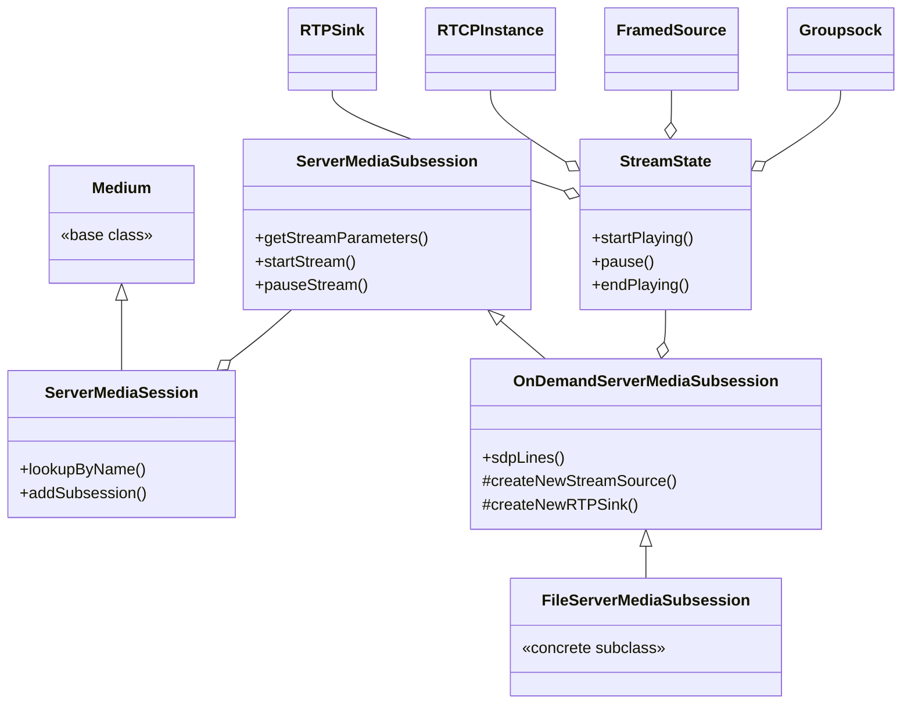
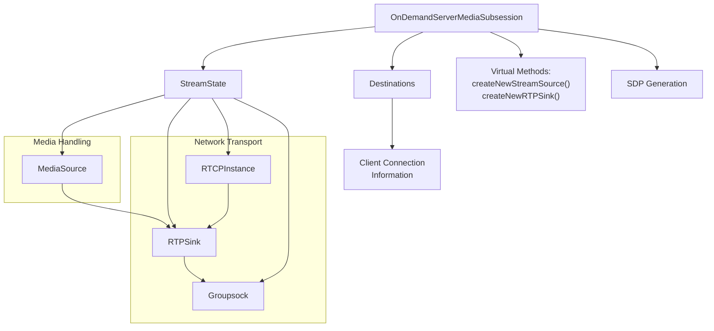
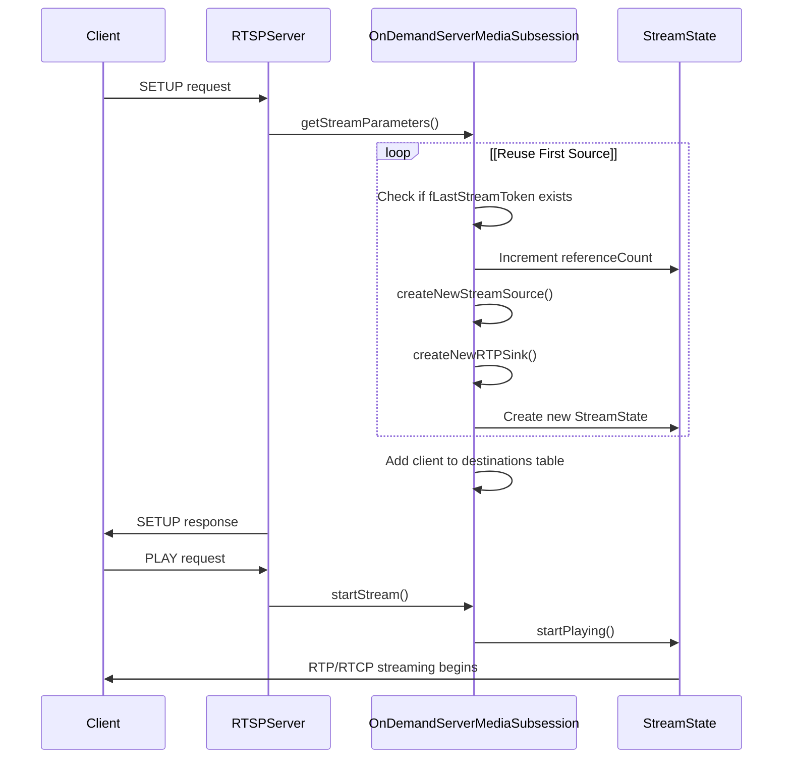

# OnDemandServerMediaSubsession

> **Relevant source files**
> * [liveMedia/Makefile.tail](https://github.com/rgaufman/live555/blob/a0eb8f91/liveMedia/Makefile.tail)
> * [liveMedia/MediaSession.cpp](https://github.com/rgaufman/live555/blob/a0eb8f91/liveMedia/MediaSession.cpp)
> * [liveMedia/OnDemandServerMediaSubsession.cpp](https://github.com/rgaufman/live555/blob/a0eb8f91/liveMedia/OnDemandServerMediaSubsession.cpp)
> * [liveMedia/include/OnDemandServerMediaSubsession.hh](https://github.com/rgaufman/live555/blob/a0eb8f91/liveMedia/include/OnDemandServerMediaSubsession.hh)
> * [liveMedia/include/RTCP.hh](https://github.com/rgaufman/live555/blob/a0eb8f91/liveMedia/include/RTCP.hh)

## Overview

`OnDemandServerMediaSubsession` is a core component of the LIVE555 Media Server architecture that handles on-demand media streaming. It serves as an abstract base class that creates unicast RTP (Real-time Transport Protocol) sinks on demand for client connections. This class implements the core mechanics for media streaming while allowing subclasses to specialize for specific media types.

Unlike `PassiveServerMediaSubsession` (which uses a single stream for all clients), the `OnDemandServerMediaSubsession` creates separate streams for each client unless configured to reuse sources.

Sources: [liveMedia/include/OnDemandServerMediaSubsession.hh](https://github.com/rgaufman/live555/blob/a0eb8f91/liveMedia/include/OnDemandServerMediaSubsession.hh)

## Class Hierarchy



Sources: [liveMedia/include/OnDemandServerMediaSubsession.hh L38-L149](https://github.com/rgaufman/live555/blob/a0eb8f91/liveMedia/include/OnDemandServerMediaSubsession.hh#L38-L149)

 [liveMedia/OnDemandServerMediaSubsession.cpp L25-L44](https://github.com/rgaufman/live555/blob/a0eb8f91/liveMedia/OnDemandServerMediaSubsession.cpp#L25-L44)

 [liveMedia/include/ServerMediaSession.hh](https://github.com/rgaufman/live555/blob/a0eb8f91/liveMedia/include/ServerMediaSession.hh)

## Core Components and Structure



Sources: [liveMedia/include/OnDemandServerMediaSubsession.hh L156-L231](https://github.com/rgaufman/live555/blob/a0eb8f91/liveMedia/include/OnDemandServerMediaSubsession.hh#L156-L231)

 [liveMedia/OnDemandServerMediaSubsession.cpp L508-L668](https://github.com/rgaufman/live555/blob/a0eb8f91/liveMedia/OnDemandServerMediaSubsession.cpp#L508-L668)

## Initialization and Configuration

`OnDemandServerMediaSubsession` is initialized with several important parameters:

* `reuseFirstSource`: If true, the same source is used for all clients
* `initialPortNum`: Starting port number for RTP sockets
* `multiplexRTCPWithRTP`: If true, RTP and RTCP share the same socket

```
OnDemandServerMediaSubsession(UsageEnvironment& env, Boolean reuseFirstSource,
                              portNumBits initialPortNum = 6970,
                              Boolean multiplexRTCPWithRTP = False);
```

The constructor initializes socket management, sets up CNAME (canonical name) for RTCP, and prepares the destinations hash table to track client connections.

Sources: [liveMedia/include/OnDemandServerMediaSubsession.hh L40-L42](https://github.com/rgaufman/live555/blob/a0eb8f91/liveMedia/include/OnDemandServerMediaSubsession.hh#L40-L42)

 [liveMedia/OnDemandServerMediaSubsession.cpp L25-L44](https://github.com/rgaufman/live555/blob/a0eb8f91/liveMedia/OnDemandServerMediaSubsession.cpp#L25-L44)

## Stream Creation Process

When a client requests a stream, the following flow is executed:



Sources: [liveMedia/OnDemandServerMediaSubsession.cpp L109-L232](https://github.com/rgaufman/live555/blob/a0eb8f91/liveMedia/OnDemandServerMediaSubsession.cpp#L109-L232)

 [liveMedia/OnDemandServerMediaSubsession.cpp L235-L255](https://github.com/rgaufman/live555/blob/a0eb8f91/liveMedia/OnDemandServerMediaSubsession.cpp#L235-L255)

## Media Stream Management

### Stream State Object

The `StreamState` class is a crucial internal component that manages an active stream. Each `StreamState` object encapsulates:

* Media source (a `FramedSource` descendant)
* Transport sockets (`Groupsock` objects for RTP and RTCP)
* Media sink (`RTPSink` for sending RTP packets)
* RTCP instance (for control protocol handling)
* Stream statistics and timing information

Sources: [liveMedia/include/OnDemandServerMediaSubsession.hh L180-L231](https://github.com/rgaufman/live555/blob/a0eb8f91/liveMedia/include/OnDemandServerMediaSubsession.hh#L180-L231)

 [liveMedia/OnDemandServerMediaSubsession.cpp L524-L668](https://github.com/rgaufman/live555/blob/a0eb8f91/liveMedia/OnDemandServerMediaSubsession.cpp#L524-L668)

### Client Destinations

The `Destinations` class tracks client connection information:

* For UDP streaming: destination address and ports
* For TCP streaming: TCP socket number and channel IDs
* TLS state for secure connections

Sources: [liveMedia/include/OnDemandServerMediaSubsession.hh L156-L178](https://github.com/rgaufman/live555/blob/a0eb8f91/liveMedia/include/OnDemandServerMediaSubsession.hh#L156-L178)

## Stream Control Operations

`OnDemandServerMediaSubsession` implements several methods for stream control:

| Method | Purpose | Implementation Notes |
| --- | --- | --- |
| `startStream()` | Begins streaming to a client | Creates mappings, initializes sequence numbers |
| `pauseStream()` | Pauses media delivery | Only if not sharing sources among clients |
| `seekStream()` | Repositions within media | Only if not sharing sources among clients |
| `setStreamScale()` | Changes playback speed | Only if not sharing sources among clients |
| `getCurrentNPT()` | Gets current play position | Based on RTP timestamps |
| `deleteStream()` | Stops streaming and cleans up | Removes client from destinations table |

Sources: [liveMedia/OnDemandServerMediaSubsession.cpp L235-L388](https://github.com/rgaufman/live555/blob/a0eb8f91/liveMedia/OnDemandServerMediaSubsession.cpp#L235-L388)

## Virtual Methods for Subclasses

Subclasses must implement these pure virtual methods:

```sql
// Create a source for the media data
virtual FramedSource* createNewStreamSource(unsigned clientSessionId,
                                          unsigned& estBitrate) = 0;

// Create an appropriate RTP sink for this media type
virtual RTPSink* createNewRTPSink(Groupsock* rtpGroupsock,
                                unsigned char rtpPayloadTypeIfDynamic,
                                FramedSource* inputSource) = 0;
```

Other virtual methods that may be overridden:

* `getAuxSDPLine()`: Provides additional SDP information
* `seekStreamSource()`: Handles seek operations in the source
* `setStreamSourceScale()`: Adjusts playback speed
* `closeStreamSource()`: Manages proper source cleanup

Sources: [liveMedia/include/OnDemandServerMediaSubsession.hh L80-L102](https://github.com/rgaufman/live555/blob/a0eb8f91/liveMedia/include/OnDemandServerMediaSubsession.hh#L80-L102)

 [liveMedia/OnDemandServerMediaSubsession.cpp L390-L422](https://github.com/rgaufman/live555/blob/a0eb8f91/liveMedia/OnDemandServerMediaSubsession.cpp#L390-L422)

## SDP Generation

The `sdpLines()` method generates Session Description Protocol (SDP) content that describes the stream:

1. Creates a temporary stream source and RTP sink
2. Uses these objects to gather media and encoding information
3. Formats this information as SDP lines
4. Handles special cases like SRTP encryption

The SDP information includes:

* Media type (audio/video/etc.)
* Port information
* Encoding parameters
* Bandwidth requirements
* Format-specific parameters

Sources: [liveMedia/OnDemandServerMediaSubsession.cpp L60-L107](https://github.com/rgaufman/live555/blob/a0eb8f91/liveMedia/OnDemandServerMediaSubsession.cpp#L60-L107)

 [liveMedia/OnDemandServerMediaSubsession.cpp L452-L505](https://github.com/rgaufman/live555/blob/a0eb8f91/liveMedia/OnDemandServerMediaSubsession.cpp#L452-L505)

## RTCP Support

The class provides support for RTCP (RTP Control Protocol):

* Creates `RTCPInstance` objects for stream monitoring
* Supports RTCP multiplexing with RTP (on the same port)
* Handles RTCP APP packets for application-specific functions
* Passes RTCP Receiver Reports to handlers for statistics

Sources: [liveMedia/OnDemandServerMediaSubsession.cpp L113-L119](https://github.com/rgaufman/live555/blob/a0eb8f91/liveMedia/OnDemandServerMediaSubsession.cpp#L113-L119)

 [liveMedia/OnDemandServerMediaSubsession.cpp L549-L554](https://github.com/rgaufman/live555/blob/a0eb8f91/liveMedia/OnDemandServerMediaSubsession.cpp#L549-L554)

## TCP and UDP Streaming Support

The class supports both transport modes:

* UDP: Creates separate sockets for RTP and RTCP (by default)
* TCP: Encapsulates RTP/RTCP over the RTSP connection using channel IDs

For UDP, it manages port selection ensuring:

* RTP uses even-numbered ports
* RTCP uses odd-numbered ports (the next port after RTP)
* Port conflicts are avoided through testing

Sources: [liveMedia/OnDemandServerMediaSubsession.cpp L150-L191](https://github.com/rgaufman/live555/blob/a0eb8f91/liveMedia/OnDemandServerMediaSubsession.cpp#L150-L191)

 [liveMedia/OnDemandServerMediaSubsession.cpp L554-L582](https://github.com/rgaufman/live555/blob/a0eb8f91/liveMedia/OnDemandServerMediaSubsession.cpp#L554-L582)

## Conclusion

`OnDemandServerMediaSubsession` provides the core functionality needed for on-demand streaming in the LIVE555 Media Server. By implementing the abstract methods `createNewStreamSource()` and `createNewRTPSink()`, concrete subclasses can support various media types while leveraging the robust streaming infrastructure provided by this class.

The class's sophisticated design handles the complexities of RTP/RTCP protocols, network transport, client tracking, and stream lifecycle management, making it a central component in LIVE555's media delivery architecture.