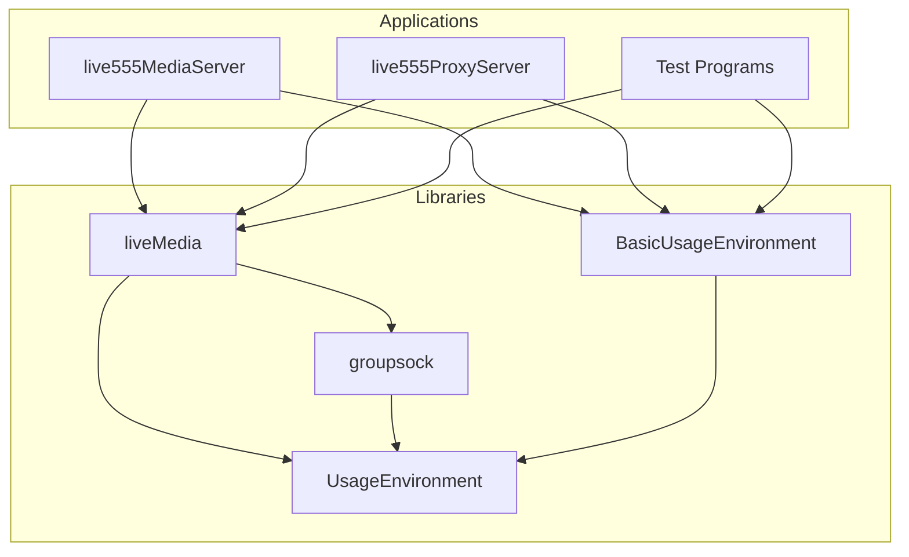
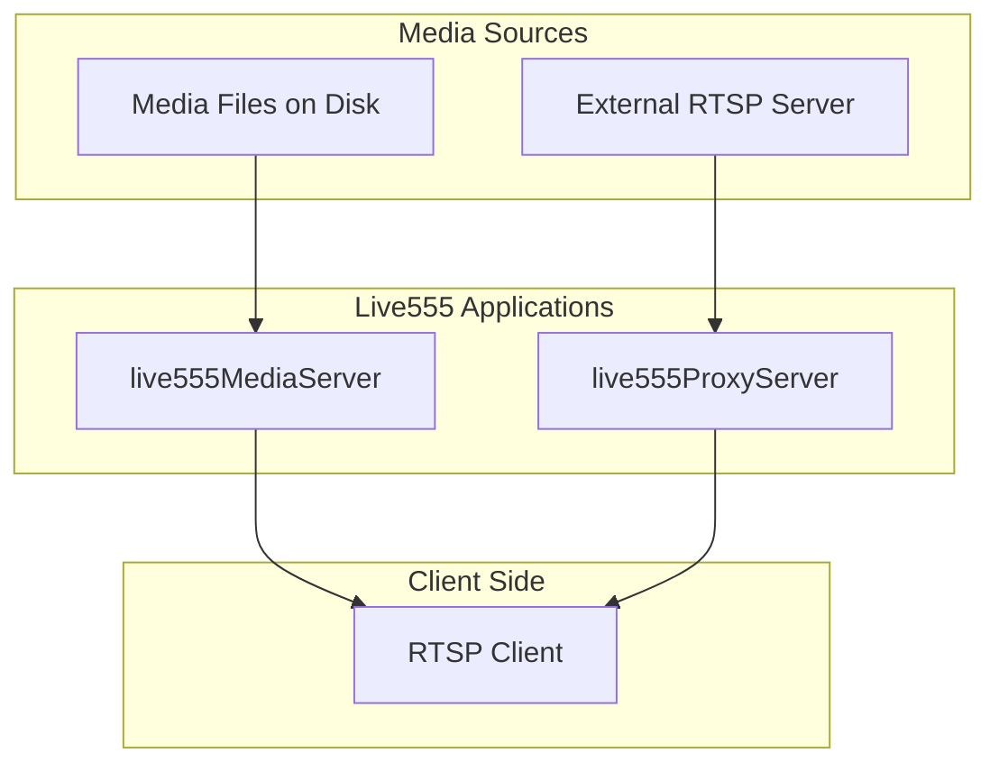
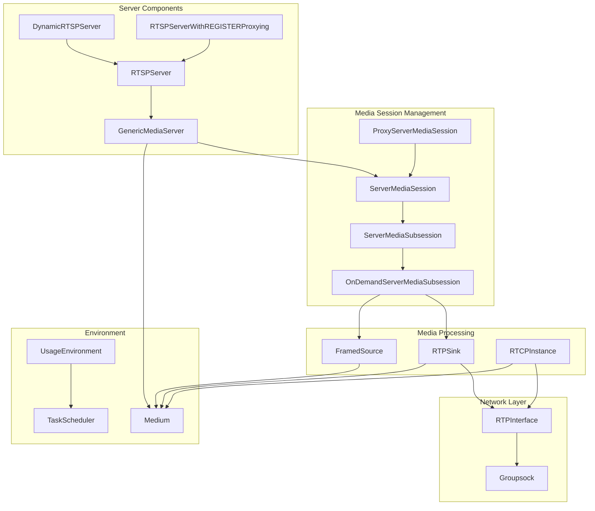
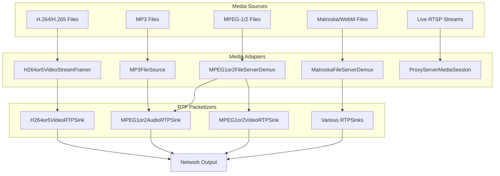
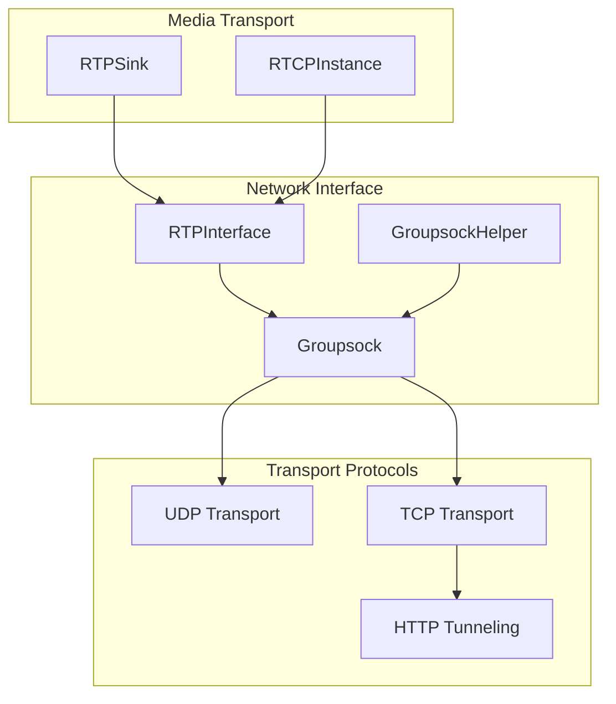

# Overview

> **Relevant source files**
> * [BasicUsageEnvironment/include/BasicUsageEnvironment_version.hh](https://github.com/rgaufman/live555/blob/a0eb8f91/BasicUsageEnvironment/include/BasicUsageEnvironment_version.hh)
> * [README.md](https://github.com/rgaufman/live555/blob/a0eb8f91/README.md)
> * [UsageEnvironment/include/UsageEnvironment_version.hh](https://github.com/rgaufman/live555/blob/a0eb8f91/UsageEnvironment/include/UsageEnvironment_version.hh)
> * [groupsock/include/groupsock_version.hh](https://github.com/rgaufman/live555/blob/a0eb8f91/groupsock/include/groupsock_version.hh)
> * [liveMedia/include/liveMedia_version.hh](https://github.com/rgaufman/live555/blob/a0eb8f91/liveMedia/include/liveMedia_version.hh)

This page provides an introduction to the Live555 streaming media library, which is a set of C++ libraries for implementing multimedia streaming solutions using open standard protocols. The library specializes in RTSP (Real-Time Streaming Protocol), RTP (Real-time Transport Protocol), and RTCP (Real-time Transport Control Protocol) implementations.

## Purpose and Scope

Live555 enables developers to create applications that function as RTSP servers, RTSP clients, and RTSP proxies. The library supports various media formats including H.264/H.265 video, MPEG video, MP3 audio, and Matroska/WebM containers. This overview provides a high-level understanding of the system architecture and components.

For detailed information about specific components:

* For RTSP Proxy Server functionality, see [RTSP Proxy Server](/rgaufman/live555/2-rtsp-proxy-server)
* For RTSP Media Server implementation, see [RTSP Media Server](/rgaufman/live555/3-rtsp-media-server)
* For more on the library structure, see [Library Structure](/rgaufman/live555/1.1-library-structure)

## Library Components

Live555 consists of four main libraries that work together to provide streaming functionality:

| Library | Purpose |
| --- | --- |
| liveMedia | Core media processing, RTSP/RTP/RTCP protocol implementation |
| groupsock | Socket and networking utilities |
| UsageEnvironment | Abstract interface for platform-dependent functions |
| BasicUsageEnvironment | Concrete implementation of UsageEnvironment |

### Library Structure Diagram



Sources: BasicUsageEnvironment/include/BasicUsageEnvironment_version.hh, UsageEnvironment/include/UsageEnvironment_version.hh, groupsock/include/groupsock_version.hh, liveMedia/include/liveMedia_version.hh

## Key Applications

Live555 includes the following ready-to-use applications:

1. **live555MediaServer** - An RTSP server for streaming media files over IP networks
2. **live555ProxyServer** - An RTSP proxy server that can relay media streams from other RTSP servers
3. **Test Programs** - Various utilities including `testRTSPClient` for receiving RTSP streams

### Application Data Flow



Sources: README.md

## Core Component Architecture

The system is built around several key component classes that work together to implement streaming functionality:



Sources: All provided diagrams

## Media Processing Pipeline

Live555 supports various media formats with different processing pipelines:



Sources: All provided diagrams

## Network Architecture

The network layer in Live555 handles the low-level details of packet transmission:



Sources: All provided diagrams

## Custom Modifications

The following modifications have been made to the original Live555 library:

1. **Increased Buffer Size**: `OutPacketBuffer::maxSize` has been increased to 2,000,000 bytes to better handle buggy IP cameras.
2. **Force Port Reuse**: Added `-DALLOW_RTSP_SERVER_PORT_REUSE=1` to force reusing existing ports when restarting the proxy server.
3. **Error Handling**: Optional modification to quit on TCP errors instead of continuing with warnings.

Sources: README.md

## Version and License

Current library version: 2024.10.24

Live555 is released under the GNU Lesser General Public License (LGPL) version 3 or later, which allows for free redistribution and modification under certain conditions.

Sources: BasicUsageEnvironment/include/BasicUsageEnvironment_version.hh, UsageEnvironment/include/UsageEnvironment_version.hh, groupsock/include/groupsock_version.hh, liveMedia/include/liveMedia_version.hh

## Build Instructions

The library can be built on multiple platforms using the provided build system:

```
./genMakefiles [platform]
make -j4
```

Where `[platform]` is the target platform (e.g., linux, macosx, cygwin, freebsd).

After building, the executables can be found in:

* `./testProgs/` - Various test programs
* `./proxyServer/live555ProxyServer` - RTSP proxy server
* `./mediaServer/live555MediaServer` - RTSP media server

Sources: README.md