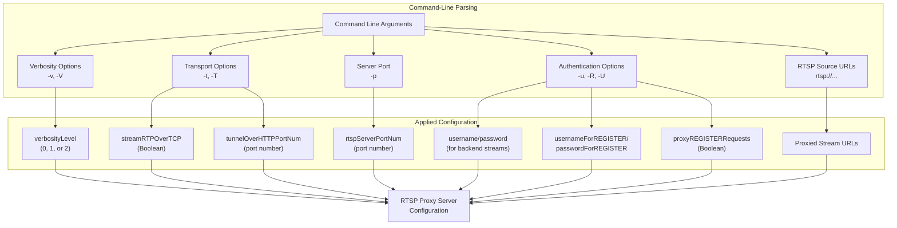
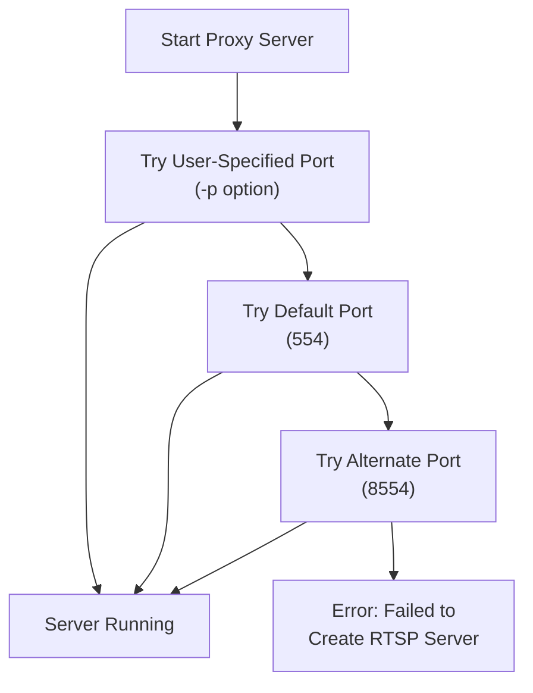
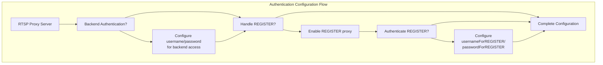

# Proxy Server Configuration

> **Relevant source files**
> * [README.md](https://github.com/rgaufman/live555/blob/a0eb8f91/README.md)
> * [modifications.patch](https://github.com/rgaufman/live555/blob/a0eb8f91/modifications.patch)
> * [proxyServer/live555ProxyServer.cpp](https://github.com/rgaufman/live555/blob/a0eb8f91/proxyServer/live555ProxyServer.cpp)

This document details the configuration options and parameters for the LIVE555 RTSP Proxy Server. The proxy server enables relaying RTSP streams from backend servers to clients, with various options to control transport protocols, authentication, and performance tuning. For details about the proxy server's internal structure, see [ProxyServerMediaSession](/rgaufman/live555/2.1-proxyservermediasession).

## Command-Line Options

The RTSP Proxy Server accepts various command-line options to customize its behavior. Below is a comprehensive list of available options:

| Option | Description | Default |
| --- | --- | --- |
| `-v` | Enable verbose output | Disabled |
| `-V` | Enable more verbose output | Disabled |
| `-t` | Stream RTP/RTCP over TCP connection | Disabled |
| `-T <http-port>` | Stream RTP/RTCP over HTTP (specify port) | Disabled |
| `-p <port>` | Specify RTSP server port | 554 |
| `-u <username> <password>` | Credentials for backend stream access | None |
| `-R` | Handle incoming "REGISTER" requests | Disabled |
| `-U <username> <password>` | Credentials for authenticating REGISTER requests | None |

After options, one or more RTSP URLs must be specified (e.g., `rtsp://server.example.com/stream1`), which are the streams to be proxied.



**Command-Line Options to Configuration Flow**

Sources: [proxyServer/live555ProxyServer.cpp L47-L56](https://github.com/rgaufman/live555/blob/a0eb8f91/proxyServer/live555ProxyServer.cpp#L47-L56)

 [proxyServer/live555ProxyServer.cpp L73-L162](https://github.com/rgaufman/live555/blob/a0eb8f91/proxyServer/live555ProxyServer.cpp#L73-L162)

## Basic Server Configuration

### Port Configuration

The proxy server uses port 554 (standard RTSP port) by default. You can specify an alternative port using the `-p` option. If the specified port is unavailable, the server tries port 554 and then port 8554:



**RTSP Server Port Selection Process**

Sources: [proxyServer/live555ProxyServer.cpp L189-L210](https://github.com/rgaufman/live555/blob/a0eb8f91/proxyServer/live555ProxyServer.cpp#L189-L210)

### HTTP Tunneling

The proxy server automatically attempts to set up RTSP-over-HTTP tunneling on ports 80, 8000, and 8080 (in that order). This allows RTSP streams to traverse firewalls that only permit HTTP traffic.

Sources: [proxyServer/live555ProxyServer.cpp L240-L245](https://github.com/rgaufman/live555/blob/a0eb8f91/proxyServer/live555ProxyServer.cpp#L240-L245)

## Transport Protocol Configuration

### RTP/RTCP over TCP

By default, the proxy server uses UDP for RTP/RTCP traffic. Two options are available for using TCP instead:

1. `-t`: Stream RTP/RTCP over the TCP control connection to the backend server
2. `-T <port>`: Stream RTP/RTCP over HTTP on the specified port

These options are mutually exclusive and cannot be used together.

Sources: [proxyServer/live555ProxyServer.cpp L91-L180](https://github.com/rgaufman/live555/blob/a0eb8f91/proxyServer/live555ProxyServer.cpp#L91-L180)

## Authentication Configuration

### Backend Stream Authentication

If the backend (proxied) stream requires authentication, use the `-u` option followed by username and password:

```
./live555ProxyServer -u myusername mypassword rtsp://server.example.com/stream1
```

### REGISTER Request Handling

To enable handling of "REGISTER" requests (allowing remote devices to register streams with the proxy server), use the `-R` option.

If you want to authenticate incoming REGISTER requests, use the `-U` option followed by username and password:

```
./live555ProxyServer -R -U registrar password123 rtsp://backendstream.example.com/stream1
```

This option requires the `-R` option to be specified first.



**Authentication Configuration Flow**

Sources: [proxyServer/live555ProxyServer.cpp L130-L147](https://github.com/rgaufman/live555/blob/a0eb8f91/proxyServer/live555ProxyServer.cpp#L130-L147)

 [proxyServer/live555ProxyServer.cpp L39-L45](https://github.com/rgaufman/live555/blob/a0eb8f91/proxyServer/live555ProxyServer.cpp#L39-L45)

## Buffer Configuration

The proxy server sets `OutPacketBuffer::maxSize` to 2,000,000 bytes, significantly larger than the default value. This increases the maximum size of video frames that can be proxied without truncation, which is especially important for handling high-resolution video streams or streams from buggy IP cameras that send unusually large frames.

```
OutPacketBuffer::maxSize = 2000000; // bytes
```

This setting is hardcoded in the application and cannot be configured via command-line options.

Sources: [proxyServer/live555ProxyServer.cpp L59-L61](https://github.com/rgaufman/live555/blob/a0eb8f91/proxyServer/live555ProxyServer.cpp#L59-L61)

 [README.md L18-L19](https://github.com/rgaufman/live555/blob/a0eb8f91/README.md#L18-L19)

## Advanced Configuration

### Port Reuse

The codebase includes a modification to enable RTSP server port reuse (`ALLOW_RTSP_SERVER_PORT_REUSE=1`), which allows the proxy server to bind to a port that may be in a TIME_WAIT state from a previous instance. This is useful when frequently restarting the proxy server.

> **Note:** As mentioned in the README, you should never run multiple instances of the proxy on the same port when using this option.

Sources: [README.md L21-L22](https://github.com/rgaufman/live555/blob/a0eb8f91/README.md#L21-L22)

 [modifications.patch L34-L37](https://github.com/rgaufman/live555/blob/a0eb8f91/modifications.patch#L34-L37)

### Verbosity Levels

You can control the verbosity of the proxy server output:

* No option: Minimal output
* `-v`: Verbose output (level 1)
* `-V`: More verbose output (level 2)

Higher verbosity levels provide more detailed information about the proxy server's operation, which can be useful for troubleshooting.

Sources: [proxyServer/live555ProxyServer.cpp L29](https://github.com/rgaufman/live555/blob/a0eb8f91/proxyServer/live555ProxyServer.cpp#L29-L29)

 [proxyServer/live555ProxyServer.cpp L81-L89](https://github.com/rgaufman/live555/blob/a0eb8f91/proxyServer/live555ProxyServer.cpp#L81-L89)

## Usage Example

A complete example command for the LIVE555 RTSP Proxy Server:

```
./live555ProxyServer -v -p 8554 -t -u admin password123 rtsp://192.168.1.100:554/stream1 rtsp://192.168.1.101:554/stream2
```

This command:

* Enables verbose output (`-v`)
* Uses port 8554 for the RTSP server (`-p 8554`)
* Streams RTP/RTCP over TCP (`-t`)
* Uses username "admin" and password "password123" for backend authentication (`-u admin password123`)
* Proxies two streams: `rtsp://192.168.1.100:554/stream1` and `rtsp://192.168.1.101:554/stream2`

Sources: [proxyServer/live555ProxyServer.cpp L47-L56](https://github.com/rgaufman/live555/blob/a0eb8f91/proxyServer/live555ProxyServer.cpp#L47-L56)

 [proxyServer/live555ProxyServer.cpp L212-L231](https://github.com/rgaufman/live555/blob/a0eb8f91/proxyServer/live555ProxyServer.cpp#L212-L231)