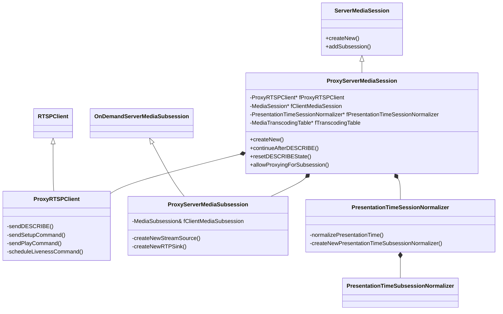
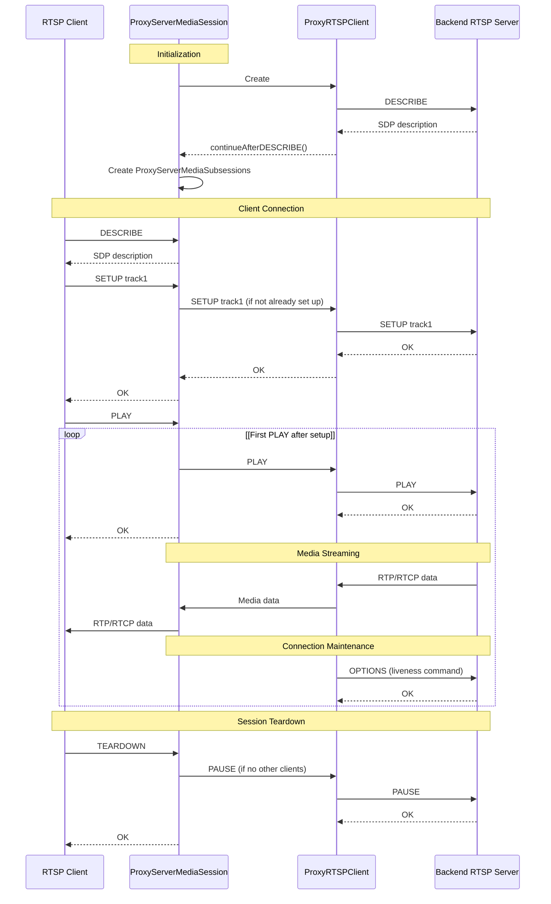
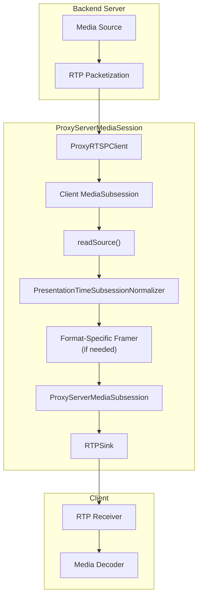
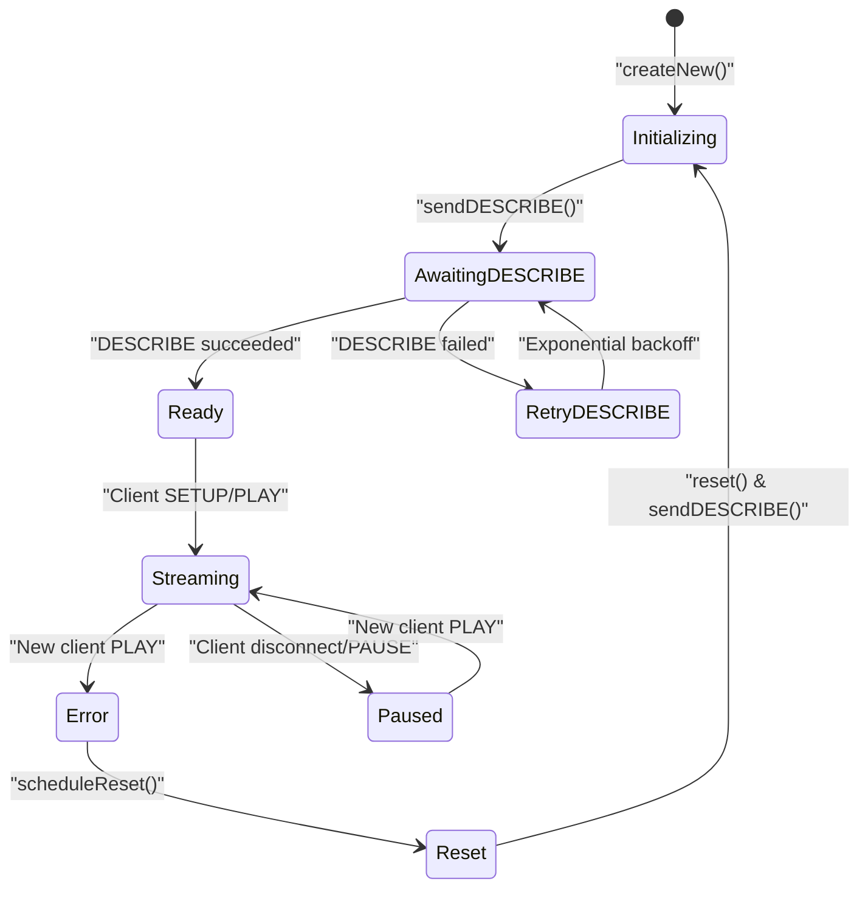
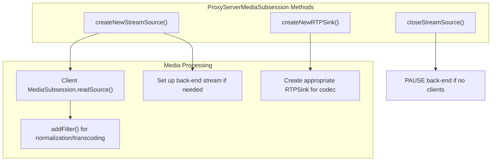

# ProxyServerMediaSession

> **Relevant source files**
> * [liveMedia/ProxyServerMediaSession.cpp](https://github.com/rgaufman/live555/blob/a0eb8f91/liveMedia/ProxyServerMediaSession.cpp)
> * [liveMedia/include/ProxyServerMediaSession.hh](https://github.com/rgaufman/live555/blob/a0eb8f91/liveMedia/include/ProxyServerMediaSession.hh)

## Purpose and Overview

The `ProxyServerMediaSession` is a core component of the LIVE555 streaming media library that provides a mechanism for proxying RTSP/RTP streams. It creates a unicast RTSP server endpoint that acts as a proxy for another RTSP/RTP stream (which can be either unicast or multicast). This allows for stream relaying, format conversion, access control, and other intermediary operations between a backend media server and clients.

For information about the general RTSP server functionality, see [RTSP Media Server](/rgaufman/live555/3-rtsp-media-server) and [RTSPServer and GenericMediaServer](/rgaufman/live555/3.1-rtspserver-and-genericmediaserver). For details on server media sessions in general, see [Media Session Management](/rgaufman/live555/4-media-session-management).

Sources: [liveMedia/include/ProxyServerMediaSession.hh L18-L19](https://github.com/rgaufman/live555/blob/a0eb8f91/liveMedia/include/ProxyServerMediaSession.hh#L18-L19)

 [liveMedia/ProxyServerMediaSession.cpp L18-L19](https://github.com/rgaufman/live555/blob/a0eb8f91/liveMedia/ProxyServerMediaSession.cpp#L18-L19)

## Architecture and Components

The `ProxyServerMediaSession` extends the library's `ServerMediaSession` class to implement the proxying functionality. It works in close conjunction with several related classes:



Key components include:

1. **ProxyServerMediaSession**: Main class that manages the proxying of an RTSP stream.
2. **ProxyRTSPClient**: Handles communication with the backend RTSP server, sending commands like DESCRIBE, SETUP, and PLAY.
3. **ProxyServerMediaSubsession**: Represents each media track (audio, video, etc.) being proxied.
4. **PresentationTimeSessionNormalizer**: Adjusts presentation timestamps to ensure proper synchronization.

Sources: [liveMedia/include/ProxyServerMediaSession.hh L101-L176](https://github.com/rgaufman/live555/blob/a0eb8f91/liveMedia/include/ProxyServerMediaSession.hh#L101-L176)

 [liveMedia/ProxyServerMediaSession.cpp L95-L193](https://github.com/rgaufman/live555/blob/a0eb8f91/liveMedia/ProxyServerMediaSession.cpp#L95-L193)

## Proxying Workflow

The following diagram illustrates the typical workflow of the `ProxyServerMediaSession`:



Sources: [liveMedia/ProxyServerMediaSession.cpp L159-L181](https://github.com/rgaufman/live555/blob/a0eb8f91/liveMedia/ProxyServerMediaSession.cpp#L159-L181)

 [liveMedia/ProxyServerMediaSession.cpp L402-L419](https://github.com/rgaufman/live555/blob/a0eb8f91/liveMedia/ProxyServerMediaSession.cpp#L402-L419)

 [liveMedia/ProxyServerMediaSession.cpp L530-L640](https://github.com/rgaufman/live555/blob/a0eb8f91/liveMedia/ProxyServerMediaSession.cpp#L530-L640)

## Creating a ProxyServerMediaSession

The `ProxyServerMediaSession` is created using its static `createNew()` method:

```
ProxyServerMediaSession* ProxyServerMediaSession::createNew(
    UsageEnvironment& env,
    GenericMediaServer* ourMediaServer,
    char const* inputStreamURL,  // the "rtsp://" URL of the stream to proxy
    char const* streamName = NULL,
    char const* username = NULL, 
    char const* password = NULL,
    portNumBits tunnelOverHTTPPortNum = 0,
    int verbosityLevel = 0,
    int socketNumToServer = -1,
    MediaTranscodingTable* transcodingTable = NULL
);
```

Key parameters include:

* `inputStreamURL`: The RTSP URL of the backend stream to proxy
* `streamName`: Name to give the proxied stream (optional)
* `username`/`password`: Authentication credentials for the backend server
* `tunnelOverHTTPPortNum`: For tunneling RTSP over HTTP or TCP
* `transcodingTable`: Optional configuration for media transcoding

Sources: [liveMedia/include/ProxyServerMediaSession.hh L103-L117](https://github.com/rgaufman/live555/blob/a0eb8f91/liveMedia/include/ProxyServerMediaSession.hh#L103-L117)

 [liveMedia/ProxyServerMediaSession.cpp L83-L92](https://github.com/rgaufman/live555/blob/a0eb8f91/liveMedia/ProxyServerMediaSession.cpp#L83-L92)

## Media Data Flow and Processing

The following diagram shows how media data flows through the `ProxyServerMediaSession`:



Key aspects of the media processing pipeline:

1. **Source Stream Reception**: The `ProxyRTSPClient` receives RTP packets from the backend server.
2. **Time Normalization**: `PresentationTimeSessionNormalizer` and `PresentationTimeSubsessionNormalizer` adjust presentation timestamps to align with wall-clock time.
3. **Format-Specific Processing**: Depending on the codec, additional processing may be applied (e.g., H.264 framing).
4. **Transcoding**: If a `MediaTranscodingTable` is provided, media conversion can be performed.
5. **RTP Packetization**: Media is re-packetized into RTP packets for delivery to clients.

Sources: [liveMedia/ProxyServerMediaSession.cpp L530-L640](https://github.com/rgaufman/live555/blob/a0eb8f91/liveMedia/ProxyServerMediaSession.cpp#L530-L640)

 [liveMedia/ProxyServerMediaSession.cpp L671-L795](https://github.com/rgaufman/live555/blob/a0eb8f91/liveMedia/ProxyServerMediaSession.cpp#L671-L795)

 [liveMedia/ProxyServerMediaSession.cpp L834-L948](https://github.com/rgaufman/live555/blob/a0eb8f91/liveMedia/ProxyServerMediaSession.cpp#L834-L948)

## Time Normalization

A critical aspect of media proxying is ensuring proper timing alignment of the incoming streams. The `ProxyServerMediaSession` uses two specialized classes for this purpose:

1. **PresentationTimeSessionNormalizer**: Manages timing across the entire session
2. **PresentationTimeSubsessionNormalizer**: Handles timing for individual media tracks

These normalizers adjust presentation timestamps to:

* Align with wall-clock time
* Maintain proper synchronization between audio and video tracks
* Enable accurate RTCP reporting

Sources: [liveMedia/include/ProxyServerMediaSession.hh L180-L236](https://github.com/rgaufman/live555/blob/a0eb8f91/liveMedia/include/ProxyServerMediaSession.hh#L180-L236)

 [liveMedia/ProxyServerMediaSession.cpp L834-L948](https://github.com/rgaufman/live555/blob/a0eb8f91/liveMedia/ProxyServerMediaSession.cpp#L834-L948)

## Error Recovery and Connection Maintenance

The `ProxyServerMediaSession` includes several mechanisms to maintain a robust connection to the backend server:

1. **Liveness Commands**: Sends periodic OPTIONS commands to keep the connection alive
2. **Error Recovery**: Automatically reconnects if the connection to the backend server is lost
3. **Exponential Backoff**: When DESCRIBE fails, retries with increasing delays
4. **Session Reset**: Can fully reset the connection state and re-establish streaming



Sources: [liveMedia/ProxyServerMediaSession.cpp L402-L468](https://github.com/rgaufman/live555/blob/a0eb8f91/liveMedia/ProxyServerMediaSession.cpp#L402-L468)

 [liveMedia/ProxyServerMediaSession.cpp L814-L830](https://github.com/rgaufman/live555/blob/a0eb8f91/liveMedia/ProxyServerMediaSession.cpp#L814-L830)

## Advanced Features and Extensions

The `ProxyServerMediaSession` provides several mechanisms for customization:

1. **Selective Proxying**: The `allowProxyingForSubsession()` method can be overridden to selectively proxy specific media tracks.
2. **Transcoding**: Through the `MediaTranscodingTable`, media formats can be converted during proxying.
3. **Custom RTSP Client**: By subclassing `ProxyRTSPClient` and providing a custom creation function.
4. **Network Configuration**: Methods like `createGroupsock()` and `createRTCP()` can be overridden to customize network behavior.

Sources: [liveMedia/include/ProxyServerMediaSession.hh L129-L156](https://github.com/rgaufman/live555/blob/a0eb8f91/liveMedia/include/ProxyServerMediaSession.hh#L129-L156)

 [liveMedia/ProxyServerMediaSession.cpp L153-L157](https://github.com/rgaufman/live555/blob/a0eb8f91/liveMedia/ProxyServerMediaSession.cpp#L153-L157)

 [liveMedia/ProxyServerMediaSession.cpp L547-L564](https://github.com/rgaufman/live555/blob/a0eb8f91/liveMedia/ProxyServerMediaSession.cpp#L547-L564)

## Implementation Details

### ProxyServerMediaSubsession

The `ProxyServerMediaSubsession` class handles the details of proxying individual media tracks. It:

1. Creates appropriate media sources and sinks based on codec type
2. Manages the setup and teardown of individual tracks
3. Handles format-specific requirements for different codecs



The class handles various codec types differently, with special processing for:

* H.264/H.265 (adds discrete framers)
* MPEG-4 Video (adds video framers)
* MP3 Audio (handles robust audio streaming)
* JPEG (handles direct payload copying)

Sources: [liveMedia/ProxyServerMediaSession.cpp L509-L648](https://github.com/rgaufman/live555/blob/a0eb8f91/liveMedia/ProxyServerMediaSession.cpp#L509-L648)

 [liveMedia/ProxyServerMediaSession.cpp L671-L795](https://github.com/rgaufman/live555/blob/a0eb8f91/liveMedia/ProxyServerMediaSession.cpp#L671-L795)

### ProxyRTSPClient

The `ProxyRTSPClient` class manages the communication with the backend RTSP server. Key responsibilities include:

1. Sending RTSP commands (DESCRIBE, SETUP, PLAY, etc.)
2. Managing the connection state
3. Handling responses and error conditions
4. Maintaining the connection with liveness commands

It also manages a queue of `ProxyServerMediaSubsession` objects that are waiting to be set up, ensuring that commands are sent in the proper sequence.

Sources: [liveMedia/include/ProxyServerMediaSession.hh L42-L85](https://github.com/rgaufman/live555/blob/a0eb8f91/liveMedia/include/ProxyServerMediaSession.hh#L42-L85)

 [liveMedia/ProxyServerMediaSession.cpp L239-L504](https://github.com/rgaufman/live555/blob/a0eb8f91/liveMedia/ProxyServerMediaSession.cpp#L239-L504)

## Summary

The `ProxyServerMediaSession` provides a powerful mechanism for RTSP stream proxying in the LIVE555 library. It handles the complexities of RTSP protocol management, media data flow, timing synchronization, and error recovery. By extending `ServerMediaSession`, it fits seamlessly into the LIVE555 architecture while adding specialized functionality for stream proxying.

Common use cases include:

* Stream relaying between networks
* Format conversion and transcoding
* Adding access control to existing streams
* Protocol conversion (e.g., multicast to unicast)
* Load distribution

Sources: [liveMedia/include/ProxyServerMediaSession.hh L18-L19](https://github.com/rgaufman/live555/blob/a0eb8f91/liveMedia/include/ProxyServerMediaSession.hh#L18-L19)

 [liveMedia/ProxyServerMediaSession.cpp L18-L19](https://github.com/rgaufman/live555/blob/a0eb8f91/liveMedia/ProxyServerMediaSession.cpp#L18-L19)