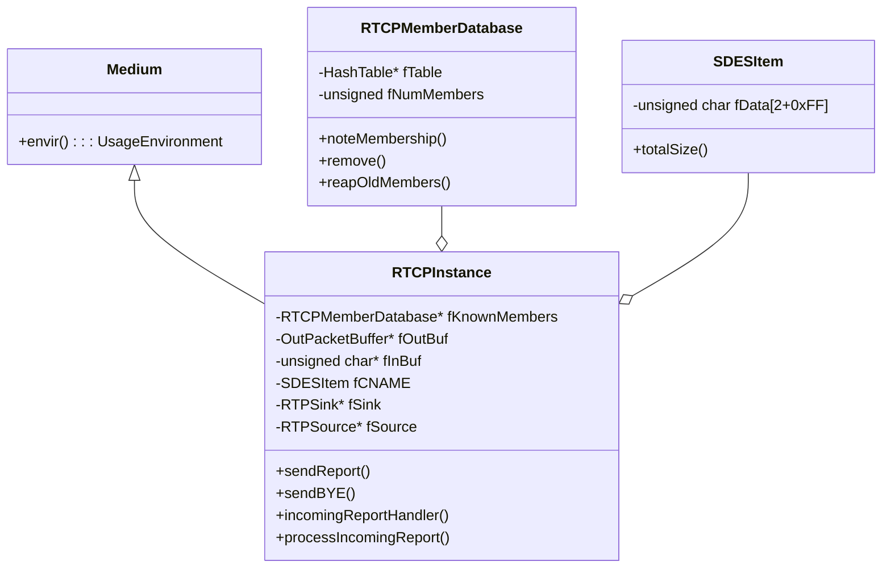
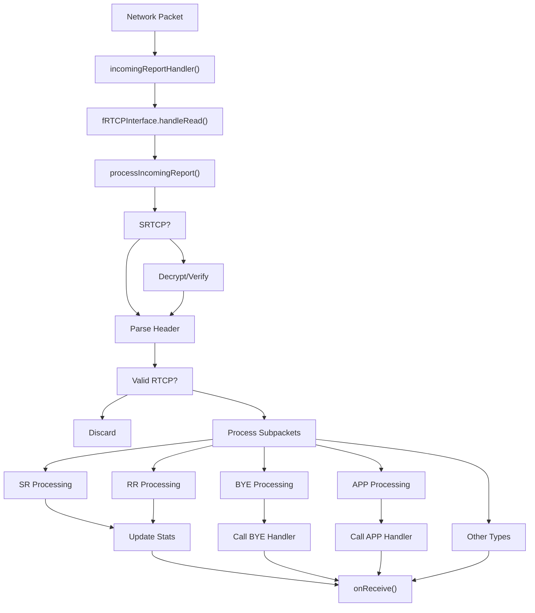
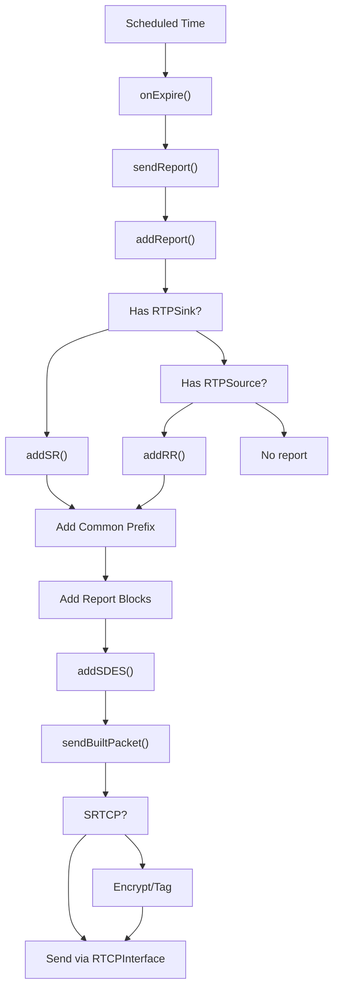
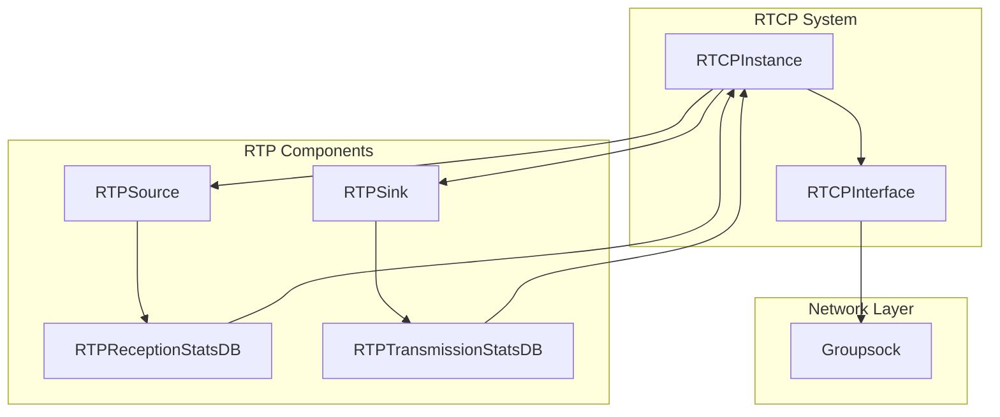

# RTCP Implementation

> **Relevant source files**
> * [liveMedia/RTCP.cpp](https://github.com/rgaufman/live555/blob/a0eb8f91/liveMedia/RTCP.cpp)

## Overview

The Real-time Transport Control Protocol (RTCP) implementation in Live555 provides feedback and control mechanisms for RTP sessions. This document explains the RTCP architecture, classes, processing flow, and integration with other Live555 components. For information about the RTP interface, see [RTP Interface](/rgaufman/live555/5.1-rtp-interface).

Sources: [liveMedia/RTCP.cpp L16-L21](https://github.com/rgaufman/live555/blob/a0eb8f91/liveMedia/RTCP.cpp#L16-L21)

## Architecture

RTCP functionality is primarily implemented through three key classes:

1. `RTCPInstance`: Main class that handles RTCP report generation, packet processing, and timing
2. `RTCPMemberDatabase`: Manages session participants through their SSRC identifiers
3. `SDESItem`: Represents RTCP Source Description items (like CNAME)

### Class Relationships



Sources: [liveMedia/RTCP.cpp L30-L108](https://github.com/rgaufman/live555/blob/a0eb8f91/liveMedia/RTCP.cpp#L30-L108)

 [liveMedia/RTCP.cpp L113-L1378](https://github.com/rgaufman/live555/blob/a0eb8f91/liveMedia/RTCP.cpp#L113-L1378)

 [liveMedia/RTCP.cpp L1279-L1293](https://github.com/rgaufman/live555/blob/a0eb8f91/liveMedia/RTCP.cpp#L1279-L1293)

## RTCPInstance

The `RTCPInstance` class is the core of the RTCP implementation, created using the static `createNew()` method. It maintains session state and handles both outgoing and incoming RTCP packets.

### Initialization and Configuration

```
RTCPInstance* RTCPInstance::createNew(UsageEnvironment& env, Groupsock* RTCPgs,
                                     unsigned totSessionBW,
                                     unsigned char const* cname,
                                     RTPSink* sink, RTPSource* source,
                                     Boolean isSSMTransmitter,
                                     SRTPCryptographicContext* crypt)
```

Key initialization parameters:

* `totSessionBW`: Total session bandwidth in kbps (used to calculate RTCP bandwidth)
* `cname`: Canonical name identifier for this participant
* `sink`/`source`: Optional RTP sink or source objects
* `isSSMTransmitter`: For Source-Specific Multicast mode
* `crypt`: For secure RTCP (SRTCP) support

Sources: [liveMedia/RTCP.cpp L123-L163](https://github.com/rgaufman/live555/blob/a0eb8f91/liveMedia/RTCP.cpp#L123-L163)

 [liveMedia/RTCP.cpp L249-L257](https://github.com/rgaufman/live555/blob/a0eb8f91/liveMedia/RTCP.cpp#L249-L257)

### Handler Registration

`RTCPInstance` provides methods to register handlers for different RTCP packet types:

| Method | Purpose |
| --- | --- |
| `setByeHandler()` | Register handler for BYE packets |
| `setSRHandler()` | Register handler for Sender Reports |
| `setRRHandler()` | Register handler for Receiver Reports |
| `setSpecificRRHandler()` | Register handler for RRs from specific sources |
| `setAppHandler()` | Register handler for application-specific packets |

Sources: [liveMedia/RTCP.cpp L292-L353](https://github.com/rgaufman/live555/blob/a0eb8f91/liveMedia/RTCP.cpp#L292-L353)

## RTCP Packet Types

RTCP packets processed by Live555 include:

| Packet Type | Value | Description | Implementation Support |
| --- | --- | --- | --- |
| SR | 200 | Sender Report | Full |
| RR | 201 | Receiver Report | Full |
| SDES | 202 | Source Description | Basic (primarily CNAME) |
| BYE | 203 | End of Participation | Full |
| APP | 204 | Application-specific | Full |
| RTPFB | 205 | Generic RTP Feedback | Recognized but minimal |
| PSFB | 206 | Payload-specific Feedback | Recognized but minimal |
| XR | 207 | Extended Report | Recognized but minimal |

Sources: [liveMedia/RTCP.cpp L545-L831](https://github.com/rgaufman/live555/blob/a0eb8f91/liveMedia/RTCP.cpp#L545-L831)

## RTCP Packet Processing Flow

### Incoming Packet Processing



Sources: [liveMedia/RTCP.cpp L431-L508](https://github.com/rgaufman/live555/blob/a0eb8f91/liveMedia/RTCP.cpp#L431-L508)

 [liveMedia/RTCP.cpp L510-L896](https://github.com/rgaufman/live555/blob/a0eb8f91/liveMedia/RTCP.cpp#L510-L896)

### Outgoing Packet Generation



Sources: [liveMedia/RTCP.cpp L917-L936](https://github.com/rgaufman/live555/blob/a0eb8f91/liveMedia/RTCP.cpp#L917-L936)

 [liveMedia/RTCP.cpp L1002-L1025](https://github.com/rgaufman/live555/blob/a0eb8f91/liveMedia/RTCP.cpp#L1002-L1025)

 [liveMedia/RTCP.cpp L1027-L1051](https://github.com/rgaufman/live555/blob/a0eb8f91/liveMedia/RTCP.cpp#L1027-L1051)

 [liveMedia/RTCP.cpp L1163-L1192](https://github.com/rgaufman/live555/blob/a0eb8f91/liveMedia/RTCP.cpp#L1163-L1192)

 [liveMedia/RTCP.cpp L953-L975](https://github.com/rgaufman/live555/blob/a0eb8f91/liveMedia/RTCP.cpp#L953-L975)

## RTCP Member Database

The `RTCPMemberDatabase` class tracks session participants using their SSRC identifiers. It's responsible for:

1. Recording active session members
2. Removing members who have left the session
3. Pruning stale members that haven't been heard from recently

Key methods:

```
Boolean noteMembership(u_int32_t ssrc, unsigned curTimeCount);
Boolean remove(u_int32_t ssrc);
void reapOldMembers(unsigned threshold);
```

The database is used to calculate the appropriate RTCP bandwidth, which scales inversely with the number of participants as per RFC 3550.

Sources: [liveMedia/RTCP.cpp L30-L76](https://github.com/rgaufman/live555/blob/a0eb8f91/liveMedia/RTCP.cpp#L30-L76)

 [liveMedia/RTCP.cpp L78-L108](https://github.com/rgaufman/live555/blob/a0eb8f91/liveMedia/RTCP.cpp#L78-L108)

## RTCP Timing

RTCP transmission follows the timing algorithm specified in RFC 3550, which ensures:

1. RTCP bandwidth is limited to 5% of session bandwidth by default
2. Report interval scales with the number of participants
3. Report timing is randomized to avoid synchronization effects

The implementation uses these key functions:

```
void schedule(double nextTime);
void reschedule(double nextTime);
void onExpire1();
```

The timing calculations are handled by functions imported from the `rtcp_from_spec.h` file, which implements the RFC 3550 algorithms.

Sources: [liveMedia/RTCP.cpp L1242-L1253](https://github.com/rgaufman/live555/blob/a0eb8f91/liveMedia/RTCP.cpp#L1242-L1253)

 [liveMedia/RTCP.cpp L1255-L1258](https://github.com/rgaufman/live555/blob/a0eb8f91/liveMedia/RTCP.cpp#L1255-L1258)

 [liveMedia/RTCP.cpp L1260-L1277](https://github.com/rgaufman/live555/blob/a0eb8f91/liveMedia/RTCP.cpp#L1260-L1277)

 [liveMedia/RTCP.cpp L1296-L1387](https://github.com/rgaufman/live555/blob/a0eb8f91/liveMedia/RTCP.cpp#L1296-L1387)

## Integration with RTP Components



RTCP integrates with RTP components through:

1. **Statistics Exchange**: * `RTCPInstance` updates the `RTPReceptionStatsDB` in `RTPSource` with SR data * `RTCPInstance` updates the `RTPTransmissionStatsDB` in `RTPSink` with RR data
2. **Packet Handling**: * Support for multiplexed RTP/RTCP via `registerForMultiplexedRTCPPackets()` * Uses `Groupsock` for network communication, shared with RTP
3. **Timestamp Synchronization**: * SR packets include mappings between RTP timestamps and NTP time * Used for inter-media synchronization

Sources: [liveMedia/RTCP.cpp L164-L177](https://github.com/rgaufman/live555/blob/a0eb8f91/liveMedia/RTCP.cpp#L164-L177)

 [liveMedia/RTCP.cpp L582-L597](https://github.com/rgaufman/live555/blob/a0eb8f91/liveMedia/RTCP.cpp#L582-L597)

 [liveMedia/RTCP.cpp L613-L636](https://github.com/rgaufman/live555/blob/a0eb8f91/liveMedia/RTCP.cpp#L613-L636)

## SDES Implementation

Source Description (SDES) is implemented via the `SDESItem` class and is used to transmit information about the source. Currently, Live555 primarily supports the CNAME item.

```javascript
class SDESItem {
public:
  SDESItem(unsigned char tag, unsigned char const* value);
  unsigned char const* data() const { return fData; }
  unsigned totalSize() const;
private:
  unsigned char fData[2+0xFF]; // 1 byte tag + 1 byte length + up to 255 bytes value
};
```

SDES items are added to every RTCP packet sent using the `addSDES()` method, which formats the items according to RFC 3550.

Sources: [liveMedia/RTCP.cpp L1163-L1192](https://github.com/rgaufman/live555/blob/a0eb8f91/liveMedia/RTCP.cpp#L1163-L1192)

 [liveMedia/RTCP.cpp L1279-L1293](https://github.com/rgaufman/live555/blob/a0eb8f91/liveMedia/RTCP.cpp#L1279-L1293)

## Security - SRTCP Support

Live555 supports Secure RTCP (SRTCP) through integration with the `SRTPCryptographicContext` class:

1. Outgoing RTCP packets can be encrypted and authenticated
2. Incoming SRTCP packets are verified and decrypted
3. The crypto context can be provided during construction or via an associated RTP sink

Key methods:

* `setupForSRTCP()`: Initializes the SRTCP crypto context
* Processing in `sendBuiltPacket()` and `processIncomingReport()`

Sources: [liveMedia/RTCP.cpp L286-L290](https://github.com/rgaufman/live555/blob/a0eb8f91/liveMedia/RTCP.cpp#L286-L290)

 [liveMedia/RTCP.cpp L514-L518](https://github.com/rgaufman/live555/blob/a0eb8f91/liveMedia/RTCP.cpp#L514-L518)

 [liveMedia/RTCP.cpp L964-L967](https://github.com/rgaufman/live555/blob/a0eb8f91/liveMedia/RTCP.cpp#L964-L967)

## Application-Specific Extensions

APP packets allow for application-specific extensions to RTCP. Live555 provides a complete implementation for sending and receiving these packets:

```
void sendAppPacket(u_int8_t subtype, char const* name,
                  u_int8_t* appDependentData, unsigned appDependentDataSize);
void setAppHandler(RTCPAppHandlerFunc* handlerTask, void* clientData);
```

The format follows RFC 3550, with:

* A 5-bit subtype field
* A 4-byte name field
* Application-dependent data of variable length

Sources: [liveMedia/RTCP.cpp L350-L353](https://github.com/rgaufman/live555/blob/a0eb8f91/liveMedia/RTCP.cpp#L350-L353)

 [liveMedia/RTCP.cpp L355-L388](https://github.com/rgaufman/live555/blob/a0eb8f91/liveMedia/RTCP.cpp#L355-L388)

 [liveMedia/RTCP.cpp L690-L717](https://github.com/rgaufman/live555/blob/a0eb8f91/liveMedia/RTCP.cpp#L690-L717)

## RTCP Reflection for SSM

For Source-Specific Multicast scenarios, the `RTCPInstance` can be configured as an SSM transmitter, which will reflect received RTCP packets back to the multicast group:

```
Boolean fIsSSMTransmitter;
```

This ensures that in SSM environments, where receivers cannot communicate directly with each other, all participants still receive everyone's RTCP reports.

Sources: [liveMedia/RTCP.cpp L482-L503](https://github.com/rgaufman/live555/blob/a0eb8f91/liveMedia/RTCP.cpp#L482-L503)