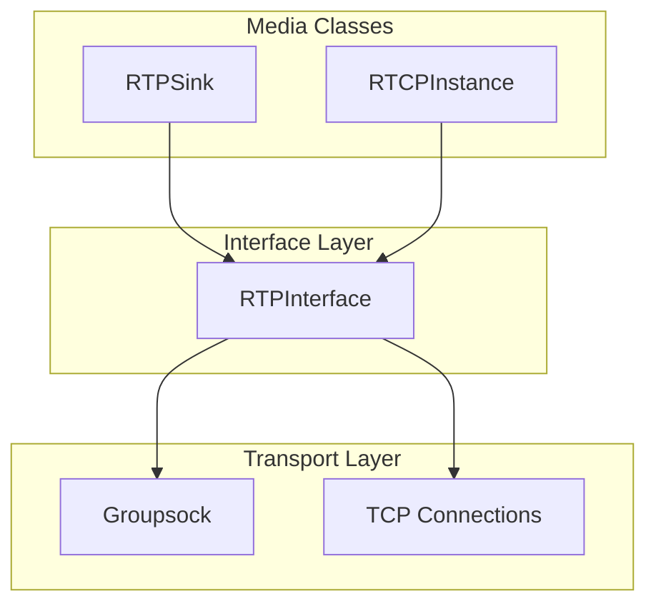
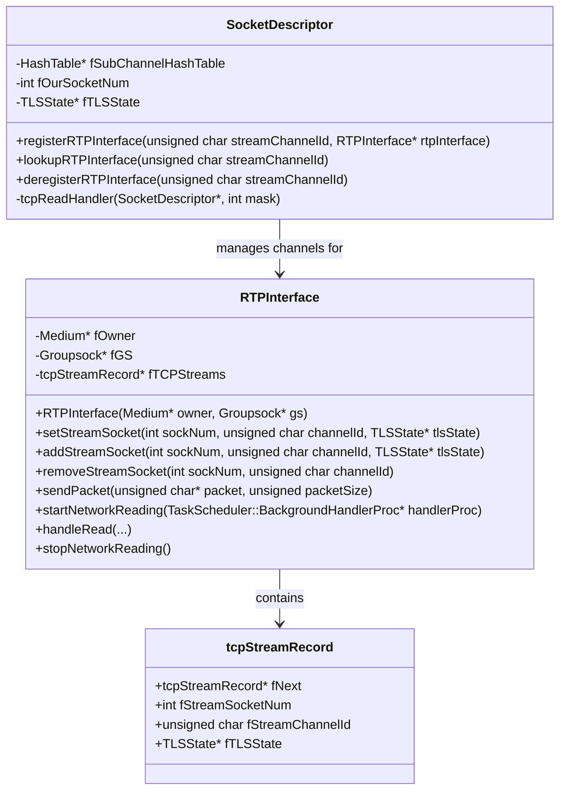
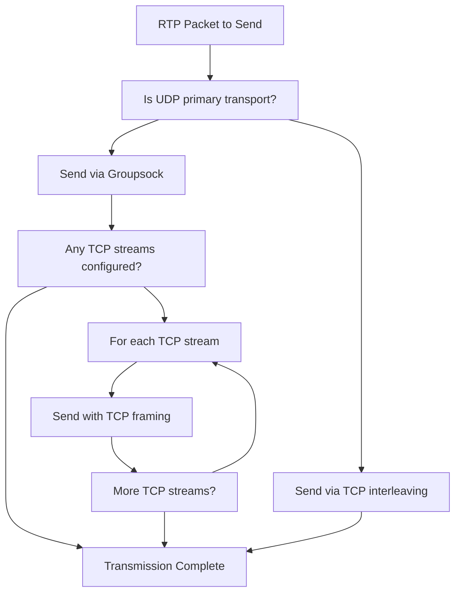
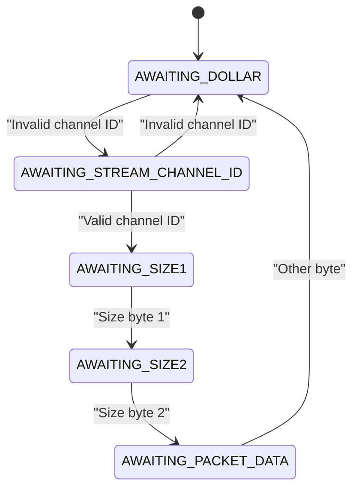
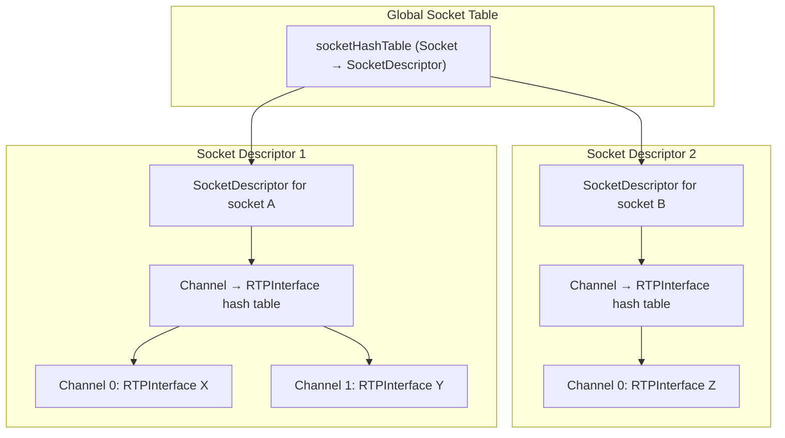
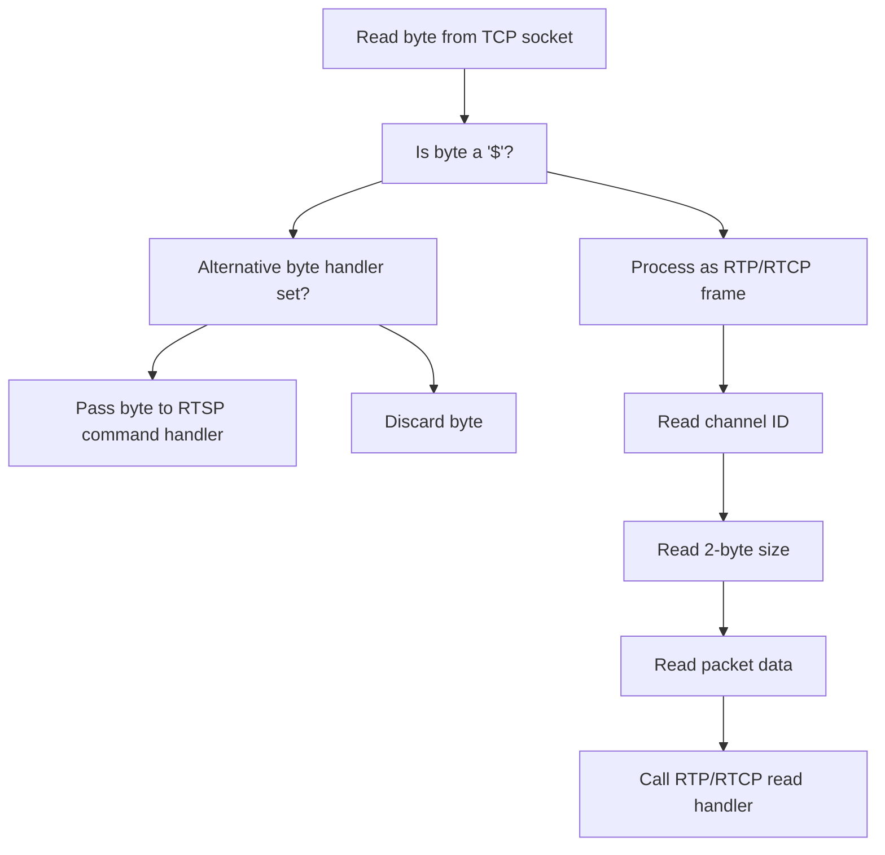
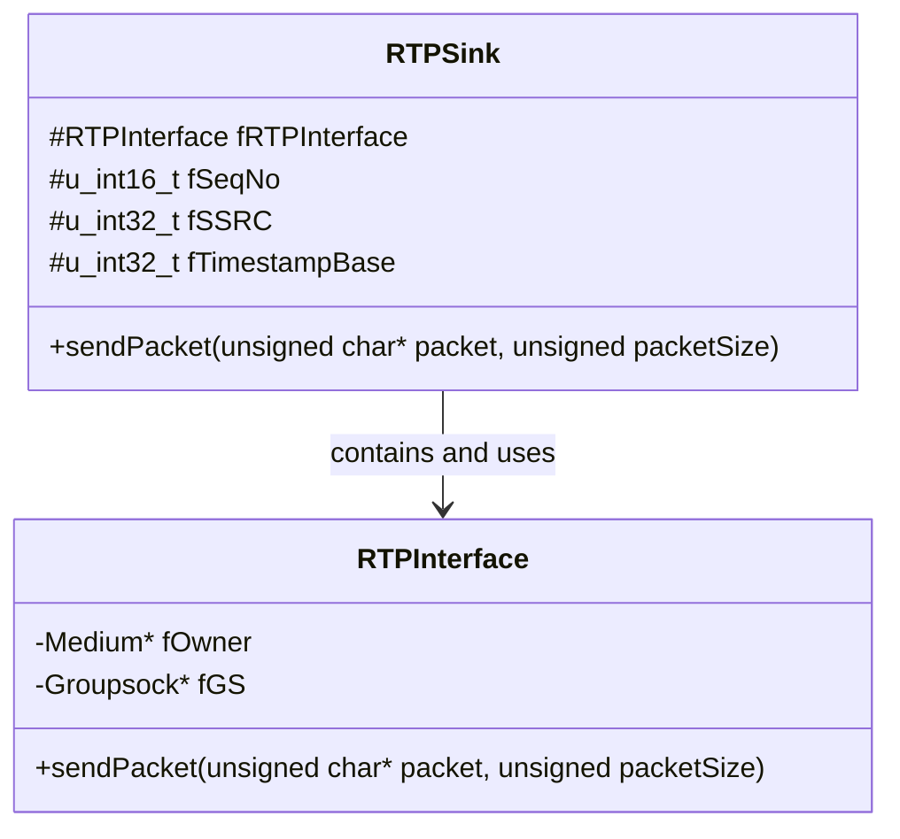

# RTP Interface

> **Relevant source files**
> * [liveMedia/RTPInterface.cpp](https://github.com/rgaufman/live555/blob/a0eb8f91/liveMedia/RTPInterface.cpp)
> * [liveMedia/RTPSink.cpp](https://github.com/rgaufman/live555/blob/a0eb8f91/liveMedia/RTPSink.cpp)
> * [liveMedia/include/RTPInterface.hh](https://github.com/rgaufman/live555/blob/a0eb8f91/liveMedia/include/RTPInterface.hh)

The RTP Interface provides an abstraction layer for network interfaces used for RTP (Real-time Transport Protocol) and RTCP (RTP Control Protocol) packet transmission within the live555 streaming media library. It transparently handles packet transmission over both UDP and TCP protocols, including support for the "RTP-over-TCP hack" defined in RFC 2326, section 10.12. This allows streaming media to be delivered over TCP connections when necessary, providing fallback capabilities for network environments where UDP is blocked or unreliable.

For information about the RTCP implementation specifically, see [RTCP Implementation](/rgaufman/live555/5.2-rtcp-implementation).

## Architecture Overview

The RTP Interface serves as a bridge between media components (such as RTPSink) and network transport (primarily Groupsock).



Sources: [liveMedia/include/RTPInterface.hh L46-L113](https://github.com/rgaufman/live555/blob/a0eb8f91/liveMedia/include/RTPInterface.hh#L46-L113)

 [liveMedia/RTPSink.cpp L167-L168](https://github.com/rgaufman/live555/blob/a0eb8f91/liveMedia/RTPSink.cpp#L167-L168)

## Class Structure

The RTP Interface implementation consists of several interconnected classes that work together to provide seamless RTP/RTCP transmission over different transport protocols.



Sources: [liveMedia/include/RTPInterface.hh L46-L113](https://github.com/rgaufman/live555/blob/a0eb8f91/liveMedia/include/RTPInterface.hh#L46-L113)

 [liveMedia/RTPInterface.cpp L32-L44](https://github.com/rgaufman/live555/blob/a0eb8f91/liveMedia/RTPInterface.cpp#L32-L44)

 [liveMedia/RTPInterface.cpp L62-L91](https://github.com/rgaufman/live555/blob/a0eb8f91/liveMedia/RTPInterface.cpp#L62-L91)

## Transport Mechanisms

The RTP Interface supports multiple transport mechanisms for RTP/RTCP packet delivery:

| Transport Method | Implementation | Use Case |
| --- | --- | --- |
| UDP (standard) | Uses Groupsock for sending/receiving | Default transport for RTP/RTCP |
| TCP interleaving | Frames packets with `$<channelId><size><data>` format | Used when UDP is blocked or for tunneling |
| TLS encryption | Integrates with TLSState for secure transmission | Secure streaming scenarios |

### Transport Selection Process



Sources: [liveMedia/RTPInterface.cpp L233-L251](https://github.com/rgaufman/live555/blob/a0eb8f91/liveMedia/RTPInterface.cpp#L233-L251)

 [liveMedia/RTPInterface.cpp L342-L374](https://github.com/rgaufman/live555/blob/a0eb8f91/liveMedia/RTPInterface.cpp#L342-L374)

## RTP-over-TCP Implementation

The RTP Interface implements the RTP-over-TCP interleaving mechanism as defined in RFC 2326 (RTSP), section 10.12. This allows RTP and RTCP packets to be sent over the same TCP connection used for RTSP control commands.

### Framing Format

Each RTP/RTCP packet is framed with a header:

```
+------+------+------+------+------+------+------+------+--
| '$' | Channel ID | Length (2 bytes) | RTP/RTCP packet ...
+------+------+------+------+------+------+------+------+--
```

Where:

* `$` is a dollar sign byte (0x24)
* Channel ID is a 1-byte identifier (typically 0-1 for RTP, 2-3 for RTCP)
* Length is a 2-byte network byte order (big-endian) value
* Followed by the actual RTP/RTCP packet data

### State Machine for Receiving

The TCP receiver implements a state machine to parse the framed packets:



Sources: [liveMedia/RTPInterface.cpp L349-L373](https://github.com/rgaufman/live555/blob/a0eb8f91/liveMedia/RTPInterface.cpp#L349-L373)

 [liveMedia/RTPInterface.cpp L525-L546](https://github.com/rgaufman/live555/blob/a0eb8f91/liveMedia/RTPInterface.cpp#L525-L546)

 [liveMedia/RTPInterface.cpp L90](https://github.com/rgaufman/live555/blob/a0eb8f91/liveMedia/RTPInterface.cpp#L90-L90)

## TCP Socket Management

The RTP Interface uses a sophisticated mechanism to track and manage TCP socket connections:

1. A global hash table (`socketHashTable`) maps TCP socket numbers to `SocketDescriptor` objects
2. Each `SocketDescriptor` maintains its own hash table of channel IDs to `RTPInterface` instances
3. This two-level hash structure allows multiple RTP/RTCP streams to share a single TCP connection



Sources: [liveMedia/RTPInterface.cpp L51-L60](https://github.com/rgaufman/live555/blob/a0eb8f91/liveMedia/RTPInterface.cpp#L51-L60)

 [liveMedia/RTPInterface.cpp L93-L115](https://github.com/rgaufman/live555/blob/a0eb8f91/liveMedia/RTPInterface.cpp#L93-L115)

 [liveMedia/RTPInterface.cpp L470-L492](https://github.com/rgaufman/live555/blob/a0eb8f91/liveMedia/RTPInterface.cpp#L470-L492)

## Handling RTSP Commands

When RTP is being transmitted over TCP using interleaving, RTSP commands may arrive on the same connection. The RTP Interface provides a mechanism to handle this scenario using an alternative byte handler:



Sources: [liveMedia/RTPInterface.cpp L552-L564](https://github.com/rgaufman/live555/blob/a0eb8f91/liveMedia/RTPInterface.cpp#L552-L564)

 [liveMedia/RTPInterface.cpp L223-L230](https://github.com/rgaufman/live555/blob/a0eb8f91/liveMedia/RTPInterface.cpp#L223-L230)

 [liveMedia/RTPInterface.cpp L72-L75](https://github.com/rgaufman/live555/blob/a0eb8f91/liveMedia/RTPInterface.cpp#L72-L75)

## Integration with RTPSink

The `RTPSink` class, which represents a sink for RTP packets, contains an `RTPInterface` as a member variable and uses it to transmit packets:



Sources: [liveMedia/RTPSink.cpp L167-L168](https://github.com/rgaufman/live555/blob/a0eb8f91/liveMedia/RTPSink.cpp#L167-L168)

 [liveMedia/RTPSink.cpp L172-L173](https://github.com/rgaufman/live555/blob/a0eb8f91/liveMedia/RTPSink.cpp#L172-L173)

## Key Methods

### Sending Packets

The core functionality for sending packets is implemented in the `sendPacket` method:

```
Boolean RTPInterface::sendPacket(unsigned char* packet, unsigned packetSize)
```

This method first attempts to send the packet via UDP (using the Groupsock), then sends it over any configured TCP streams. If any transmission fails, it returns `False`.

For TCP transmission, the method calls `sendRTPorRTCPPacketOverTCP`, which handles the proper framing of the packet according to the RFC 2326 specification.

Sources: [liveMedia/RTPInterface.cpp L233-L251](https://github.com/rgaufman/live555/blob/a0eb8f91/liveMedia/RTPInterface.cpp#L233-L251)

 [liveMedia/RTPInterface.cpp L342-L374](https://github.com/rgaufman/live555/blob/a0eb8f91/liveMedia/RTPInterface.cpp#L342-L374)

### Network Reading

To receive RTP/RTCP packets, the RTP Interface provides the following methods:

1. `startNetworkReading`: Sets up the background handling for reading packets from both UDP and TCP sources.
2. `handleRead`: Processes received packets, handling both UDP and TCP sources appropriately.
3. `stopNetworkReading`: Stops the background packet reception.

These methods work with the TaskScheduler to implement asynchronous I/O for packet reception.

Sources: [liveMedia/RTPInterface.cpp L254-L269](https://github.com/rgaufman/live555/blob/a0eb8f91/liveMedia/RTPInterface.cpp#L254-L269)

 [liveMedia/RTPInterface.cpp L271-L327](https://github.com/rgaufman/live555/blob/a0eb8f91/liveMedia/RTPInterface.cpp#L271-L327)

 [liveMedia/RTPInterface.cpp L329-L337](https://github.com/rgaufman/live555/blob/a0eb8f91/liveMedia/RTPInterface.cpp#L329-L337)

## Error Handling and Robustness

The RTP Interface includes several mechanisms to handle network errors and maintain robustness:

1. **Non-blocking sockets**: All sockets are set to non-blocking mode to prevent stalls in the event loop.
2. **TCP send buffer handling**: If a TCP send buffer fills up, the code can temporarily switch to blocking mode with a timeout to complete the send.
3. **Socket cleanup**: When errors occur, the affected sockets are properly cleaned up.
4. **Incomplete read handling**: The code has special handling for incomplete TCP packet reads, allowing it to resume reading when more data arrives.

Sources: [liveMedia/RTPInterface.cpp L141-L145](https://github.com/rgaufman/live555/blob/a0eb8f91/liveMedia/RTPInterface.cpp#L141-L145)

 [liveMedia/RTPInterface.cpp L386-L424](https://github.com/rgaufman/live555/blob/a0eb8f91/liveMedia/RTPInterface.cpp#L386-L424)

 [liveMedia/RTPInterface.cpp L305-L319](https://github.com/rgaufman/live555/blob/a0eb8f91/liveMedia/RTPInterface.cpp#L305-L319)

## Conclusion

The RTP Interface provides a flexible abstraction for handling RTP/RTCP packet transmission over various network protocols. By supporting both UDP and TCP (with interleaving), it enables robust streaming in diverse network environments. The design promotes code reuse and separation of concerns, isolating media components from the details of network transmission.